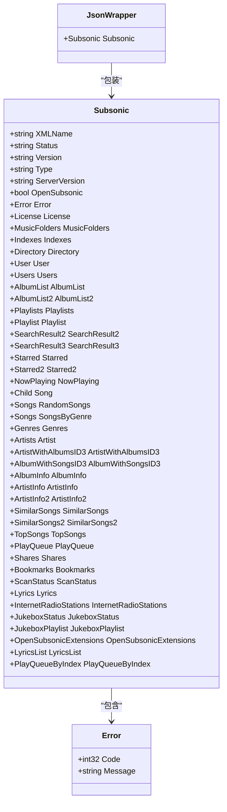
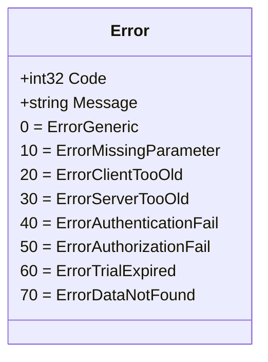
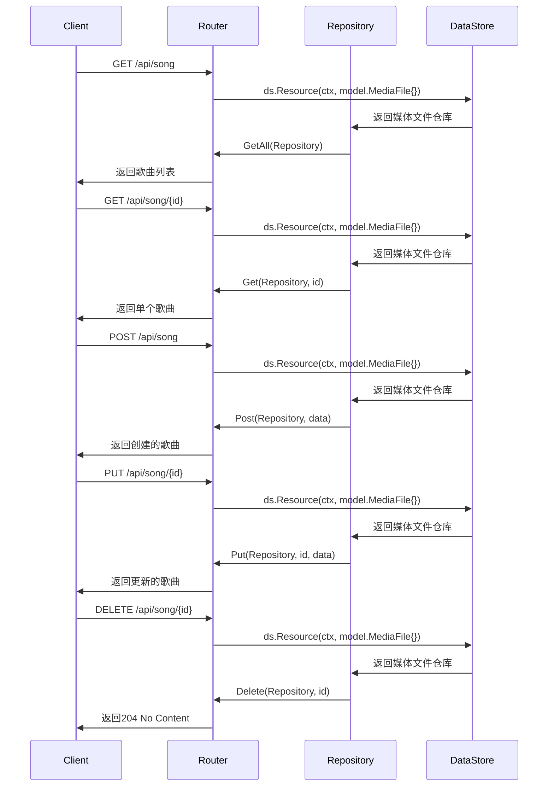
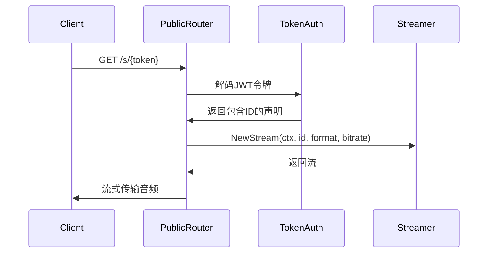
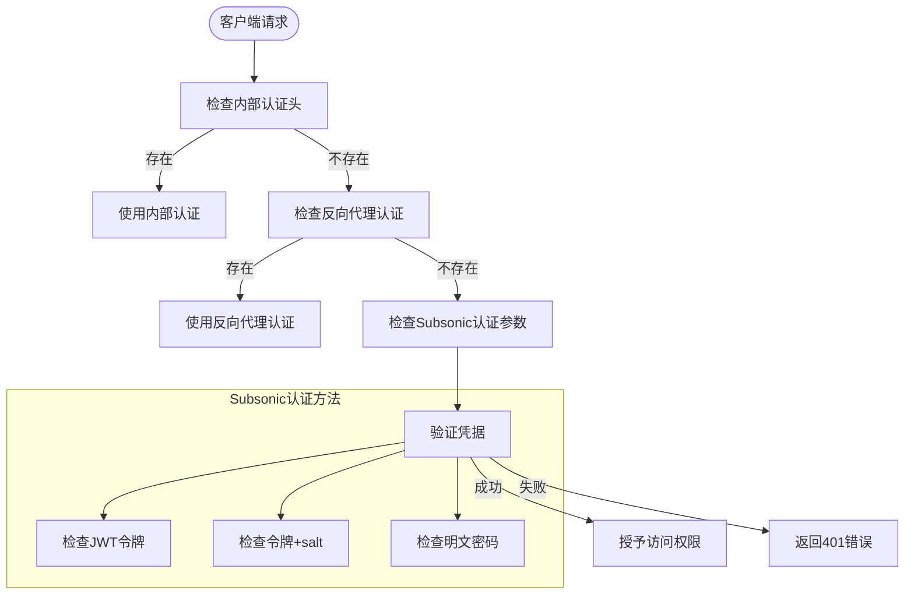
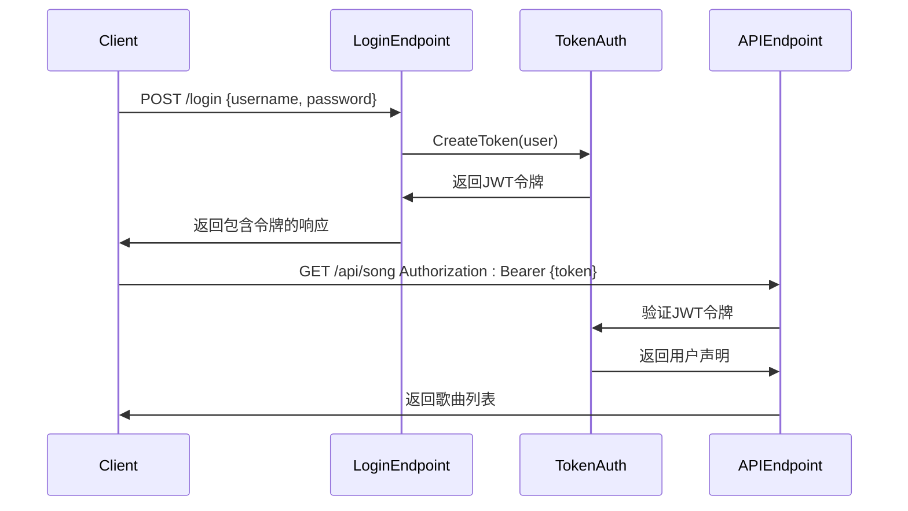
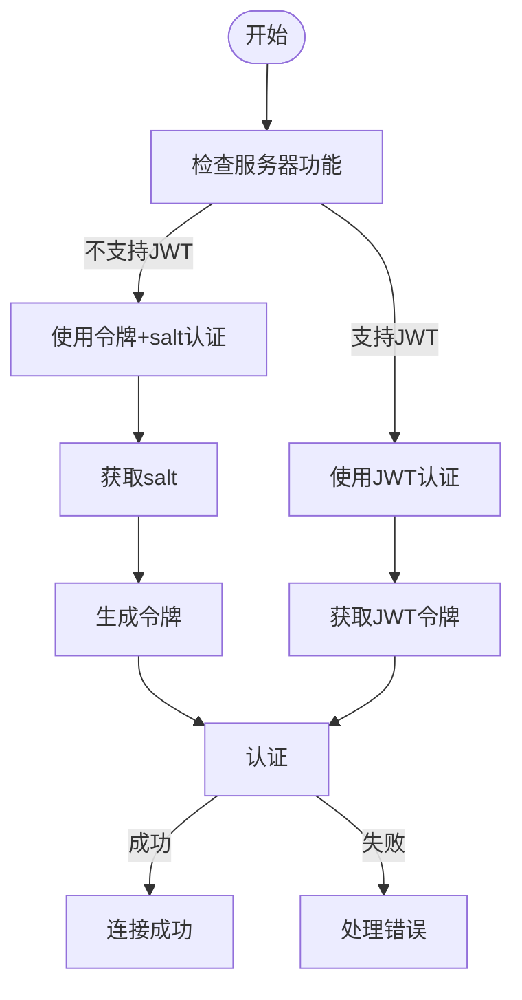
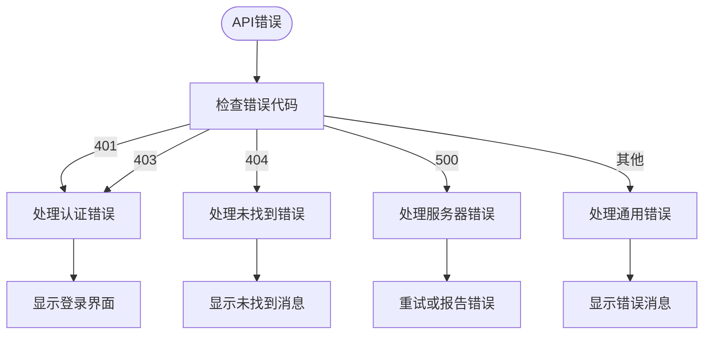

# API参考

<cite>
**本文档中引用的文件**   
- [api.go](file://server/subsonic/api.go)
- [responses.go](file://server/subsonic/responses/responses.go)
- [errors.go](file://server/subsonic/responses/errors.go)
- [browsing.go](file://server/subsonic/browsing.go)
- [stream.go](file://server/subsonic/stream.go)
- [users.go](file://server/subsonic/users.go)
- [middlewares.go](file://server/subsonic/middlewares.go)
- [searching.go](file://server/subsonic/searching.go)
- [system.go](file://server/subsonic/system.go)
- [native_api.go](file://server/nativeapi/native_api.go)
- [library.go](file://server/nativeapi/library.go)
- [public.go](file://server/public/public.go)
- [handle_streams.go](file://server/public/handle_streams.go)
- [handle_images.go](file://server/public/handle_images.go)
- [auth.go](file://server/auth.go)
</cite>

## 目录
1. [简介](#简介)
2. [Subsonic API](#subsonic-api)
3. [原生API](#原生api)
4. [公共端点](#公共端点)
5. [认证方法](#认证方法)
6. [API版本控制](#api版本控制)
7. [客户端实现指南](#客户端实现指南)
8. [性能优化技巧](#性能优化技巧)

## 简介
Navidrome提供三种主要的API接口：兼容Subsonic的API、原生RESTful API和公共端点。Subsonic API允许与各种Subsonic客户端兼容，原生API提供更现代的RESTful接口，而公共端点则用于处理公开共享的资源。所有API都遵循一致的错误处理和响应格式模式。

**API版本信息**
- Subsonic API版本：1.16.1
- OpenSubsonic扩展：支持
- 协议兼容性：Subsonic 1.16.1

**核心功能**
- 音乐库浏览和搜索
- 媒体流传输和下载
- 播放列表管理
- 用户认证和权限控制
- 元数据检索和管理
- 共享和公开访问

## Subsonic API

Subsonic API是Navidrome的主要接口，提供与Subsonic协议兼容的RESTful端点。该API支持XML和JSON响应格式，通过标准的Subsonic参数进行请求。

### HTTP方法和URL模式
Subsonic API使用标准的HTTP方法，所有端点都遵循`/rest/{endpoint}.view`或`/rest/{endpoint}`的URL模式。API支持GET和POST方法，参数可以通过查询字符串或POST表单传递。

**请求格式**
- 基础URL：`/rest/{endpoint}`
- 格式后缀：`.view`（可选）
- 支持格式：XML（默认）、JSON、JSONP

**通用请求参数**
| 参数 | 类型 | 必需 | 描述 |
|------|------|------|------|
| u | string | 是（基本认证） | 用户名 |
| p | string | 否 | 明文密码 |
| t | string | 否 | 认证令牌 |
| s | string | 否 | 随机字符串（salt） |
| token | string | 否 | 认证令牌（别名） |
| salt | string | 否 | 随机字符串（salt，别名） |
| c | string | 是 | 客户端ID |
| v | string | 是 | API协议版本 |
| f | string | 否 | 响应格式（xml, json, jsonp） |
| callback | string | 否 | JSONP回调函数名 |

### 响应格式
API响应遵循Subsonic响应结构，包含状态、版本信息和特定于端点的有效载荷。



**Diagram sources**
- [responses.go](file://server/subsonic/responses/responses.go#L9-L619)

### 错误代码
API使用标准的Subsonic错误代码，确保客户端能够正确处理各种错误情况。

| 错误代码 | HTTP状态 | 描述 |
|----------|----------|------|
| 0 | 500 | 通用错误 |
| 10 | 400 | 必需参数缺失 |
| 20 | 400 | 客户端版本过旧 |
| 30 | 400 | 服务器版本过旧 |
| 40 | 401 | 认证失败 |
| 50 | 403 | 授权失败 |
| 60 | 403 | 试用期已过 |
| 70 | 404 | 请求的数据未找到 |



**Diagram sources**
- [errors.go](file://server/subsonic/responses/errors.go#L3-L31)

### 浏览端点
浏览端点提供音乐库的层次结构访问，允许客户端浏览艺术家、专辑和歌曲。

#### 获取音乐文件夹
返回用户有权访问的音乐文件夹列表。

**端点信息**
- URL：`/rest/getMusicFolders`
- 方法：GET
- 认证：必需

**请求参数**
无

**响应示例 (JSON)**
```json
{
  "subsonic-response": {
    "status": "ok",
    "version": "1.16.1",
    "type": "navidrome",
    "serverVersion": "0.50.0",
    "openSubsonic": true,
    "musicFolders": {
      "musicFolder": [
        {
          "id": 1,
          "name": "Music"
        }
      ]
    }
  }
}
```

**Section sources**
- [api.go](file://server/subsonic/api.go#L83-L100)
- [browsing.go](file://server/subsonic/browsing.go#L20-L31)

#### 获取索引
返回按字母索引组织的艺术家列表。

**端点信息**
- URL：`/rest/getIndexes`
- 方法：GET
- 认证：必需

**请求参数**
| 参数 | 类型 | 必需 | 描述 |
|------|------|------|------|
| musicFolderId | int | 否 | 限制结果到特定音乐文件夹 |
| ifModifiedSince | long | 否 | 仅当索引自指定时间后修改时返回数据 |

**响应示例 (JSON)**
```json
{
  "subsonic-response": {
    "status": "ok",
    "version": "1.16.1",
    "indexes": {
      "lastModified": 1698765432100,
      "ignoredArticles": "The El La Los",
      "index": [
        {
          "name": "A",
          "artist": [
            {
              "id": "ar-123",
              "name": "Artist Name",
              "coverArt": "al-456",
              "artistImageUrl": "http://example.com/img/ar-123"
            }
          ]
        }
      ]
    }
  }
}
```

**Section sources**
- [api.go](file://server/subsonic/api.go#L100-L105)
- [browsing.go](file://server/subsonic/browsing.go#L100-L113)

#### 获取艺术家
返回艺术家及其专辑的详细信息。

**端点信息**
- URL：`/rest/getArtist`
- 方法：GET
- 认证：必需

**请求参数**
| 参数 | 类型 | 必需 | 描述 |
|------|------|------|------|
| id | string | 是 | 艺术家ID |

**响应示例 (JSON)**
```json
{
  "subsonic-response": {
    "status": "ok",
    "version": "1.16.1",
    "artist": {
      "id": "ar-123",
      "name": "Artist Name",
      "coverArt": "al-456",
      "artistImageUrl": "http://example.com/img/ar-123",
      "album": [
        {
          "id": "al-456",
          "name": "Album Title",
          "artist": "Artist Name",
          "artistId": "ar-123",
          "coverArt": "al-456",
          "songCount": 10,
          "duration": 2400,
          "playCount": 100,
          "created": "2023-01-01T00:00:00Z",
          "year": 2023,
          "genre": "Rock"
        }
      ]
    }
  }
}
```

**Section sources**
- [api.go](file://server/subsonic/api.go#L104-L105)
- [browsing.go](file://server/subsonic/browsing.go#L165-L186)

#### 获取音乐目录
返回指定目录的内容，可以是艺术家或专辑。

**端点信息**
- URL：`/rest/getMusicDirectory`
- 方法：GET
- 认证：必需

**请求参数**
| 参数 | 类型 | 必需 | 描述 |
|------|------|------|------|
| id | string | 是 | 目录ID（艺术家或专辑ID） |

**响应示例 (JSON)**
```json
{
  "subsonic-response": {
    "status": "ok",
    "version": "1.16.1",
    "directory": {
      "id": "al-456",
      "name": "Album Title",
      "artist": "Artist Name",
      "artistId": "ar-123",
      "coverArt": "al-456",
      "songCount": 10,
      "duration": 2400,
      "playCount": 100,
      "created": "2023-01-01T00:00:00Z",
      "year": 2023,
      "genre": "Rock",
      "child": [
        {
          "id": "so-789",
          "parent": "al-456",
          "isDir": false,
          "title": "Song Title",
          "album": "Album Title",
          "artist": "Artist Name",
          "track": 1,
          "year": 2023,
          "genre": "Rock",
          "coverArt": "al-456",
          "size": 10485760,
          "contentType": "audio/mpeg",
          "suffix": "mp3",
          "duration": 240,
          "bitRate": 320,
          "path": "Artist Name/Album Title/Song Title.mp3",
          "albumId": "al-456",
          "artistId": "ar-123",
          "type": "song",
          "mediaType": "song"
        }
      ]
    }
  }
}
```

**Section sources**
- [api.go](file://server/subsonic/api.go#L103-L105)
- [browsing.go](file://server/subsonic/browsing.go#L128-L163)

### 搜索端点
搜索端点提供对音乐库的全文搜索功能。

#### 搜索2
基本搜索功能，返回艺术家、专辑和歌曲的搜索结果。

**端点信息**
- URL：`/rest/search2`
- 方法：GET
- 认证：必需

**请求参数**
| 参数 | 类型 | 必需 | 描述 |
|------|------|------|------|
| query | string | 是 | 搜索查询 |
| artistCount | int | 否 | 返回的最大艺术家数量（默认20） |
| artistOffset | int | 否 | 艺术家结果的偏移量（默认0） |
| albumCount | int | 否 | 返回的最大专辑数量（默认20） |
| albumOffset | int | 否 | 专辑结果的偏移量（默认0） |
| songCount | int | 否 | 返回的最大歌曲数量（默认20） |
| songOffset | int | 否 | 歌曲结果的偏移量（默认0） |
| musicFolderId | int | 否 | 限制搜索到特定音乐文件夹 |

**响应示例 (JSON)**
```json
{
  "subsonic-response": {
    "status": "ok",
    "version": "1.16.1",
    "searchResult2": {
      "artist": [
        {
          "id": "ar-123",
          "name": "Artist Name",
          "coverArt": "al-456",
          "artistImageUrl": "http://example.com/img/ar-123"
        }
      ],
      "album": [
        {
          "id": "al-456",
          "name": "Album Title",
          "artist": "Artist Name",
          "artistId": "ar-123",
          "coverArt": "al-456",
          "songCount": 10,
          "duration": 2400,
          "created": "2023-01-01T00:00:00Z",
          "year": 2023,
          "genre": "Rock"
        }
      ],
      "song": [
        {
          "id": "so-789",
          "title": "Song Title",
          "album": "Album Title",
          "artist": "Artist Name",
          "track": 1,
          "year": 2023,
          "genre": "Rock",
          "coverArt": "al-456",
          "size": 10485760,
          "contentType": "audio/mpeg",
          "suffix": "mp3",
          "duration": 240,
          "bitRate": 320,
          "path": "Artist Name/Album Title/Song Title.mp3",
          "albumId": "al-456",
          "artistId": "ar-123",
          "type": "song"
        }
      ]
    }
  }
}
```

**Section sources**
- [api.go](file://server/subsonic/api.go#L152-L154)
- [searching.go](file://server/subsonic/searching.go#L100-L133)

#### 搜索3
增强的搜索功能，返回更详细的艺术家、专辑和歌曲信息。

**端点信息**
- URL：`/rest/search3`
- 方法：GET
- 认证：必需

**请求参数**
与`search2`相同

**响应示例 (JSON)**
```json
{
  "subsonic-response": {
    "status": "ok",
    "version": "1.16.1",
    "searchResult3": {
      "artist": [
        {
          "id": "ar-123",
          "name": "Artist Name",
          "coverArt": "al-456",
          "artistImageUrl": "http://example.com/img/ar-123",
          "albumCount": 5,
          "musicBrainzId": "123e4567-e89b-12d3-a456-426614174000"
        }
      ],
      "album": [
        {
          "id": "al-456",
          "name": "Album Title",
          "artist": "Artist Name",
          "artistId": "ar-123",
          "coverArt": "al-456",
          "songCount": 10,
          "duration": 2400,
          "playCount": 100,
          "created": "2023-01-01T00:00:00Z",
          "year": 2023,
          "genre": "Rock",
          "musicBrainzId": "123e4567-e89b-12d3-a456-426614174001",
          "isCompilation": false,
          "sortName": "Album Title",
          "originalReleaseDate": {
            "year": 2023,
            "month": 1,
            "day": 1
          }
        }
      ],
      "song": [
        {
          "id": "so-789",
          "title": "Song Title",
          "album": "Album Title",
          "artist": "Artist Name",
          "track": 1,
          "year": 2023,
          "genre": "Rock",
          "coverArt": "al-456",
          "size": 10485760,
          "contentType": "audio/mpeg",
          "suffix": "mp3",
          "duration": 240,
          "bitRate": 320,
          "path": "Artist Name/Album Title/Song Title.mp3",
          "albumId": "al-456",
          "artistId": "ar-123",
          "type": "song",
          "bpm": 120,
          "comment": "Track comment",
          "sortName": "Song Title",
          "musicBrainzId": "123e4567-e89b-12d3-a456-426614174002",
          "channelCount": 2,
          "samplingRate": 44100,
          "bitDepth": 16
        }
      ]
    }
  }
}
```

**Section sources**
- [api.go](file://server/subsonic/api.go#L153-L154)
- [searching.go](file://server/subsonic/searching.go#L135-L156)

### 用户端点
用户端点提供用户信息的访问和管理功能。

#### 获取用户
返回当前认证用户的信息。

**端点信息**
- URL：`/rest/getUser`
- 方法：GET
- 认证：必需

**请求参数**
| 参数 | 类型 | 必需 | 描述 |
|------|------|------|------|
| username | string | 是 | 用户名 |

**响应示例 (JSON)**
```json
{
  "subsonic-response": {
    "status": "ok",
    "version": "1.16.1",
    "user": {
      "username": "john_doe",
      "email": "john@example.com",
      "scrobblingEnabled": true,
      "maxBitRate": 320,
      "adminRole": true,
      "settingsRole": true,
      "downloadRole": true,
      "uploadRole": false,
      "playlistRole": true,
      "coverArtRole": true,
      "commentRole": true,
      "podcastRole": false,
      "streamRole": true,
      "jukeboxRole": false,
      "shareRole": true,
      "videoConversionRole": false,
      "folder": [
        1
      ]
    }
  }
}
```

**Section sources**
- [api.go](file://server/subsonic/api.go#L157-L159)
- [users.go](file://server/subsonic/users.go#L35-L51)

#### 获取用户列表
返回用户列表（在Navidrome中，仅返回当前用户）。

**端点信息**
- URL：`/rest/getUsers`
- 方法：GET
- 认证：必需

**请求参数**
无

**响应示例 (JSON)**
```json
{
  "subsonic-response": {
    "status": "ok",
    "version": "1.16.1",
    "users": {
      "user": [
        {
          "username": "john_doe",
          "email": "john@example.com",
          "scrobblingEnabled": true,
          "maxBitRate": 320,
          "adminRole": true,
          "settingsRole": true,
          "downloadRole": true,
          "uploadRole": false,
          "playlistRole": true,
          "coverArtRole": true,
          "commentRole": true,
          "podcastRole": false,
          "streamRole": true,
          "jukeboxRole": false,
          "shareRole": true,
          "videoConversionRole": false,
          "folder": [
            1
          ]
        }
      ]
    }
  }
}
```

**Section sources**
- [api.go](file://server/subsonic/api.go#L158-L159)
- [users.go](file://server/subsonic/users.go#L53-L63)

### 系统端点
系统端点提供基本的系统信息和状态检查功能。

#### Ping
检查服务器是否在线并响应。

**端点信息**
- URL：`/rest/ping`
- 方法：GET
- 认证：必需

**请求参数**
无

**响应示例 (JSON)**
```json
{
  "subsonic-response": {
    "status": "ok",
    "version": "1.16.1"
  }
}
```

**Section sources**
- [api.go](file://server/subsonic/api.go#L94-L96)
- [system.go](file://server/subsonic/system.go#L9-L11)

#### 获取许可证
返回服务器许可证信息。

**端点信息**
- URL：`/rest/getLicense`
- 方法：GET
- 认证：必需

**请求参数**
无

**响应示例 (JSON)**
```json
{
  "subsonic-response": {
    "status": "ok",
    "version": "1.16.1",
    "license": {
      "valid": true
    }
  }
}
```

**Section sources**
- [api.go](file://server/subsonic/api.go#L95-L96)
- [system.go](file://server/subsonic/system.go#L13-L17)

### 媒体流和下载端点
这些端点处理媒体文件的流传输和下载。

#### 流
流式传输音频文件，支持转码。

**端点信息**
- URL：`/rest/stream`
- 方法：GET
- 认证：必需

**请求参数**
| 参数 | 类型 | 必需 | 描述 |
|------|------|------|------|
| id | string | 是 | 媒体文件ID |
| maxBitRate | int | 否 | 最大比特率（kbps） |
| format | string | 否 | 输出格式（如mp3, ogg, flv等） |
| timeOffset | int | 否 | 开始播放的时间偏移（秒） |
| estimateContentLength | boolean | 否 | 是否估计内容长度 |

**响应**
返回音频文件流，设置适当的Content-Type和X-Content-Duration头。

**Section sources**
- [api.go](file://server/subsonic/api.go#L170-L172)
- [stream.go](file://server/subsonic/stream.go#L52-L81)

#### 下载
下载音频文件或打包的媒体集合。

**端点信息**
- URL：`/rest/download`
- 方法：GET
- 认证：必需

**请求参数**
| 参数 | 类型 | 必需 | 描述 |
|------|------|------|------|
| id | string | 是 | 实体ID（媒体文件、专辑、艺术家或播放列表） |
| bitrate | int | 否 | 比特率（用于转码下载） |
| format | string | 否 | 格式（raw表示原始文件，其他值表示转码格式） |

**响应**
返回单个文件或ZIP存档，设置适当的Content-Disposition头。

**Section sources**
- [api.go](file://server/subsonic/api.go#L171-L172)
- [stream.go](file://server/subsonic/stream.go#L83-L163)

#### 获取封面艺术
获取专辑、艺术家或歌曲的封面艺术。

**端点信息**
- URL：`/rest/getCoverArt`
- 方法：GET
- 认证：必需

**请求参数**
| 参数 | 类型 | 必需 | 描述 |
|------|------|------|------|
| id | string | 是 | 封面艺术ID |
| size | int | 否 | 所需尺寸（保持宽高比） |
| format | string | 否 | 图像格式（jpeg, png） |

**响应**
返回图像文件，设置适当的Content-Type头。

**Section sources**
- [api.go](file://server/subsonic/api.go#L182-L183)
- [browsing.go](file://server/subsonic/browsing.go#L200-L217)

## 原生API

原生API是Navidrome的RESTful接口，提供更现代和直观的API设计，主要用于Web UI和管理功能。

### HTTP方法和URL模式
原生API使用标准的RESTful约定，URL模式为`/api/{resource}`，支持完整的CRUD操作。

**资源端点**
- `/api/user` - 用户管理
- `/api/song` - 歌曲管理
- `/api/album` - 专辑管理
- `/api/artist` - 艺术家管理
- `/api/genre` - 流派管理
- `/api/player` - 播放器管理
- `/api/transcoding` - 转码配置
- `/api/radio` - 互联网广播
- `/api/tag` - 标签管理
- `/api/share` - 共享管理
- `/api/playlist` - 播放列表管理
- `/api/queue` - 播放队列管理
- `/api/missing` - 缺失文件管理
- `/api/insights` - 使用情况洞察

### 认证
原生API使用JWT认证，通过Authorization头或cookie传递令牌。

**认证头**
```
Authorization: Bearer {jwt_token}
```

### 响应格式
原生API使用标准的JSON响应格式，遵循HTTP状态码语义。

**成功响应示例**
```json
{
  "id": "so-789",
  "title": "Song Title",
  "album": "Album Title",
  "artist": "Artist Name",
  "path": "Artist Name/Album Title/Song Title.mp3",
  "duration": 240,
  "bitRate": 320,
  "contentType": "audio/mpeg"
}
```

**错误响应示例**
```json
{
  "error": "Resource not found",
  "status": 404
}
```

### 核心端点
#### 资源CRUD操作
大多数资源支持标准的CRUD操作，通过统一的路由系统实现。



**Diagram sources**
- [native_api.go](file://server/nativeapi/native_api.go#L82-L104)

**Section sources**
- [native_api.go](file://server/nativeapi/native_api.go#L49-L60)

#### 播放队列管理
提供对当前播放队列的完整管理功能。

**端点信息**
- URL：`/api/queue`
- 方法：GET, POST, PUT, DELETE

**操作**
- GET：获取当前播放队列
- POST：保存播放队列
- PUT：更新播放队列（添加/删除项目）
- DELETE：清空播放队列

**请求/响应示例**
```json
// 获取队列响应
{
  "entries": [
    {
      "id": "so-789",
      "title": "Song Title",
      "artist": "Artist Name",
      "album": "Album Title"
    }
  ],
  "current": "so-789",
  "position": 0,
  "username": "john_doe",
  "changed": "2023-01-01T00:00:00Z",
  "changedBy": "client"
}
```

**Section sources**
- [native_api.go](file://server/nativeapi/native_api.go#L164-L170)
- [native_api.go](file://server/nativeapi/native_api.go#L166-L169)

#### 缺失文件管理
管理库中缺失的文件记录。

**端点信息**
- URL：`/api/missing`
- 方法：GET, DELETE

**操作**
- GET：获取缺失文件列表
- DELETE：删除缺失文件记录

**Section sources**
- [native_api.go](file://server/nativeapi/native_api.go#L173-L177)
- [native_api.go](file://server/nativeapi/native_api.go#L176-L177)

#### 用户库关联
（管理员专用）管理用户与音乐库的关联。

**端点信息**
- URL：`/api/user/{id}/library`
- 方法：GET, PUT

**操作**
- GET：获取用户关联的库
- PUT：设置用户关联的库

**请求示例**
```json
{
  "libraryIds": [1, 2]
}
```

**响应示例**
```json
[
  {
    "id": 1,
    "name": "Music Library 1",
    "path": "/music/library1"
  },
  {
    "id": 2,
    "name": "Music Library 2",
    "path": "/music/library2"
  }
]
```

**Section sources**
- [native_api.go](file://server/nativeapi/native_api.go#L74-L75)
- [library.go](file://server/nativeapi/library.go#L16-L22)

## 公共端点

公共端点处理无需认证的公开访问资源，主要用于共享功能。

### HTTP方法和URL模式
公共端点使用简洁的URL模式，便于共享和嵌入。

**端点模式**
- `/s/{id}` - 流式传输共享
- `/d/{id}` - 下载共享
- `/img/{id}` - 图像共享
- `/{id}/m3u` - M3U播放列表共享
- `/{id}` - 共享详情

### 共享机制
共享使用JWT令牌进行安全访问控制，令牌包含共享资源的ID和访问权限。



**Diagram sources**
- [public.go](file://server/public/public.go#L55-L58)
- [handle_streams.go](file://server/public/handle_streams.go#L16-L72)

### 端点详情
#### 流式传输共享
通过安全令牌流式传输共享的媒体。

**端点信息**
- URL：`/s/{token}`
- 方法：GET

**参数**
- token：JWT令牌，包含共享资源ID、格式和比特率

**Section sources**
- [public.go](file://server/public/public.go#L55-L58)
- [handle_streams.go](file://server/public/handle_streams.go#L16-L72)

#### 下载共享
通过安全令牌下载共享的媒体。

**端点信息**
- URL：`/d/{token}`
- 方法：GET

**参数**
- token：JWT令牌，包含共享资源ID

**Section sources**
- [public.go](file://server/public/public.go#L56-L58)
- [handle_streams.go](file://server/public/handle_streams.go#L16-L72)

#### 图像共享
通过安全令牌访问共享的图像。

**端点信息**
- URL：`/img/{token}`
- 方法：GET

**参数**
- token：JWT令牌，包含图像ID、尺寸和方形选项

**Section sources**
- [public.go](file://server/public/public.go#L52-L53)
- [handle_images.go](file://server/public/handle_images.go#L16-L68)

## 认证方法

Navidrome支持多种认证方法，适应不同的部署场景和客户端需求。

### Subsonic认证
Subsonic API支持多种认证方法，确保与各种客户端的兼容性。

**认证流程**


**Diagram sources**
- [middlewares.go](file://server/subsonic/middlewares.go#L50-L154)

#### 认证方法
1. **内部认证**：通过`X-ND-Internal-Auth`头传递用户名
2. **反向代理认证**：通过`X-Forwarded-User`头传递用户名
3. **JWT令牌**：通过`token`参数传递JWT令牌
4. **令牌+salt**：通过`u`, `t`, `s`参数传递用户名、令牌和salt
5. **明文密码**：通过`u`, `p`参数传递用户名和密码

**令牌生成**
当使用用户名和密码时，客户端可以使用以下算法生成令牌：
```
token = MD5(password + salt)
```

**Section sources**
- [middlewares.go](file://server/subsonic/middlewares.go#L50-L154)
- [auth.go](file://server/auth.go#L156-L172)

### 原生API认证
原生API使用JWT（JSON Web Token）进行认证，提供更安全和标准的认证机制。

**JWT认证流程**


**Diagram sources**
- [auth.go](file://server/auth.go#L36-L69)
- [auth.go](file://server/auth.go#L174-L185)

**Section sources**
- [auth.go](file://server/auth.go#L36-L69)

## API版本控制

Navidrome采用多种策略来管理API版本控制，确保向后兼容性和功能演进。

### Subsonic API版本控制
Subsonic API遵循Subsonic协议的版本控制约定，通过`v`参数指定客户端支持的协议版本。

**版本策略**
- **主要版本**：表示不兼容的API更改
- **次要版本**：表示向后兼容的功能添加
- **补丁版本**：表示向后兼容的错误修复

**版本检查**
服务器通过`ErrorClientTooOld`（代码20）和`ErrorServerTooOld`（代码30）错误代码处理版本不兼容问题。

**Section sources**
- [api.go](file://server/subsonic/api.go#L27)
- [errors.go](file://server/subsonic/responses/errors.go#L6-L7)

### OpenSubsonic扩展
Navidrome支持OpenSubsonic扩展，允许在不破坏兼容性的情况下添加新功能。

**扩展发现**
客户端可以通过`getOpenSubsonicExtensions`端点发现服务器支持的扩展。

**端点信息**
- URL：`/rest/getOpenSubsonicExtensions`
- 方法：GET
- 认证：必需

**响应示例**
```json
{
  "subsonic-response": {
    "status": "ok",
    "version": "1.16.1",
    "openSubsonicExtensions": [
      {
        "name": "structuredLyrics",
        "versions": [1]
      },
      {
        "name": "playQueueByIndex",
        "versions": [1]
      }
    ]
  }
}
```

**Section sources**
- [api.go](file://server/subsonic/api.go#L83)
- [responses.go](file://server/subsonic/responses/responses.go#L61-L62)

### 向后兼容性考虑
Navidrome采取多种措施确保API的向后兼容性：

1. **弃用而非删除**：不兼容的端点被标记为"gone"（410状态码）而不是直接删除
2. **参数灵活性**：可选参数不会破坏现有客户端
3. **响应扩展**：响应可以包含额外字段而不影响解析
4. **版本协商**：通过版本参数进行协议版本协商

**已弃用的端点**
- `search` - 已被`search2`和`search3`取代
- `getChatMessages`, `addChatMessage` - 不支持聊天功能
- `getVideos`, `getVideoInfo`, `getCaptions`, `hls` - 不支持视频功能

**Section sources**
- [api.go](file://server/subsonic/api.go#L218-L221)

## 客户端实现指南

本指南提供实现Navidrome客户端的最佳实践和建议。

### 连接和认证
**连接步骤**
1. 确定服务器URL
2. 选择认证方法
3. 建立会话

**推荐的认证流程**


**Section sources**
- [auth.go](file://server/auth.go#L36-L69)
- [middlewares.go](file://server/subsonic/middlewares.go#L62-L96)

### 性能优化
**连接复用**
- 重用HTTP连接以减少开销
- 使用连接池管理连接

**缓存策略**
- 缓存`getIndexes`和`getMusicDirectory`响应
- 使用`ifModifiedSince`参数进行条件请求
- 实现本地数据库缓存音乐库结构

**批量操作**
- 使用`search3`一次性获取详细信息
- 批量请求相关资源
- 实现预加载和预测加载

### 错误处理
**错误处理最佳实践**
- 捕获并处理所有API错误
- 实现重试逻辑（特别是网络错误）
- 提供用户友好的错误消息
- 记录错误用于调试

**常见错误处理**


**Section sources**
- [api.go](file://server/subsonic/api.go#L281-L357)

## 性能优化技巧

### 客户端优化
**请求优化**
- 使用`f=json`参数获取JSON响应（比XML更小更快）
- 只请求需要的数据字段
- 使用分页参数限制结果集大小

**缓存策略**
- 实现内存缓存常用响应
- 使用持久化存储缓存音乐库元数据
- 实现缓存失效机制

**网络优化**
- 使用HTTP/2或HTTP/3
- 启用GZIP压缩
- 实现连接复用

### 服务器端优化
**配置建议**
- 启用`AutoTranscodeDownload`以优化下载性能
- 配置适当的`DevArtworkMaxRequests`以防止DDoS
- 调整`Inspect.MaxRequests`以平衡性能和功能

**硬件建议**
- 使用SSD存储音乐文件
- 确保足够的RAM用于缓存
- 使用多核CPU以支持并行转码

**Section sources**
- [api.go](file://server/subsonic/api.go#L76-L78)
- [api.go](file://server/subsonic/api.go#L175-L181)