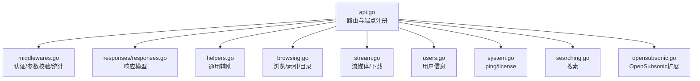
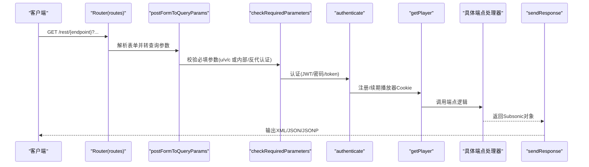
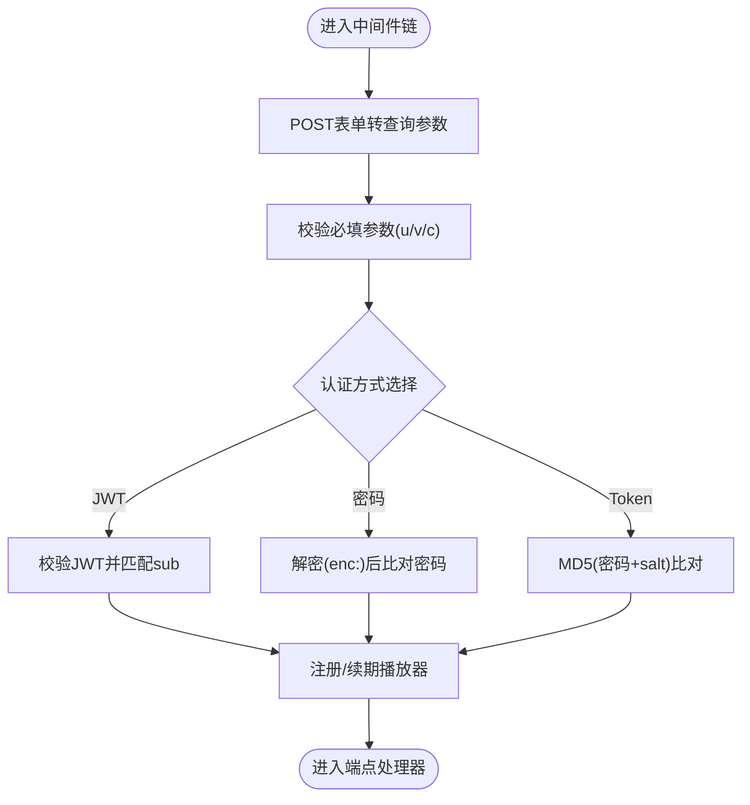
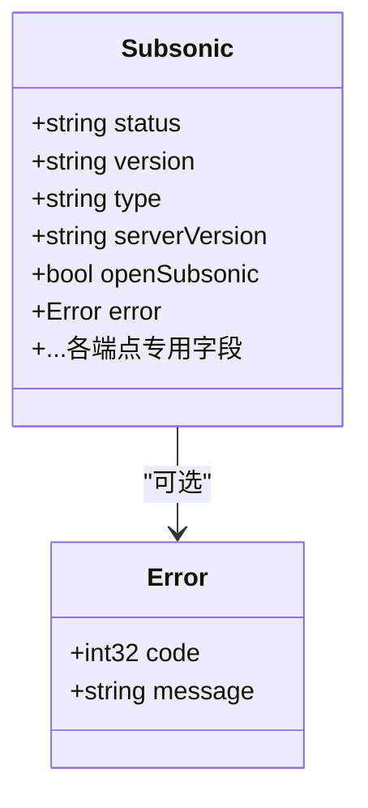
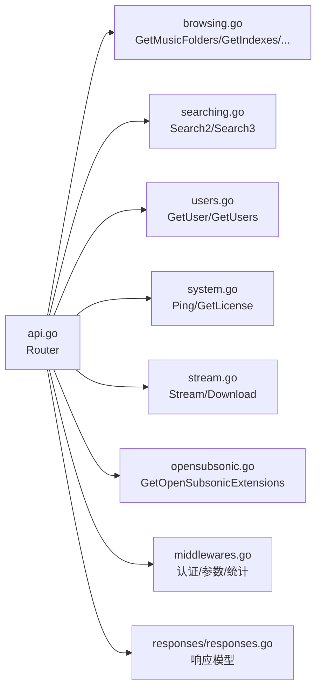

# Subsonic API

<cite>
**本文引用的文件**
- [api.go](file://server/subsonic/api.go)
- [middlewares.go](file://server/subsonic/middlewares.go)
- [helpers.go](file://server/subsonic/helpers.go)
- [responses/responses.go](file://server/subsonic/responses/responses.go)
- [responses/errors.go](file://server/subsonic/responses/errors.go)
- [browsing.go](file://server/subsonic/browsing.go)
- [stream.go](file://server/subsonic/stream.go)
- [users.go](file://server/subsonic/users.go)
- [system.go](file://server/subsonic/system.go)
- [searching.go](file://server/subsonic/searching.go)
- [opensubsonic.go](file://server/subsonic/opensubsonic.go)
</cite>

## 目录
1. [简介](#简介)
2. [项目结构](#项目结构)
3. [核心组件](#核心组件)
4. [架构总览](#架构总览)
5. [详细组件分析](#详细组件分析)
6. [依赖关系分析](#依赖关系分析)
7. [性能考虑](#性能考虑)
8. [故障排查指南](#故障排查指南)
9. [结论](#结论)
10. [附录：端点清单与规范](#附录端点清单与规范)

## 简介
本文件面向Navidrome的Subsonic兼容REST API，系统性梳理所有GET /rest/*端点的HTTP方法、URL模式、请求参数、请求体结构（如适用）、响应模式与状态码，并重点说明认证方式（token-based、JWT、密码）与OpenSubsonic扩展能力。文档严格依据api.go中的路由定义与responses.go中的响应结构进行说明，并补充中间件处理流程（认证、日志、错误处理）及性能优化建议（分页策略、缓存头使用）。

## 项目结构
Subsonic相关实现集中在server/subsonic目录，核心文件如下：
- 路由与端点注册：api.go
- 认证与中间件：middlewares.go
- 响应模型与错误码：responses/responses.go、responses/errors.go
- 通用辅助函数：helpers.go
- 典型端点实现：browsing.go、stream.go、users.go、system.go、searching.go、opensubsonic.go

图表来源
- [api.go](file://server/subsonic/api.go#L73-L223)
- [middlewares.go](file://server/subsonic/middlewares.go#L32-L273)
- [responses/responses.go](file://server/subsonic/responses/responses.go#L1-L120)
- [helpers.go](file://server/subsonic/helpers.go#L25-L120)
- [browsing.go](file://server/subsonic/browsing.go#L1-L120)
- [stream.go](file://server/subsonic/stream.go#L1-L164)
- [users.go](file://server/subsonic/users.go#L1-L64)
- [system.go](file://server/subsonic/system.go#L1-L18)
- [searching.go](file://server/subsonic/searching.go#L1-L157)
- [opensubsonic.go](file://server/subsonic/opensubsonic.go#L1-L19)

章节来源
- [api.go](file://server/subsonic/api.go#L73-L223)

## 核心组件
- Router：负责注册所有Subsonic端点，统一处理响应格式与错误映射。
- 中间件链：
  - 参数预处理：POST表单转查询参数
  - 必填参数校验：u/c/v（或内部/反向代理认证时仅需v/c）
  - 认证：支持JWT、密码、token三种方式
  - 播放器注册：自动注册/续期播放器Cookie
  - Prometheus统计：记录请求耗时、状态码、客户端名
- 响应层：统一返回Subsonic响应结构，支持XML/JSON/JSONP三种输出格式；错误码来自responses/errors.go。
- 辅助层：类型转换、路径构造、OpenSubsonic扩展字段注入等。

章节来源
- [api.go](file://server/subsonic/api.go#L276-L358)
- [middlewares.go](file://server/subsonic/middlewares.go#L32-L273)
- [responses/responses.go](file://server/subsonic/responses/responses.go#L1-L120)
- [responses/errors.go](file://server/subsonic/responses/errors.go#L1-L31)
- [helpers.go](file://server/subsonic/helpers.go#L25-L120)

## 架构总览
下图展示从HTTP请求到响应的完整调用链，包括认证、参数校验、端点处理与响应序列化。

图表来源
- [api.go](file://server/subsonic/api.go#L73-L223)
- [middlewares.go](file://server/subsonic/middlewares.go#L32-L214)
- [api.go](file://server/subsonic/api.go#L276-L358)

## 详细组件分析

### 认证与中间件处理流程
- 参数预处理：将POST表单参数合并到URL查询字符串，确保后续参数解析一致。
- 必填参数校验：内部/反向代理认证时仅需v、c；否则还需u；同时将用户名、客户端名、版本写入上下文。
- 认证方式：
  - JWT：校验JWT有效性且sub匹配当前用户名
  - 密码：明文或十六进制密文（前缀enc:）对比用户密码
  - Token：基于“MD5(用户密码 + salt)”生成token进行比对
- 播放器注册：根据Cookie中的播放器ID尝试续期，若不存在则注册新播放器并设置Cookie。
- 统计埋点：Prometheus中间件记录请求路径、方法、客户端名、状态码、耗时。

图表来源
- [middlewares.go](file://server/subsonic/middlewares.go#L32-L214)

章节来源
- [middlewares.go](file://server/subsonic/middlewares.go#L32-L214)

### 响应与错误处理
- 响应结构：统一包含status、version、type、serverVersion、openSubsonic等字段；按端点填充对应子结构（如musicFolders、indexes、directory、user、playlist、searchResult等）。
- 输出格式：默认XML；f=json输出JSON；f=jsonp输出JSONP（需callback参数）。
- 错误映射：将业务错误映射为Subsonic标准错误码与消息；当JSON序列化失败时回退为失败响应。

图表来源
- [responses/responses.go](file://server/subsonic/responses/responses.go#L1-L120)
- [responses/errors.go](file://server/subsonic/responses/errors.go#L1-L31)

章节来源
- [responses/responses.go](file://server/subsonic/responses/responses.go#L1-L120)
- [responses/errors.go](file://server/subsonic/responses/errors.go#L1-L31)
- [api.go](file://server/subsonic/api.go#L276-L358)

### 端点实现概览与数据模型
- 浏览与目录：音乐文件夹、索引、艺术家、专辑、歌曲、随机歌曲、按流派歌曲等。
- 搜索：Search2/Search3，支持并行搜索艺术家/专辑/歌曲。
- 用户：获取当前用户、列出用户。
- 系统：Ping、GetLicense。
- 流媒体：Stream、Download。
- OpenSubsonic扩展：GetOpenSubsonicExtensions。

章节来源
- [browsing.go](file://server/subsonic/browsing.go#L1-L200)
- [searching.go](file://server/subsonic/searching.go#L1-L157)
- [users.go](file://server/subsonic/users.go#L1-L64)
- [system.go](file://server/subsonic/system.go#L1-L18)
- [stream.go](file://server/subsonic/stream.go#L1-L164)
- [opensubsonic.go](file://server/subsonic/opensubsonic.go#L1-L19)

## 依赖关系分析
- 路由到处理器：api.go中通过h/hr注册端点，hr用于需要直接写入响应流的端点（如stream/download/coverart）。
- 处理器到数据层：各端点通过model.DataStore访问数据库；部分端点依赖core.MediaStreamer、core.Archiver、core.Players等服务。
- 响应模型：responses/responses.go定义了所有响应结构体，api.go在sendResponse中按f参数选择序列化方式。

图表来源
- [api.go](file://server/subsonic/api.go#L73-L223)
- [browsing.go](file://server/subsonic/browsing.go#L1-L200)
- [searching.go](file://server/subsonic/searching.go#L1-L157)
- [users.go](file://server/subsonic/users.go#L1-L64)
- [system.go](file://server/subsonic/system.go#L1-L18)
- [stream.go](file://server/subsonic/stream.go#L1-L164)
- [opensubsonic.go](file://server/subsonic/opensubsonic.go#L1-L19)
- [middlewares.go](file://server/subsonic/middlewares.go#L32-L214)
- [responses/responses.go](file://server/subsonic/responses/responses.go#L1-L120)

## 性能考虑
- 分页策略：搜索端点支持artistCount/albumCount/songCount与artistOffset/albumOffset/songOffset，建议客户端合理设置大小与偏移以避免一次性拉取大量数据。
- 缓存头与范围请求：
  - 非seekable流媒体会设置Accept-Ranges:none；seekable流媒体支持Range与Content-Length。
  - 可通过estimateContentLength参数估算内容长度（HEAD请求场景）。
- 并发搜索：Search2/Search3内部使用并发执行多类搜索，提升整体响应速度。
- 播放器注册：自动注册/续期播放器Cookie，减少重复注册开销。
- Prometheus统计：开启后记录每条端点的耗时与状态码，便于定位慢接口。

章节来源
- [stream.go](file://server/subsonic/stream.go#L20-L81)
- [searching.go](file://server/subsonic/searching.go#L65-L98)
- [middlewares.go](file://server/subsonic/middlewares.go#L240-L273)

## 故障排查指南
- 认证失败：检查u、v、c参数是否齐全；确认JWT有效且sub匹配用户名；密码是否为明文或enc:十六进制；token是否为MD5(密码+salt)。
- 数据未找到：常见于ID无效或无权限访问；检查musicFolderId是否在用户可访问范围内。
- JSON序列化失败：当响应中包含不支持的数值（如Inf）时，sendResponse会回退为失败响应并记录错误。
- 下载禁用：若EnableDownloads关闭，Download端点会返回授权失败错误。

章节来源
- [middlewares.go](file://server/subsonic/middlewares.go#L125-L179)
- [responses/errors.go](file://server/subsonic/responses/errors.go#L1-L31)
- [api.go](file://server/subsonic/api.go#L276-L358)
- [stream.go](file://server/subsonic/stream.go#L83-L164)

## 结论
Navidrome的Subsonic API在兼容Subsonic协议的同时，引入了OpenSubsonic扩展能力与完善的中间件体系，覆盖认证、参数校验、统计与响应序列化。通过合理的分页与缓存头策略，可在保证兼容性的前提下获得良好的性能表现。

## 附录：端点清单与规范

### 通用规范
- URL模式：/rest/{endpoint}[.view]
- 请求方法：GET为主，部分端点（如stream、download、getCoverArt）可能涉及流式输出
- 查询参数：
  - 必填：内部/反代认证时需v、c；普通认证需u、v、c
  - 输出格式：f=json|jsonp|默认XML（jsonp需callback）
  - 客户端名：c
  - 版本：v
  - 其他端点特定参数见下方各端点
- 响应格式：XML默认；f=json输出JSON；f=jsonp输出JSONP
- 错误码：参考responses/errors.go

章节来源
- [api.go](file://server/subsonic/api.go#L276-L358)
- [responses/errors.go](file://server/subsonic/responses/errors.go#L1-L31)

### 认证与系统
- ping
  - 方法：GET
  - URL：/rest/ping
  - 参数：u、v、c（或内部/反代认证时仅v、c）
  - 响应：status=ok
- getLicense
  - 方法：GET
  - URL：/rest/getLicense
  - 参数：同上
  - 响应：license.valid=true
- getOpenSubsonicExtensions
  - 方法：GET
  - URL：/rest/getOpenSubsonicExtensions
  - 参数：同上
  - 响应：openSubsonicExtensions（包含transcodeOffset、formPost、songLyrics、indexBasedQueue等）

章节来源
- [system.go](file://server/subsonic/system.go#L1-L18)
- [opensubsonic.go](file://server/subsonic/opensubsonic.go#L1-L19)
- [api.go](file://server/subsonic/api.go#L73-L120)

### 浏览与目录
- getMusicFolders
  - 方法：GET
  - URL：/rest/getMusicFolders
  - 参数：u、v、c
  - 响应：musicFolders.musicFolder[]（id、name）
- getIndexes
  - 方法：GET
  - URL：/rest/getIndexes
  - 参数：u、v、c、musicFolderId（可选，多值）、ifModifiedSince（可选）
  - 响应：indexes.index[]（name、artist[]）、ignoredArticles、lastModified
- getArtists
  - 方法：GET
  - URL：/rest/getArtists
  - 参数：u、v、c、musicFolderId（可选，多值）
  - 响应：artists.index[]（name、artist[]，含OpenSubsonic扩展）
- getMusicDirectory
  - 方法：GET
  - URL：/rest/getMusicDirectory
  - 参数：u、v、c、id（artist/album/mediafile）
  - 响应：directory.child[]（song/album节点）
- getArtist
  - 方法：GET
  - URL：/rest/getArtist
  - 参数：u、v、c、id（artist）
  - 响应：artistWithAlbumsID3（含OpenSubsonic扩展）
- getAlbum
  - 方法：GET
  - URL：/rest/getAlbum
  - 参数：u、v、c、id（album）
  - 响应：albumWithSongsID3（含OpenSubsonic扩展）
- getSong
  - 方法：GET
  - URL：/rest/getSong
  - 参数：u、v、c、id（mediafile）
  - 响应：song（含OpenSubsonic扩展）
- getAlbumInfo / getAlbumInfo2
  - 方法：GET
  - URL：/rest/getAlbumInfo / /rest/getAlbumInfo2
  - 参数：u、v、c、id（album）
  - 响应：albumInfo（notes、musicBrainzId、图片URL等）
- getArtistInfo / getArtistInfo2
  - 方法：GET
  - URL：/rest/getArtistInfo / /rest/getArtistInfo2
  - 参数：u、v、c、id（artist）
  - 响应：artistInfo/artistInfo2（含biography、相似艺人等）
- getTopSongs
  - 方法：GET
  - URL：/rest/getTopSongs
  - 参数：u、v、c、artistName
  - 响应：topSongs.song[]
- getSimilarSongs / getSimilarSongs2
  - 方法：GET
  - URL：/rest/getSimilarSongs / /rest/getSimilarSongs2
  - 参数：u、v、c、id（artist/mediafile）
  - 响应：similarSongs/similarSongs2.song[]
- getAlbumList / getAlbumList2
  - 方法：GET
  - URL：/rest/getAlbumList / /rest/getAlbumList2
  - 参数：u、v、c、type、size、offset
  - 响应：albumList/albumList2.album[]（含OpenSubsonic扩展）
- getStarred / getStarred2
  - 方法：GET
  - URL：/rest/getStarred / /rest/getStarred2
  - 参数：u、v、c
  - 响应：starred/starred2（artist/album/song）
- getNowPlaying
  - 方法：GET
  - URL：/rest/getNowPlaying
  - 参数：u、v、c
  - 响应：nowPlaying.entry[]（包含播放者信息）
- getRandomSongs
  - 方法：GET
  - URL：/rest/getRandomSongs
  - 参数：u、v、c、size、genre、fromYear、toYear、artistId
  - 响应：randomSongs.song[]
- getSongsByGenre
  - 方法：GET
  - URL：/rest/getSongsByGenre
  - 参数：u、v、c、genre、count、offset
  - 响应：songsByGenre.song[]
- getGenres
  - 方法：GET
  - URL：/rest/getGenres
  - 参数：u、v、c
  - 响应：genres.genre[]（name、songCount、albumCount）

章节来源
- [browsing.go](file://server/subsonic/browsing.go#L1-L200)
- [api.go](file://server/subsonic/api.go#L92-L200)

### 评分与收藏
- setRating
  - 方法：GET
  - URL：/rest/setRating
  - 参数：u、v、c、id、value
  - 响应：status=ok
- star / unstar
  - 方法：GET
  - URL：/rest/star / /rest/unstar
  - 参数：u、v、c、id（artist/album/song）
  - 响应：status=ok
- scrobble
  - 方法：GET
  - URL：/rest/scrobble
  - 参数：u、v、c、id、time、submission
  - 响应：status=ok

章节来源
- [api.go](file://server/subsonic/api.go#L125-L140)

### 播放列表
- getPlaylists
  - 方法：GET
  - URL：/rest/getPlaylists
  - 参数：u、v、c
  - 响应：playlists.playlist[]
- getPlaylist
  - 方法：GET
  - URL：/rest/getPlaylist
  - 参数：u、v、c、id
  - 响应：playlistWithSongs.entry[]
- createPlaylist
  - 方法：GET
  - URL：/rest/createPlaylist
  - 参数：u、v、c、name、songId
  - 响应：status=ok
- deletePlaylist
  - 方法：GET
  - URL：/rest/deletePlaylist
  - 参数：u、v、c、id
  - 响应：status=ok
- updatePlaylist
  - 方法：GET
  - URL：/rest/updatePlaylist
  - 参数：u、v、c、id、songIdToAdd、songIdToRemove
  - 响应：status=ok

章节来源
- [api.go](file://server/subsonic/api.go#L135-L140)

### 播放队列与书签
- getBookmarks
  - 方法：GET
  - URL：/rest/getBookmarks
  - 参数：u、v、c
  - 响应：bookmarks.bookmark[]
- createBookmark
  - 方法：GET
  - URL：/rest/createBookmark
  - 参数：u、v、c、id、position、comment
  - 响应：status=ok
- deleteBookmark
  - 方法：GET
  - URL：/rest/deleteBookmark
  - 参数：u、v、c、id
  - 响应：status=ok
- getPlayQueue / getPlayQueueByIndex
  - 方法：GET
  - URL：/rest/getPlayQueue / /rest/getPlayQueueByIndex
  - 参数：u、v、c
  - 响应：playQueue/playQueueByIndex
- savePlayQueue / savePlayQueueByIndex
  - 方法：GET
  - URL：/rest/savePlayQueue / /rest/savePlayQueueByIndex
  - 参数：u、v、c、id、current、position、shuffle
  - 响应：status=ok

章节来源
- [api.go](file://server/subsonic/api.go#L141-L150)

### 搜索
- search2
  - 方法：GET
  - URL：/rest/search2
  - 参数：u、v、c、query、artistCount、artistOffset、albumCount、albumOffset、songCount、songOffset、musicFolderId（可选，多值）
  - 响应：searchResult2.artist/album/song
- search3
  - 方法：GET
  - URL：/rest/search3
  - 参数：u、v、c、query、artistCount、artistOffset、albumCount、albumOffset、songCount、songOffset、musicFolderId（可选，多值）
  - 响应：searchResult3.artist（含OpenSubsonic扩展）/album/song

章节来源
- [searching.go](file://server/subsonic/searching.go#L1-L157)

### 用户
- getUser
  - 方法：GET
  - URL：/rest/getUser
  - 参数：u、v、c、username（需与当前登录用户一致）
  - 响应：user（角色、邮箱、可访问库等）
- getUsers
  - 方法：GET
  - URL：/rest/getUsers
  - 参数：u、v、c
  - 响应：users.user[]

章节来源
- [users.go](file://server/subsonic/users.go#L1-L64)

### 扫描与分享
- getScanStatus
  - 方法：GET
  - URL：/rest/getScanStatus
  - 参数：u、v、c
  - 响应：scanStatus.scanning/count/folderCount/lastScan/error/scanType/elapsedTime
- startScan
  - 方法：GET
  - URL：/rest/startScan
  - 参数：u、v、c
  - 响应：status=ok
- getShares / createShare / updateShare / deleteShare
  - 方法：GET
  - URL：/rest/getShares / /rest/createShare / /rest/updateShare / /rest/deleteShare
  - 参数：u、v、c（启用分享功能时可用）
  - 响应：shares/share[]（getShares）或status=ok（其他）

章节来源
- [api.go](file://server/subsonic/api.go#L160-L201)

### 媒体与封面
- getAvatar
  - 方法：GET
  - URL：/rest/getAvatar
  - 参数：u、v、c、username
  - 响应：二进制图像（avatar）
- getLyrics / getLyricsBySongId
  - 方法：GET
  - URL：/rest/getLyrics / /rest/getLyricsBySongId
  - 参数：u、v、c、artist/title 或 id（song）
  - 响应：lyrics/lyricsList（含同步歌词）
- stream
  - 方法：GET/HEAD
  - URL：/rest/stream
  - 参数：u、v、c、id、maxBitRate、format、timeOffset、estimateContentLength（可选）
  - 响应：音频流（支持Range/Content-Length）
- download
  - 方法：GET
  - URL：/rest/download
  - 参数：u、v、c、id、bitrate/format（可选）
  - 响应：音频/压缩包（zip）
- getCoverArt
  - 方法：GET
  - URL：/rest/getCoverArt
  - 参数：u、v、c、id、size
  - 响应：二进制图像（封面）
- jukeboxControl
  - 方法：GET
  - URL：/rest/jukeboxControl
  - 参数：u、v、c、action（play/pause/stop/...）、value（可选）
  - 响应：jukeboxStatus/jukeboxPlaylist

章节来源
- [stream.go](file://server/subsonic/stream.go#L1-L164)
- [api.go](file://server/subsonic/api.go#L165-L211)

### 认证方式详解
- 内部/反向代理认证：无需u参数，仅需v、c；用户名来自内部或反向代理头。
- JWT认证：携带jwt参数，服务端校验JWT有效性且sub与用户名一致。
- 密码认证：携带p参数，支持明文或enc:十六进制密文。
- Token认证：携带t（token）与s（salt），服务端计算MD5(密码+salt)并与token比对。

章节来源
- [middlewares.go](file://server/subsonic/middlewares.go#L50-L179)

### OpenSubsonic扩展
- getOpenSubsonicExtensions：返回支持的扩展名称与版本号（transcodeOffset、formPost、songLyrics、indexBasedQueue）。
- 响应模型中包含OpenSubsonicChild/ArtistID3/AlbumID3等扩展字段，按客户端兼容性动态注入。

章节来源
- [opensubsonic.go](file://server/subsonic/opensubsonic.go#L1-L19)
- [responses/responses.go](file://server/subsonic/responses/responses.go#L172-L210)