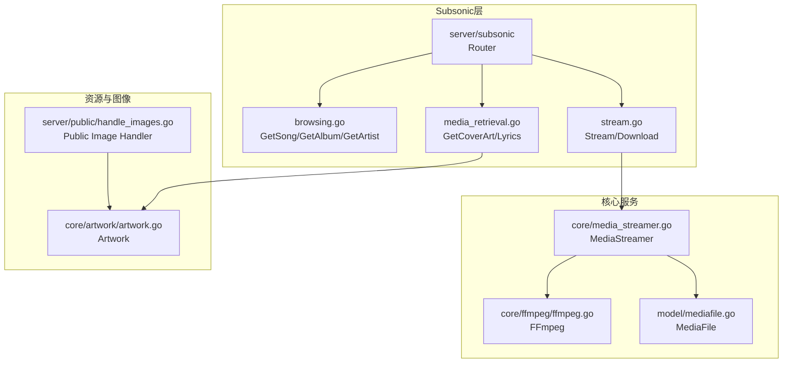
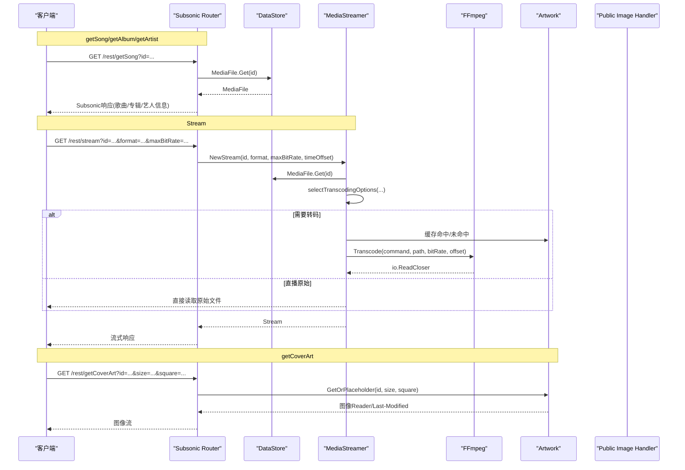
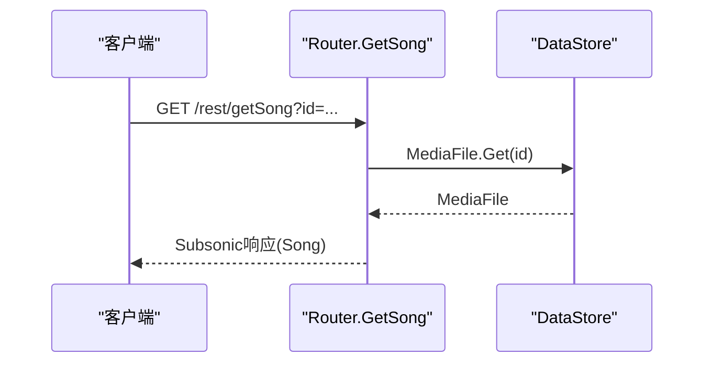
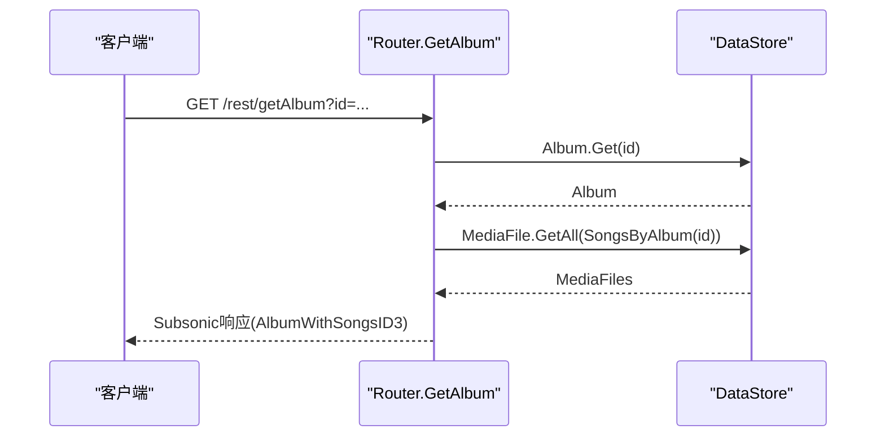
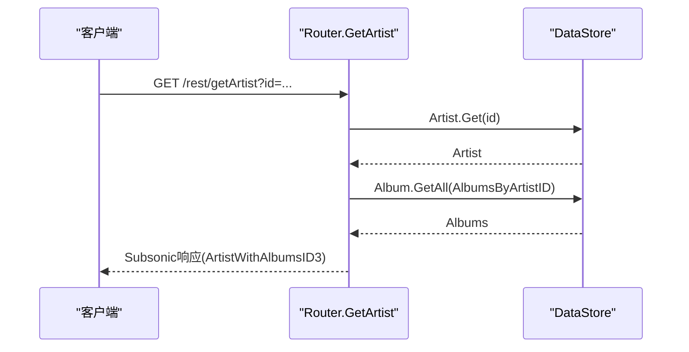
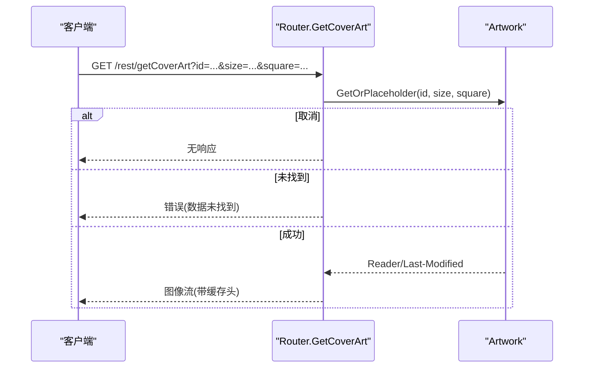
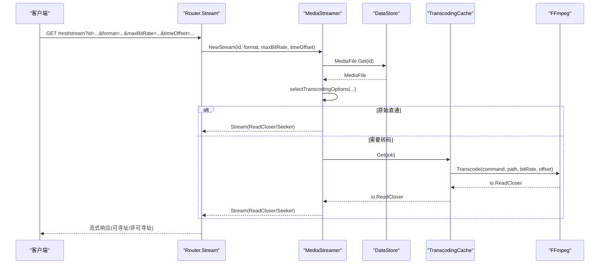
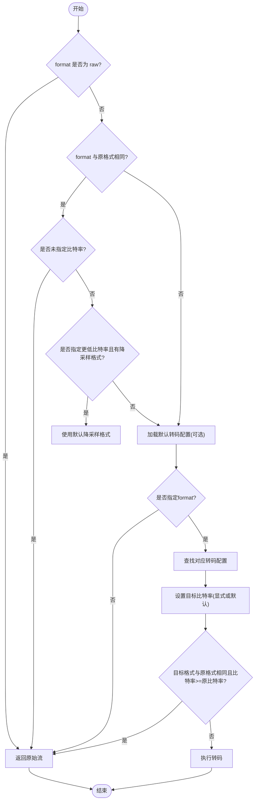
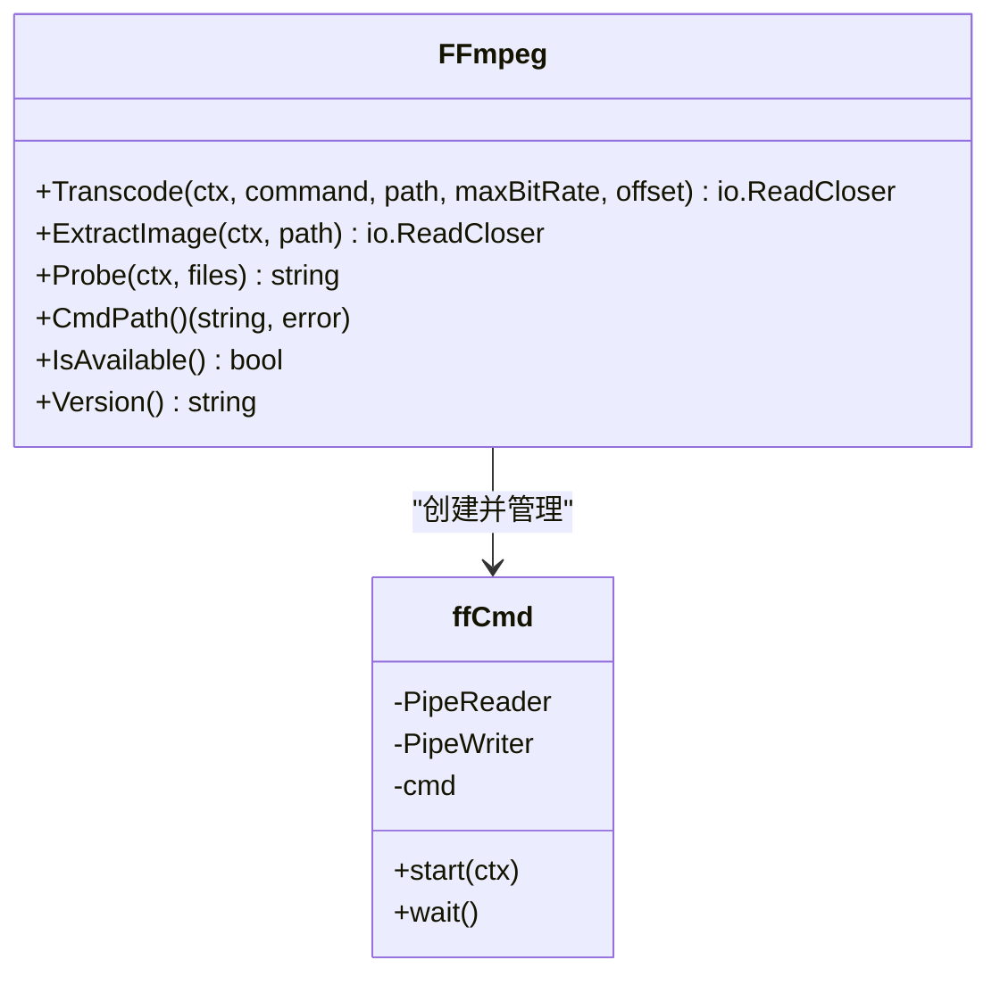
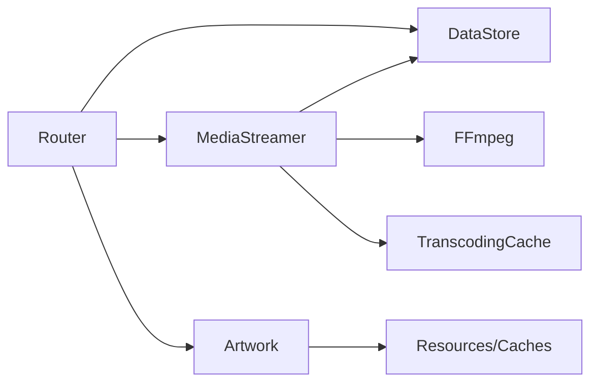

# 媒体检索

<cite>
**本文引用的文件**
- [server/subsonic/media_retrieval.go](file://server/subsonic/media_retrieval.go)
- [server/subsonic/browsing.go](file://server/subsonic/browsing.go)
- [server/subsonic/stream.go](file://server/subsonic/stream.go)
- [core/media_streamer.go](file://core/media_streamer.go)
- [core/ffmpeg/ffmpeg.go](file://core/ffmpeg/ffmpeg.go)
- [model/mediafile.go](file://model/mediafile.go)
- [server/public/handle_images.go](file://server/public/handle_images.go)
- [core/artwork/artwork.go](file://core/artwork/artwork.go)
- [server/subsonic/media_retrieval_test.go](file://server/subsonic/media_retrieval_test.go)
- [core/media_streamer_Internal_test.go](file://core/media_streamer_Internal_test.go)
</cite>

## 目录
1. [简介](#简介)
2. [项目结构](#项目结构)
3. [核心组件](#核心组件)
4. [架构总览](#架构总览)
5. [详细组件分析](#详细组件分析)
6. [依赖分析](#依赖分析)
7. [性能考虑](#性能考虑)
8. [故障排查指南](#故障排查指南)
9. [结论](#结论)
10. [附录：请求/响应示例](#附录请求响应示例)

## 简介
本文件面向Navidrome的Subsonic API媒体检索能力，围绕以下端点展开：
- getSong：按媒体文件ID返回歌曲元数据
- getAlbum：按专辑ID返回专辑及曲目列表
- getArtist：按艺人ID返回艺人及其专辑
- getCoverArt：按实体ID返回封面图（支持尺寸与方形裁剪）

同时，文档深入解释媒体文件元数据检索、封面艺术获取与流式传输机制，涵盖文件路径解析、权限与错误处理、FFmpeg转码流程、比特率与格式控制、以及与媒体流服务（core/media_streamer.go）、转码组件（core/ffmpeg/ffmpeg.go）和媒体模型（model/mediafile.go）的交互关系。

## 项目结构
与媒体检索直接相关的模块分布如下：
- server/subsonic：Subsonic API路由与响应封装
- core：媒体流服务、转码缓存、FFmpeg接口
- model：媒体文件模型与元数据字段
- server/public：公共图片处理器（独立于Subsonic）
- core/artwork：封面艺术读取与占位图逻辑

图表来源
- [server/subsonic/browsing.go](file://server/subsonic/browsing.go#L188-L262)
- [server/subsonic/media_retrieval.go](file://server/subsonic/media_retrieval.go#L56-L92)
- [server/subsonic/stream.go](file://server/subsonic/stream.go#L52-L81)
- [core/media_streamer.go](file://core/media_streamer.go#L21-L113)
- [core/ffmpeg/ffmpeg.go](file://core/ffmpeg/ffmpeg.go#L18-L60)
- [model/mediafile.go](file://model/mediafile.go#L160-L162)
- [core/artwork/artwork.go](file://core/artwork/artwork.go#L44-L83)
- [server/public/handle_images.go](file://server/public/handle_images.go#L16-L67)

章节来源
- [server/subsonic/browsing.go](file://server/subsonic/browsing.go#L188-L262)
- [server/subsonic/media_retrieval.go](file://server/subsonic/media_retrieval.go#L56-L92)
- [server/subsonic/stream.go](file://server/subsonic/stream.go#L52-L81)
- [core/media_streamer.go](file://core/media_streamer.go#L21-L113)
- [core/ffmpeg/ffmpeg.go](file://core/ffmpeg/ffmpeg.go#L18-L60)
- [model/mediafile.go](file://model/mediafile.go#L160-L162)
- [core/artwork/artwork.go](file://core/artwork/artwork.go#L44-L83)
- [server/public/handle_images.go](file://server/public/handle_images.go#L16-L67)

## 核心组件
- Subsonic Router：负责接收HTTP请求、参数解析、调用数据层与服务层，并返回统一响应结构。
- 数据访问层（DataStore）：提供媒体文件、专辑、艺人等实体的查询与过滤。
- 媒体流服务（MediaStreamer）：根据请求选择是否转码、计算目标格式与比特率、从缓存或FFmpeg输出流。
- FFmpeg接口：封装转码命令拼接、进程启动、管道读取与错误处理。
- 封面艺术（Artwork）：根据实体ID解析封面ID、读取缓存、回退占位图。
- 公共图片处理器：独立于Subsonic的封面图处理入口，与Artwork共享逻辑。

章节来源
- [server/subsonic/browsing.go](file://server/subsonic/browsing.go#L188-L262)
- [server/subsonic/media_retrieval.go](file://server/subsonic/media_retrieval.go#L56-L92)
- [server/subsonic/stream.go](file://server/subsonic/stream.go#L52-L81)
- [core/media_streamer.go](file://core/media_streamer.go#L21-L113)
- [core/ffmpeg/ffmpeg.go](file://core/ffmpeg/ffmpeg.go#L18-L60)
- [core/artwork/artwork.go](file://core/artwork/artwork.go#L44-L83)
- [server/public/handle_images.go](file://server/public/handle_images.go#L16-L67)

## 架构总览
下图展示了从Subsonic端点到媒体流与转码的关键调用链路。

图表来源
- [server/subsonic/browsing.go](file://server/subsonic/browsing.go#L188-L262)
- [server/subsonic/stream.go](file://server/subsonic/stream.go#L52-L81)
- [core/media_streamer.go](file://core/media_streamer.go#L51-L113)
- [core/ffmpeg/ffmpeg.go](file://core/ffmpeg/ffmpeg.go#L38-L60)
- [core/artwork/artwork.go](file://core/artwork/artwork.go#L44-L83)
- [server/public/handle_images.go](file://server/public/handle_images.go#L16-L67)

## 详细组件分析

### getSong 端点
- 职责：按媒体文件ID返回歌曲元数据。
- 关键流程：
  - 参数解析：从请求中提取id。
  - 数据查询：通过DataStore查询MediaFile。
  - 响应构建：将MediaFile映射为子项对象并放入统一响应结构。
- 错误处理：当实体不存在时返回“数据未找到”错误；其他错误记录日志后透传。
- 文件路径解析：MediaFile.AbsolutePath()用于生成绝对路径（在需要时），但getSong仅返回元数据，不涉及文件读取。

图表来源
- [server/subsonic/browsing.go](file://server/subsonic/browsing.go#L243-L262)
- [model/mediafile.go](file://model/mediafile.go#L160-L162)

章节来源
- [server/subsonic/browsing.go](file://server/subsonic/browsing.go#L243-L262)
- [model/mediafile.go](file://model/mediafile.go#L160-L162)

### getAlbum 端点
- 职责：按专辑ID返回专辑详情与曲目列表。
- 关键流程：
  - 查询专辑：DataStore.Album.Get(id)。
  - 查询曲目：DataStore.MediaFile.GetAll(按专辑过滤)。
  - 构建响应：将专辑与曲目映射为响应结构。
- 错误处理：专辑不存在返回“数据未找到”，查询曲目失败记录错误。

图表来源
- [server/subsonic/browsing.go](file://server/subsonic/browsing.go#L188-L213)

章节来源
- [server/subsonic/browsing.go](file://server/subsonic/browsing.go#L188-L213)

### getArtist 端点
- 职责：按艺人ID返回艺人及其专辑列表。
- 关键流程：
  - 查询艺人：DataStore.Artist.Get(id)。
  - 查询专辑：DataStore.Album.GetAll(按艺人过滤)。
  - 构建响应：将艺人与专辑映射为响应结构。
- 错误处理：艺人不存在返回“数据未找到”。

图表来源
- [server/subsonic/browsing.go](file://server/subsonic/browsing.go#L165-L186)

章节来源
- [server/subsonic/browsing.go](file://server/subsonic/browsing.go#L165-L186)

### getCoverArt 端点
- 职责：按实体ID返回封面图，支持size与square参数。
- 关键流程：
  - 请求预处理：检查上下文取消、设置超时。
  - 参数解析：id、size、square。
  - 封面获取：Artwork.GetOrPlaceholder(id, size, square)。
  - 错误处理：context.Canceled直接返回；model.ErrNotFound返回“数据未找到”；其他错误记录并返回。
  - 响应头：设置缓存控制与最后修改时间；拷贝图像数据到响应。
- 占位图：当实体无封面且无法获取时，返回占位图（由Artwork内部处理）。

图表来源
- [server/subsonic/media_retrieval.go](file://server/subsonic/media_retrieval.go#L56-L92)
- [core/artwork/artwork.go](file://core/artwork/artwork.go#L44-L83)

章节来源
- [server/subsonic/media_retrieval.go](file://server/subsonic/media_retrieval.go#L56-L92)
- [core/artwork/artwork.go](file://core/artwork/artwork.go#L44-L83)
- [server/public/handle_images.go](file://server/public/handle_images.go#L16-L67)

### Stream 端点（媒体流）
- 职责：按媒体文件ID进行流式播放，支持格式与比特率控制、可选偏移。
- 关键流程：
  - 参数解析：id、maxBitRate、format、timeOffset。
  - 创建流：MediaStreamer.NewStream -> DoStream。
  - 转码决策：selectTranscodingOptions根据请求与默认策略决定是否转码、目标格式与比特率。
  - 源文件：若无需转码，直接打开原始文件；否则通过转码缓存获取FFmpeg输出。
  - 响应：根据是否可寻址选择ServeContent或手动复制；设置内容类型、时长等头部。
- 错误处理：记录关闭流的错误；对不可寻址流支持HEAD请求估算长度。

图表来源
- [server/subsonic/stream.go](file://server/subsonic/stream.go#L52-L81)
- [core/media_streamer.go](file://core/media_streamer.go#L51-L113)
- [core/media_streamer.go](file://core/media_streamer.go#L133-L183)
- [core/ffmpeg/ffmpeg.go](file://core/ffmpeg/ffmpeg.go#L38-L60)

章节来源
- [server/subsonic/stream.go](file://server/subsonic/stream.go#L52-L81)
- [core/media_streamer.go](file://core/media_streamer.go#L51-L113)
- [core/media_streamer.go](file://core/media_streamer.go#L133-L183)
- [core/ffmpeg/ffmpeg.go](file://core/ffmpeg/ffmpeg.go#L38-L60)

### 转码策略与比特率控制
- 选择规则：
  - 若请求format为raw，直接返回原始流。
  - 若请求format与原格式相同且未指定比特率，保持原始比特率。
  - 若存在默认转码配置（来自请求上下文），优先采用默认目标格式与默认比特率；若存在播放器信息，以播放器最大比特率为准。
  - 若未指定format但指定了更低的比特率且配置了降采样格式，则使用默认降采样格式。
  - 若未指定format且未配置默认转码，保持原始流。
  - 若最终目标格式与原格式相同且目标比特率不低于原比特率，回退为原始流。
- 缓存与复用：转码结果通过文件缓存（基于job键）复用，避免重复转码。

图表来源
- [core/media_streamer.go](file://core/media_streamer.go#L133-L183)
- [core/media_streamer.go](file://core/media_streamer.go#L197-L228)

章节来源
- [core/media_streamer.go](file://core/media_streamer.go#L133-L183)
- [core/media_streamer.go](file://core/media_streamer.go#L197-L228)
- [core/media_streamer_Internal_test.go](file://core/media_streamer_Internal_test.go#L23-L44)

### FFmpeg 转码与图像提取
- 接口职责：
  - Transcode：校验ffmpeg可用性、检查文件存在、拼接命令、启动进程并通过管道返回读取器。
  - ExtractImage：提取嵌入图像为图片流。
  - Probe：执行元数据探测命令。
  - CmdPath/IsAvailable/Version：工具链检测与版本查询。
- 进程管理：使用Pipe连接子进程标准输出，等待退出并处理非零退出码。
- 命令拼接：支持占位符替换（路径、偏移、比特率），自动注入-ss偏移参数。

图表来源
- [core/ffmpeg/ffmpeg.go](file://core/ffmpeg/ffmpeg.go#L18-L60)
- [core/ffmpeg/ffmpeg.go](file://core/ffmpeg/ffmpeg.go#L111-L158)
- [core/ffmpeg/ffmpeg.go](file://core/ffmpeg/ffmpeg.go#L160-L190)
- [core/ffmpeg/ffmpeg.go](file://core/ffmpeg/ffmpeg.go#L203-L229)

章节来源
- [core/ffmpeg/ffmpeg.go](file://core/ffmpeg/ffmpeg.go#L18-L60)
- [core/ffmpeg/ffmpeg.go](file://core/ffmpeg/ffmpeg.go#L111-L158)
- [core/ffmpeg/ffmpeg.go](file://core/ffmpeg/ffmpeg.go#L160-L190)
- [core/ffmpeg/ffmpeg.go](file://core/ffmpeg/ffmpeg.go#L203-L229)

### 媒体文件元数据与路径解析
- 绝对路径：MediaFile.AbsolutePath()基于库路径与相对路径拼接得到绝对路径。
- 内容类型：MediaFile.ContentType()基于文件后缀推导。
- 封面ID：MediaFile.CoverArtID()优先使用媒体文件内嵌封面，否则回退至专辑封面ID。

章节来源
- [model/mediafile.go](file://model/mediafile.go#L160-L162)
- [model/mediafile.go](file://model/mediafile.go#L104-L106)
- [model/mediafile.go](file://model/mediafile.go#L108-L115)

## 依赖分析
- 组件耦合：
  - Subsonic Router依赖DataStore与服务层（MediaStreamer、Artwork）。
  - MediaStreamer依赖DataStore（查询媒体文件与转码配置）、FFmpeg、文件缓存。
  - FFmpeg作为外部工具接口，通过命令行与管道交互。
  - Artwork依赖资源与缓存，负责封面ID解析与占位图回退。
- 外部集成点：
  - FFmpeg二进制路径发现与可用性检测。
  - 图片缓存与封面缓存。
- 潜在循环依赖：当前代码组织未见循环导入；各层职责清晰。

图表来源
- [server/subsonic/browsing.go](file://server/subsonic/browsing.go#L188-L262)
- [server/subsonic/media_retrieval.go](file://server/subsonic/media_retrieval.go#L56-L92)
- [server/subsonic/stream.go](file://server/subsonic/stream.go#L52-L81)
- [core/media_streamer.go](file://core/media_streamer.go#L21-L113)
- [core/ffmpeg/ffmpeg.go](file://core/ffmpeg/ffmpeg.go#L18-L60)
- [core/artwork/artwork.go](file://core/artwork/artwork.go#L44-L83)

章节来源
- [server/subsonic/browsing.go](file://server/subsonic/browsing.go#L188-L262)
- [server/subsonic/media_retrieval.go](file://server/subsonic/media_retrieval.go#L56-L92)
- [server/subsonic/stream.go](file://server/subsonic/stream.go#L52-L81)
- [core/media_streamer.go](file://core/media_streamer.go#L21-L113)
- [core/ffmpeg/ffmpeg.go](file://core/ffmpeg/ffmpeg.go#L18-L60)
- [core/artwork/artwork.go](file://core/artwork/artwork.go#L44-L83)

## 性能考虑
- 转码缓存：通过文件缓存复用转码结果，降低CPU与I/O开销。
- 原始直通：当无需转码时直接读取原始文件，减少额外处理。
- 可寻址流：支持Range/Content-Length，提升播放体验与断点续播能力。
- 图片缓存：封面图设置长期缓存与Last-Modified，减少重复请求。
- 上下文超时：封面图与公共图片处理器均设置超时，防止阻塞。

章节来源
- [core/media_streamer.go](file://core/media_streamer.go#L197-L228)
- [server/subsonic/media_retrieval.go](file://server/subsonic/media_retrieval.go#L56-L92)
- [server/public/handle_images.go](file://server/public/handle_images.go#L16-L67)

## 故障排查指南
- getCoverArt常见问题：
  - 无id参数：返回占位图（模拟Subsonic行为）。
  - 实体不存在：返回“数据未找到”。
  - 客户端断开：上下文取消时不会继续调用服务，避免资源浪费。
- Stream常见问题：
  - 转码命令无效：检查转码配置与ffmpeg路径。
  - 文件不存在：确认MediaFile.AbsolutePath()指向有效文件。
  - 比特率/格式不匹配：核对默认转码配置与播放器限制。
- 日志定位：
  - 详细日志级别下可查看转码命令、缓存命中情况与错误栈。
  - 下载/流式传输结束后会记录成功或错误信息。

章节来源
- [server/subsonic/media_retrieval_test.go](file://server/subsonic/media_retrieval_test.go#L42-L116)
- [server/subsonic/stream.go](file://server/subsonic/stream.go#L20-L81)
- [core/media_streamer.go](file://core/media_streamer.go#L60-L113)

## 结论
Navidrome的Subsonic媒体检索通过清晰的分层设计实现了高效、可扩展的媒体访问：
- getSong/getAlbum/getArtist专注于元数据检索与响应构建。
- getCoverArt提供灵活的封面图获取与占位图回退。
- Stream结合转码策略与缓存，兼顾兼容性与性能。
- FFmpeg接口与文件缓存确保转码过程可控与可复用。
建议在生产环境中合理配置默认转码策略与降采样格式，以平衡音质与带宽占用。

## 附录：请求/响应示例
以下示例描述典型场景下的请求与预期行为（不含具体代码片段）：
- getSong
  - 请求：GET /rest/getSong?id=媒体文件ID
  - 响应：包含歌曲标题、专辑、艺人、时长、比特率等字段的子项对象
- getAlbum
  - 请求：GET /rest/getAlbum?id=专辑ID
  - 响应：包含专辑信息与曲目列表
- getArtist
  - 请求：GET /rest/getArtist?id=艺人ID
  - 响应：包含艺人信息与专辑列表
- getCoverArt
  - 请求：GET /rest/getCoverArt?id=实体ID&size=300&square=true
  - 响应：图像流（JPEG/PNG），带缓存控制与Last-Modified头
- Stream
  - 请求：GET /rest/stream?id=媒体文件ID&format=mp3&maxBitRate=192
  - 响应：音频流（可寻址），按请求格式与比特率输出；若无需转码则直接返回原始文件

章节来源
- [server/subsonic/browsing.go](file://server/subsonic/browsing.go#L188-L262)
- [server/subsonic/media_retrieval.go](file://server/subsonic/media_retrieval.go#L56-L92)
- [server/subsonic/stream.go](file://server/subsonic/stream.go#L52-L81)