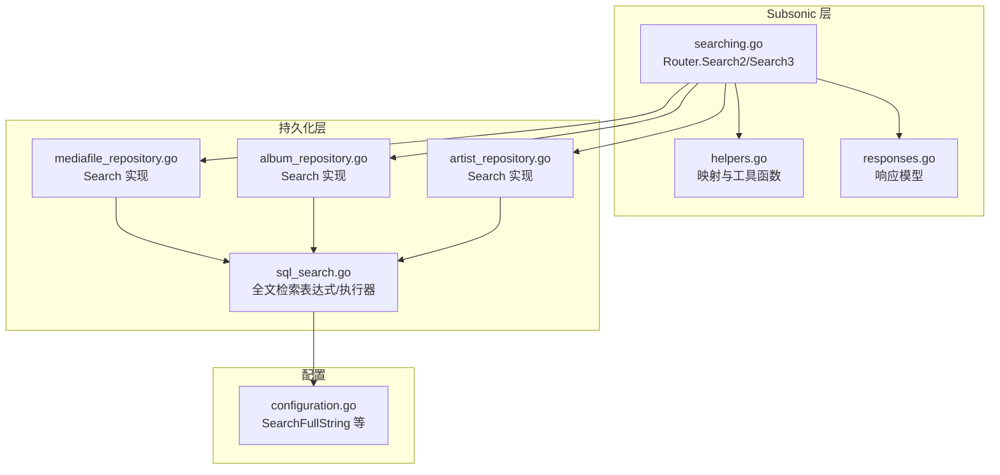
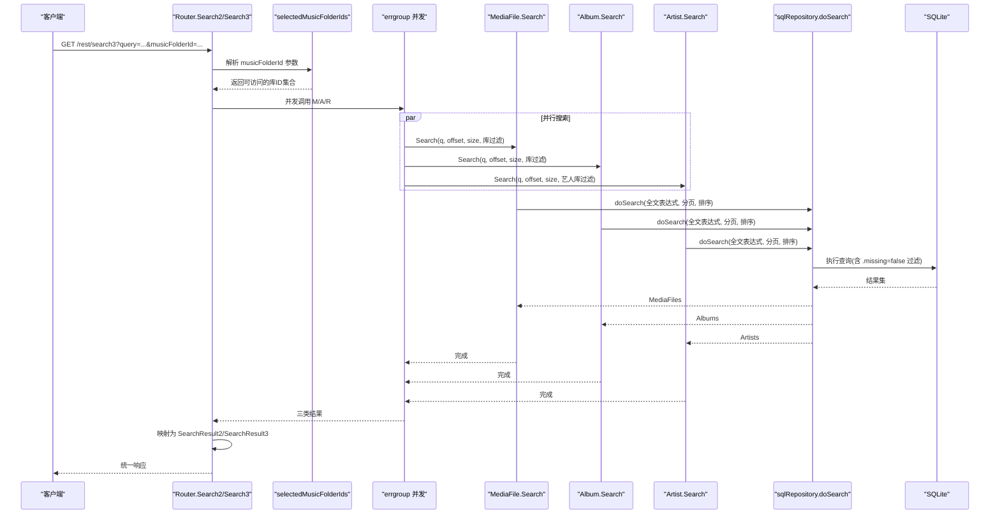
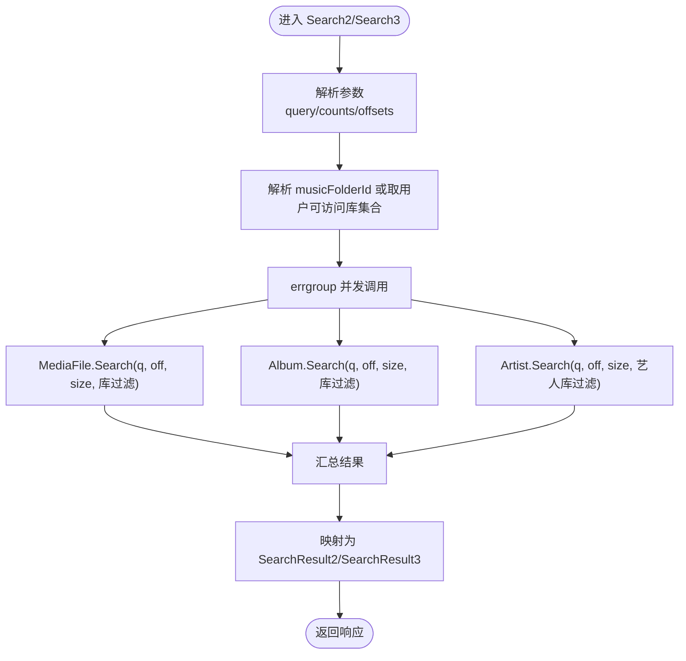
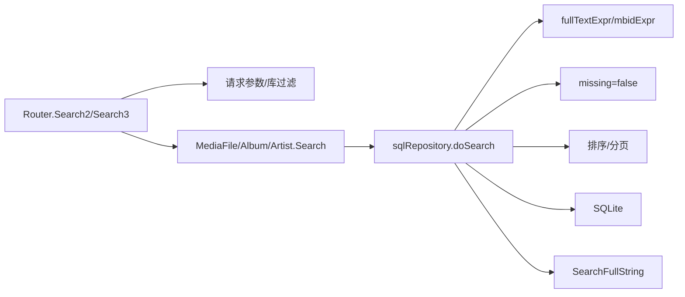

# 搜索功能

<cite>
**本文引用的文件列表**
- [searching.go](file://server/subsonic/searching.go)
- [helpers.go](file://server/subsonic/helpers.go)
- [responses.go](file://server/subsonic/responses/responses.go)
- [sql_search.go](file://persistence/sql_search.go)
- [mediafile_repository.go](file://persistence/mediafile_repository.go)
- [artist_repository.go](file://persistence/artist_repository.go)
- [album_repository.go](file://persistence/album_repository.go)
- [configuration.go](file://conf/configuration.go)
- [searching_test.go](file://server/subsonic/searching_test.go)
- [sql_restful_test.go](file://persistence/sql_restful_test.go)
- [sql_search_test.go](file://persistence/sql_search_test.go)
- [mediafile_repository_test.go](file://persistence/mediafile_repository_test.go)
</cite>

## 目录
1. [简介](#简介)
2. [项目结构](#项目结构)
3. [核心组件](#核心组件)
4. [架构总览](#架构总览)
5. [详细组件分析](#详细组件分析)
6. [依赖关系分析](#依赖关系分析)
7. [性能考量](#性能考量)
8. [故障排查指南](#故障排查指南)
9. [结论](#结论)
10. [附录：请求/响应示例与参数说明](#附录请求响应示例与参数说明)

## 简介
本文件面向Navidrome的Subsonic API搜索能力，系统性梳理search、search2、search3三个端点的实现细节、调用关系与数据流，覆盖全文搜索逻辑、分页与排序、搜索索引构建与查询优化策略，并结合核心库服务与数据库层的集成方式，给出在大数据集下的性能建议与常见问题排查方法。文档严格依据仓库中现有代码实现进行说明，不包含未在代码中体现的内容。

## 项目结构
围绕搜索功能的关键模块分布如下：
- server/subsonic：Subsonic API路由与响应模型，包含search、search2、search3端点及辅助转换函数
- persistence：数据库访问层，包含全文检索表达式构造、通用搜索执行器与各实体仓库的Search实现
- conf：全局配置项，包含全文检索行为开关
- 测试：验证音乐库过滤、搜索行为、全文检索表达式与边界条件

图表来源
- [searching.go](file://server/subsonic/searching.go#L1-L156)
- [helpers.go](file://server/subsonic/helpers.go#L1-L516)
- [responses.go](file://server/subsonic/responses/responses.go#L1-L619)
- [sql_search.go](file://persistence/sql_search.go#L1-L78)
- [mediafile_repository.go](file://persistence/mediafile_repository.go#L376-L413)
- [album_repository.go](file://persistence/album_repository.go)
- [artist_repository.go](file://persistence/artist_repository.go)
- [configuration.go](file://conf/configuration.go#L1-L200)

章节来源
- [searching.go](file://server/subsonic/searching.go#L1-L156)
- [sql_search.go](file://persistence/sql_search.go#L1-L78)
- [configuration.go](file://conf/configuration.go#L1-L200)

## 核心组件
- Router.Search2/Search3：解析请求参数、按音乐库过滤、并发触发三类实体搜索、组装统一响应
- sqlRepository.doSearch：通用全文检索执行器，支持自然序回退、缺失项过滤、分页
- 全文检索表达式：基于配置项决定词间分隔符，构造多词LIKE条件
- 实体仓库Search：优先尝试MBID精确匹配，否则走全文检索执行器
- 响应模型：SearchResult2/SearchResult3分别对应不同ID3风格的子节点字段

章节来源
- [searching.go](file://server/subsonic/searching.go#L1-L156)
- [sql_search.go](file://persistence/sql_search.go#L1-L78)
- [responses.go](file://server/subsonic/responses/responses.go#L1-L619)

## 架构总览
下图展示了从HTTP请求到数据库查询再到响应返回的完整链路，以及并行搜索与库级过滤的关键路径。

图表来源
- [searching.go](file://server/subsonic/searching.go#L1-L156)
- [helpers.go](file://server/subsonic/helpers.go#L1-L516)
- [sql_search.go](file://persistence/sql_search.go#L1-L78)
- [mediafile_repository.go](file://persistence/mediafile_repository.go#L376-L413)

## 详细组件分析

### Router.Search2/Search3 端点
- 请求参数解析：query、artistCount/Offset、albumCount/Offset、songCount/Offset
- 音乐库过滤：根据musicFolderId参数或用户可访问库集合，对三类实体施加库过滤
- 并行搜索：使用errgroup并发执行媒体文件、专辑、艺术家的Search，避免串行阻塞
- 结果映射：
  - Search2：艺术家使用Artist字段；专辑/歌曲使用Child字段
  - Search3：艺术家使用ArtistID3字段；专辑使用AlbumID3字段；歌曲使用Child字段
- 日志：记录耗时、命中数量、错误信息

章节来源
- [searching.go](file://server/subsonic/searching.go#L1-L156)
- [helpers.go](file://server/subsonic/helpers.go#L1-L516)
- [responses.go](file://server/subsonic/responses/responses.go#L1-L619)

### 全文搜索表达式与执行器
- 表达式构造：对查询词进行清洗与大小写归一，按配置决定词间分隔符（SearchFullString）
- 多词条件：将查询拆分为多个词，构造AND条件，确保所有词均出现在full_text中
- 自然序回退：当查询为空或不可用时，按指定自然序排序以提升空查询场景性能
- 缺失项过滤：强制排除missing=true的记录
- 分页与排序：应用limit/offset与显式orderBys

章节来源
- [sql_search.go](file://persistence/sql_search.go#L1-L78)
- [sql_restful_test.go](file://persistence/sql_restful_test.go#L113-L235)
- [sql_search_test.go](file://persistence/sql_search_test.go#L1-L14)

### 实体仓库Search实现
- 媒体文件：优先尝试MBID精确匹配（recording或release_track），否则走全文检索
- 专辑/艺术家：走全文检索执行器，专辑按专辑名排序，艺人按自然序或配置排序
- 缺失项过滤：统一通过执行器添加missing=false条件

章节来源
- [mediafile_repository.go](file://persistence/mediafile_repository.go#L376-L413)
- [album_repository.go](file://persistence/album_repository.go)
- [artist_repository.go](file://persistence/artist_repository.go)

### 响应模型与字段差异
- SearchResult2：包含Artist[]、Child[]（专辑）、Child[]（歌曲）
- SearchResult3：包含ArtistID3[]、AlbumID3[]、Child[]（歌曲）
- ID3扩展字段：Search3额外携带OpenSubsonic扩展字段（如音乐标签、播放统计、角色等）

章节来源
- [responses.go](file://server/subsonic/responses/responses.go#L1-L619)

### 并发与库过滤流程

图表来源
- [searching.go](file://server/subsonic/searching.go#L1-L156)
- [helpers.go](file://server/subsonic/helpers.go#L1-L516)

## 依赖关系分析
- Router依赖：
  - 请求参数解析与音乐库过滤
  - 三类实体仓库的Search接口
  - 响应模型构造
- 数据库层依赖：
  - 全文检索表达式与执行器
  - MBID匹配辅助
  - 缺失项过滤
- 配置依赖：
  - SearchFullString影响词间分隔符
  - Legacy客户端兼容性控制

图表来源
- [searching.go](file://server/subsonic/searching.go#L1-L156)
- [sql_search.go](file://persistence/sql_search.go#L1-L78)
- [configuration.go](file://conf/configuration.go#L1-L200)

章节来源
- [searching.go](file://server/subsonic/searching.go#L1-L156)
- [sql_search.go](file://persistence/sql_search.go#L1-L78)
- [configuration.go](file://conf/configuration.go#L1-L200)

## 性能考量
- 并发搜索：三类实体并行查询，显著降低整体延迟
- 自然序回退：空查询时按自然序排序，避免无意义的全文扫描
- 缺失项过滤：统一排除缺失条目，减少无关结果
- 分页与限制：合理设置count/offset，避免一次性返回大量数据
- 索引与列排序：数据库层存在full_text与相关索引，有助于LIKE匹配性能
- MBID优先：精确MBID匹配可绕过全文检索，提高命中速度与准确性

章节来源
- [searching.go](file://server/subsonic/searching.go#L1-L156)
- [sql_search.go](file://persistence/sql_search.go#L1-L78)
- [mediafile_repository.go](file://persistence/mediafile_repository.go#L376-L413)

## 故障排查指南
- musicFolderId无效或无权限
  - 现象：返回“库不存在或无访问权限”错误
  - 排查：确认用户可访问库集合、传入的musicFolderId是否在集合内
- 查询词过短或为空
  - 现象：doSearch直接返回，不执行全文检索
  - 排查：确认查询长度与是否以星号结尾被裁剪
- MBID格式不合法
  - 现象：按全文检索处理，可能返回非预期结果
  - 排查：确认UUID格式正确且字段列表有效
- 缺失媒体文件不返回
  - 现象：Search结果中不含missing=true的条目
  - 排查：确认仓库Search实现已强制过滤缺失项
- 空查询性能
  - 现象：Search3空查询返回全量数据
  - 排查：利用自然序回退特性，必要时限制count/offset

章节来源
- [searching_test.go](file://server/subsonic/searching_test.go#L1-L209)
- [sql_restful_test.go](file://persistence/sql_restful_test.go#L113-L235)
- [mediafile_repository_test.go](file://persistence/mediafile_repository_test.go#L335-L413)

## 结论
Navidrome的Subsonic搜索在设计上兼顾了易用性与性能：通过并行搜索、自然序回退、缺失项过滤与MBID优先匹配，实现了快速、准确且可控的跨实体搜索体验。全文检索表达式受配置项驱动，既保证了灵活性，也便于在不同环境下平衡召回率与性能。建议在生产环境中合理设置分页参数与库过滤范围，以获得最佳用户体验与资源占用。

## 附录：请求/响应示例与参数说明

### 端点与参数
- 端点
  - search：用于兼容旧版客户端的搜索入口（本仓库未提供具体实现细节，仅在架构中提及）
  - search2：返回SearchResult2，包含Artist、Child（专辑）、Child（歌曲）
  - search3：返回SearchResult3，包含ArtistID3、AlbumID3、Child（歌曲）
- 公共参数
  - query：搜索关键词
  - artistCount/artistOffset：艺术家分页参数
  - albumCount/albumOffset：专辑分页参数
  - songCount/songOffset：歌曲分页参数
  - musicFolderId：可选，限制搜索范围至指定音乐库；若省略则使用用户可访问的所有库
- 响应字段
  - Search2：searchResult2.artist、searchResult2.album、searchResult2.song
  - Search3：searchResult3.artist、searchResult3.album、searchResult3.song

章节来源
- [searching.go](file://server/subsonic/searching.go#L1-L156)
- [responses.go](file://server/subsonic/responses/responses.go#L1-L619)

### 典型使用场景
- 按艺术家搜索
  - 请求：query=皇后乐队
  - 响应：SearchResult2/SearchResult3中包含匹配的艺术家与歌曲
- 按专辑搜索
  - 请求：query=Abbey Road
  - 响应：SearchResult2/SearchResult3中包含匹配的专辑与歌曲
- 按歌曲搜索
  - 请求：query=Imagine
  - 响应：SearchResult2/SearchResult3中包含匹配的歌曲
- 指定音乐库范围
  - 请求：query=Beatles&musicFolderId=1
  - 响应：仅返回该库内的匹配结果

章节来源
- [searching_test.go](file://server/subsonic/searching_test.go#L1-L209)

### 全文搜索与索引要点
- 关键词拆分：按空格拆分，每个词独立匹配
- 分隔符策略：由SearchFullString控制，false时词间带空格前缀，true时不带
- 精确匹配：优先尝试MBID匹配，失败再走全文检索
- 缺失过滤：统一排除missing=true的记录
- 自然序回退：空查询时按自然序排序，避免全表扫描

章节来源
- [sql_search.go](file://persistence/sql_search.go#L1-L78)
- [sql_restful_test.go](file://persistence/sql_restful_test.go#L113-L235)
- [mediafile_repository.go](file://persistence/mediafile_repository.go#L376-L413)