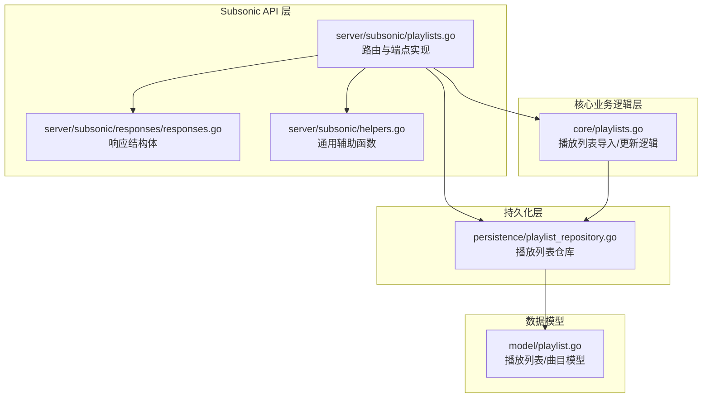
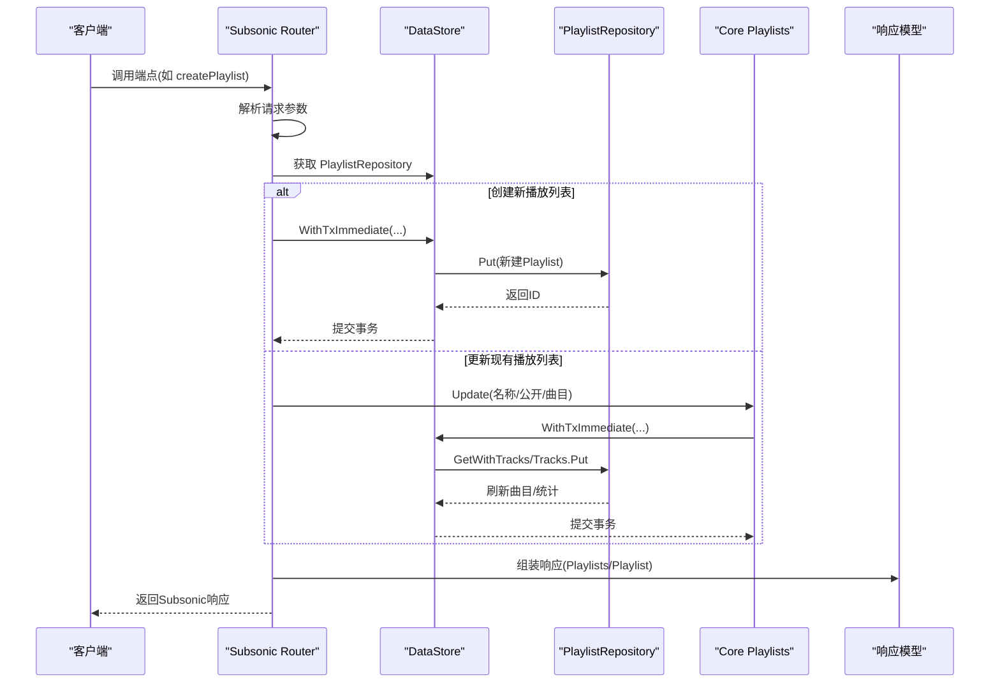
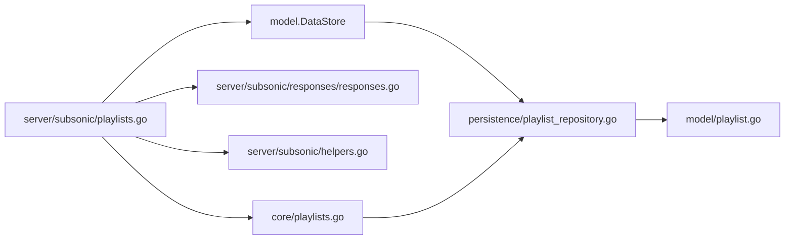

# 播放列表管理

<cite>
**本文引用的文件**
- [server/subsonic/playlists.go](file://server/subsonic/playlists.go)
- [server/subsonic/responses/responses.go](file://server/subsonic/responses/responses.go)
- [server/subsonic/helpers.go](file://server/subsonic/helpers.go)
- [core/playlists.go](file://core/playlists.go)
- [persistence/playlist_repository.go](file://persistence/playlist_repository.go)
- [model/playlist.go](file://model/playlist.go)
- [server/subsonic/playlists_test.go](file://server/subsonic/playlists_test.go)
</cite>

## 目录
1. [简介](#简介)
2. [项目结构](#项目结构)
3. [核心组件](#核心组件)
4. [架构总览](#架构总览)
5. [详细组件分析](#详细组件分析)
6. [依赖关系分析](#依赖关系分析)
7. [性能考量](#性能考量)
8. [故障排查指南](#故障排查指南)
9. [结论](#结论)
10. [附录：请求/响应示例](#附录请求响应示例)

## 简介
本文件面向Subsonic API的播放列表管理功能，系统性梳理并记录以下端点的实现细节：
- getPlaylists：列出当前用户可访问的所有播放列表
- getPlaylist：按ID返回播放列表及其歌曲条目
- createPlaylist：创建新播放列表或向已有播放列表追加歌曲
- updatePlaylist：重命名/修改公开状态/添加/移除歌曲
- deletePlaylist：删除播放列表

文档严格依据playlists.go中的实现，重点覆盖权限验证、数据持久化、播放列表与媒体文件的关联机制，以及在多用户环境下的隔离策略。同时说明与核心业务逻辑层(core/playlists.go)和持久化层(persistence/playlist_repository.go)的交互关系，并提供常见使用场景的请求/响应示例。

## 项目结构
围绕播放列表管理的关键代码分布如下：
- Subsonic API层：server/subsonic/playlists.go
- 响应模型：server/subsonic/responses/responses.go
- 辅助工具：server/subsonic/helpers.go
- 核心业务逻辑：core/playlists.go
- 持久化层：persistence/playlist_repository.go
- 数据模型：model/playlist.go
- 单元测试：server/subsonic/playlists_test.go

图表来源
- [server/subsonic/playlists.go](file://server/subsonic/playlists.go#L1-L173)
- [server/subsonic/responses/responses.go](file://server/subsonic/responses/responses.go#L1-L120)
- [server/subsonic/helpers.go](file://server/subsonic/helpers.go#L1-L120)
- [core/playlists.go](file://core/playlists.go#L1-L120)
- [persistence/playlist_repository.go](file://persistence/playlist_repository.go#L1-L120)
- [model/playlist.go](file://model/playlist.go#L1-L120)

章节来源
- [server/subsonic/playlists.go](file://server/subsonic/playlists.go#L1-L173)
- [server/subsonic/responses/responses.go](file://server/subsonic/responses/responses.go#L1-L120)
- [server/subsonic/helpers.go](file://server/subsonic/helpers.go#L1-L120)
- [core/playlists.go](file://core/playlists.go#L1-L120)
- [persistence/playlist_repository.go](file://persistence/playlist_repository.go#L1-L120)
- [model/playlist.go](file://model/playlist.go#L1-L120)

## 核心组件
- Subsonic播放列表路由与端点
  - 提供getPlaylists、getPlaylist、createPlaylist、updatePlaylist、deletePlaylist五个端点
  - 使用请求参数解析器获取参数，调用数据存储层执行业务操作
- 响应模型
  - 定义统一的Subsonic响应结构，包含status、version、playlists、playlist等字段
  - 定义Playlist、Playlists、PlaylistWithSongs等子结构用于序列化
- 核心业务逻辑
  - 提供ImportM3U、ImportFile、Update等方法，负责播放列表导入与更新
  - 在事务中协调播放列表信息与曲目集合的变更
- 持久化层
  - 实现播放列表的增删改查、曲目刷新与统计更新
  - 处理智能播放列表的规则评估与缓存控制
- 数据模型
  - 定义Playlist、PlaylistTrack、PlaylistTracks等结构，承载播放列表与媒体文件的关联

章节来源
- [server/subsonic/playlists.go](file://server/subsonic/playlists.go#L1-L173)
- [server/subsonic/responses/responses.go](file://server/subsonic/responses/responses.go#L1-L120)
- [core/playlists.go](file://core/playlists.go#L1-L120)
- [persistence/playlist_repository.go](file://persistence/playlist_repository.go#L1-L120)
- [model/playlist.go](file://model/playlist.go#L1-L120)

## 架构总览
Subsonic API层通过Router将HTTP请求映射到具体方法；方法内部调用数据存储层的PlaylistRepository进行读写；核心业务逻辑层负责复杂规则（如智能播放列表）与批量导入；响应模型统一输出标准格式。

图表来源
- [server/subsonic/playlists.go](file://server/subsonic/playlists.go#L60-L153)
- [core/playlists.go](file://core/playlists.go#L417-L470)
- [persistence/playlist_repository.go](file://persistence/playlist_repository.go#L112-L143)
- [server/subsonic/responses/responses.go](file://server/subsonic/responses/responses.go#L1-L120)

## 详细组件分析

### 端点：getPlaylists
- 功能：返回当前用户可访问的所有播放列表（按名称排序）
- 请求参数：无
- 响应结构：包含Playlists数组，每个元素为Playlist对象
- 权限与隔离：仓库层通过userFilter限制仅返回公开播放列表或本人拥有的播放列表
- 错误处理：查询失败时记录日志并返回错误

章节来源
- [server/subsonic/playlists.go](file://server/subsonic/playlists.go#L17-L29)
- [persistence/playlist_repository.go](file://persistence/playlist_repository.go#L89-L110)
- [persistence/playlist_repository.go](file://persistence/playlist_repository.go#L186-L198)

### 端点：getPlaylist
- 功能：按ID返回播放列表及其中的歌曲条目
- 请求参数：id（播放列表ID）
- 响应结构：包含PlaylistWithSongs，其中Playlist为播放列表信息，Entry为歌曲条目数组
- 权限与隔离：仓库层通过userFilter限制仅返回公开播放列表或本人拥有的播放列表
- 错误处理：未找到时返回“数据不存在”错误；其他错误记录日志并返回

章节来源
- [server/subsonic/playlists.go](file://server/subsonic/playlists.go#L31-L58)
- [persistence/playlist_repository.go](file://persistence/playlist_repository.go#L145-L166)
- [server/subsonic/responses/responses.go](file://server/subsonic/responses/responses.go#L305-L331)

### 端点：createPlaylist
- 功能：创建新播放列表或将歌曲追加到已有播放列表
- 请求参数：
  - playlistId（可选，目标播放列表ID）
  - name（可选，当playlistId为空时必填）
  - songId[]（可选，要加入的歌曲ID列表）
- 行为：
  - 若传入playlistId且存在：校验所有权后向该播放列表追加歌曲
  - 若未传入playlistId：创建新播放列表并设置当前登录用户为所有者
- 事务与持久化：使用Immediate事务，先加载/创建播放列表，再批量追加歌曲，最后提交
- 错误处理：缺少必要参数时报错；权限不足返回授权失败；其他错误记录日志并返回

章节来源
- [server/subsonic/playlists.go](file://server/subsonic/playlists.go#L60-L103)
- [persistence/playlist_repository.go](file://persistence/playlist_repository.go#L112-L143)

### 端点：updatePlaylist
- 功能：重命名播放列表、修改公开状态、添加歌曲、移除歌曲
- 请求参数：
  - playlistId（必填）
  - name（可选）
  - comment（可选，空字符串表示清空）
  - public（可选，true/false）
  - songIdToAdd[]（可选）
  - songIndexToRemove[]（可选，按索引移除）
- 行为：
  - 先检查是否需要曲目刷新或信息更新
  - 曲目刷新路径：从仓库加载播放列表，移除指定索引，追加新增歌曲
  - 信息更新路径：仅更新名称、评论、公开状态
  - 特殊情况：若移除后播放列表为空，则删除全部曲目
- 错误处理：权限不足返回授权失败；其他错误记录日志并返回

章节来源
- [server/subsonic/playlists.go](file://server/subsonic/playlists.go#L122-L153)
- [core/playlists.go](file://core/playlists.go#L417-L470)
- [server/subsonic/playlists_test.go](file://server/subsonic/playlists_test.go#L1-L89)

### 端点：deletePlaylist
- 功能：删除指定播放列表
- 请求参数：id（播放列表ID）
- 权限与隔离：非管理员需校验播放列表所有者是否为当前用户
- 错误处理：权限不足返回授权失败；其他错误记录日志并返回

章节来源
- [server/subsonic/playlists.go](file://server/subsonic/playlists.go#L105-L121)
- [persistence/playlist_repository.go](file://persistence/playlist_repository.go#L98-L110)

### 播放列表与媒体文件的关联机制
- 关联模型：
  - Playlist：包含ID、名称、评论、公开状态、曲目数量、时长、大小、所有者等
  - PlaylistTrack：连接Playlist与MediaFile，记录曲目顺序
- 关联建立：
  - 通过AddMediaFilesByID/AddMediaFiles在内存中构建PlaylistTrack列表
  - 通过仓库层批量插入playlist_tracks表，保持顺序
- 关联读取：
  - GetWithTracks加载播放列表并按顺序载入曲目
  - MediaFiles()将PlaylistTrack转换为MediaFile列表
- 统计更新：
  - refreshCounters计算总时长、总大小、曲目数并更新playlist表

章节来源
- [model/playlist.go](file://model/playlist.go#L1-L120)
- [persistence/playlist_repository.go](file://persistence/playlist_repository.go#L311-L384)

### 多用户隔离策略
- 访问控制：
  - 仓库层userFilter对非管理员用户限制为公开播放列表或本人拥有的播放列表
  - Update/Delete前校验所有者身份，拒绝越权操作
- 所有者设置：
  - 新建播放列表时自动绑定当前登录用户的ID
- 智能播放列表：
  - refreshSmartPlaylist仅在用户匹配时刷新，避免跨用户影响

章节来源
- [persistence/playlist_repository.go](file://persistence/playlist_repository.go#L78-L110)
- [persistence/playlist_repository.go](file://persistence/playlist_repository.go#L224-L299)
- [server/subsonic/playlists.go](file://server/subsonic/playlists.go#L60-L86)

### 与核心业务逻辑层和持久化层的交互
- createPlaylist：
  - 路由层调用core.playlists.Update（当playlistId存在时）或直接在事务中创建
  - 仓库层负责Put与曲目批量更新
- updatePlaylist：
  - 路由层解析参数后委托core.playlists.Update
  - 仓库层在事务内完成GetWithTracks、Tracks.Add/Delete、Put等操作
- deletePlaylist/getPlaylist/getPlaylists：
  - 仓库层根据userFilter过滤结果，确保多用户隔离

章节来源
- [server/subsonic/playlists.go](file://server/subsonic/playlists.go#L60-L153)
- [core/playlists.go](file://core/playlists.go#L417-L470)
- [persistence/playlist_repository.go](file://persistence/playlist_repository.go#L112-L143)

## 依赖关系分析
- 组件耦合与内聚
  - Subsonic Router与DataStore紧密耦合，但通过接口抽象降低对具体实现的依赖
  - 核心业务逻辑与仓库层解耦，便于单元测试与替换
- 直接与间接依赖
  - Router依赖响应模型与请求参数解析
  - 仓库层依赖数据库与过滤/排序映射
- 外部依赖与集成点
  - 日志库用于错误与调试信息输出
  - 请求上下文用于提取用户信息与播放器偏好

图表来源
- [server/subsonic/playlists.go](file://server/subsonic/playlists.go#L1-L173)
- [server/subsonic/responses/responses.go](file://server/subsonic/responses/responses.go#L1-L120)
- [server/subsonic/helpers.go](file://server/subsonic/helpers.go#L1-L120)
- [core/playlists.go](file://core/playlists.go#L1-L120)
- [persistence/playlist_repository.go](file://persistence/playlist_repository.go#L1-L120)
- [model/playlist.go](file://model/playlist.go#L1-L120)

## 性能考量
- 批量插入优化
  - 仓库层在addTracks中分批插入playlist_tracks，避免SQLite变量上限问题
- 智能播放列表刷新
  - refreshSmartPlaylist按配置周期刷新，避免频繁全量扫描
  - 递归刷新子播放列表，保证依赖完整性
- 统计更新
  - refreshCounters一次性聚合统计并批量更新，减少多次往返

章节来源
- [persistence/playlist_repository.go](file://persistence/playlist_repository.go#L334-L384)
- [persistence/playlist_repository.go](file://persistence/playlist_repository.go#L224-L299)

## 故障排查指南
- 授权失败
  - 现象：返回授权失败错误
  - 可能原因：非管理员用户尝试删除/修改非本人播放列表
  - 处理建议：确认当前用户与播放列表所有者一致
- 数据不存在
  - 现象：返回“数据不存在”错误
  - 可能原因：请求的播放列表ID不存在
  - 处理建议：检查ID是否正确或播放列表是否被清理
- 参数缺失
  - 现象：创建播放列表时报错“缺少必要参数”
  - 可能原因：未提供name且未提供playlistId
  - 处理建议：至少提供name或playlistId之一
- 权限不足
  - 现象：删除/更新播放列表时报错
  - 可能原因：非管理员且非所有者
  - 处理建议：切换到对应用户或提升权限

章节来源
- [server/subsonic/playlists.go](file://server/subsonic/playlists.go#L94-L121)
- [persistence/playlist_repository.go](file://persistence/playlist_repository.go#L98-L110)

## 结论
本实现以Subsonic API为核心入口，结合核心业务逻辑与持久化层，完整覆盖播放列表的创建、读取、更新与删除流程。通过仓库层的用户过滤与所有者校验，确保多用户环境下的数据隔离；通过事务与批量操作保障一致性与性能。智能播放列表的规则评估与缓存控制进一步提升了用户体验。

## 附录：请求/响应示例

- getPlaylists
  - 请求：GET /rest/getPlaylists
  - 响应：包含Playlists数组，每个元素为Playlist对象
  - 字段参考：id、name、comment、songCount、duration、public、owner、created、changed、coverArt

- getPlaylist
  - 请求：GET /rest/getPlaylist?id={playlistId}
  - 响应：包含PlaylistWithSongs，Playlist为播放列表信息，Entry为歌曲条目数组
  - 字段参考：Playlist同上；Entry为Child对象数组，包含媒体文件基本信息

- createPlaylist
  - 请求：POST /rest/createPlaylist
    - 参数：playlistId（可选）、name（可选，当playlistId为空时必填）、songId[]（可选）
  - 响应：成功后返回新创建或已更新的播放列表详情（通过getPlaylist）

- updatePlaylist
  - 请求：POST /rest/updatePlaylist
    - 参数：playlistId（必填）、name（可选）、comment（可选，空字符串表示清空）、public（可选，true/false）、songIdToAdd[]（可选）、songIndexToRemove[]（可选）
  - 响应：成功后返回空响应体

- deletePlaylist
  - 请求：POST /rest/deletePlaylist?id={playlistId}
  - 响应：成功后返回空响应体

章节来源
- [server/subsonic/responses/responses.go](file://server/subsonic/responses/responses.go#L305-L331)
- [server/subsonic/playlists.go](file://server/subsonic/playlists.go#L17-L153)
- [server/subsonic/playlists_test.go](file://server/subsonic/playlists_test.go#L1-L89)