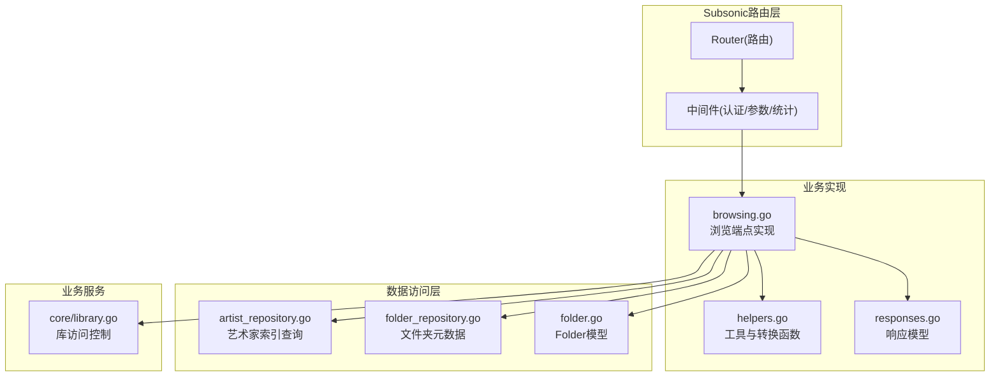
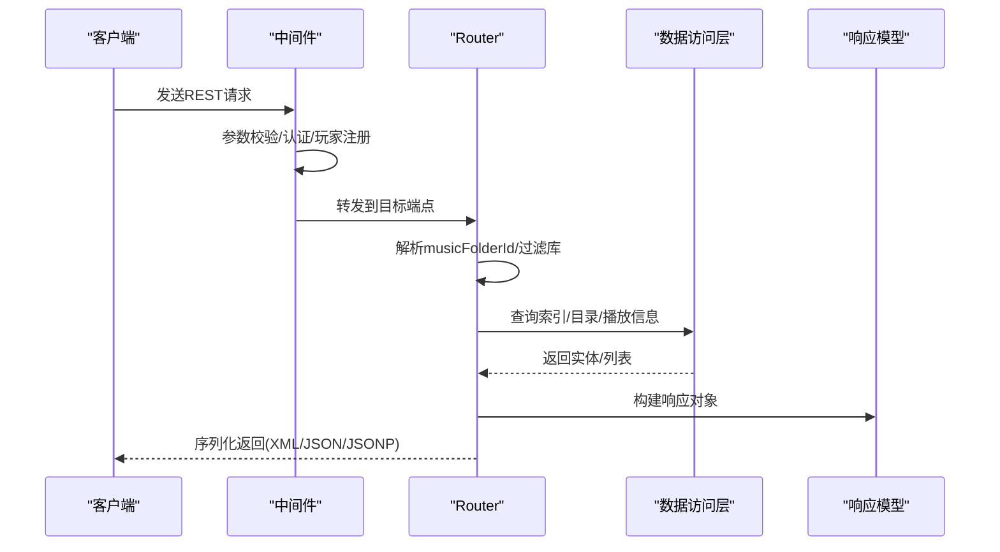
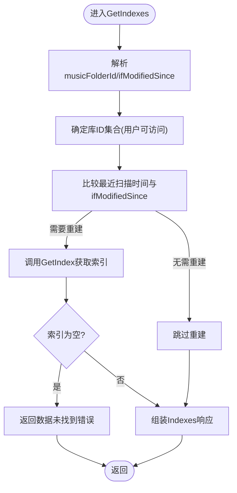
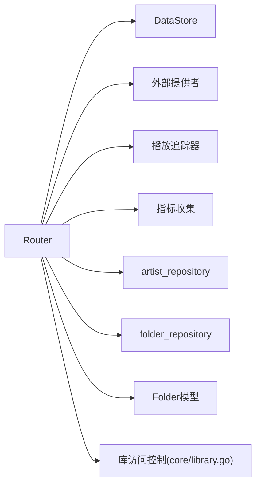

# 浏览功能

<cite>
**本文引用的文件**
- [browsing.go](file://server/subsonic/browsing.go)
- [api.go](file://server/subsonic/api.go)
- [helpers.go](file://server/subsonic/helpers.go)
- [responses.go](file://server/subsonic/responses/responses.go)
- [middlewares.go](file://server/subsonic/middlewares.go)
- [library.go](file://core/library.go)
- [folder.go](file://model/folder.go)
- [folder_repository.go](file://persistence/folder_repository.go)
- [artist_repository.go](file://persistence/artist_repository.go)
- [album_lists.go](file://server/subsonic/album_lists.go)
</cite>

## 目录
1. [简介](#简介)
2. [项目结构](#项目结构)
3. [核心组件](#核心组件)
4. [架构总览](#架构总览)
5. [详细组件分析](#详细组件分析)
6. [依赖分析](#依赖分析)
7. [性能考虑](#性能考虑)
8. [故障排查指南](#故障排查指南)
9. [结论](#结论)

## 简介
本文件面向Subsonic API浏览功能，围绕以下端点进行深入解析：getMusicFolders、getIndexes、getMusicDirectory、getNowPlaying。文档严格依据browsing.go中的实现，覆盖请求参数、响应结构、错误处理、用户权限与库选择、数据构建流程、缓存与性能优化策略，并给出典型请求/响应示例与高并发行为说明。

## 项目结构
浏览功能位于server/subsonic子模块中，核心入口为Router路由注册，具体实现集中在browsing.go；响应结构定义在responses.go；通用辅助函数在helpers.go；中间件负责认证、参数校验、统计上报等；库访问控制由core/library.go提供；底层索引查询由persistence层完成。

图表来源
- [api.go](file://server/subsonic/api.go#L73-L223)
- [browsing.go](file://server/subsonic/browsing.go#L1-L120)
- [helpers.go](file://server/subsonic/helpers.go#L1-L120)
- [responses.go](file://server/subsonic/responses/responses.go#L1-L120)
- [artist_repository.go](file://persistence/artist_repository.go#L272-L316)
- [folder_repository.go](file://persistence/folder_repository.go#L66-L120)
- [folder.go](file://model/folder.go#L1-L40)
- [library.go](file://core/library.go#L30-L130)

章节来源
- [api.go](file://server/subsonic/api.go#L73-L223)

## 核心组件
- Router：注册并分发Subsonic端点，包含浏览相关方法（GetMusicFolders、GetIndexes、GetMusicDirectory、GetNowPlaying等）。
- 中间件：统一处理POST表单转查询参数、必填参数校验、认证、玩家注册与统计上报。
- 响应模型：定义统一的Subsonic响应体及各端点返回结构。
- 工具函数：ID3映射、目录构建、路径与播放信息转换等。
- 数据访问：艺术家索引查询、文件夹元数据查询、库访问控制。

章节来源
- [browsing.go](file://server/subsonic/browsing.go#L1-L120)
- [api.go](file://server/subsonic/api.go#L73-L223)
- [helpers.go](file://server/subsonic/helpers.go#L1-L120)
- [responses.go](file://server/subsonic/responses/responses.go#L1-L120)

## 架构总览
浏览端点的调用链路如下：
- 客户端请求到达Router对应方法
- 中间件完成参数校验、认证、玩家注册
- 方法内部根据用户可访问库集合过滤musicFolderId
- 查询数据源（艺术家索引、专辑/歌曲、媒体文件）
- 构建响应模型并序列化为XML/JSON/JSONP

图表来源
- [api.go](file://server/subsonic/api.go#L73-L223)
- [middlewares.go](file://server/subsonic/middlewares.go#L62-L154)
- [browsing.go](file://server/subsonic/browsing.go#L100-L163)

## 详细组件分析

### getMusicFolders
- 功能：返回当前用户可访问的音乐库列表（库ID与名称）。
- 请求参数：无显式参数；通过上下文获取当前用户可访问库集合。
- 响应结构：MusicFolders（包含多个MusicFolder，含id与name）。
- 权限与库选择：直接从用户持有的库集合构造，不涉及musicFolderId参数。
- 错误处理：无错误分支，成功即返回空错误。
- 使用场景：客户端首次连接时获取可用库列表，用于后续浏览。

章节来源
- [browsing.go](file://server/subsonic/browsing.go#L20-L31)
- [helpers.go](file://server/subsonic/helpers.go#L480-L516)
- [responses.go](file://server/subsonic/responses/responses.go#L84-L114)

### getIndexes
- 功能：按字母分组返回艺术家索引，支持条件刷新（基于ifModifiedSince与最近扫描时间）。
- 请求参数：
  - musicFolderId：可选，指定库ID；未提供则默认使用用户可访问的所有库。
  - ifModifiedSince：可选，毫秒时间戳，用于判断是否需要重新计算索引。
- 响应结构：Indexes（包含IgnoredArticles、LastModified与Index数组）。
- 数据来源与逻辑：
  - 读取属性表中的“最后扫描开始时间”，与ifModifiedSince比较决定是否重新计算索引。
  - 若需要计算，调用艺术家仓库的GetIndex接口，按库ID过滤并按角色筛选。
  - 若结果为空，返回“库不存在或为空”的错误。
- 错误处理：库不可达或为空时返回数据未找到错误；其他异常透传。
- 使用场景：客户端侧边栏按首字母分组浏览艺术家，支持增量刷新。

图表来源
- [browsing.go](file://server/subsonic/browsing.go#L33-L80)
- [artist_repository.go](file://persistence/artist_repository.go#L272-L316)

章节来源
- [browsing.go](file://server/subsonic/browsing.go#L100-L113)
- [helpers.go](file://server/subsonic/helpers.go#L486-L516)
- [artist_repository.go](file://persistence/artist_repository.go#L272-L316)

### getMusicDirectory
- 功能：根据id返回目录详情（艺术家或专辑），包含子项（专辑或歌曲）。
- 请求参数：
  - id：必需，艺术家或专辑的唯一标识。
- 响应结构：Directory（包含id、name、子项children等）。
- 数据来源与逻辑：
  - 通过实体工厂按id解析实体类型（Artist或Album）。
  - 若为Artist：构建艺术家目录，查询其所有专辑并映射为子项。
  - 若为Album：构建专辑目录，查询该专辑下所有歌曲并映射为子项。
  - 其他类型返回“目录未找到”错误。
- 错误处理：实体不存在、类型不匹配、查询异常均返回相应错误。
- 使用场景：展开艺术家或专辑，查看其子层级内容。

章节来源
- [browsing.go](file://server/subsonic/browsing.go#L128-L163)
- [browsing.go](file://server/subsonic/browsing.go#L403-L471)
- [responses.go](file://server/subsonic/responses/responses.go#L200-L224)

### getNowPlaying
- 功能：返回当前正在播放的媒体条目列表（含用户名、播放时长等）。
- 请求参数：无显式参数。
- 响应结构：NowPlaying（包含Entry数组，每项为NowPlayingEntry）。
- 数据来源与逻辑：
  - 调用播放追踪器获取当前播放信息列表。
  - 将媒体文件映射为子项（Child），填充用户名、分钟数、播放器信息等。
- 错误处理：查询异常记录错误并返回。
- 使用场景：实时显示在线用户播放状态，用于社交/共享场景。

章节来源
- [album_lists.go](file://server/subsonic/album_lists.go#L204-L225)
- [responses.go](file://server/subsonic/responses/responses.go#L356-L366)

### 通用参数与权限控制
- musicFolderId参数：
  - 当提供时，需校验用户对这些库有访问权限；若任一无效，返回数据未找到错误。
  - 当未提供时，默认使用用户可访问的所有库。
- 认证与中间件：
  - 必填参数校验（u/v/c或内部/反向代理认证）。
  - 用户名、客户端、版本注入上下文。
  - 玩家注册与转码配置注入上下文。
  - 统计上报记录状态码与耗时。

章节来源
- [helpers.go](file://server/subsonic/helpers.go#L486-L516)
- [middlewares.go](file://server/subsonic/middlewares.go#L62-L154)
- [api.go](file://server/subsonic/api.go#L73-L125)

## 依赖分析
- Router依赖：
  - DataStore（模型仓储）、外部提供者、播放追踪器、事件总线、指标收集等。
- 数据访问：
  - 艺术家索引查询依赖artist_repository，按库ID与角色过滤。
  - 文件夹元数据查询依赖folder_repository，支持批量路径更新信息。
- 模型与库：
  - Folder模型定义库内相对路径、父子关系、哈希等字段。
  - 库访问控制由core/library.go提供，确保用户仅能访问被授权的库。

图表来源
- [api.go](file://server/subsonic/api.go#L29-L71)
- [artist_repository.go](file://persistence/artist_repository.go#L272-L316)
- [folder_repository.go](file://persistence/folder_repository.go#L66-L120)
- [folder.go](file://model/folder.go#L1-L40)
- [library.go](file://core/library.go#L30-L130)

章节来源
- [api.go](file://server/subsonic/api.go#L29-L71)
- [artist_repository.go](file://persistence/artist_repository.go#L272-L316)
- [folder_repository.go](file://persistence/folder_repository.go#L66-L120)
- [folder.go](file://model/folder.go#L1-L40)
- [library.go](file://core/library.go#L30-L130)

## 性能考虑
- 索引重建策略
  - getIndexes会根据“最近扫描开始时间”与客户端提供的ifModifiedSince进行对比，仅在需要时重建索引，避免重复计算。
  - 艺术家索引查询支持按库ID与角色过滤，减少无关数据扫描。
- 数据预加载与批量处理
  - folder_repository在查询文件夹更新信息时采用分批处理（每批约100个路径），避免SQLite表达式树深度限制。
- 缓存机制
  - 项目存在通用缓存抽象（SimpleCache、FileCache），但浏览端点未直接使用；索引重建遵循“按需”原则，结合属性表中的扫描时间实现增量刷新。
- 并发与高负载
  - 中间件记录请求耗时与状态码，便于监控与定位瓶颈。
  - 播放追踪器返回NowPlaying列表，建议客户端合理设置轮询间隔以降低服务器压力。

章节来源
- [browsing.go](file://server/subsonic/browsing.go#L33-L80)
- [artist_repository.go](file://persistence/artist_repository.go#L272-L316)
- [folder_repository.go](file://persistence/folder_repository.go#L97-L170)
- [middlewares.go](file://server/subsonic/middlewares.go#L240-L273)

## 故障排查指南
- getIndexes返回“数据未找到”
  - 可能原因：用户无任何可访问库，或库为空。
  - 排查要点：确认用户库分配、库是否存在、最近扫描是否成功。
- getMusicDirectory返回“目录未找到”
  - 可能原因：id不存在、类型非Artist/Album。
  - 排查要点：核对id格式、实体类型、库访问权限。
- getNowPlaying异常
  - 可能原因：播放追踪器查询失败。
  - 排查要点：检查播放追踪器状态、日志错误信息。
- 参数缺失或认证失败
  - 可能原因：缺少u/v/c或内部/反向代理认证头；凭据不正确。
  - 排查要点：确认必填参数、客户端版本、用户名与密码/令牌/JWT。

章节来源
- [browsing.go](file://server/subsonic/browsing.go#L128-L163)
- [middlewares.go](file://server/subsonic/middlewares.go#L62-L154)

## 结论
浏览功能通过明确的端点职责、严格的参数与权限控制、按需索引重建与批量查询优化，实现了高效稳定的音乐库浏览体验。结合中间件的统计与日志能力，可在高并发场景下保持可观的稳定性与可观测性。建议客户端合理使用ifModifiedSince与musicFolderId参数，以减少不必要的数据传输与计算开销。