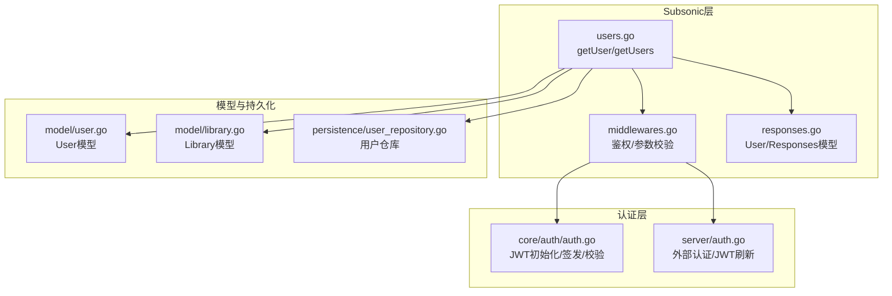
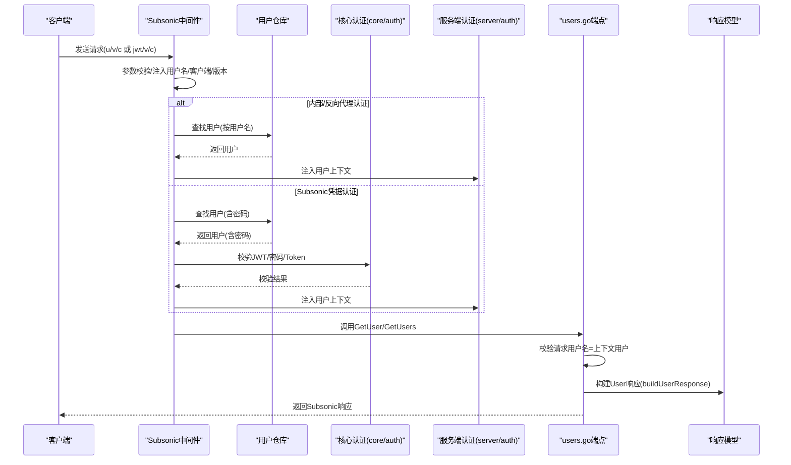
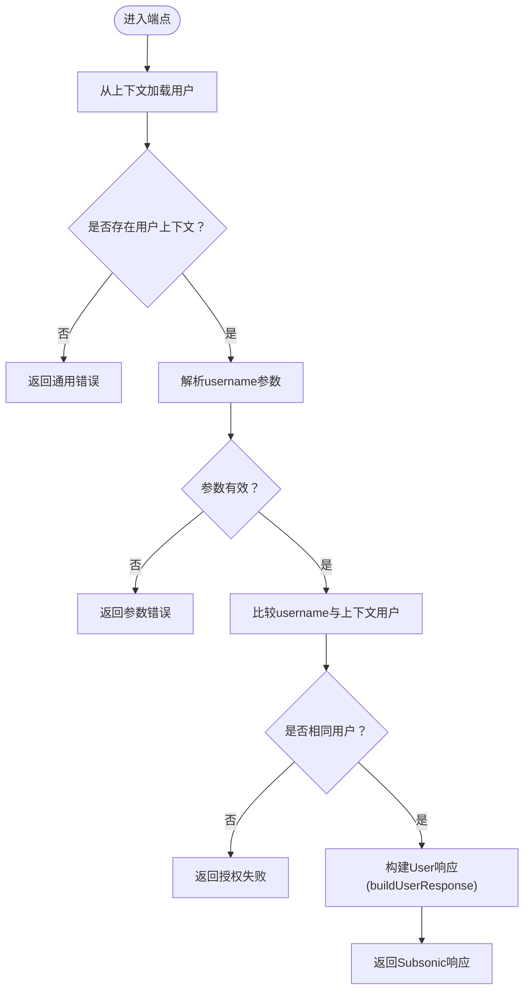
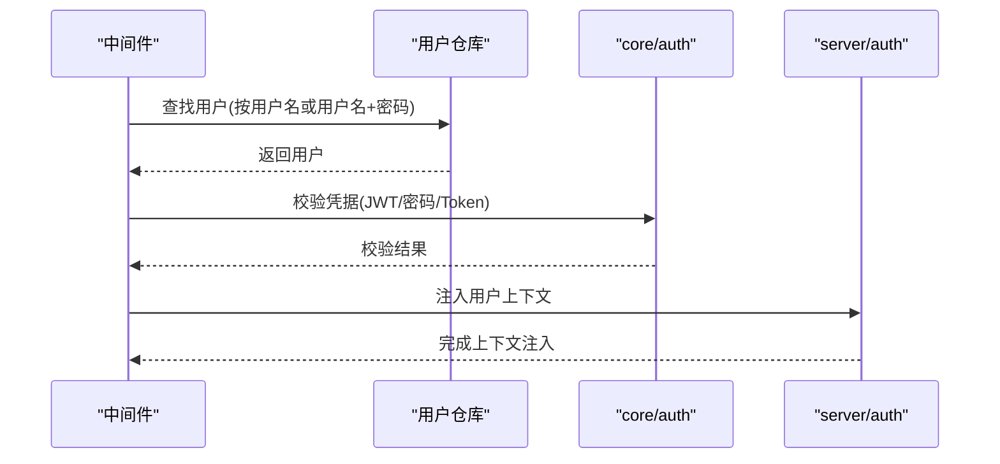
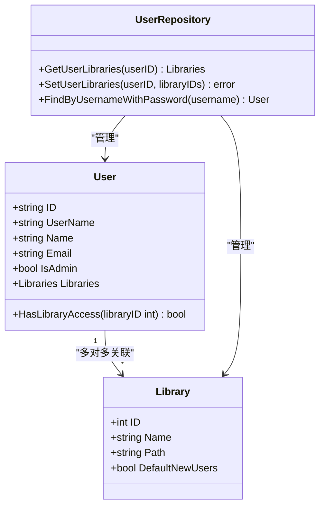
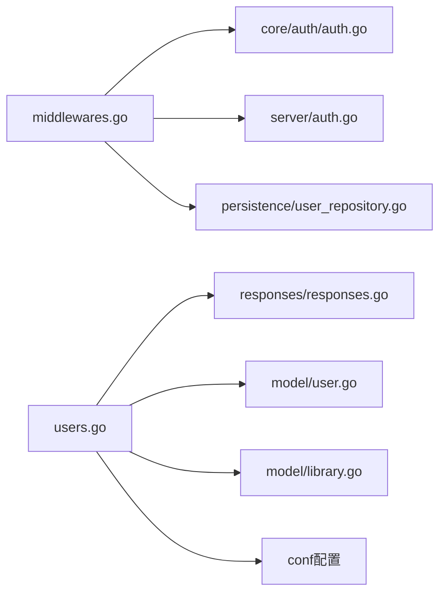

# 用户管理

<cite>
**本文引用的文件**
- [server/subsonic/users.go](file://server/subsonic/users.go)
- [server/subsonic/responses/responses.go](file://server/subsonic/responses/responses.go)
- [server/subsonic/middlewares.go](file://server/subsonic/middlewares.go)
- [server/auth.go](file://server/auth.go)
- [core/auth/auth.go](file://core/auth/auth.go)
- [model/user.go](file://model/user.go)
- [model/library.go](file://model/library.go)
- [persistence/user_repository.go](file://persistence/user_repository.go)
- [server/subsonic/users_test.go](file://server/subsonic/users_test.go)
</cite>

## 目录
1. [简介](#简介)
2. [项目结构](#项目结构)
3. [核心组件](#核心组件)
4. [架构总览](#架构总览)
5. [详细组件分析](#详细组件分析)
6. [依赖分析](#依赖分析)
7. [性能考量](#性能考量)
8. [故障排查指南](#故障排查指南)
9. [结论](#结论)
10. [附录](#附录)

## 简介
本文件面向Subsonic API的用户管理功能，聚焦于getUser与getUsers两个端点的实现细节与调用关系。文档严格依据users.go中的实现，覆盖以下关键主题：
- 用户信息检索：从请求上下文提取当前登录用户，读取其基础信息与库权限。
- 权限验证：仅允许用户查询自己的信息；若请求用户名与上下文用户不一致则拒绝。
- 配置获取：根据全局配置动态设置下载、分享、机箱播放等角色权限。
- 数据序列化：将模型User映射为Subsonic响应对象User，包含隐私字段过滤策略。
- 认证与授权集成：与核心认证服务（core/auth/auth.go）及Subsonic中间件协作完成鉴权与会话维护。
- 多用户环境安全：说明库访问控制、角色判定与隐私保护。

## 项目结构
与用户管理直接相关的模块分布如下：
- server/subsonic：Subsonic API路由与中间件，包含用户端点与响应模型。
- core/auth：JWT初始化、令牌签发与校验，用于UI与内部服务。
- server：通用认证逻辑（如外部认证头、JWT刷新等），与Subsonic中间件共同完成用户上下文注入。
- model：用户与库的数据模型定义。
- persistence：用户仓库实现，负责数据库访问、库关联与权限校验。

图表来源
- [server/subsonic/users.go](file://server/subsonic/users.go#L1-L64)
- [server/subsonic/middlewares.go](file://server/subsonic/middlewares.go#L1-L273)
- [server/subsonic/responses/responses.go](file://server/subsonic/responses/responses.go#L1-L619)
- [core/auth/auth.go](file://core/auth/auth.go#L1-L148)
- [server/auth.go](file://server/auth.go#L1-L372)
- [model/user.go](file://model/user.go#L1-L62)
- [model/library.go](file://model/library.go#L1-L62)
- [persistence/user_repository.go](file://persistence/user_repository.go#L1-L476)

章节来源
- [server/subsonic/users.go](file://server/subsonic/users.go#L1-L64)
- [server/subsonic/middlewares.go](file://server/subsonic/middlewares.go#L1-L273)
- [server/subsonic/responses/responses.go](file://server/subsonic/responses/responses.go#L1-L619)
- [core/auth/auth.go](file://core/auth/auth.go#L1-L148)
- [server/auth.go](file://server/auth.go#L1-L372)
- [model/user.go](file://model/user.go#L1-L62)
- [model/library.go](file://model/library.go#L1-L62)
- [persistence/user_repository.go](file://persistence/user_repository.go#L1-L476)

## 核心组件
- 用户端点（users.go）
  - buildUserResponse：将model.User映射为Subsonic响应User对象，填充角色权限与库列表。
  - GetUser：校验请求用户名与上下文用户一致后返回单个用户信息。
  - GetUsers：返回当前用户的用户列表包装。
- 响应模型（responses.go）
  - Subsonic：统一响应容器，包含状态、版本、类型、服务器版本与具体业务节点（如User/Users）。
  - User：Subsonic用户响应结构，包含角色位（如AdminRole、DownloadRole、ShareRole、JukeboxRole、StreamRole、ScrobblingEnabled）与可访问库ID列表（Folder）。
- 中间件（middlewares.go）
  - 参数校验：确保必要参数存在（u/v/c或jwt/v/c）。
  - 认证：支持内部/反向代理认证与Subsonic凭据（p/token/s/jwt）三种路径，最终将用户注入上下文。
  - 凭据校验：支持JWT、明文密码、旧式token+salt校验。
- 认证服务（core/auth/auth.go）
  - 初始化JWT密钥、签发与刷新令牌、校验令牌。
- 模型（model/user.go、model/library.go）
  - User：包含基础字段与库关联；HasLibraryAccess用于快速判断库访问。
  - Library：库元数据与默认新用户分配标记。
- 仓库（persistence/user_repository.go）
  - 提供Find/Get/Put、库关联管理、最后登录/访问时间更新等能力。

章节来源
- [server/subsonic/users.go](file://server/subsonic/users.go#L1-L64)
- [server/subsonic/responses/responses.go](file://server/subsonic/responses/responses.go#L1-L619)
- [server/subsonic/middlewares.go](file://server/subsonic/middlewares.go#L1-L273)
- [core/auth/auth.go](file://core/auth/auth.go#L1-L148)
- [model/user.go](file://model/user.go#L1-L62)
- [model/library.go](file://model/library.go#L1-L62)
- [persistence/user_repository.go](file://persistence/user_repository.go#L1-L476)

## 架构总览
下图展示了从客户端到用户端点的完整调用链，以及与认证服务的交互。

图表来源
- [server/subsonic/middlewares.go](file://server/subsonic/middlewares.go#L50-L180)
- [server/subsonic/users.go](file://server/subsonic/users.go#L35-L63)
- [core/auth/auth.go](file://core/auth/auth.go#L103-L148)
- [server/auth.go](file://server/auth.go#L174-L216)
- [persistence/user_repository.go](file://persistence/user_repository.go#L178-L195)
- [server/subsonic/responses/responses.go](file://server/subsonic/responses/responses.go#L368-L390)

## 详细组件分析

### 组件A：用户端点与响应映射
- 端点职责
  - GetUser：仅允许请求者查询自身信息；若username与上下文用户不一致则返回授权失败。
  - GetUsers：返回当前用户的用户列表包装。
- 响应映射
  - buildUserResponse将model.User映射为Subsonic.User，包含：
    - 基础字段：用户名、邮箱、角色位（AdminRole、StreamRole、ScrobblingEnabled、DownloadRole、ShareRole、JukeboxRole）、可访问库ID列表（Folder）。
    - 角色位来源：
      - StreamRole、ScrobblingEnabled固定为true。
      - DownloadRole、ShareRole来自全局配置开关。
      - JukeboxRole取决于配置开关与是否管理员。
      - Folder来自用户关联的库ID集合。
- 错误处理
  - 缺少用户上下文时返回通用错误。
  - 参数缺失或用户名不匹配时返回相应错误码。

图表来源
- [server/subsonic/users.go](file://server/subsonic/users.go#L35-L63)

章节来源
- [server/subsonic/users.go](file://server/subsonic/users.go#L1-L64)
- [server/subsonic/responses/responses.go](file://server/subsonic/responses/responses.go#L368-L390)

### 组件B：认证与授权集成
- 中间件认证路径
  - 内部/反向代理认证：从上下文或外部认证头提取用户名，直接查询用户并注入上下文。
  - Subsonic凭据认证：支持jwt、明文密码、旧式token+salt三种校验方式，最终将用户注入上下文。
- 令牌校验
  - JWT：使用core/auth.Validate进行校验，要求sub与用户名一致。
  - 密码：支持“enc:”前缀的十六进制编码密码解码后比对。
  - Token：基于“密码+盐”的MD5值比对。
- 会话维护
  - 通过server/auth.go的JWT刷新中间件更新过期时间并回写响应头，确保长期会话可用性。

图表来源
- [server/subsonic/middlewares.go](file://server/subsonic/middlewares.go#L98-L180)
- [core/auth/auth.go](file://core/auth/auth.go#L103-L148)
- [server/auth.go](file://server/auth.go#L174-L216)
- [persistence/user_repository.go](file://persistence/user_repository.go#L178-L195)

章节来源
- [server/subsonic/middlewares.go](file://server/subsonic/middlewares.go#L1-L273)
- [core/auth/auth.go](file://core/auth/auth.go#L1-L148)
- [server/auth.go](file://server/auth.go#L1-L372)
- [persistence/user_repository.go](file://persistence/user_repository.go#L178-L195)

### 组件C：用户模型与库权限
- 用户模型
  - User包含基础字段与库关联；HasLibraryAccess用于快速判断库访问。
- 库模型
  - Library包含库元数据与默认新用户分配标记。
- 仓库能力
  - GetUserLibraries/SetUserLibraries：管理用户与库的多对多关联。
  - FindByUsernameWithPassword：查询用户并解密密码，用于凭据校验。

图表来源
- [model/user.go](file://model/user.go#L1-L62)
- [model/library.go](file://model/library.go#L1-L62)
- [persistence/user_repository.go](file://persistence/user_repository.go#L441-L471)

章节来源
- [model/user.go](file://model/user.go#L1-L62)
- [model/library.go](file://model/library.go#L1-L62)
- [persistence/user_repository.go](file://persistence/user_repository.go#L441-L471)

### 组件D：隐私数据过滤与序列化
- 隐私字段
  - User.Password与NewPassword等敏感字段在模型层面被标注为“仅后端使用且不对外传输”，避免在响应中泄露。
- 响应序列化
  - Subsonic.User仅包含公开的角色位与库ID列表，不包含密码等敏感信息。
- 测试验证
  - 单测覆盖了GetUser与GetUsers返回字段一致性、Jukebox角色权限、Folder列表填充等场景，确保隐私字段未被泄露。

章节来源
- [model/user.go](file://model/user.go#L1-L62)
- [server/subsonic/responses/responses.go](file://server/subsonic/responses/responses.go#L368-L390)
- [server/subsonic/users_test.go](file://server/subsonic/users_test.go#L1-L176)

## 依赖分析
- 组件耦合
  - users.go依赖model.User、model/request、utils/slice、conf配置与responses.User。
  - middlewares.go依赖core/auth与server/auth完成凭据校验与上下文注入。
  - persistence/user_repository.go提供用户与库的读写能力。
- 关键依赖链
  - 请求经中间件注入用户上下文后，由users.go端点读取上下文用户并构建响应。
  - 凭据校验通过core/auth.Validate与server/auth的JWT刷新机制保障安全性与可用性。
- 潜在循环依赖
  - 当前模块以接口与上下文传递为主，未见明显循环依赖迹象。

图表来源
- [server/subsonic/middlewares.go](file://server/subsonic/middlewares.go#L1-L273)
- [core/auth/auth.go](file://core/auth/auth.go#L1-L148)
- [server/auth.go](file://server/auth.go#L1-L372)
- [persistence/user_repository.go](file://persistence/user_repository.go#L1-L476)
- [server/subsonic/users.go](file://server/subsonic/users.go#L1-L64)
- [server/subsonic/responses/responses.go](file://server/subsonic/responses/responses.go#L1-L619)
- [model/user.go](file://model/user.go#L1-L62)
- [model/library.go](file://model/library.go#L1-L62)

章节来源
- [server/subsonic/middlewares.go](file://server/subsonic/middlewares.go#L1-L273)
- [core/auth/auth.go](file://core/auth/auth.go#L1-L148)
- [server/auth.go](file://server/auth.go#L1-L372)
- [persistence/user_repository.go](file://persistence/user_repository.go#L1-L476)
- [server/subsonic/users.go](file://server/subsonic/users.go#L1-L64)
- [server/subsonic/responses/responses.go](file://server/subsonic/responses/responses.go#L1-L619)
- [model/user.go](file://model/user.go#L1-L62)
- [model/library.go](file://model/library.go#L1-L62)

## 性能考量
- 查询优化
  - 用户与库关联通过一次SQL聚合查询一次性返回，减少往返次数。
- 序列化开销
  - buildUserResponse仅做简单映射与配置计算，开销极低。
- 并发与会话
  - JWT刷新与凭据校验均在中间件阶段完成，避免在业务端点重复校验。
- 建议
  - 对频繁调用的端点可结合缓存策略（如响应缓存）进一步降低数据库压力，但需注意隐私字段与权限变更带来的失效问题。

## 故障排查指南
- 常见错误与定位
  - 授权失败：当username与上下文用户不一致时触发。检查客户端是否正确传入当前用户。
  - 缺少参数：当缺少u/v/c或jwt/v/c时触发。确认客户端参数拼接与编码。
  - 无用户上下文：当中间件未能从任何认证路径获取用户时触发。检查外部认证头、JWT或Subsonic凭据。
- 日志与追踪
  - 中间件会记录请求上下文（用户名、客户端、版本）与认证类型，便于定位问题。
- 单元测试参考
  - 参考users_test.go中的断言，复现典型场景（Jukebox角色、Folder列表、授权失败、参数缺失、上下文缺失）。

章节来源
- [server/subsonic/middlewares.go](file://server/subsonic/middlewares.go#L62-L180)
- [server/subsonic/users_test.go](file://server/subsonic/users_test.go#L120-L176)

## 结论
- getUser与getUsers端点严格遵循“仅能查询自身”的授权原则，配合中间件完成多路径认证与上下文注入。
- buildUserResponse将用户模型映射为Subsonic响应对象，角色位与库列表来源于配置与用户关联库，隐私字段得到保护。
- 与core/auth与server/auth的集成确保了JWT签发、校验与刷新的完整性，满足多用户环境下的安全与可用性需求。
- 在多用户环境下，库访问控制通过User.HasLibraryAccess与仓库的库关联管理实现，管理员拥有全库访问权限，普通用户仅能访问被授予的库。

## 附录

### 实际请求/响应示例（基于实现行为）
- 请求示例
  - GET /rest/getUser?u={当前用户名}&v={版本}&c={客户端}&t={JWT}
  - GET /rest/getUsers?v={版本}&c={客户端}&jwt={JWT}
- 响应示例
  - 成功时返回Subsonic响应，包含status、version、serverVersion与User或Users节点。
  - User节点包含：username、email、isAdmin、downloadRole、shareRole、folder等公开字段；不包含密码等隐私字段。
- 角色差异
  - 管理员：isAdmin=true，JukeboxRole取决于配置与AdminOnly策略。
  - 普通用户：isAdmin=false，JukeboxRole仅在启用且非管理员限制时为true。
- 库访问
  - Folder字段包含用户可访问库的ID集合；管理员可访问所有库。

章节来源
- [server/subsonic/users.go](file://server/subsonic/users.go#L35-L63)
- [server/subsonic/responses/responses.go](file://server/subsonic/responses/responses.go#L368-L390)
- [server/subsonic/middlewares.go](file://server/subsonic/middlewares.go#L98-L180)
- [core/auth/auth.go](file://core/auth/auth.go#L103-L148)
- [model/user.go](file://model/user.go#L1-L62)
- [model/library.go](file://model/library.go#L1-L62)
- [persistence/user_repository.go](file://persistence/user_repository.go#L441-L471)