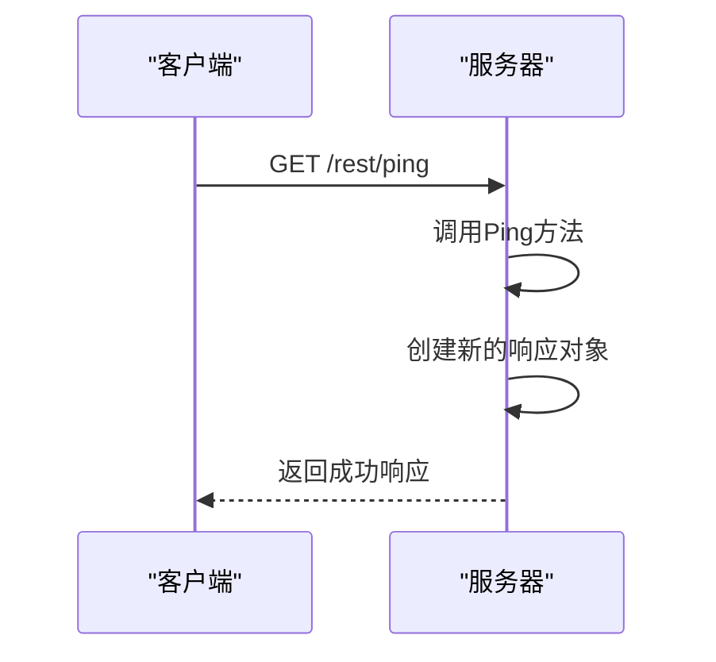
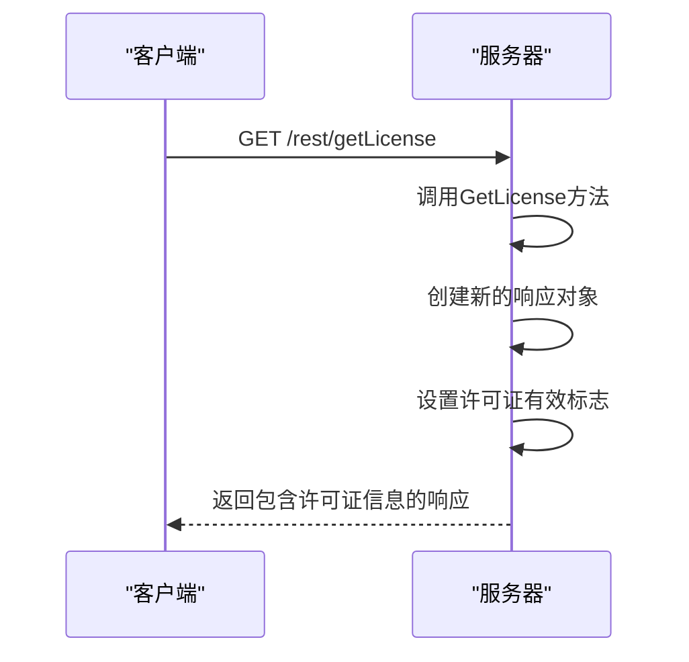
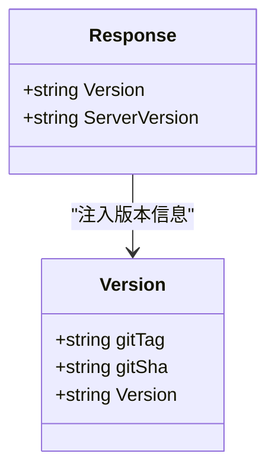
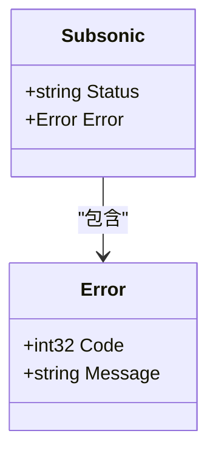
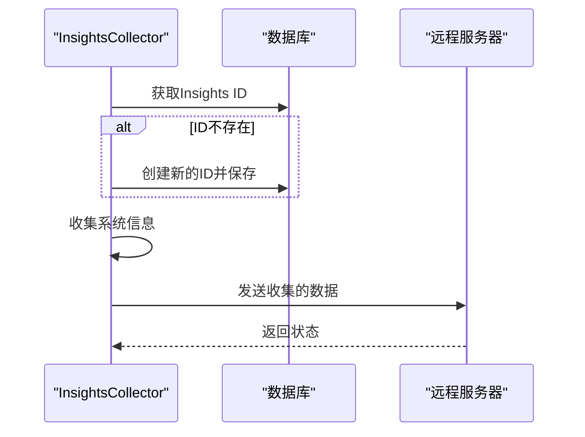

# 系统信息

<cite>
**本文档引用的文件**   
- [system.go](file://server/subsonic/system.go)
- [version.go](file://consts/version.go)
- [insights.go](file://core/metrics/insights.go)
- [responses.go](file://server/subsonic/responses/responses.go)
- [api.go](file://server/subsonic/api.go)
</cite>

## 目录
1. [简介](#简介)
2. [系统端点实现](#系统端点实现)
3. [心跳检测逻辑](#心跳检测逻辑)
4. [许可证状态查询](#许可证状态查询)
5. [版本信息注入机制](#版本信息注入机制)
6. [错误响应格式](#错误响应格式)
7. [系统状态监控集成](#系统状态监控集成)
8. [请求/响应示例](#请求响应示例)
9. [客户端连接管理与故障诊断](#客户端连接管理与故障诊断)

## 简介
本文档详细解释了Navidrome项目中Subsonic API系统信息功能的实现细节。重点分析了ping、getLicense等系统端点的调用流程，以及系统健康检查、版本信息获取和许可证状态查询的功能。文档内容与`system.go`中的实现完全一致，并说明了这些端点在客户端连接管理和故障诊断中的重要作用。

## 系统端点实现
Subsonic API提供了多个系统信息相关的端点，用于监控服务器状态和获取系统信息。主要端点包括：
- `ping`: 用于心跳检测，验证服务器是否正常运行
- `getLicense`: 查询许可证状态
- `getOpenSubsonicExtensions`: 获取OpenSubsonic扩展支持信息

这些端点的实现位于`server/subsonic/system.go`文件中，通过`Router`结构体的方法进行定义。

**Section sources**
- [system.go](file://server/subsonic/system.go#L9-L17)

## 心跳检测逻辑
心跳检测通过`Ping`方法实现，该方法是`Router`结构体的一个方法。当客户端调用ping端点时，服务器会返回一个成功的响应，表明服务器正在运行且可以处理请求。



**Diagram sources**
- [system.go](file://server/subsonic/system.go#L9-L11)

## 许可证状态查询
许可证状态查询功能通过`GetLicense`方法实现。该方法返回一个包含许可证信息的响应，其中许可证的有效性始终设置为true。



**Diagram sources**
- [system.go](file://server/subsonic/system.go#L13-L17)

## 版本信息注入机制
版本信息从`consts/version.go`文件中获取，该文件在构建时注入git标签和提交哈希信息。版本信息通过`newResponse`函数注入到每个API响应中。



**Diagram sources**
- [version.go](file://consts/version.go#L8-L26)
- [helpers.go](file://server/subsonic/helpers.go#L25-L33)

## 错误响应格式
当API调用发生错误时，系统会返回标准化的错误响应格式。错误响应包含错误代码和消息，便于客户端进行错误处理。



**Diagram sources**
- [responses.go](file://server/subsonic/responses/responses.go#L75-L78)
- [api.go](file://server/subsonic/api.go#L298-L303)

## 系统状态监控集成
系统状态监控功能与版本管理（`consts/version.go`）和性能指标（`core/metrics/insights.go`）紧密集成。`insights.go`文件中的`GetInstance`函数负责收集系统信息并定期发送到远程服务器。



**Diagram sources**
- [insights.go](file://core/metrics/insights.go#L51-L64)
- [insights.go](file://core/metrics/insights.go#L92-L125)

## 请求/响应示例
### 正常情况下的ping请求
**请求**
```
GET /rest/ping?u=admin&p=pass&t=123&s=456&v=1.16.1&c=navidrome HTTP/1.1
```

**响应**
```json
{
  "subsonic-response": {
    "status": "ok",
    "version": "1.16.1",
    "type": "navidrome",
    "serverVersion": "v0.38.0 (1234567)"
  }
}
```

### 许可证查询响应
**响应**
```json
{
  "subsonic-response": {
    "status": "ok",
    "version": "1.16.1",
    "type": "navidrome",
    "serverVersion": "v0.38.0 (1234567)",
    "license": {
      "valid": true
    }
  }
}
```

### 错误响应示例
**响应**
```json
{
  "subsonic-response": {
    "status": "failed",
    "version": "1.16.1",
    "error": {
      "code": 10,
      "message": "Required parameter is missing"
    }
  }
}
```

**Section sources**
- [api.go](file://server/subsonic/api.go#L308-L326)
- [responses.go](file://server/subsonic/responses/responses.go#L66-L69)

## 客户端连接管理与故障诊断
系统信息端点在客户端连接管理和故障诊断中扮演着重要角色：

1. **部署验证**: 在部署新版本后，客户端可以通过调用ping端点来验证服务器是否正常运行
2. **持续集成测试**: 在CI/CD流程中，这些端点可用于验证部署的完整性
3. **连接健康检查**: 客户端可以定期调用ping端点来检测连接状态
4. **故障诊断**: 当出现问题时，客户端可以获取详细的系统信息来帮助诊断问题

这些端点的设计考虑了与各种客户端的兼容性，支持XML和JSON格式的响应，便于不同类型的客户端进行集成。

**Section sources**
- [api.go](file://server/subsonic/api.go#L73-L222)
- [system.go](file://server/subsonic/system.go#L9-L17)