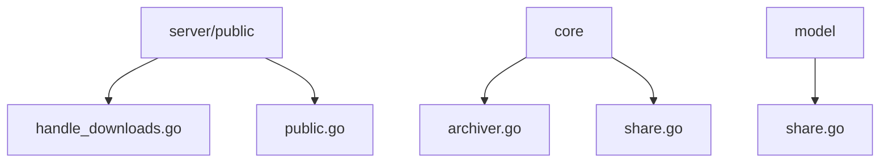
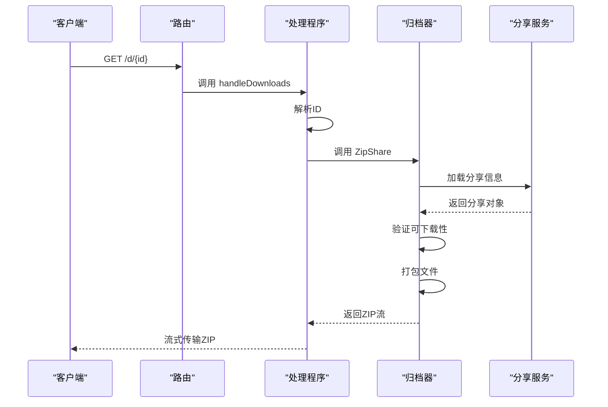
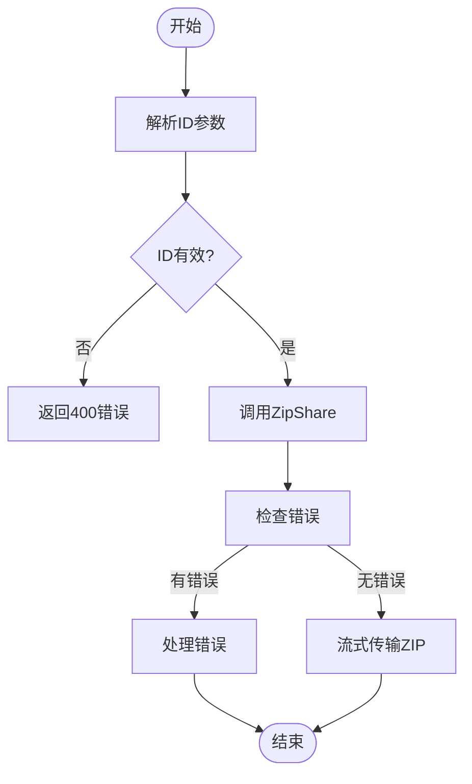
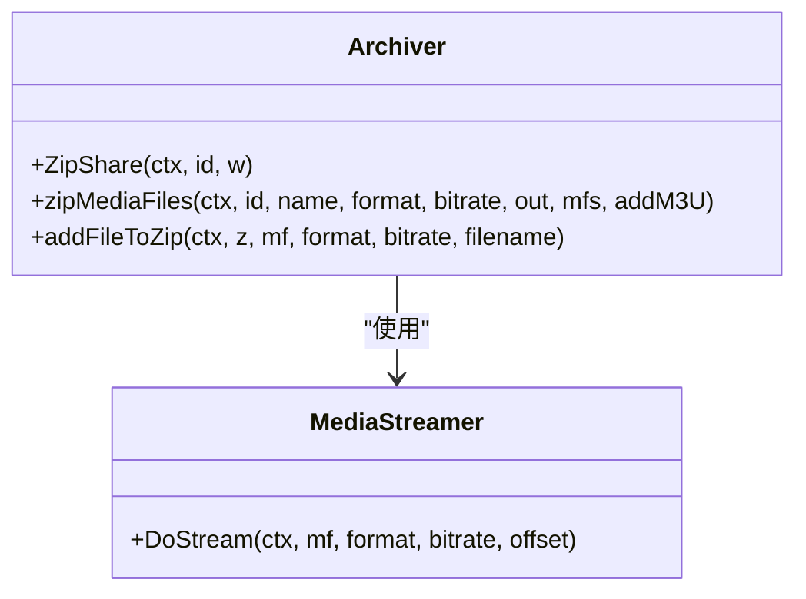
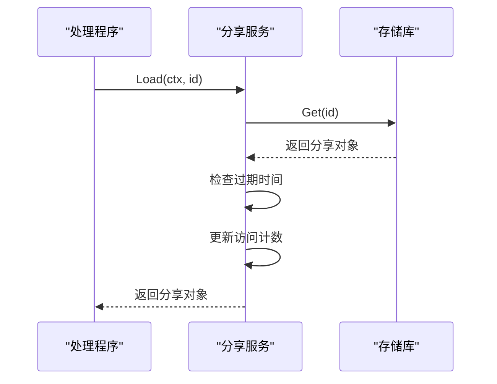
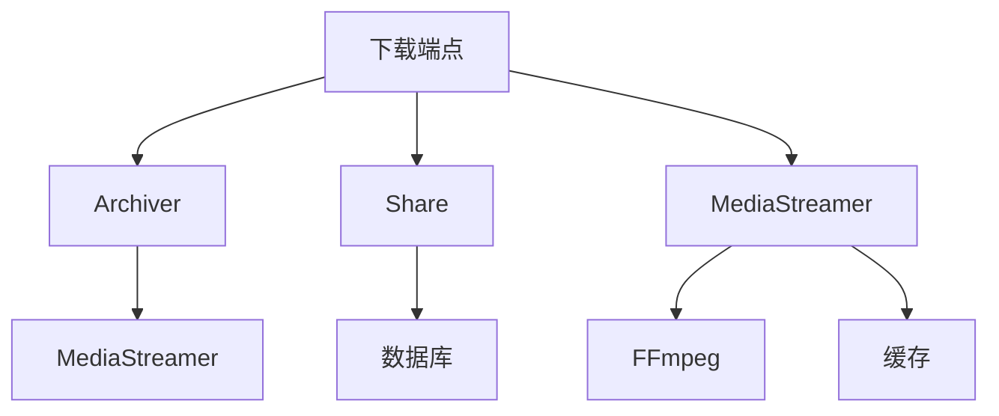

# 下载端点

<cite>
**本文档中引用的文件**  
- [handle_downloads.go](file://server\public\handle_downloads.go)
- [archiver.go](file://core\archiver.go)
- [public.go](file://server\public\public.go)
- [share.go](file://core\share.go)
- [share.go](file://model\share.go)
- [handle_shares.go](file://server\public\handle_shares.go)
- [stream.go](file://server\subsonic\stream.go)
- [media_streamer.go](file://core\media_streamer.go)
</cite>

## 目录
1. [简介](#简介)
2. [项目结构](#项目结构)
3. [核心组件](#核心组件)
4. [架构概述](#架构概述)
5. [详细组件分析](#详细组件分析)
6. [依赖分析](#依赖分析)
7. [性能考虑](#性能考虑)
8. [故障排除指南](#故障排除指南)
9. [结论](#结论)

## 简介
本文档详细解释了Navidrome中`/download/*`路径模式的实现机制。该端点支持单文件下载和播放列表批量下载两种模式，处理流程从URL解析到文件打包和流式传输。下载内容可以是单个音频文件的直接传输或多个文件的ZIP打包。权限控制机制确保只有授权用户或有效分享链接可以访问。端点与播放列表功能集成，能够将播放列表中的媒体文件打包下载。文档还涵盖了性能优化、内存使用和客户端最佳实践建议。

## 项目结构
Navidrome的下载功能主要分布在`server/public`和`core`目录中。`server/public`包含HTTP路由和处理程序，而`core`包含核心业务逻辑和数据处理。

**图表来源**
- [handle_downloads.go](file://server\public\handle_downloads.go)
- [public.go](file://server\public\public.go)
- [archiver.go](file://core\archiver.go)
- [share.go](file://core\share.go)
- [share.go](file://model\share.go)

**章节来源**
- [handle_downloads.go](file://server\public\handle_downloads.go#L1-L18)
- [archiver.go](file://core\archiver.go#L1-L202)

## 核心组件
下载端点的核心组件包括`handleDownloads`处理程序、`Archiver`接口和`Share`服务。`handleDownloads`负责解析请求并调用`Archiver`进行文件打包。`Archiver`实现文件的ZIP打包和流式传输，而`Share`服务管理分享链接的生命周期和权限。

**章节来源**
- [handle_downloads.go](file://server\public\handle_downloads.go#L9-L18)
- [archiver.go](file://core\archiver.go#L18-L23)
- [share.go](file://core\share.go#L19-L22)

## 架构概述
下载端点的架构包括HTTP路由、权限验证、文件打包和流式传输四个主要部分。请求首先通过`public.go`中的路由配置，然后由`handle_downloads.go`处理。`Archiver`服务负责实际的文件打包，而`Share`服务确保下载权限。

**图表来源**
- [public.go](file://server\public\public.go#L39-L65)
- [handle_downloads.go](file://server\public\handle_downloads.go#L9-L18)
- [archiver.go](file://core\archiver.go#L92-L102)
- [share.go](file://core\share.go#L34-L52)

## 详细组件分析

### 下载处理程序分析
`handleDownloads`是下载端点的主要处理程序，负责解析请求参数并调用归档服务。

**图表来源**
- [handle_downloads.go](file://server\public\handle_downloads.go#L9-L18)

**章节来源**
- [handle_downloads.go](file://server\public\handle_downloads.go#L9-L18)

### 归档服务分析
`Archiver`服务负责将媒体文件打包成ZIP格式并流式传输。

**图表来源**
- [archiver.go](file://core\archiver.go#L18-L202)

**章节来源**
- [archiver.go](file://core\archiver.go#L18-L202)

### 分享服务分析
`Share`服务管理分享链接的创建、加载和权限验证。

**图表来源**
- [share.go](file://core\share.go#L34-L52)
- [handle_shares.go](file://server\public\handle_shares.go#L32-L36)

**章节来源**
- [share.go](file://core\share.go#L34-L52)
- [handle_shares.go](file://server\public\handle_shares.go#L32-L36)

## 依赖分析
下载端点依赖于多个核心服务和数据模型。主要依赖包括`Archiver`、`Share`、`MediaStreamer`和数据库存储。

**图表来源**
- [archiver.go](file://core\archiver.go#L25-L27)
- [share.go](file://core\share.go#L24-L27)
- [media_streamer.go](file://core\media_streamer.go#L28-L30)

**章节来源**
- [archiver.go](file://core\archiver.go#L25-L27)
- [share.go](file://core\share.go#L24-L27)
- [media_streamer.go](file://core\media_streamer.go#L28-L30)

## 性能考虑
下载端点在处理大文件时采用流式传输和缓存机制来优化内存使用。归档服务直接将文件流式写入响应，避免了内存中存储整个ZIP文件。媒体流服务使用文件缓存来避免重复转码。

**章节来源**
- [archiver.go](file://core\archiver.go#L165-L201)
- [media_streamer.go](file://core\media_streamer.go#L97-L102)

## 故障排除指南
常见问题包括下载被禁用、分享链接过期和权限不足。服务器日志会记录详细的错误信息，帮助诊断问题。

**章节来源**
- [handle_downloads.go](file://server\public\handle_downloads.go#L16-L17)
- [handle_shares.go](file://server\public\handle_shares.go#L62-L76)

## 结论
Navidrome的下载端点提供了一个安全、高效的文件下载机制，支持单文件和批量下载。通过流式传输和缓存优化，系统能够处理大文件下载而不会耗尽内存。权限控制确保只有授权用户可以访问下载内容。