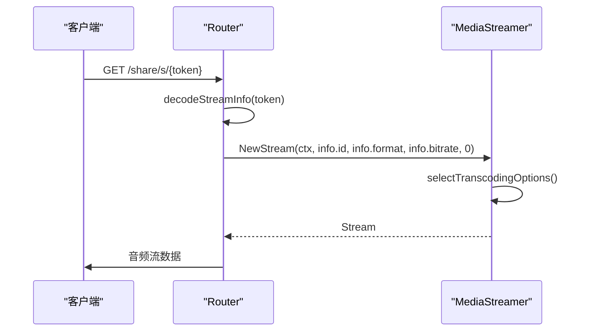
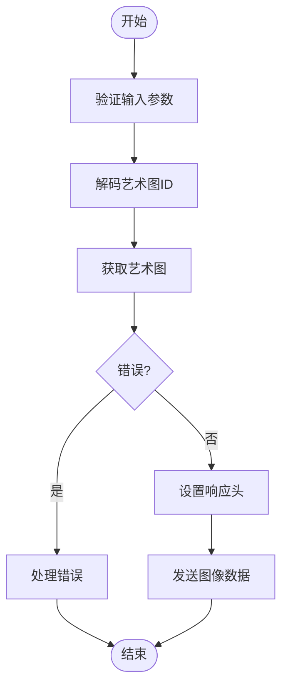
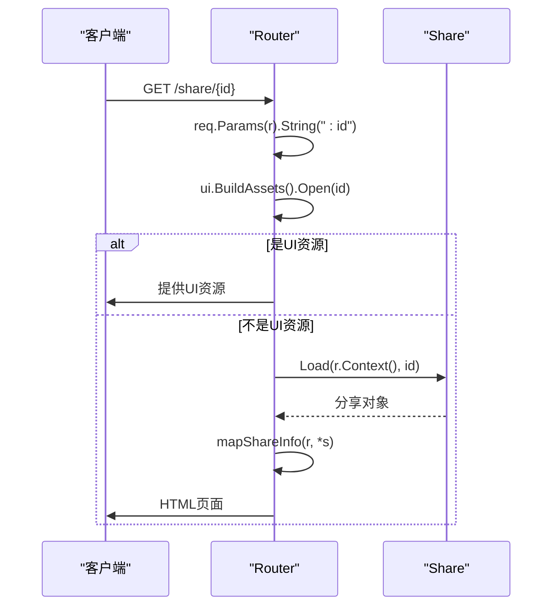
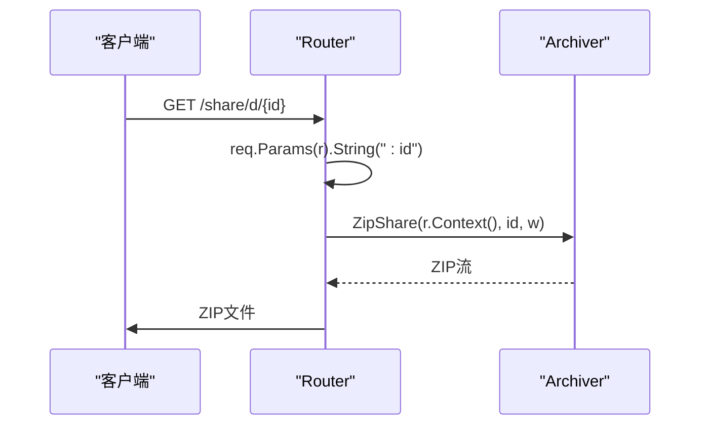
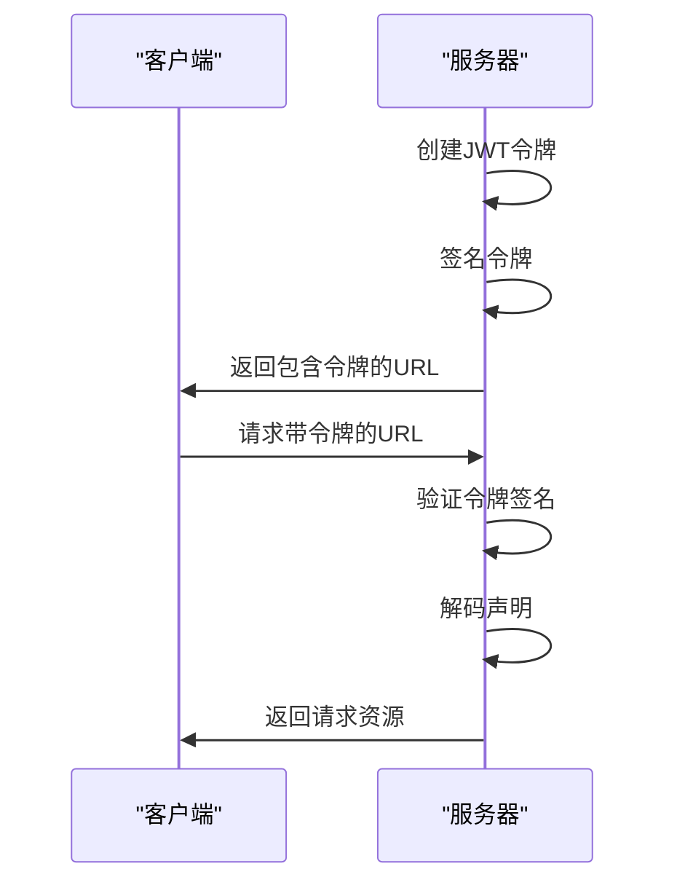

# 公共端点

<cite>
**本文档中引用的文件**  
- [public.go](file://server\public\public.go)
- [handle_streams.go](file://server\public\handle_streams.go)
- [handle_images.go](file://server\public\handle_images.go)
- [handle_shares.go](file://server\public\handle_shares.go)
- [handle_downloads.go](file://server\public\handle_downloads.go)
- [encode_id.go](file://server\public\encode_id.go)
- [consts.go](file://consts\consts.go)
- [configuration.go](file://conf\configuration.go)
- [auth.go](file://core\auth\auth.go)
- [media_streamer.go](file://core\media_streamer.go)
</cite>

## 目录
1. [简介](#简介)
2. [公共端点概述](#公共端点概述)
3. [媒体流服务 (/stream)](#媒体流服务-stream)
4. [艺术图服务 (/art)](#艺术图服务-art)
5. [分享链接 (/s/*)](#分享链接-s)
6. [下载端点 (/download/*)](#下载端点-download)
7. [URL签名和令牌验证机制](#url签名和令牌验证机制)
8. [性能考虑和CDN集成建议](#性能考虑和cdn集成建议)

## 简介

Navidrome提供了一系列无需认证即可访问的公共HTTP端点，允许用户通过分享链接访问音乐媒体、艺术图和播放列表。这些端点通过安全的URL签名和令牌验证机制保护，确保只有拥有有效分享链接的用户才能访问资源。本文档详细记录了这些公共端点的功能、使用方法和实现细节。

**Section sources**
- [public.go](file://server\public\public.go#L1-L86)

## 公共端点概述

Navidrome的公共端点主要通过`/share`路径提供服务，包括媒体流、艺术图、分享链接和下载功能。这些端点在`server/public/public.go`文件中定义，并通过`Router`结构体进行路由管理。公共端点的根路径由`consts.URLPathPublic`常量定义，其默认值为`/share`。

```mermaid
graph TB
subgraph "公共端点"
A[/share/img/{id}] --> |艺术图服务| B[handleImages]
C[/share/s/{id}] --> |媒体流服务| D[handleStream]
E[/share/d/{id}] --> |下载服务| F[handleDownloads]
G[/share/{id}] --> |分享链接| H[handleShares]
I[/share/{id}/m3u] --> |M3U播放列表| J[handleM3U]
end
```

**Diagram sources**
- [public.go](file://server\public\public.go#L39-L65)

**Section sources**
- [public.go](file://server\public\public.go#L39-L65)

## 媒体流服务 (/stream)

媒体流服务端点`/share/s/{id}`用于流式传输音乐文件。该端点通过`handleStream`函数处理请求，支持转码和比特率控制。

### HTTP方法和URL模式
- **HTTP方法**: GET, HEAD
- **URL模式**: `/share/s/{id}`
- **参数**: 
  - `id`: 经过编码的媒体文件ID（JWT令牌）
  - `estimateContentLength`: 布尔值，是否估算内容长度

### 响应格式
- **成功响应**: 音频流数据，Content-Type根据转码格式设置
- **错误响应**:
  - 400 Bad Request: 无效请求
  - 500 Internal Server Error: 服务器错误

### 转码参数说明
媒体流服务支持以下转码参数，这些参数通过JWT令牌的声明传递：
- **format**: 目标音频格式（如mp3, opus, aac）
- **quality**: 比特率（kbps），通过`bitrate`声明传递

当请求的比特率低于原始文件比特率时，系统会自动进行降采样转码。如果请求的格式与原始格式相同且比特率不低于原始比特率，则直接流式传输原始文件。



**Diagram sources**
- [handle_streams.go](file://server\public\handle_streams.go#L16-L72)
- [media_streamer.go](file://core\media_streamer.go#L51-L113)

**Section sources**
- [handle_streams.go](file://server\public\handle_streams.go#L16-L72)
- [media_streamer.go](file://core\media_streamer.go#L51-L113)

## 艺术图服务 (/art)

艺术图服务端点`/share/img/{id}`用于获取专辑、艺术家或媒体文件的艺术图。该服务支持尺寸调整和缓存。

### HTTP方法和URL模式
- **HTTP方法**: GET
- **URL模式**: `/share/img/{id}`
- **参数**:
  - `id`: 经过编码的艺术图ID（JWT令牌）
  - `size`: 整数，期望的图像尺寸（如300）
  - `square`: 布尔值，是否裁剪为正方形

### 响应格式
- **成功响应**: 图像数据，Content-Type根据图像格式设置
- **错误响应**:
  - 400 Bad Request: 无效ID
  - 404 Not Found: 艺术图未找到
  - 500 Internal Server Error: 服务器错误

### 尺寸调整和缓存策略
艺术图服务使用`core/artwork`包处理图像获取和调整。当请求指定`size`参数时，系统会调整图像尺寸以匹配请求。图像缓存策略由`conf.Server.ImageCacheSize`配置项控制，默认情况下缓存大小无限制。



**Diagram sources**
- [handle_images.go](file://server\public\handle_images.go#L16-L68)
- [artwork.go](file://core\artwork\artwork.go)

**Section sources**
- [handle_images.go](file://server\public\handle_images.go#L16-L68)

## 分享链接 (/s/*)

分享链接端点`/share/{id}`用于访问分享的播放列表或内容。该端点通过`handleShares`函数处理请求。

### HTTP方法和URL模式
- **HTTP方法**: GET
- **URL模式**: `/share/{id}`
- **参数**: `id`: 分享ID

### 响应格式
- **成功响应**: HTML页面或UI资源
- **错误响应**:
  - 400 Bad Request: 无效ID
  - 404 Not Found: 分享未找到
  - 410 Gone: 分享已过期

### 功能说明
当访问分享链接时，系统首先检查请求的路径是否对应UI资源。如果是，则直接提供UI资源；否则，将其视为分享ID并加载相应的分享内容。分享信息包括URL、图像URL和轨道信息，这些信息在返回前会被映射和编码。



**Diagram sources**
- [handle_shares.go](file://server\public\handle_shares.go#L17-L40)

**Section sources**
- [handle_shares.go](file://server\public\handle_shares.go#L17-L40)

## 下载端点 (/download/*)

下载端点`/share/d/{id}`用于下载分享的内容。该端点通过`handleDownloads`函数处理请求。

### HTTP方法和URL模式
- **HTTP方法**: GET
- **URL模式**: `/share/d/{id}`
- **参数**: `id`: 分享ID

### 响应格式
- **成功响应**: ZIP压缩文件流
- **错误响应**:
  - 400 Bad Request: 无效ID
  - 403 Forbidden: 分享不可下载
  - 404 Not Found: 分享未找到
  - 500 Internal Server Error: 服务器错误

### 功能说明
下载端点使用`core.Archiver`服务将分享的内容打包为ZIP文件并流式传输给客户端。此功能需要在服务器配置中启用`conf.Server.EnableDownloads`。



**Diagram sources**
- [handle_downloads.go](file://server\public\handle_downloads.go#L9-L18)

**Section sources**
- [handle_downloads.go](file://server\public\handle_downloads.go#L9-L18)

## URL签名和令牌验证机制

Navidrome使用JWT（JSON Web Token）技术实现URL签名和令牌验证，确保公共端点的安全性。

### 令牌创建
公共令牌通过`core/auth`包中的`CreatePublicToken`和`CreateExpiringPublicToken`函数创建。这些函数使用HS256算法和服务器密钥对声明进行签名。

```go
func CreatePublicToken(claims map[string]any) (string, error)
func CreateExpiringPublicToken(exp time.Time, claims map[string]any) (string, error)
```

### 令牌验证
令牌验证通过`auth.TokenAuth.Decode`方法实现，该方法会验证JWT的签名和有效期。对于艺术图ID，使用`decodeArtworkID`函数进行解码和验证。

### URL生成
公共URL通过`publicURL`函数生成，该函数支持自定义分享URL（`conf.Server.ShareURL`）。如果设置了`ShareURL`，所有分享链接将使用该URL作为基础。



**Diagram sources**
- [auth.go](file://core\auth\auth.go#L54-L75)
- [encode_id.go](file://server\public\encode_id.go#L18-L31)
- [public.go](file://server\public\public.go#L68-L85)

**Section sources**
- [auth.go](file://core\auth\auth.go#L54-L75)
- [encode_id.go](file://server\public\encode_id.go#L18-L31)
- [public.go](file://server\public\public.go#L68-L85)

## 性能考虑和CDN集成建议

### 性能优化
1. **缓存策略**: 艺术图服务使用`Cache-Control: public, max-age=315360000`头，允许浏览器和CDN长期缓存图像。
2. **请求限制**: 在开发模式下，可以通过`DevArtworkMaxRequests`配置限制艺术图端点的请求速率。
3. **转码缓存**: 媒体流服务使用文件缓存存储转码后的文件，避免重复转码。

### CDN集成建议
1. **静态资源**: 将艺术图、UI资源等静态内容通过CDN分发，利用CDN的全球节点加速访问。
2. **缓存配置**: 配置CDN缓存艺术图和转码文件，设置适当的缓存过期时间。
3. **自定义域名**: 使用`conf.Server.ShareURL`配置自定义分享域名，便于CDN集成和SSL配置。

### 配置选项
- `conf.Server.EnableSharing`: 启用/禁用分享功能
- `conf.Server.EnableDownloads`: 启用/禁用下载功能
- `conf.Server.ShareURL`: 自定义分享URL
- `conf.Server.ImageCacheSize`: 图像缓存大小
- `conf.Server.TranscodingCacheSize`: 转码缓存大小

**Section sources**
- [configuration.go](file://conf\configuration.go#L44-L78)
- [consts.go](file://consts\consts.go#L42-L43)
- [media_streamer.go](file://core\media_streamer.go#L198-L200)