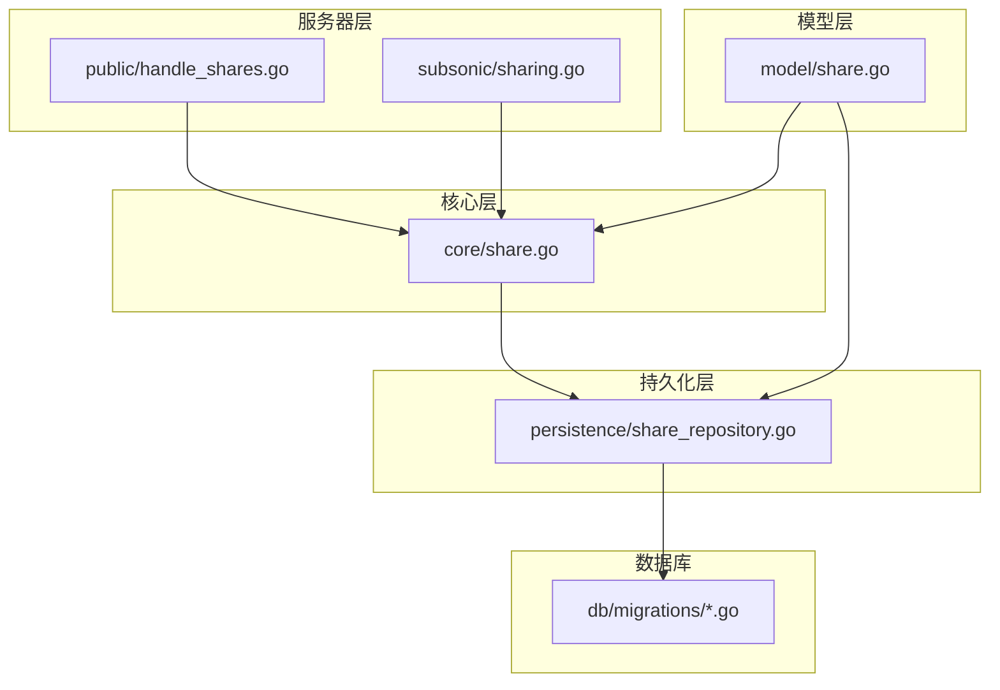
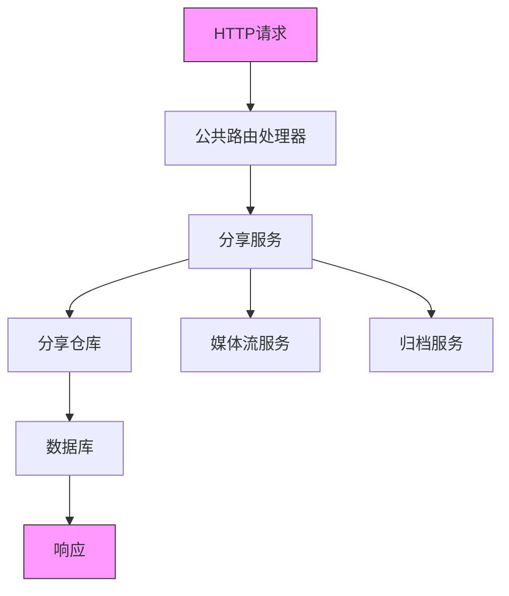
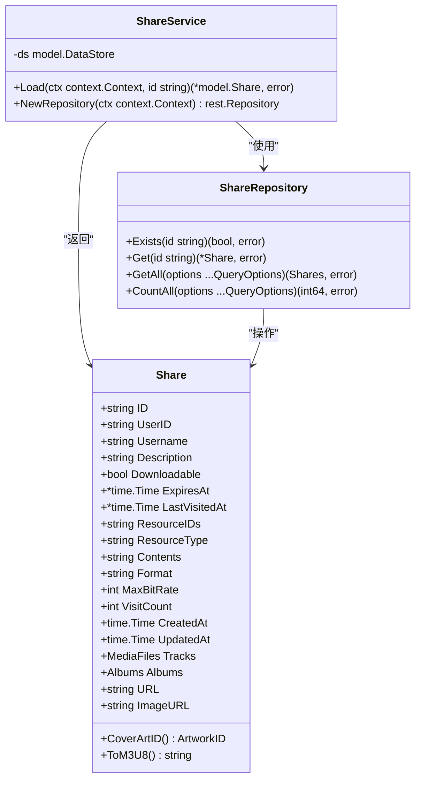
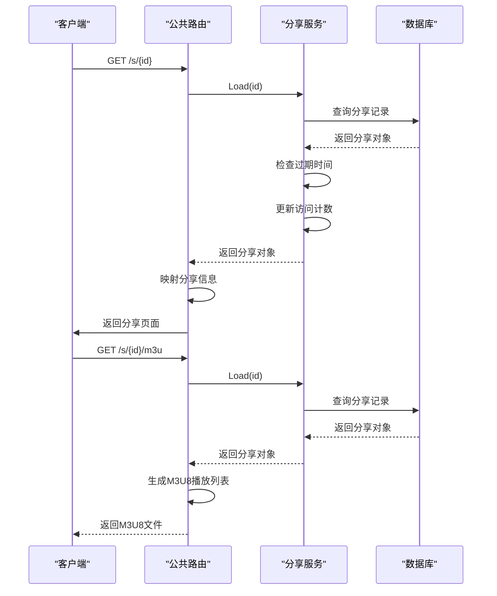
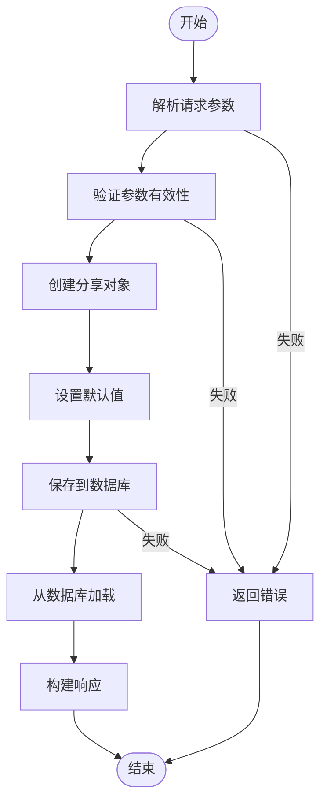
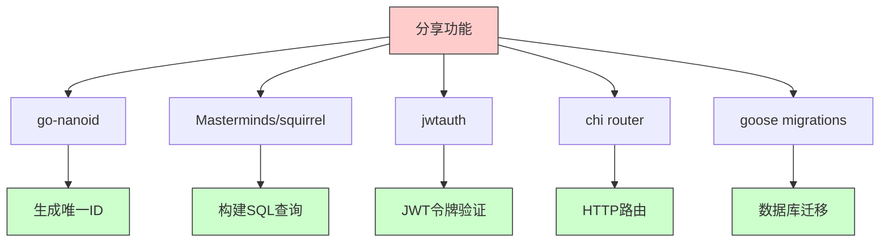

# 分享端点

<cite>
**本文档中引用的文件**  
- [share.go](file://core/share.go)
- [share_repository.go](file://persistence/share_repository.go)
- [handle_shares.go](file://server/public/handle_shares.go)
- [public.go](file://server/public/public.go)
- [sharing.go](file://server/subsonic/sharing.go)
- [share.go](file://model/share.go)
- [encode_id.go](file://server/public/encode_id.go)
- [auth.go](file://core/auth/auth.go)
- [20210530121921_create_shares_table.go](file://db/migrations/20210530121921_create_shares_table.go)
- [20230310222612_add_download_to_share.go](file://db/migrations/20230310222612_add_download_to_share.go)
- [20230119152657_recreate_share_table.go](file://db/migrations/20230119152657_recreate_share_table.go)
- [ShareEdit.jsx](file://ui/src/share/ShareEdit.jsx)
</cite>

## 目录
1. [介绍](#介绍)
2. [项目结构](#项目结构)
3. [核心组件](#核心组件)
4. [架构概述](#架构概述)
5. [详细组件分析](#详细组件分析)
6. [依赖分析](#依赖分析)
7. [性能考虑](#性能考虑)
8. [故障排除指南](#故障排除指南)
9. [结论](#结论)

## 介绍
本文档全面记录了Navidrome音乐服务器中/s/*路径模式的分享端点实现。文档详细解释了分享令牌验证机制、分享链接的创建与访问控制流程、支持的内容类型以及安全考虑。通过分析核心代码文件和数据模型，本文档为开发者和系统管理员提供了深入的技术理解，以便更好地使用和维护Navidrome的分享功能。

## 项目结构
Navidrome的分享功能分布在多个模块中，主要涉及核心服务、持久化层、服务器路由和模型定义。分享端点的实现遵循清晰的分层架构，从HTTP路由到业务逻辑再到数据存储，各组件职责分明。

**Diagram sources**
- [handle_shares.go](file://server/public/handle_shares.go)
- [sharing.go](file://server/subsonic/sharing.go)
- [share.go](file://core/share.go)
- [share_repository.go](file://persistence/share_repository.go)
- [share.go](file://model/share.go)
- [20210530121921_create_shares_table.go](file://db/migrations/20210530121921_create_shares_table.go)

**Section sources**
- [server/public/handle_shares.go](file://server/public/handle_shares.go)
- [server/subsonic/sharing.go](file://server/subsonic/sharing.go)
- [core/share.go](file://core/share.go)
- [persistence/share_repository.go](file://persistence/share_repository.go)
- [model/share.go](file://model/share.go)
- [db/migrations/20210530121921_create_shares_table.go](file://db/migrations/20210530121921_create_shares_table.go)

## 核心组件
分享功能的核心组件包括分享服务、分享仓库、模型定义和数据库迁移。这些组件协同工作，实现了分享链接的创建、验证和访问控制。分享服务负责业务逻辑，分享仓库处理数据持久化，模型定义了分享实体的结构，而数据库迁移则确保了数据表的正确创建和演进。

**Section sources**
- [core/share.go](file://core/share.go)
- [persistence/share_repository.go](file://persistence/share_repository.go)
- [model/share.go](file://model/share.go)
- [db/migrations/20210530121921_create_shares_table.go](file://db/migrations/20210530121921_create_shares_table.go)

## 架构概述
Navidrome的分享功能采用分层架构设计，从HTTP请求处理到数据存储，各层之间通过明确定义的接口进行通信。这种设计提高了代码的可维护性和可测试性，同时也便于功能的扩展和修改。

**Diagram sources**
- [public.go](file://server/public/public.go)
- [share.go](file://core/share.go)
- [share_repository.go](file://persistence/share_repository.go)

## 详细组件分析

### 分享服务分析
分享服务是分享功能的核心业务逻辑实现，负责处理分享链接的加载、创建和更新。服务通过数据存储接口与持久化层交互，确保了业务逻辑与数据访问的分离。

#### 对象导向组件：

**Diagram sources**
- [share.go](file://core/share.go)
- [share.go](file://model/share.go)
- [share_repository.go](file://persistence/share_repository.go)

**Section sources**
- [core/share.go](file://core/share.go)
- [model/share.go](file://model/share.go)
- [persistence/share_repository.go](file://persistence/share_repository.go)

### 分享端点分析
分享端点处理/s/*路径的HTTP请求，提供分享链接的访问和M3U播放列表生成功能。端点通过分享服务验证分享令牌的有效性，并根据分享内容生成相应的响应。

#### API/服务组件：

**Diagram sources**
- [handle_shares.go](file://server/public/handle_shares.go)
- [share.go](file://core/share.go)
- [share_repository.go](file://persistence/share_repository.go)

**Section sources**
- [server/public/handle_shares.go](file://server/public/handle_shares.go)
- [core/share.go](file://core/share.go)
- [persistence/share_repository.go](file://persistence/share_repository.go)

### 分享创建流程分析
分享创建流程通过Subsonic API实现，允许用户创建新的分享链接。流程包括参数解析、分享对象创建、持久化存储和响应生成。

#### 复杂逻辑组件：

**Diagram sources**
- [sharing.go](file://server/subsonic/sharing.go)
- [share.go](file://core/share.go)
- [share_repository.go](file://persistence/share_repository.go)

**Section sources**
- [server/subsonic/sharing.go](file://server/subsonic/sharing.go)
- [core/share.go](file://core/share.go)
- [persistence/share_repository.go](file://persistence/share_repository.go)

## 依赖分析
分享功能的实现依赖于多个核心组件和外部库，这些依赖关系确保了功能的完整性和安全性。

**Diagram sources**
- [go.mod](file://go.mod)
- [share.go](file://core/share.go)
- [public.go](file://server/public/public.go)
- [20210530121921_create_shares_table.go](file://db/migrations/20210530121921_create_shares_table.go)

**Section sources**
- [go.mod](file://go.mod)
- [core/share.go](file://core/share.go)
- [server/public/public.go](file://server/public/public.go)
- [db/migrations/20210530121921_create_shares_table.go](file://db/migrations/20210530121921_create_shares_table.go)

## 性能考虑
分享功能在设计时考虑了性能优化，特别是在数据库查询和令牌验证方面。通过使用索引和缓存，系统能够高效地处理分享链接的验证和访问。

- **数据库索引**：分享表的ID字段为主键，确保了快速查找
- **令牌验证**：使用JWT进行无状态验证，减少了数据库查询
- **并发处理**：使用Go的并发特性处理多个分享请求
- **资源管理**：合理管理数据库连接，避免资源泄漏

## 故障排除指南
当分享功能出现问题时，可以按照以下步骤进行排查：

1. **检查分享链接是否正确**：确保URL格式为/s/{id}
2. **验证分享是否过期**：检查分享的过期时间
3. **检查数据库连接**：确保数据库服务正常运行
4. **查看日志信息**：检查服务器日志中的错误信息
5. **验证权限设置**：确保分享的下载权限设置正确

**Section sources**
- [handle_shares.go](file://server/public/handle_shares.go)
- [share.go](file://core/share.go)
- [share_repository.go](file://persistence/share_repository.go)

## 结论
Navidrome的分享功能通过清晰的分层架构和模块化设计，实现了安全、高效的媒体内容分享。通过JWT令牌验证、数据库持久化和灵活的配置选项，系统能够满足不同场景下的分享需求。未来可以通过增加更多的分享类型和优化性能来进一步增强功能。