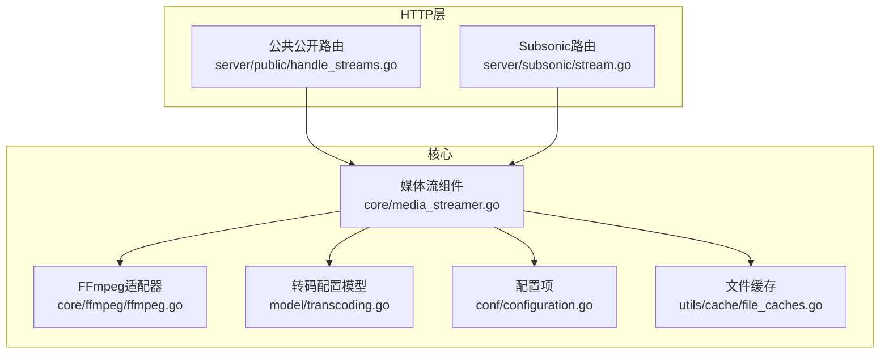
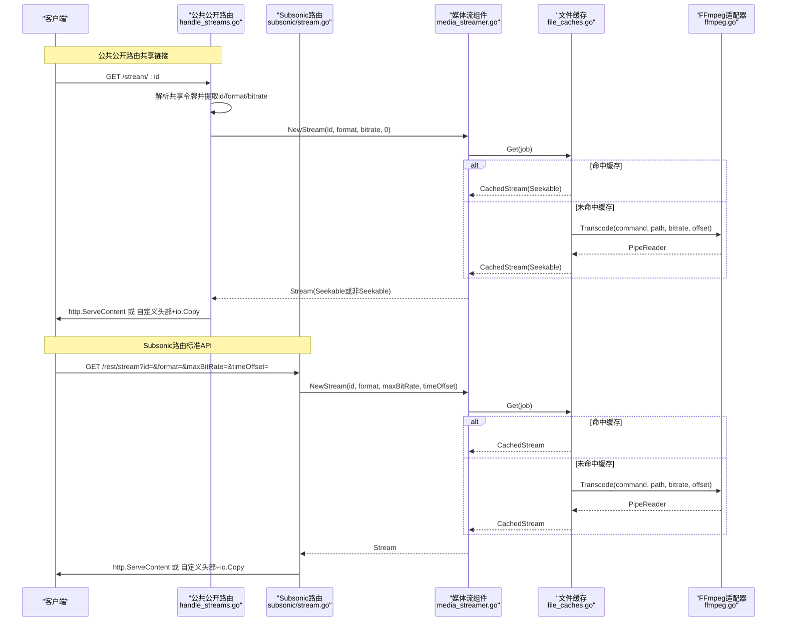
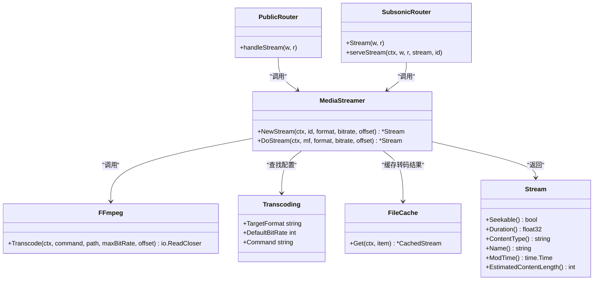

# 媒体流服务

<cite>
**本文引用的文件**
- [server/public/handle_streams.go](file://server/public/handle_streams.go)
- [server/subsonic/stream.go](file://server/subsonic/stream.go)
- [core/media_streamer.go](file://core/media_streamer.go)
- [core/ffmpeg/ffmpeg.go](file://core/ffmpeg/ffmpeg.go)
- [model/transcoding.go](file://model/transcoding.go)
- [conf/configuration.go](file://conf/configuration.go)
- [utils/cache/file_caches.go](file://utils/cache/file_caches.go)
- [core/media_streamer_Internal_test.go](file://core/media_streamer_Internal_test.go)
- [tests/mock_transcoding_repo.go](file://tests/mock_transcoding_repo.go)
</cite>

## 目录
1. [简介](#简介)
2. [项目结构](#项目结构)
3. [核心组件](#核心组件)
4. [架构总览](#架构总览)
5. [详细组件分析](#详细组件分析)
6. [依赖关系分析](#依赖关系分析)
7. [性能考虑](#性能考虑)
8. [故障排查指南](#故障排查指南)
9. [结论](#结论)
10. [附录](#附录)

## 简介
本文件面向Navidrome的媒体流服务，聚焦于/stream端点的实现机制，覆盖HTTP GET请求处理、媒体文件定位、转码流程与流式传输。文档严格依据代码实现，说明format、quality（maxBitRate）、t（timeOffset）等查询参数的作用与取值，以及它们如何影响FFmpeg转码命令生成；同时阐述媒体流服务与核心媒体流组件（media_streamer.go）及FFmpeg适配器的集成方式，并给出音频格式转换矩阵、错误处理策略、性能优化建议与CDN缓存配置要点。

## 项目结构
与媒体流服务直接相关的模块分布如下：
- 公共公开路由：server/public/handle_streams.go 提供共享链接/stream端点
- Subsonic API路由：server/subsonic/stream.go 提供标准/stream端点
- 核心媒体流：core/media_streamer.go 负责选择转码策略、构建Stream、调用FFmpeg
- FFmpeg适配器：core/ffmpeg/ffmpeg.go 封装FFmpeg命令执行、管道读取
- 转码配置模型：model/transcoding.go 定义目标格式与命令模板
- 配置项：conf/configuration.go 包含转码缓存大小、默认降采样格式、是否启用取消等
- 文件缓存：utils/cache/file_caches.go 提供转码结果的文件级缓存
- 测试与示例：core/media_streamer_Internal_test.go、tests/mock_transcoding_repo.go 展示行为与默认值

图表来源
- [server/public/handle_streams.go](file://server/public/handle_streams.go#L1-L106)
- [server/subsonic/stream.go](file://server/subsonic/stream.go#L1-L81)
- [core/media_streamer.go](file://core/media_streamer.go#L1-L228)
- [core/ffmpeg/ffmpeg.go](file://core/ffmpeg/ffmpeg.go#L1-L229)
- [model/transcoding.go](file://model/transcoding.go#L1-L19)
- [conf/configuration.go](file://conf/configuration.go#L1-L200)
- [utils/cache/file_caches.go](file://utils/cache/file_caches.go#L1-L200)

章节来源
- [server/public/handle_streams.go](file://server/public/handle_streams.go#L1-L106)
- [server/subsonic/stream.go](file://server/subsonic/stream.go#L1-L81)
- [core/media_streamer.go](file://core/media_streamer.go#L1-L228)
- [core/ffmpeg/ffmpeg.go](file://core/ffmpeg/ffmpeg.go#L1-L229)
- [model/transcoding.go](file://model/transcoding.go#L1-L19)
- [conf/configuration.go](file://conf/configuration.go#L1-L200)
- [utils/cache/file_caches.go](file://utils/cache/file_caches.go#L1-L200)

## 核心组件
- 公共公开路由（共享链接）：解析共享令牌中的id、format、bitrate，调用MediaStreamer.NewStream并进行流式输出。
- Subsonic路由（标准API）：解析id、format、maxBitRate、timeOffset，调用MediaStreamer.NewStream并进行流式输出。
- 媒体流组件：根据请求参数与默认策略选择“原始直传”或“转码”，通过文件缓存与FFmpeg执行器完成转码与输出。
- FFmpeg适配器：负责命令拼接、进程启动、管道读写与错误传播。
- 转码配置模型：定义目标格式、命令模板与默认比特率。
- 配置项：控制转码缓存大小、默认降采样格式、是否允许转码取消等。
- 文件缓存：对转码结果进行文件级缓存，命中时提供可寻址流以支持Range/Content-Length。

章节来源
- [server/public/handle_streams.go](file://server/public/handle_streams.go#L1-L106)
- [server/subsonic/stream.go](file://server/subsonic/stream.go#L1-L81)
- [core/media_streamer.go](file://core/media_streamer.go#L1-L228)
- [core/ffmpeg/ffmpeg.go](file://core/ffmpeg/ffmpeg.go#L1-L229)
- [model/transcoding.go](file://model/transcoding.go#L1-L19)
- [conf/configuration.go](file://conf/configuration.go#L1-L200)
- [utils/cache/file_caches.go](file://utils/cache/file_caches.go#L1-L200)

## 架构总览
下面的序列图展示了从HTTP请求到最终流式输出的关键调用链路，分别对应公共公开路由与Subsonic路由两种入口。

图表来源
- [server/public/handle_streams.go](file://server/public/handle_streams.go#L16-L72)
- [server/subsonic/stream.go](file://server/subsonic/stream.go#L20-L81)
- [core/media_streamer.go](file://core/media_streamer.go#L51-L113)
- [utils/cache/file_caches.go](file://utils/cache/file_caches.go#L147-L200)
- [core/ffmpeg/ffmpeg.go](file://core/ffmpeg/ffmpeg.go#L38-L48)

## 详细组件分析

### /stream端点参数与行为
- 公共公开路由（共享链接）：
  - 参数来源：共享令牌解码后包含id、format、bitrate三项
  - 处理逻辑：调用MediaStreamer.NewStream(id, format, bitrate, 0)，随后根据Stream是否可寻址决定使用http.ServeContent或自定义头部+io.Copy
  - 可选参数：estimateContentLength（布尔），用于在非可寻址流场景下返回估算的Content-Length
- Subsonic路由（标准API）：
  - 参数来源：query参数id、format、maxBitRate、timeOffset
  - 处理逻辑：调用MediaStreamer.NewStream(id, format, maxBitRate, timeOffset)，随后根据Stream是否可寻址决定使用http.ServeContent或自定义头部+io.Copy
  - 可选参数：estimateContentLength（布尔），用于在非可寻址流场景下返回估算的Content-Length

章节来源
- [server/public/handle_streams.go](file://server/public/handle_streams.go#L16-L72)
- [server/subsonic/stream.go](file://server/subsonic/stream.go#L20-L81)

### 媒体文件定位与转码策略
- 媒体文件定位：通过DataStore获取MediaFile，使用绝对路径作为输入
- 转码策略选择：由selectTranscodingOptions决定是否“原始直传”或“转码”
  - 若format为"raw"，直接原始直传
  - 若format与原格式相同且未指定比特率，按原比特率直传
  - 若存在默认转码配置（来自请求上下文），优先采用默认目标格式与默认比特率；若播放器有最大比特率限制，则取较小值
  - 若仅指定了比特率且低于原比特率，且配置了默认降采样格式，则使用该格式与指定比特率
  - 若未指定format且无默认转码配置，或找不到对应转码配置，则回退到原始直传
  - 若最终目标格式与原格式相同且比特率不小于原比特率，则回退到原始直传
- 转码命令生成：由文件缓存回调加载对应Transcoding配置，拼接命令模板，最终交由FFmpeg执行

章节来源
- [core/media_streamer.go](file://core/media_streamer.go#L60-L113)
- [core/media_streamer.go](file://core/media_streamer.go#L133-L183)
- [model/transcoding.go](file://model/transcoding.go#L1-L19)
- [core/media_streamer_Internal_test.go](file://core/media_streamer_Internal_test.go#L1-L162)
- [tests/mock_transcoding_repo.go](file://tests/mock_transcoding_repo.go#L1-L24)

### FFmpeg转码流程与命令生成
- 命令生成规则：
  - 将命令模板中的占位符替换为实际路径、偏移量、比特率等
  - 当offset>0且命令模板未包含"%t"时，追加"-ss offset"参数
  - 占位符示例：路径替换、时间偏移替换、比特率替换
- 进程管理：
  - 使用Pipe连接FFmpeg子进程的标准输出
  - 根据日志级别决定stderr重定向策略
  - 子进程退出时关闭管道并传播错误
- 取消策略：
  - 可通过配置决定是否允许转码过程随请求取消而终止
  - 若不允许取消，会将请求上下文的必要值复制到后台上下文，保持元数据但不响应取消

章节来源
- [core/ffmpeg/ffmpeg.go](file://core/ffmpeg/ffmpeg.go#L38-L48)
- [core/ffmpeg/ffmpeg.go](file://core/ffmpeg/ffmpeg.go#L160-L176)
- [core/ffmpeg/ffmpeg.go](file://core/ffmpeg/ffmpeg.go#L111-L158)
- [core/ffmpeg/ffmpeg.go](file://core/ffmpeg/ffmpeg.go#L203-L221)
- [core/media_streamer.go](file://core/media_streamer.go#L197-L227)

### 流式传输与HTTP响应
- 可寻址流（Seekable）：使用http.ServeContent自动处理Range/Content-Length/ETag等
- 非可寻址流（非Seekable）：
  - 设置Accept-Ranges: none
  - 设置Content-Type为Stream.ContentType()
  - 可选设置Content-Length为估算长度（当客户端请求estimateContentLength=true时）
  - HEAD请求：预热流（丢弃输出）以快速探测内容
  - GET请求：通过io.Copy将流写入响应

章节来源
- [server/public/handle_streams.go](file://server/public/handle_streams.go#L43-L71)
- [server/subsonic/stream.go](file://server/subsonic/stream.go#L20-L49)
- [core/media_streamer.go](file://core/media_streamer.go#L115-L132)

### 查询参数详解
- format（公共公开路由：令牌字段f；Subsonic路由：query参数format）
  - 取值："raw"或任意已配置的目标格式（如mp3、oga、opus等）
  - 影响：决定是否转码以及目标格式
- maxBitRate（Subsonic路由：query参数maxBitRate）
  - 取值：正整数（kbit/s）
  - 影响：若存在对应转码配置，按此比特率转码；若未指定format且低于原比特率，且配置了默认降采样格式，则使用该格式与该比特率
- timeOffset（Subsonic路由：query参数timeOffset）
  - 取值：秒（整数）
  - 影响：在命令模板未包含"%t"时，追加"-ss offset"参数以实现起始时间跳转
- estimateContentLength（公共公开路由：query参数；Subsonic路由：query参数）
  - 取值：布尔
  - 影响：在非可寻址流场景下返回估算的Content-Length，便于客户端进度显示

章节来源
- [server/public/handle_streams.go](file://server/public/handle_streams.go#L16-L72)
- [server/subsonic/stream.go](file://server/subsonic/stream.go#L52-L81)
- [core/ffmpeg/ffmpeg.go](file://core/ffmpeg/ffmpeg.go#L160-L176)
- [core/media_streamer.go](file://core/media_streamer.go#L133-L183)

### 音频格式转换矩阵（基于配置与默认行为）
以下矩阵展示常见源格式到目标格式的映射关系与默认比特率（示例来源于测试与默认配置）。注意：具体映射取决于数据库中Transcoding配置与默认降采样格式设置。

- 源格式（Suffix）→ 目标格式（TargetFormat）→ 默认比特率（kbit/s）
  - FLAC → opus（若启用默认降采样）→ 128
  - MP3 → mp3（若存在对应Transcoding配置）→ 160
  - OGG → oga（若存在对应Transcoding配置）→ 128
  - WAV/AIFF/WV等 → 通常按原始直传或按请求参数转码
- 特殊规则
  - format="raw"：强制原始直传
  - 目标格式与原格式相同且比特率不小于原比特率：回退到原始直传
  - 仅指定比特率且低于原比特率：若配置默认降采样格式则使用该格式与指定比特率

章节来源
- [core/media_streamer_Internal_test.go](file://core/media_streamer_Internal_test.go#L1-L162)
- [tests/mock_transcoding_repo.go](file://tests/mock_transcoding_repo.go#L1-L24)
- [core/media_streamer.go](file://core/media_streamer.go#L133-L183)

### 错误处理机制
- 文件不存在/不可访问：FFmpeg适配器在启动前检查文件存在性，失败时返回错误
- 转码命令加载失败：媒体流组件在缓存回调中加载Transcoding配置失败时记录错误并返回无效
- 转码进程异常：FFmpeg适配器在等待子进程时捕获非零退出码并关闭管道并传播错误
- HTTP状态码
  - 公共公开路由：令牌解析失败返回400；启动流失败返回500
  - Subsonic路由：NewStream返回错误时由上层处理（此处直接透传）

章节来源
- [core/ffmpeg/ffmpeg.go](file://core/ffmpeg/ffmpeg.go#L62-L71)
- [core/media_streamer.go](file://core/media_streamer.go#L197-L227)
- [server/public/handle_streams.go](file://server/public/handle_streams.go#L23-L31)
- [server/subsonic/stream.go](file://server/subsonic/stream.go#L52-L81)

## 依赖关系分析
媒体流服务各组件之间的依赖关系如下：

图表来源
- [server/public/handle_streams.go](file://server/public/handle_streams.go#L16-L72)
- [server/subsonic/stream.go](file://server/subsonic/stream.go#L20-L81)
- [core/media_streamer.go](file://core/media_streamer.go#L21-L113)
- [core/ffmpeg/ffmpeg.go](file://core/ffmpeg/ffmpeg.go#L18-L25)
- [model/transcoding.go](file://model/transcoding.go#L1-L19)
- [utils/cache/file_caches.go](file://utils/cache/file_caches.go#L147-L200)

## 性能考虑
- 缓冲策略
  - 转码结果通过文件缓存（FileCache）持久化，命中时提供可寻址流，支持Range/Content-Length，减少重复转码开销
  - 缓存初始化异步进行，未就绪时直接回退到实时读取
- 并发流限制
  - 未见显式的全局并发流限制；可通过外部反向代理或负载均衡器进行限流
- CDN缓存配置
  - 对于可寻址流（原始直传或缓存命中），可利用CDN缓存静态内容
  - 对于非可寻址流（实时转码），CDN缓存需谨慎配置，建议禁用或设置极短TTL
- 转码取消
  - 可通过配置决定是否允许转码随请求断开而取消，避免长时间占用资源
- 日志与追踪
  - 关键路径记录调试/追踪日志，便于定位性能瓶颈与错误

章节来源
- [utils/cache/file_caches.go](file://utils/cache/file_caches.go#L1-L200)
- [core/media_streamer.go](file://core/media_streamer.go#L197-L227)
- [conf/configuration.go](file://conf/configuration.go#L1-L200)

## 故障排查指南
- 无法启动转码
  - 检查FFmpeg可执行文件路径与可用性
  - 检查Transcoding配置是否存在且命令模板正确
- 转码失败
  - 查看FFmpeg子进程退出码与stderr输出
  - 确认源文件路径有效且非目录
- 响应异常
  - 非可寻址流未返回Content-Length：确认客户端是否请求estimateContentLength
  - Range/Content-Length无效：确认Stream是否可寻址（原始直传或缓存命中）
- 共享链接400/500
  - 令牌解析失败或启动流失败，检查共享令牌有效性与服务器日志

章节来源
- [core/ffmpeg/ffmpeg.go](file://core/ffmpeg/ffmpeg.go#L38-L48)
- [core/ffmpeg/ffmpeg.go](file://core/ffmpeg/ffmpeg.go#L146-L158)
- [server/public/handle_streams.go](file://server/public/handle_streams.go#L23-L31)
- [server/subsonic/stream.go](file://server/subsonic/stream.go#L20-L49)

## 结论
Navidrome的媒体流服务通过清晰的职责分离实现了高效稳定的音频流传输：HTTP层负责参数解析与响应头设置，媒体流组件负责转码策略与缓存，FFmpeg适配器负责底层命令执行。format、maxBitRate、timeOffset等参数直接影响转码决策与命令生成；文件缓存显著降低重复转码成本。结合合理的CDN与限流策略，可在保证兼容性的前提下获得良好的用户体验。

## 附录

### /stream端点参数对照表
- 公共公开路由（共享链接）
  - id：媒体文件ID（从共享令牌中解析）
  - format：目标格式（令牌字段f）
  - bitrate：目标比特率（令牌字段b）
  - estimateContentLength：估算内容长度（query参数）
- Subsonic路由（标准API）
  - id：媒体文件ID
  - format：目标格式
  - maxBitRate：目标比特率
  - timeOffset：起始时间（秒）
  - estimateContentLength：估算内容长度（query参数）

章节来源
- [server/public/handle_streams.go](file://server/public/handle_streams.go#L16-L72)
- [server/subsonic/stream.go](file://server/subsonic/stream.go#L52-L81)