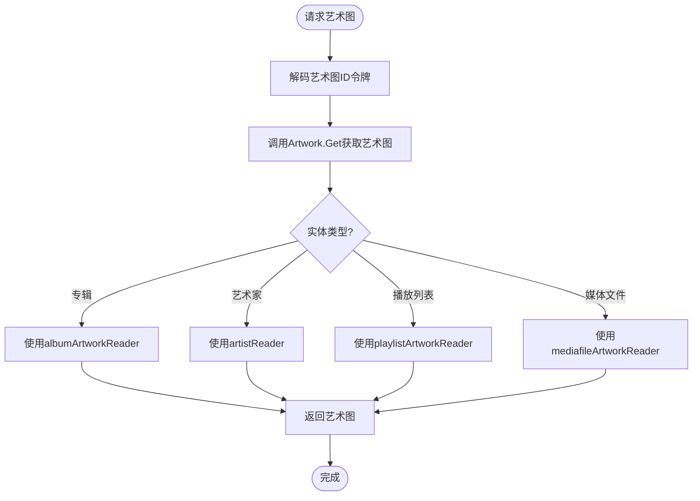
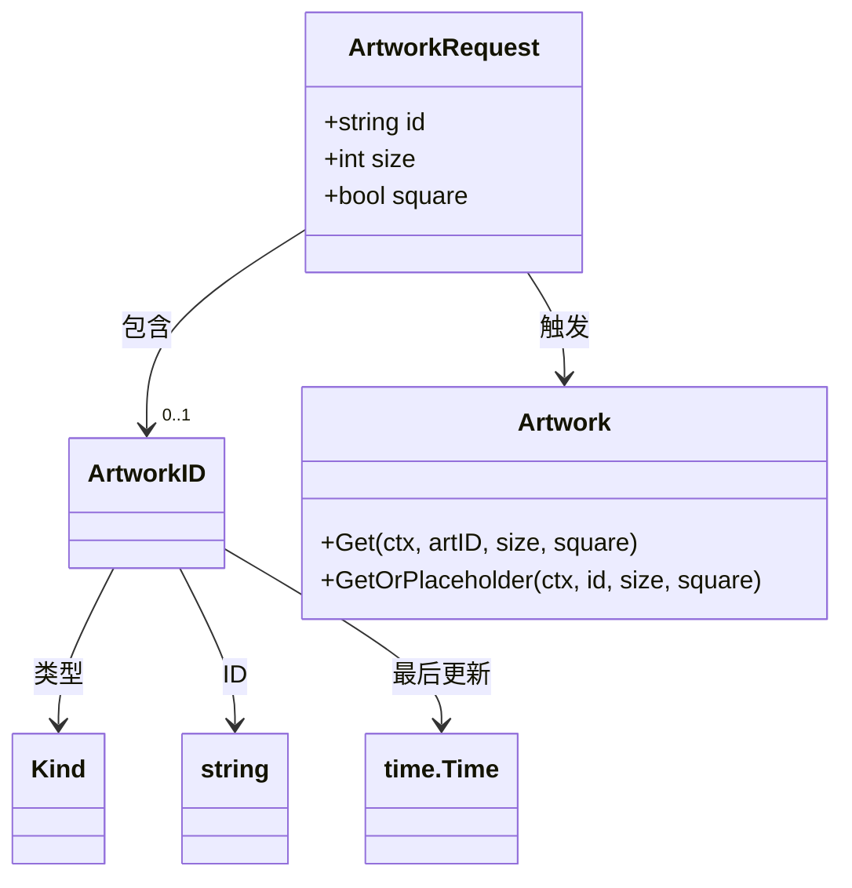
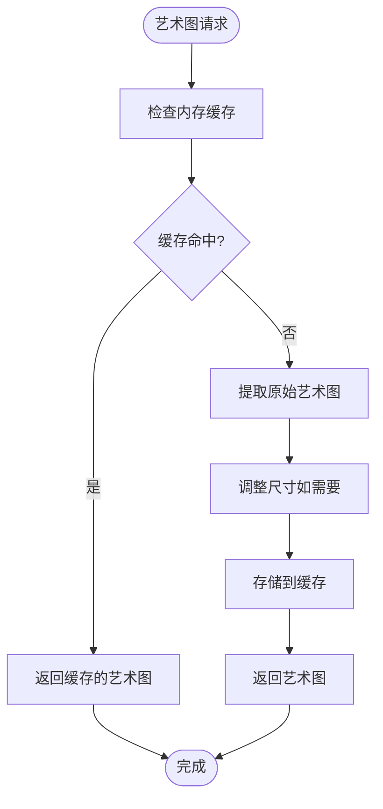
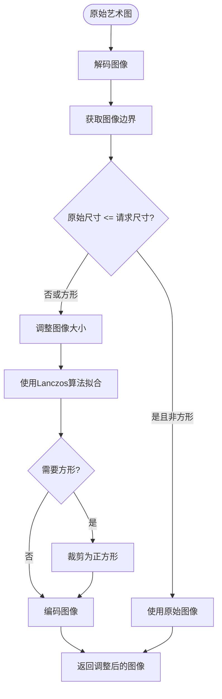
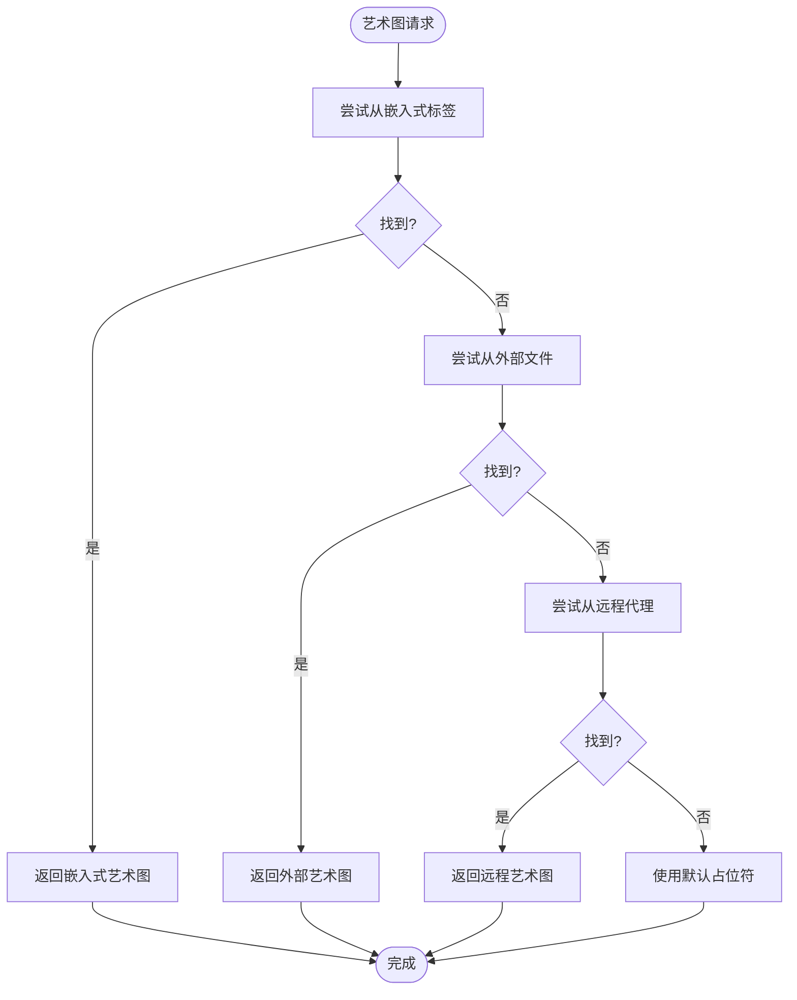
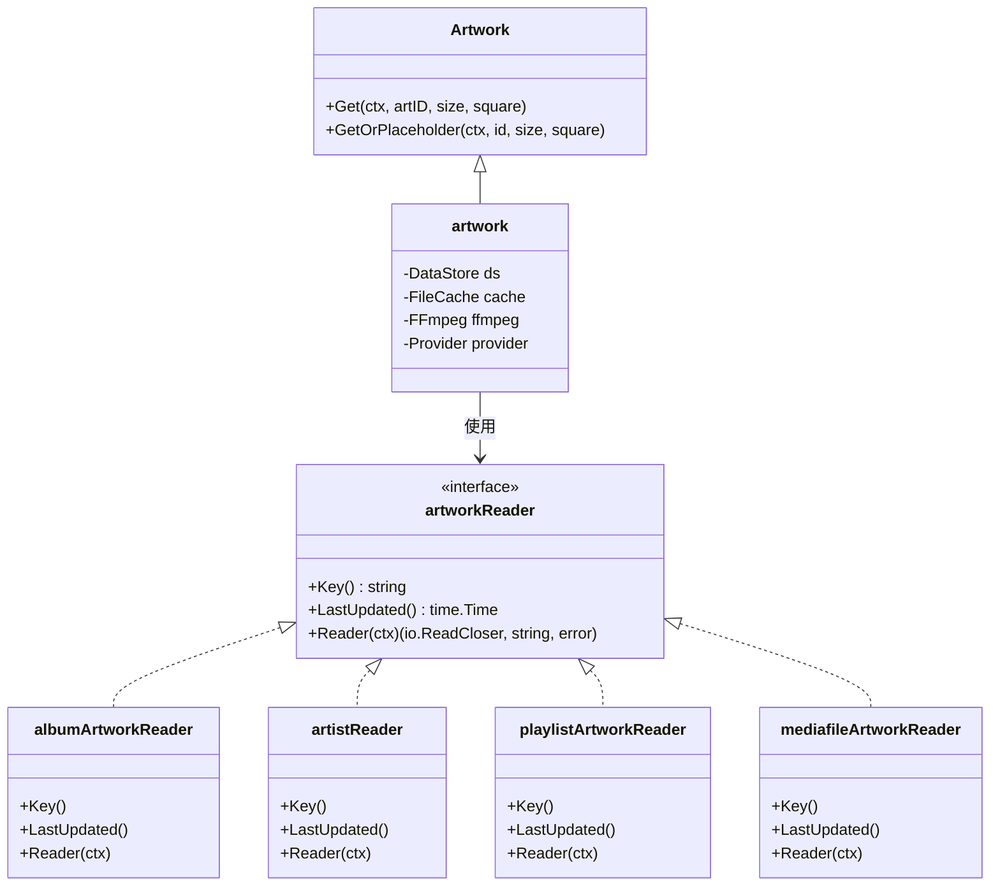
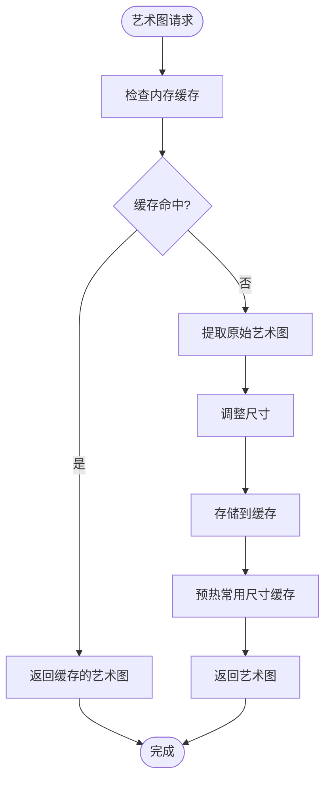

# 艺术图服务

<cite>
**本文档中引用的文件**  
- [artwork.go](file://core/artwork/artwork.go)
- [handle_images.go](file://server/public/handle_images.go)
- [image_cache.go](file://core/artwork/image_cache.go)
- [cache_warmer.go](file://core/artwork/cache_warmer.go)
- [reader_resized.go](file://core/artwork/reader_resized.go)
- [reader_album.go](file://core/artwork/reader_album.go)
- [reader_artist.go](file://core/artwork/reader_artist.go)
- [reader_playlist.go](file://core/artwork/reader_playlist.go)
- [reader_mediafile.go](file://core/artwork/reader_mediafile.go)
- [sources.go](file://core/artwork/sources.go)
- [artwork_id.go](file://model/artwork_id.go)
- [consts.go](file://consts/consts.go)
</cite>

## 目录
1. [介绍](#介绍)
2. [艺术图端点工作原理](#艺术图端点工作原理)
3. [查询参数详解](#查询参数详解)
4. [艺术图缓存机制](#艺术图缓存机制)
5. [艺术图尺寸调整功能](#艺术图尺寸调整功能)
6. [回退机制](#回退机制)
7. [与核心组件集成](#与核心组件集成)
8. [性能优化建议](#性能优化建议)

## 介绍

Navidrome的艺术图服务为专辑、艺术家、播放列表等音乐实体提供封面艺术图。该服务通过`/share/img/{id}`端点提供访问，支持动态尺寸调整、多源艺术图提取和智能缓存策略。艺术图服务设计为高效、可扩展，能够从嵌入式标签、外部文件和远程代理等多种来源获取艺术图。

**Section sources**
- [artwork.go](file://core/artwork/artwork.go#L1-L131)
- [handle_images.go](file://server/public/handle_images.go#L1-L68)

## 艺术图端点工作原理

艺术图服务通过`/share/img/{id}`端点提供艺术图访问。当客户端请求艺术图时，服务首先解码经过身份验证的令牌以获取艺术图ID，然后根据实体类型（专辑、艺术家、播放列表或媒体文件）获取相应的艺术图。

服务使用`Artwork`接口的`Get`方法来检索艺术图，该方法接受艺术图ID、所需尺寸和方形裁剪标志作为参数。对于不同类型的实体，服务使用不同的读取器实现：
- **专辑艺术图**：从专辑文件夹中的外部文件或嵌入式标签中提取
- **艺术家艺术图**：从艺术家文件夹、专辑文件夹或外部代理（如Spotify）中获取
- **播放列表艺术图**：动态生成由播放列表中曲目专辑封面组成的拼贴图
- **媒体文件艺术图**：从媒体文件的嵌入式标签中提取



**Diagram sources**
- [artwork.go](file://core/artwork/artwork.go#L60-L74)
- [handle_images.go](file://server/public/handle_images.go#L42-L58)

**Section sources**
- [artwork.go](file://core/artwork/artwork.go#L60-L131)
- [handle_images.go](file://server/public/handle_images.go#L33-L58)

## 查询参数详解

艺术图端点支持多个查询参数来控制返回的艺术图：

### id 参数
`id`参数是经过身份验证的令牌，包含艺术图的标识信息。该令牌由`encodeArtworkID`函数生成，包含艺术图的类型、ID和最后更新时间。服务使用`decodeArtworkID`函数验证并解码此令牌。

### size 参数
`size`参数指定返回艺术图的尺寸（以像素为单位）。默认值为0，表示返回原始尺寸的艺术图。当指定非零值时，服务会动态调整艺术图大小以匹配请求的尺寸。

### square 参数
`square`参数是一个布尔值，指示是否应将艺术图裁剪为正方形。默认值为`false`。当设置为`true`时，服务会将艺术图调整为正方形，通常用于UI显示。



**Diagram sources**
- [artwork_id.go](file://model/artwork_id.go#L34-L124)
- [artwork.go](file://core/artwork/artwork.go#L22-L25)

**Section sources**
- [artwork.go](file://core/artwork/artwork.go#L39-L40)
- [handle_images.go](file://server/public/handle_images.go#L39-L40)
- [artwork_id.go](file://model/artwork_id.go#L34-L124)

## 艺术图缓存机制

艺术图服务实现了多层缓存策略，以提高性能和减少重复处理。

### 内存缓存策略
服务使用`imageCache`结构实现内存缓存，基于`utils/cache`包。缓存使用LRU（最近最少使用）算法管理，缓存项由`cacheKey`结构标识，该结构包含艺术图ID和最后更新时间。

缓存键的生成考虑了配置变化，确保当相关配置（如外部服务代理）更改时，缓存会自动失效：
```go
func (k *cacheKey) Key() string {
    return fmt.Sprintf(
        "%s-%s.%d",
        k.artID.Kind,
        k.artID.ID,
        k.lastUpdate.UnixMilli(),
    )
}
```

### 缓存失效规则
缓存失效基于以下规则：
1. **时间基础**：当艺术图的最后更新时间改变时，缓存键会变化，导致缓存失效
2. **配置基础**：当影响艺术图提取的配置（如`CoverArtPriority`）更改时，缓存键包含配置哈希，确保缓存失效
3. **显式清除**：当相关实体（专辑、艺术家等）更新时，系统会自动清除相关缓存



**Diagram sources**
- [image_cache.go](file://core/artwork/image_cache.go#L16-L28)
- [artwork.go](file://core/artwork/artwork.go#L66-L73)

**Section sources**
- [image_cache.go](file://core/artwork/image_cache.go#L1-L45)
- [artwork.go](file://core/artwork/artwork.go#L60-L74)

## 艺术图尺寸调整功能

艺术图服务能够根据请求的`size`参数动态生成不同分辨率的图像。

### 尺寸调整流程
当请求指定非零尺寸时，服务使用`resizedArtworkReader`来处理请求：
1. 首先获取原始尺寸的艺术图（可能来自缓存）
2. 使用`imaging`库调整图像大小
3. 根据原始格式和请求参数选择适当的编码格式（PNG或JPEG）
4. 将调整后的图像返回给客户端

### 动态分辨率生成
服务支持智能尺寸调整：
- 当请求的尺寸小于或等于原始尺寸且不需要方形裁剪时，返回`nil`表示使用原始图像
- 当需要方形裁剪时，即使原始图像较小也会进行处理
- 调整后的图像会根据`CoverJpegQuality`配置参数进行JPEG压缩



**Diagram sources**
- [reader_resized.go](file://core/artwork/reader_resized.go#L81-L116)
- [artwork.go](file://core/artwork/artwork.go#L113-L115)

**Section sources**
- [reader_resized.go](file://core/artwork/reader_resized.go#L56-L78)
- [artwork.go](file://core/artwork/artwork.go#L113-L115)

## 回退机制

当原始艺术图不可用时，服务实现了多层次的回退机制。

### 默认占位符
服务为不同类型的实体提供默认占位符图像：
- **专辑**：使用`album-placeholder.webp`
- **艺术家**：使用`artist-placeholder.webp`

这些占位符图像存储在`resources`包中，通过`consts`常量引用。

### 多源提取回退
服务按照预定义的优先级顺序尝试从多个来源提取艺术图：
1. **嵌入式标签**：从音频文件的ID3标签中提取
2. **外部文件**：从专辑或艺术家文件夹中的图像文件提取
3. **外部代理**：通过配置的代理（如Spotify、Last.fm）从远程服务获取



**Diagram sources**
- [sources.go](file://core/artwork/sources.go#L27-L42)
- [artwork.go](file://core/artwork/artwork.go#L44-L57)

**Section sources**
- [sources.go](file://core/artwork/sources.go#L27-L42)
- [artwork.go](file://core/artwork/artwork.go#L44-L57)
- [consts.go](file://consts/consts.go#L67-L69)

## 与核心组件集成

艺术图服务与Navidrome的核心组件紧密集成，特别是`artwork.go`文件中的核心逻辑。

### 多源艺术图提取
`artwork`结构实现了`Artwork`接口，协调从不同来源提取艺术图：
- **数据存储**：通过`DataStore`访问专辑、艺术家、播放列表等实体
- **FFmpeg**：使用`FFmpeg`组件从音频文件中提取嵌入式图像
- **外部代理**：通过`external.Provider`从远程服务获取艺术图

### 读取器模式
服务使用读取器模式为不同类型的实体实现特定的艺术图提取逻辑：
- `albumArtworkReader`：处理专辑艺术图
- `artistReader`：处理艺术家艺术图
- `playlistArtworkReader`：处理播放列表艺术图
- `mediafileArtworkReader`：处理媒体文件艺术图



**Diagram sources**
- [artwork.go](file://core/artwork/artwork.go#L22-L37)
- [reader_album.go](file://core/artwork/reader_album.go#L23-L31)
- [reader_artist.go](file://core/artwork/reader_artist.go#L30-L37)

**Section sources**
- [artwork.go](file://core/artwork/artwork.go#L22-L37)
- [reader_album.go](file://core/artwork/reader_album.go#L23-L31)
- [reader_artist.go](file://core/artwork/reader_artist.go#L30-L37)

## 性能优化建议

### CDN缓存配置
建议在反向代理或CDN层配置适当的缓存头，以最大化缓存效率：

```nginx
location /share/img/ {
    # 设置长期缓存（10年）
    add_header Cache-Control "public, max-age=315360000";
    # 启用ETag和Last-Modified验证
    etag on;
    add_header Last-Modified $date_gmt;
}
```

### 缓存预热策略
服务内置了缓存预热机制，通过`CacheWarmer`接口实现：
- **自动预热**：当艺术图被访问时，系统会预热常用尺寸（由`UICoverArtSize`常量定义）的缓存
- **后台处理**：预热操作在后台异步执行，不影响主请求性能
- **批量处理**：多个预热请求会被批量处理，提高效率

### 内存使用优化
- **调整缓存大小**：通过`ImageCacheDir`和`DefaultImageCacheMaxItems`配置缓存大小
- **监控缓存命中率**：定期检查缓存命中率，优化缓存策略
- **避免过度缓存**：对于不常访问的艺术图，考虑禁用缓存或设置较短的TTL



**Diagram sources**
- [cache_warmer.go](file://core/artwork/cache_warmer.go#L21-L25)
- [artwork.go](file://core/artwork/artwork.go#L66-L73)

**Section sources**
- [cache_warmer.go](file://core/artwork/cache_warmer.go#L21-L164)
- [consts.go](file://consts/consts.go#L70)