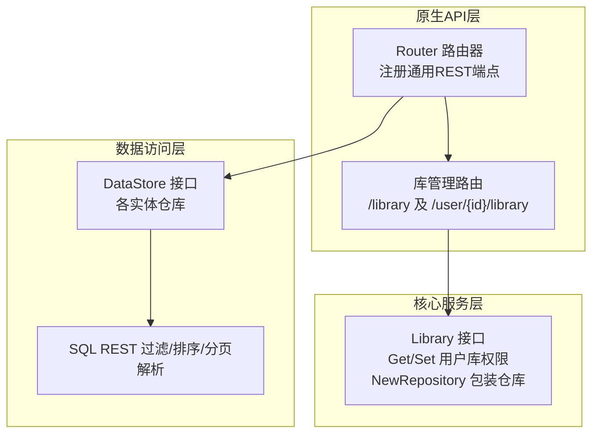
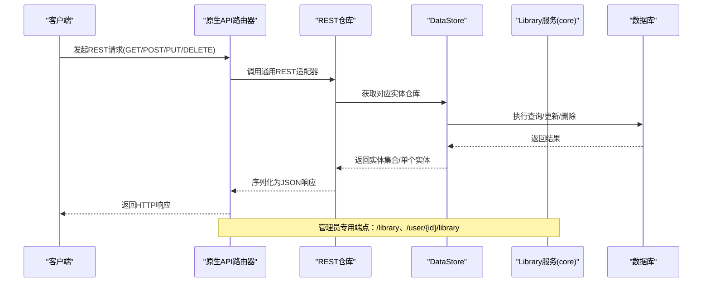
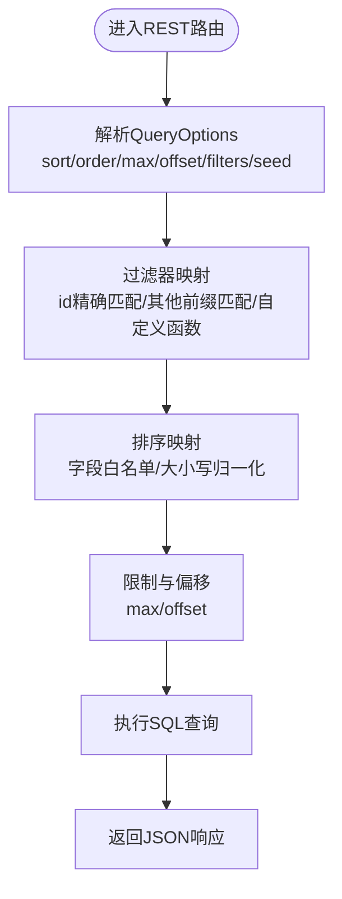
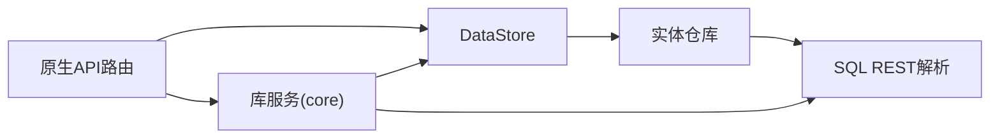

# 原生API - 库管理

<cite>
**本文引用的文件**
- [server/nativeapi/native_api.go](file://server/nativeapi/native_api.go)
- [server/nativeapi/library.go](file://server/nativeapi/library.go)
- [core/library.go](file://core/library.go)
- [model/album.go](file://model/album.go)
- [model/artist.go](file://model/artist.go)
- [model/mediafile.go](file://model/mediafile.go)
- [model/datastore.go](file://model/datastore.go)
- [persistence/sql_restful.go](file://persistence/sql_restful.go)
- [persistence/sql_base_repository.go](file://persistence/sql_base_repository.go)
- [server/nativeapi/library_test.go](file://server/nativeapi/library_test.go)
- [model/errors.go](file://model/errors.go)
</cite>

## 目录
1. [简介](#简介)
2. [项目结构](#项目结构)
3. [核心组件](#核心组件)
4. [架构总览](#架构总览)
5. [详细组件分析](#详细组件分析)
6. [依赖关系分析](#依赖关系分析)
7. [性能考量](#性能考量)
8. [故障排查指南](#故障排查指南)
9. [结论](#结论)
10. [附录：端点与数据模型对照](#附录端点与数据模型对照)

## 简介
本文件面向Navidrome原生API中的“库管理”能力，系统性梳理与音乐库相关的HTTP端点，覆盖专辑、艺术家、媒体文件的检索与管理，并解释其与核心库服务（core/library.go）及数据模型（model/album.go、model/artist.go、model/mediafile.go）之间的映射关系。文档同时说明分页、排序、过滤的使用方法，列举常见错误状态码及最佳实践，帮助开发者快速集成与排障。

## 项目结构
原生API通过统一的路由器注册REST风格端点，其中专辑、艺术家、媒体文件等资源均以通用REST路由暴露；库管理（Library）与用户-库关联（User-Library）由专用路由实现，且仅对管理员开放。

图表来源
- [server/nativeapi/native_api.go](file://server/nativeapi/native_api.go#L39-L104)
- [server/nativeapi/library.go](file://server/nativeapi/library.go#L15-L22)
- [core/library.go](file://core/library.go#L30-L45)
- [persistence/sql_restful.go](file://persistence/sql_restful.go#L18-L88)

章节来源
- [server/nativeapi/native_api.go](file://server/nativeapi/native_api.go#L39-L104)
- [server/nativeapi/library.go](file://server/nativeapi/library.go#L15-L22)

## 核心组件
- 原生API路由器：集中注册通用REST端点（/song、/album、/artist、/genre等），并通过RX/R方法将模型实例映射为可持久化或只读的REST仓库。
- 库管理服务：提供用户库权限查询与设置、库实体的CRUD包装（含校验、事件广播）、库路径有效性检查与扫描触发。
- 数据模型：Album、Artist、MediaFile等实体定义了API响应字段与业务属性，作为REST序列化/反序列化的载体。
- 查询选项与过滤：统一的QueryOptions承载sort、order、max、offset、filters、seed等参数，经SQL层解析为安全的数据库查询。

章节来源
- [server/nativeapi/native_api.go](file://server/nativeapi/native_api.go#L82-L104)
- [core/library.go](file://core/library.go#L30-L45)
- [model/album.go](file://model/album.go#L12-L67)
- [model/artist.go](file://model/artist.go#L9-L39)
- [model/mediafile.go](file://model/mediafile.go#L22-L95)
- [model/datastore.go](file://model/datastore.go#L10-L17)
- [persistence/sql_restful.go](file://persistence/sql_restful.go#L18-L88)

## 架构总览
下图展示了从HTTP请求到数据模型与服务层的调用链路，以及库管理与用户-库关联的关键节点。

图表来源
- [server/nativeapi/native_api.go](file://server/nativeapi/native_api.go#L82-L104)
- [core/library.go](file://core/library.go#L132-L146)

## 详细组件分析

### 通用REST端点（专辑/艺术家/媒体文件）
- 路由注册：通过R/RX方法将模型映射为REST仓库，自动暴露GET列表、GET详情、POST创建、PUT更新、DELETE删除。
- 访问控制：受JWT认证中间件保护，支持刷新与最后访问时间更新。
- 过滤/排序/分页：统一通过QueryOptions传递，SQL层进行白名单校验、默认前缀匹配、随机排序种子保持等。

图表来源
- [persistence/sql_restful.go](file://persistence/sql_restful.go#L18-L88)
- [persistence/sql_base_repository.go](file://persistence/sql_base_repository.go#L94-L112)

章节来源
- [server/nativeapi/native_api.go](file://server/nativeapi/native_api.go#L82-L104)
- [persistence/sql_restful.go](file://persistence/sql_restful.go#L18-L88)
- [persistence/sql_base_repository.go](file://persistence/sql_base_repository.go#L94-L112)

### 库管理端点（管理员）
- 路径：/library
- 方法：
  - GET /library：列出所有库（管理员）
  - GET /library/{id}：按ID获取库（管理员）
  - POST /library：创建库（管理员）
  - PUT /library/{id}：更新库（管理员）
  - DELETE /library/{id}：删除库（管理员）
- 行为要点：
  - 新增/更新时进行库名与路径校验，路径必须为绝对路径且存在可访问目录。
  - 更新路径会重启文件系统监听并触发扫描。
  - 删除会停止监听并触发扫描清理。
  - 成功后向所有客户端广播刷新事件。

章节来源
- [server/nativeapi/native_api.go](file://server/nativeapi/native_api.go#L39-L77)
- [core/library.go](file://core/library.go#L158-L236)
- [core/library.go](file://core/library.go#L238-L276)
- [core/library.go](file://core/library.go#L280-L306)
- [core/library.go](file://core/library.go#L308-L376)
- [core/library.go](file://core/library.go#L378-L396)

### 用户-库关联端点（管理员）
- 路径：/user/{id}/library
- 方法：
  - GET /user/{id}/library：获取指定用户的库集合（管理员）
  - PUT /user/{id}/library：设置指定用户的库集合（管理员）
- 行为要点：
  - GET：若用户不存在返回404；成功返回库数组。
  - PUT：请求体包含libraryIds数组；校验用户存在、非管理员用户至少分配一个库、库ID必须存在；成功后返回更新后的库集合。

章节来源
- [server/nativeapi/library.go](file://server/nativeapi/library.go#L15-L22)
- [server/nativeapi/library.go](file://server/nativeapi/library.go#L39-L101)
- [core/library.go](file://core/library.go#L58-L103)
- [core/library.go](file://core/library.go#L378-L396)

### 数据模型与API响应映射
- Album（专辑）
  - 关键字段：id、libraryId、name、albumArtist、minYear/maxYear、duration、size、discs、genres、participants、tags、external信息等。
  - 用途：用于专辑列表、专辑详情、专辑封面等。
- Artist（艺术家）
  - 关键字段：id、name、sortArtistName、orderArtistName、mbzArtistId、stats、size、albumCount、songCount、biography、外部图片与链接等。
  - 用途：艺术家详情、相似艺术家、统计信息等。
- MediaFile（媒体文件）
  - 关键字段：id、libraryId、folderId、path、title、album、artist、albumArtist、trackNumber、discNumber、year、duration、bitRate、sampleRate、bitDepth、channels、genres、participants、tags、外层元数据（如歌词、BPM、显式内容标记）等。
  - 用途：歌曲元数据、播放队列、歌单曲目等。

章节来源
- [model/album.go](file://model/album.go#L12-L67)
- [model/artist.go](file://model/artist.go#L9-L39)
- [model/mediafile.go](file://model/mediafile.go#L22-L95)

## 依赖关系分析
- 原生API路由器依赖DataStore接口获取各实体仓库，再委托给通用REST适配器完成CRUD。
- 库管理服务通过DataStore访问库仓库，封装校验、事件广播与扫描触发。
- SQL层负责将REST查询选项转换为安全的数据库查询条件，确保字段白名单与默认匹配策略。

图表来源
- [server/nativeapi/native_api.go](file://server/nativeapi/native_api.go#L82-L104)
- [core/library.go](file://core/library.go#L132-L146)
- [persistence/sql_restful.go](file://persistence/sql_restful.go#L18-L88)

章节来源
- [server/nativeapi/native_api.go](file://server/nativeapi/native_api.go#L82-L104)
- [core/library.go](file://core/library.go#L132-L146)
- [persistence/sql_restful.go](file://persistence/sql_restful.go#L18-L88)

## 性能考量
- 分页与排序
  - 使用max/offset进行分页，sort/order进行排序；随机排序支持seed参数以保证分页一致性。
- 过滤
  - 默认对非id字段采用前缀匹配；可通过自定义过滤函数扩展复杂条件。
- 字段白名单
  - 排序与过滤字段需在白名单内，避免注入风险。
- 索引建议
  - 对常用排序表达式建立索引可显著提升排序性能（参考SQL层注释说明）。

章节来源
- [persistence/sql_restful.go](file://persistence/sql_restful.go#L18-L88)
- [persistence/sql_base_repository.go](file://persistence/sql_base_repository.go#L73-L92)

## 故障排查指南
- 常见错误状态码
  - 400 Bad Request：请求体无效、必填字段缺失、库路径非法、库ID不存在、非管理员用户未分配库等。
  - 401 Unauthorized：未认证。
  - 403 Forbidden：非管理员访问管理员专用端点。
  - 404 Not Found：用户或库不存在。
  - 500 Internal Server Error：内部异常。
- 典型问题与处理
  - 库路径校验失败：确认路径为绝对路径且存在可访问目录；检查存储方案与权限。
  - 随机排序分页错位：为sort=random提供一致的seed值。
  - 用户库分配失败：确保传入的libraryIds均为存在的库ID，且非管理员用户至少分配一个库。
  - 资源未找到：确认ID格式正确，且实体确实存在于数据库。

章节来源
- [server/nativeapi/library.go](file://server/nativeapi/library.go#L39-L101)
- [core/library.go](file://core/library.go#L308-L376)
- [server/nativeapi/library_test.go](file://server/nativeapi/library_test.go#L134-L235)
- [server/nativeapi/library_test.go](file://server/nativeapi/library_test.go#L282-L403)
- [model/errors.go](file://model/errors.go#L1-L12)

## 结论
Navidrome原生API通过统一的REST路由与SQL层过滤/排序/分页机制，为专辑、艺术家、媒体文件等资源提供了标准化的检索与管理能力；库管理与用户-库关联则通过管理员专用端点实现精细化权限控制。结合数据模型与服务层封装，开发者可以高效地构建音乐库应用，同时遵循安全与性能最佳实践。

## 附录：端点与数据模型对照

### 通用REST端点（专辑/艺术家/媒体文件）
- 路由前缀：/album、/artist、/song、/genre、/tag、/player、/transcoding、/radio、/playlist、/share（按配置）
- 方法：GET（列表/详情）、POST（创建，部分资源）、PUT（更新，部分资源）、DELETE（删除，部分资源）
- 查询参数：sort、order、max、offset、filters（支持id精确匹配、前缀匹配、布尔、全文等），seed（随机排序种子）
- 响应：JSON数组或对象，字段来自对应数据模型

章节来源
- [server/nativeapi/native_api.go](file://server/nativeapi/native_api.go#L45-L77)
- [persistence/sql_restful.go](file://persistence/sql_restful.go#L18-L88)
- [model/datastore.go](file://model/datastore.go#L10-L17)

### 库管理端点（管理员）
- 路径：/library
- 方法：
  - GET /library：返回库数组
  - GET /library/{id}：返回单个库
  - POST /library：创建库（校验名称与路径）
  - PUT /library/{id}：更新库（路径变更会重启监听并触发扫描）
  - DELETE /library/{id}：删除库（停止监听并触发扫描清理）

章节来源
- [server/nativeapi/native_api.go](file://server/nativeapi/native_api.go#L39-L77)
- [core/library.go](file://core/library.go#L158-L236)
- [core/library.go](file://core/library.go#L238-L276)
- [core/library.go](file://core/library.go#L308-L376)

### 用户-库关联端点（管理员）
- 路径：/user/{id}/library
- 方法：
  - GET /user/{id}/library：返回该用户可访问的库数组
  - PUT /user/{id}/library：设置该用户的库集合（非管理员至少一个，库ID必须存在）

章节来源
- [server/nativeapi/library.go](file://server/nativeapi/library.go#L15-L22)
- [server/nativeapi/library.go](file://server/nativeapi/library.go#L39-L101)
- [core/library.go](file://core/library.go#L58-L103)
- [core/library.go](file://core/library.go#L378-L396)