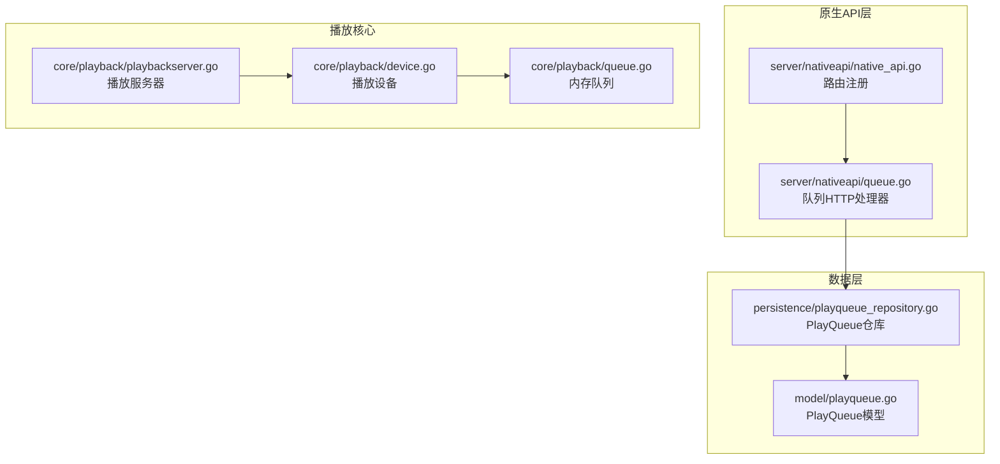
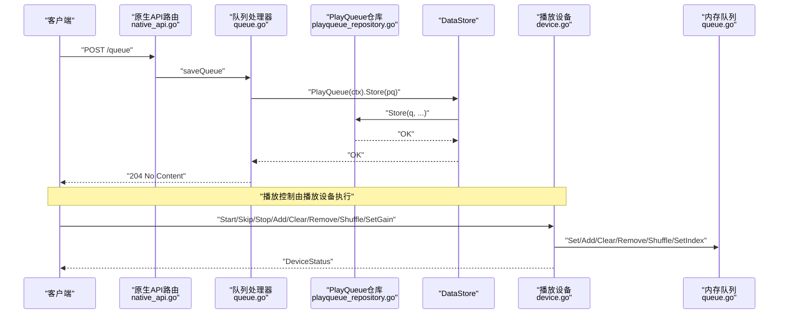
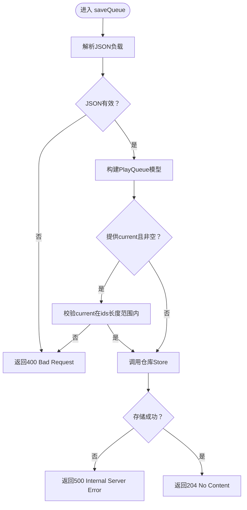
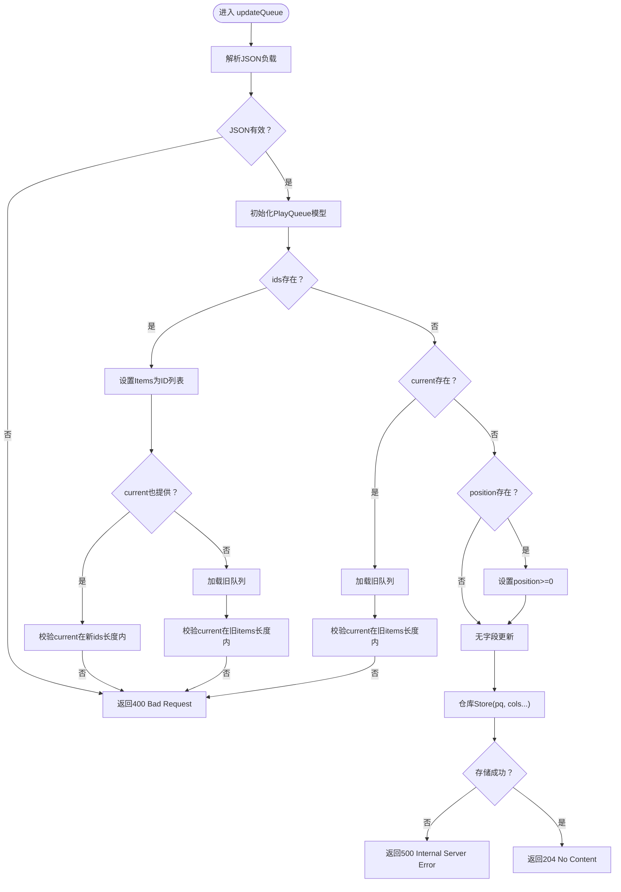
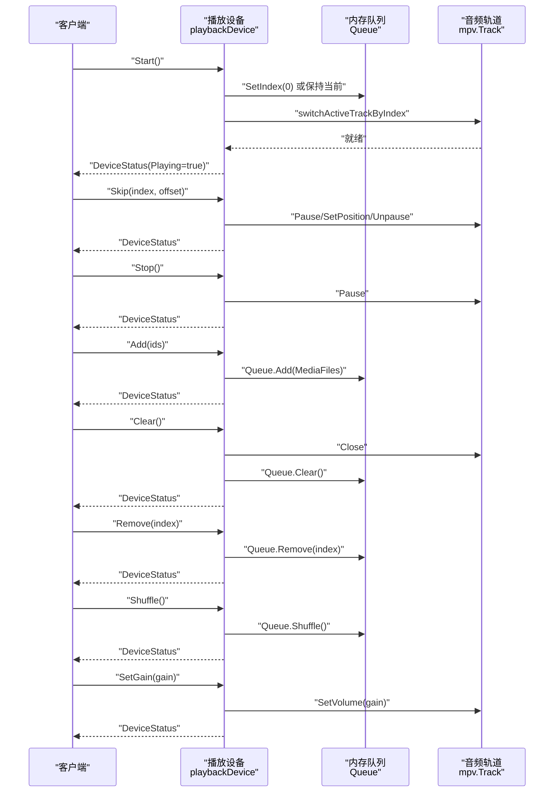
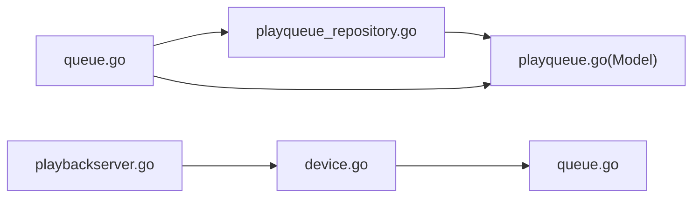

# 原生API - 播放队列管理

<cite>
**本文引用的文件列表**
- [server/nativeapi/queue.go](file://server/nativeapi/queue.go)
- [server/nativeapi/native_api.go](file://server/nativeapi/native_api.go)
- [model/playqueue.go](file://model/playqueue.go)
- [persistence/playqueue_repository.go](file://persistence/playqueue_repository.go)
- [core/playback/device.go](file://core/playback/device.go)
- [core/playback/queue.go](file://core/playback/queue.go)
- [core/playback/playbackserver.go](file://core/playback/playbackserver.go)
- [server/nativeapi/queue_test.go](file://server/nativeapi/queue_test.go)
</cite>

## 目录
1. [简介](#简介)
2. [项目结构](#项目结构)
3. [核心组件](#核心组件)
4. [架构总览](#架构总览)
5. [详细组件分析](#详细组件分析)
6. [依赖关系分析](#依赖关系分析)
7. [性能考量](#性能考量)
8. [故障排查指南](#故障排查指南)
9. [结论](#结论)
10. [附录：API规范与示例](#附录api规范与示例)

## 简介
本文件系统性梳理 Navidrome 原生API中“播放队列管理”的HTTP接口与内部实现，覆盖以下目标：
- 全面记录用于控制播放队列的HTTP端点（获取、保存、更新、清空）
- 描述playqueue数据结构及其在API中的表示
- 解释原生API如何与核心播放服务交互以控制播放状态
- 提供请求/响应示例与错误处理说明
- 给出并发访问与状态同步的注意事项及最佳实践

## 项目结构
与播放队列管理直接相关的模块分布如下：
- 原生API路由与处理器：server/nativeapi/queue.go、server/nativeapi/native_api.go
- 数据模型与仓库：model/playqueue.go、persistence/playqueue_repository.go
- 核心播放服务：core/playback/device.go、core/playback/queue.go、core/playback/playbackserver.go
- 单元测试：server/nativeapi/queue_test.go

图表来源
- [server/nativeapi/queue.go](file://server/nativeapi/queue.go#L1-L215)
- [server/nativeapi/native_api.go](file://server/nativeapi/native_api.go#L160-L171)
- [model/playqueue.go](file://model/playqueue.go#L1-L29)
- [persistence/playqueue_repository.go](file://persistence/playqueue_repository.go#L1-L179)
- [core/playback/device.go](file://core/playback/device.go#L1-L300)
- [core/playback/queue.go](file://core/playback/queue.go#L1-L137)
- [core/playback/playbackserver.go](file://core/playback/playbackserver.go#L1-L128)

章节来源
- [server/nativeapi/queue.go](file://server/nativeapi/queue.go#L1-L215)
- [server/nativeapi/native_api.go](file://server/nativeapi/native_api.go#L160-L171)

## 核心组件
- 原生API队列端点：GET/POST/PUT/DELETE /queue
- PlayQueue 数据模型：包含用户ID、当前索引、播放位置、变更来源、条目ID列表等
- PlayQueue 仓库：负责持久化与检索队列，支持全量替换与部分字段更新
- 播放设备与内存队列：负责实际播放控制（开始、暂停、跳转、移除、洗牌、音量）
- 播放服务器：提供设备选择与媒体文件解析能力

章节来源
- [server/nativeapi/queue.go](file://server/nativeapi/queue.go#L69-L215)
- [model/playqueue.go](file://model/playqueue.go#L1-L29)
- [persistence/playqueue_repository.go](file://persistence/playqueue_repository.go#L1-L179)
- [core/playback/device.go](file://core/playback/device.go#L1-L300)
- [core/playback/queue.go](file://core/playback/queue.go#L1-L137)
- [core/playback/playbackserver.go](file://core/playback/playbackserver.go#L1-L128)

## 架构总览
原生API通过HTTP端点接收客户端请求，转换为PlayQueue模型后交由仓库持久化；同时，播放核心通过播放设备与内存队列执行实际的播放控制。两者之间通过用户上下文与设备抽象进行解耦。

图表来源
- [server/nativeapi/native_api.go](file://server/nativeapi/native_api.go#L160-L171)
- [server/nativeapi/queue.go](file://server/nativeapi/queue.go#L94-L122)
- [persistence/playqueue_repository.go](file://persistence/playqueue_repository.go#L39-L77)
- [core/playback/device.go](file://core/playback/device.go#L81-L177)
- [core/playback/queue.go](file://core/playback/queue.go#L53-L137)

## 详细组件分析

### 原生API队列端点
- GET /queue
  - 功能：返回当前用户的播放队列（含条目ID列表与当前索引、播放位置）
  - 认证：受保护路由，需登录
  - 成功响应：200 OK，JSON体为PlayQueue
  - 失败响应：500 Internal Server Error（仓库查询失败）
- POST /queue
  - 功能：保存新的队列（可指定条目ID、当前索引、播放位置）
  - 请求体：JSON对象，字段可选
  - 校验：当前索引必须在条目数量范围内，否则400 Bad Request
  - 成功响应：204 No Content
  - 失败响应：400/500
- PUT /queue
  - 功能：部分更新队列字段（ids/current/position），按传入字段更新
  - 校验：若ids被更新且未显式提供current，则基于新ids校验existing.current；若仅更新current则基于现有或新ids校验
  - 成功响应：204 No Content
  - 失败响应：400/500
- DELETE /queue
  - 功能：清空当前用户队列
  - 成功响应：204 No Content
  - 失败响应：500

章节来源
- [server/nativeapi/native_api.go](file://server/nativeapi/native_api.go#L160-L171)
- [server/nativeapi/queue.go](file://server/nativeapi/queue.go#L69-L215)
- [server/nativeapi/queue_test.go](file://server/nativeapi/queue_test.go#L1-L283)

### PlayQueue 数据结构与表示
- 字段
  - id：队列唯一标识
  - userId：所属用户ID
  - current：当前播放曲目的索引
  - position：当前播放位置（毫秒）
  - changedBy：最后修改来源（客户端名）
  - items：条目ID列表（JSON中可能为空）
  - createdAt/updatedAt：创建与更新时间
- 仓库行为
  - Store(q)：无列名时整队列替换；有列名时部分更新
  - Retrieve(userId)：仅返回队列基本信息（不加载完整媒体文件）
  - RetrieveWithMediaFiles(userId)：返回队列并加载完整媒体文件
  - Clear(userId)：删除该用户队列

章节来源
- [model/playqueue.go](file://model/playqueue.go#L1-L29)
- [persistence/playqueue_repository.go](file://persistence/playqueue_repository.go#L1-L179)

### 与播放核心的交互
- 播放设备（playbackDevice）
  - 提供 Start/Stop/Skip/Add/Clear/Remove/Shuffle/SetGain 等操作
  - 维护 DeviceStatus（当前索引、是否播放、音量、当前位置）
  - 内部使用内存队列（Queue）存储MediaFiles
- 播放服务器（PlaybackServer）
  - 提供 GetDeviceForUser 获取默认设备
  - 提供 GetMediaFile 解析媒体文件
- 原生API与播放核心的关系
  - 原生API负责队列的持久化与状态读取
  - 播放核心负责实际播放控制与状态反馈
  - 两者通过用户上下文与设备抽象协同工作

章节来源
- [core/playback/device.go](file://core/playback/device.go#L1-L300)
- [core/playback/queue.go](file://core/playback/queue.go#L1-L137)
- [core/playback/playbackserver.go](file://core/playback/playbackserver.go#L1-L128)

### 关键流程图与时序图

#### 队列保存流程（POST /queue）

图表来源
- [server/nativeapi/queue.go](file://server/nativeapi/queue.go#L94-L122)

#### 队列部分更新流程（PUT /queue）

图表来源
- [server/nativeapi/queue.go](file://server/nativeapi/queue.go#L124-L201)

#### 播放控制序列（Start/Skip/Stop/Add/Clear/Remove/Shuffle/SetGain）

图表来源
- [core/playback/device.go](file://core/playback/device.go#L81-L236)
- [core/playback/queue.go](file://core/playback/queue.go#L53-L137)

## 依赖关系分析
- 原生API层依赖 DataStore 的 PlayQueue 仓库进行持久化
- 仓库将 PlayQueue 模型映射到数据库表，条目ID以逗号分隔存储
- 播放核心依赖播放服务器选择设备，并通过设备执行播放控制
- 设备内部维护内存队列，与仓库持久化的队列在概念上互补：前者用于运行时播放，后者用于跨会话持久化

图表来源
- [server/nativeapi/queue.go](file://server/nativeapi/queue.go#L1-L215)
- [persistence/playqueue_repository.go](file://persistence/playqueue_repository.go#L1-L179)
- [model/playqueue.go](file://model/playqueue.go#L1-L29)
- [core/playback/device.go](file://core/playback/device.go#L1-L300)
- [core/playback/queue.go](file://core/playback/queue.go#L1-L137)
- [core/playback/playbackserver.go](file://core/playback/playbackserver.go#L1-L128)

## 性能考量
- 仓库在加载队列时会根据ID列表批量查询媒体文件，采用分块策略避免SQLite变量上限限制
- 队列更新支持部分字段写入，减少不必要的全量替换
- 播放设备内部使用内存队列，避免频繁IO；但注意大量条目时内存占用

章节来源
- [persistence/playqueue_repository.go](file://persistence/playqueue_repository.go#L133-L168)
- [server/nativeapi/queue.go](file://server/nativeapi/queue.go#L124-L201)

## 故障排查指南
- 常见错误
  - 400 Bad Request：JSON格式错误、current索引越界、ids与current不匹配
  - 500 Internal Server Error：仓库存取异常、设备切换失败
- 排查步骤
  - 确认请求体JSON合法且字段类型正确
  - 校验ids长度与current范围一致性
  - 查看仓库日志定位持久化问题
  - 检查播放设备状态机（Start/Skip/Stop/Add/Clear/Remove/Shuffle/SetGain）调用链
- 单元测试参考
  - 包含正向与异常场景的端到端验证，可作为集成测试样例

章节来源
- [server/nativeapi/queue_test.go](file://server/nativeapi/queue_test.go#L1-L283)
- [server/nativeapi/queue.go](file://server/nativeapi/queue.go#L22-L30)
- [persistence/playqueue_repository.go](file://persistence/playqueue_repository.go#L39-L77)

## 结论
原生API的播放队列管理通过清晰的HTTP端点与PlayQueue模型实现了对用户播放队列的持久化控制；结合播放设备与内存队列，Navidrome在保证状态一致性的前提下提供了灵活的播放控制能力。建议客户端在批量更新时优先使用PUT的字段选择更新，避免不必要的全量替换；在跨设备/会话共享播放状态时，应关注仓库与设备状态的同步策略。

## 附录：API规范与示例

### HTTP端点一览
- GET /queue
  - 方法：GET
  - 路径：/queue
  - 认证：需要登录
  - 成功：200 OK，Body：PlayQueue
  - 失败：500 Internal Server Error
- POST /queue
  - 方法：POST
  - 路径：/queue
  - 认证：需要登录
  - 请求体：JSON，字段可选
    - ids：字符串数组（可选）
    - current：整数（可选）
    - position：长整型（可选）
  - 成功：204 No Content
  - 失败：400/500
- PUT /queue
  - 方法：PUT
  - 路径：/queue
  - 认证：需要登录
  - 请求体：JSON，字段可选
    - ids：字符串数组（可选）
    - current：整数（可选）
    - position：长整型（可选）
  - 成功：204 No Content
  - 失败：400/500
- DELETE /queue
  - 方法：DELETE
  - 路径：/queue
  - 认证：需要登录
  - 成功：204 No Content
  - 失败：500

章节来源
- [server/nativeapi/native_api.go](file://server/nativeapi/native_api.go#L160-L171)
- [server/nativeapi/queue.go](file://server/nativeapi/queue.go#L69-L215)

### PlayQueue 数据结构
- 字段定义
  - id：字符串
  - userId：字符串
  - current：整数
  - position：长整型
  - changedBy：字符串
  - items：媒体文件ID列表（JSON中可能为空）
  - createdAt/updatedAt：时间戳

章节来源
- [model/playqueue.go](file://model/playqueue.go#L1-L29)

### 播放控制端点（Subsonic风格）
- Start：启动播放
- Stop：暂停播放
- Skip：跳转到指定曲目并设置偏移
- Add：追加曲目
- Clear：清空队列
- Remove：移除指定曲目
- Shuffle：随机打乱
- SetGain：设置音量

章节来源
- [core/playback/device.go](file://core/playback/device.go#L81-L236)
- [core/playback/queue.go](file://core/playback/queue.go#L53-L137)