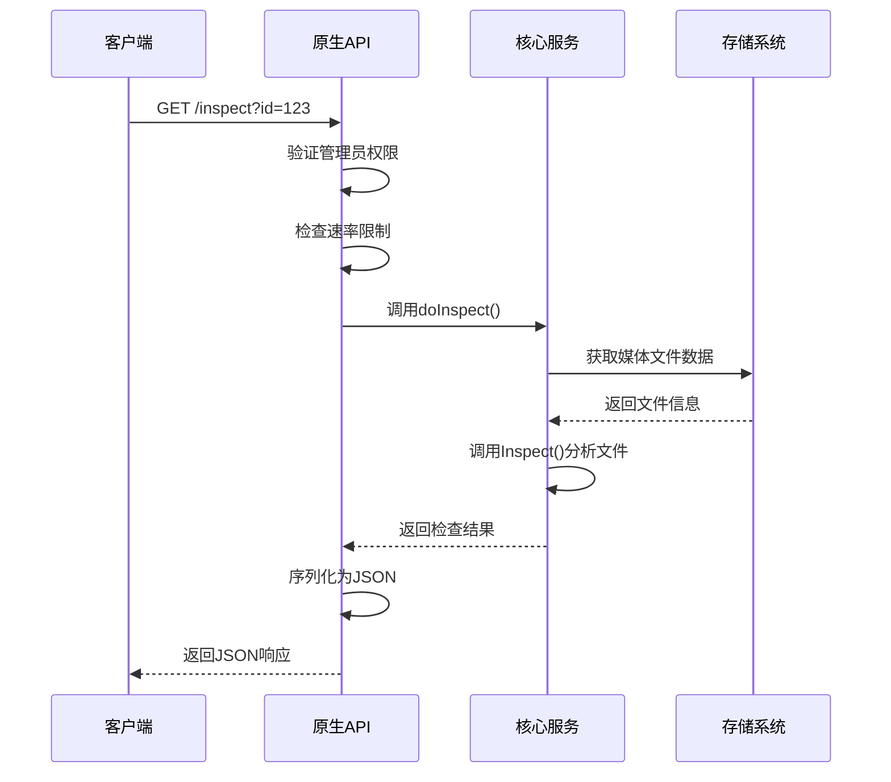
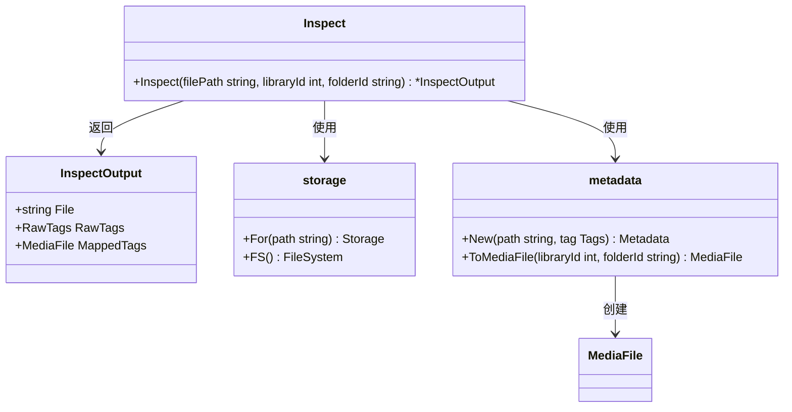
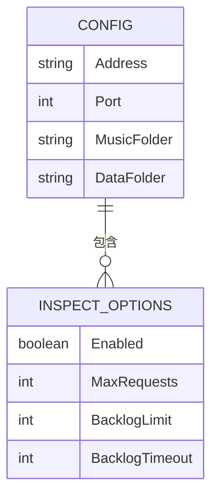
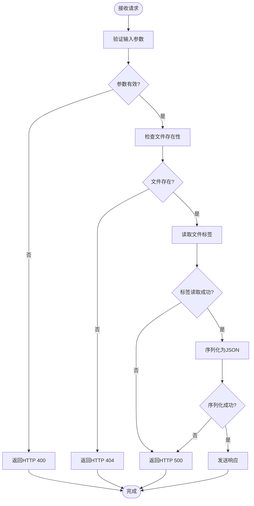

# 原生API - 系统检查

<cite>
**本文档中引用的文件**  
- [inspect.go](file://server/nativeapi/inspect.go)
- [native_api.go](file://server/nativeapi/native_api.go)
- [core/inspect.go](file://core/inspect.go)
- [configuration.go](file://conf/configuration.go)
- [model/scanner.go](file://model/scanner.go)
- [scanner/controller.go](file://scanner/controller.go)
</cite>

## 目录
1. [简介](#简介)
2. [系统检查端点](#系统检查端点)
3. [核心检查功能](#核心检查功能)
4. [配置选项](#配置选项)
5. [错误处理](#错误处理)
6. [使用场景](#使用场景)

## 简介
Navidrome的原生API提供了系统检查功能，允许管理员获取服务器内部状态信息。这些API端点暴露了系统健康状况、扫描进度和诊断信息，对于监控和故障排除至关重要。系统检查功能主要通过`/inspect`端点实现，该端点需要管理员权限访问，并受到速率限制保护。

**Section sources**
- [native_api.go](file://server/nativeapi/native_api.go#L200-L211)
- [inspect.go](file://server/nativeapi/inspect.go#L1-L68)

## 系统检查端点
系统检查功能通过HTTP GET请求访问`/inspect`端点实现。该端点需要提供媒体文件ID作为查询参数，返回该文件的原始标签信息和映射后的媒体文件数据。



**Diagram sources**
- [inspect.go](file://server/nativeapi/inspect.go#L28-L68)
- [core/inspect.go](file://core/inspect.go#L19-L52)

### 端点详情
- **HTTP方法**: GET
- **URL模式**: `/inspect`
- **认证要求**: 管理员权限
- **查询参数**: `id` (媒体文件ID)
- **成功响应**: HTTP 200，包含JSON格式的检查结果
- **错误响应**: 
  - HTTP 400: 参数无效
  - HTTP 403: 权限不足
  - HTTP 404: 文件未找到
  - HTTP 500: 服务器内部错误

**Section sources**
- [inspect.go](file://server/nativeapi/inspect.go#L28-L68)
- [native_api.go](file://server/nativeapi/native_api.go#L200-L211)

## 核心检查功能
核心检查功能在`core/inspect.go`文件中实现，通过`Inspect`函数分析媒体文件的元数据。该功能与存储系统集成，能够读取文件的实际标签信息。



**Diagram sources**
- [core/inspect.go](file://core/inspect.go#L13-L52)
- [model/mediafile.go](file://model/mediafile.go)

### 响应数据结构
系统检查API返回的JSON响应包含以下字段：

| 字段 | 类型 | 描述 |
|------|------|------|
| file | 字符串 | 文件的绝对路径 |
| rawTags | 对象 | 从文件中读取的原始标签数据 |
| mappedTags | 对象 | 映射到Navidrome数据模型的媒体文件信息 |

```json
{
  "file": "/music/artist/album/song.mp3",
  "rawTags": {
    "title": "Song Title",
    "artist": "Artist Name",
    "album": "Album Name",
    "track": 1,
    "year": 2023
  },
  "mappedTags": {
    "id": "123",
    "title": "Song Title",
    "artist": "Artist Name",
    "album": "Album Name",
    "track": 1,
    "year": 2023,
    "duration": 180000
  }
}
```

**Section sources**
- [core/inspect.go](file://core/inspect.go#L13-L17)
- [inspect.go](file://server/nativeapi/inspect.go#L53-L59)

## 配置选项
系统检查功能的速率限制行为可以通过配置文件进行控制。这些配置选项定义了API的并发请求限制和队列行为。



**Diagram sources**
- [configuration.go](file://conf/configuration.go#L220-L225)

### 配置参数
系统检查功能支持以下配置参数：

| 配置项 | 类型 | 默认值 | 描述 |
|--------|------|--------|------|
| Server.Inspect.Enabled | 布尔值 | true | 是否启用系统检查功能 |
| Server.Inspect.MaxRequests | 整数 | 0 | 最大并发请求数（0表示无限制） |
| Server.Inspect.BacklogLimit | 整数 | 0 | 请求队列的最大长度 |
| Server.Inspect.BacklogTimeout | 整数 | 0 | 请求在队列中的最大等待时间（毫秒） |

这些配置可以在`navidrome.toml`配置文件中设置，或通过环境变量（如`ND_SERVER_INSPECT_ENABLED`）进行配置。

**Section sources**
- [configuration.go](file://conf/configuration.go#L220-L225)
- [native_api.go](file://server/nativeapi/native_api.go#L201-L208)

## 错误处理
系统检查API实现了全面的错误处理机制，能够区分不同类型的错误并返回适当的HTTP状态码。



**Diagram sources**
- [inspect.go](file://server/nativeapi/inspect.go#L35-L58)

### 错误类型
系统检查API可能返回以下错误类型：

- **参数错误** (HTTP 400): 当请求缺少或包含无效的`id`参数时
- **未找到错误** (HTTP 404): 当指定ID的文件不存在或已被删除时
- **内部服务器错误** (HTTP 500): 当读取文件标签或序列化响应时发生错误时
- **权限错误** (HTTP 403): 当非管理员用户尝试访问端点时

错误响应包含描述错误原因的文本消息，帮助用户诊断问题。

**Section sources**
- [inspect.go](file://server/nativeapi/inspect.go#L35-L58)
- [model/errors.go](file://model/errors.go#L5-L12)

## 使用场景
系统检查API在多种场景下都非常有用，特别是在系统监控和故障排除方面。

### 监控系统健康
管理员可以使用系统检查API来验证媒体文件的元数据是否正确读取。通过检查`rawTags`和`mappedTags`字段，可以确认Navidrome是否正确解析了文件的ID3标签或其他元数据。

### 诊断问题
当用户报告某些歌曲信息不正确时，管理员可以使用此API直接检查文件的实际标签内容。这有助于区分是文件本身的问题还是Navidrome的解析问题。

### 自动化脚本
系统检查功能可以集成到自动化脚本中，用于批量验证媒体库的完整性。例如，可以编写脚本定期检查所有文件的标签，确保元数据的一致性。

### 开发和调试
开发者可以使用此API来调试元数据解析逻辑，验证新的文件格式是否被正确支持，或检查映射规则是否按预期工作。

**Section sources**
- [inspect.go](file://server/nativeapi/inspect.go)
- [core/inspect.go](file://core/inspect.go)