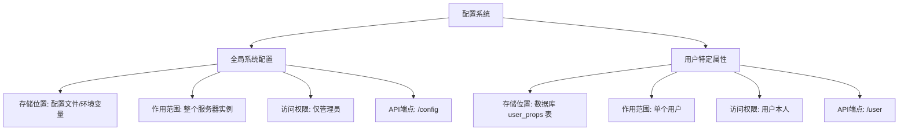
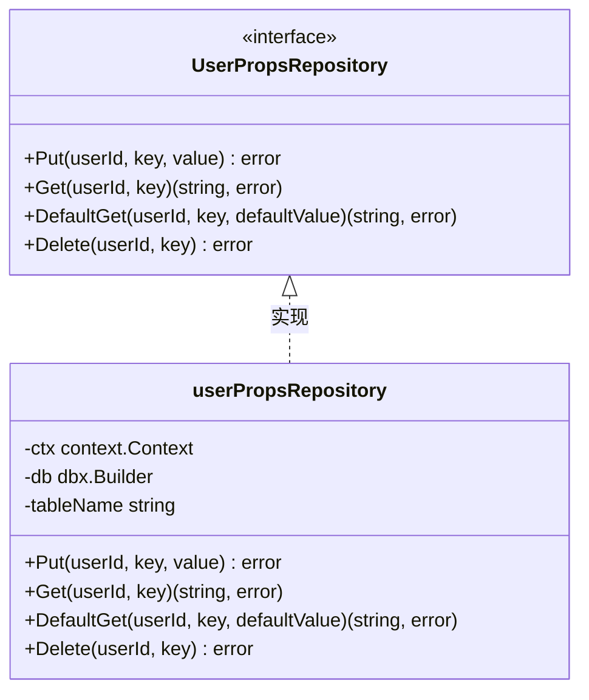
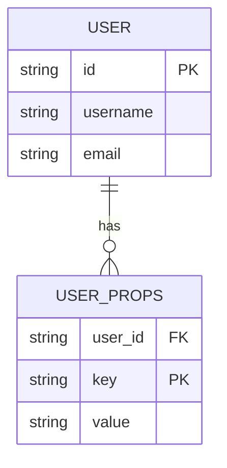

# 原生API - 系统配置

<cite>
**本文档引用的文件**  
- [config.go](file://server/nativeapi/config.go)
- [configuration.go](file://conf/configuration.go)
- [user_props.go](file://model/user_props.go)
- [user_props_repository.go](file://persistence/user_props_repository.go)
- [property_repository.go](file://persistence/property_repository.go)
- [native_api.go](file://server/nativeapi/native_api.go)
</cite>

## 目录
1. [简介](#简介)
2. [全局配置与用户配置的区别](#全局配置与用户配置的区别)
3. [全局系统配置API](#全局系统配置api)
4. [用户特定属性API](#用户特定属性api)
5. [配置持久化机制](#配置持久化机制)
6. [事件通知机制](#事件通知机制)
7. [安全考虑](#安全考虑)
8. [错误处理策略](#错误处理策略)

## 简介

Navidrome提供了一套原生API来管理系统的配置和用户偏好设置。该API允许管理员读取和更新全局系统配置，同时也支持每个用户存储和检索其个人偏好设置。本文档详细记录了这些配置功能的HTTP端点、数据结构和工作流程。

系统配置分为两个主要部分：全局配置和用户特定属性。全局配置由`conf/configuration.go`中的`configOptions`结构体定义，包含服务器设置、扫描选项、外部服务集成等。用户特定属性则存储在数据库中，通过`model/user_props.go`中的`UserPropsRepository`接口进行管理。

**Section sources**
- [configuration.go](file://conf/configuration.go#L22-L137)
- [user_props.go](file://model/user_props.go#L3-L8)

## 全局配置与用户配置的区别

Navidrome的配置系统明确区分了全局系统配置和用户特定属性，这两者在作用范围、存储位置和访问权限上都有显著不同。

全局系统配置（Global Configuration）影响整个Navidrome实例的行为。这些配置项定义在`conf/configuration.go`文件中，通过`configOptions`结构体组织。它们通常在服务器启动时从配置文件或环境变量加载，并在整个应用生命周期中保持不变。全局配置包括服务器地址、端口、音乐文件夹路径、日志级别、外部服务（如Last.fm、Spotify）的API密钥等。这些配置只能由管理员用户通过特定的API端点访问。

用户特定属性（User-specific Properties）则存储每个用户的个性化偏好，如界面主题、默认音量、语言选择等。这些属性存储在数据库的`user_props`表中，通过`model/user_props.go`中的`UserPropsRepository`接口进行访问。每个用户只能访问和修改自己的属性，这确保了用户隐私和数据隔离。

在API层面，全局配置通过`/config`端点访问，而用户属性通过`/user`端点下的相关路由管理。这种分离设计使得系统管理员可以控制全局行为，同时允许用户自定义其个人体验。



**Diagram sources**
- [configuration.go](file://conf/configuration.go#L22-L137)
- [user_props.go](file://model/user_props.go#L3-L8)

**Section sources**
- [configuration.go](file://conf/configuration.go#L22-L137)
- [user_props.go](file://model/user_props.go#L3-L8)

## 全局系统配置API

全局系统配置API提供了读取服务器当前配置的功能。该API端点仅对管理员用户开放，确保敏感配置信息不会被普通用户访问。

### HTTP端点

- **方法**: `GET`
- **路径**: `/config`
- **权限**: 仅管理员

### 请求示例

```http
GET /config HTTP/1.1
Authorization: Bearer <admin_jwt_token>
Accept: application/json
```

### 响应模式

成功的响应返回一个包含配置信息的JSON对象：

```json
{
  "id": "config",
  "configFile": "/path/to/navidrome/config.ini",
  "config": {
    "address": "0.0.0.0",
    "port": 4533,
    "musicFolder": "./music",
    "dataFolder": ".",
    "logLevel": "info",
    "enableExternalServices": true,
    "lastFM": {
      "enabled": true,
      "apiKey": "s***********3"
    },
    "spotify": {
      "id": "s***********3",
      "secret": "s***********3"
    }
  }
}
```

响应结构由`configResponse`结构体定义，包含三个字段：
- `id`: 固定为"config"
- `configFile`: 当前使用的配置文件路径
- `config`: 包含实际配置值的嵌套对象

值得注意的是，出于安全考虑，某些敏感字段（如API密钥、密码）在响应中会被部分或完全遮蔽。这通过`sensitiveFieldsPartialMask`和`sensitiveFieldsFullMask`两个变量控制，确保即使管理员用户也无法通过API直接获取完整的敏感信息。

**Section sources**
- [config.go](file://server/nativeapi/config.go#L37-L132)
- [native_api.go](file://server/nativeapi/native_api.go#L214-L217)

## 用户特定属性API

用户特定属性API允许用户读取和更新其个人偏好设置。这些属性存储在数据库中，为每个用户提供独立的配置空间。

### HTTP端点

用户属性的管理通过标准的RESTful资源操作实现，主要端点包括：

- **获取属性**: `GET /user/{userId}/props/{key}`
- **更新属性**: `PUT /user/{userId}/props/{key}`
- **删除属性**: `DELETE /user/{userId}/props/{key}`

### 请求/响应模式

#### 获取用户属性

```http
GET /user/12345/props/theme HTTP/1.1
Authorization: Bearer <user_jwt_token>
```

成功响应：
```json
{
  "value": "Dark"
}
```

#### 更新用户属性

```http
PUT /user/12345/props/theme HTTP/1.1
Authorization: Bearer <user_jwt_token>
Content-Type: application/json

{
  "value": "Light"
}
```

成功响应：
```json
{
  "id": "theme",
  "value": "Light"
}
```

### 数据访问接口

用户属性的持久化由`persistence/user_props_repository.go`中的`userPropsRepository`实现。该实现提供了四个主要方法：
- `Put(userId, key, value)`: 存储用户属性
- `Get(userId, key)`: 获取用户属性
- `DefaultGet(userId, key, defaultValue)`: 获取用户属性，如果不存在则返回默认值
- `Delete(userId, key)`: 删除用户属性

这些方法直接操作数据库的`user_props`表，使用用户ID和属性键作为复合主键来确保数据的唯一性和完整性。



**Diagram sources**
- [user_props.go](file://model/user_props.go#L3-L8)
- [user_props_repository.go](file://persistence/user_props_repository.go#L12-L22)

**Section sources**
- [user_props.go](file://model/user_props.go#L3-L8)
- [user_props_repository.go](file://persistence/user_props_repository.go#L12-L63)

## 配置持久化机制

Navidrome采用不同的持久化策略来处理全局配置和用户特定属性，反映了它们在生命周期和访问模式上的差异。

### 全局配置持久化

全局配置主要通过配置文件（如`navidrome.ini`、`navidrome.json`等）和环境变量进行持久化。服务器启动时，`conf/configuration.go`中的`InitConfig`函数负责加载这些配置。系统使用Viper库来统一处理多种配置格式，并通过`setViperDefaults`函数设置默认值。

配置的加载流程如下：
1. 首先从指定的配置文件或默认位置读取配置
2. 然后从环境变量（以`ND_`为前缀）加载配置，覆盖文件中的值
3. 最后应用默认值，确保所有配置项都有合理的默认设置

值得注意的是，全局配置是只读的——API只允许读取当前配置，不允许通过API直接修改配置文件。要更改全局配置，必须编辑配置文件或设置环境变量，然后重启服务器。

### 用户属性持久化

用户特定属性则使用数据库进行持久化，存储在SQLite数据库的`user_props`表中。该表的结构如下：

| 列名 | 类型 | 描述 |
|------|------|------|
| user_id | TEXT | 用户ID，外键引用users表 |
| key | TEXT | 属性键，如"theme"、"volume"等 |
| value | TEXT | 属性值，存储为字符串 |

`persistence/user_props_repository.go`中的`userPropsRepository`实现了对这个表的CRUD操作。`Put`方法首先尝试更新现有记录，如果不存在则插入新记录，这确保了每个用户-键组合的唯一性。

这种设计允许用户属性在服务器重启后仍然保持，并且可以高效地进行查询和更新。



**Diagram sources**
- [configuration.go](file://conf/configuration.go#L667-L719)
- [user_props_repository.go](file://persistence/user_props_repository.go#L24-L35)

**Section sources**
- [configuration.go](file://conf/configuration.go#L244-L382)
- [user_props_repository.go](file://persistence/user_props_repository.go#L24-L63)

## 事件通知机制

当系统配置发生变化时，Navidrome通过事件系统通知相关组件，确保系统状态的一致性。虽然全局配置不能通过API直接修改，但当配置文件被外部修改并重启服务器时，系统需要重新加载配置并通知各个组件。

### 事件总线

Navidrome使用一个基于`server/events/events.go`的事件总线系统。核心接口是`Broker`，它允许组件订阅和发布事件。主要的事件类型包括：

- `ScanStatus`: 扫描状态更新
- `KeepAlive`: 心跳事件
- `ServerStart`: 服务器启动事件
- `RefreshResource`: 资源刷新事件

### 配置变更通知

虽然没有直接的"配置变更"事件，但配置的改变会间接触发其他事件。例如：
- 当`Scanner.Schedule`配置改变时，会影响扫描任务的调度
- 当`MusicFolder`改变时，会在服务器启动时触发完整的库扫描
- 当外部服务配置（如Last.fm API密钥）改变时，会影响相关服务的初始化

系统通过在`conf/configuration.go`中注册初始化钩子（`AddHook`函数）来响应配置变化。这些钩子在配置加载后立即执行，允许组件根据新配置调整其行为。

例如，当PID（Persistent Identifier）配置改变时，系统会自动触发一次完整的扫描，以确保媒体文件的标识符与新配置一致。

**Section sources**
- [events.go](file://server/events/events.go#L21-L90)
- [configuration.go](file://conf/configuration.go#L511-L514)

## 安全考虑

Navidrome的配置系统在设计时充分考虑了安全性，特别是在处理敏感信息和访问控制方面。

### 敏感信息保护

系统通过两种机制保护敏感配置信息：
1. **完全遮蔽**: 对于绝对不能暴露的字段（如`PasswordEncryptionKey`），在API响应中完全替换为`****`
2. **部分遮蔽**: 对于需要部分可见的字段（如API密钥），显示首尾字符，中间用`*`填充

这些规则定义在`server/nativeapi/config.go`中的`sensitiveFieldsFullMask`和`sensitiveFieldsPartialMask`变量中：

```go
var sensitiveFieldsFullMask = []string{
    "DevAutoCreateAdminPassword",
    "PasswordEncryptionKey",
    "Prometheus.Password",
}

var sensitiveFieldsPartialMask = []string{
    "LastFM.ApiKey",
    "LastFM.Secret",
    "Spotify.ID",
    "Spotify.Secret",
}
```

### 访问控制

访问控制是配置安全的另一重要方面：
- **全局配置**: 仅管理员用户可以访问`/config`端点，通过`adminOnlyMiddleware`中间件强制执行
- **用户属性**: 用户只能访问自己的属性，系统通过JWT令牌中的用户信息进行验证

此外，某些配置项本身也包含安全设置，如`ExtAuth.TrustedSources`用于配置反向代理的信任源，`HTTPHeaders.FrameOptions`用于设置安全头等。

**Section sources**
- [config.go](file://server/nativeapi/config.go#L19-L35)
- [native_api.go](file://server/nativeapi/native_api.go#L238-L247)

## 错误处理策略

Navidrome的配置API采用一致的错误处理策略，确保客户端能够正确理解和处理各种错误情况。

### 全局配置API错误

对于`/config`端点，可能的HTTP状态码包括：
- `200 OK`: 成功获取配置
- `403 Forbidden`: 用户不是管理员，无权访问
- `500 Internal Server Error`: 服务器内部错误，如配置序列化失败

错误响应通常包含简要的错误描述，帮助管理员诊断问题。

### 用户属性API错误

对于用户属性操作，可能的HTTP状态码包括：
- `200 OK`: 操作成功
- `404 Not Found`: 请求的用户或属性不存在
- `403 Forbidden`: 用户尝试访问他人的属性
- `500 Internal Server Error`: 数据库操作失败

系统使用`model.ErrNotFound`等标准错误类型来表示常见错误情况，确保错误处理的一致性。

在实现层面，所有数据库操作都包含适当的错误检查和日志记录。例如，在`userPropsRepository.Get`方法中，如果查询返回`ErrNoRows`，则转换为`model.ErrNotFound`错误，向上传递给调用者。

**Section sources**
- [config.go](file://server/nativeapi/config.go#L104-L107)
- [user_props_repository.go](file://persistence/user_props_repository.go#L38-L47)