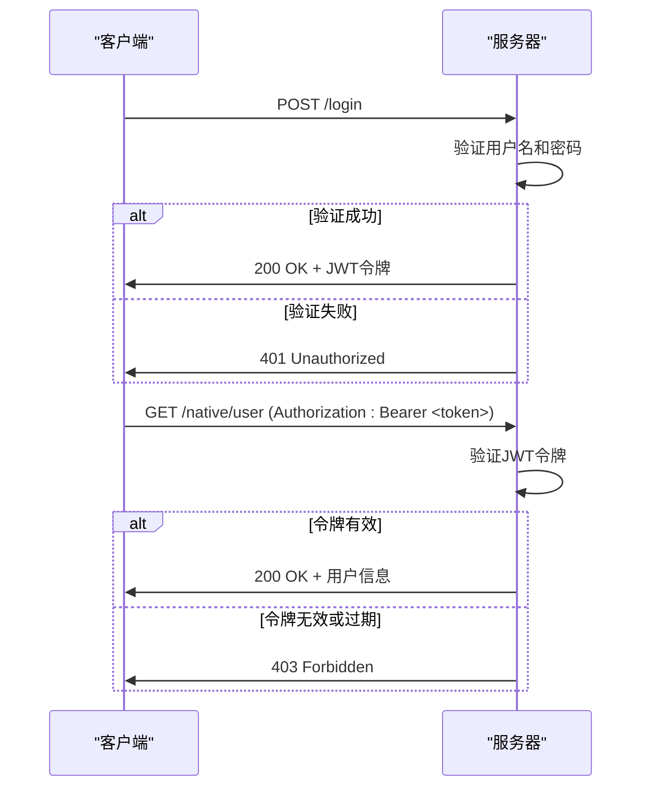
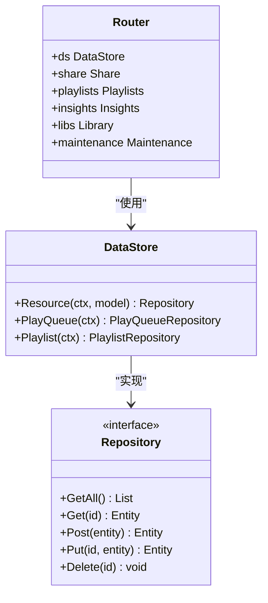
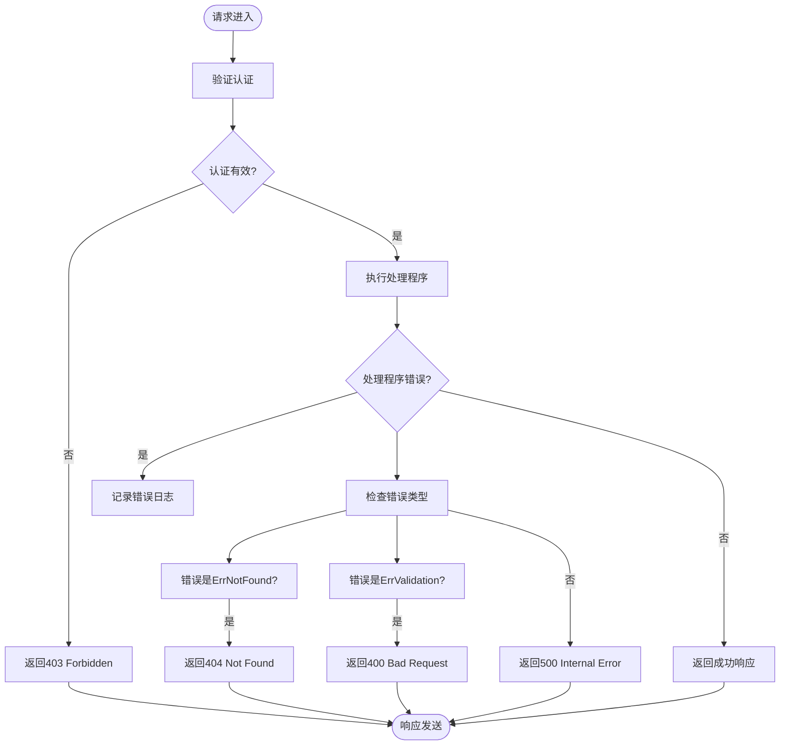

# 原生API

<cite>
**本文档中引用的文件**  
- [native_api.go](file://server/nativeapi/native_api.go)
- [library.go](file://server/nativeapi/library.go)
- [queue.go](file://server/nativeapi/queue.go)
- [playlists.go](file://server/nativeapi/playlists.go)
- [config.go](file://server/nativeapi/config.go)
- [missing.go](file://server/nativeapi/missing.go)
- [translations.go](file://server/nativeapi/translations.go)
- [inspect.go](file://server/nativeapi/inspect.go)
- [auth.go](file://server/auth.go)
- [user.go](file://model/user.go)
- [playqueue.go](file://model/playqueue.go)
- [playlist.go](file://model/playlist.go)
</cite>

## 目录
1. [简介](#简介)
2. [认证与授权机制](#认证与授权机制)
3. [核心端点](#核心端点)
4. [库管理端点](#库管理端点)
5. [播放队列端点](#播放队列端点)
6. [播放列表端点](#播放列表端点)
7. [系统配置与诊断端点](#系统配置与诊断端点)
8. [客户端最佳实践](#客户端最佳实践)
9. [错误处理策略](#错误处理策略)

## 简介

Navidrome的原生API提供了一套与Subsonic协议无关的HTTP端点，用于访问和管理音乐库的核心功能。这些端点专为Navidrome的Web UI和现代客户端设计，提供了对播放队列、用户库关联、系统配置和诊断工具的直接访问。本API基于RESTful原则构建，使用JSON作为数据交换格式，并通过JWT令牌进行安全认证。

**Section sources**
- [native_api.go](file://server/nativeapi/native_api.go#L1-L248)

## 认证与授权机制

原生API使用JSON Web Token (JWT)进行用户认证。客户端首先需要通过`/login`端点进行身份验证，成功后将收到一个包含用户信息和JWT令牌的响应。



**Diagram sources**
- [auth.go](file://server/auth.go#L36-L69)
- [user.go](file://model/user.go#L7-L28)

### 认证流程

1. **登录请求**：客户端向`/login`端点发送包含`username`和`password`的JSON请求体。
2. **令牌生成**：服务器验证凭据后，使用`auth.CreateToken`函数生成JWT令牌。
3. **令牌刷新**：在每次请求时，`JWTRefresher`中间件会自动刷新令牌的有效期。
4. **管理员权限**：某些端点（如`/config`和`/inspect`）需要管理员权限，由`adminOnlyMiddleware`中间件强制执行。

**Section sources**
- [auth.go](file://server/auth.go#L36-L200)
- [native_api.go](file://server/nativeapi/native_api.go#L46-L77)

## 核心端点

原生API的核心端点遵循统一的RESTful模式，为各种资源提供标准的CRUD操作。



**Diagram sources**
- [native_api.go](file://server/nativeapi/native_api.go#L23-L37)
- [model.go](file://model/model.go)

### 通用CRUD操作

大多数资源端点都支持以下HTTP方法：

- **GET /resource**：获取资源列表
- **GET /resource/{id}**：获取单个资源
- **POST /resource**：创建新资源
- **PUT /resource/{id}**：更新现有资源
- **DELETE /resource/{id}**：删除资源

这些操作由`R`和`RX`方法在`native_api.go`中统一注册，确保了一致的API行为。

**Section sources**
- [native_api.go](file://server/nativeapi/native_api.go#L82-L104)

## 库管理端点

库管理端点允许管理员管理用户与音乐库的关联关系。

### 获取用户库关联

获取指定用户的库访问权限。

**HTTP方法**: `GET`  
**URL模式**: `/user/{id}/library`  
**认证**: 需要管理员权限  
**响应模式**:
```json
{
  "id": "user_libraries",
  "libraries": [
    {
      "id": 1,
      "name": "Main Library",
      "path": "/music/main"
    }
  ]
}
```

### 设置用户库关联

为指定用户设置库访问权限。

**HTTP方法**: `PUT`  
**URL模式**: `/user/{id}/library`  
**认证**: 需要管理员权限  
**请求体结构**:
```json
{
  "libraryIds": [1, 2]
}
```
**响应模式**: 返回更新后的用户库列表（同GET响应）

**Section sources**
- [library.go](file://server/nativeapi/library.go#L16-L102)

## 播放队列端点

播放队列端点提供对用户当前播放状态的完整控制。

### 获取播放队列

获取当前用户的播放队列。

**HTTP方法**: `GET`  
**URL模式**: `/queue`  
**认证**: 需要用户认证  
**响应模式**:
```json
{
  "userId": "user_123",
  "current": 0,
  "position": 30000,
  "changedBy": "web",
  "items": [
    {
      "id": "track_1",
      "title": "Song One",
      "artist": "Artist A"
    },
    {
      "id": "track_2",
      "title": "Song Two",
      "artist": "Artist B"
    }
  ]
}
```

### 保存播放队列

完全替换当前播放队列。

**HTTP方法**: `POST`  
**URL模式**: `/queue`  
**认证**: 需要用户认证  
**请求体结构**:
```json
{
  "ids": ["track_1", "track_2"],
  "current": 0,
  "position": 0
}
```
**状态码**: `204 No Content`

### 更新播放队列

部分更新播放队列的状态。

**HTTP方法**: `PUT`  
**URL模式**: `/queue`  
**认证**: 需要用户认证  
**请求体结构**:
```json
{
  "ids": ["track_1", "track_2"],
  "current": 1,
  "position": 45000
}
```
**状态码**: `204 No Content`

### 清空播放队列

清空当前用户的播放队列。

**HTTP方法**: `DELETE`  
**URL模式**: `/queue`  
**认证**: 需要用户认证  
**状态码**: `204 No Content`

**Section sources**
- [queue.go](file://server/nativeapi/queue.go#L69-L215)

## 播放列表端点

播放列表端点提供对播放列表及其曲目的管理功能。

### 播放列表曲目管理

#### 获取播放列表曲目

**HTTP方法**: `GET`  
**URL模式**: `/playlist/{playlistId}/tracks`  
**认证**: 需要用户认证  
**响应模式**: 返回`PlaylistTracks`数组

#### 添加曲目到播放列表

**HTTP方法**: `POST`  
**URL模式**: `/playlist/{playlistId}/tracks`  
**认证**: 需要用户认证  
**请求体结构**:
```json
{
  "ids": ["track_1", "track_2"],
  "albumIds": ["album_1"],
  "artistIds": ["artist_1"]
}
```
**响应模式**: `{"added": 5}`

#### 从播放列表删除曲目

**HTTP方法**: `DELETE`  
**URL模式**: `/playlist/{playlistId}/tracks`  
**认证**: 需要用户认证  
**查询参数**: `id=track_1&id=track_2`  
**状态码**: `200 OK` 或 `204 No Content`

#### 重新排序播放列表曲目

**HTTP方法**: `PUT`  
**URL模式**: `/playlist/{playlistId}/tracks/{id}`  
**认证**: 需要用户认证  
**请求体结构**:
```json
{
  "insert_before": "2"
}
```
**状态码**: `200 OK`

### 获取歌曲所属播放列表

获取指定歌曲所在的播放列表。

**HTTP方法**: `GET`  
**URL模式**: `/song/{id}/playlists`  
**认证**: 需要用户认证  
**响应模式**: 返回`Playlists`数组

**Section sources**
- [playlists.go](file://server/nativeapi/playlists.go#L22-L245)

## 系统配置与诊断端点

这些端点提供系统级的配置访问和诊断功能。

### 系统配置

获取服务器配置（仅限开发模式）。

**HTTP方法**: `GET`  
**URL模式**: `/config/*`  
**认证**: 需要管理员权限和`DevUIShowConfig`启用  
**响应模式**:
```json
{
  "id": "config",
  "configFile": "/config/config.ini",
  "config": {
    "Address": "0.0.0.0",
    "Port": 4533,
    "LastFM": {
      "ApiKey": "s*********3",
      "Secret": "s*********t"
    }
  }
}
```

### 诊断工具

检查媒体文件的元数据。

**HTTP方法**: `GET`  
**URL模式**: `/inspect`  
**认证**: 需要管理员权限和`Inspect.Enabled`启用  
**查询参数**: `id=track_123`  
**响应模式**: 返回`InspectOutput`对象

### 缺失文件管理

管理标记为缺失的文件。

**HTTP方法**: `GET`  
**URL模式**: `/missing`  
**认证**: 需要用户认证  
**响应模式**: 返回缺失的`MediaFile`列表

**HTTP方法**: `DELETE`  
**URL模式**: `/missing`  
**认证**: 需要用户认证  
**查询参数**: `id=file_1&id=file_2`（可选，删除所有缺失文件）  
**状态码**: `200 OK` 或 `204 No Content`

### 翻译资源

获取可用的翻译资源。

**HTTP方法**: `GET`  
**URL模式**: `/translation`  
**认证**: 不需要认证  
**响应模式**: 返回翻译ID和名称的列表

**Section sources**
- [config.go](file://server/nativeapi/config.go#L1-L133)
- [inspect.go](file://server/nativeapi/inspect.go#L1-L68)
- [missing.go](file://server/nativeapi/missing.go#L1-L95)
- [translations.go](file://server/nativeapi/translations.go#L1-L124)

## 客户端最佳实践

### 认证处理

客户端应妥善管理JWT令牌的生命周期：

1. 在登录成功后存储令牌
2. 在每次请求的`Authorization`头中包含令牌
3. 处理403状态码，可能需要重新登录
4. 利用自动令牌刷新机制减少重新认证

### 播放队列同步

当多个客户端同时控制播放队列时，应遵循以下最佳实践：

- 使用`PUT /queue`进行完全同步
- 使用`POST /queue`进行快速保存
- 使用`PUT /queue`的部分更新功能来更新播放位置
- 定期轮询`GET /queue`以获取最新状态

### 错误处理

客户端应实现健壮的错误处理机制：

- 重试临时性错误（5xx状态码）
- 向用户显示有意义的错误消息
- 记录错误日志用于调试
- 实现优雅的降级体验

## 错误处理策略

服务器端实现了分层的错误处理策略：



**Diagram sources**
- [native_api.go](file://server/nativeapi/native_api.go)
- [queue.go](file://server/nativeapi/queue.go)
- [playlists.go](file://server/nativeapi/playlists.go)

服务器使用`log.Error`记录所有内部错误，并根据错误类型返回适当的HTTP状态码。客户端应根据状态码采取相应的恢复措施。

**Section sources**
- [queue.go](file://server/nativeapi/queue.go#L75-L78)
- [playlists.go](file://server/nativeapi/playlists.go#L91-L98)
- [missing.go](file://server/nativeapi/missing.go#L80-L88)