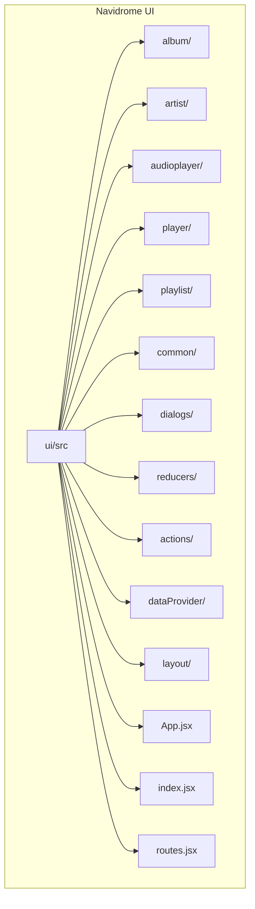
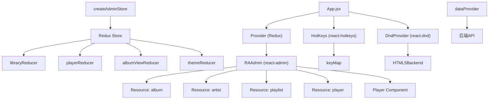
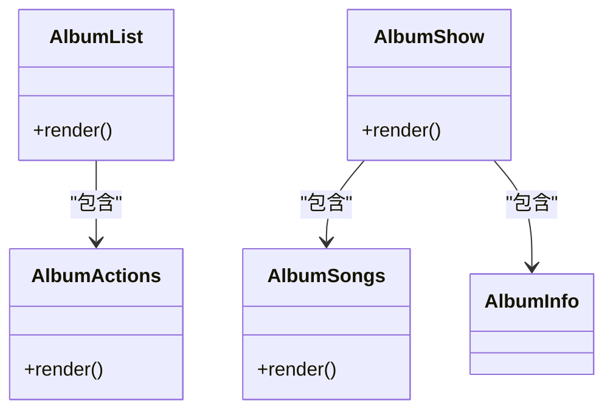
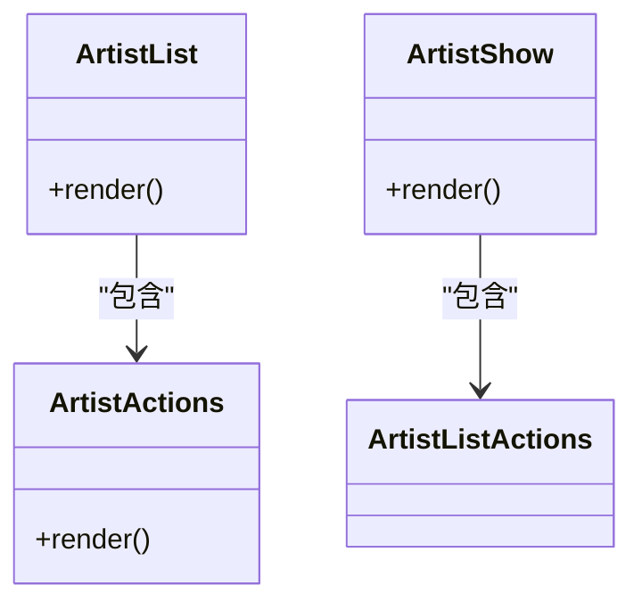
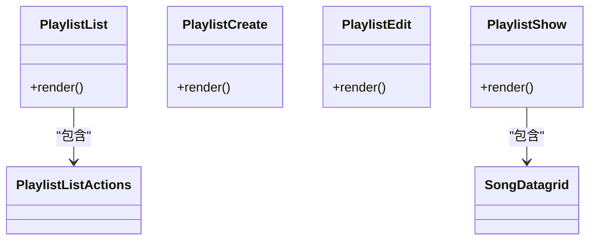
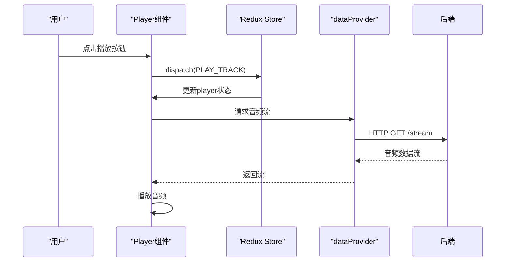
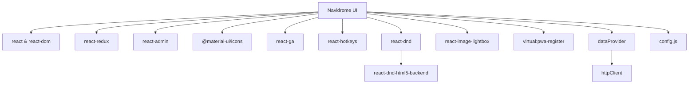

# UI组件结构

<cite>
**本文档中引用的文件**
- [App.jsx](file://ui/src/App.jsx)
- [routes.jsx](file://ui/src/routes.jsx)
- [index.jsx](file://ui/src/index.jsx)
- [album/index.jsx](file://ui/src/album/index.jsx)
- [artist/index.jsx](file://ui/src/artist/index.jsx)
- [playlist/index.jsx](file://ui/src/playlist/index.jsx)
- [audioplayer/index.js](file://ui/src/audioplayer/index.js)
- [layout/index.js](file://ui/src/layout/index.js)
- [reducers/index.js](file://ui/src/reducers/index.js)
- [actions/index.js](file://ui/src/actions/index.js)
- [dataProvider/index.js](file://ui/src/dataProvider/index.js)
- [authProvider.js](file://ui/src/authProvider.js)
- [config.js](file://ui/src/config.js)
- [hotkeys.js](file://ui/src/hotkeys.js)
- [store/createAdminStore](file://ui/src/store/createAdminStore)
- [i18n/index.js](file://ui/src/i18n/index.js)
</cite>

## 目录
1. [简介](#简介)
2. [项目结构](#项目结构)
3. [核心组件](#核心组件)
4. [架构概述](#架构概述)
5. [详细组件分析](#详细组件分析)
6. [依赖分析](#依赖分析)
7. [性能考虑](#性能考虑)
8. [故障排除指南](#故障排除指南)
9. [结论](#结论)

## 简介
Navidrome 是一个基于 Web 的音乐服务器和流媒体应用，其用户界面采用 React 构建。本文档深入分析 Navidrome 的 UI 组件结构，重点介绍专辑视图、艺术家列表、播放器、播放列表等核心组件的设计与实现。文档详细说明各组件的 props、状态管理机制和生命周期，解释组件间的通信模式和数据流，并提供组件复用的最佳实践和自定义组件开发指南。通过分析 `ui/src/album`、`ui/src/artist` 等目录的实际代码，本文旨在为开发者提供一个全面的参考，以解决常见组件开发问题并提供性能优化建议。

## 项目结构
Navidrome 的前端代码位于 `ui` 目录下，遵循典型的 React 应用结构。`src` 目录是前端代码的核心，其中包含按功能划分的组件模块。主要的组件模块包括 `album`（专辑）、`artist`（艺术家）、`player`（播放器）、`playlist`（播放列表）、`audioplayer`（音频播放器）等。此外，还有 `common`（通用组件）、`dialogs`（对话框）、`reducers`（状态管理）、`actions`（动作）等支持性模块。应用的入口文件是 `index.jsx`，它通过 `App.jsx` 启动整个 React 应用。

**Diagram sources**
- [App.jsx](file://ui/src/App.jsx)
- [index.jsx](file://ui/src/index.jsx)

**Section sources**
- [App.jsx](file://ui/src/App.jsx)
- [index.jsx](file://ui/src/index.jsx)
- [routes.jsx](file://ui/src/routes.jsx)

## 核心组件
Navidrome 的 UI 核心由多个功能模块组成，每个模块都封装了特定的业务逻辑和用户交互。`album` 模块负责专辑的展示和管理，`artist` 模块处理艺术家信息的呈现，`playlist` 模块管理播放列表的创建和编辑，而 `audioplayer` 模块则提供了核心的音频播放功能。这些模块通过 `App.jsx` 中的 `Resource` 组件进行注册和集成，形成一个统一的应用界面。状态管理通过 Redux 实现，`reducers` 和 `actions` 目录分别定义了状态的更新逻辑和触发这些更新的动作。

**Section sources**
- [App.jsx](file://ui/src/App.jsx)
- [reducers/index.js](file://ui/src/reducers/index.js)
- [actions/index.js](file://ui/src/actions/index.js)

## 架构概述
Navidrome 的前端架构基于 React 和 Redux，采用模块化设计。应用的顶层是 `App` 组件，它使用 `react-redux` 的 `Provider` 将 Redux store 注入到整个组件树中。UI 的路由和布局由 `react-admin` 框架驱动，通过 `RAAdmin` 组件和 `Resource` 定义来组织不同的功能页面。数据获取通过自定义的 `dataProvider` 实现，它封装了与后端 API 的通信。状态管理使用 Redux，`createAdminStore` 函数创建了包含多个自定义 reducer 的 store。用户交互（如快捷键）通过 `react-hotkeys` 箉理，拖拽功能由 `react-dnd` 提供支持。

**Diagram sources**
- [App.jsx](file://ui/src/App.jsx)
- [dataProvider/index.js](file://ui/src/dataProvider/index.js)
- [store/createAdminStore](file://ui/src/store/createAdminStore)

## 详细组件分析

### 专辑组件分析
`album` 模块是 Navidrome 中用于展示音乐专辑的核心组件。它主要由 `AlbumList` 和 `AlbumShow` 两个组件构成。`AlbumList` 负责以列表或网格形式展示所有专辑，而 `AlbumShow` 则在用户点击某个专辑时，显示该专辑的详细信息，包括专辑封面、歌曲列表等。该模块通过 `index.jsx` 文件导出一个对象，该对象定义了 `list` 和 `show` 属性，这符合 `react-admin` 对资源组件的约定。

#### 组件结构

**Diagram sources**
- [album/index.jsx](file://ui/src/album/index.jsx)
- [album/AlbumList.jsx](file://ui/src/album/AlbumList.jsx)
- [album/AlbumShow.jsx](file://ui/src/album/AlbumShow.jsx)

**Section sources**
- [album/index.jsx](file://ui/src/album/index.jsx)
- [album/AlbumList.jsx](file://ui/src/album/AlbumList.jsx)
- [album/AlbumShow.jsx](file://ui/src/album/AlbumShow.jsx)

### 艺术家组件分析
`artist` 模块负责艺术家信息的展示。与 `album` 模块类似，它也包含 `ArtistList` 和 `ArtistShow` 组件。`ArtistList` 以列表形式展示所有艺术家，`ArtistShow` 则展示单个艺术家的详细信息及其作品。一个显著的特点是，该模块在导出的对象中包含了 `icon` 属性，这是一个 `DynamicMenuIcon` 组件，用于在应用的侧边栏菜单中显示艺术家图标的激活和非激活状态。

#### 组件结构

**Diagram sources**
- [artist/index.jsx](file://ui/src/artist/index.jsx)
- [artist/ArtistList.jsx](file://ui/src/artist/ArtistList.jsx)
- [artist/ArtistShow.jsx](file://ui/src/artist/ArtistShow.jsx)

**Section sources**
- [artist/index.jsx](file://ui/src/artist/index.jsx)
- [artist/ArtistList.jsx](file://ui/src/artist/ArtistList.jsx)
- [artist/ArtistShow.jsx](file://ui/src/artist/ArtistShow.jsx)

### 播放列表组件分析
`playlist` 模块提供了对播放列表的完整 CRUD（创建、读取、更新、删除）操作。它导出了 `list`、`create`、`edit` 和 `show` 四个组件，分别对应播放列表的列表视图、创建表单、编辑表单和详情页。这表明 `react-admin` 框架被充分利用来快速构建管理界面。与艺术家模块一样，它也定义了侧边栏菜单图标。

#### 组件结构

**Diagram sources**
- [playlist/index.jsx](file://ui/src/playlist/index.jsx)
- [playlist/PlaylistList.jsx](file://ui/src/playlist/PlaylistList.jsx)
- [playlist/PlaylistEdit.jsx](file://ui/src/playlist/PlaylistEdit.jsx)

**Section sources**
- [playlist/index.jsx](file://ui/src/playlist/index.jsx)
- [playlist/PlaylistList.jsx](file://ui/src/playlist/PlaylistList.jsx)
- [playlist/PlaylistEdit.jsx](file://ui/src/playlist/PlaylistEdit.jsx)

### 播放器组件分析
`audioplayer` 模块是 Navidrome 的核心功能之一，负责音频的播放控制。它通过 `index.js` 文件导出 `Player` 组件。`Player` 组件是一个独立的、持续运行的组件，它被直接放置在 `RAAdmin` 的资源列表中（`<Player />`），这意味着它会在整个应用的生命周期内保持挂载，以便持续播放音乐，不受页面切换的影响。它可能通过 Redux store 与应用的其他部分（如 `playerReducer`）进行状态同步。

#### 数据流

**Diagram sources**
- [audioplayer/index.js](file://ui/src/audioplayer/index.js)
- [App.jsx](file://ui/src/App.jsx)
- [playerReducer](file://ui/src/reducers/playerReducer)

**Section sources**
- [audioplayer/index.js](file://ui/src/audioplayer/index.js)
- [App.jsx](file://ui/src/App.jsx)

## 依赖分析
Navidrome 的 UI 组件之间存在清晰的依赖关系。核心依赖包括 `react`、`react-dom` 用于构建 UI，`react-redux` 用于状态管理，`react-admin` 作为基础框架提供路由、布局和数据管理。UI 组件库使用 `@material-ui/icons` 提供图标。功能性的依赖包括 `react-ga` 用于 Google Analytics，`react-hotkeys` 用于快捷键，`react-dnd` 及其 `HTML5Backend` 用于拖拽功能，`react-image-lightbox` 用于图片查看（需要 `window.global` 修复）。数据获取依赖于自定义的 `httpClient` 和 `wrapperDataProvider`。整个应用的配置通过 `config.js` 集中管理。

**Diagram sources**
- [package.json](file://ui/package.json)
- [App.jsx](file://ui/src/App.jsx)
- [config.js](file://ui/src/config.js)
- [dataProvider/index.js](file://ui/src/dataProvider/index.js)

**Section sources**
- [App.jsx](file://ui/src/App.jsx)
- [config.js](file://ui/src/config.js)
- [dataProvider/index.js](file://ui/src/dataProvider/index.js)

## 性能考虑
Navidrome 的前端性能优化体现在多个方面。首先，使用 `react-admin` 框架可以减少重复的 CRUD 代码，提高开发效率。其次，通过 Redux 进行集中状态管理，避免了深层组件树中的 props 逐层传递，减少了不必要的重渲染。`useChangeThemeColor` 等自定义 Hook 的使用，有助于逻辑复用和组件解耦。PWA（Progressive Web App）的支持通过 `virtual:pwa-register` 实现，可以缓存资源，提供离线访问和更快的加载速度。对于大型列表（如专辑或艺术家列表），`react-admin` 内置的分页和虚拟滚动机制可以有效管理渲染性能。然而，持续挂载的 `Player` 组件需要确保其自身的性能，避免成为性能瓶颈。

## 故障排除指南
在开发或使用 Navidrome UI 时，可能会遇到一些常见问题：
- **组件不显示**：检查 `App.jsx` 中的 `Resource` 定义是否正确，确保组件路径无误，并且权限设置（如 `permissions === 'admin'`）符合当前用户角色。
- **状态未更新**：检查 Redux 的 action type 是否正确，reducer 是否处理了该 action，并确认组件是否通过 `connect` 或 `useSelector` 正确地订阅了 store 的状态。
- **数据获取失败**：检查 `dataProvider` 的实现，确保 `httpClient` 能够正确地与后端通信，查看浏览器开发者工具的网络面板是否有错误请求。
- **图标不显示**：确保 `@material-ui/icons` 已正确安装，并且在 `artist`、`playlist` 等模块的 `index.jsx` 文件中正确导入和使用了图标组件。
- **拖拽功能失效**：确认 `DndProvider` 已在组件树的顶层正确包裹，并且 `HTML5Backend` 已作为 backend 传入。
- **全局变量错误**：如 `global is not defined` 错误，已在 `index.jsx` 中通过 `window.global = window` 修复，确保此代码在应用启动时执行。

**Section sources**
- [App.jsx](file://ui/src/App.jsx)
- [index.jsx](file://ui/src/index.jsx)
- [reducers/index.js](file://ui/src/reducers/index.js)
- [dataProvider/index.js](file://ui/src/dataProvider/index.js)

## 结论
Navidrome 的 UI 组件结构设计良好，采用了模块化、组件化的现代前端开发模式。通过 `react-admin` 框架，它高效地构建了一个功能丰富的管理界面。基于 Redux 的状态管理确保了应用状态的一致性和可预测性。各核心组件（专辑、艺术家、播放列表、播放器）职责清晰，通过标准化的接口（如 `index.jsx` 的导出格式）与框架集成。开发者在进行二次开发或自定义时，应遵循现有模式，利用已有的 `common` 组件和 `actions/reducers` 机制，以保持代码的一致性和可维护性。关注性能优化，特别是对于大型数据集的渲染和持续运行的播放器组件，是提升用户体验的关键。