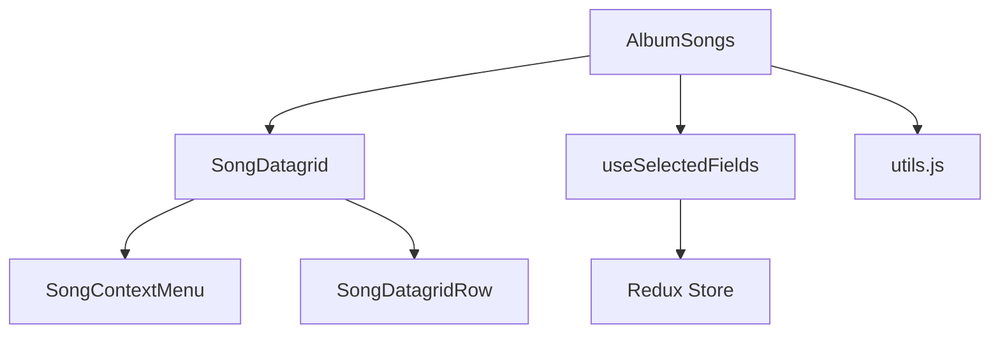
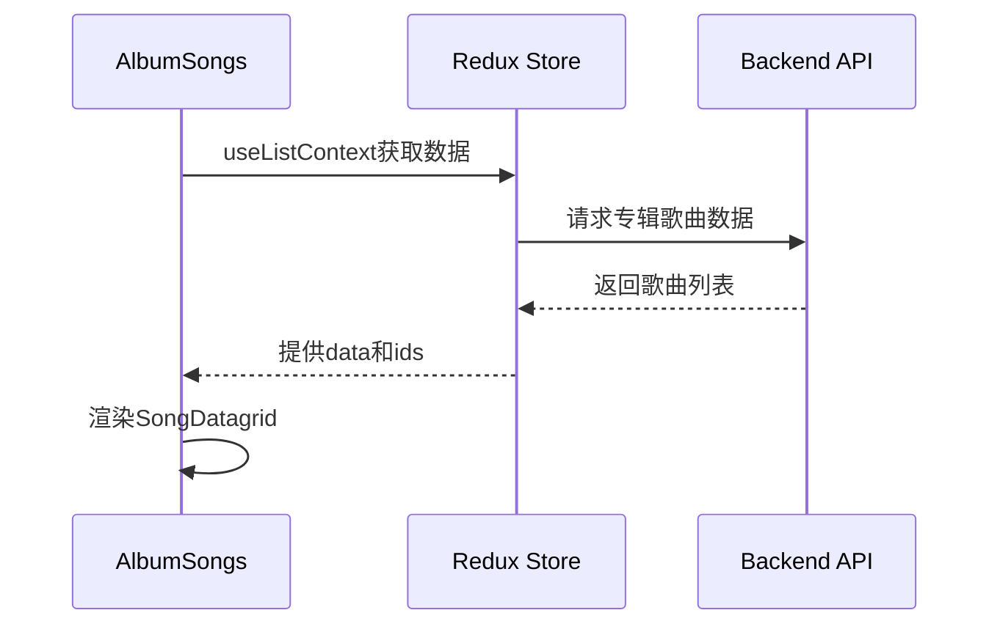
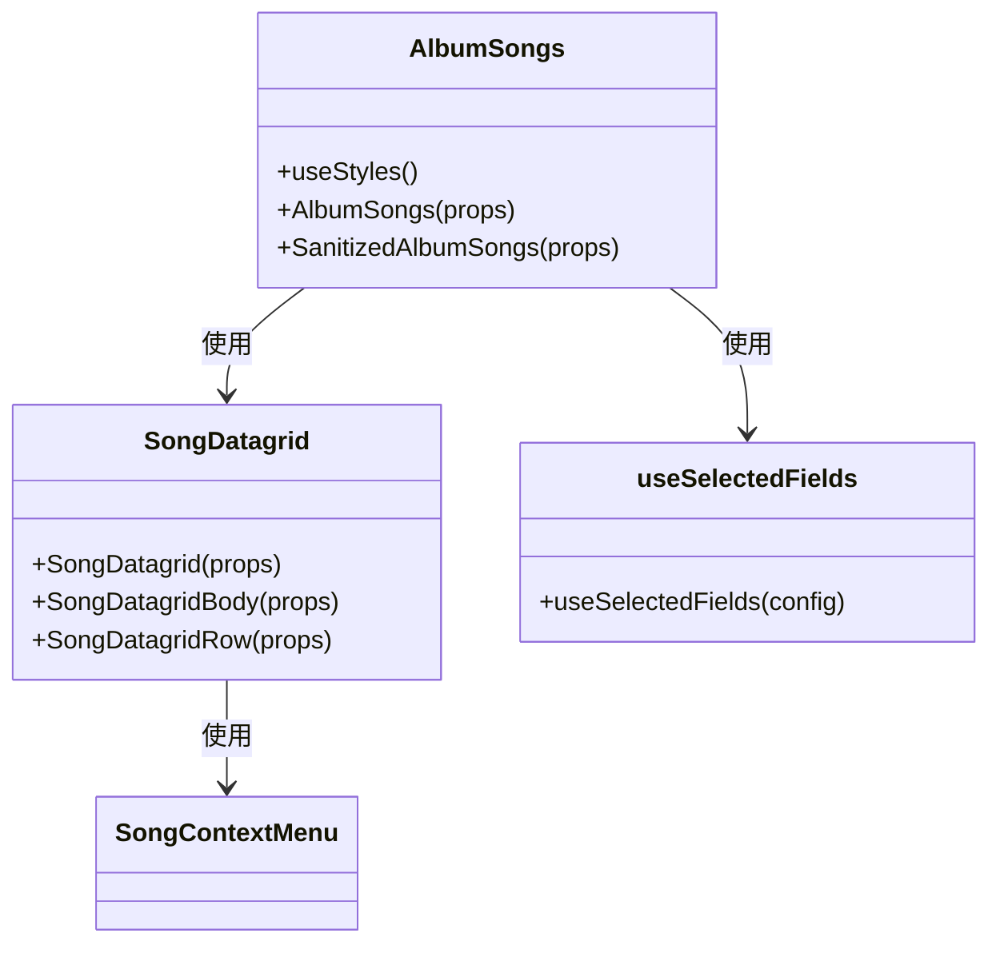
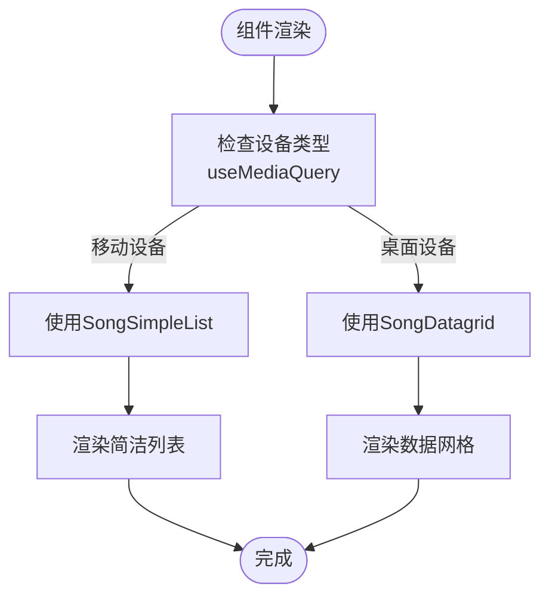
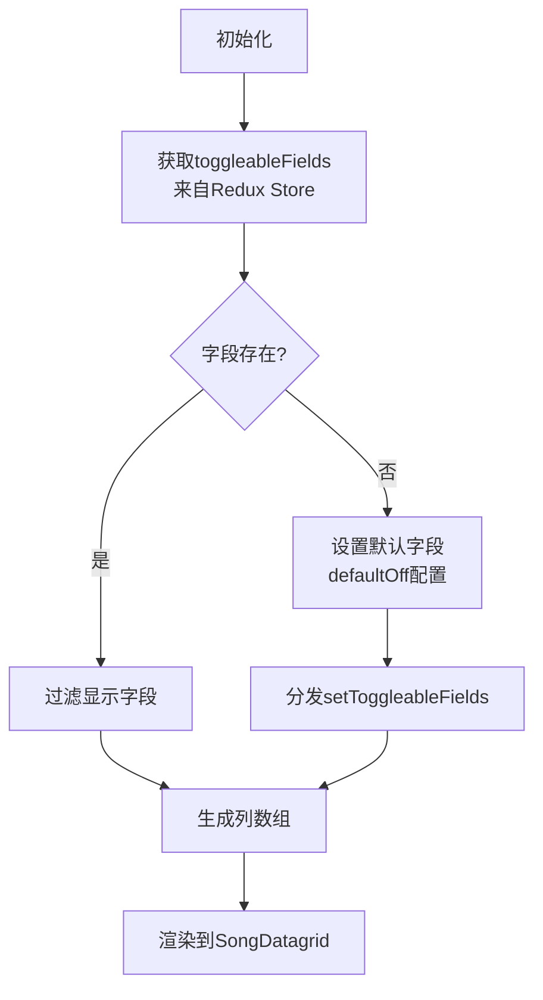
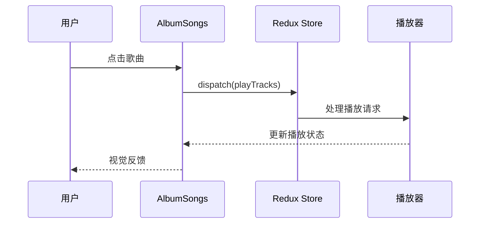

# 专辑歌曲列表

<cite>
**本文档引用的文件**
- [AlbumSongs.jsx](file://ui/src/album/AlbumSongs.jsx)
- [SongDatagrid.jsx](file://ui/src/common/SongDatagrid.jsx)
- [SongSimpleList.jsx](file://ui/src/common/SongSimpleList.jsx)
- [useSelectedFields.jsx](file://ui/src/common/useSelectedFields.jsx)
- [utils.js](file://ui/src/album/utils.js)
</cite>

## 目录
1. [简介](#简介)
2. [项目结构](#项目结构)
3. [核心组件](#核心组件)
4. [架构概述](#架构概述)
5. [详细组件分析](#详细组件分析)
6. [依赖分析](#依赖分析)
7. [性能考虑](#性能考虑)
8. [故障排除指南](#故障排除指南)
9. [结论](#结论)

## 简介
本文档深入分析Navidrome音乐服务器中专辑歌曲列表的实现。重点介绍AlbumSongs组件的渲染逻辑、排序机制和交互功能，包括播放、添加到队列和批量操作等。文档详细说明组件状态管理，涵盖歌曲数据获取、加载状态和错误处理。同时解释与公共歌曲组件（SongDatagrid, SongSimpleList）的集成方式和自定义配置，提供歌曲列表数据更新的完整流程示例。

## 项目结构
专辑歌曲列表功能主要位于UI层的album目录中，通过React Admin框架实现数据展示和交互。组件采用模块化设计，将通用功能提取到common目录中供多个视图复用。



**图表来源**
- [AlbumSongs.jsx](file://ui/src/album/AlbumSongs.jsx)
- [SongDatagrid.jsx](file://ui/src/common/SongDatagrid.jsx)
- [useSelectedFields.jsx](file://ui/src/common/useSelectedFields.jsx)

**章节来源**
- [AlbumSongs.jsx](file://ui/src/album/AlbumSongs.jsx)
- [ui](file://ui)

## 核心组件
AlbumSongs组件是专辑视图的核心，负责渲染专辑中的所有歌曲。它通过SanitizedAlbumSongs包装器处理数据预处理，然后使用SongDatagrid展示歌曲列表。组件支持响应式设计，在桌面和移动设备上呈现不同的UI布局。

**章节来源**
- [AlbumSongs.jsx](file://ui/src/album/AlbumSongs.jsx)

## 架构概述
专辑歌曲列表采用React Admin的List组件架构，通过自定义Datagrid实现复杂的歌曲展示需求。数据流从服务器获取专辑信息，经过Redux状态管理，最终渲染到SongDatagrid中。



**图表来源**
- [AlbumSongs.jsx](file://ui/src/album/AlbumSongs.jsx)
- [SongDatagrid.jsx](file://ui/src/common/SongDatagrid.jsx)

## 详细组件分析

### AlbumSongs组件分析
AlbumSongs组件实现了专辑歌曲列表的主要功能，包括数据渲染、交互处理和状态管理。

#### 组件实现


**图表来源**
- [AlbumSongs.jsx](file://ui/src/album/AlbumSongs.jsx)
- [SongDatagrid.jsx](file://ui/src/common/SongDatagrid.jsx)
- [useSelectedFields.jsx](file://ui/src/common/useSelectedFields.jsx)

**章节来源**
- [AlbumSongs.jsx](file://ui/src/album/AlbumSongs.jsx)

### 歌曲列表渲染机制
专辑歌曲列表根据设备类型选择不同的渲染方式：在小屏幕设备上使用SongSimpleList，在桌面设备上使用SongDatagrid。这种响应式设计优化了不同设备的用户体验。



**图表来源**
- [AlbumSongs.jsx](file://ui/src/album/AlbumSongs.jsx)
- [SongSimpleList.jsx](file://ui/src/common/SongSimpleList.jsx)

### 排序与筛选机制
专辑歌曲列表的排序由后端控制，按照专辑中歌曲的磁盘顺序排列。前端通过useSelectedFields钩子管理可切换的列显示，允许用户自定义视图。



**图表来源**
- [useSelectedFields.jsx](file://ui/src/common/useSelectedFields.jsx)
- [AlbumSongs.jsx](file://ui/src/album/AlbumSongs.jsx)

### 交互功能实现
#### 播放功能
点击歌曲行会触发playTracks动作，将歌曲添加到播放队列并开始播放。该功能通过dispatch Redux action实现。

#### 批量操作
支持多选歌曲进行批量操作，如播放、添加到播放列表等。通过SongBulkActions组件实现，集成在BulkActionsToolbar中。



**图表来源**
- [AlbumSongs.jsx](file://ui/src/album/AlbumSongs.jsx)
- [SongBulkActions.jsx](file://ui/src/common/SongBulkActions.jsx)

**章节来源**
- [AlbumSongs.jsx](file://ui/src/album/AlbumSongs.jsx)
- [SongBulkActions.jsx](file://ui/src/common/SongBulkActions.jsx)

## 依赖分析
专辑歌曲列表组件依赖多个核心模块和第三方库，形成清晰的依赖关系。

```mermaid
graph LR
A[AlbumSongs] --> B[react-admin]
A --> C[react-redux]
A --> D[@material-ui]
A --> E[SongDatagrid]
E --> F[SongContextMenu]
A --> G[useSelectedFields]
G --> H[Redux Store]
A --> I[utils.js]
```

**图表来源**
- [AlbumSongs.jsx](file://ui/src/album/AlbumSongs.jsx)
- [SongDatagrid.jsx](file://ui/src/common/SongDatagrid.jsx)
- [useSelectedFields.jsx](file://ui/src/common/useSelectedFields.jsx)

**章节来源**
- [AlbumSongs.jsx](file://ui/src/album/AlbumSongs.jsx)
- [package.json](file://ui/package.json)

## 性能考虑
对于长歌曲列表，Navidrome采用虚拟滚动和数据分页来优化性能。SongDatagrid组件通过PureDatagridBody和PureDatagridRow实现性能优化，避免不必要的重渲染。

在移动设备上，使用SongSimpleList减少DOM元素数量，提高滚动流畅度。数据获取采用懒加载策略，只在需要时请求数据，减少初始加载时间。

**章节来源**
- [SongDatagrid.jsx](file://ui/src/common/SongDatagrid.jsx)
- [SongSimpleList.jsx](file://ui/src/common/SongSimpleList.jsx)

## 故障排除指南
### 常见问题
1. **歌曲列表为空**：检查专辑数据是否正确加载，确认后端API返回了正确的歌曲数据。
2. **播放功能失效**：验证playTracks action是否正确dispatch，检查播放器状态。
3. **列显示异常**：检查Redux store中的toggleableFields配置，确认useSelectedFields钩子正常工作。

### 调试建议
使用浏览器开发者工具检查Redux状态，特别是settings.toggleableFields和settings.omittedFields。监控网络请求，确保专辑歌曲数据正确获取。

**章节来源**
- [AlbumSongs.jsx](file://ui/src/album/AlbumSongs.jsx)
- [useSelectedFields.jsx](file://ui/src/common/useSelectedFields.jsx)

## 结论
Navidrome的专辑歌曲列表通过模块化设计和React Admin框架实现了功能丰富且性能优良的用户界面。组件间的清晰分离和合理的状态管理使得功能扩展和维护更加容易。响应式设计确保了在不同设备上都能提供良好的用户体验。