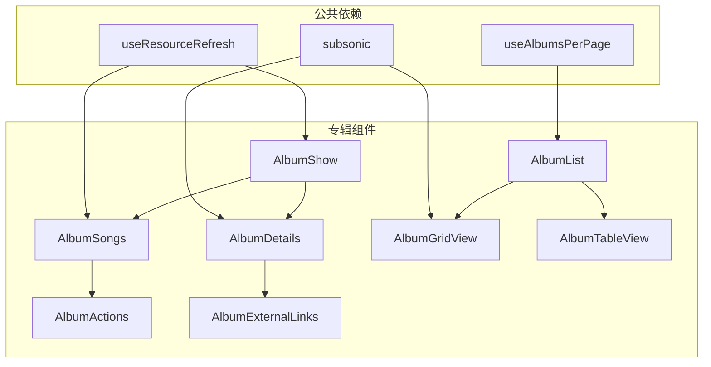
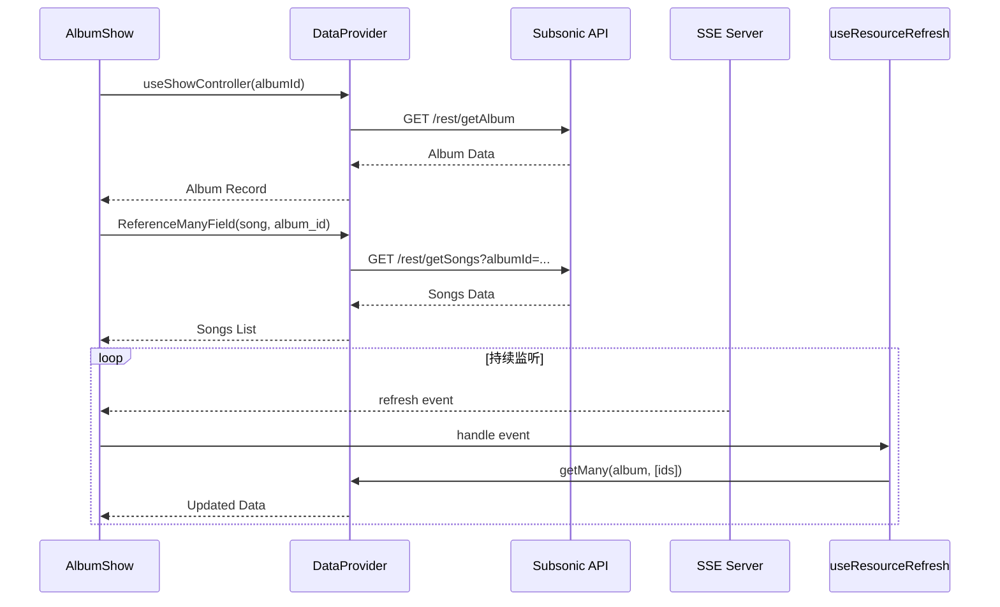
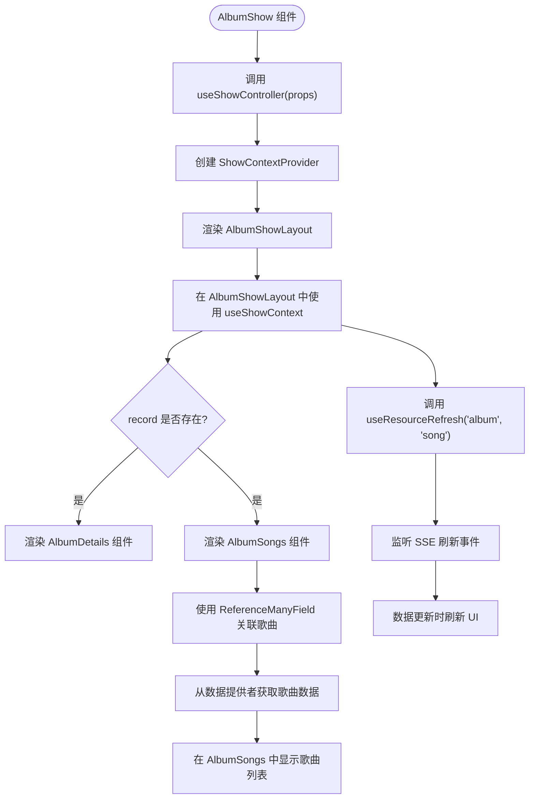
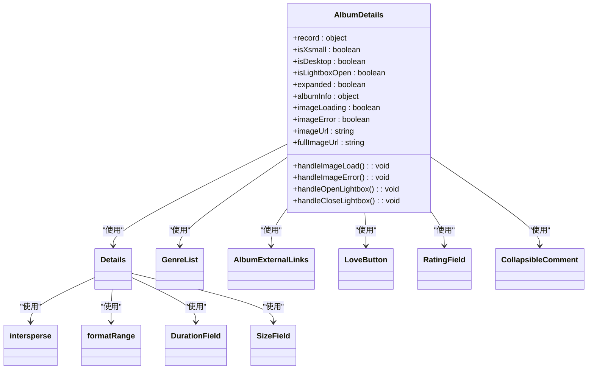
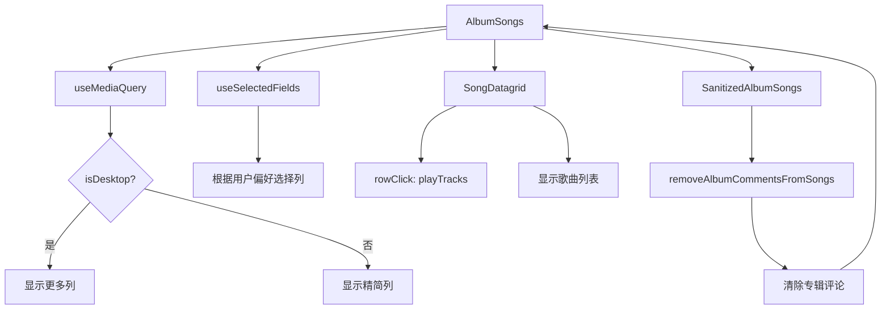
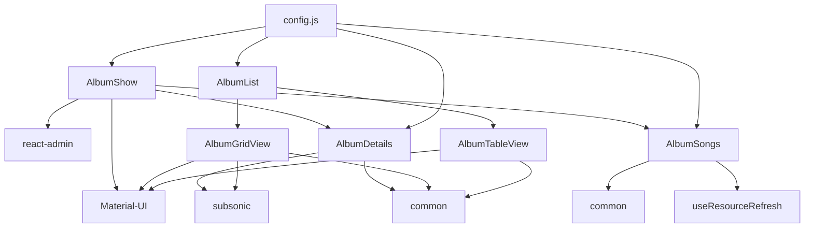

# 专辑组件

<cite>
**本文档中引用的文件**  
- [AlbumShow.jsx](file://ui/src/album/AlbumShow.jsx)
- [AlbumDetails.jsx](file://ui/src/album/AlbumDetails.jsx)
- [AlbumSongs.jsx](file://ui/src/album/AlbumSongs.jsx)
- [AlbumGridView.jsx](file://ui/src/album/AlbumGridView.jsx)
- [AlbumTableView.jsx](file://ui/src/album/AlbumTableView.jsx)
- [AlbumList.jsx](file://ui/src/album/AlbumList.jsx)
- [AlbumInfo.jsx](file://ui/src/album/AlbumInfo.jsx)
- [AlbumActions.jsx](file://ui/src/album/AlbumActions.jsx)
- [utils.js](file://ui/src/album/utils.js)
- [config.js](file://ui/src/config.js)
- [subsonic/index.js](file://ui/src/subsonic/index.js)
- [useResourceRefresh.jsx](file://ui/src/common/useResourceRefresh.jsx)
- [useAlbumsPerPage.jsx](file://ui/src/common/useAlbumsPerPage.jsx)
</cite>

## 目录
1. [简介](#简介)
2. [项目结构](#项目结构)
3. [核心组件](#核心组件)
4. [架构概述](#架构概述)
5. [详细组件分析](#详细组件分析)
6. [依赖分析](#依赖分析)
7. [性能考虑](#性能考虑)
8. [故障排除指南](#故障排除指南)
9. [结论](#结论)

## 简介
Navidrome 是一个开源的音乐服务器和流媒体解决方案，提供类似 Subsonic 的功能。本文档重点介绍其专辑组件的实现，包括 `AlbumShow`、`AlbumDetails`、`AlbumSongs` 等关键组件。这些组件共同负责专辑信息的展示、歌曲列表的渲染以及视图的切换。系统采用 React 和 Material-UI 构建用户界面，通过 react-admin 框架管理数据流和状态。专辑数据通过 Subsonic API 从后端获取，并利用 SSE（Server-Sent Events）实现数据的实时更新。组件设计遵循响应式原则，支持网格视图和表格视图的切换，以适应不同设备的显示需求。

## 项目结构
专辑相关的 UI 组件主要位于 `ui/src/album` 目录下。该目录包含了展示专辑信息、歌曲列表和操作控件的所有 React 组件。`AlbumShow` 是专辑页面的主入口，它组合了 `AlbumDetails` 和 `AlbumSongs` 组件。`AlbumDetails` 负责显示专辑的元数据和封面，而 `AlbumSongs` 则渲染该专辑下的所有歌曲列表。视图的切换逻辑由 `AlbumList` 组件管理，它根据用户偏好和屏幕尺寸决定使用 `AlbumGridView` 还是 `AlbumTableView`。此外，`utils.js` 文件包含了一些辅助函数，如清除专辑评论等。整个专辑模块与 `common` 目录下的公共组件和 `subsonic` 目录下的 API 客户端紧密协作。



**图示来源**
- [AlbumShow.jsx](file://ui/src/album/AlbumShow.jsx)
- [AlbumDetails.jsx](file://ui/src/album/AlbumDetails.jsx)
- [AlbumSongs.jsx](file://ui/src/album/AlbumSongs.jsx)
- [AlbumList.jsx](file://ui/src/album/AlbumList.jsx)
- [AlbumGridView.jsx](file://ui/src/album/AlbumGridView.jsx)
- [AlbumTableView.jsx](file://ui/src/album/AlbumTableView.jsx)
- [useResourceRefresh.jsx](file://ui/src/common/useResourceRefresh.jsx)
- [useAlbumsPerPage.jsx](file://ui/src/common/useAlbumsPerPage.jsx)
- [subsonic/index.js](file://ui/src/subsonic/index.js)

**本节来源**
- [AlbumShow.jsx](file://ui/src/album/AlbumShow.jsx)
- [AlbumDetails.jsx](file://ui/src/album/AlbumDetails.jsx)
- [AlbumSongs.jsx](file://ui/src/album/AlbumSongs.jsx)
- [AlbumList.jsx](file://ui/src/album/AlbumList.jsx)
- [AlbumGridView.jsx](file://ui/src/album/AlbumGridView.jsx)
- [AlbumTableView.jsx](file://ui/src/album/AlbumTableView.jsx)

## 核心组件
专辑组件的核心由 `AlbumShow`、`AlbumDetails` 和 `AlbumSongs` 三个组件构成。`AlbumShow` 作为容器组件，负责协调和组装其他组件。它使用 `useShowController` 和 `ShowContextProvider` 来管理专辑的展示状态，并通过 `ReferenceManyField` 建立专辑与歌曲之间的数据关联。`AlbumDetails` 组件专注于展示专辑的元数据，包括封面、名称、艺术家、年份、歌曲数量等，并支持通过 Lightbox 组件查看高清封面。`AlbumSongs` 组件则利用 `SongDatagrid` 来渲染歌曲列表，支持播放、收藏、下载等批量操作。这些组件通过 props 传递数据和回调函数，实现了清晰的职责分离。

**本节来源**
- [AlbumShow.jsx](file://ui/src/album/AlbumShow.jsx)
- [AlbumDetails.jsx](file://ui/src/album/AlbumDetails.jsx)
- [AlbumSongs.jsx](file://ui/src/album/AlbumSongs.jsx)

## 架构概述
专辑组件的架构遵循 React 的组件化设计原则。`AlbumShow` 组件是专辑页面的根组件，它从数据提供者（dataProvider）获取专辑记录，并将其传递给子组件。`AlbumDetails` 组件通过 `useRecordContext` 钩子访问专辑记录，并使用 `subsonic.getCoverArtUrl` 获取封面图片。`AlbumSongs` 组件通过 `ReferenceManyField` 自动获取与当前专辑关联的所有歌曲数据。状态管理主要依赖于 React 的 `useState` 和 `useEffect` 钩子，以及 react-admin 提供的 `useListContext` 和 `useShowContext`。数据更新通过 `useResourceRefresh` 钩子监听 SSE 事件来实现，确保当专辑或歌曲数据发生变化时，UI 能够自动刷新。



**图示来源**
- [AlbumShow.jsx](file://ui/src/album/AlbumShow.jsx)
- [AlbumSongs.jsx](file://ui/src/album/AlbumSongs.jsx)
- [useResourceRefresh.jsx](file://ui/src/common/useResourceRefresh.jsx)
- [subsonic/index.js](file://ui/src/subsonic/index.js)

## 详细组件分析
本节将深入分析专辑组件中的各个关键部分，包括其 props 结构、状态管理机制和生命周期方法。

### AlbumShow 组件分析
`AlbumShow` 组件是专辑页面的入口点。它接收来自路由的 `props`，并通过 `useShowController` 初始化展示控制器。该组件的主要职责是创建一个 `ShowContextProvider`，并将控制器的值传递给其子组件 `AlbumShowLayout`。`AlbumShowLayout` 使用 `useShowContext` 来访问专辑记录，并在记录存在时渲染 `AlbumDetails` 和 `AlbumSongs` 组件。`useResourceRefresh` 钩子被用来监听专辑和歌曲资源的更新事件，确保数据的实时性。



**图示来源**
- [AlbumShow.jsx](file://ui/src/album/AlbumShow.jsx)

**本节来源**
- [AlbumShow.jsx](file://ui/src/album/AlbumShow.jsx)

### AlbumDetails 组件分析
`AlbumDetails` 组件负责展示专辑的详细信息。它使用 `useRecordContext` 来获取专辑记录，并通过 `useMediaQuery` 检测屏幕尺寸以实现响应式设计。组件内部维护了多个状态，如 `isLightboxOpen`（用于控制封面放大）、`expanded`（用于控制评论展开）和 `albumInfo`（用于存储从 `getAlbumInfo` API 获取的额外信息）。`useEffect` 钩子在组件挂载和专辑记录变化时，调用 `subsonic.getAlbumInfo` 来获取专辑的外部信息（如维基百科摘要）。封面图片的加载状态通过 `imageLoading` 和 `imageError` 状态来管理，并提供了错误处理和加载动画。



**图示来源**
- [AlbumDetails.jsx](file://ui/src/album/AlbumDetails.jsx)
- [AlbumExternalLinks.jsx](file://ui/src/album/AlbumExternalLinks.jsx)
- [common/index.js](file://ui/src/common/index.js)

**本节来源**
- [AlbumDetails.jsx](file://ui/src/album/AlbumDetails.jsx)

### AlbumSongs 组件分析
`AlbumSongs` 组件用于渲染专辑下的歌曲列表。它接收 `data` 和 `ids` 作为 props，这些数据由 `ReferenceManyField` 提供。组件使用 `useMediaQuery` 来判断是否为桌面设备，并据此调整 UI 布局。`toggleableFields` 对象定义了所有可切换的列，如曲目号、艺术家、时长等，这些列的显示与否由 `useSelectedFields` 钩子根据用户偏好进行管理。`rowClick` 事件被设置为 `dispatch(playTracks(data, ids, id))`，实现了点击歌曲即播放的功能。`SanitizedAlbumSongs` 是一个高阶组件，它在渲染 `AlbumSongs` 之前调用 `removeAlbumCommentsFromSongs` 函数，以清除专辑级别的评论，避免在每首歌上重复显示。



**图示来源**
- [AlbumSongs.jsx](file://ui/src/album/AlbumSongs.jsx)
- [utils.js](file://ui/src/album/utils.js)
- [common/index.js](file://ui/src/common/index.js)

**本节来源**
- [AlbumSongs.jsx](file://ui/src/album/AlbumSongs.jsx)
- [utils.js](file://ui/src/album/utils.js)

### 视图切换逻辑分析
专辑列表的视图切换由 `AlbumList` 组件控制。该组件从 Redux store 中的 `albumView` 状态读取用户的视图偏好（网格或表格）。`AlbumList` 组件根据 `albumView.grid` 的布尔值来决定渲染 `AlbumGridView` 还是 `AlbumTableView`。`withWidth` 高阶组件被用来注入屏幕宽度信息，这对于响应式布局至关重要。在 `AlbumGridView` 中，`getColsForWidth` 函数根据不同的屏幕尺寸（xs, sm, md, lg）返回不同的列数，从而实现自适应的网格布局。`AlbumTableView` 则根据屏幕尺寸在桌面端显示完整的表格，在移动端则退化为 `SimpleList` 以节省空间。

```mermaid
flowchart LR
A[AlbumList] --> B[useSelector(albumView)]
B --> C{albumView.grid?}
C --> |true| D[AlbumGridView]
C --> |false| E[AlbumTableView]
D --> F[withWidth]
F --> G[getColsForWidth(width)]
G --> H[2 cols on xs]
G --> I[3 cols on sm]
G --> J[4 cols on md]
G --> K[6 cols on lg]
E --> L[useMediaQuery]
L --> M{isXsmall?}
M --> |true| N[SimpleList]
M --> |false| O[AlbumDatagrid]
```

**图示来源**
- [AlbumList.jsx](file://ui/src/album/AlbumList.jsx)
- [AlbumGridView.jsx](file://ui/src/album/AlbumGridView.jsx)
- [AlbumTableView.jsx](file://ui/src/album/AlbumTableView.jsx)

**本节来源**
- [AlbumList.jsx](file://ui/src/album/AlbumList.jsx)
- [AlbumGridView.jsx](file://ui/src/album/AlbumGridView.jsx)
- [AlbumTableView.jsx](file://ui/src/album/AlbumTableView.jsx)

## 依赖分析
专辑组件依赖于多个内部和外部模块。核心依赖包括 react-admin，它提供了数据管理、UI 组件和路由功能。Material-UI 提供了基础的 UI 组件库，如 `Card`、`Typography` 和 `GridList`。`subsonic` 模块封装了与后端 Subsonic API 的通信逻辑。`common` 目录下的公共组件（如 `LoveButton`、`RatingField`）被多个专辑组件复用。`useResourceRefresh` 和 `useAlbumsPerPage` 是自定义钩子，分别处理数据刷新和分页逻辑。`config.js` 文件提供了全局配置，如是否启用下载、收藏和评分功能，这些配置直接影响组件的渲染行为。



**图示来源**
- [AlbumShow.jsx](file://ui/src/album/AlbumShow.jsx)
- [AlbumDetails.jsx](file://ui/src/album/AlbumDetails.jsx)
- [AlbumSongs.jsx](file://ui/src/album/AlbumSongs.jsx)
- [AlbumList.jsx](file://ui/src/album/AlbumList.jsx)
- [AlbumGridView.jsx](file://ui/src/album/AlbumGridView.jsx)
- [AlbumTableView.jsx](file://ui/src/album/AlbumTableView.jsx)
- [config.js](file://ui/src/config.js)
- [subsonic/index.js](file://ui/src/subsonic/index.js)
- [common/index.js](file://ui/src/common/index.js)
- [useResourceRefresh.jsx](file://ui/src/common/useResourceRefresh.jsx)

**本节来源**
- [AlbumShow.jsx](file://ui/src/album/AlbumShow.jsx)
- [AlbumDetails.jsx](file://ui/src/album/AlbumDetails.jsx)
- [AlbumSongs.jsx](file://ui/src/album/AlbumSongs.jsx)
- [AlbumList.jsx](file://ui/src/album/AlbumList.jsx)
- [config.js](file://ui/src/config.js)

## 性能考虑
专辑组件在性能方面进行了多项优化。首先，通过 `useResourceRefresh` 钩子实现了增量更新，当专辑或歌曲数据发生变化时，只重新获取受影响的资源，而不是刷新整个页面。其次，`AlbumGridView` 使用 `react-measure` 库来动态计算封面图片的高度，确保网格布局的整齐。`AlbumSongs` 组件中的 `useSelectedFields` 和 `useMemo` 钩子避免了不必要的重新渲染。此外，`useResourceRefresh` 钩子通过 `lastTime` 状态防止了重复处理相同的 SSE 事件。对于大型专辑，`ReferenceManyField` 的 `perPage={0}` 和 `pagination={null}` 设置确保了一次性加载所有歌曲，避免了分页请求的开销。

## 故障排除指南
在使用专辑组件时，可能会遇到一些常见问题。例如，专辑封面无法加载，这通常是由于 `subsonic.getCoverArtUrl` 返回的 URL 无效或网络问题导致。可以通过检查 `handleImageError` 回调是否被触发来诊断。另一个问题是专辑信息（如维基百科摘要）不显示，这可能是 `getAlbumInfo` API 调用失败所致，需要检查网络请求和后端日志。如果歌曲列表没有实时更新，应确认 `useResourceRefresh` 钩子是否正确监听了 SSE 事件，并检查 `activity` Redux store 中的 `refresh` 状态。最后，如果视图切换不生效，需要检查 `albumView` Redux 状态是否被正确更新。

**本节来源**
- [AlbumDetails.jsx](file://ui/src/album/AlbumDetails.jsx)
- [AlbumSongs.jsx](file://ui/src/album/AlbumSongs.jsx)
- [useResourceRefresh.jsx](file://ui/src/common/useResourceRefresh.jsx)

## 结论
Navidrome 的专辑组件是一个设计精良、功能完整的 React 组件集合。它通过清晰的组件划分和有效的状态管理，实现了专辑信息的展示和交互。组件充分利用了 react-admin 和 Material-UI 的能力，同时通过自定义钩子和工具函数解决了特定的业务需求。响应式设计和视图切换功能提升了用户体验。通过 SSE 实现的实时数据更新确保了应用的现代感。未来可以进一步优化的方面包括实现虚拟滚动以支持超大专辑，以及增强离线模式的支持。