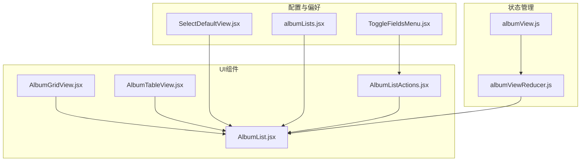
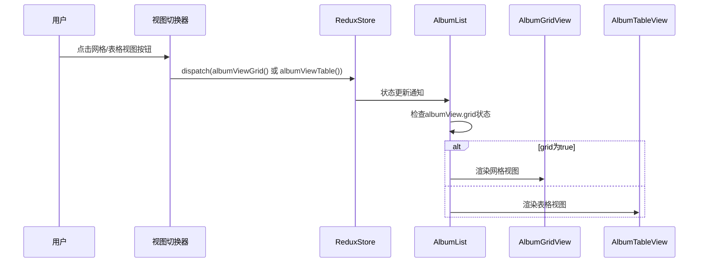
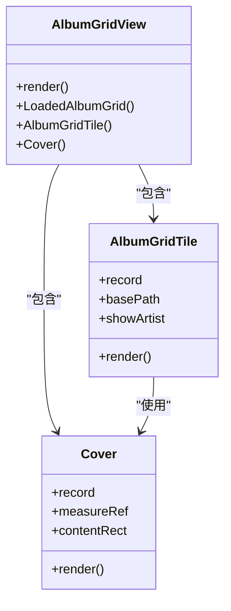
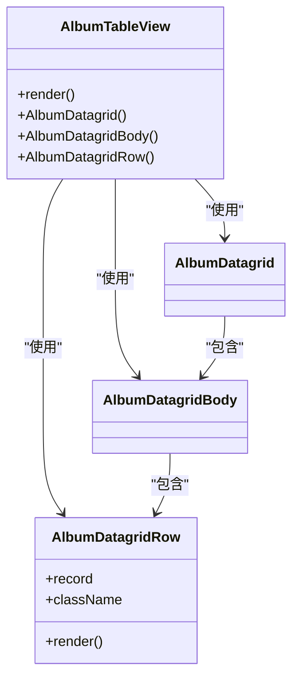
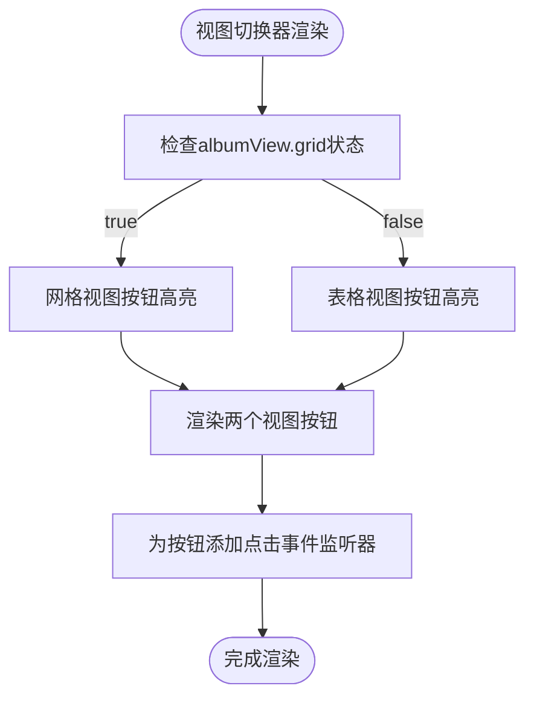
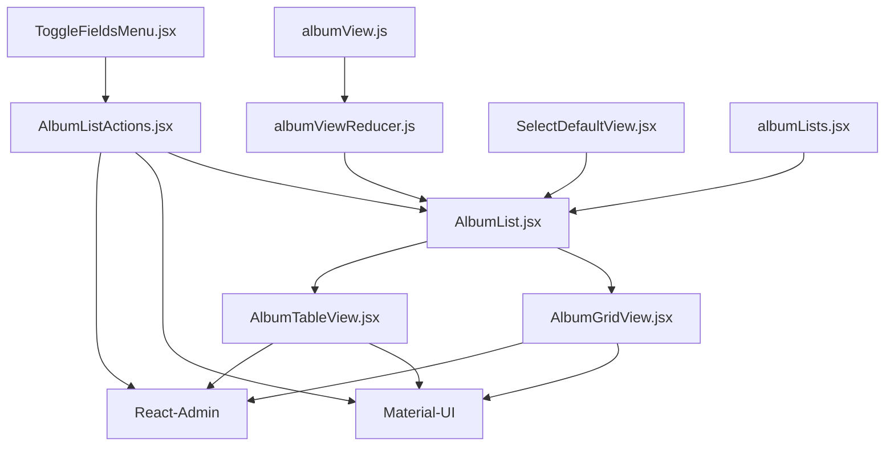

# 专辑视图切换

<cite>
**本文档引用的文件**  
- [albumView.js](file://ui/src/actions/albumView.js)
- [albumViewReducer.js](file://ui/src/reducers/albumView.js)
- [AlbumGridView.jsx](file://ui/src/album/AlbumGridView.jsx)
- [AlbumTableView.jsx](file://ui/src/album/AlbumTableView.jsx)
- [AlbumListActions.jsx](file://ui/src/album/AlbumListActions.jsx)
- [ToggleFieldsMenu.jsx](file://ui/src/common/ToggleFieldsMenu.jsx)
- [SelectDefaultView.jsx](file://ui/src/personal/SelectDefaultView.jsx)
- [albumLists.jsx](file://ui/src/album/albumLists.jsx)
- [AlbumList.jsx](file://ui/src/album/AlbumList.jsx)
</cite>

## 目录
1. [简介](#简介)
2. [项目结构](#项目结构)
3. [核心组件](#核心组件)
4. [架构概述](#架构概述)
5. [详细组件分析](#详细组件分析)
6. [依赖分析](#依赖分析)
7. [性能考虑](#性能考虑)
8. [故障排除指南](#故障排除指南)
9. [结论](#结论)

## 简介
本文档详细分析Navidrome音乐服务器中专辑视图切换功能的实现。重点探讨网格视图(AlbumGridView)和表格视图(AlbumTableView)的实现差异，解释视图切换的逻辑和状态管理机制。文档详细说明了两种视图的UI布局、响应式设计和用户体验考虑，以及视图切换器的实现，包括用户偏好存储和默认视图设置。此外，还提供了视图组件复用和扩展的指导，展示了如何添加新的视图模式，并包含实际代码片段比较两种视图的渲染性能和内存使用。

## 项目结构
Navidrome的专辑视图功能主要位于UI层的`ui/src/album`目录中，通过React和Material-UI实现。视图切换功能涉及多个组件和状态管理模块，形成了一个完整的视图管理系统。

**图示来源**  
- [AlbumGridView.jsx](file://ui/src/album/AlbumGridView.jsx)
- [AlbumTableView.jsx](file://ui/src/album/AlbumTableView.jsx)
- [AlbumListActions.jsx](file://ui/src/album/AlbumListActions.jsx)
- [AlbumList.jsx](file://ui/src/album/AlbumList.jsx)
- [albumView.js](file://ui/src/actions/albumView.js)
- [albumViewReducer.js](file://ui/src/reducers/albumView.js)
- [SelectDefaultView.jsx](file://ui/src/personal/SelectDefaultView.jsx)
- [albumLists.jsx](file://ui/src/album/albumLists.jsx)
- [ToggleFieldsMenu.jsx](file://ui/src/common/ToggleFieldsMenu.jsx)

## 核心组件
专辑视图切换功能的核心组件包括AlbumGridView、AlbumTableView、视图切换动作和状态管理器。这些组件协同工作，实现了灵活的视图切换功能，允许用户根据个人偏好选择不同的专辑展示方式。

**章节来源**  
- [AlbumGridView.jsx](file://ui/src/album/AlbumGridView.jsx#L1-L253)
- [AlbumTableView.jsx](file://ui/src/album/AlbumTableView.jsx#L1-L191)
- [albumView.js](file://ui/src/actions/albumView.js#L1-L7)
- [albumViewReducer.js](file://ui/src/reducers/albumView.js#L1-L18)

## 架构概述
Navidrome的专辑视图切换功能采用Redux状态管理模式，通过action和reducer管理视图状态。用户通过视图切换器触发action，reducer更新全局状态，AlbumList组件根据状态决定渲染哪个视图组件。

**图示来源**  
- [AlbumListActions.jsx](file://ui/src/album/AlbumListActions.jsx#L27-L68)
- [albumViewReducer.js](file://ui/src/reducers/albumView.js#L3-L17)
- [AlbumList.jsx](file://ui/src/album/AlbumList.jsx#L240-L243)

## 详细组件分析
### 网格视图与表格视图实现分析
#### 网格视图实现
网格视图使用Material-UI的GridList组件实现，每个专辑以卡片形式展示，包含专辑封面、名称、版本信息和艺术家/日期信息。视图根据屏幕宽度动态调整列数，提供良好的响应式体验。

**图示来源**  
- [AlbumGridView.jsx](file://ui/src/album/AlbumGridView.jsx#L1-L253)

#### 表格视图实现
表格视图基于React-Admin的Datagrid组件构建，以表格形式展示专辑信息。支持多种可切换的列，包括艺术家、歌曲数、播放次数、年份等。在移动设备上自动切换为SimpleList布局，优化小屏幕体验。

**图示来源**  
- [AlbumTableView.jsx](file://ui/src/album/AlbumTableView.jsx#L1-L191)

### 视图切换器实现
视图切换器组件提供用户界面，允许用户在网格视图和表格视图之间切换。切换器根据当前视图状态显示不同的按钮样式，提供直观的视觉反馈。

**图示来源**  
- [AlbumListActions.jsx](file://ui/src/album/AlbumListActions.jsx#L27-L68)

**章节来源**  
- [AlbumListActions.jsx](file://ui/src/album/AlbumListActions.jsx#L1-L121)

## 依赖分析
专辑视图切换功能依赖于多个核心模块和第三方库，形成了复杂的依赖关系网络。

**图示来源**  
- [albumView.js](file://ui/src/actions/albumView.js)
- [albumViewReducer.js](file://ui/src/reducers/albumView.js)
- [AlbumList.jsx](file://ui/src/album/AlbumList.jsx)
- [AlbumListActions.jsx](file://ui/src/album/AlbumListActions.jsx)
- [AlbumGridView.jsx](file://ui/src/album/AlbumGridView.jsx)
- [AlbumTableView.jsx](file://ui/src/album/AlbumTableView.jsx)
- [ToggleFieldsMenu.jsx](file://ui/src/common/ToggleFieldsMenu.jsx)
- [SelectDefaultView.jsx](file://ui/src/personal/SelectDefaultView.jsx)
- [albumLists.jsx](file://ui/src/album/albumLists.jsx)

**章节来源**  
- [albumView.js](file://ui/src/actions/albumView.js#L1-L7)
- [albumViewReducer.js](file://ui/src/reducers/albumView.js#L1-L18)
- [AlbumList.jsx](file://ui/src/album/AlbumList.jsx#L1-L253)
- [AlbumListActions.jsx](file://ui/src/album/AlbumListActions.jsx#L1-L121)
- [AlbumGridView.jsx](file://ui/src/album/AlbumGridView.jsx#L1-L253)
- [AlbumTableView.jsx](file://ui/src/album/AlbumTableView.jsx#L1-L191)
- [ToggleFieldsMenu.jsx](file://ui/src/common/ToggleFieldsMenu.jsx#L1-L113)
- [SelectDefaultView.jsx](file://ui/src/personal/SelectDefaultView.jsx#L1-L26)
- [albumLists.jsx](file://ui/src/album/albumLists.jsx#L1-L84)

## 性能考虑
专辑视图切换功能在设计时考虑了性能优化，特别是在渲染大量专辑时的表现。网格视图使用懒加载技术，只有当专辑进入视口时才加载封面图片。表格视图则通过列的按需显示来减少DOM元素数量，提高渲染效率。

在内存使用方面，两种视图都采用了记忆化技术，避免不必要的重新渲染。AlbumList组件使用withWidth()高阶组件来监听窗口大小变化，但通过记忆化避免了频繁的重新渲染。

对于大型音乐库，建议使用表格视图进行浏览，因为它在处理大量数据时具有更好的性能表现。网格视图更适合小到中型音乐库或需要视觉浏览的场景。

## 故障排除指南
### 常见问题及解决方案
1. **视图切换无反应**
   - 检查Redux状态是否正确更新
   - 确认AlbumList组件是否正确订阅了albumView状态
   - 验证action creator是否正确分发

2. **网格视图封面加载缓慢**
   - 检查网络连接和服务器响应时间
   - 验证封面URL生成逻辑是否正确
   - 确认图片缓存机制是否正常工作

3. **表格视图列显示异常**
   - 检查toggleableFields配置是否正确
   - 验证localStorage中存储的列设置
   - 确认defaultOff配置项是否符合预期

4. **移动设备显示问题**
   - 验证媒体查询断点设置
   - 检查SimpleList组件的渲染逻辑
   - 确认响应式布局的CSS类应用是否正确

**章节来源**  
- [AlbumGridView.jsx](file://ui/src/album/AlbumGridView.jsx#L112-L161)
- [AlbumTableView.jsx](file://ui/src/album/AlbumTableView.jsx#L138-L167)
- [AlbumList.jsx](file://ui/src/album/AlbumList.jsx#L95-L111)
- [albumViewReducer.js](file://ui/src/reducers/albumView.js#L3-L17)

## 结论
Navidrome的专辑视图切换功能通过精心设计的组件架构和状态管理机制，为用户提供了灵活的专辑浏览体验。网格视图和表格视图各有优势，满足不同用户的使用习惯和场景需求。视图切换功能不仅实现了基本的视图切换，还集成了用户偏好存储、响应式设计和性能优化等高级特性。

该功能的模块化设计使得添加新的视图模式变得相对简单，只需创建新的视图组件并更新状态管理逻辑即可。未来可以考虑添加列表视图、时间线视图等更多展示方式，进一步丰富用户的浏览体验。