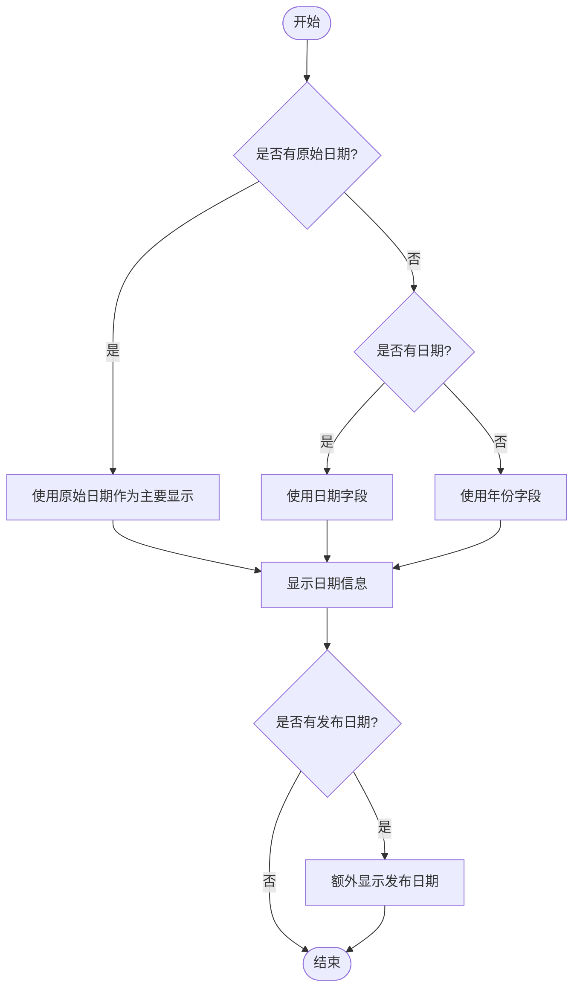
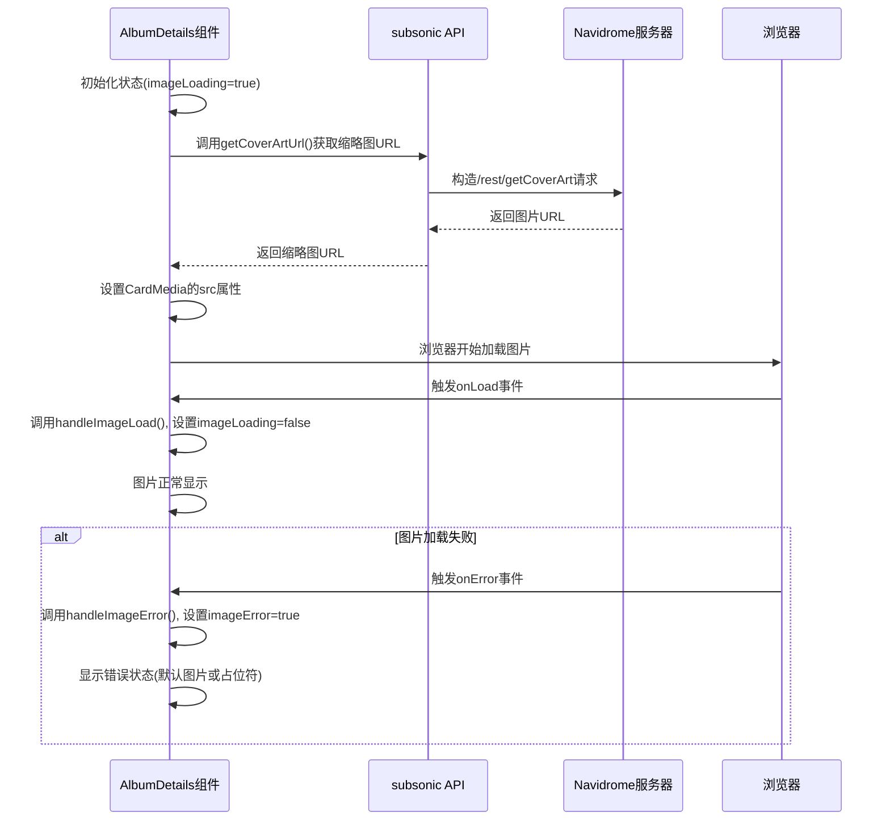
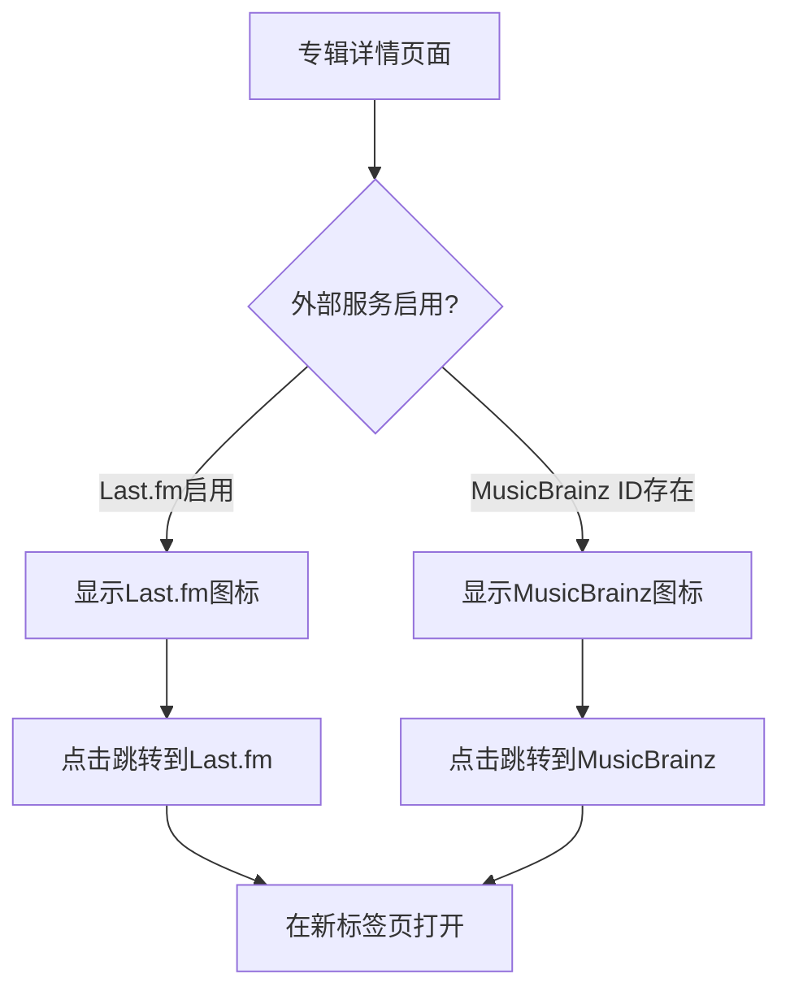

# 专辑详情

<cite>
**本文档中引用的文件**   
- [AlbumDetails.jsx](file://ui/src/album/AlbumDetails.jsx)
- [album.go](file://model/album.go)
- [subsonic/index.js](file://ui/src/subsonic/index.js)
- [AlbumExternalLinks.jsx](file://ui/src/album/AlbumExternalLinks.jsx)
- [ArtistLinkField.jsx](file://ui/src/common/ArtistLinkField.jsx)
- [LoveButton.jsx](file://ui/src/common/LoveButton.jsx)
- [RatingField.jsx](file://ui/src/common/RatingField.jsx)
- [formatRange.js](file://ui/src/common/formatRange.js)
</cite>

## 目录
1. [简介](#简介)
2. [核心组件分析](#核心组件分析)
3. [专辑元数据展示逻辑](#专辑元数据展示逻辑)
4. [Props结构与数据模型](#props结构与数据模型)
5. [专辑封面加载机制](#专辑封面加载机制)
6. [外部服务集成](#外部服务集成)
7. [响应式设计与用户体验](#响应式设计与用户体验)
8. [性能优化建议](#性能优化建议)

## 简介
Navidrome的专辑详情组件提供了丰富的专辑信息展示功能，包括专辑元数据、封面图片、艺术家链接、收藏和评分功能等。该组件通过React和Material-UI构建，实现了现代化的用户界面和交互体验。

## 核心组件分析

**Section sources**
- [AlbumDetails.jsx](file://ui/src/album/AlbumDetails.jsx)

## 专辑元数据展示逻辑

**Section sources**
- [AlbumDetails.jsx](file://ui/src/album/AlbumDetails.jsx#L152-L215)
- [formatRange.js](file://ui/src/common/formatRange.js)

### 日期信息处理
专辑详情组件对多种日期字段进行了智能处理和展示：

- **原始日期 (originalDate)**：专辑最初发行的日期
- **发布日期 (releaseDate)**：专辑正式发布的日期
- **年份范围 (year range)**：当专辑包含跨年份的曲目时显示的年份范围

组件通过`formatRange`工具函数计算年份范围，该函数从专辑记录中提取`minYear`和`maxYear`字段，生成如"2018-2020"的范围显示。



**Diagram sources**
- [AlbumDetails.jsx](file://ui/src/album/AlbumDetails.jsx#L164-L200)

### 信息聚合展示
组件使用`Details`子组件来聚合和格式化专辑的元数据，包括：

- 曲目数量
- 总时长
- 专辑大小
- 日期信息

这些信息通过`intersperse`函数以" · "符号分隔，形成紧凑的信息流。

## Props结构与数据模型

**Section sources**
- [album.go](file://model/album.go)
- [AlbumDetails.jsx](file://ui/src/album/AlbumDetails.jsx#L217-L392)

### 专辑数据结构
专辑对象包含以下主要字段：

```json
{
  "id": "唯一标识符",
  "name": "专辑名称",
  "albumArtist": "专辑艺术家",
  "year": "年份",
  "minYear": "最小年份",
  "maxYear": "最大年份",
  "date": "日期",
  "originalDate": "原始日期",
  "releaseDate": "发布日期",
  "songCount": "曲目数量",
  "duration": "总时长(秒)",
  "size": "专辑大小(字节)",
  "genre": "流派",
  "genres": "多个流派",
  "comment": "评论",
  "notes": "备注",
  "tags": "标签",
  "participants": "参与者",
  "starred": "是否收藏",
  "rating": "评分"
}
```

### 组件Props
AlbumDetails组件接收标准的React Admin组件props，通过`useRecordContext`钩子获取专辑记录数据。组件不直接定义props接口，而是依赖React Admin的上下文机制。

## 专辑封面加载机制

**Section sources**
- [AlbumDetails.jsx](file://ui/src/album/AlbumDetails.jsx#L256-L295)
- [subsonic/index.js](file://ui/src/subsonic/index.js#L74-L92)

### 图片加载流程
专辑封面的加载和显示遵循以下流程：



**Diagram sources**
- [AlbumDetails.jsx](file://ui/src/album/AlbumDetails.jsx#L256-L295)

### 响应式图片处理
组件实现了响应式图片加载策略：

1. **不同尺寸**：通过`getCoverArtUrl`函数可以获取不同尺寸的封面图片
2. **懒加载**：图片在需要时才加载，减少初始页面加载时间
3. **错误回退**：当图片加载失败时，组件会显示适当的错误状态
4. **加载状态**：在图片加载期间显示半透明效果，提供视觉反馈

## 外部服务集成

**Section sources**
- [AlbumExternalLinks.jsx](file://ui/src/album/AlbumExternalLinks.jsx)
- [AlbumDetails.jsx](file://ui/src/album/AlbumDetails.jsx#L338-L340)

### 集成的外部服务
专辑详情组件集成了多个外部音乐服务，通过`AlbumExternalLinks`组件提供快捷访问：

- **Last.fm**：通过专辑艺术家和名称构建Last.fm链接
- **MusicBrainz**：通过`mbzAlbumId`字段构建MusicBrainz专辑页面链接



**Diagram sources**
- [AlbumExternalLinks.jsx](file://ui/src/album/AlbumExternalLinks.jsx)

## 响应式设计与用户体验

**Section sources**
- [AlbumDetails.jsx](file://ui/src/album/AlbumDetails.jsx)
- [ArtistLinkField.jsx](file://ui/src/common/ArtistLinkField.jsx)

### 响应式布局
组件根据屏幕尺寸调整布局和信息密度：

- **移动设备 (xs)**：简化信息展示，隐藏次要信息
- **桌面设备 (lg)**：显示完整信息，包括流派列表和详细评论

### 交互功能
组件提供了丰富的用户交互功能：

- **封面图片**：点击可放大查看（使用Lightbox组件）
- **艺术家链接**：点击可导航到艺术家详情页面
- **收藏按钮**：一键收藏/取消收藏专辑
- **评分功能**：支持5星评分系统
- **评论折叠**：长评论可折叠/展开

## 性能优化建议

**Section sources**
- [AlbumDetails.jsx](file://ui/src/album/AlbumDetails.jsx)
- [subsonic/index.js](file://ui/src/subsonic/index.js)

### 数据缓存策略
1. **API响应缓存**：对`getAlbumInfo`等API调用实现客户端缓存
2. **图片缓存**：利用浏览器缓存机制，通过`updatedAt`时间戳控制缓存失效
3. **状态记忆**：使用`useMemo`和`useCallback`优化组件渲染性能

### 懒加载优化
1. **延迟加载附加信息**：如专辑评论等非关键信息可延迟加载
2. **虚拟滚动**：对于包含大量曲目的专辑，实现曲目列表的虚拟滚动
3. **按需加载**：仅在用户交互时加载高分辨率图片

### 网络请求优化
1. **请求合并**：将多个相关API调用合并为批量请求
2. **预加载**：预测用户行为，预加载可能访问的专辑信息
3. **压缩传输**：确保服务器端启用了Gzip等压缩机制