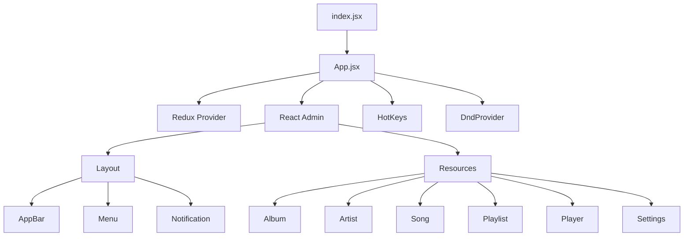
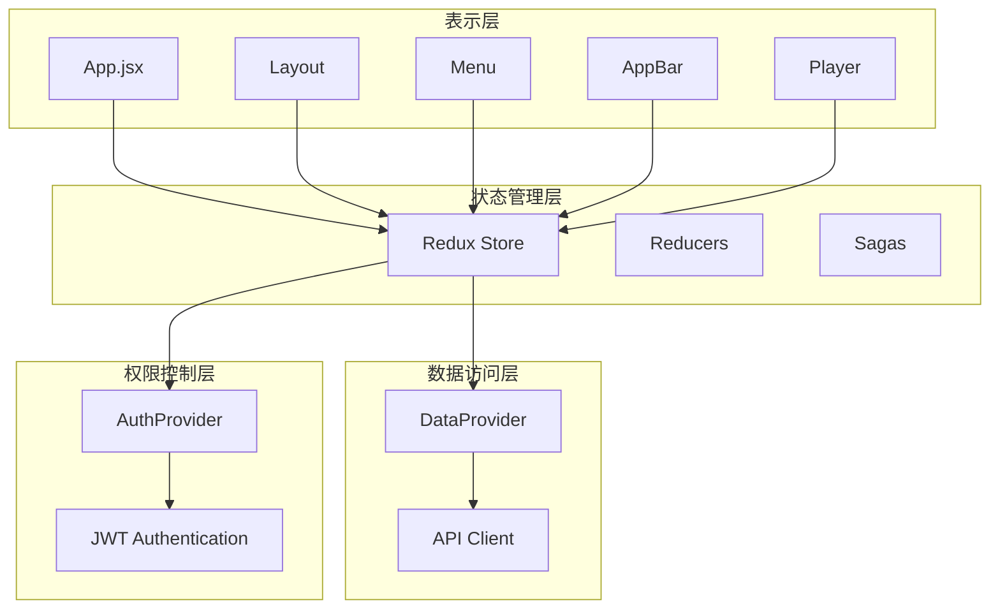
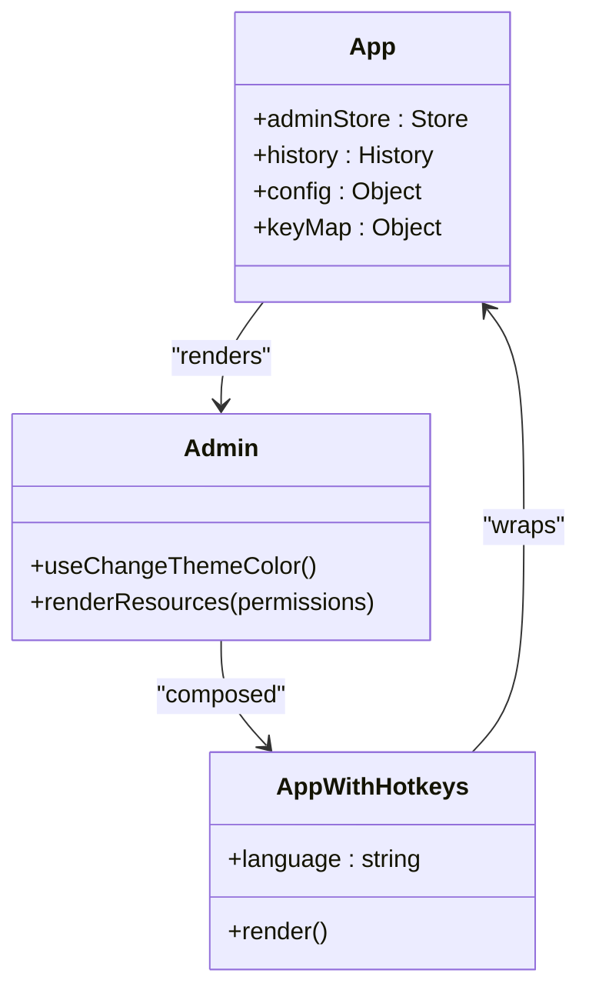
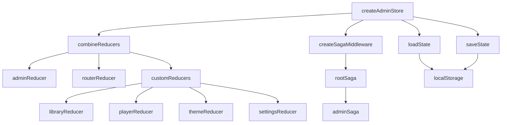
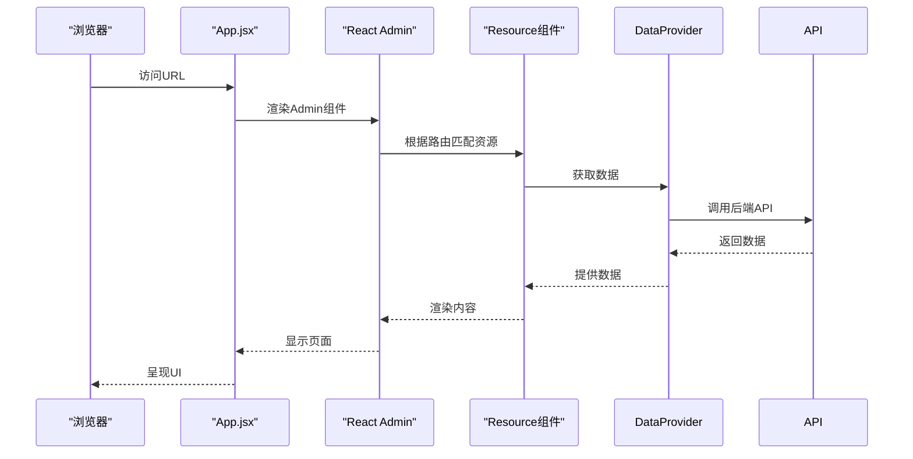
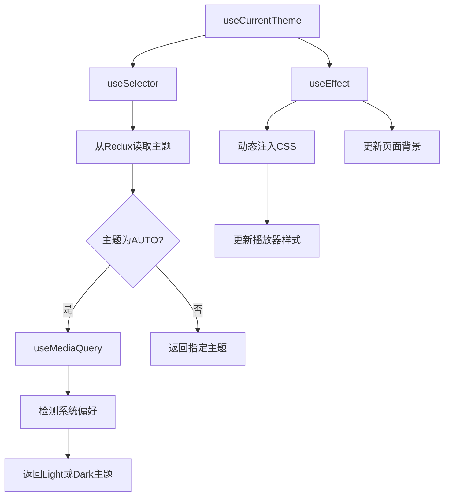
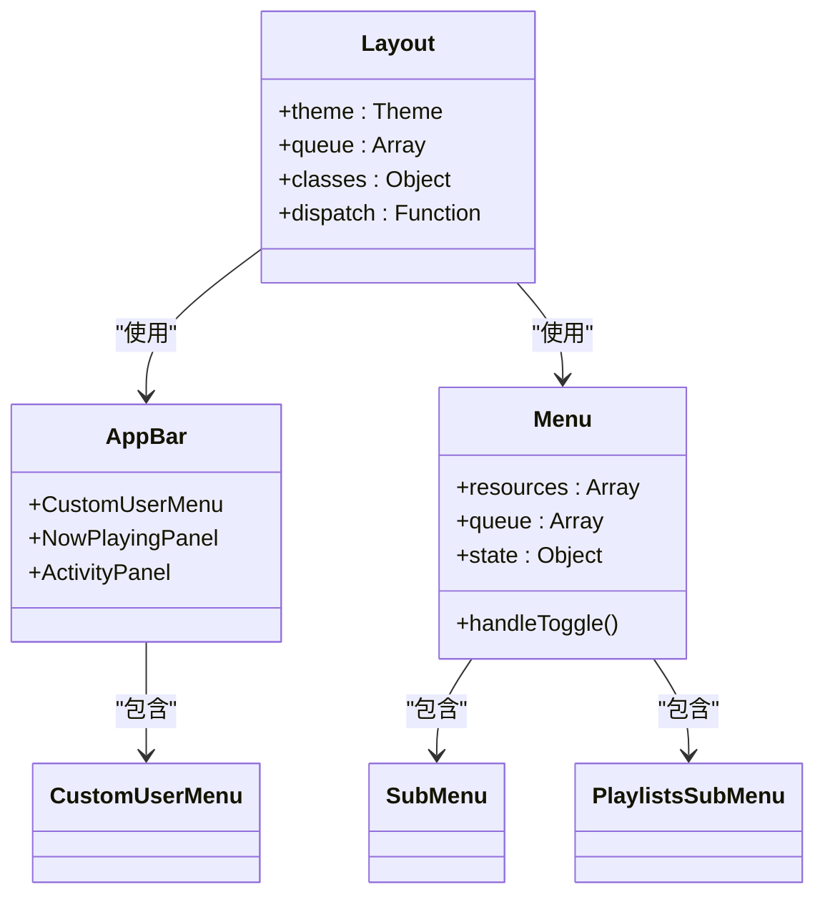
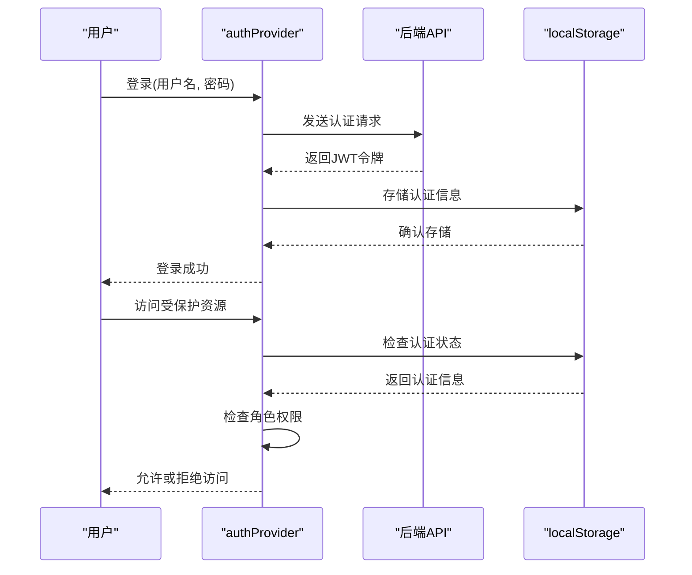
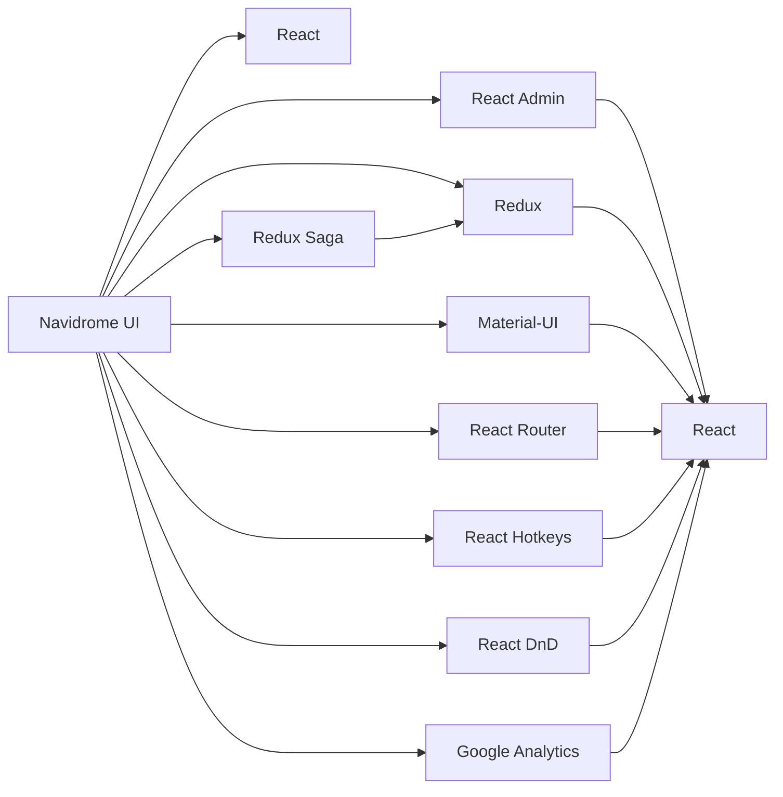

# 应用结构

<cite>
**本文档中引用的文件**  
- [App.jsx](file://ui/src/App.jsx)
- [index.jsx](file://ui/src/index.jsx)
- [routes.jsx](file://ui/src/routes.jsx)
- [config.js](file://ui/src/config.js)
- [createAdminStore.js](file://ui/src/store/createAdminStore.js)
- [Layout.jsx](file://ui/src/layout/Layout.jsx)
- [Menu.jsx](file://ui/src/layout/Menu.jsx)
- [AppBar.jsx](file://ui/src/layout/AppBar.jsx)
- [Player.jsx](file://ui/src/audioplayer/Player.jsx)
- [useCurrentTheme.js](file://ui/src/themes/useCurrentTheme.js)
- [authProvider.js](file://ui/src/authProvider.js)
- [hotkeys.js](file://ui/src/hotkeys.js)
</cite>

## 目录
1. [简介](#简介)
2. [项目结构](#项目结构)
3. [核心组件](#核心组件)
4. [架构概述](#架构概述)
5. [详细组件分析](#详细组件分析)
6. [依赖分析](#依赖分析)
7. [性能考虑](#性能考虑)
8. [故障排除指南](#故障排除指南)
9. [结论](#结论)

## 简介
Navidrome 是一个开源的音乐服务器和流媒体应用，提供现代化的Web界面来管理和播放音乐库。本文档深入分析了Navidrome前端应用的整体结构，重点关注App.jsx根组件的实现，包括路由配置、状态管理、主题系统和布局结构。文档详细说明了Redux store的创建与集成、路由定义和页面导航机制，以及应用启动流程、权限控制和事件处理。同时，本文档还解释了Layout、Menu等全局组件的设计与实现，并探讨了应用性能、代码分割和懒加载等架构问题。

## 项目结构
Navidrome项目采用分层架构，前端UI部分位于ui目录下，使用React技术栈构建。应用的核心入口是index.jsx文件，它渲染App组件到DOM中。App.jsx作为根组件，负责集成Redux状态管理、路由系统、主题系统和全局布局。应用使用React Admin框架作为基础，通过自定义资源和组件来实现音乐流媒体功能。

**图源**
- [index.jsx](file://ui/src/index.jsx)
- [App.jsx](file://ui/src/App.jsx)
- [Layout.jsx](file://ui/src/layout/Layout.jsx)

**本节来源**
- [index.jsx](file://ui/src/index.jsx)
- [App.jsx](file://ui/src/App.jsx)

## 核心组件
Navidrome前端应用的核心组件包括App.jsx根组件、Redux store、路由系统、主题系统和全局布局组件。App.jsx组件作为应用的入口点，集成了所有关键功能，包括状态管理、权限控制、事件处理和用户界面布局。Redux store负责管理应用的全局状态，包括播放队列、用户设置、主题偏好等。路由系统基于React Router实现，定义了应用的导航结构和页面跳转逻辑。

**本节来源**
- [App.jsx](file://ui/src/App.jsx)
- [createAdminStore.js](file://ui/src/store/createAdminStore.js)
- [routes.jsx](file://ui/src/routes.jsx)

## 架构概述
Navidrome前端应用采用现代化的React架构，基于React Admin框架构建。应用使用Redux进行全局状态管理，React Router进行路由控制，Material-UI进行UI组件构建。整体架构分为几个关键层次：表示层（UI组件）、状态管理层（Redux）、数据访问层（dataProvider）和权限控制层（authProvider）。这种分层架构使得代码结构清晰，职责分离明确，便于维护和扩展。

**图源**
- [App.jsx](file://ui/src/App.jsx)
- [createAdminStore.js](file://ui/src/store/createAdminStore.js)
- [authProvider.js](file://ui/src/authProvider.js)

## 详细组件分析

### App.jsx根组件分析
App.jsx是Navidrome前端应用的根组件，负责集成所有关键功能。组件首先导入必要的依赖，包括React Redux、React Admin、路由历史等。然后创建Redux store，集成自定义reducer和React Admin的reducer。App组件使用Provider包装，将store注入到React组件树中。应用还集成了Google Analytics用于用户行为跟踪，以及React Hotkeys用于键盘快捷键支持。

**图源**
- [App.jsx](file://ui/src/App.jsx)
- [createAdminStore.js](file://ui/src/store/createAdminStore.js)

**本节来源**
- [App.jsx](file://ui/src/App.jsx)

### 状态管理分析
Navidrome使用Redux进行全局状态管理，通过createAdminStore函数创建和配置store。store集成了React Admin的adminReducer和routerReducer，以及多个自定义reducer，如playerReducer、themeReducer、libraryReducer等。应用使用redux-saga处理副作用，如API调用和异步操作。store的状态被持久化到localStorage中，确保用户设置和播放队列在页面刷新后仍然保留。

**图源**
- [createAdminStore.js](file://ui/src/store/createAdminStore.js)
- [persistState.js](file://ui/src/store/persistState.js)

**本节来源**
- [createAdminStore.js](file://ui/src/store/createAdminStore.js)

### 路由与导航机制
Navidrome的路由系统基于React Admin的Resource组件实现。应用定义了多个资源，如album、artist、song、playlist等，每个资源对应一个功能模块。路由配置在App.jsx的Admin组件中完成，根据用户权限动态显示不同的资源。例如，只有管理员用户才能访问transcoding和library资源。应用还支持自定义路由，如/personal路径，通过routes.jsx文件定义。

**图源**
- [App.jsx](file://ui/src/App.jsx)
- [routes.jsx](file://ui/src/routes.jsx)

**本节来源**
- [App.jsx](file://ui/src/App.jsx)
- [routes.jsx](file://ui/src/routes.jsx)

### 主题系统分析
Navidrome的主题系统允许用户自定义界面外观。应用支持多种预定义主题，如DarkTheme、LightTheme等，并支持根据系统偏好自动切换主题。useCurrentTheme钩子负责获取当前主题，它从Redux store中读取主题设置，并根据系统偏好调整。主题系统还支持为音乐播放器单独设置主题样式，通过动态注入CSS样式表实现。

**图源**
- [useCurrentTheme.js](file://ui/src/themes/useCurrentTheme.js)
- [themes/index.js](file://ui/src/themes/index.js)

**本节来源**
- [useCurrentTheme.js](file://ui/src/themes/useCurrentTheme.js)

### 布局结构分析
Navidrome的布局结构由Layout、AppBar和Menu组件组成。Layout组件是React Admin的布局容器，它集成了自定义的AppBar和Menu。AppBar组件显示在页面顶部，包含用户菜单、通知和快捷操作。Menu组件显示在左侧边栏，提供主要导航功能。布局组件还集成了键盘快捷键支持，允许用户通过快捷键切换菜单和控制播放器。

**图源**
- [Layout.jsx](file://ui/src/layout/Layout.jsx)
- [AppBar.jsx](file://ui/src/layout/AppBar.jsx)
- [Menu.jsx](file://ui/src/layout/Menu.jsx)

**本节来源**
- [Layout.jsx](file://ui/src/layout/Layout.jsx)
- [AppBar.jsx](file://ui/src/layout/AppBar.jsx)
- [Menu.jsx](file://ui/src/layout/Menu.jsx)

### 权限控制分析
Navidrome的权限控制系统基于JWT认证和角色管理。authProvider组件负责处理用户认证、权限检查和身份验证。系统支持两种角色：admin和regular。不同角色具有不同的功能访问权限，例如只有管理员才能访问转码设置和库管理功能。权限信息存储在localStorage中，并在每次API请求时验证。

**图源**
- [authProvider.js](file://ui/src/authProvider.js)
- [App.jsx](file://ui/src/App.jsx)

**本节来源**
- [authProvider.js](file://ui/src/authProvider.js)

## 依赖分析
Navidrome前端应用依赖于多个第三方库和框架。核心依赖包括React、React Admin、Redux、Material-UI等。React Admin提供了基础的管理界面框架，Redux负责状态管理，Material-UI提供UI组件。应用还依赖于特定功能库，如react-hotkeys用于键盘快捷键，react-dnd用于拖放功能，react-ga用于Google Analytics集成。

**图源**
- [package.json](file://ui/package.json)
- [App.jsx](file://ui/src/App.jsx)

**本节来源**
- [package.json](file://ui/package.json)

## 性能考虑
Navidrome在性能优化方面采取了多种策略。应用使用Redux状态持久化，减少页面刷新时的数据重新加载。播放器组件实现了预加载机制，在当前歌曲播放到一定进度时预加载下一首歌曲，确保无缝播放体验。应用还使用了React的useMemo和useCallback钩子来优化组件渲染性能，避免不必要的重新渲染。

对于大型音乐库，应用的性能主要受数据加载和渲染的影响。建议优化包括：实现虚拟滚动以处理大量列表项，使用代码分割和懒加载减少初始加载时间，优化API请求以减少网络延迟。此外，播放器的ReplayGain功能使用Web Audio API进行音量标准化，这在某些设备上可能影响性能，可以考虑提供选项让用户禁用此功能。

**本节来源**
- [Player.jsx](file://ui/src/audioplayer/Player.jsx)
- [createAdminStore.js](file://ui/src/store/createAdminStore.js)

## 故障排除指南
当Navidrome应用出现问题时，可以按照以下步骤进行排查。首先检查浏览器控制台是否有JavaScript错误，这通常能快速定位问题。如果页面无法加载，检查网络请求是否正常，特别是API请求是否返回预期响应。对于播放问题，检查音频文件路径是否正确，以及服务器是否有权限访问这些文件。

常见问题包括：认证失败、播放中断、界面显示异常等。对于认证失败，检查JWT令牌是否有效，以及服务器时间是否同步。对于播放中断，检查网络连接和服务器负载。对于界面显示异常，检查浏览器兼容性，以及是否有CSS样式冲突。开发者工具的网络面板和控制台是诊断问题的重要工具。

**本节来源**
- [authProvider.js](file://ui/src/authProvider.js)
- [Player.jsx](file://ui/src/audioplayer/Player.jsx)
- [App.jsx](file://ui/src/App.jsx)

## 结论
Navidrome是一个功能丰富的音乐流媒体应用，其前端架构设计合理，采用了现代化的React技术栈。通过深入分析App.jsx根组件，我们了解了应用的整体结构、状态管理、路由配置、主题系统和布局机制。应用使用Redux进行全局状态管理，React Admin作为基础框架，Material-UI提供UI组件，形成了一个可维护、可扩展的架构。权限控制系统确保了不同用户角色的功能隔离，而性能优化策略保证了良好的用户体验。总体而言，Navidrome的前端架构体现了良好的软件工程实践，为音乐流媒体功能提供了坚实的基础。