# 播放列表展示

<cite>
**本文档中引用的文件**   
- [PlaylistShow.jsx](file://ui/src/playlist/PlaylistShow.jsx)
- [PlaylistDetails.jsx](file://ui/src/playlist/PlaylistDetails.jsx)
- [PlaylistSongs.jsx](file://ui/src/playlist/PlaylistSongs.jsx)
- [PlaylistActions.jsx](file://ui/src/playlist/PlaylistActions.jsx)
- [playlist.go](file://model/playlist.go)
- [playlists.go](file://core/playlists.go)
- [playlists.go](file://server/subsonic/playlists.go)
- [useResourceRefresh.jsx](file://ui/src/common/useResourceRefresh.jsx)
- [player.js](file://ui/src/actions/player.js)
</cite>

## 目录
1. [简介](#简介)
2. [项目结构](#项目结构)
3. [核心组件](#核心组件)
4. [架构概述](#架构概述)
5. [详细组件分析](#详细组件分析)
6. [依赖分析](#依赖分析)
7. [性能考虑](#性能考虑)
8. [故障排除指南](#故障排除指南)
9. [结论](#结论)
10. [附录](#附录)（如有必要）

## 简介
本文档深入分析Navidrome播放列表展示功能的实现，重点关注PlaylistShow组件。该功能允许用户查看和管理音乐播放列表，包括播放列表元数据（名称、封面、歌曲数量等）的渲染、与后端API的数据交互、以及与播放器和导航菜单等其他UI组件的集成。文档将详细解释其布局结构、响应式设计、状态管理机制，并提供优化建议以解决加载性能、懒加载和错误处理等常见问题。

## 项目结构
播放列表功能主要由前端UI组件和后端API服务组成。前端组件位于`ui/src/playlist/`目录下，包括展示、编辑、创建和列表视图。后端数据模型和业务逻辑位于`model/`和`core/`目录中，而API路由则在`server/subsonic/`中定义。

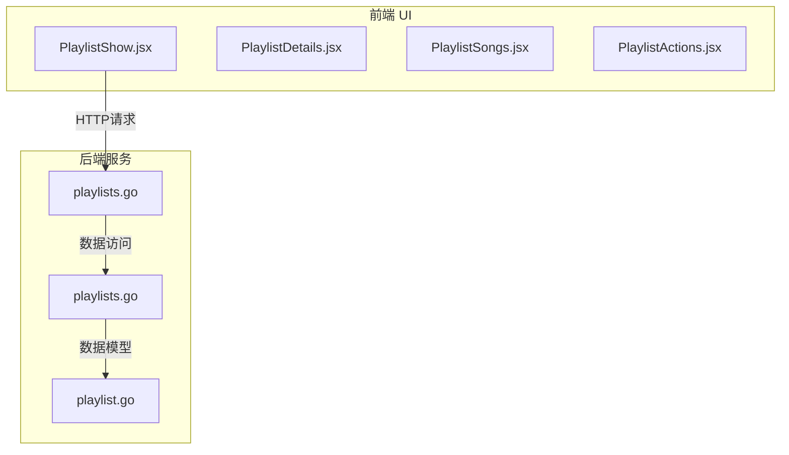

**图表来源**
- [PlaylistShow.jsx](file://ui/src/playlist/PlaylistShow.jsx)
- [playlist.go](file://model/playlist.go)
- [playlists.go](file://core/playlists.go)
- [playlists.go](file://server/subsonic/playlists.go)

**章节来源**
- [ui/src/playlist/PlaylistShow.jsx](file://ui/src/playlist/PlaylistShow.jsx)
- [model/playlist.go](file://model/playlist.go)

## 核心组件
播放列表展示功能的核心是`PlaylistShow`组件，它负责协调播放列表的元数据展示、歌曲列表和操作按钮。该组件利用React Admin框架的`useShowController`和`ShowContextProvider`来管理数据获取和状态。`PlaylistDetails`组件处理封面、名称和统计信息的渲染，而`PlaylistSongs`组件则通过`ReferenceManyField`展示播放列表中的所有歌曲。`PlaylistActions`提供了播放、下载和分享等交互功能。

**章节来源**
- [ui/src/playlist/PlaylistShow.jsx](file://ui/src/playlist/PlaylistShow.jsx)
- [ui/src/playlist/PlaylistDetails.jsx](file://ui/src/playlist/PlaylistDetails.jsx)
- [ui/src/playlist/PlaylistSongs.jsx](file://ui/src/playlist/PlaylistSongs.jsx)
- [ui/src/playlist/PlaylistActions.jsx](file://ui/src/playlist/PlaylistActions.jsx)

## 架构概述
播放列表展示功能遵循典型的前后端分离架构。前端通过Subsonic API与后端通信，后端从数据库获取数据并返回JSON响应。前端组件采用React函数式组件和Hooks进行状态管理，并利用Material-UI进行响应式布局设计。

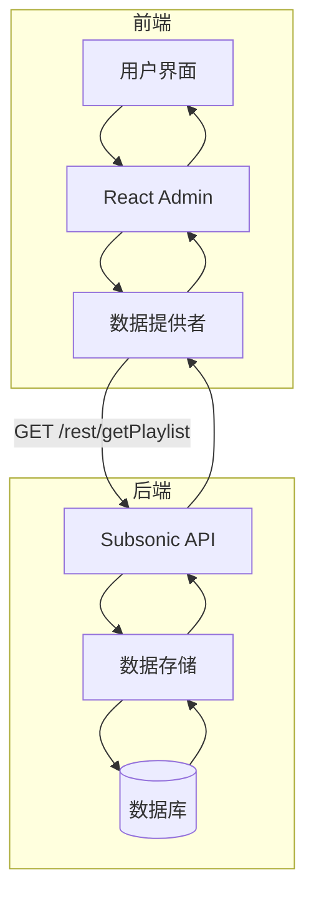

**图表来源**
- [ui/src/playlist/PlaylistShow.jsx](file://ui/src/playlist/PlaylistShow.jsx)
- [server/subsonic/playlists.go](file://server/subsonic/playlists.go)
- [model/playlist.go](file://model/playlist.go)

## 详细组件分析
本节将深入分析播放列表展示功能的各个关键组件，包括其布局结构、响应式设计和状态管理机制。

### PlaylistShow 组件分析
`PlaylistShow`组件是播放列表展示的入口点，它使用React Admin的控制器模式来获取和管理播放列表数据。

#### 组件结构
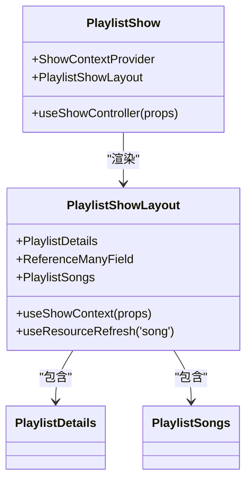

**图表来源**
- [ui/src/playlist/PlaylistShow.jsx](file://ui/src/playlist/PlaylistShow.jsx)

#### 数据流与状态管理
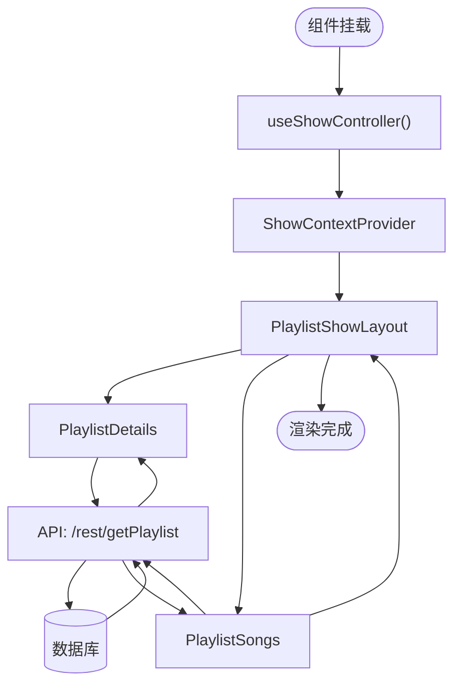

**图表来源**
- [ui/src/playlist/PlaylistShow.jsx](file://ui/src/playlist/PlaylistShow.jsx)
- [server/subsonic/playlists.go](file://server/subsonic/playlists.go)

**章节来源**
- [ui/src/playlist/PlaylistShow.jsx](file://ui/src/playlist/PlaylistShow.jsx)

### 播放列表元数据渲染
播放列表元数据（如名称、封面、歌曲数量）的渲染由`PlaylistDetails`组件处理，该组件实现了响应式设计和交互功能。

#### 响应式布局设计
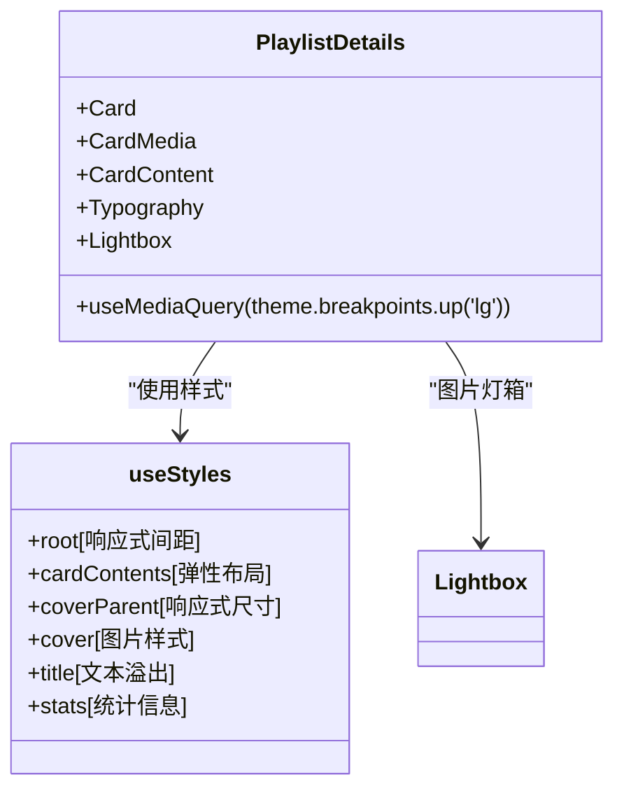

**图表来源**
- [ui/src/playlist/PlaylistDetails.jsx](file://ui/src/playlist/PlaylistDetails.jsx)

#### 元数据渲染流程
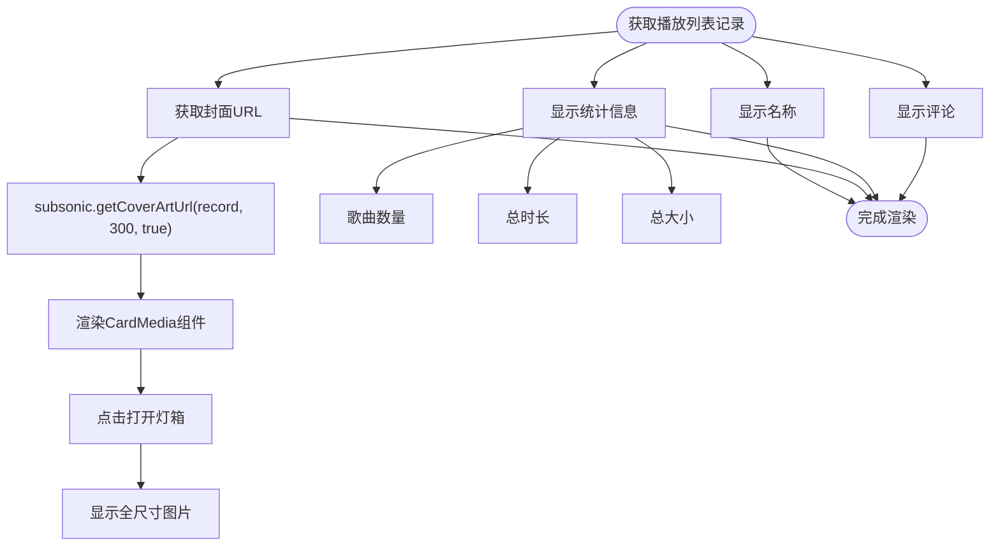

**图表来源**
- [ui/src/playlist/PlaylistDetails.jsx](file://ui/src/playlist/PlaylistDetails.jsx)
- [ui/src/subsonic/index.js](file://ui/src/subsonic/index.js)

**章节来源**
- [ui/src/playlist/PlaylistDetails.jsx](file://ui/src/playlist/PlaylistDetails.jsx)

### 播放列表歌曲列表
`PlaylistSongs`组件负责展示播放列表中的所有歌曲，并支持拖拽排序、批量操作和字段切换。

#### 歌曲列表组件结构
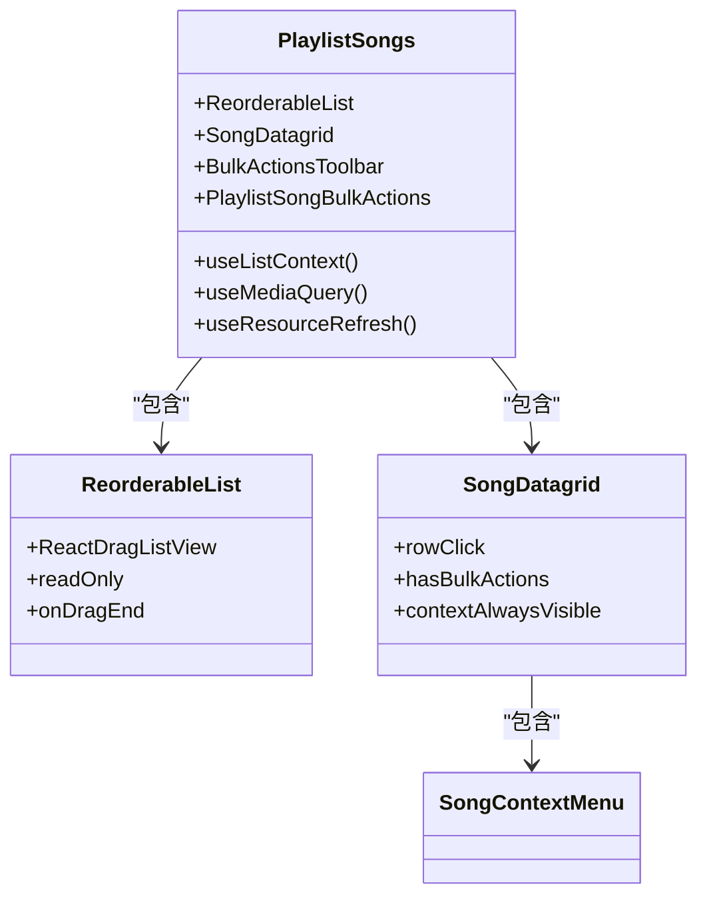

**图表来源**
- [ui/src/playlist/PlaylistSongs.jsx](file://ui/src/playlist/PlaylistSongs.jsx)

#### 数据交互与操作流程
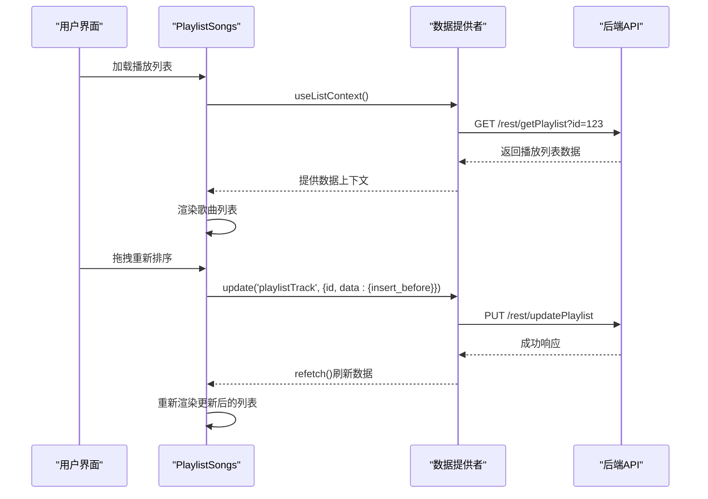

**图表来源**
- [ui/src/playlist/PlaylistSongs.jsx](file://ui/src/playlist/PlaylistSongs.jsx)
- [server/subsonic/playlists.go](file://server/subsonic/playlists.go)

**章节来源**
- [ui/src/playlist/PlaylistSongs.jsx](file://ui/src/playlist/PlaylistSongs.jsx)

### 播放列表操作功能
`PlaylistActions`组件提供了播放、下载、分享等交互功能，这些操作通过Redux动作与播放器和其他系统组件集成。

#### 操作功能组件结构
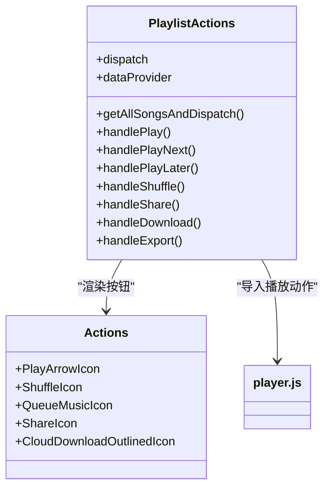

**图表来源**
- [ui/src/playlist/PlaylistActions.jsx](file://ui/src/playlist/PlaylistActions.jsx)

#### 与播放器的集成流程
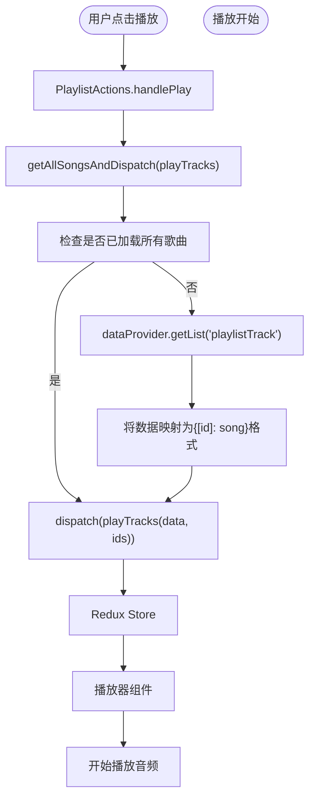

**图表来源**
- [ui/src/playlist/PlaylistActions.jsx](file://ui/src/playlist/PlaylistActions.jsx)
- [ui/src/actions/player.js](file://ui/src/actions/player.js)

**章节来源**
- [ui/src/playlist/PlaylistActions.jsx](file://ui/src/playlist/PlaylistActions.jsx)
- [ui/src/actions/player.js](file://ui/src/actions/player.js)

## 依赖分析
播放列表展示功能依赖于多个前端和后端组件，形成了一个复杂的依赖网络。

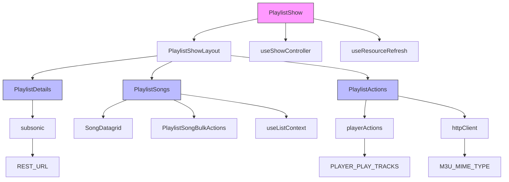

**图表来源**
- [ui/src/playlist/PlaylistShow.jsx](file://ui/src/playlist/PlaylistShow.jsx)
- [ui/src/playlist/PlaylistDetails.jsx](file://ui/src/playlist/PlaylistDetails.jsx)
- [ui/src/playlist/PlaylistSongs.jsx](file://ui/src/playlist/PlaylistSongs.jsx)
- [ui/src/playlist/PlaylistActions.jsx](file://ui/src/playlist/PlaylistActions.jsx)

**章节来源**
- [ui/src/playlist/PlaylistShow.jsx](file://ui/src/playlist/PlaylistShow.jsx)
- [ui/src/playlist/PlaylistDetails.jsx](file://ui/src/playlist/PlaylistDetails.jsx)
- [ui/src/playlist/PlaylistSongs.jsx](file://ui/src/playlist/PlaylistSongs.jsx)
- [ui/src/playlist/PlaylistActions.jsx](file://ui/src/playlist/PlaylistActions.jsx)

## 性能考虑
播放列表展示功能在性能方面有多个优化点，包括数据加载、缓存和懒加载策略。

### 数据加载与刷新
`useResourceRefresh`钩子用于监听服务器发送的SSE（Server-Sent Events）事件，当播放列表或歌曲数据发生变化时，自动刷新相关资源。

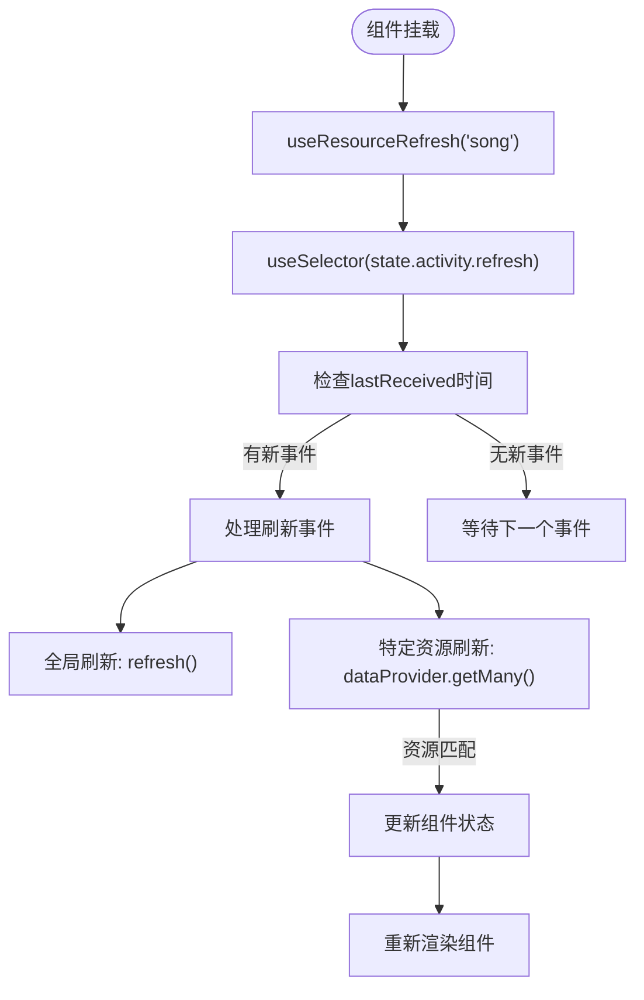

**图表来源**
- [ui/src/common/useResourceRefresh.jsx](file://ui/src/common/useResourceRefresh.jsx)

**章节来源**
- [ui/src/common/useResourceRefresh.jsx](file://ui/src/common/useResourceRefresh.jsx)

### 懒加载与分页
播放列表歌曲列表实现了分页加载，避免一次性加载大量数据。

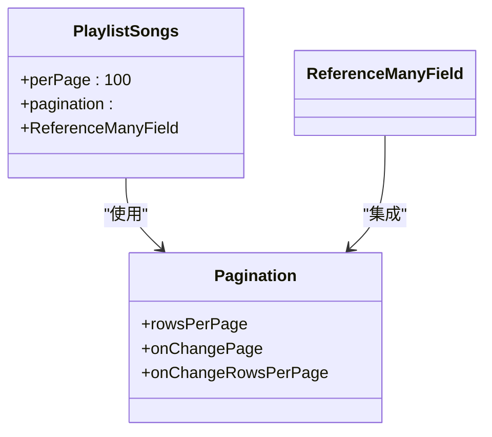

**图表来源**
- [ui/src/playlist/PlaylistShow.jsx](file://ui/src/playlist/PlaylistShow.jsx)

## 故障排除指南
本节提供播放列表功能常见问题的解决方案。

### 错误处理机制
播放列表组件实现了多层次的错误处理，包括API调用错误、数据加载错误和用户操作错误。

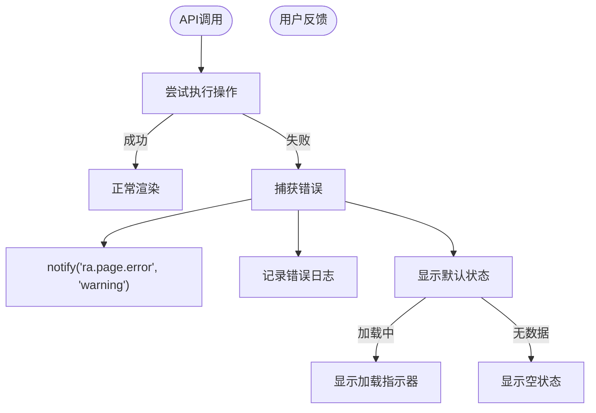

**章节来源**
- [ui/src/playlist/PlaylistSongs.jsx](file://ui/src/playlist/PlaylistSongs.jsx)
- [ui/src/playlist/PlaylistActions.jsx](file://ui/src/playlist/PlaylistActions.jsx)

### 常见问题与解决方案
| 问题 | 可能原因 | 解决方案 |
|------|---------|---------|
| 播放列表封面不显示 | 图片加载失败或路径错误 | 检查`subsonic.getCoverArtUrl`函数和网络请求 |
| 歌曲无法播放 | 音频文件路径错误或权限问题 | 验证媒体文件路径和服务器配置 |
| 拖拽排序不生效 | ReactDragListView配置错误 | 检查`nodeSelector`和`onDragEnd`回调函数 |
| 数据未实时更新 | SSE连接问题或事件监听器失效 | 检查`useResourceRefresh`钩子和服务器事件推送 |

**章节来源**
- [ui/src/playlist/PlaylistDetails.jsx](file://ui/src/playlist/PlaylistDetails.jsx)
- [ui/src/playlist/PlaylistSongs.jsx](file://ui/src/playlist/PlaylistSongs.jsx)
- [ui/src/common/useResourceRefresh.jsx](file://ui/src/common/useResourceRefresh.jsx)

## 结论
Navidrome的播放列表展示功能通过精心设计的组件架构和清晰的数据流，实现了高效、响应式的用户体验。前端使用React Admin框架简化了数据管理和UI渲染，而后端通过Subsonic API提供了稳定的数据服务。通过`useResourceRefresh`钩子实现了实时数据同步，通过分页和懒加载优化了性能表现。未来可以进一步优化图片懒加载、实现虚拟滚动以支持超大播放列表，并增强错误边界处理以提升应用稳定性。