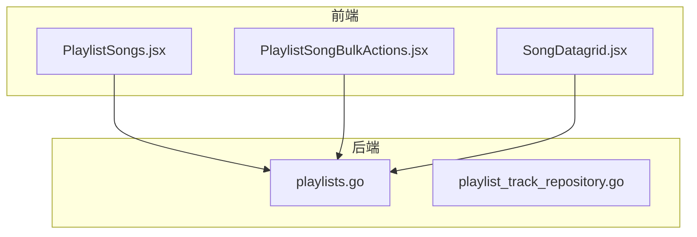
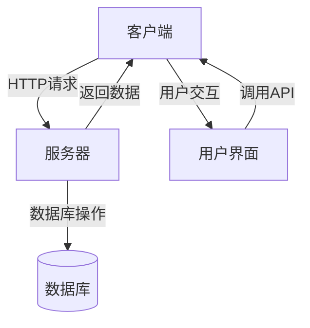
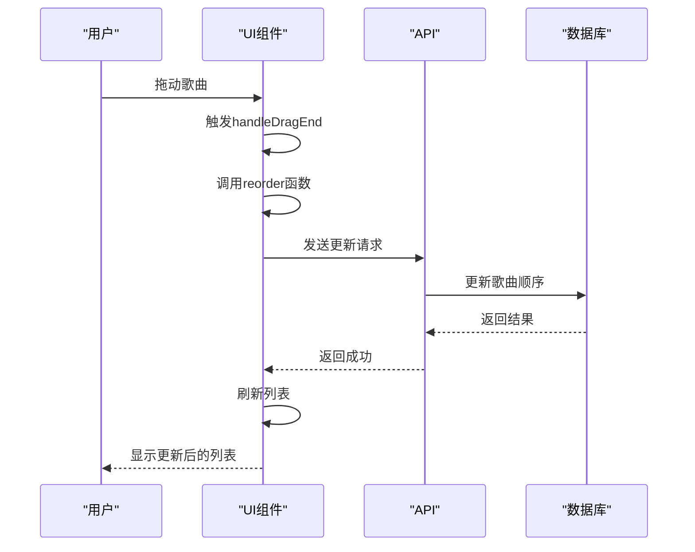
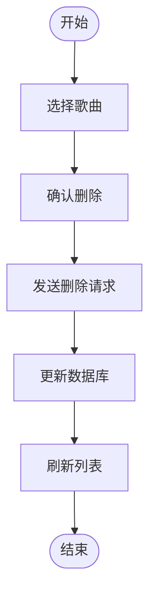
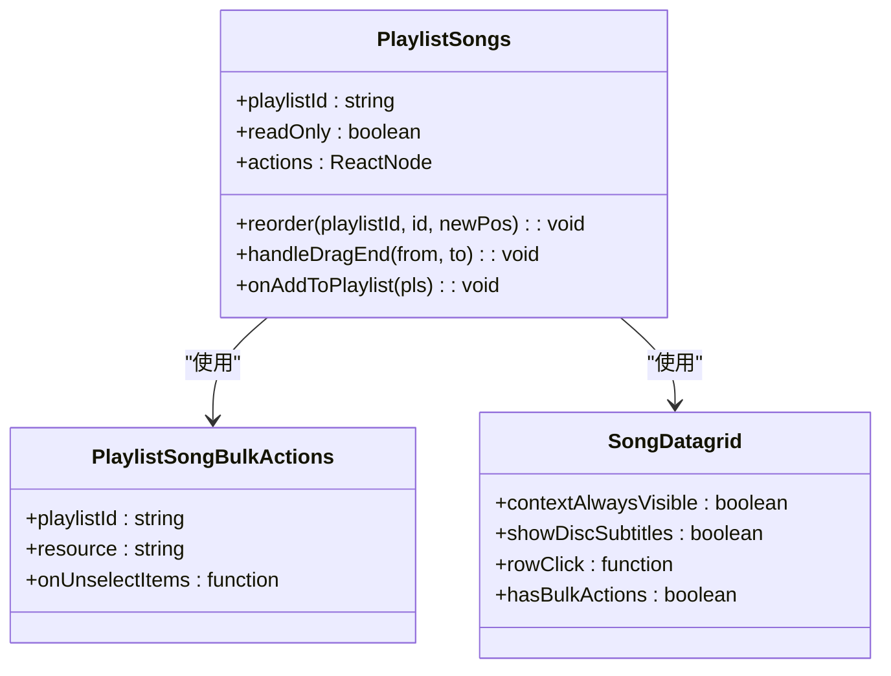
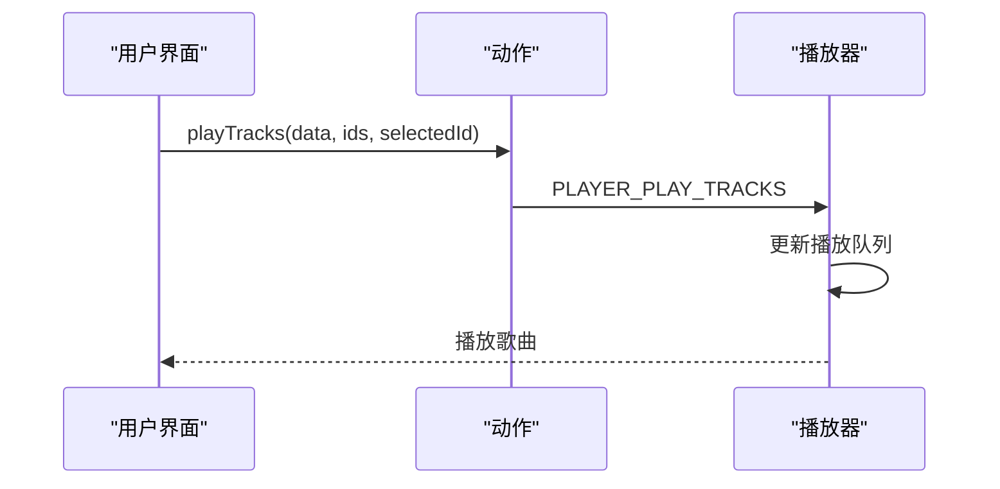
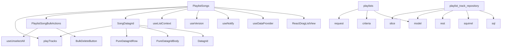
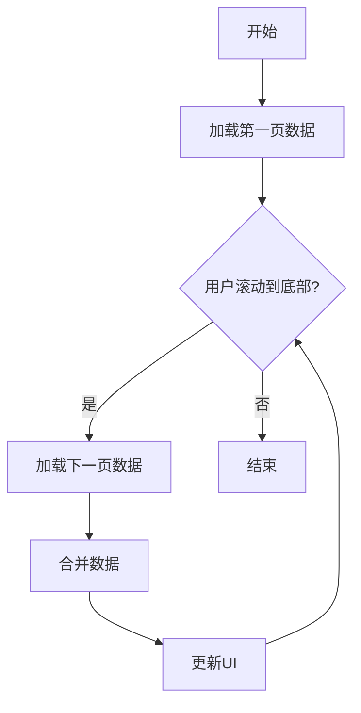

# 播放列表歌曲管理

<cite>
**本文档引用的文件**  
- [PlaylistSongs.jsx](file://ui/src/playlist/PlaylistSongs.jsx)
- [PlaylistSongBulkActions.jsx](file://ui/src/playlist/PlaylistSongBulkActions.jsx)
- [SongDatagrid.jsx](file://ui/src/common/SongDatagrid.jsx)
- [player.js](file://ui/src/actions/player.js)
- [useResourceRefresh.jsx](file://ui/src/common/useResourceRefresh.jsx)
- [playlists.go](file://core/playlists.go)
- [playlist_track_repository.go](file://persistence/playlist_track_repository.go)
- [PlaylistShow.jsx](file://ui/src/playlist/PlaylistShow.jsx)
</cite>

## 目录
1. [简介](#简介)
2. [项目结构](#项目结构)
3. [核心组件](#核心组件)
4. [架构概述](#架构概述)
5. [详细组件分析](#详细组件分析)
6. [依赖分析](#依赖分析)
7. [性能考虑](#性能考虑)
8. [故障排除指南](#故障排除指南)
9. [结论](#结论)

## 简介
本文档详细分析Navidrome播放列表歌曲管理功能的实现，重点关注PlaylistSongs组件。文档深入探讨了歌曲列表渲染、拖拽排序和批量操作的机制，详细说明了歌曲添加、删除、重新排序等功能的实现流程，以及与播放队列的集成方式。同时，文档还解释了大数据量下歌曲列表的性能优化策略，并提供了解决常见问题的建议。

## 项目结构
Navidrome的项目结构清晰，主要分为以下几个部分：
- **adapters**: 适配器层，用于与外部系统交互
- **cmd**: 命令行工具和主程序入口
- **conf**: 配置管理
- **core**: 核心业务逻辑
- **db**: 数据库相关代码
- **model**: 数据模型定义
- **persistence**: 数据持久化层
- **ui**: 用户界面代码，包含React组件
- **utils**: 工具函数

播放列表歌曲管理功能主要涉及`ui`目录下的前端组件和`core`、`persistence`目录下的后端逻辑。

**图表来源**  
- [PlaylistSongs.jsx](file://ui/src/playlist/PlaylistSongs.jsx)
- [playlists.go](file://core/playlists.go)

**章节来源**  
- [PlaylistSongs.jsx](file://ui/src/playlist/PlaylistSongs.jsx)
- [playlists.go](file://core/playlists.go)

## 核心组件
播放列表歌曲管理的核心组件包括：
- **PlaylistSongs**: 主要的播放列表歌曲显示和交互组件
- **PlaylistSongBulkActions**: 批量操作组件
- **SongDatagrid**: 歌曲数据网格组件
- **playlists.go**: 后端播放列表管理逻辑
- **playlist_track_repository.go**: 播放列表曲目持久化逻辑

这些组件共同实现了播放列表歌曲的显示、排序、添加、删除等核心功能。

**章节来源**  
- [PlaylistSongs.jsx](file://ui/src/playlist/PlaylistSongs.jsx)
- [playlists.go](file://core/playlists.go)
- [playlist_track_repository.go](file://persistence/playlist_track_repository.go)

## 架构概述
Navidrome的播放列表歌曲管理功能采用前后端分离的架构。前端使用React和Material-UI构建用户界面，后端使用Go语言处理业务逻辑和数据持久化。

**图表来源**  
- [PlaylistSongs.jsx](file://ui/src/playlist/PlaylistSongs.jsx)
- [playlists.go](file://core/playlists.go)

## 详细组件分析

### PlaylistSongs组件分析
PlaylistSongs组件是播放列表歌曲管理的核心UI组件，负责渲染歌曲列表、处理拖拽排序和批量操作。

#### 组件结构
PlaylistSongs组件使用React的函数组件和Hooks来管理状态和副作用。它主要依赖以下几个Hooks：
- `useCallback`: 用于记忆化函数，避免不必要的重新渲染
- `useEffect`: 用于处理副作用，如页面滚动和数据刷新
- `useMemo`: 用于记忆化计算结果，提高性能

#### 拖拽排序实现
拖拽排序功能通过`react-drag-listview`库实现。当用户拖动歌曲时，`handleDragEnd`回调函数被触发，它调用`reorder`函数来更新歌曲顺序。

**图表来源**  
- [PlaylistSongs.jsx](file://ui/src/playlist/PlaylistSongs.jsx#L137-L144)
- [playlists.go](file://core/playlists.go#L417-L469)

#### 批量操作实现
批量操作通过`PlaylistSongBulkActions`组件实现。该组件使用React-Admin的`BulkDeleteButton`来处理批量删除操作。

**图表来源**  
- [PlaylistSongBulkActions.jsx](file://ui/src/playlist/PlaylistSongBulkActions.jsx)
- [playlist_track_repository.go](file://persistence/playlist_track_repository.go#L211-L233)

**章节来源**  
- [PlaylistSongs.jsx](file://ui/src/playlist/PlaylistSongs.jsx)
- [PlaylistSongBulkActions.jsx](file://ui/src/playlist/PlaylistSongBulkActions.jsx)

### 歌曲添加和删除功能
歌曲的添加和删除功能通过调用后端API实现。添加歌曲时，前端发送包含歌曲ID的请求，后端将其添加到播放列表中。删除歌曲时，前端发送要删除的歌曲ID，后端从播放列表中移除这些歌曲。

**图表来源**  
- [PlaylistSongs.jsx](file://ui/src/playlist/PlaylistSongs.jsx)
- [PlaylistSongBulkActions.jsx](file://ui/src/playlist/PlaylistSongBulkActions.jsx)
- [SongDatagrid.jsx](file://ui/src/common/SongDatagrid.jsx)

**章节来源**  
- [PlaylistSongs.jsx](file://ui/src/playlist/PlaylistSongs.jsx)
- [playlist_track_repository.go](file://persistence/playlist_track_repository.go)

### 与播放队列的集成
播放列表歌曲管理功能与播放队列的集成通过`playTracks`动作实现。当用户点击歌曲时，`playTracks`动作被触发，将歌曲添加到播放队列中。

**图表来源**  
- [player.js](file://ui/src/actions/player.js#L70-L77)
- [PlaylistSongs.jsx](file://ui/src/playlist/PlaylistSongs.jsx#L226)

**章节来源**  
- [player.js](file://ui/src/actions/player.js)
- [PlaylistSongs.jsx](file://ui/src/playlist/PlaylistSongs.jsx)

## 依赖分析
播放列表歌曲管理功能涉及多个组件和模块之间的依赖关系。

**图表来源**  
- [PlaylistSongs.jsx](file://ui/src/playlist/PlaylistSongs.jsx)
- [playlists.go](file://core/playlists.go)
- [playlist_track_repository.go](file://persistence/playlist_track_repository.go)

**章节来源**  
- [PlaylistSongs.jsx](file://ui/src/playlist/PlaylistSongs.jsx)
- [playlists.go](file://core/playlists.go)
- [playlist_track_repository.go](file://persistence/playlist_track_repository.go)

## 性能考虑
在处理大量歌曲时，Navidrome采取了多种性能优化策略：

1. **分页加载**: 歌曲列表采用分页加载，每页默认显示100首歌曲，可选择250或500首。
2. **数据缓存**: 使用React-Admin的数据缓存机制，减少重复的API调用。
3. **虚拟滚动**: 虽然当前实现中未明确使用虚拟滚动，但可以通过自定义组件实现。
4. **批量操作优化**: 批量操作时，后端会一次性处理所有请求，减少数据库交互次数。

**图表来源**  
- [PlaylistShow.jsx](file://ui/src/playlist/PlaylistShow.jsx#L58)
- [useResourceRefresh.jsx](file://ui/src/common/useResourceRefresh.jsx)

## 故障排除指南
在使用播放列表歌曲管理功能时，可能会遇到以下常见问题：

### 排序状态丢失
**问题描述**: 拖拽排序后，刷新页面发现排序状态丢失。
**解决方案**: 
1. 确保后端正确保存了新的排序。
2. 检查API调用是否成功。
3. 确认前端是否正确处理了API响应。

**章节来源**  
- [playlists.go](file://core/playlists.go#L417-L469)
- [playlist_track_repository.go](file://persistence/playlist_track_repository.go#L235-L245)

### 批量操作反馈不及时
**问题描述**: 批量删除或添加歌曲时，UI反馈不及时。
**解决方案**:
1. 检查网络连接是否稳定。
2. 确认后端处理批量操作的性能。
3. 考虑增加加载状态提示。

**章节来源**  
- [PlaylistSongBulkActions.jsx](file://ui/src/playlist/PlaylistSongBulkActions.jsx)
- [playlist_track_repository.go](file://persistence/playlist_track_repository.go#L147-L167)

## 结论
Navidrome的播放列表歌曲管理功能设计合理，实现了歌曲列表渲染、拖拽排序、批量操作等核心功能。通过前后端分离的架构，系统具有良好的可维护性和扩展性。未来可以考虑引入虚拟滚动等更高级的性能优化技术，以支持更大规模的播放列表管理。