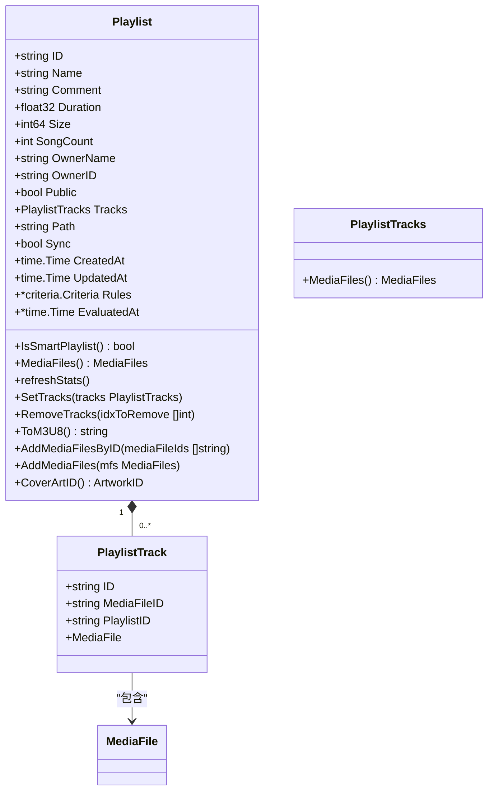
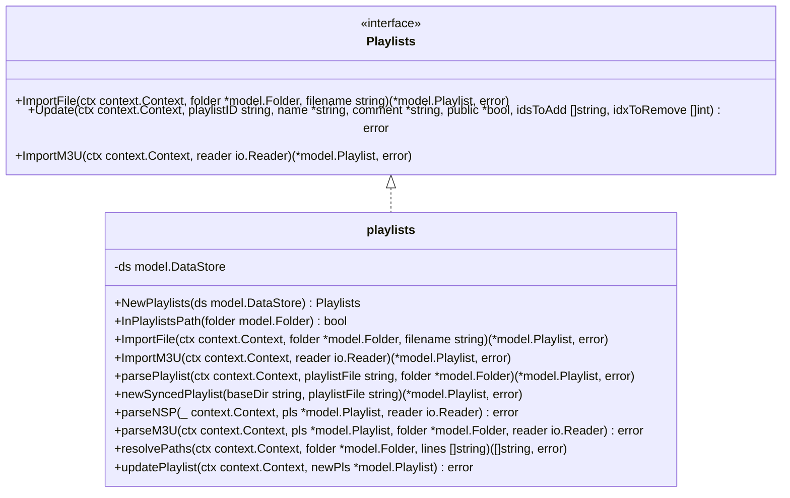
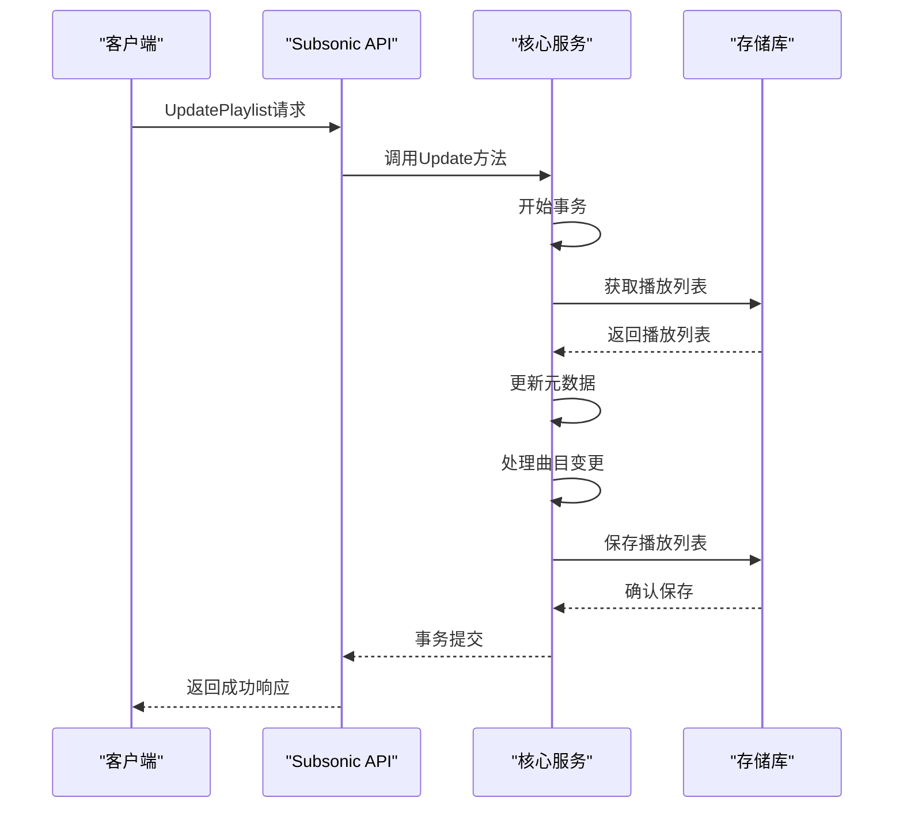
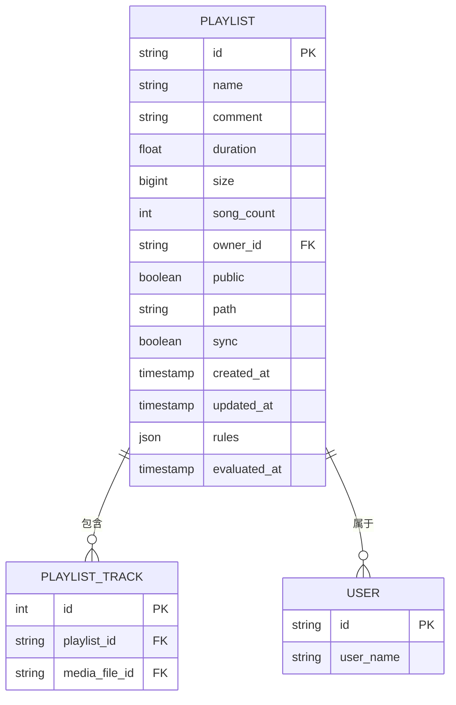
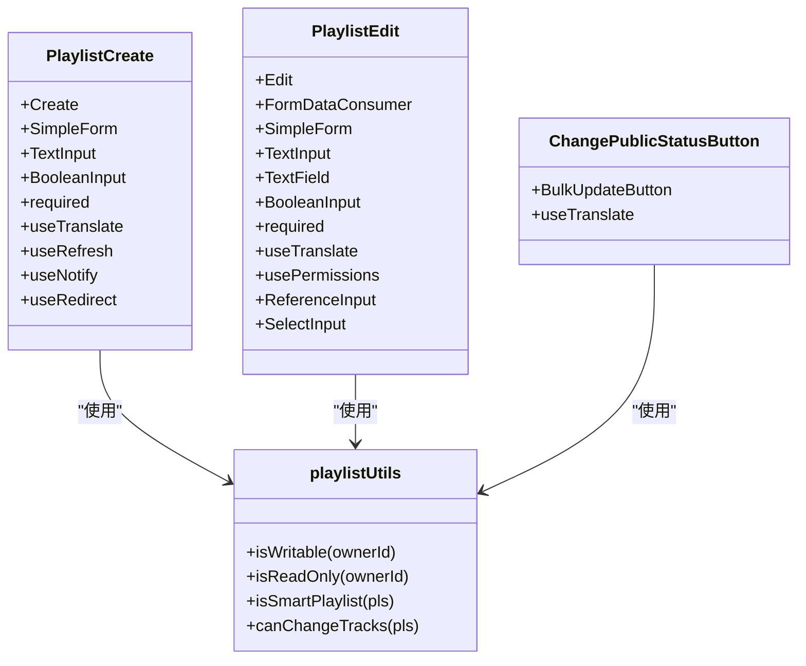

# 播放列表管理

<cite>
**本文档中引用的文件**  
- [playlist.go](file://model/playlist.go)
- [playlist_repository.go](file://persistence/playlist_repository.go)
- [playlist_track_repository.go](file://persistence/playlist_track_repository.go)
- [playlists.go](file://core/playlists.go)
- [playlists.go](file://server/subsonic/playlists.go)
- [phase_4_playlists.go](file://scanner/phase_4_playlists.go)
- [configuration.go](file://conf/configuration.go)
- [PlaylistCreate.jsx](file://ui/src/playlist/PlaylistCreate.jsx)
- [PlaylistEdit.jsx](file://ui/src/playlist/PlaylistEdit.jsx)
- [playlistUtils.js](file://ui/src/common/playlistUtils.js)
- [ChangePublicStatusButton.jsx](file://ui/src/playlist/ChangePublicStatusButton.jsx)
</cite>

## 目录
1. [简介](#简介)
2. [播放列表数据模型](#播放列表数据模型)
3. [核心功能实现](#核心功能实现)
4. [创建和编辑功能](#创建和编辑功能)
5. [权限控制和共享](#权限控制和共享)
6. [数据持久化](#数据持久化)
7. [前端实现](#前端实现)
8. [最佳实践](#最佳实践)

## 简介

Navidrome的播放列表管理功能提供了一套完整的解决方案，用于创建、编辑和管理音乐播放列表。系统支持标准播放列表和智能播放列表两种类型，允许用户根据自定义规则自动填充播放列表内容。播放列表功能包括元数据管理、权限控制、共享功能以及与后端存储的交互。

**Section sources**
- [playlist.go](file://model/playlist.go#L1-L30)
- [playlists.go](file://core/playlists.go#L1-L30)

## 播放列表数据模型

播放列表数据模型定义了播放列表的核心属性和结构。`Playlist`结构体包含了播放列表的基本信息，如名称、描述、所有者、公开状态等。



**Diagram sources**
- [playlist.go](file://model/playlist.go#L11-L110)

**Section sources**
- [playlist.go](file://model/playlist.go#L11-L110)

## 核心功能实现

播放列表的核心功能由`core/playlists.go`文件中的`Playlists`接口和其实现类提供。该模块负责处理播放列表的导入、更新和管理操作。



**Diagram sources**
- [playlists.go](file://core/playlists.go#L29-L41)

**Section sources**
- [playlists.go](file://core/playlists.go#L29-L488)

## 创建和编辑功能

播放列表的创建和编辑功能通过`Update`方法实现，该方法支持原子性操作，确保数据一致性。系统使用事务处理来保证操作的完整性。



**Diagram sources**
- [playlists.go](file://core/playlists.go#L417-L469)
- [playlists.go](file://server/subsonic/playlists.go#L122-L153)

**Section sources**
- [playlists.go](file://core/playlists.go#L417-L469)
- [playlists.go](file://server/subsonic/playlists.go#L122-L153)

## 权限控制和共享

播放列表的权限控制机制确保只有授权用户才能访问和修改播放列表。系统实现了基于所有者和管理员角色的访问控制。

```mermaid
classDiagram
class playlistRepository {
-userFilter() Sqlizer
-isWritable(playlistId string) bool
-Put(p *model.Playlist) error
-Delete(id string) error
-Update(id string, entity interface{}, cols ...string) error
}
class playlistTrackRepository {
-isTracksEditable() bool
-Add(mediaFileIds []string) (int, error)
-Delete(ids ...string) error
-DeleteAll() error
-Reorder(pos int, newPos int) error
}
playlistRepository --> playlistTrackRepository : "包含"
```

**Diagram sources**
- [playlist_repository.go](file://persistence/playlist_repository.go#L78-L524)
- [playlist_track_repository.go](file://persistence/playlist_track_repository.go#L143-L245)

**Section sources**
- [playlist_repository.go](file://persistence/playlist_repository.go#L78-L524)
- [playlist_track_repository.go](file://persistence/playlist_track_repository.go#L143-L245)

## 数据持久化

播放列表的数据持久化通过`persistence`包中的存储库实现。系统使用SQLite数据库存储播放列表信息，并通过`playlist_repository.go`文件中的`playlistRepository`结构体提供数据访问接口。



**Diagram sources**
- [playlist_repository.go](file://persistence/playlist_repository.go#L21-L529)
- [playlist_track_repository.go](file://persistence/playlist_track_repository.go#L13-L248)

**Section sources**
- [playlist_repository.go](file://persistence/playlist_repository.go#L21-L529)
- [playlist_track_repository.go](file://persistence/playlist_track_repository.go#L13-L248)

## 前端实现

播放列表的前端实现基于React框架，使用react-admin组件库构建用户界面。主要组件包括创建、编辑和管理播放列表的表单和按钮。



**Diagram sources**
- [PlaylistCreate.jsx](file://ui/src/playlist/PlaylistCreate.jsx#L1-L44)
- [PlaylistEdit.jsx](file://ui/src/playlist/PlaylistEdit.jsx#L1-L68)
- [playlistUtils.js](file://ui/src/common/playlistUtils.js#L1-L16)
- [ChangePublicStatusButton.jsx](file://ui/src/playlist/ChangePublicStatusButton.jsx#L1-L18)

**Section sources**
- [PlaylistCreate.jsx](file://ui/src/playlist/PlaylistCreate.jsx#L1-L44)
- [PlaylistEdit.jsx](file://ui/src/playlist/PlaylistEdit.jsx#L1-L68)
- [playlistUtils.js](file://ui/src/common/playlistUtils.js#L1-L16)
- [ChangePublicStatusButton.jsx](file://ui/src/playlist/ChangePublicStatusButton.jsx#L1-L18)

## 最佳实践

在使用Navidrome播放列表管理功能时，应遵循以下最佳实践：

1. **并发编辑处理**：系统通过事务机制确保数据一致性，避免并发编辑导致的数据冲突。
2. **数据验证**：在创建和编辑播放列表时，系统会对输入数据进行验证，确保数据的完整性和正确性。
3. **性能优化**：对于大型播放列表，系统采用分块处理策略，避免一次性操作大量数据导致性能问题。
4. **错误处理**：系统实现了完善的错误处理机制，能够捕获和处理各种异常情况，确保系统的稳定运行。
5. **配置管理**：通过配置文件可以灵活调整播放列表相关的行为，如自动导入、默认公开状态等。

**Section sources**
- [configuration.go](file://conf/configuration.go#L53-L57)
- [phase_4_playlists.go](file://scanner/phase_4_playlists.go#L1-L131)