# 播放列表组件

<cite>
**本文档中引用的文件**  
- [PlaylistShow.jsx](file://ui/src/playlist/PlaylistShow.jsx)
- [PlaylistSongs.jsx](file://ui/src/playlist/PlaylistSongs.jsx)
- [playlists.go](file://core/playlists.go)
- [playlist.go](file://model/playlist.go)
- [playlist_repository.go](file://persistence/playlist_repository.go)
- [playlists.go](file://server/subsonic/playlists.go)
- [phase_4_playlists.go](file://scanner/phase_4_playlists.go)
- [PlaylistCreate.jsx](file://ui/src/playlist/PlaylistCreate.jsx)
- [PlaylistEdit.jsx](file://ui/src/playlist/PlaylistEdit.jsx)
- [PlaylistActions.jsx](file://ui/src/playlist/PlaylistActions.jsx)
- [playlistUtils.js](file://ui/src/common/playlistUtils.js)
</cite>

## 目录
1. [简介](#简介)
2. [核心组件](#核心组件)
3. [播放列表状态管理](#播放列表状态管理)
4. [拖拽排序与批量操作](#拖拽排序与批量操作)
5. [持久化存储与同步流程](#持久化存储与同步流程)
6. [权限控制与共享功能](#权限控制与共享功能)
7. [性能优化与大数据量渲染](#性能优化与大数据量渲染)
8. [与播放器的集成](#与播放器的集成)

## 简介
Navidrome的播放列表组件提供了一套完整的播放列表管理功能，包括创建、编辑、歌曲管理、权限控制和共享等特性。系统支持普通播放列表和智能播放列表两种类型，其中智能播放列表基于规则自动更新内容。播放列表功能通过前端React组件与后端Go服务的紧密协作实现，利用React Admin框架构建用户界面，并通过Subsonic API协议与后端通信。

## 核心组件

### PlaylistShow组件
`PlaylistShow`是播放列表的主要展示组件，负责协调播放列表详情和歌曲列表的显示。该组件使用React Admin的`ShowContextProvider`和`useShowController`来管理播放列表的数据获取和状态。组件结构分为两个主要部分：上方的`PlaylistDetails`显示播放列表基本信息，下方的`ReferenceManyField`关联并显示播放列表中的歌曲。

**组件源码**
- [PlaylistShow.jsx](file://ui/src/playlist/PlaylistShow.jsx#L1-L77)

### PlaylistSongs组件
`PlaylistSongs`组件负责显示播放列表中的歌曲列表，并提供排序、批量操作等功能。组件使用`ReactDragListView`实现拖拽排序功能，通过`useListContext`获取列表数据和状态。对于只读播放列表（如智能播放列表），拖拽功能会被禁用。

**组件源码**
- [PlaylistSongs.jsx](file://ui/src/playlist/PlaylistSongs.jsx#L1-L265)

### 播放列表数据模型
播放列表的数据模型定义了播放列表的核心属性和行为。`Playlist`结构体包含基本信息如名称、注释、所有者、公开状态等，以及`Tracks`字段存储歌曲列表。`PlaylistTrack`结构体表示播放列表中的单个歌曲条目，包含歌曲ID、位置信息和关联的媒体文件数据。

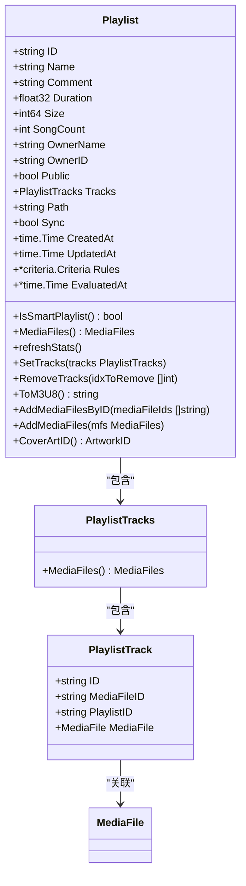

**数据模型源码**
- [playlist.go](file://model/playlist.go#L11-L154)

## 播放列表状态管理

### 前端状态管理
播放列表的前端状态管理主要依赖React的hooks和Redux。`useShowContext`用于获取播放列表的展示上下文，`useListContext`管理歌曲列表的状态。`useResourceRefresh`钩子用于监听资源变化并自动刷新数据，确保播放列表内容的实时性。

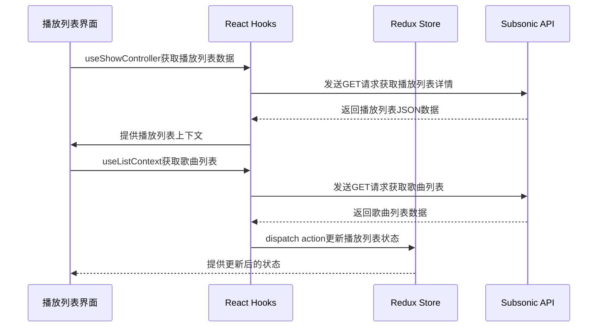

**状态管理源码**
- [PlaylistShow.jsx](file://ui/src/playlist/PlaylistShow.jsx#L27-L77)
- [PlaylistSongs.jsx](file://ui/src/playlist/PlaylistSongs.jsx#L94-L103)

### 后端状态管理
后端通过`core/playlists.go`中的`playlists`结构体管理播放列表的状态。`Update`方法处理播放列表的更新操作，包括名称、注释、公开状态的修改以及歌曲的添加和删除。方法使用事务确保数据一致性，并在更新后自动刷新播放列表的统计信息。

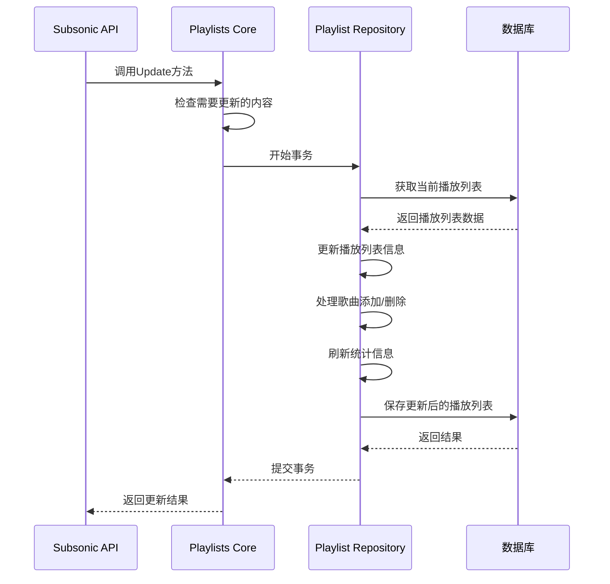

**后端状态管理源码**
- [playlists.go](file://core/playlists.go#L417-L469)
- [playlist_repository.go](file://persistence/playlist_repository.go#L112-L143)

## 拖拽排序与批量操作

### 拖拽排序实现
播放列表的拖拽排序功能通过`react-drag-listview`库实现。`PlaylistSongs`组件中的`ReorderableList`包装器根据播放列表的可写状态决定是否启用拖拽功能。当用户拖动歌曲时，`handleDragEnd`回调被触发，计算出新的位置并调用`reorder`函数通过API更新服务器端的数据。

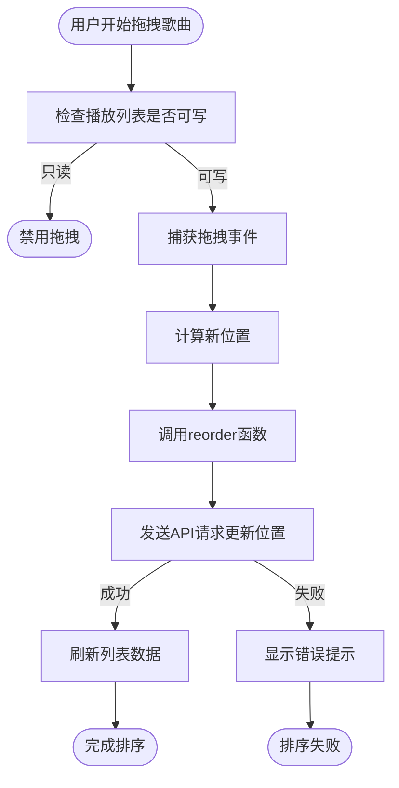

**拖拽排序源码**
- [PlaylistSongs.jsx](file://ui/src/playlist/PlaylistSongs.jsx#L86-L91)
- [PlaylistSongs.jsx](file://ui/src/playlist/PlaylistSongs.jsx#L119-L144)

### 批量操作实现
批量操作通过`PlaylistSongBulkActions`组件实现，允许用户对选中的多首歌曲执行添加到队列、下一首播放等操作。组件通过`selectedIds`获取选中的歌曲ID，然后调用相应的action函数处理批量操作。

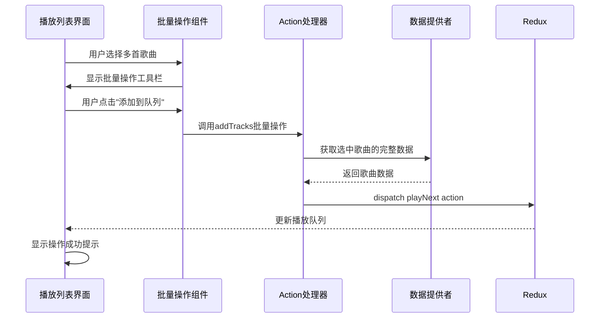

**批量操作源码**
- [PlaylistSongs.jsx](file://ui/src/playlist/PlaylistSongs.jsx#L213-L219)
- [PlaylistSongBulkActions.jsx](file://ui/src/playlist/PlaylistSongBulkActions.jsx)

## 持久化存储与同步流程

### 播放列表持久化
播放列表的持久化存储通过数据库实现，使用SQLite作为默认数据库。`playlist_repository.go`中的`Put`方法负责将播放列表数据保存到数据库，处理新创建和更新两种情况。对于智能播放列表，规则以JSON格式存储在`rules`字段中。

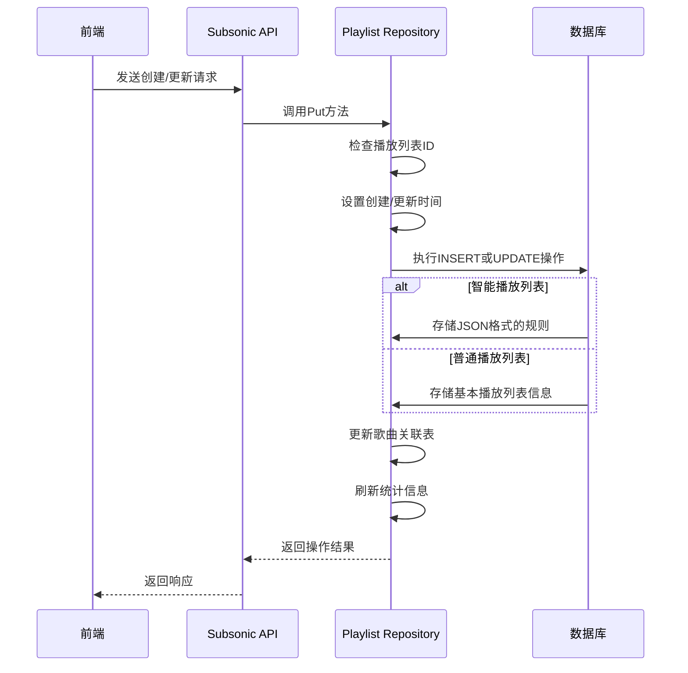

**持久化源码**
- [playlist_repository.go](file://persistence/playlist_repository.go#L112-L143)
- [playlists.go](file://core/playlists.go#L417-L469)

### 文件同步流程
Navidrome支持从M3U、NSP等文件格式自动导入播放列表。`phase_4_playlists.go`中的扫描器定期检查指定目录中的播放列表文件，当文件修改时间变化时自动重新导入。`InPlaylistsPath`函数根据配置决定哪些目录中的播放列表可以被导入。

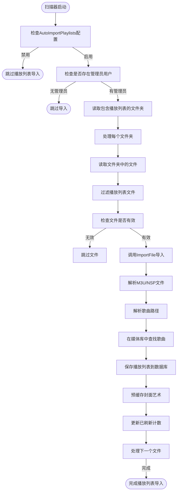

**同步流程源码**
- [phase_4_playlists.go](file://scanner/phase_4_playlists.go#L43-L116)
- [playlists.go](file://core/playlists.go#L56-L67)

## 权限控制与共享功能

### 权限控制实现
播放列表的权限控制基于用户所有权和公开状态实现。`playlistUtils.js`中的`isWritable`和`canChangeTracks`函数根据当前用户ID和播放列表所有者ID判断用户是否有修改权限。管理员用户可以修改所有播放列表，普通用户只能修改自己创建的播放列表。

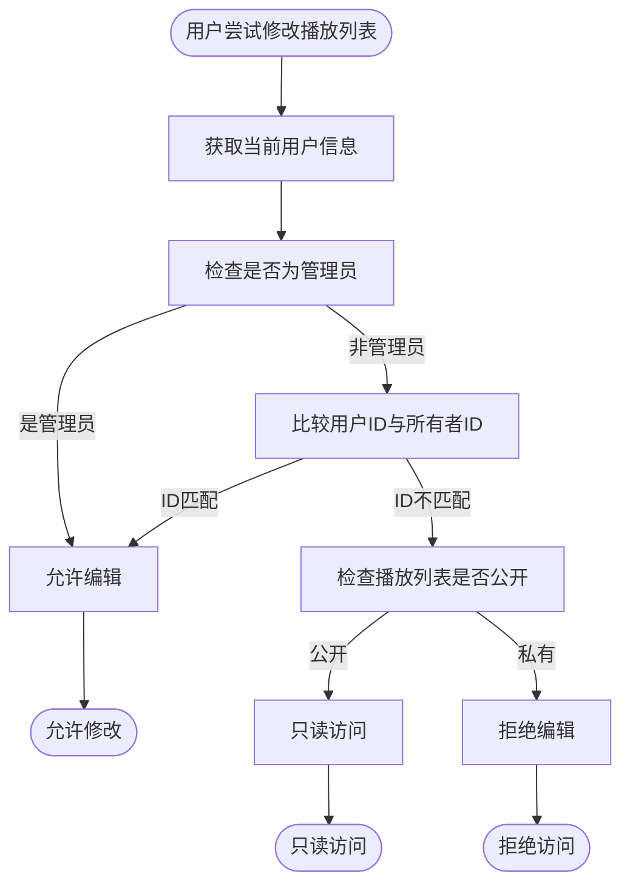

**权限控制源码**
- [playlistUtils.js](file://ui/src/common/playlistUtils.js#L1-L15)
- [playlist_repository.go](file://persistence/playlist_repository.go#L98-L109)

### 共享功能实现
播放列表的共享功能通过`ChangePublicStatusButton`组件实现，允许用户将播放列表设置为公开或私有。公开的播放列表可以被其他用户查看，但只有所有者才能修改。共享状态存储在数据库的`public`字段中，通过`BooleanInput`组件在界面上进行切换。

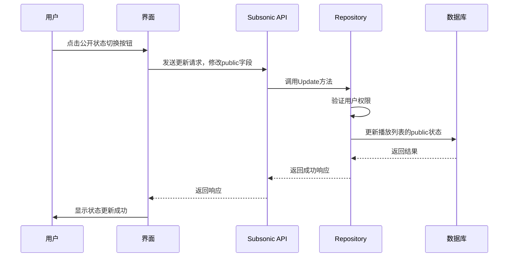

**共享功能源码**
- [PlaylistEdit.jsx](file://ui/src/playlist/PlaylistEdit.jsx#L53)
- [playlist_repository.go](file://persistence/playlist_repository.go#L448-L472)

## 性能优化与大数据量渲染

### 大数据量渲染优化
对于包含大量歌曲的播放列表，Navidrome采用分页加载策略。`PlaylistSongs`组件默认每页显示100首歌曲，用户可以通过分页控件加载更多内容。`perPage={100}`设置在`ReferenceManyField`中，有效避免了一次性加载过多数据导致的性能问题。

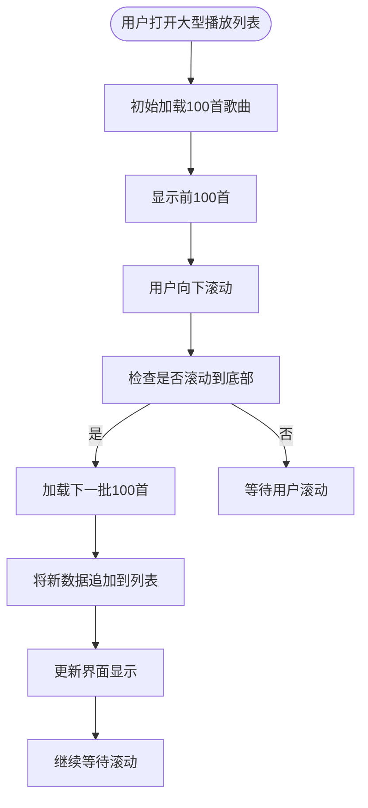

**分页加载源码**
- [PlaylistShow.jsx](file://ui/src/playlist/PlaylistShow.jsx#L44-L45)
- [PlaylistSongs.jsx](file://ui/src/playlist/PlaylistSongs.jsx#L243)

### 性能优化策略
Navidrome采用了多种性能优化策略来处理大型播放列表：
1. **懒加载**：歌曲数据在需要时才从服务器获取
2. **缓存机制**：频繁访问的数据被缓存以减少数据库查询
3. **批量操作**：对多首歌曲的操作合并为单个请求
4. **智能更新**：只在必要时才重新计算播放列表统计信息

```mermaid
flowchart TD
Start([播放列表性能优化]) --> LazyLoading["懒加载策略"]
Start --> Caching["缓存机制"]
Start --> BatchOperations["批量操作"]
Start --> SmartUpdates["智能更新"]
LazyLoading --> |描述| "仅在需要时加载数据，减少初始加载时间"
Caching --> |描述| "缓存封面艺术和频繁访问的数据"
BatchOperations --> |描述| "合并多个操作为单个API请求"
SmartUpdates --> |描述| "仅在必要时重新计算统计信息"
LazyLoading --> Implementation["实现: 分页加载、按需获取"]
Caching --> Implementation["实现: CoverArt缓存、数据预加载"]
BatchOperations --> Implementation["实现: 批量添加/删除歌曲"]
SmartUpdates --> Implementation["实现: 延迟统计更新"]
```

**性能优化源码**
- [playlist_repository.go](file://persistence/playlist_repository.go#L354-L384)
- [PlaylistSongs.jsx](file://ui/src/playlist/PlaylistSongs.jsx#L105-L108)

## 与播放器的集成

### 播放器集成实现
播放列表与播放器的集成通过`actions.js`中的播放控制函数实现。`PlaylistActions`组件提供"播放全部"、"下一首播放"等按钮，点击后调用相应的action函数将歌曲添加到播放队列。

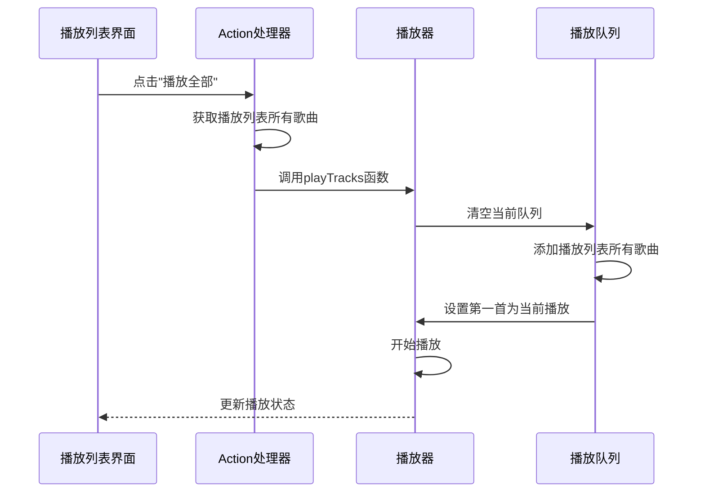

**集成源码**
- [PlaylistActions.jsx](file://ui/src/playlist/PlaylistActions.jsx#L73-L75)
- [actions.js](file://ui/src/actions/player.js)

### 播放控制功能
播放列表提供多种播放控制功能：
- **播放全部**：将整个播放列表添加到播放队列并开始播放
- **下一首播放**：将播放列表添加到当前播放之后
- **稍后播放**：将播放列表添加到播放队列末尾
- **随机播放**：随机排序播放列表中的歌曲

这些功能通过不同的action函数实现，允许用户灵活控制播放顺序。

**播放控制源码**
- [PlaylistActions.jsx](file://ui/src/playlist/PlaylistActions.jsx#L73-L87)
- [player.js](file://ui/src/actions/player.js)