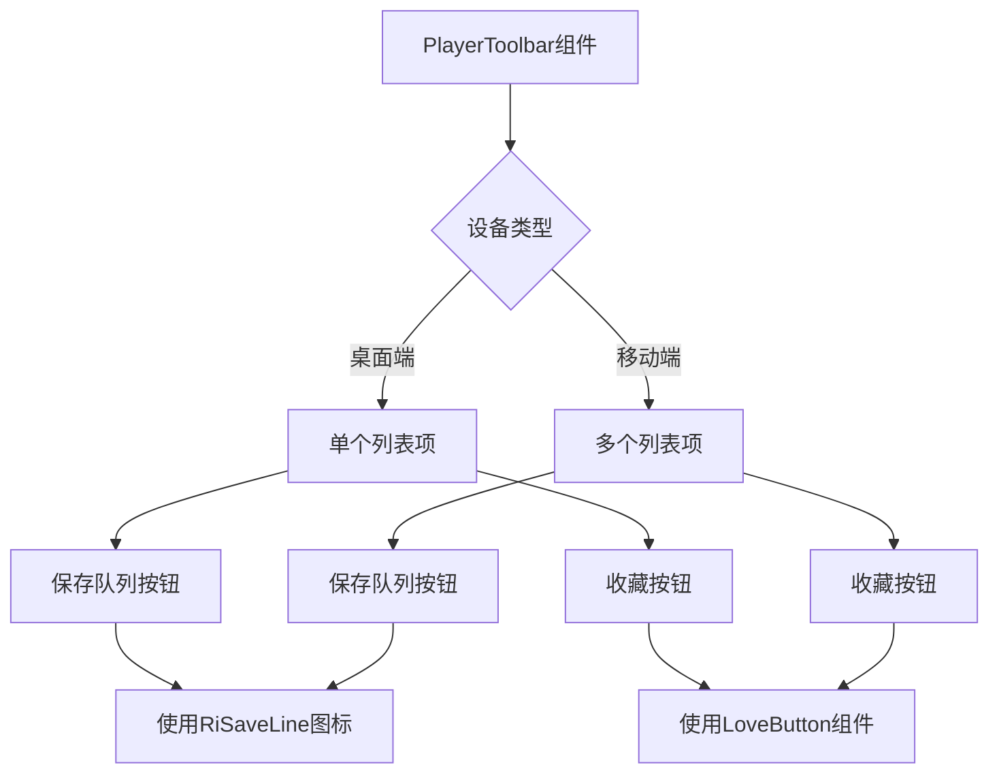
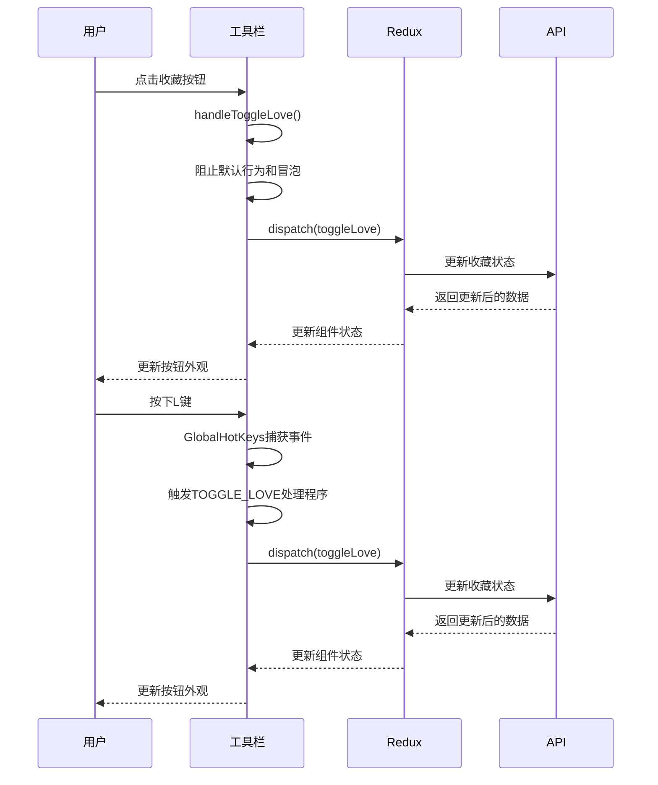
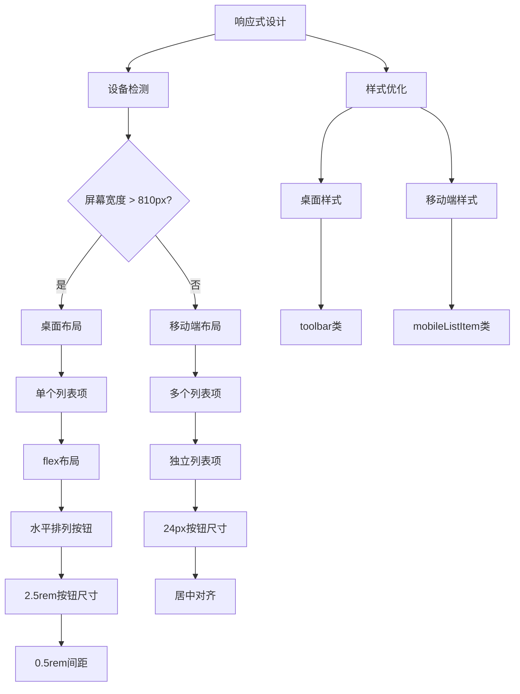
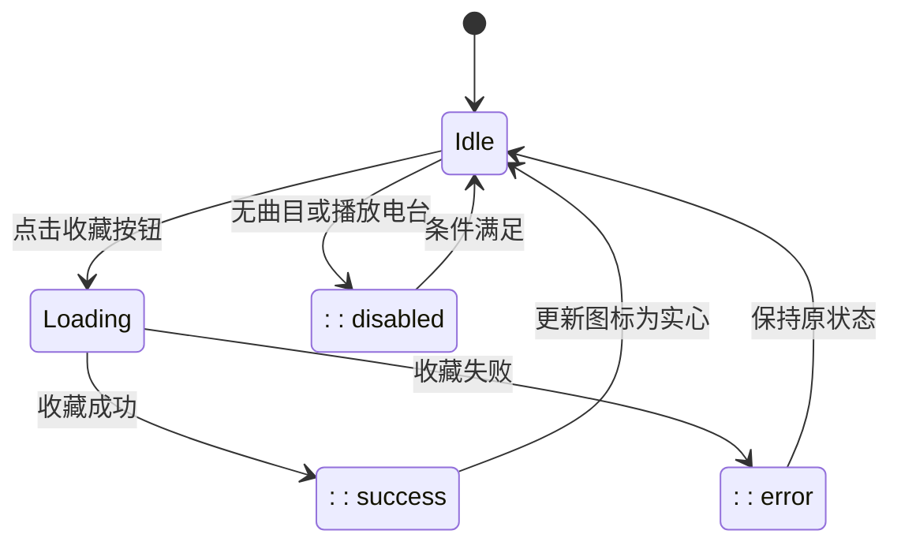
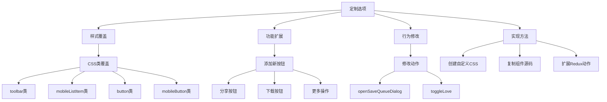
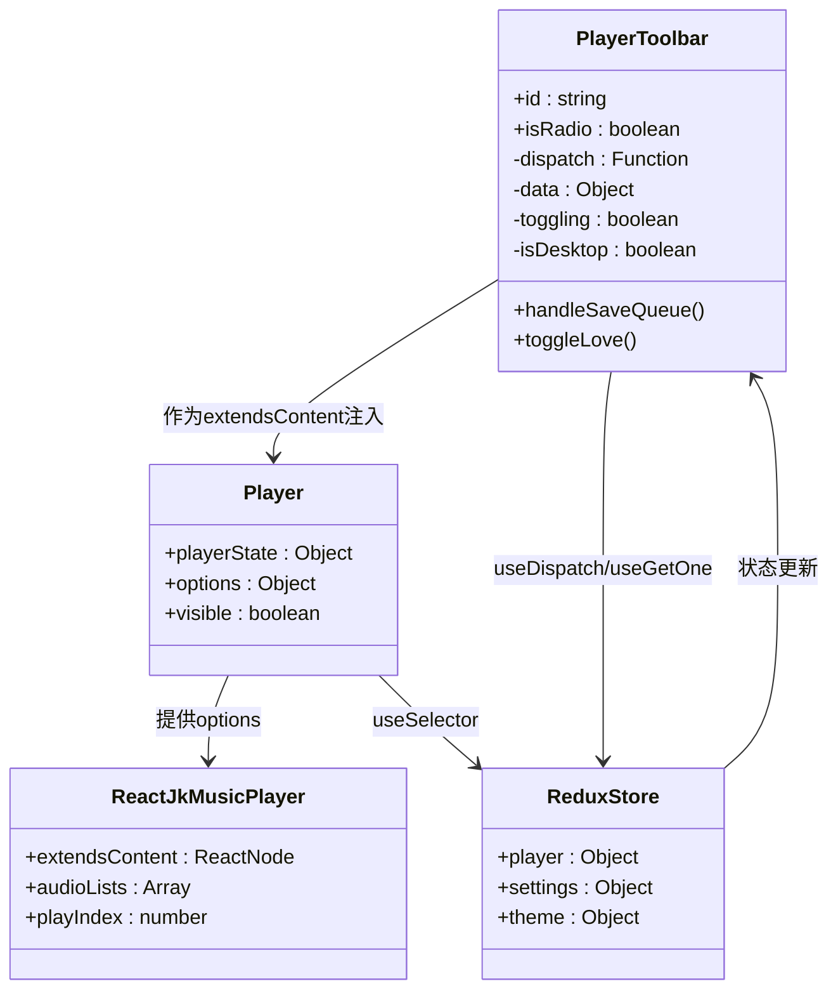
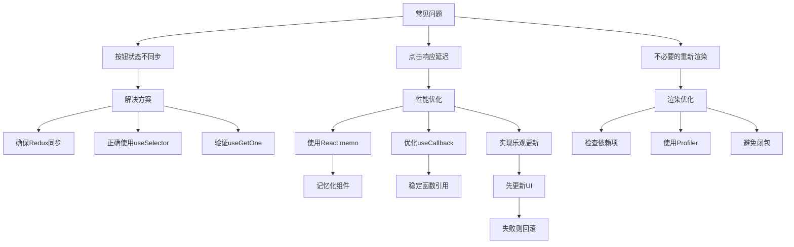

# 播放器工具栏

<cite>
**本文档中引用的文件**  
- [PlayerToolbar.jsx](file://ui/src/audioplayer/PlayerToolbar.jsx)
- [Player.jsx](file://ui/src/audioplayer/Player.jsx)
- [player.js](file://ui/src/actions/player.js)
- [playerReducer.js](file://ui/src/reducers/playerReducer.js)
- [hotkeys.js](file://ui/src/hotkeys.js)
- [LoveButton.jsx](file://ui/src/common/LoveButton.jsx)
- [styles.js](file://ui/src/audioplayer/styles.js)
</cite>

## 目录
1. [简介](#简介)
2. [UI结构与布局](#ui结构与布局)
3. [交互逻辑与状态管理](#交互逻辑与状态管理)
4. [响应式设计](#响应式设计)
5. [用户交互反馈机制](#用户交互反馈机制)
6. [工具栏定制与样式覆盖](#工具栏定制与样式覆盖)
7. [状态绑定与代码集成](#状态绑定与代码集成)
8. [常见问题与性能优化](#常见问题与性能优化)
9. [结论](#结论)

## 简介

播放器工具栏是Navidrome音乐播放器界面中的关键组件，为用户提供对播放控制的核心操作。该工具栏集成了保存队列和收藏歌曲等重要功能，通过简洁直观的界面设计提升了用户体验。工具栏的设计充分考虑了桌面端和移动端的不同使用场景，实现了良好的响应式适配。作为播放器功能的重要组成部分，它与播放器核心状态紧密集成，确保了用户操作与播放状态的实时同步。

**Section sources**
- [PlayerToolbar.jsx](file://ui/src/audioplayer/PlayerToolbar.jsx#L1-L121)

## UI结构与布局

播放器工具栏组件采用灵活的布局策略，根据设备类型动态调整其显示方式。在桌面端，工具栏将所有按钮集中显示在一个列表项中，实现紧凑而高效的布局；而在移动端，则将每个按钮分别放置在独立的列表项中，以适应较小的屏幕空间并提供更好的触摸体验。

工具栏主要包含两个核心功能按钮：保存队列按钮和收藏按钮。保存队列按钮使用RiSaveLine图标，允许用户将当前播放队列保存为播放列表；收藏按钮则通过LoveButton组件实现，提供直观的收藏/取消收藏功能。这些按钮通过Material-UI的IconButton组件进行包装，确保了一致的视觉风格和交互体验。

组件通过useMediaQuery钩子检测屏幕尺寸，当宽度大于810px时判定为桌面端，否则为移动端。这种基于CSS媒体查询的响应式设计确保了在各种设备上都能提供最佳的用户体验。工具栏的整体布局采用flex显示模式，通过gap属性控制按钮间的间距，实现了现代化的间距管理。

**Diagram sources**
- [PlayerToolbar.jsx](file://ui/src/audioplayer/PlayerToolbar.jsx#L58-L120)

**Section sources**
- [PlayerToolbar.jsx](file://ui/src/audioplayer/PlayerToolbar.jsx#L1-L121)

## 交互逻辑与状态管理

播放器工具栏的交互逻辑建立在React的函数组件和Hooks机制之上，通过useDispatch和useGetOne等React-Redux和React-Admin提供的钩子实现与应用状态的深度集成。组件的核心交互功能包括保存队列和收藏歌曲，这些操作都通过Redux动作进行管理，确保了状态变更的可预测性和可追踪性。

收藏功能的实现依赖于useToggleLove自定义钩子，该钩子返回一个切换收藏状态的函数和一个表示当前是否正在处理的布尔值。当用户点击收藏按钮时，handleToggleLove事件处理器会被触发，它会阻止默认行为和事件冒泡，然后调用toggleLove函数来更新歌曲的收藏状态。这种设计模式确保了用户交互的流畅性和可靠性。

保存队列功能通过handleSaveQueue事件处理器实现，该处理器会分发openSaveQueueDialog动作，触发保存队列对话框的显示。这个过程同样遵循Redux的单向数据流原则，通过动作分发来改变应用状态，而不是直接修改组件状态。

工具栏还集成了键盘快捷键支持，通过GlobalHotKeys组件监听全局键盘事件。当用户按下"L"键时（在启用收藏功能的情况下），会触发收藏操作。这种键盘快捷键的支持大大提升了高级用户的操作效率。

**Diagram sources**
- [PlayerToolbar.jsx](file://ui/src/audioplayer/PlayerToolbar.jsx#L58-L120)
- [hotkeys.js](file://ui/src/hotkeys.js#L1-L17)

**Section sources**
- [PlayerToolbar.jsx](file://ui/src/audioplayer/PlayerToolbar.jsx#L1-L121)
- [hotkeys.js](file://ui/src/hotkeys.js#L1-L17)

## 响应式设计

播放器工具栏的响应式设计是其用户体验的关键优势之一。通过useMediaQuery钩子，组件能够实时检测视口尺寸的变化，并根据预设的断点调整其布局和样式。这种基于React的响应式方案避免了传统CSS媒体查询的局限性，提供了更灵活的状态管理和更精确的控制能力。

在样式定义方面，组件使用Material-UI的makeStyles钩子创建了针对不同设备优化的CSS类。桌面端样式(classes.toolbar)采用flex布局，将所有按钮水平排列，并通过gap属性设置0.5rem的间距。移动端样式(classes.mobileListItem)则为每个按钮创建独立的列表项，确保在触摸屏上具有足够的点击区域。

按钮本身的样式也根据设备类型进行了优化。桌面端按钮(classes.button)设置为2.5rem的固定尺寸，提供舒适的点击体验；移动端按钮(classes.mobileButton)则缩小到24px的正方形，更适合小屏幕设备。这种精细化的尺寸调整确保了在不同设备上都能提供一致且舒适的交互体验。

值得注意的是，工具栏的响应式设计不仅仅局限于布局变化，还包括了交互模式的调整。在桌面端，用户可以同时看到所有功能按钮，便于快速访问；而在移动端，分离的布局减少了误触的可能性，提高了操作的准确性。这种设计哲学体现了对不同使用场景的深入理解。

**Diagram sources**
- [PlayerToolbar.jsx](file://ui/src/audioplayer/PlayerToolbar.jsx#L13-L56)

**Section sources**
- [PlayerToolbar.jsx](file://ui/src/audioplayer/PlayerToolbar.jsx#L1-L121)

## 用户交互反馈机制

播放器工具栏通过多种机制为用户提供即时的交互反馈，确保用户能够清晰地了解操作结果和当前状态。最直观的反馈来自按钮的视觉变化：收藏按钮会根据歌曲的收藏状态在实心和空心心形图标之间切换，这种视觉反馈立即告知用户操作是否成功。

对于可能需要较长时间处理的操作，工具栏提供了加载状态指示。当收藏状态正在更新时，按钮会显示一个旋转的进度指示器，防止用户重复点击。这种加载反馈通过toggling状态变量控制，确保了在异步操作完成前用户界面保持响应性。

禁用状态是另一种重要的反馈机制。工具栏中的按钮在特定条件下会被禁用，例如当没有当前播放曲目(id为空)或正在播放电台(isRadio为true)时。这种状态管理通过disabled属性实现，不仅防止了无效操作，还通过视觉上的灰化效果向用户传达了当前不可用的状态。

键盘快捷键的反馈机制也值得一提。当用户使用"L"键切换收藏状态时，虽然没有额外的视觉反馈，但按钮状态的即时更新提供了足够的确认信息。这种设计遵循了"操作即反馈"的原则，确保了键盘和鼠标操作在体验上的一致性。

此外，工具栏还通过事件冒泡的阻止机制提供了交互完整性。在处理收藏操作时，e.stopPropagation()的调用防止了事件向父组件传播，避免了可能的意外行为。这种细节处理体现了对用户体验的深入考虑。

**Diagram sources**
- [PlayerToolbar.jsx](file://ui/src/audioplayer/PlayerToolbar.jsx#L58-L120)

**Section sources**
- [PlayerToolbar.jsx](file://ui/src/audioplayer/PlayerToolbar.jsx#L1-L121)

## 工具栏定制与样式覆盖

Navidrome播放器工具栏提供了良好的可定制性，允许开发者通过多种方式修改其外观和行为。最直接的定制方式是通过覆盖CSS类来修改样式。由于组件使用Material-UI的makeStyles钩子创建样式，开发者可以通过创建自定义主题或直接注入CSS规则来覆盖默认样式。

对于更深层次的定制，开发者可以复制PlayerToolbar组件的源代码并进行修改。这种"复制-修改"的方法提供了最大的灵活性，允许添加新功能、修改布局或集成第三方服务。例如，可以添加一个分享按钮、修改按钮顺序或集成新的音乐服务。

样式覆盖的具体实现可以通过创建自定义CSS文件并导入到应用中完成。开发者可以针对特定的CSS类（如toolbar、mobileListItem、button等）定义新的样式规则。由于这些类名是通过makeStyles生成的，建议使用更具体的选择器或!important声明来确保覆盖优先级。

除了视觉样式，工具栏的行为也可以通过修改相关动作和钩子进行定制。例如，可以修改openSaveQueueDialog动作的行为，使其保存到不同的位置或添加额外的元数据。这种基于Redux架构的可扩展性使得功能定制变得相对简单。

值得注意的是，任何定制都应该遵循Navidrome的整体设计语言，保持与其他界面元素的一致性。过度的定制可能会影响用户体验的连贯性，因此建议在进行重大修改前充分考虑其对整体用户体验的影响。

**Diagram sources**
- [PlayerToolbar.jsx](file://ui/src/audioplayer/PlayerToolbar.jsx#L13-L56)

**Section sources**
- [PlayerToolbar.jsx](file://ui/src/audioplayer/PlayerToolbar.jsx#L1-L121)
- [styles.js](file://ui/src/audioplayer/styles.js#L1-L94)

## 状态绑定与代码集成

播放器工具栏与Navidrome应用的状态管理系统深度集成，通过Redux和React-Redux的机制实现状态的双向绑定。组件通过useDispatch钩子获取dispatch函数，用于分发各种动作；通过useGetOne钩子从数据存储中获取当前播放歌曲的详细信息。

状态绑定的核心在于props的传递和状态的订阅。PlayerToolbar组件接收id和isRadio作为props，这些props由父组件Player根据播放器状态动态提供。当播放状态发生变化时，这些props会自动更新，触发工具栏的重新渲染。

在代码集成方面，工具栏作为Player组件的扩展内容(extendsContent)被注入到第三方音乐播放器组件ReactJkMusicPlayer中。这种设计模式实现了关注点分离，将播放器核心功能与UI组件解耦，提高了代码的可维护性和可测试性。

工具栏与播放器核心的状态同步通过一系列精心设计的动作和选择器实现。例如，当用户收藏一首歌曲时，toggleLove动作会被分发，这个动作最终会更新Redux store中的歌曲状态，然后通过useGetOne钩子反映到工具栏的UI上。这种单向数据流确保了状态的一致性和可预测性。

**Diagram sources**
- [PlayerToolbar.jsx](file://ui/src/audioplayer/PlayerToolbar.jsx#L58-L120)
- [Player.jsx](file://ui/src/audioplayer/Player.jsx#L1-L319)

**Section sources**
- [PlayerToolbar.jsx](file://ui/src/audioplayer/PlayerToolbar.jsx#L1-L121)
- [Player.jsx](file://ui/src/audioplayer/Player.jsx#L1-L319)
- [playerReducer.js](file://ui/src/reducers/playerReducer.js#L1-L213)

## 常见问题与性能优化

在使用播放器工具栏时，可能会遇到一些常见问题，如按钮状态不同步、点击响应延迟等。这些问题通常源于状态管理的复杂性或网络请求的延迟。解决按钮状态不同步的关键是确保Redux store、组件状态和UI之间的同步。通过正确使用useSelector和useGetOne钩子，可以确保组件始终反映最新的应用状态。

点击响应延迟问题可能由多个因素引起，包括网络延迟、状态更新的批处理或不必要的重新渲染。性能优化的第一步是使用React的React.memo对工具栏组件进行记忆化，避免在props未变化时进行不必要的重新渲染。此外，确保useCallback钩子正确使用，可以防止事件处理器的重复创建。

另一个重要的优化点是数据获取的效率。useGetOne钩子可能会触发网络请求，如果频繁调用会影响性能。通过合理使用React-Admin的数据获取缓存机制，可以减少重复的网络请求，提高响应速度。同时，确保在组件卸载时正确清理副作用，可以避免内存泄漏。

对于收藏功能，可以实现乐观更新模式，即在发送网络请求前先更新UI状态，假设操作会成功。如果请求失败，则回滚状态并显示错误信息。这种模式可以显著提升用户感知的响应速度，特别是在网络条件不佳的情况下。

最后，建议定期审查工具栏的依赖项和重新渲染行为。使用React DevTools的Profiler可以识别性能瓶颈，帮助开发者做出针对性的优化。通过这些措施，可以确保播放器工具栏在各种使用场景下都能提供流畅的用户体验。

**Diagram sources**
- [PlayerToolbar.jsx](file://ui/src/audioplayer/PlayerToolbar.jsx#L58-L120)

**Section sources**
- [PlayerToolbar.jsx](file://ui/src/audioplayer/PlayerToolbar.jsx#L1-L121)

## 结论

播放器工具栏作为Navidrome音乐播放器的核心UI组件，通过精心设计的架构和实现，为用户提供了一流的播放控制体验。其响应式设计确保了在各种设备上都能提供最佳的用户体验，而与Redux状态管理系统的深度集成则保证了状态的一致性和可预测性。

工具栏的模块化设计和清晰的职责划分使其易于维护和扩展。通过使用React Hooks和Material-UI等现代前端技术，组件实现了高性能和良好的可访问性。键盘快捷键的支持进一步提升了高级用户的操作效率。

对于开发者而言，工具栏提供了足够的可定制性，允许通过样式覆盖或功能扩展来满足特定需求。同时，其遵循的最佳实践和设计模式为其他组件的开发提供了有价值的参考。

总的来说，播放器工具栏不仅是功能性的播放控制界面，更是Navidrome整体用户体验的重要组成部分。通过对细节的关注和对性能的持续优化，它成功地平衡了功能性、美观性和可用性，为用户提供了愉悦的音乐播放体验。