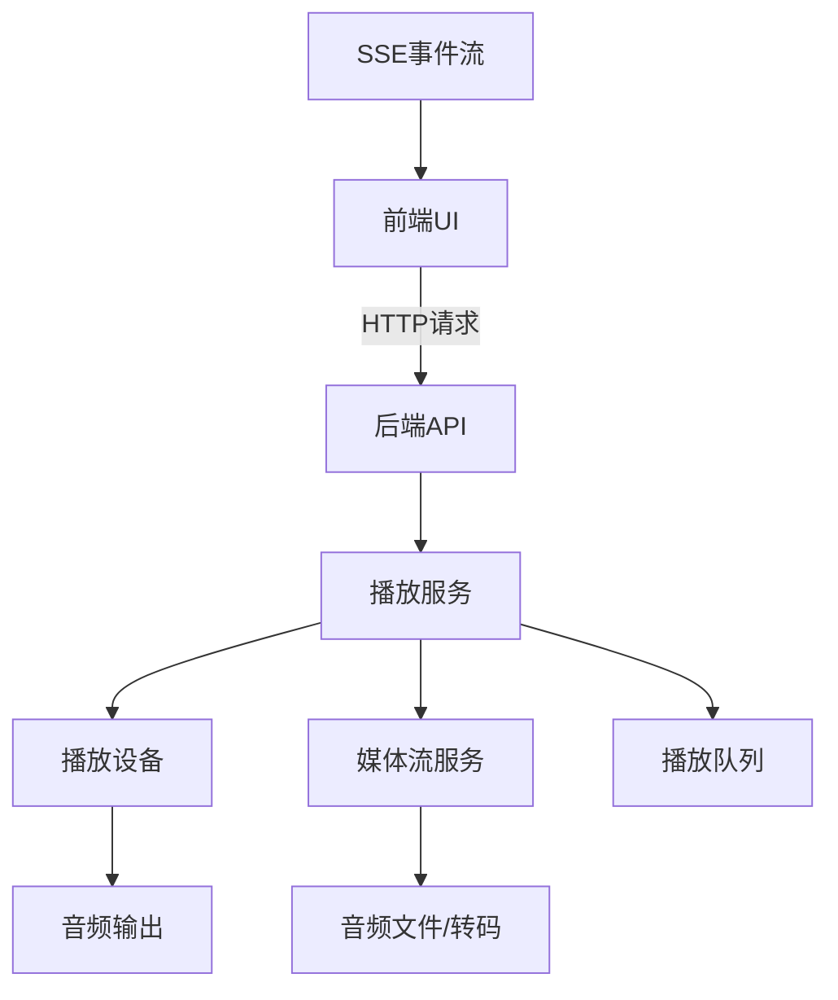
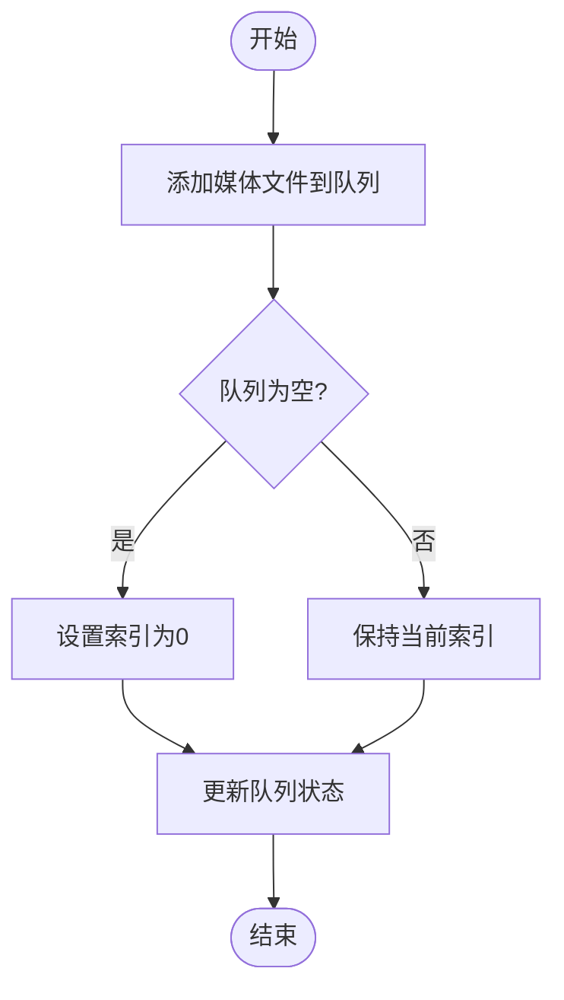
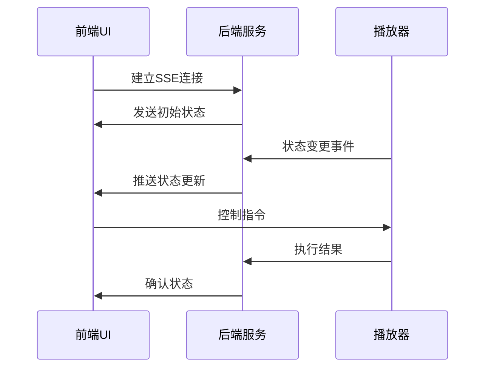
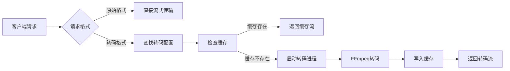
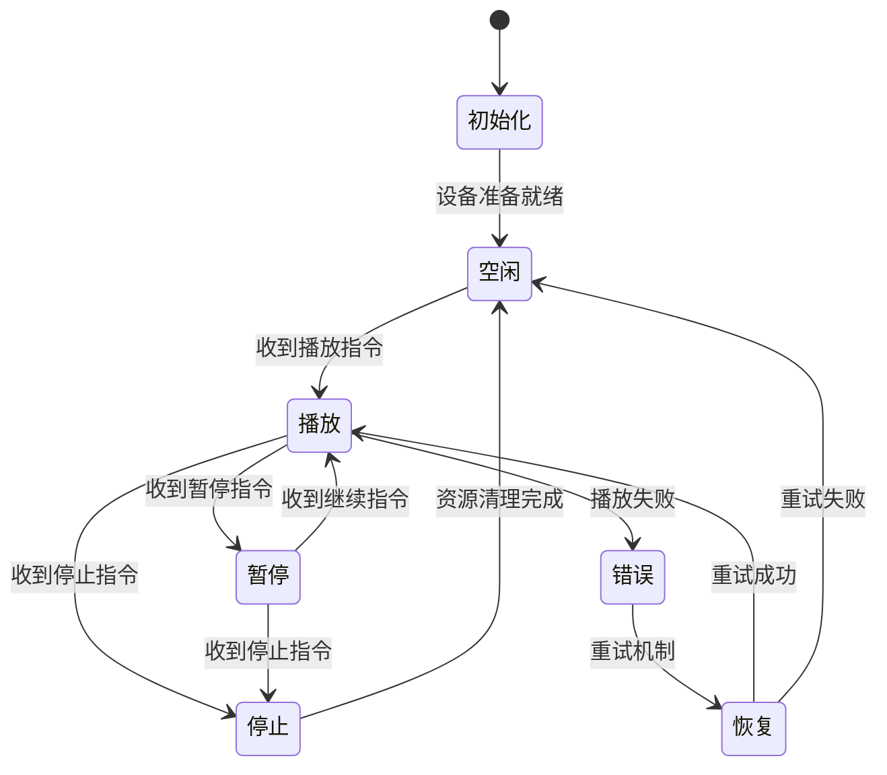
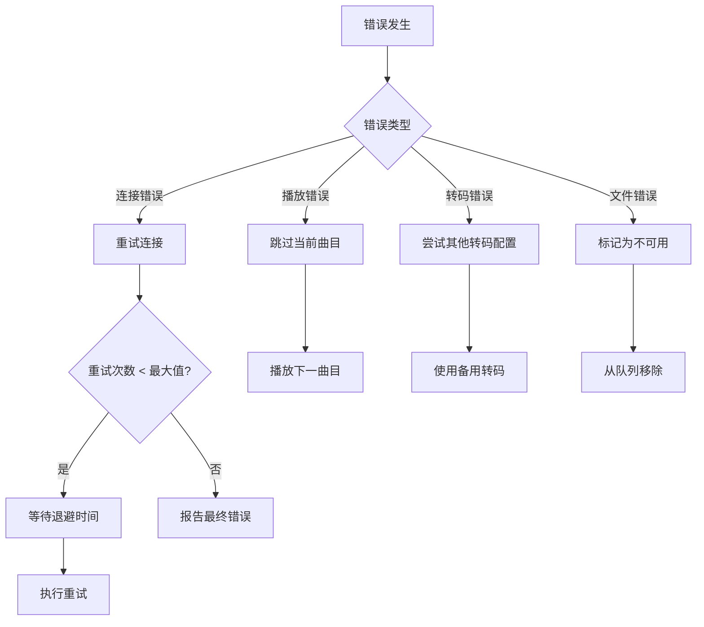
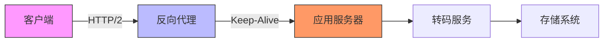

# 播放器核心功能

<cite>
**本文档引用的文件**  
- [queue.go](file://core/playback/queue.go)
- [playbackserver.go](file://core/playback/playbackserver.go)
- [mpv.go](file://core/playback/mpv/mpv.go)
- [track.go](file://core/playback/mpv/track.go)
- [media_streamer.go](file://core/media_streamer.go)
- [sse.go](file://server/events/sse.go)
- [player.js](file://ui/src/actions/player.js)
- [eventStream.js](file://ui/src/eventStream.js)
- [playerReducer.js](file://ui/src/reducers/playerReducer.js)
- [Player.jsx](file://ui/src/audioplayer/Player.jsx)
</cite>

## 目录
1. [播放器架构设计](#播放器架构设计)
2. [播放队列管理](#播放队列管理)
3. [播放状态同步机制](#播放状态同步机制)
4. [音频流获取与转码](#音频流获取与转码)
5. [播放器生命周期管理](#播放器生命周期管理)
6. [错误处理与重试机制](#错误处理与重试机制)
7. [SSE状态更新实现](#sse状态更新实现)
8. [常见问题与优化建议](#常见问题与优化建议)

## 播放器架构设计

Navidrome播放器采用分层架构设计，核心组件包括前端UI、后端播放服务和音频播放设备。播放器通过SSE（Server-Sent Events）实现实时状态同步，利用MPV作为底层音频播放引擎。



**图示来源**  
- [playbackserver.go](file://core/playback/playbackserver.go#L1-L128)
- [Player.jsx](file://ui/src/audioplayer/Player.jsx)

## 播放队列管理

播放队列是播放器的核心数据结构，负责管理待播放的媒体文件序列。队列支持添加、删除、清空、随机播放等操作，确保播放的连续性和用户体验。

```go
type Queue struct {
    Index int
    Items model.MediaFiles
}
```

队列管理功能包括：
- **添加媒体文件**：将新的媒体文件追加到队列末尾
- **设置播放索引**：安全地设置当前播放位置
- **随机播放**：打乱队列顺序并保持当前播放项
- **移除项目**：从队列中删除指定位置的媒体文件

**播放队列操作流程图**



**本节来源**  
- [queue.go](file://core/playback/queue.go#L1-L137)
- [playerReducer.js](file://ui/src/reducers/playerReducer.js#L1-L214)

## 播放状态同步机制

播放器通过SSE实现双向状态同步，确保前端UI与后端播放状态保持一致。状态同步包括播放进度、音量、播放模式等信息。



状态同步的关键特性：
- **实时性**：通过SSE实现毫秒级状态更新
- **可靠性**：包含连接重试和断线重连机制
- **选择性推送**：根据客户端标识过滤推送内容
- **心跳机制**：每15秒发送keep-alive消息维持连接

**本节来源**  
- [sse.go](file://server/events/sse.go#L1-L292)
- [eventStream.js](file://ui/src/eventStream.js#L1-L115)

## 音频流获取与转码

音频流服务负责从存储系统获取音频文件，并根据客户端需求进行转码处理。转码支持多种格式和比特率，确保兼容性和网络效率。



转码决策逻辑：
1. 如果请求原始格式且文件格式匹配，直接流式传输
2. 如果请求特定格式，查找对应的转码配置
3. 检查转码缓存是否存在
4. 不存在则启动FFmpeg进行实时转码
5. 转码结果同时返回给客户端并写入缓存

**本节来源**  
- [media_streamer.go](file://core/media_streamer.go#L1-L228)
- [mpv.go](file://core/playback/mpv/mpv.go#L1-L132)

## 播放器生命周期管理

播放器的生命周期管理确保资源的正确分配和释放，包括播放设备的初始化、播放控制和资源清理。



生命周期关键阶段：
- **初始化**：加载播放设备配置，建立MPV进程
- **播放**：启动音频流，连接播放设备
- **暂停**：暂停音频输出，保持播放位置
- **停止**：终止播放进程，释放系统资源
- **错误处理**：检测播放异常，执行恢复策略

**本节来源**  
- [playbackserver.go](file://core/playback/playbackserver.go#L38-L76)
- [track.go](file://core/playback/mpv/track.go#L1-L49)

## 错误处理与重试机制

播放器实现了多层次的错误处理和重试机制，确保在各种异常情况下仍能提供稳定的服务。



错误处理策略：
- **连接重试**：指数退避算法，最大重试3次
- **播放恢复**：自动跳过无法播放的曲目
- **转码降级**：当首选转码失败时尝试备用配置
- **资源清理**：确保异常情况下正确释放系统资源
- **日志记录**：详细记录错误信息用于诊断

**本节来源**  
- [mpv.go](file://core/playback/mpv/mpv.go#L63-L74)
- [media_streamer.go](file://core/media_streamer.go#L97-L101)

## SSE状态更新实现

SSE（Server-Sent Events）是播放器状态同步的核心技术，通过长连接实现服务器向客户端的实时推送。

```javascript
// 前端事件流处理
const startEventStream = async (dispatchFn) => {
    if (!localStorage.getItem('is-authenticated')) {
        return Promise.resolve()
    }
    if (config.devNewEventStream) {
        return startEventStreamNew(dispatchFn)
    }
    return startEventStreamLegacy(dispatchFn)
}
```

SSE实现细节：
- **连接建立**：通过`/events`端点建立长连接
- **身份验证**：JWT令牌通过查询参数传递
- **事件类型**：支持多种事件类型，如播放状态、扫描进度等
- **错误处理**：连接失败时自动重试，间隔5秒
- **心跳机制**：每15秒发送keep-alive消息防止连接超时

后端SSE Broker特性：
- **客户端管理**：维护所有活跃的客户端连接
- **消息广播**：支持单播和广播消息发送
- **连接验证**：确保只有授权客户端可以接收事件
- **资源清理**：连接关闭时自动清理相关资源

**本节来源**  
- [sse.go](file://server/events/sse.go#L1-L292)
- [eventStream.js](file://ui/src/eventStream.js#L1-L115)

## 常见问题与优化建议

### 音频流中断问题

**问题原因**：
- 网络连接不稳定
- 服务器资源不足
- 客户端处理能力有限

**解决方案**：
1. **增加缓冲**：提高客户端缓冲区大小
2. **优化转码**：使用更高效的转码参数
3. **连接复用**：保持SSE连接长期有效
4. **带宽适配**：根据网络状况动态调整比特率

### 播放延迟问题

**优化策略**：
- **预加载**：提前加载下一曲目的元数据
- **缓存策略**：合理设置转码缓存大小
- **并发控制**：限制同时进行的转码任务数量
- **资源监控**：实时监控系统资源使用情况

### 网络优化建议



网络优化措施：
- **启用HTTP/2**：减少连接开销
- **配置反向代理**：使用Nginx等代理服务器
- **启用压缩**：对文本内容进行GZIP压缩
- **CDN加速**：对静态资源使用CDN分发

### 缓冲策略

推荐的缓冲配置：
- **初始缓冲**：2-3秒预加载
- **低水位线**：剩余1秒时开始预加载
- **高水位线**：缓冲5秒内容
- **动态调整**：根据网络状况自动调整缓冲大小

**本节来源**  
- [media_streamer.go](file://core/media_streamer.go#L134-L183)
- [sse.go](file://server/events/sse.go#L256-L267)