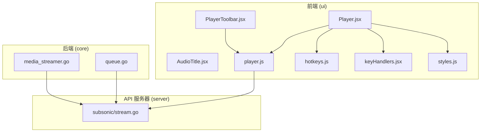
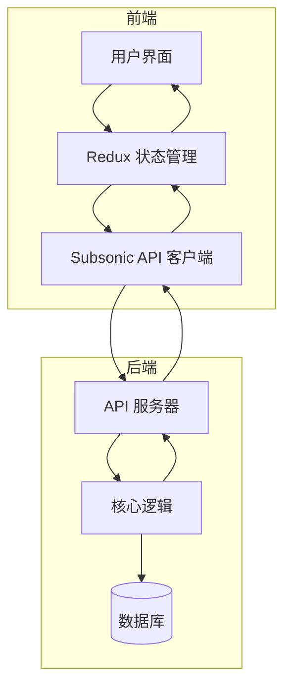
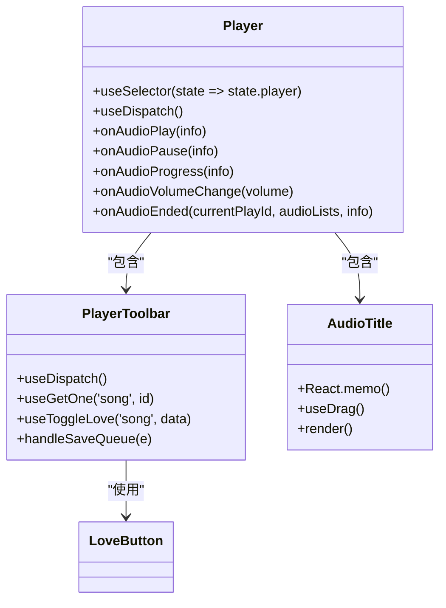
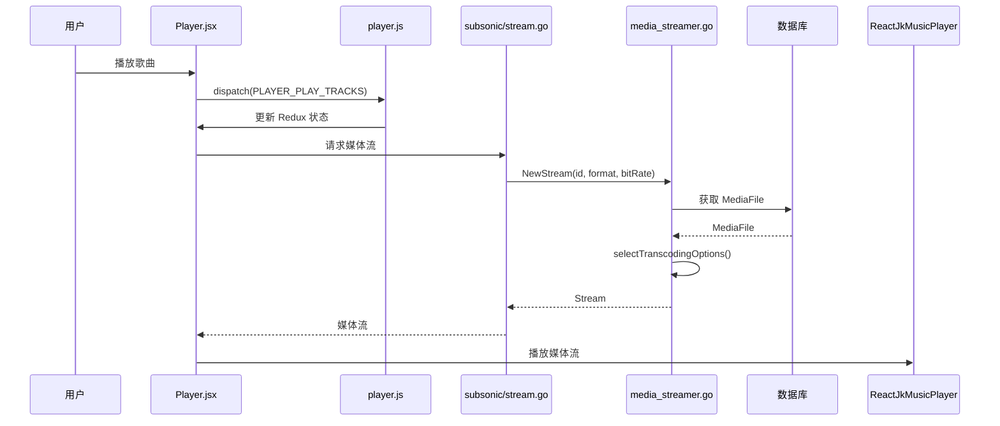
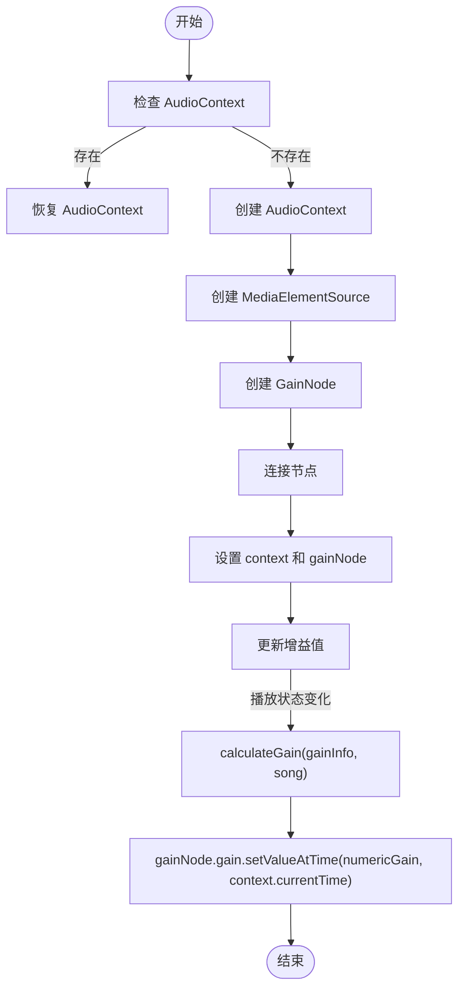
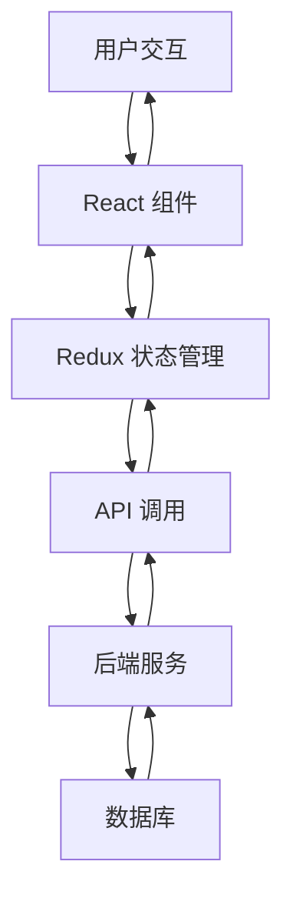
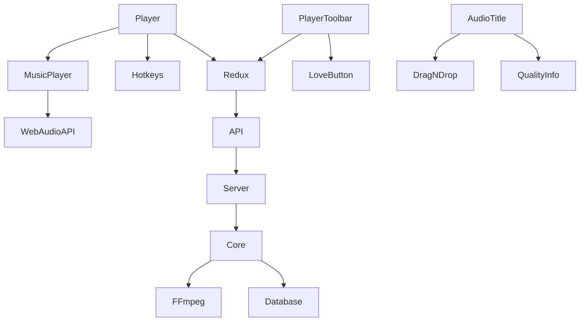

# 播放器组件

<cite>
**本文档中引用的文件**  
- [Player.jsx](file://ui/src/audioplayer/Player.jsx)
- [PlayerToolbar.jsx](file://ui/src/audioplayer/PlayerToolbar.jsx)
- [player.js](file://ui/src/actions/player.js)
- [hotkeys.js](file://ui/src/hotkeys.js)
- [keyHandlers.jsx](file://ui/src/audioplayer/keyHandlers.jsx)
- [AudioTitle.jsx](file://ui/src/audioplayer/AudioTitle.jsx)
- [styles.js](file://ui/src/audioplayer/styles.js)
- [queue.go](file://core/playback/queue.go)
- [media_streamer.go](file://core/media_streamer.go)
- [subsonic/stream.go](file://server/subsonic/stream.go)
</cite>

## 目录
1. [简介](#简介)
2. [项目结构](#项目结构)
3. [核心组件](#核心组件)
4. [架构概述](#架构概述)
5. [详细组件分析](#详细组件分析)
6. [依赖分析](#依赖分析)
7. [性能考虑](#性能考虑)
8. [故障排除指南](#故障排除指南)
9. [结论](#结论)

## 简介
Navidrome 是一个自托管的音乐服务器和流媒体解决方案，其播放器组件是用户交互的核心部分。本文档深入分析了播放器组件的实现，包括音频播放控制、进度显示、音量调节、播放队列管理、播放模式切换、UI 样式定制和响应式设计。文档还详细说明了播放器状态管理、事件处理机制、键盘快捷键支持以及与后端服务的交互方式。通过本文档，开发者可以全面了解播放器的工作原理，解决音频播放兼容性、缓冲策略等常见问题，并进行性能优化。

## 项目结构
Navidrome 的项目结构清晰，前端和后端代码分离。播放器相关的前端代码位于 `ui/src/audioplayer` 目录下，包括 `Player.jsx`、`PlayerToolbar.jsx`、`AudioTitle.jsx` 等组件。状态管理通过 Redux 实现，相关动作定义在 `ui/src/actions/player.js` 中。后端播放逻辑和媒体流处理位于 `core/playback` 和 `core` 目录下，如 `queue.go` 和 `media_streamer.go`。API 接口由 `server/subsonic` 模块提供。

**图源**
- [Player.jsx](file://ui/src/audioplayer/Player.jsx)
- [player.js](file://ui/src/actions/player.js)
- [hotkeys.js](file://ui/src/hotkeys.js)
- [keyHandlers.jsx](file://ui/src/audioplayer/keyHandlers.jsx)
- [styles.js](file://ui/src/audioplayer/styles.js)
- [queue.go](file://core/playback/queue.go)
- [media_streamer.go](file://core/media_streamer.go)
- [subsonic/stream.go](file://server/subsonic/stream.go)

## 核心组件
播放器的核心组件包括 `Player`、`PlayerToolbar` 和 `AudioTitle`。`Player` 组件是播放器的主容器，负责管理播放状态、处理事件和渲染子组件。`PlayerToolbar` 组件提供播放队列保存和歌曲收藏功能。`AudioTitle` 组件显示当前播放歌曲的标题、艺术家和专辑信息。这些组件通过 Redux 进行状态管理，确保状态的一致性和可预测性。

**节源**
- [Player.jsx](file://ui/src/audioplayer/Player.jsx)
- [PlayerToolbar.jsx](file://ui/src/audioplayer/PlayerToolbar.jsx)
- [AudioTitle.jsx](file://ui/src/audioplayer/AudioTitle.jsx)

## 架构概述
Navidrome 播放器采用前后端分离的架构。前端使用 React 和 Redux 构建用户界面，后端使用 Go 语言处理业务逻辑和数据存储。播放器通过 Subsonic API 与后端通信，获取媒体流和控制播放。播放队列在后端通过 `Queue` 结构体管理，支持添加、删除、清空、随机播放等操作。媒体流根据客户端请求的格式和比特率进行转码或直接流式传输。

**图源**
- [Player.jsx](file://ui/src/audioplayer/Player.jsx)
- [player.js](file://ui/src/actions/player.js)
- [subsonic/stream.go](file://server/subsonic/stream.go)
- [queue.go](file://core/playback/queue.go)

## 详细组件分析
### Player 组件分析
`Player` 组件是播放器的核心，它使用 `ReactJkMusicPlayer` 第三方库来实现音频播放功能。组件通过 `useSelector` 钩子从 Redux store 中获取播放状态，包括播放队列、当前播放歌曲、播放模式和音量。组件通过 `useCallback` 钩子定义事件处理函数，如 `onAudioPlay`、`onAudioPause`、`onAudioProgress` 等，并将这些函数传递给 `ReactJkMusicPlayer`。

#### 对象导向组件

**图源**
- [Player.jsx](file://ui/src/audioplayer/Player.jsx)
- [PlayerToolbar.jsx](file://ui/src/audioplayer/PlayerToolbar.jsx)
- [AudioTitle.jsx](file://ui/src/audioplayer/AudioTitle.jsx)

#### API/服务组件

**图源**
- [Player.jsx](file://ui/src/audioplayer/Player.jsx)
- [player.js](file://ui/src/actions/player.js)
- [subsonic/stream.go](file://server/subsonic/stream.go)
- [media_streamer.go](file://core/media_streamer.go)

#### 复杂逻辑组件

**图源**
- [Player.jsx](file://ui/src/audioplayer/Player.jsx)
- [calculateReplayGain.js](file://ui/src/utils/calculateReplayGain.js)

**节源**
- [Player.jsx](file://ui/src/audioplayer/Player.jsx)
- [PlayerToolbar.jsx](file://ui/src/audioplayer/PlayerToolbar.jsx)
- [AudioTitle.jsx](file://ui/src/audioplayer/AudioTitle.jsx)
- [player.js](file://ui/src/actions/player.js)
- [hotkeys.js](file://ui/src/hotkeys.js)
- [keyHandlers.jsx](file://ui/src/audioplayer/keyHandlers.jsx)
- [styles.js](file://ui/src/audioplayer/styles.js)

### 概念概述
播放器组件的设计遵循现代 Web 应用的最佳实践，使用 React 函数组件和 Hooks 进行状态管理，通过 Redux 实现全局状态管理，确保状态的一致性和可预测性。播放器支持响应式设计，适配桌面和移动设备。键盘快捷键通过 `react-hotkeys` 库实现，提供便捷的操作体验。播放器还支持 ReplayGain，自动调整音量以保持一致的听觉体验。

## 依赖分析
播放器组件依赖于多个内部和外部模块。前端依赖 `react-redux` 进行状态管理，`react-hotkeys` 处理键盘快捷键，`navidrome-music-player` 提供音频播放功能。后端依赖 `ffmpeg` 进行媒体转码，`database` 存储媒体文件和播放队列信息。播放器通过 Subsonic API 与后端通信，确保跨平台兼容性。

**图源**
- [Player.jsx](file://ui/src/audioplayer/Player.jsx)
- [PlayerToolbar.jsx](file://ui/src/audioplayer/PlayerToolbar.jsx)
- [AudioTitle.jsx](file://ui/src/audioplayer/AudioTitle.jsx)
- [player.js](file://ui/src/actions/player.js)
- [hotkeys.js](file://ui/src/hotkeys.js)
- [media_streamer.go](file://core/media_streamer.go)

**节源**
- [Player.jsx](file://ui/src/audioplayer/Player.jsx)
- [PlayerToolbar.jsx](file://ui/src/audioplayer/PlayerToolbar.jsx)
- [AudioTitle.jsx](file://ui/src/audioplayer/AudioTitle.jsx)
- [player.js](file://ui/src/actions/player.js)
- [hotkeys.js](file://ui/src/hotkeys.js)
- [media_streamer.go](file://core/media_streamer.go)

## 性能考虑
播放器在性能方面进行了多项优化。首先，使用 `React.memo` 和 `useCallback` 钩子避免不必要的重新渲染。其次，媒体流支持缓存，减少重复转码的开销。转码缓存的大小和最大项目数可以通过配置文件进行调整。此外，播放器在播放前预加载下一首歌曲，减少切换歌曲时的延迟。对于移动设备，播放器自动将音量设置为最大，避免因系统音量控制导致的音量过低问题。

## 故障排除指南
### 音频播放问题
- **问题**: 播放器无法播放某些格式的音频文件。
  - **解决方案**: 确保 `ffmpeg` 已正确安装并配置。检查 `conf.Server.DefaultDownsamplingFormat` 配置项是否支持所需格式。
- **问题**: 播放器音量过低。
  - **解决方案**: 检查是否启用了 ReplayGain。如果启用了 ReplayGain，确保媒体文件包含 ReplayGain 元数据。对于移动设备，播放器会自动将音量设置为最大，确保系统音量已调高。

### 缓冲策略问题
- **问题**: 播放器缓冲时间过长。
  - **解决方案**: 检查网络连接速度。如果网络较慢，可以尝试降低请求的比特率。确保转码缓存已启用，避免重复转码。

### 键盘快捷键问题
- **问题**: 键盘快捷键不起作用。
  - **解决方案**: 确保 `react-hotkeys` 库已正确加载。检查 `hotkeys.js` 文件中的快捷键配置是否正确。

**节源**
- [Player.jsx](file://ui/src/audioplayer/Player.jsx)
- [media_streamer.go](file://core/media_streamer.go)
- [hotkeys.js](file://ui/src/hotkeys.js)

## 结论
Navidrome 播放器组件是一个功能丰富、设计良好的音频播放解决方案。通过前后端分离的架构，播放器实现了高效的状态管理和流畅的用户体验。播放器支持多种功能，包括播放控制、进度显示、音量调节、播放队列管理、播放模式切换、UI 样式定制和响应式设计。通过本文档的分析，开发者可以深入了解播放器的工作原理，解决常见问题，并进行性能优化。未来可以进一步优化播放器的兼容性和性能，提升用户体验。