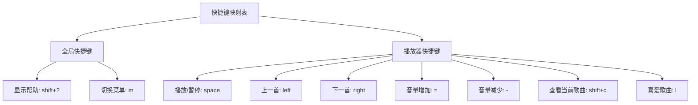
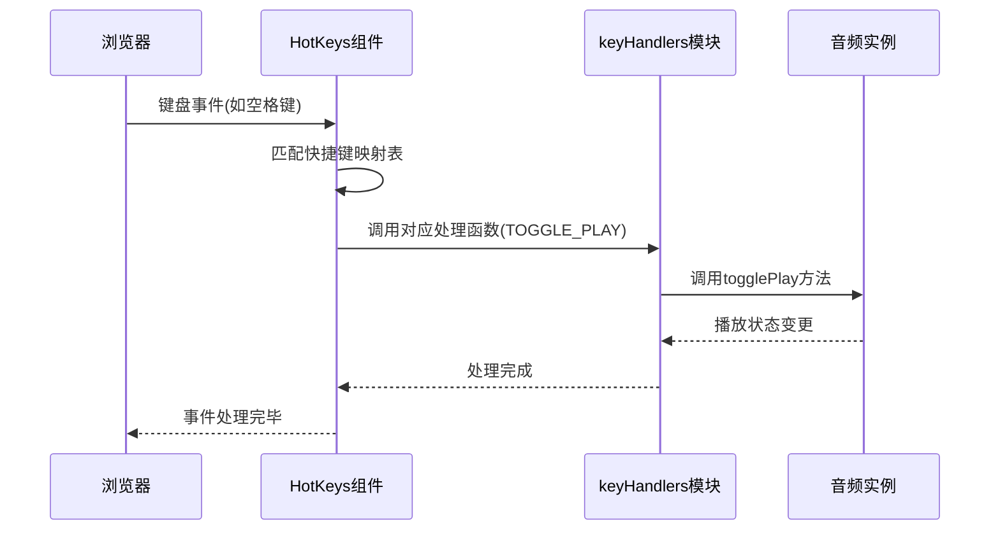
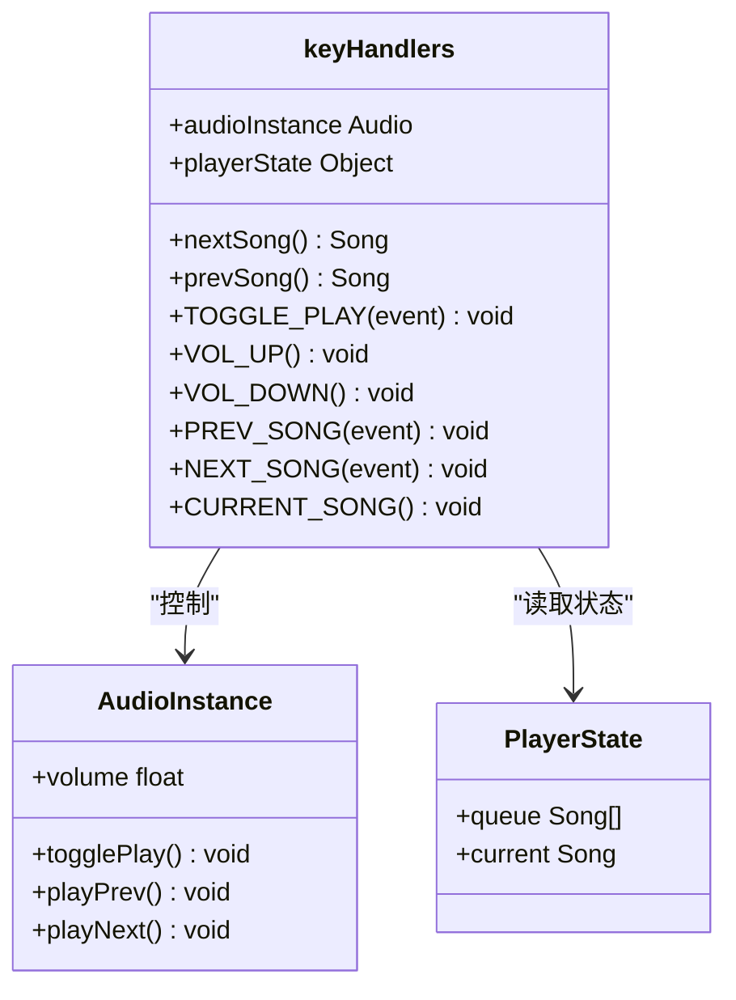
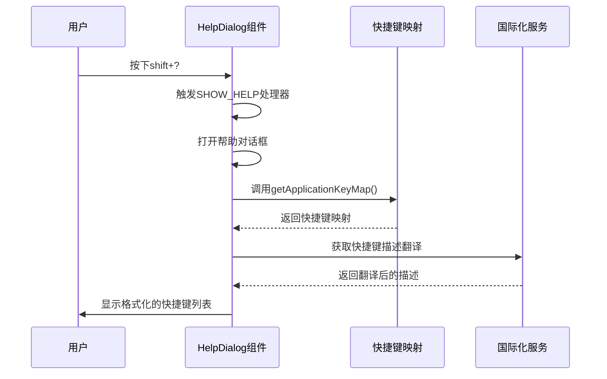
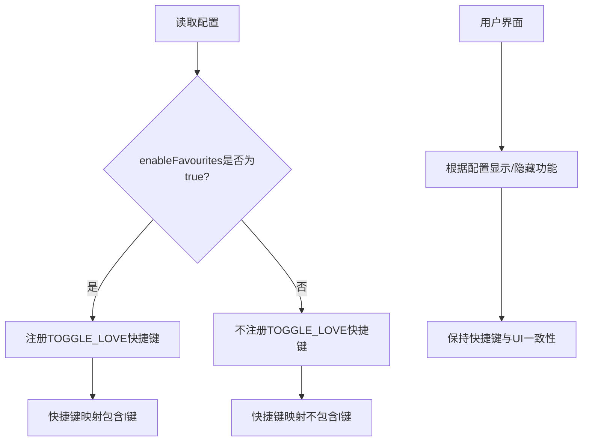

# 键盘快捷键支持

<cite>
**本文档引用的文件**   
- [hotkeys.js](file://ui/src/hotkeys.js)
- [keyHandlers.jsx](file://ui/src/audioplayer/keyHandlers.jsx)
- [HelpDialog.jsx](file://ui/src/dialogs/HelpDialog.jsx)
- [App.jsx](file://ui/src/App.jsx)
- [config.js](file://ui/src/config.js)
</cite>

## 目录
1. [简介](#简介)
2. [快捷键映射表](#快捷键映射表)
3. [事件监听与处理机制](#事件监听与处理机制)
4. [播放控制快捷键实现](#播放控制快捷键实现)
5. [冲突处理与条件逻辑](#冲突处理与条件逻辑)
6. [帮助对话框实现](#帮助对话框实现)
7. [自定义配置支持](#自定义配置支持)
8. [常见问题与解决方案](#常见问题与解决方案)
9. [跨平台兼容性建议](#跨平台兼容性建议)
10. [扩展方法](#扩展方法)

## 简介
Navidrome提供了丰富的键盘快捷键功能，允许用户通过键盘快速控制音乐播放。本文档深入分析了keyHandlers模块的实现机制，详细解释了播放控制快捷键的注册和处理流程，包括空格键、方向键等核心快捷键的功能实现。

**Section sources**
- [hotkeys.js](file://ui/src/hotkeys.js#L1-L17)
- [keyHandlers.jsx](file://ui/src/audioplayer/keyHandlers.jsx#L1-L38)

## 快捷键映射表
Navidrome使用一个集中的快捷键映射表来定义所有可用的键盘快捷键。该映射表定义了快捷键的名称、触发序列和所属分组。



**Diagram sources**
- [hotkeys.js](file://ui/src/hotkeys.js#L2-L14)

**Section sources**
- [hotkeys.js](file://ui/src/hotkeys.js#L1-L17)

## 事件监听与处理机制
Navidrome采用react-hotkeys库来实现键盘事件的监听和处理。系统通过HotKeys组件在应用根级别注册快捷键监听器，并将具体的处理逻辑委托给相应的处理器函数。



**Diagram sources**
- [App.jsx](file://ui/src/App.jsx#L157-L169)
- [keyHandlers.jsx](file://ui/src/audioplayer/keyHandlers.jsx#L1-L38)

**Section sources**
- [App.jsx](file://ui/src/App.jsx#L157-L173)
- [keyHandlers.jsx](file://ui/src/audioplayer/keyHandlers.jsx#L1-L38)

## 播放控制快捷键实现
播放控制快捷键的处理逻辑集中在keyHandlers模块中，该模块接收音频实例和播放器状态作为参数，返回一个包含各种快捷键处理函数的对象。



**Diagram sources**
- [keyHandlers.jsx](file://ui/src/audioplayer/keyHandlers.jsx#L1-L38)

**Section sources**
- [keyHandlers.jsx](file://ui/src/audioplayer/keyHandlers.jsx#L1-L38)

## 冲突处理与条件逻辑
Navidrome在处理快捷键时实现了智能的冲突处理机制，特别是在处理方向键时会检查metaKey状态以避免与浏览器默认行为冲突。

```mermaid
flowchart TD
A[接收到PREV_SONG事件] --> B{metaKey是否按下?}
B --> |是| C[忽略事件]
B --> |否| D{上一首歌曲是否存在?}
D --> |否| E[不执行操作]
D --> |是| F[调用audioInstance.playPrev()]
G[接收到NEXT_SONG事件] --> H{metaKey是否按下?}
H --> |是| I[忽略事件]
H --> |否| J{下一首歌曲是否存在?}
J --> |否| K[不执行操作]
J --> |是| L[调用audioInstance.playNext()]
```

**Diagram sources**
- [keyHandlers.jsx](file://ui/src/audioplayer/keyHandlers.jsx#L25-L33)

**Section sources**
- [keyHandlers.jsx](file://ui/src/audioplayer/keyHandlers.jsx#L1-L38)

## 帮助对话框实现
Navidrome提供了一个帮助对话框，可以显示所有可用的快捷键及其功能描述。该对话框动态获取当前的快捷键映射并格式化显示。



**Diagram sources**
- [HelpDialog.jsx](file://ui/src/dialogs/HelpDialog.jsx#L17-L80)
- [hotkeys.js](file://ui/src/hotkeys.js#L1-L17)

**Section sources**
- [HelpDialog.jsx](file://ui/src/dialogs/HelpDialog.jsx#L1-L80)

## 自定义配置支持
Navidrome支持通过配置文件动态启用或禁用某些快捷键功能，特别是基于功能开关的条件性快捷键注册。



**Diagram sources**
- [hotkeys.js](file://ui/src/hotkeys.js#L11-L13)
- [config.js](file://ui/src/config.js#L1-L64)

**Section sources**
- [hotkeys.js](file://ui/src/hotkeys.js#L1-L17)
- [config.js](file://ui/src/config.js#L1-L64)

## 常见问题与解决方案
### 快捷键失效问题
快捷键可能失效的原因包括：
- 浏览器焦点不在Navidrome应用上
- 输入框处于激活状态
- 浏览器扩展程序干扰
- JavaScript错误导致事件监听器未正确注册

### 解决方案
1. 确保Navidrome标签页处于活动状态
2. 避免在输入框中使用播放控制快捷键
3. 检查浏览器控制台是否有JavaScript错误
4. 尝试刷新页面重新初始化快捷键监听器

**Section sources**
- [App.jsx](file://ui/src/App.jsx#L157-L169)
- [keyHandlers.jsx](file://ui/src/audioplayer/keyHandlers.jsx#L1-L38)

## 跨平台兼容性建议
为了确保在不同操作系统上的兼容性，Navidrome的快捷键设计遵循以下原则：
- 使用标准键盘事件，避免平台特定的键码
- 避免与操作系统级别的快捷键冲突
- 提供可配置的快捷键方案
- 考虑不同键盘布局的兼容性

**Section sources**
- [hotkeys.js](file://ui/src/hotkeys.js#L1-L17)

## 扩展方法
开发者可以通过以下方式扩展Navidrome的快捷键功能：
1. 在hotkeys.js中添加新的快捷键定义
2. 在keyHandlers.jsx中实现相应的处理函数
3. 确保新快捷键不会与现有快捷键冲突
4. 考虑添加国际化支持以便在帮助对话框中显示

**Section sources**
- [hotkeys.js](file://ui/src/hotkeys.js#L1-L17)
- [keyHandlers.jsx](file://ui/src/audioplayer/keyHandlers.jsx#L1-L38)