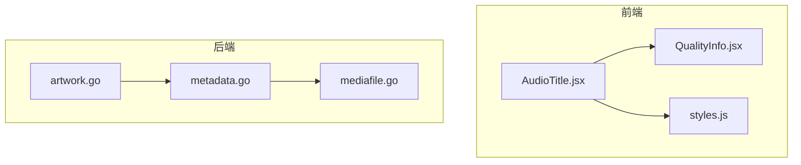
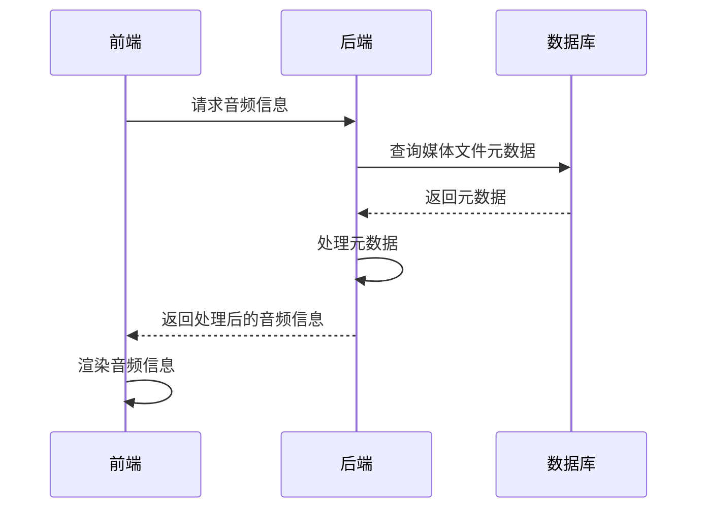
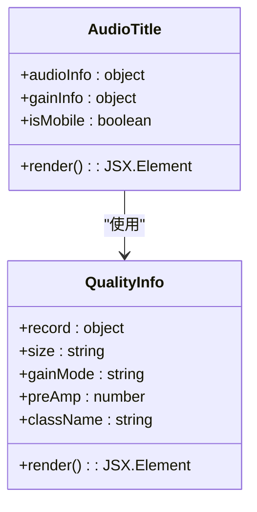
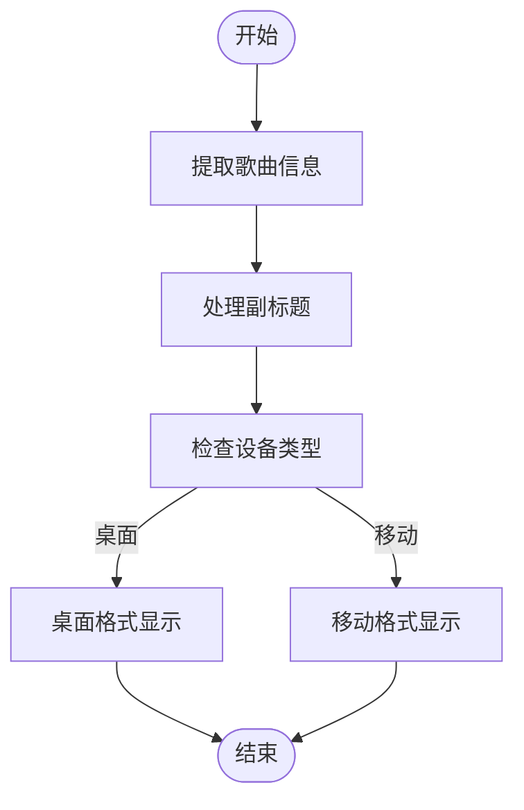
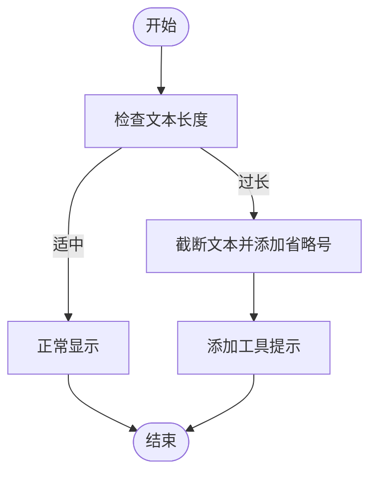
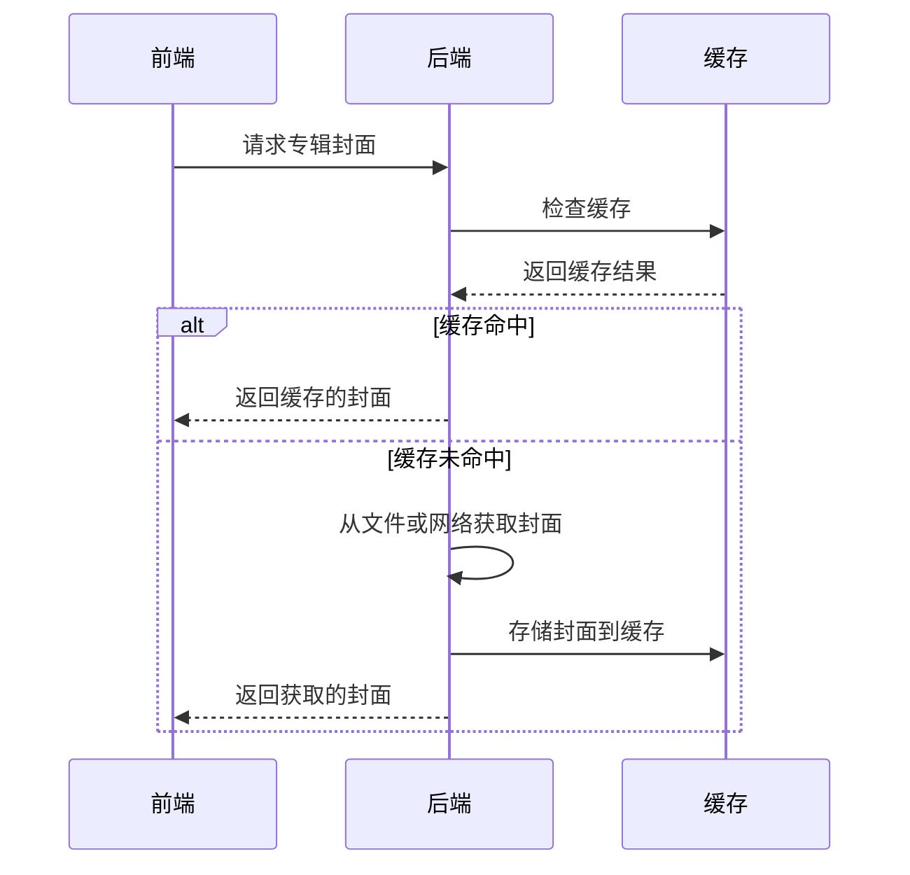
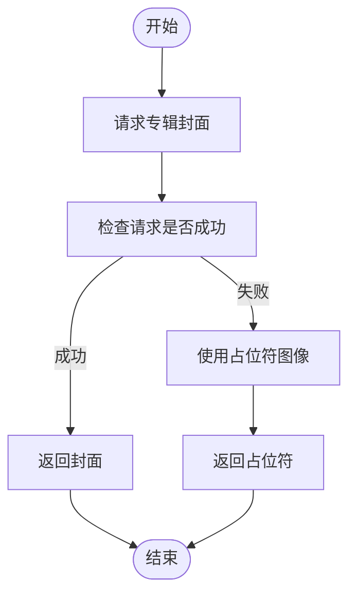
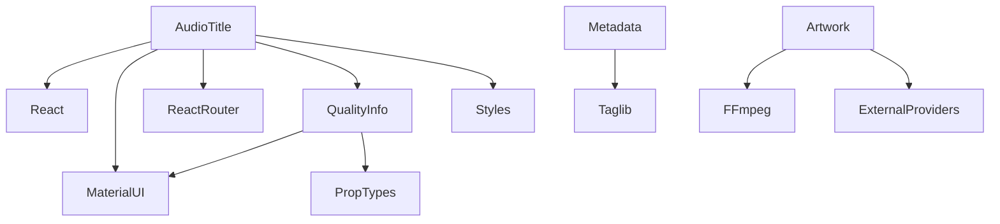

# 音频信息显示

<cite>
**本文档引用的文件**
- [AudioTitle.jsx](file://ui/src/audioplayer/AudioTitle.jsx#L1-L83)
- [QualityInfo.jsx](file://ui/src/common/QualityInfo.jsx#L1-L73)
- [styles.js](file://ui/src/audioplayer/styles.js#L1-L94)
- [metadata.go](file://model/metadata/metadata.go#L1-L98)
- [map_mediafile.go](file://model/metadata/map_mediafile.go#L41-L77)
- [mediafile.go](file://model/mediafile.go#L1-L200)
- [artwork.go](file://core/artwork/artwork.go#L1-L131)
- [sources.go](file://core/artwork/sources.go#L177-L194)
</cite>

## 目录
1. [介绍](#介绍)
2. [项目结构](#项目结构)
3. [核心组件](#核心组件)
4. [架构概述](#架构概述)
5. [详细组件分析](#详细组件分析)
6. [依赖分析](#依赖分析)
7. [性能考虑](#性能考虑)
8. [故障排除指南](#故障排除指南)
9. [结论](#结论)

## 介绍
Navidrome是一款开源的音乐服务器和流媒体应用，提供音频信息显示功能，允许用户查看歌曲标题、艺术家、专辑等元数据。本文档深入分析AudioTitle组件的实现，解释歌曲标题、艺术家、专辑信息的展示逻辑，详细说明元数据显示、文本截断处理、工具提示(Tooltip)交互等UI细节。同时提供专辑封面获取、缓存策略和错误回退机制的技术细节。

## 项目结构
Navidrome项目采用分层架构，前端使用React框架，后端使用Go语言。音频信息显示功能主要涉及前端UI组件和后端元数据处理。

**图示来源**
- [AudioTitle.jsx](file://ui/src/audioplayer/AudioTitle.jsx#L1-L83)
- [QualityInfo.jsx](file://ui/src/common/QualityInfo.jsx#L1-L73)
- [styles.js](file://ui/src/audioplayer/styles.js#L1-L94)
- [metadata.go](file://model/metadata/metadata.go#L1-L98)
- [mediafile.go](file://model/mediafile.go#L1-L200)
- [artwork.go](file://core/artwork/artwork.go#L1-L131)

**本节来源**
- [AudioTitle.jsx](file://ui/src/audioplayer/AudioTitle.jsx#L1-L83)
- [QualityInfo.jsx](file://ui/src/common/QualityInfo.jsx#L1-L73)
- [styles.js](file://ui/src/audioplayer/styles.js#L1-L94)
- [metadata.go](file://model/metadata/metadata.go#L1-L98)
- [mediafile.go](file://model/mediafile.go#L1-L200)
- [artwork.go](file://core/artwork/artwork.go#L1-L131)

## 核心组件
音频信息显示功能的核心组件包括AudioTitle、QualityInfo和相关的样式文件。这些组件协同工作，从媒体文件模型中提取并格式化显示信息。

**本节来源**
- [AudioTitle.jsx](file://ui/src/audioplayer/AudioTitle.jsx#L1-L83)
- [QualityInfo.jsx](file://ui/src/common/QualityInfo.jsx#L1-L73)
- [styles.js](file://ui/src/audioplayer/styles.js#L1-L94)

## 架构概述
Navidrome的音频信息显示功能采用前后端分离架构。前端负责UI渲染和用户交互，后端负责元数据提取和处理。

**图示来源**
- [AudioTitle.jsx](file://ui/src/audioplayer/AudioTitle.jsx#L1-L83)
- [metadata.go](file://model/metadata/metadata.go#L1-L98)
- [mediafile.go](file://model/mediafile.go#L1-L200)

## 详细组件分析
### AudioTitle组件分析
AudioTitle组件是音频信息显示的核心，负责展示歌曲标题、艺术家、专辑等信息。

**图示来源**
- [AudioTitle.jsx](file://ui/src/audioplayer/AudioTitle.jsx#L1-L83)
- [QualityInfo.jsx](file://ui/src/common/QualityInfo.jsx#L1-L73)

#### 元数据显示逻辑
AudioTitle组件通过以下逻辑显示元数据：
1. 从audioInfo中提取歌曲信息
2. 处理副标题（subtitle）并拼接到标题
3. 根据设备类型（桌面/移动）调整显示格式
4. 显示艺术家和专辑信息

**图示来源**
- [AudioTitle.jsx](file://ui/src/audioplayer/AudioTitle.jsx#L1-L83)

#### 文本截断与工具提示
AudioTitle组件使用CSS类控制文本显示，当文本过长时自动截断并显示省略号。用户可以通过悬停查看完整信息。

**图示来源**
- [AudioTitle.jsx](file://ui/src/audioplayer/AudioTitle.jsx#L1-L83)
- [styles.js](file://ui/src/audioplayer/styles.js#L1-L94)

### 专辑封面获取与缓存
专辑封面获取和缓存是音频信息显示的重要组成部分。

**图示来源**
- [artwork.go](file://core/artwork/artwork.go#L1-L131)
- [sources.go](file://core/artwork/sources.go#L177-L194)

#### 错误回退机制
当专辑封面无法获取时，系统会使用占位符图像作为回退。

**图示来源**
- [artwork.go](file://core/artwork/artwork.go#L1-L131)

**本节来源**
- [AudioTitle.jsx](file://ui/src/audioplayer/AudioTitle.jsx#L1-L83)
- [QualityInfo.jsx](file://ui/src/common/QualityInfo.jsx#L1-L73)
- [styles.js](file://ui/src/audioplayer/styles.js#L1-L94)
- [metadata.go](file://model/metadata/metadata.go#L1-L98)
- [map_mediafile.go](file://model/metadata/map_mediafile.go#L41-L77)
- [mediafile.go](file://model/mediafile.go#L1-L200)
- [artwork.go](file://core/artwork/artwork.go#L1-L131)
- [sources.go](file://core/artwork/sources.go#L177-L194)

## 依赖分析
音频信息显示功能依赖多个组件和库。

**图示来源**
- [AudioTitle.jsx](file://ui/src/audioplayer/AudioTitle.jsx#L1-L83)
- [QualityInfo.jsx](file://ui/src/common/QualityInfo.jsx#L1-L73)
- [styles.js](file://ui/src/audioplayer/styles.js#L1-L94)
- [metadata.go](file://model/metadata/metadata.go#L1-L98)
- [artwork.go](file://core/artwork/artwork.go#L1-L131)

**本节来源**
- [AudioTitle.jsx](file://ui/src/audioplayer/AudioTitle.jsx#L1-L83)
- [QualityInfo.jsx](file://ui/src/common/QualityInfo.jsx#L1-L73)
- [styles.js](file://ui/src/audioplayer/styles.js#L1-L94)
- [metadata.go](file://model/metadata/metadata.go#L1-L98)
- [artwork.go](file://core/artwork/artwork.go#L1-L131)

## 性能考虑
音频信息显示功能在性能方面有以下考虑：
- 使用React.memo进行组件记忆化，避免不必要的重新渲染
- 实现封面缓存，减少重复的网络请求
- 懒加载封面图像，提高初始加载速度
- 使用Web Workers处理复杂的元数据解析

## 故障排除指南
### 信息显示不全
当音频信息显示不全时，可能的原因包括：
- 媒体文件元数据不完整
- 后端元数据提取失败
- 前端组件渲染错误

**本节来源**
- [AudioTitle.jsx](file://ui/src/audioplayer/AudioTitle.jsx#L1-L83)
- [metadata.go](file://model/metadata/metadata.go#L1-L98)

### 特殊字符处理
系统对特殊字符的处理包括：
- 统一编码格式为UTF-8
- 转义HTML特殊字符
- 处理Unicode字符

**本节来源**
- [metadata.go](file://model/metadata/metadata.go#L1-L98)

### 多语言支持
Navidrome支持多语言界面，通过i18n实现。

**本节来源**
- [resources/i18n](file://resources/i18n)

### 可访问性优化
可访问性优化建议包括：
- 为所有图像添加alt属性
- 使用语义化HTML标签
- 确保键盘导航可用
- 提供足够的颜色对比度

**本节来源**
- [AudioTitle.jsx](file://ui/src/audioplayer/AudioTitle.jsx#L1-L83)

## 结论
Navidrome的音频信息显示功能通过前后端协同工作，实现了完整的元数据显示。前端组件AudioTitle负责UI渲染，后端组件处理元数据提取和封面获取。系统采用缓存策略提高性能，并提供错误回退机制确保用户体验。未来可以进一步优化多语言支持和可访问性。