# 响应式设计实现

<cite>
**本文档引用的文件**  
- [DesktopArtistDetails.jsx](file://ui/src/artist/DesktopArtistDetails.jsx)
- [MobileArtistDetails.jsx](file://ui/src/artist/MobileArtistDetails.jsx)
- [ArtistShow.jsx](file://ui/src/artist/ArtistShow.jsx)
- [useGetHandleArtistClick.jsx](file://ui/src/common/useGetHandleArtistClick.jsx)
- [useAlbumsPerPage.jsx](file://ui/src/common/useAlbumsPerPage.jsx)
- [dark.js](file://ui/src/themes/dark.js)
- [ligera.js](file://ui/src/themes/ligera.js)
- [monokai.js](file://ui/src/themes/monokai.js)
</cite>

## 目录
1. [项目结构](#项目结构)
2. [核心组件](#核心组件)
3. [响应式架构概述](#响应式架构概述)
4. [详细组件分析](#详细组件分析)
5. [响应式状态管理](#响应式状态管理)
6. [公共Hooks分析](#公共hooks分析)
7. [主题与样式适配](#主题与样式适配)
8. [常见问题与调试](#常见问题与调试)

## 项目结构

Navidrome的响应式设计主要集中在UI层的艺术家组件实现上，通过不同的组件适配桌面和移动设备。项目采用React和Material-UI框架实现响应式布局。

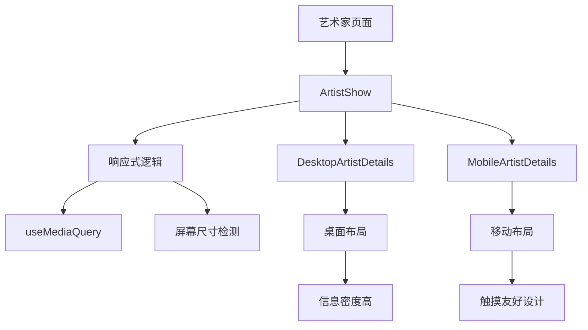

**图表来源**  
- [ArtistShow.jsx](file://ui/src/artist/ArtistShow.jsx)
- [DesktopArtistDetails.jsx](file://ui/src/artist/DesktopArtistDetails.jsx)
- [MobileArtistDetails.jsx](file://ui/src/artist/MobileArtistDetails.jsx)

**本节来源**  
- [ArtistShow.jsx](file://ui/src/artist/ArtistShow.jsx)

## 核心组件

Navidrome的艺术家组件响应式设计通过`DesktopArtistDetails`和`MobileArtistDetails`两个组件实现，根据设备类型动态切换。这种设计模式确保了在不同设备上都能提供最佳用户体验。

**本节来源**  
- [DesktopArtistDetails.jsx](file://ui/src/artist/DesktopArtistDetails.jsx)
- [MobileArtistDetails.jsx](file://ui/src/artist/MobileArtistDetails.jsx)

## 响应式架构概述

Navidrome的响应式设计基于Material-UI的断点系统，通过`useMediaQuery`钩子检测屏幕尺寸，动态选择合适的组件进行渲染。系统在`sm`断点（600px）作为桌面和移动设备的分界线。

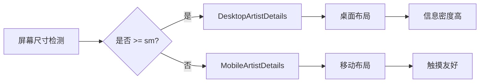

**图表来源**  
- [ArtistShow.jsx](file://ui/src/artist/ArtistShow.jsx)

**本节来源**  
- [ArtistShow.jsx](file://ui/src/artist/ArtistShow.jsx)

## 详细组件分析

### 桌面艺术家组件分析

`DesktopArtistDetails`组件针对桌面设备进行了优化，提供了更高的信息密度和更复杂的布局结构。

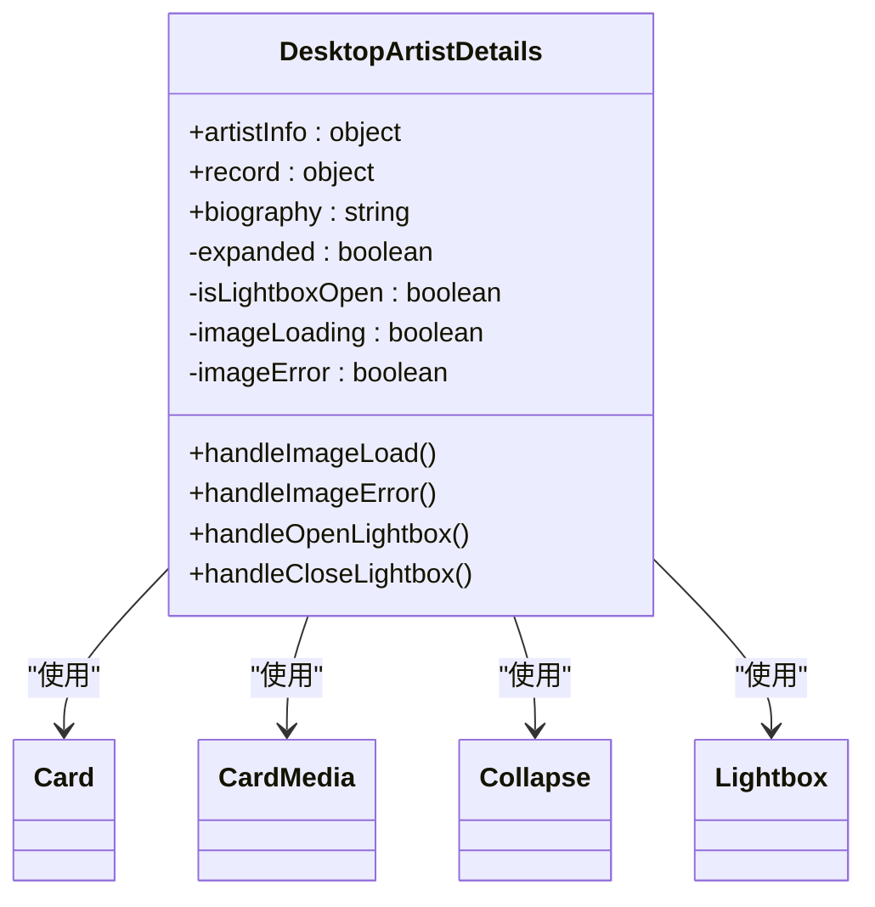

**图表来源**  
- [DesktopArtistDetails.jsx](file://ui/src/artist/DesktopArtistDetails.jsx)

**本节来源**  
- [DesktopArtistDetails.jsx](file://ui/src/artist/DesktopArtistDetails.jsx)

### 移动艺术家组件分析

`MobileArtistDetails`组件针对移动设备进行了特殊优化，采用了触摸友好的设计和简化布局。

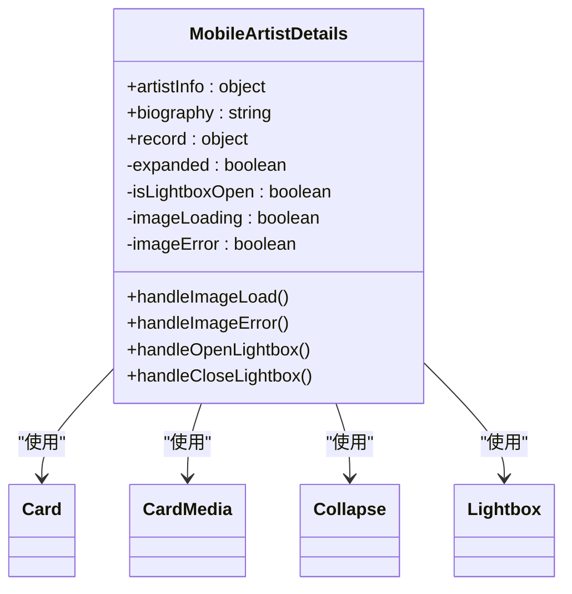

**图表来源**  
- [MobileArtistDetails.jsx](file://ui/src/artist/MobileArtistDetails.jsx)

**本节来源**  
- [MobileArtistDetails.jsx](file://ui/src/artist/MobileArtistDetails.jsx)

### 响应式布局差异

桌面和移动组件在布局和用户体验上有显著差异：

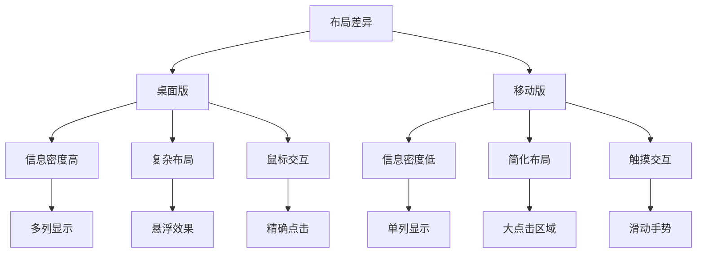

**图表来源**  
- [DesktopArtistDetails.jsx](file://ui/src/artist/DesktopArtistDetails.jsx)
- [MobileArtistDetails.jsx](file://ui/src/artist/MobileArtistDetails.jsx)

**本节来源**  
- [DesktopArtistDetails.jsx](file://ui/src/artist/DesktopArtistDetails.jsx)
- [MobileArtistDetails.jsx](file://ui/src/artist/MobileArtistDetails.jsx)

## 响应式状态管理

### 屏幕尺寸检测

Navidrome使用Material-UI的`useMediaQuery`钩子进行屏幕尺寸检测，实现响应式组件切换。

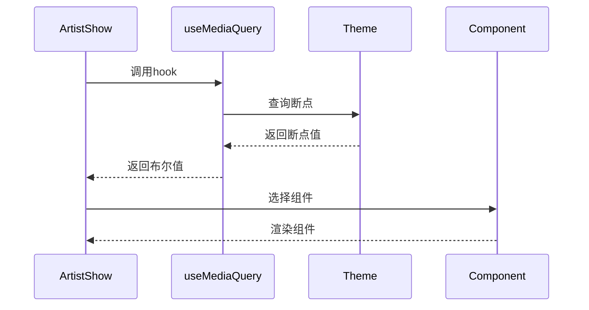

**图表来源**  
- [ArtistShow.jsx](file://ui/src/artist/ArtistShow.jsx)

**本节来源**  
- [ArtistShow.jsx](file://ui/src/artist/ArtistShow.jsx)

### 动态组件切换

系统通过条件渲染实现桌面和移动组件的动态切换，确保在不同设备上提供最佳体验。

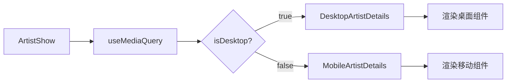

**图表来源**  
- [ArtistShow.jsx](file://ui/src/artist/ArtistShow.jsx)

**本节来源**  
- [ArtistShow.jsx](file://ui/src/artist/ArtistShow.jsx)

## 公共Hooks分析

### useGetHandleArtistClick Hook

`useGetHandleArtistClick`是一个公共hook，用于处理艺术家点击事件，支持跨设备的一致性交互。

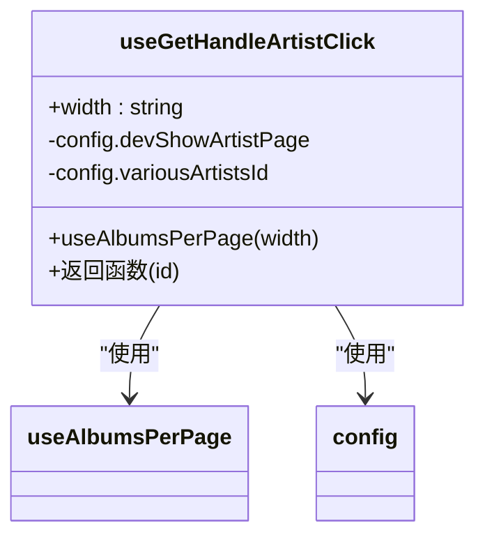

**图表来源**  
- [useGetHandleArtistClick.jsx](file://ui/src/common/useGetHandleArtistClick.jsx)

**本节来源**  
- [useGetHandleArtistClick.jsx](file://ui/src/common/useGetHandleArtistClick.jsx)

### useAlbumsPerPage Hook

`useAlbumsPerPage`钩子根据屏幕宽度返回每页显示的专辑数量，实现响应式分页。

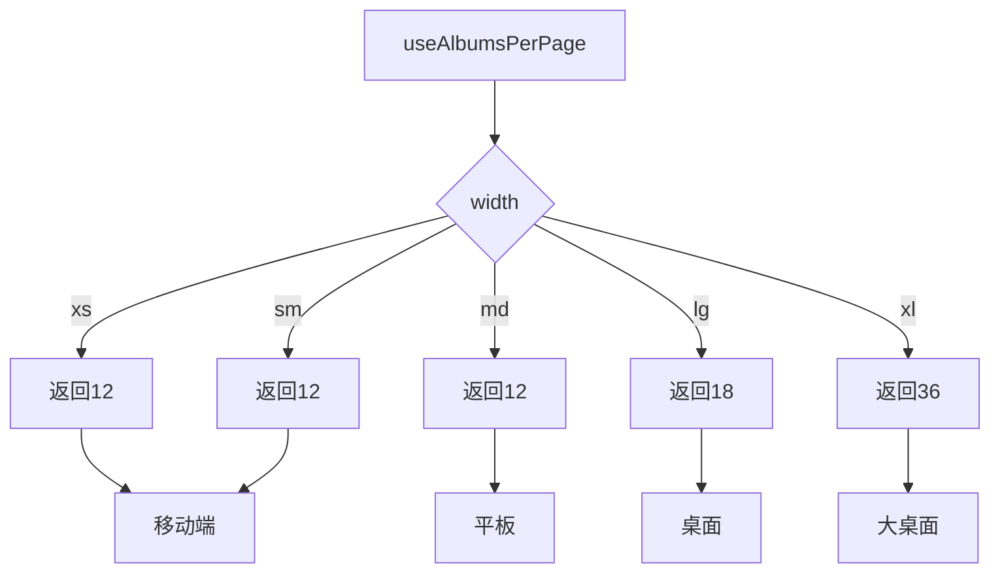

**图表来源**  
- [useAlbumsPerPage.jsx](file://ui/src/common/useAlbumsPerPage.jsx)

**本节来源**  
- [useAlbumsPerPage.jsx](file://ui/src/common/useAlbumsPerPage.jsx)

## 主题与样式适配

### 主题配置

Navidrome支持多种主题，包括暗色、浅色和Monokai等，通过主题系统实现样式适配。

```mermaid
classDiagram
class Theme {
+themeName : string
+palette : object
+overrides : object
+player : object
}
Theme <|-- DarkTheme
Theme <|-- LigeraTheme
Theme <|-- MonokaiTheme
DarkTheme --> "dark.js" : "实现"
LigeraTheme --> "ligera.js" : "实现"
MonokaiTheme --> "monokai.js" : "实现"
```

**图表来源**  
- [dark.js](file://ui/src/themes/dark.js)
- [ligera.js](file://ui/src/themes/ligera.js)
- [monokai.js](file://ui/src/themes/monokai.js)

**本节来源**  
- [dark.js](file://ui/src/themes/dark.js)
- [ligera.js](file://ui/src/themes/ligera.js)
- [monokai.js](file://ui/src/themes/monokai.js)

### 样式适配机制

系统通过CSS-in-JS和媒体查询实现样式适配，确保在不同设备上都有良好的视觉效果。

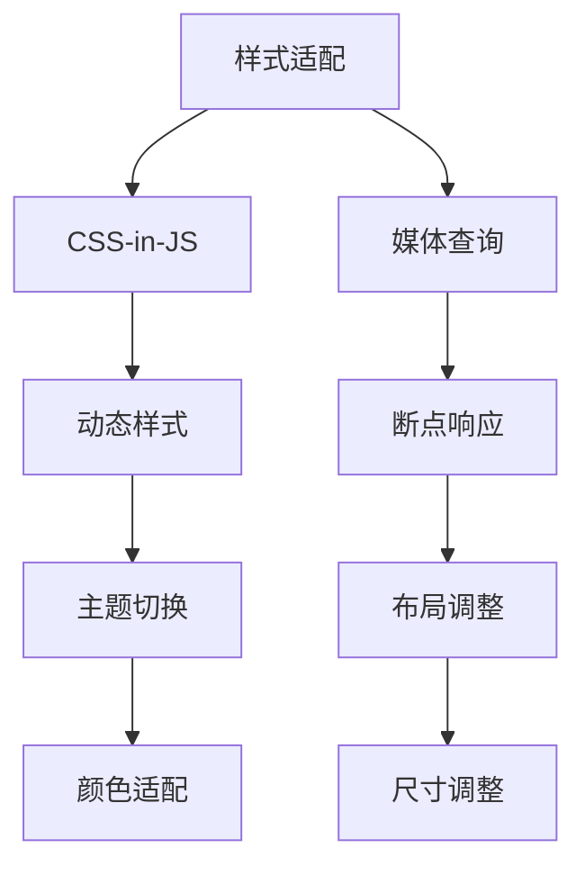

**图表来源**  
- [dark.js](file://ui/src/themes/dark.js)
- [ligera.js](file://ui/src/themes/ligera.js)

**本节来源**  
- [dark.js](file://ui/src/themes/dark.js)
- [ligera.js](file://ui/src/themes/ligera.js)

## 常见问题与调试

### 图片适配问题

在响应式设计中，图片适配是一个常见问题，Navidrome通过多种机制解决。

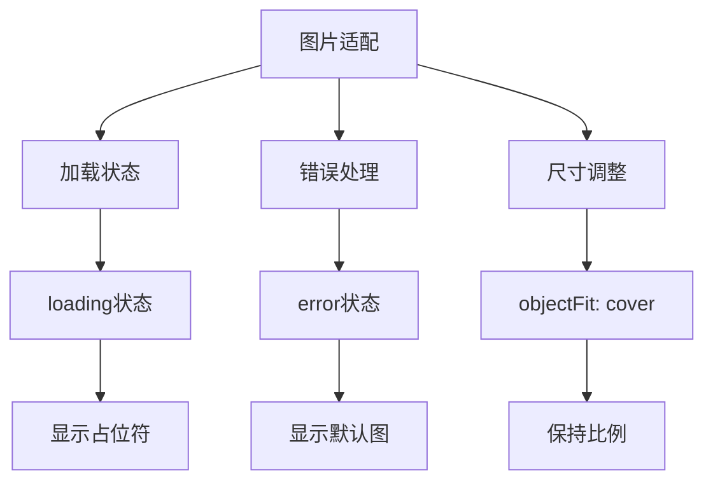

**图表来源**  
- [DesktopArtistDetails.jsx](file://ui/src/artist/DesktopArtistDetails.jsx)
- [MobileArtistDetails.jsx](file://ui/src/artist/MobileArtistDetails.jsx)

**本节来源**  
- [DesktopArtistDetails.jsx](file://ui/src/artist/DesktopArtistDetails.jsx)
- [MobileArtistDetails.jsx](file://ui/src/artist/MobileArtistDetails.jsx)

### 字体缩放问题

字体缩放需要考虑不同设备的可读性，Navidrome通过响应式字体设置解决。

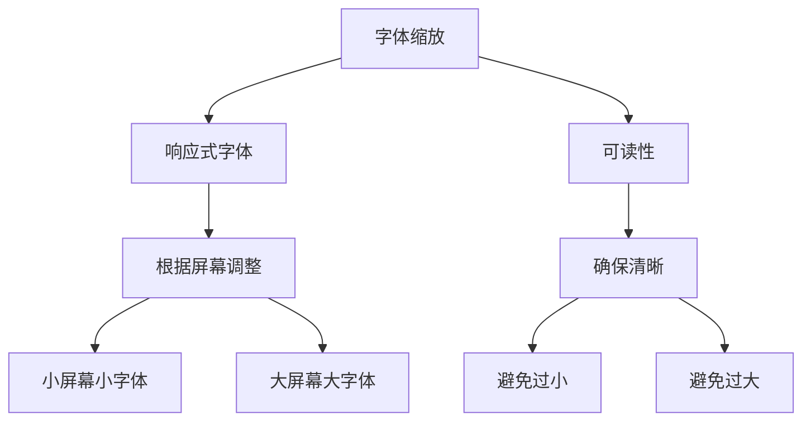

**图表来源**  
- [DesktopArtistDetails.jsx](file://ui/src/artist/DesktopArtistDetails.jsx)
- [MobileArtistDetails.jsx](file://ui/src/artist/MobileArtistDetails.jsx)

**本节来源**  
- [DesktopArtistDetails.jsx](file://ui/src/artist/DesktopArtistDetails.jsx)
- [MobileArtistDetails.jsx](file://ui/src/artist/MobileArtistDetails.jsx)

### 手势冲突问题

移动设备上的手势操作可能产生冲突，系统通过事件处理机制解决。

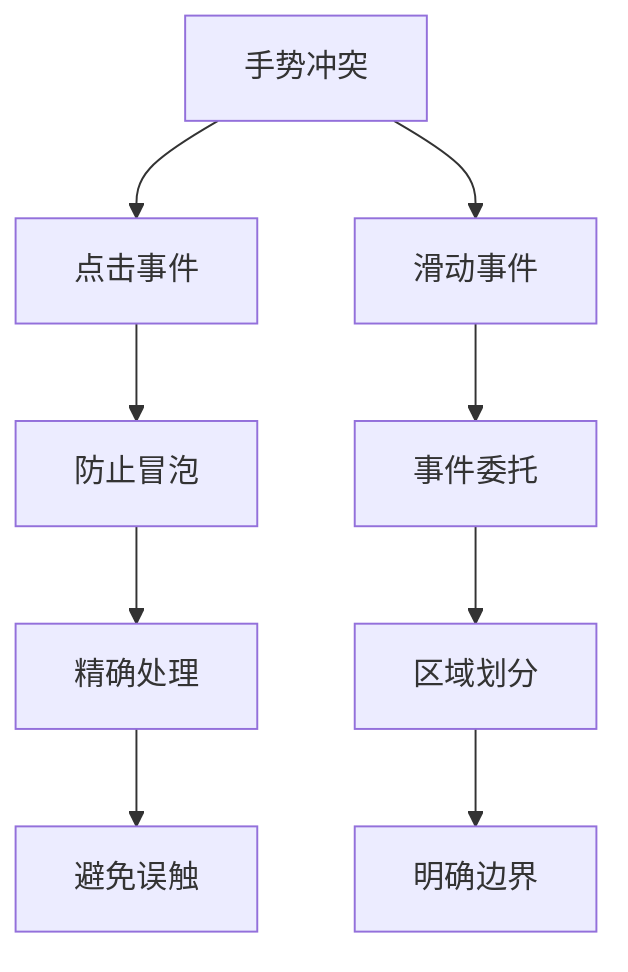

**图表来源**  
- [MobileArtistDetails.jsx](file://ui/src/artist/MobileArtistDetails.jsx)

**本节来源**  
- [MobileArtistDetails.jsx](file://ui/src/artist/MobileArtistDetails.jsx)