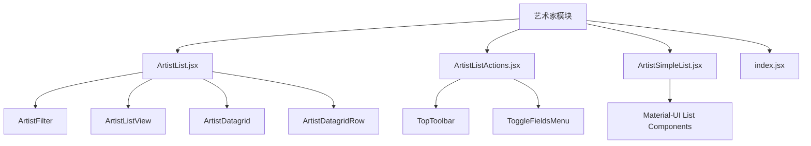
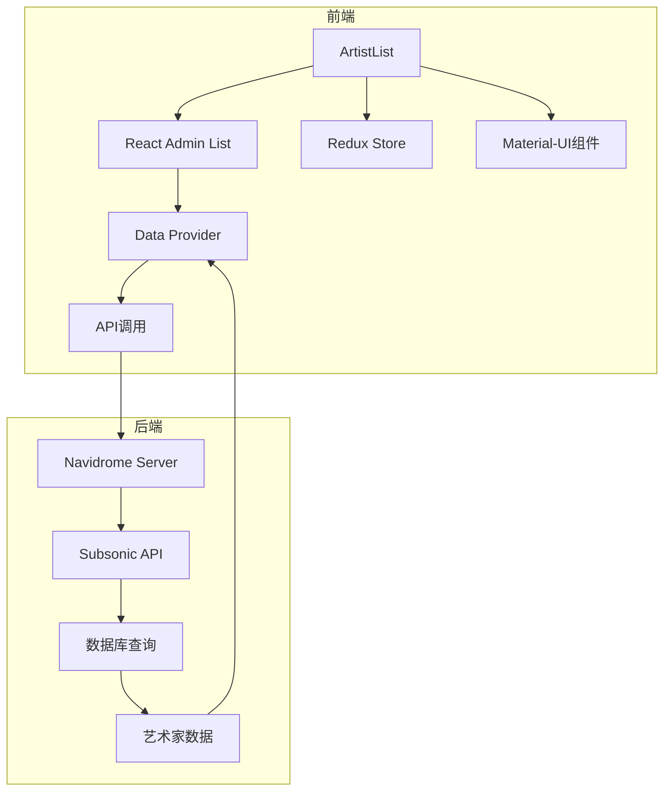
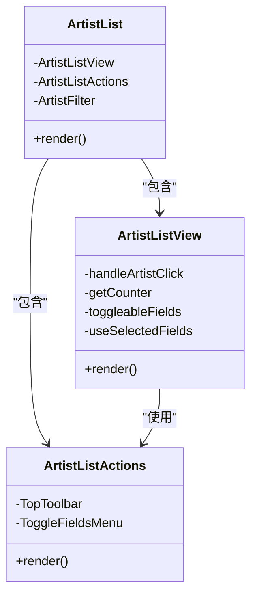
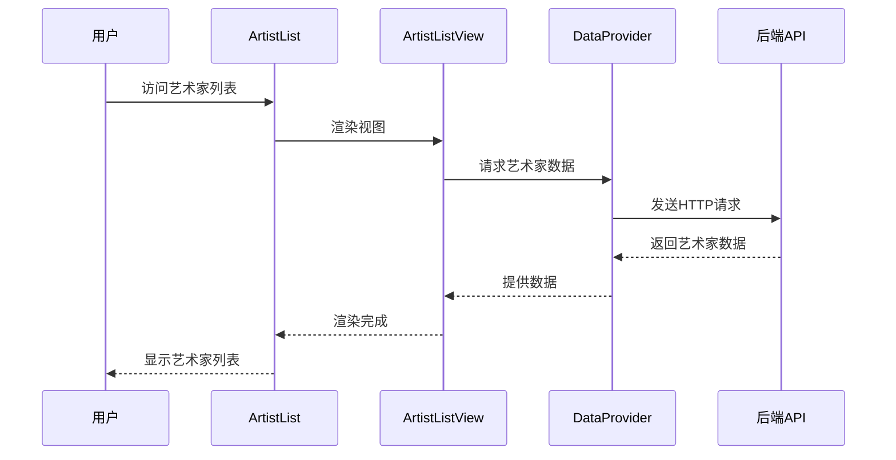
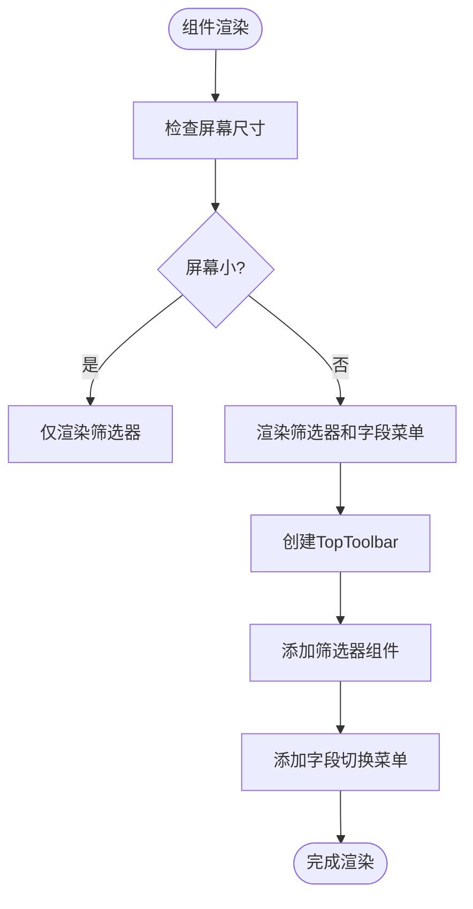
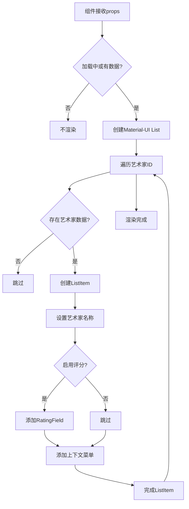
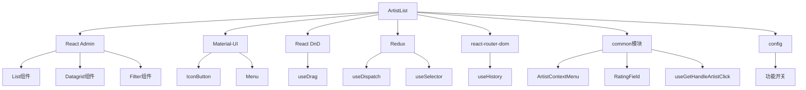
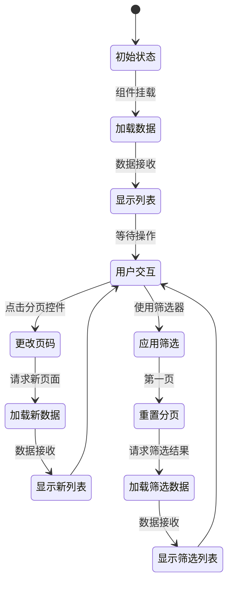

# 艺术家列表组件

<cite>
**本文档中引用的文件**  
- [ArtistList.jsx](file://ui/src/artist/ArtistList.jsx)
- [ArtistListActions.jsx](file://ui/src/artist/ArtistListActions.jsx)
- [ArtistSimpleList.jsx](file://ui/src/artist/ArtistSimpleList.jsx)
- [index.jsx](file://ui/src/artist/index.jsx)
- [List.jsx](file://ui/src/common/List.jsx)
- [Pagination.jsx](file://ui/src/common/Pagination.jsx)
- [ToggleFieldsMenu.jsx](file://ui/src/common/ToggleFieldsMenu.jsx)
- [useGetHandleArtistClick.jsx](file://ui/src/common/useGetHandleArtistClick.jsx)
- [filters.go](file://server/subsonic/filter/filters.go)
- [library.js](file://ui/src/actions/library.js)
</cite>

## 目录
1. [简介](#简介)
2. [项目结构](#项目结构)
3. [核心组件](#核心组件)
4. [架构概述](#架构概述)
5. [详细组件分析](#详细组件分析)
6. [依赖分析](#依赖分析)
7. [性能考虑](#性能考虑)
8. [故障排除指南](#故障排除指南)
9. [结论](#结论)

## 简介
本文档详细分析了Navidrome音乐服务器中的艺术家列表组件。该组件负责渲染艺术家的网格或列表视图，支持分页、排序和筛选功能，并集成了批量操作和上下文菜单。文档深入探讨了其状态管理机制、与业务逻辑的交互方式以及在处理大型艺术家库时的性能优化策略。

## 项目结构
艺术家列表组件位于`ui/src/artist/`目录下，是Navidrome前端UI的一部分。该组件基于React和React Admin框架构建，利用Material-UI进行样式设计，并通过Redux管理应用状态。组件结构清晰，遵循模块化设计原则。

**图表来源**
- [ArtistList.jsx](file://ui/src/artist/ArtistList.jsx)
- [ArtistListActions.jsx](file://ui/src/artist/ArtistListActions.jsx)
- [ArtistSimpleList.jsx](file://ui/src/artist/ArtistSimpleList.jsx)
- [index.jsx](file://ui/src/artist/index.jsx)

**章节来源**
- [ArtistList.jsx](file://ui/src/artist/ArtistList.jsx)
- [ArtistListActions.jsx](file://ui/src/artist/ArtistListActions.jsx)
- [ArtistSimpleList.jsx](file://ui/src/artist/ArtistSimpleList.jsx)
- [index.jsx](file://ui/src/artist/index.jsx)

## 核心组件
艺术家列表组件的核心功能包括：艺术家数据的展示、用户交互处理、状态管理和性能优化。组件通过React Admin的List组件实现基础功能，并通过自定义组件扩展功能。

**章节来源**
- [ArtistList.jsx](file://ui/src/artist/ArtistList.jsx)
- [List.jsx](file://ui/src/common/List.jsx)

## 架构概述
艺术家列表组件采用分层架构设计，包括数据获取层、状态管理层、UI渲染层和交互处理层。组件通过React Admin的数据提供者模式与后端API通信，使用Redux管理全局状态，并通过React的Hooks API管理局部状态。

**图表来源**
- [ArtistList.jsx](file://ui/src/artist/ArtistList.jsx)
- [List.jsx](file://ui/src/common/List.jsx)
- [filters.go](file://server/subsonic/filter/filters.go)

## 详细组件分析

### ArtistList组件分析
ArtistList组件是艺术家列表的主要容器组件，负责协调其他子组件的工作。它使用React Admin的List组件作为基础，并通过自定义props进行功能扩展。

#### 组件结构

**图表来源**
- [ArtistList.jsx](file://ui/src/artist/ArtistList.jsx)
- [ArtistListActions.jsx](file://ui/src/artist/ArtistListActions.jsx)

#### 交互流程

**图表来源**
- [ArtistList.jsx](file://ui/src/artist/ArtistList.jsx)
- [List.jsx](file://ui/src/common/List.jsx)

### ArtistListActions组件分析
ArtistListActions组件负责渲染列表顶部的工具栏，包含筛选器和字段切换菜单。

#### 功能实现

**图表来源**
- [ArtistListActions.jsx](file://ui/src/artist/ArtistListActions.jsx)
- [ToggleFieldsMenu.jsx](file://ui/src/common/ToggleFieldsMenu.jsx)

**章节来源**
- [ArtistListActions.jsx](file://ui/src/artist/ArtistListActions.jsx)
- [ToggleFieldsMenu.jsx](file://ui/src/common/ToggleFieldsMenu.jsx)

### ArtistSimpleList组件分析
ArtistSimpleList组件用于在小屏幕设备上提供简洁的艺术家列表视图。

#### 渲染逻辑

**图表来源**
- [ArtistSimpleList.jsx](file://ui/src/artist/ArtistSimpleList.jsx)

**章节来源**
- [ArtistSimpleList.jsx](file://ui/src/artist/ArtistSimpleList.jsx)

## 依赖分析
艺术家列表组件依赖于多个内部和外部组件及服务，形成了复杂的依赖网络。

**图表来源**
- [ArtistList.jsx](file://ui/src/artist/ArtistList.jsx)
- [ArtistListActions.jsx](file://ui/src/artist/ArtistListActions.jsx)
- [ArtistSimpleList.jsx](file://ui/src/artist/ArtistSimpleList.jsx)

**章节来源**
- [ArtistList.jsx](file://ui/src/artist/ArtistList.jsx)
- [ArtistListActions.jsx](file://ui/src/artist/ArtistListActions.jsx)
- [ArtistSimpleList.jsx](file://ui/src/artist/ArtistSimpleList.jsx)

## 性能考虑
艺术家列表组件在处理大型艺术家库时需要考虑性能优化，包括虚拟滚动、数据分页和内存管理。

### 分页机制
组件使用React Admin的内置分页功能，每页默认显示15个艺术家，用户可选择15、25或50个艺术家每页。

**图表来源**
- [List.jsx](file://ui/src/common/List.jsx)
- [Pagination.jsx](file://ui/src/common/Pagination.jsx)

### 虚拟滚动建议
对于大型艺术家库，建议实现虚拟滚动以提高性能：
1. 使用`react-window`或`react-virtualized`库
2. 只渲染可视区域内的艺术家项
3. 动态计算滚动位置和可见项
4. 缓存已渲染的项以提高滚动性能

**章节来源**
- [ArtistList.jsx](file://ui/src/artist/ArtistList.jsx)
- [ArtistSimpleList.jsx](file://ui/src/artist/ArtistSimpleList.jsx)

## 故障排除指南
### 常见问题及解决方案
| 问题 | 可能原因 | 解决方案 |
|------|---------|---------|
| 艺术家列表不显示 | 数据加载失败 | 检查网络连接和API端点 |
| 筛选功能无效 | 筛选器配置错误 | 检查筛选器组件的props传递 |
| 分页不工作 | 分页组件配置错误 | 检查Pagination组件的实现 |
| 上下文菜单不显示 | 权限问题 | 检查用户权限设置 |
| 性能缓慢 | 数据量过大 | 实现虚拟滚动或增加分页大小 |

**章节来源**
- [ArtistList.jsx](file://ui/src/artist/ArtistList.jsx)
- [ArtistListActions.jsx](file://ui/src/artist/ArtistListActions.jsx)
- [ArtistSimpleList.jsx](file://ui/src/artist/ArtistSimpleList.jsx)

## 结论
艺术家列表组件是Navidrome音乐服务器中的关键UI组件，提供了丰富的功能和良好的用户体验。通过合理的架构设计和组件化开发，该组件实现了高效的数据展示和用户交互。未来可以通过实现虚拟滚动等性能优化技术，进一步提升在处理大型音乐库时的表现。