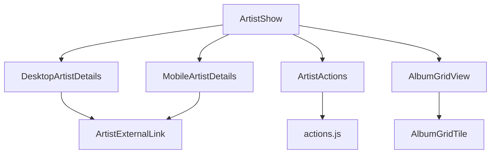
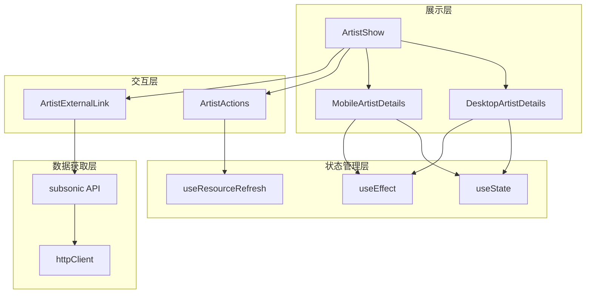
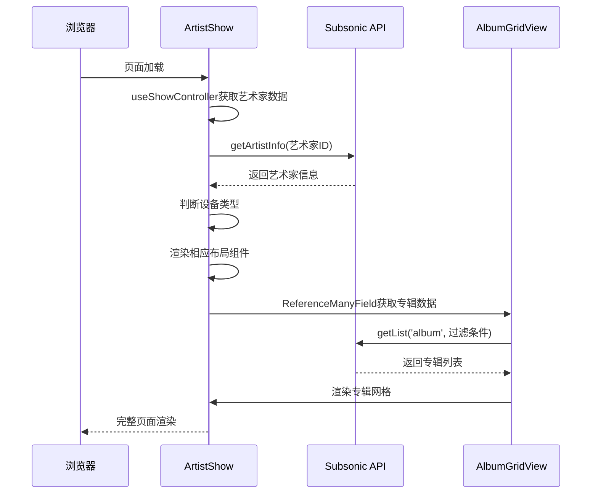
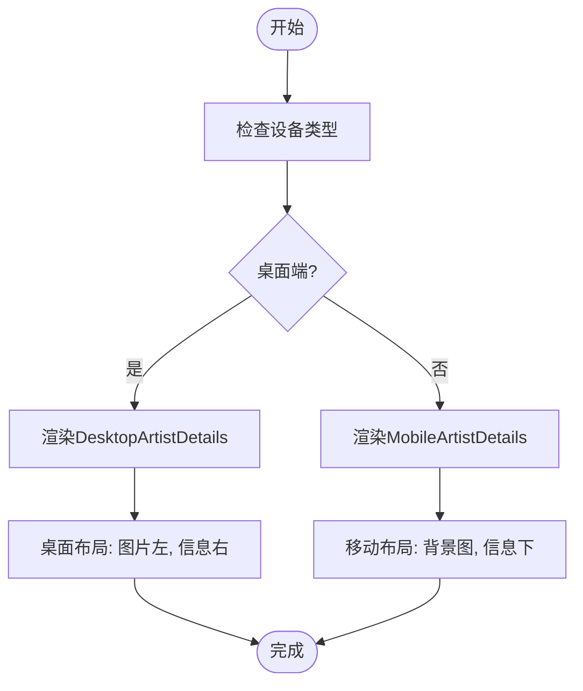
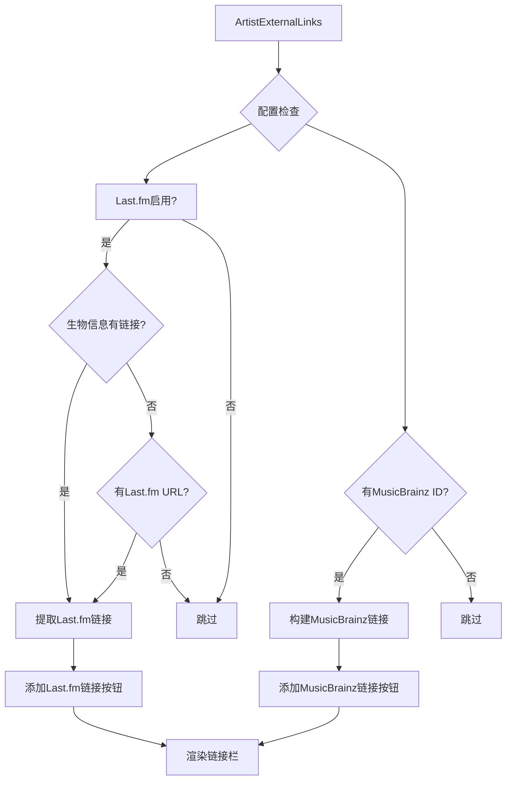
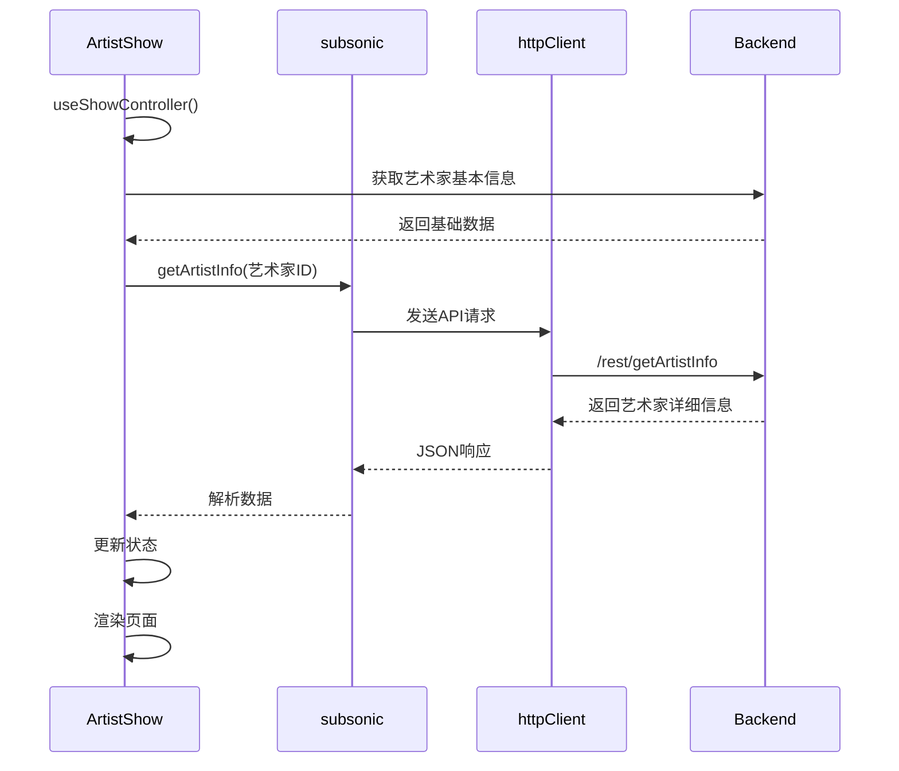
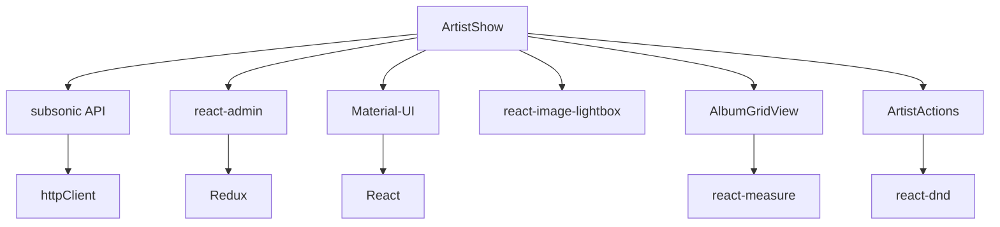

# 艺术家展示组件

<cite>
**本文档中引用的文件**  
- [ArtistShow.jsx](file://ui/src/artist/ArtistShow.jsx)
- [DesktopArtistDetails.jsx](file://ui/src/artist/DesktopArtistDetails.jsx)
- [MobileArtistDetails.jsx](file://ui/src/artist/MobileArtistDetails.jsx)
- [ArtistExternalLink.jsx](file://ui/src/artist/ArtistExternalLink.jsx)
- [ArtistActions.jsx](file://ui/src/artist/ArtistActions.jsx)
- [actions.js](file://ui/src/artist/actions.js)
- [AlbumGridView.jsx](file://ui/src/album/AlbumGridView.jsx)
- [LoveButton.jsx](file://ui/src/common/LoveButton.jsx)
- [RatingField.jsx](file://ui/src/common/RatingField.jsx)
- [useResourceRefresh.jsx](file://ui/src/common/useResourceRefresh.jsx)
- [index.js](file://ui/src/subsonic/index.js)
</cite>

## 目录
1. [介绍](#介绍)
2. [项目结构](#项目结构)
3. [核心组件](#核心组件)
4. [架构概述](#架构概述)
5. [详细组件分析](#详细组件分析)
6. [依赖分析](#依赖分析)
7. [性能考虑](#性能考虑)
8. [故障排除指南](#故障排除指南)
9. [结论](#结论)

## 介绍
艺术家展示组件是Navidrome音乐服务器前端的核心功能之一，负责展示艺术家的详细信息。该组件实现了响应式设计，能够根据设备类型（桌面端或移动端）动态调整布局和功能。组件整合了艺术家基本信息、专辑网格展示、外部链接集成等多种功能，为用户提供全面的艺术家信息浏览体验。通过与Subsonic API的交互，组件能够获取艺术家的生物信息、外部服务链接等丰富数据，并支持收藏、评分等用户交互功能。

## 项目结构
艺术家展示组件位于UI模块的artist子目录中，采用React和Material-UI构建。组件结构清晰，分为展示层、交互层和数据获取层。主要文件包括ArtistShow作为主组件，DesktopArtistDetails和MobileArtistDetails分别处理桌面端和移动端的布局渲染，ArtistExternalLink处理外部服务链接展示，ArtistActions提供播放操作功能。

**图示来源**
- [ArtistShow.jsx](file://ui/src/artist/ArtistShow.jsx)
- [DesktopArtistDetails.jsx](file://ui/src/artist/DesktopArtistDetails.jsx)
- [MobileArtistDetails.jsx](file://ui/src/artist/MobileArtistDetails.jsx)

## 核心组件
艺术家展示组件的核心是ArtistShow组件，它作为入口点整合了所有子组件。组件通过useShowController获取艺术家数据，并根据屏幕尺寸决定渲染DesktopArtistDetails还是MobileArtistDetails。专辑展示部分使用ReferenceManyField从后端获取艺术家的专辑数据，并通过AlbumGridView进行网格化展示。组件还集成了艺术家操作功能，如播放热门歌曲、随机播放和电台播放等。

**节来源**
- [ArtistShow.jsx](file://ui/src/artist/ArtistShow.jsx)
- [AlbumGridView.jsx](file://ui/src/album/AlbumGridView.jsx)

## 架构概述
艺术家展示组件采用分层架构设计，分为数据获取层、状态管理层、展示层和交互层。数据获取层通过Subsonic API客户端与后端通信；状态管理层使用React的useState和useEffect管理组件状态；展示层根据设备类型选择相应的布局组件；交互层处理用户操作和外部服务集成。

**图示来源**
- [ArtistShow.jsx](file://ui/src/artist/ArtistShow.jsx)
- [DesktopArtistDetails.jsx](file://ui/src/artist/DesktopArtistDetails.jsx)
- [MobileArtistDetails.jsx](file://ui/src/artist/MobileArtistDetails.jsx)
- [useResourceRefresh.jsx](file://ui/src/common/useResourceRefresh.jsx)
- [index.js](file://ui/src/subsonic/index.js)

## 详细组件分析

### ArtistShow组件分析
ArtistShow组件是艺术家页面的主容器，负责协调各个子组件的工作。组件使用useShowController获取艺术家数据，并通过isDesktop媒体查询判断设备类型，动态选择渲染DesktopArtistDetails或MobileArtistDetails。专辑展示部分使用ReferenceManyField实现分页加载，根据专辑数量动态调整每页显示数量。

**图示来源**
- [ArtistShow.jsx](file://ui/src/artist/ArtistShow.jsx)
- [AlbumGridView.jsx](file://ui/src/album/AlbumGridView.jsx)

### 响应式布局分析
艺术家展示组件实现了完整的响应式设计，通过useMediaQuery检测屏幕尺寸，动态调整布局。桌面端使用DesktopArtistDetails组件，采用卡片式布局，左侧显示艺术家图片，右侧显示详细信息；移动端使用MobileArtistDetails组件，采用背景图融合设计，顶部显示艺术家图片和基本信息，底部显示生物信息。

**图示来源**
- [ArtistShow.jsx](file://ui/src/artist/ArtistShow.jsx)
- [DesktopArtistDetails.jsx](file://ui/src/artist/DesktopArtistDetails.jsx)
- [MobileArtistDetails.jsx](file://ui/src/artist/MobileArtistDetails.jsx)

### 外部链接集成分析
艺术家外部链接功能通过ArtistExternalLink组件实现，该组件从艺术家信息中提取Last.fm和MusicBrainz链接。组件使用正则表达式解析生物信息中的HTML链接，并根据配置决定是否显示特定服务的链接。链接以图标按钮形式展示，用户点击后在新窗口打开外部服务页面。

**图示来源**
- [ArtistExternalLink.jsx](file://ui/src/artist/ArtistExternalLink.jsx)

### 数据加载与状态管理
艺术家展示组件的数据加载流程始于ArtistShow组件的useShowController，该hook负责从后端获取艺术家基本信息。随后，组件通过subsonic.getArtistInfo调用获取艺术家的详细信息，包括生物信息和外部服务链接。useResourceRefresh hook确保当艺术家数据更新时，页面能自动刷新。

**图示来源**
- [ArtistShow.jsx](file://ui/src/artist/ArtistShow.jsx)
- [index.js](file://ui/src/subsonic/index.js)
- [useResourceRefresh.jsx](file://ui/src/common/useResourceRefresh.jsx)

## 依赖分析
艺术家展示组件依赖多个内部和外部库。内部依赖包括subsonic API客户端、common通用组件库和album专辑组件。外部依赖包括React、Material-UI、react-admin等UI框架，以及react-image-lightbox用于图片灯箱功能。

**图示来源**
- [ArtistShow.jsx](file://ui/src/artist/ArtistShow.jsx)
- [index.js](file://ui/src/subsonic/index.js)
- [AlbumGridView.jsx](file://ui/src/album/AlbumGridView.jsx)

## 性能考虑
艺术家展示组件在性能方面进行了多项优化。专辑网格使用虚拟化技术，只渲染可视区域的专辑，提高大数据量下的渲染性能。图片加载采用懒加载和错误处理机制，避免页面加载阻塞。useResourceRefresh优化了数据刷新逻辑，避免不必要的全页刷新。

**节来源**
- [AlbumGridView.jsx](file://ui/src/album/AlbumGridView.jsx)
- [DesktopArtistDetails.jsx](file://ui/src/artist/DesktopArtistDetails.jsx)
- [MobileArtistDetails.jsx](file://ui/src/artist/MobileArtistDetails.jsx)

## 故障排除指南
艺术家展示组件可能遇到的常见问题包括图片加载失败、外部链接不显示和数据刷新异常。图片加载失败通常由网络问题或图片URL无效导致，组件已实现错误状态处理。外部链接不显示可能是由于配置未启用相关服务或艺术家信息中缺少相应ID。数据刷新异常可检查SSE连接状态和useResourceRefresh的使用是否正确。

**节来源**
- [DesktopArtistDetails.jsx](file://ui/src/artist/DesktopArtistDetails.jsx)
- [MobileArtistDetails.jsx](file://ui/src/artist/MobileArtistDetails.jsx)
- [ArtistExternalLink.jsx](file://ui/src/artist/ArtistExternalLink.jsx)

## 结论
艺术家展示组件是Navidrome前端的重要组成部分，通过响应式设计和模块化架构，为用户提供了优质的艺术家信息浏览体验。组件在功能完整性、用户体验和性能优化方面都表现出色，是前端开发的优秀范例。未来可进一步优化虚拟滚动性能，增加更多外部服务集成，提升整体用户体验。