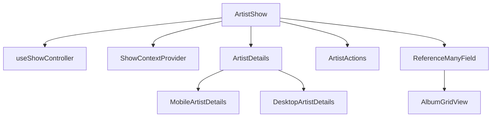
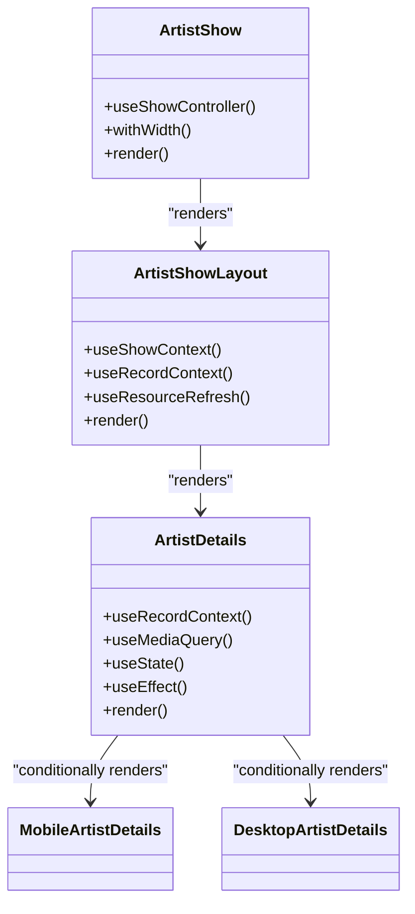
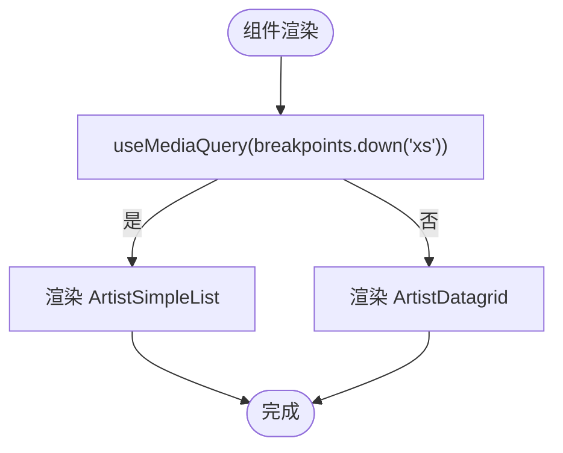
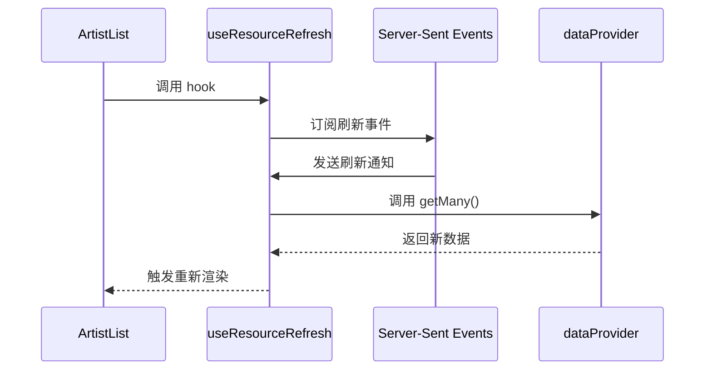
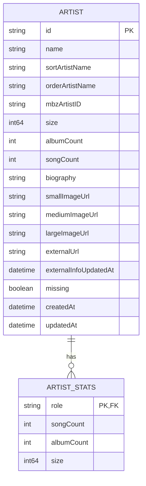

# 艺术家组件

<cite>
**本文档中引用的文件**  
- [ArtistShow.jsx](file://ui/src/artist/ArtistShow.jsx)
- [ArtistList.jsx](file://ui/src/artist/ArtistList.jsx)
- [artist.go](file://model/artist.go)
- [MobileArtistDetails.jsx](file://ui/src/artist/MobileArtistDetails.jsx)
- [DesktopArtistDetails.jsx](file://ui/src/artist/DesktopArtistDetails.jsx)
- [ArtistActions.jsx](file://ui/src/artist/ArtistActions.jsx)
- [ArtistSimpleList.jsx](file://ui/src/artist/ArtistSimpleList.jsx)
- [ArtistListActions.jsx](file://ui/src/artist/ArtistListActions.jsx)
- [actions.js](file://ui/src/artist/actions.js)
- [ArtistExternalLink.jsx](file://ui/src/artist/ArtistExternalLink.jsx)
</cite>

## 目录
1. [简介](#简介)
2. [项目结构](#项目结构)
3. [核心组件](#核心组件)
4. [架构概述](#架构概述)
5. [详细组件分析](#详细组件分析)
6. [依赖分析](#依赖分析)
7. [性能考虑](#性能考虑)
8. [故障排除指南](#故障排除指南)
9. [结论](#结论)

## 简介
Navidrome 是一个开源的音乐服务器和流媒体解决方案，提供类似 Subsonic 的功能。本文档重点介绍其艺术家组件的实现，包括 ArtistShow 和 ArtistList 组件。这些组件负责艺术家信息的展示、相关专辑的渲染、响应式布局等功能。文档将深入分析艺术家数据结构、状态管理、组件通信机制，以及桌面端和移动端的差异化设计实现。

## 项目结构
Navidrome 项目采用模块化设计，前端 UI 组件位于 `ui/src` 目录下，后端模型和业务逻辑位于根目录的各个包中。艺术家相关的前端组件主要集中在 `ui/src/artist` 目录，而后端数据模型定义在 `model/artist.go` 文件中。

```mermaid
graph TB
subgraph "前端 UI"
A[ui/src/artist]
A --> B[ArtistShow.jsx]
A --> C[ArtistList.jsx]
A --> D[MobileArtistDetails.jsx]
A --> E[DesktopArtistDetails.jsx]
end
subgraph "后端模型"
F[model]
F --> G[artist.go]
end
A < --> H[API 接口]
H < --> F
```

**图示来源**
- [ArtistShow.jsx](file://ui/src/artist/ArtistShow.jsx)
- [artist.go](file://model/artist.go)

**本节来源**
- [ArtistShow.jsx](file://ui/src/artist/ArtistShow.jsx)
- [artist.go](file://model/artist.go)

## 核心组件
艺术家组件的核心是 `ArtistShow` 和 `ArtistList` 两个 React 组件。`ArtistShow` 用于展示单个艺术家的详细信息，包括传记、专辑列表和操作按钮。`ArtistList` 则用于在列表视图中展示所有艺术家，支持搜索、过滤和排序功能。

**本节来源**
- [ArtistShow.jsx](file://ui/src/artist/ArtistShow.jsx)
- [ArtistList.jsx](file://ui/src/artist/ArtistList.jsx)

## 架构概述
艺术家组件的架构遵循 React 的组件化设计原则，采用分层结构。顶层组件负责数据获取和状态管理，中间层组件处理布局和条件渲染，底层组件专注于具体的 UI 元素展示。



**图示来源**
- [ArtistShow.jsx](file://ui/src/artist/ArtistShow.jsx)

## 详细组件分析

### ArtistShow 组件分析
`ArtistShow` 组件是艺术家详情页的入口点。它使用 `useShowController` 钩子来管理数据获取和加载状态，并通过 `ShowContextProvider` 将上下文传递给子组件。

#### 组件结构


**图示来源**
- [ArtistShow.jsx](file://ui/src/artist/ArtistShow.jsx)

#### 数据加载流程
```mermaid
sequenceDiagram
participant Show as ArtistShow
participant Controller as useShowController
participant API as Subsonic API
participant Details as ArtistDetails
Show->>Controller : 初始化
Controller->>API : GET /artist/{id}
API-->>Controller : 返回艺术家数据
Controller-->>Show : 提供数据和状态
Show->>Details : 渲染 ArtistDetails
Details->>API : getArtistInfo(record.id)
API-->>Details : 返回艺术家信息
Details-->>Show : 完成渲染
```

**图示来源**
- [ArtistShow.jsx](file://ui/src/artist/ArtistShow.jsx)

**本节来源**
- [ArtistShow.jsx](file://ui/src/artist/ArtistShow.jsx)

### ArtistList 组件分析
`ArtistList` 组件负责艺术家列表的展示，支持响应式布局和多种交互功能。

#### 响应式设计实现


**图示来源**
- [ArtistList.jsx](file://ui/src/artist/ArtistList.jsx)

#### 组件通信机制
`ArtistList` 组件通过 React 的 props 和 hooks 机制与子组件通信。`useResourceRefresh` 钩子用于监听数据变化并自动刷新组件。



**图示来源**
- [ArtistList.jsx](file://ui/src/artist/ArtistList.jsx)
- [useResourceRefresh.jsx](file://ui/src/common/useResourceRefresh.jsx)

**本节来源**
- [ArtistList.jsx](file://ui/src/artist/ArtistList.jsx)

### 艺术家数据结构
艺术家数据结构定义了艺术家的所有属性和关系，包括基本信息、统计信息和外部信息。



**图示来源**
- [artist.go](file://model/artist.go)

**本节来源**
- [artist.go](file://model/artist.go)

## 依赖分析
艺术家组件依赖于多个内部和外部模块，形成了复杂的依赖关系网络。

```mermaid
graph TD
A[ArtistShow] --> B[react-admin]
A --> C[@material-ui/core]
A --> D[subsonic]
A --> E[AlbumGridView]
A --> F[ArtistActions]
F --> G[actions.js]
G --> H[playTracks]
A --> I[useResourceRefresh]
I --> J[Server-Sent Events]
```

**图示来源**
- [ArtistShow.jsx](file://ui/src/artist/ArtistShow.jsx)
- [actions.js](file://ui/src/artist/actions.js)

**本节来源**
- [ArtistShow.jsx](file://ui/src/artist/ArtistShow.jsx)
- [actions.js](file://ui/src/artist/actions.js)

## 性能考虑
艺术家组件在性能方面进行了多项优化，包括数据分页、图片懒加载和状态管理。

- **数据分页**: 当艺术家的专辑数量超过 90 时，自动启用分页功能
- **图片加载**: 使用 `onLoad` 和 `onError` 事件处理图片加载状态，提供加载中和错误状态的视觉反馈
- **状态管理**: 使用 React 的 `useState` 和 `useEffect` 钩子进行高效的状态管理
- **资源刷新**: 通过 `useResourceRefresh` 钩子实现智能刷新，避免不必要的数据请求

## 故障排除指南
### 常见问题及解决方案

#### 艺术家图片无法加载
**问题**: 艺术家图片显示为空或加载失败
**解决方案**: 
1. 检查网络连接是否正常
2. 确认图片 URL 是否正确
3. 查看浏览器控制台是否有错误信息
4. 检查 `subsonic.getCoverArtUrl()` 函数的实现

**本节来源**
- [MobileArtistDetails.jsx](file://ui/src/artist/MobileArtistDetails.jsx)
- [DesktopArtistDetails.jsx](file://ui/src/artist/DesktopArtistDetails.jsx)

#### 相似艺术家推荐功能失效
**问题**: 相似艺术家推荐按钮点击无响应
**解决方案**:
1. 确认 Last.fm 或其他外部服务已正确配置
2. 检查 API 密钥是否有效
3. 查看网络请求是否成功
4. 确认 `playSimilar` 函数的实现

**本节来源**
- [ArtistActions.jsx](file://ui/src/artist/ArtistActions.jsx)
- [actions.js](file://ui/src/artist/actions.js)

## 结论
Navidrome 的艺术家组件通过精心设计的架构和高效的实现，提供了丰富的功能和良好的用户体验。组件采用了现代化的 React 开发模式，结合了响应式设计、智能状态管理和优化的性能策略。通过深入分析这些组件，我们可以更好地理解其工作原理，并为未来的开发和维护提供指导。