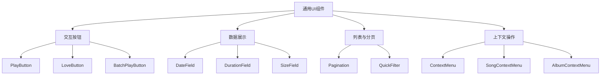
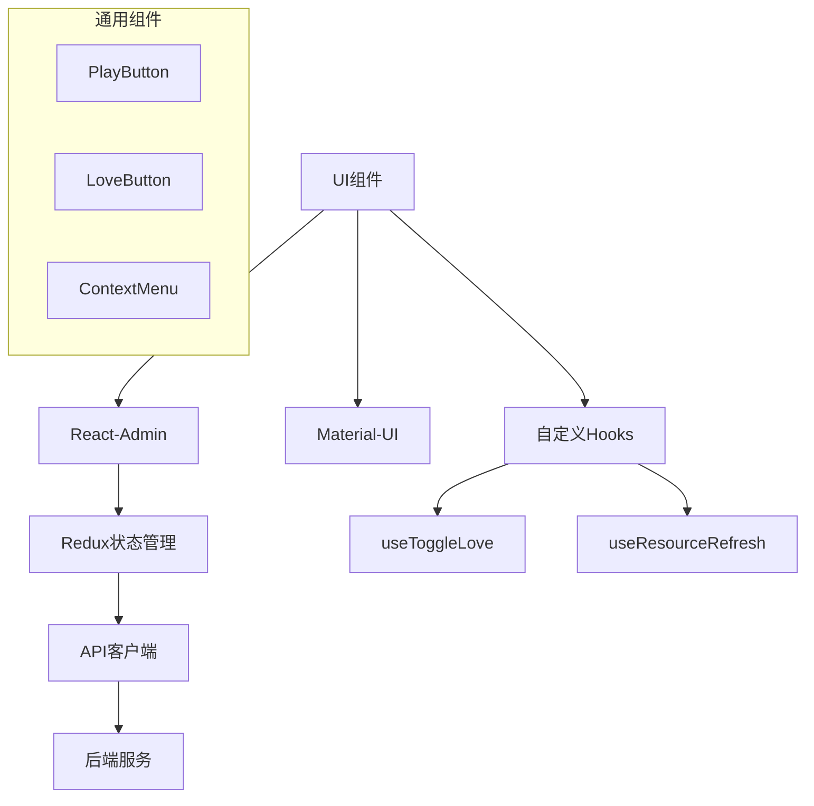
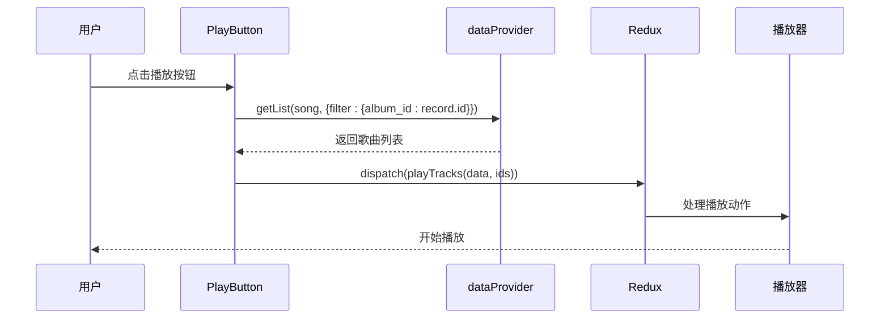
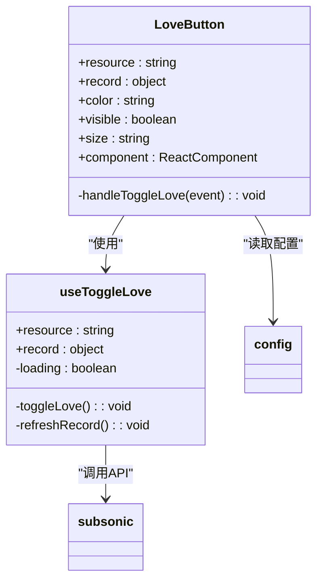
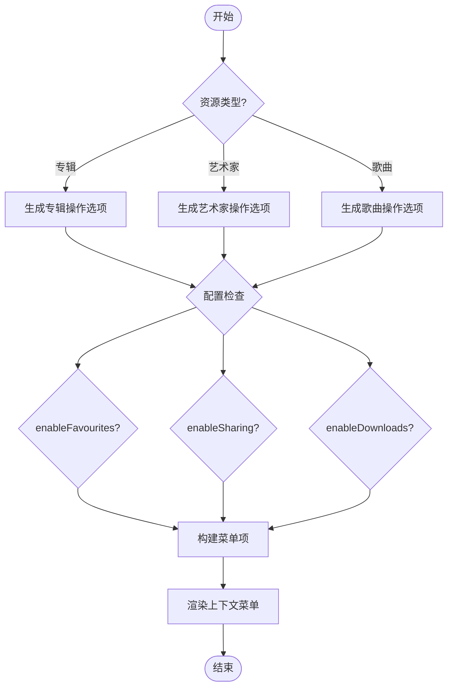
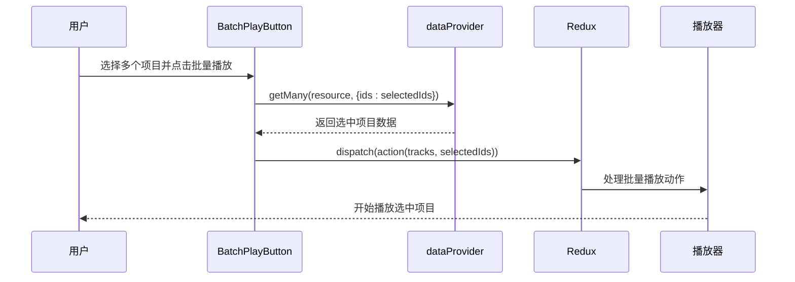
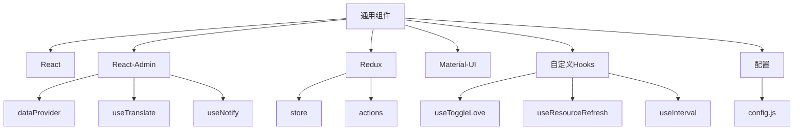

# 通用组件

<cite>
**本文档中引用的文件**  
- [PlayButton.jsx](file://ui/src/common/PlayButton.jsx)
- [LoveButton.jsx](file://ui/src/common/LoveButton.jsx)
- [ContextMenus.jsx](file://ui/src/common/ContextMenus.jsx)
- [useToggleLove.jsx](file://ui/src/common/useToggleLove.jsx)
- [SongContextMenu.jsx](file://ui/src/common/SongContextMenu.jsx)
- [BatchPlayButton.jsx](file://ui/src/common/BatchPlayButton.jsx)
- [Pagination.jsx](file://ui/src/common/Pagination.jsx)
- [QuickFilter.jsx](file://ui/src/common/QuickFilter.jsx)
- [config.js](file://ui/src/config.js)
- [player.js](file://ui/src/actions/player.js)
</cite>

## 目录
1. [简介](#简介)
2. [项目结构](#项目结构)
3. [核心组件](#核心组件)
4. [架构概述](#架构概述)
5. [详细组件分析](#详细组件分析)
6. [依赖分析](#依赖分析)
7. [性能考虑](#性能考虑)
8. [故障排除指南](#故障排除指南)
9. [结论](#结论)

## 简介
本文档详细介绍了Navidrome音乐服务器中的通用UI组件。重点分析了PlayButton、LoveButton和ContextMenu等可复用组件的设计模式、实现细节和使用场景。文档涵盖了这些组件的props接口、状态管理、样式定制机制以及在不同上下文中的集成方式。同时解释了分页、过滤、上下文菜单等通用交互模式的实现，并提供了组件复用的最佳实践示例。还讨论了可访问性、国际化和主题兼容性等常见问题的解决方案。

## 项目结构
Navidrome的UI组件主要位于`ui/src/common`目录下，采用React和Material-UI构建，遵循React-Admin框架的设计模式。这些通用组件被设计为高度可复用的独立单元，可以在不同的页面和上下文中使用。

**Diagram sources**
- [ui/src/common](file://ui/src/common)

**Section sources**
- [ui/src/common](file://ui/src/common)

## 核心组件
Navidrome的通用UI组件设计遵循单一职责原则，每个组件都有明确的功能定位。PlayButton用于播放控制，LoveButton处理收藏状态，ContextMenu提供上下文操作菜单。这些组件通过React-Redux与应用状态进行交互，并利用React-Admin的数据提供机制获取所需数据。

**Section sources**
- [ui/src/common/PlayButton.jsx](file://ui/src/common/PlayButton.jsx#L1-L61)
- [ui/src/common/LoveButton.jsx](file://ui/src/common/LoveButton.jsx#L1-L86)
- [ui/src/common/ContextMenus.jsx](file://ui/src/common/ContextMenus.jsx#L1-L280)

## 架构概述
Navidrome的UI架构采用分层设计，通用组件层位于最上层，依赖于React-Admin框架提供的数据抽象层和Redux状态管理。组件通过hooks与应用状态进行交互，实现了关注点分离。

**Diagram sources**
- [ui/src/common](file://ui/src/common)
- [ui/src/actions](file://ui/src/actions)

## 详细组件分析
对Navidrome中的关键通用UI组件进行深入分析，包括其设计模式、实现细节和使用场景。

### PlayButton分析
PlayButton组件用于触发播放操作，通常在专辑、播放列表等上下文中使用。它通过dataProvider获取相关歌曲数据，并通过Redux dispatch播放动作。

**Diagram sources**
- [ui/src/common/PlayButton.jsx](file://ui/src/common/PlayButton.jsx#L1-L61)
- [ui/src/actions/player.js](file://ui/src/actions/player.js#L70-L77)

**Section sources**
- [ui/src/common/PlayButton.jsx](file://ui/src/common/PlayButton.jsx#L1-L61)

### LoveButton分析
LoveButton组件处理收藏/取消收藏功能，其显示状态根据记录的starred属性动态变化。该组件使用自定义hook useToggleLove来管理收藏状态的切换逻辑。

**Diagram sources**
- [ui/src/common/LoveButton.jsx](file://ui/src/common/LoveButton.jsx#L1-L86)
- [ui/src/common/useToggleLove.jsx](file://ui/src/common/useToggleLove.jsx#L1-L65)

**Section sources**
- [ui/src/common/LoveButton.jsx](file://ui/src/common/LoveButton.jsx#L1-L86)
- [ui/src/common/useToggleLove.jsx](file://ui/src/common/useToggleLove.jsx#L1-L65)

### ContextMenu分析
ContextMenu组件提供了一组上下文相关的操作菜单，包括播放、添加到队列、分享等。它根据资源类型和配置动态生成可用的操作选项。

**Diagram sources**
- [ui/src/common/ContextMenus.jsx](file://ui/src/common/ContextMenus.jsx#L1-L280)
- [ui/src/common/SongContextMenu.jsx](file://ui/src/common/SongContextMenu.jsx#L1-L297)

**Section sources**
- [ui/src/common/ContextMenus.jsx](file://ui/src/common/ContextMenus.jsx#L1-L280)
- [ui/src/common/SongContextMenu.jsx](file://ui/src/common/SongContextMenu.jsx#L1-L297)

### 批量操作组件分析
批量操作组件如BatchPlayButton允许用户对多个选中的项目执行操作，提高了用户操作效率。

**Diagram sources**
- [ui/src/common/BatchPlayButton.jsx](file://ui/src/common/BatchPlayButton.jsx#L1-L62)
- [ui/src/actions/player.js](file://ui/src/actions/player.js#L30-L36)

**Section sources**
- [ui/src/common/BatchPlayButton.jsx](file://ui/src/common/BatchPlayButton.jsx#L1-L62)

## 依赖分析
Navidrome的通用UI组件依赖于多个外部库和内部模块，形成了清晰的依赖关系。

**Diagram sources**
- [ui/src/common](file://ui/src/common)
- [ui/src/config.js](file://ui/src/config.js#L1-L64)
- [ui/src/actions](file://ui/src/actions)

**Section sources**
- [ui/src/common](file://ui/src/common)
- [ui/src/config.js](file://ui/src/config.js#L1-L64)

## 性能考虑
Navidrome的通用组件在设计时考虑了性能优化，通过多种机制确保流畅的用户体验。

1. **状态管理优化**：使用Redux进行全局状态管理，避免不必要的组件重渲染
2. **数据获取优化**：通过React-Admin的dataProvider进行数据获取，支持缓存和批处理
3. **事件处理优化**：使用useCallback等React hooks避免函数的重复创建
4. **条件渲染**：根据配置和状态条件性地渲染组件，减少DOM操作
5. **懒加载**：对于大型数据集，采用分页和懒加载机制

**Section sources**
- [ui/src/common/PlayButton.jsx](file://ui/src/common/PlayButton.jsx#L1-L61)
- [ui/src/common/LoveButton.jsx](file://ui/src/common/LoveButton.jsx#L1-L86)

## 故障排除指南
在使用Navidrome通用组件时可能遇到的常见问题及解决方案。

1. **按钮点击无响应**：检查组件的onClick事件是否被正确绑定，确保没有阻止事件冒泡
2. **数据加载失败**：验证dataProvider配置是否正确，检查网络请求状态
3. **样式问题**：确认Material-UI主题配置是否正确应用
4. **国际化问题**：检查翻译文件是否包含所需的语言键
5. **状态同步问题**：确保Redux store中的状态与UI组件保持同步

**Section sources**
- [ui/src/common/PlayButton.jsx](file://ui/src/common/PlayButton.jsx#L1-L61)
- [ui/src/common/LoveButton.jsx](file://ui/src/common/LoveButton.jsx#L1-L86)
- [ui/src/common/ContextMenus.jsx](file://ui/src/common/ContextMenus.jsx#L1-L280)

## 结论
Navidrome的通用UI组件设计体现了现代Web应用开发的最佳实践。通过组件化、状态管理和清晰的依赖关系，这些组件实现了高度的可复用性和可维护性。PlayButton、LoveButton和ContextMenu等组件不仅功能完善，而且考虑了性能、可访问性和国际化等非功能性需求。这些通用组件为Navidrome提供了统一的用户体验，同时保持了足够的灵活性以适应不同的使用场景。