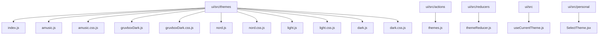
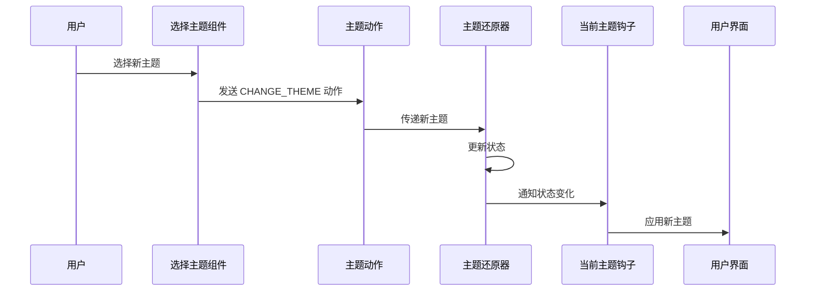
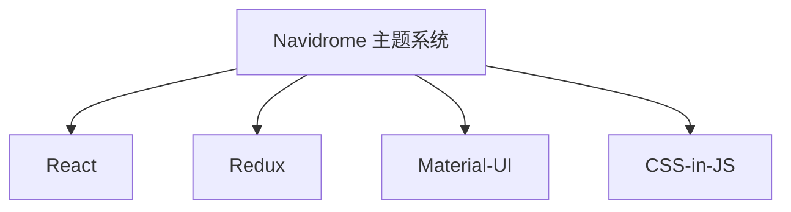

# 主题系统

<cite>
**本文档中引用的文件**  
- [themes.js](file://ui/src/actions/themes.js)
- [themeReducer.js](file://ui/src/reducers/themeReducer.js)
- [useCurrentTheme.js](file://ui/src/themes/useCurrentTheme.js)
- [SelectTheme.jsx](file://ui/src/personal/SelectTheme.jsx)
- [config.js](file://ui/src/config.js)
- [consts.js](file://ui/src/consts.js)
- [index.js](file://ui/src/themes/index.js)
- [dark.js](file://ui/src/themes/dark.js)
- [light.js](file://ui/src/themes/light.js)
- [nord.js](file://ui/src/themes/nord.js)
- [gruvboxDark.js](file://ui/src/themes/gruvboxDark.js)
- [amusic.js](file://ui/src/themes/amusic.js)
- [dark.css.js](file://ui/src/themes/dark.css.js)
- [light.css.js](file://ui/src/themes/light.css.js)
- [nord.css.js](file://ui/src/themes/nord.css.js)
- [gruvboxDark.css.js](file://ui/src/themes/gruvboxDark.css.js)
- [useChangeThemeColor.jsx](file://ui/src/useChangeThemeColor.jsx)
</cite>

## 目录
1. [简介](#简介)
2. [项目结构](#项目结构)
3. [核心组件](#核心组件)
4. [架构概述](#架构概述)
5. [详细组件分析](#详细组件分析)
6. [依赖分析](#依赖分析)
7. [性能考虑](#性能考虑)
8. [故障排除指南](#故障排除指南)
9. [结论](#结论)

## 简介
Navidrome 是一个开源的音乐服务器和流媒体解决方案，支持基于 CSS-in-JS 的主题系统。该主题系统允许用户通过预设主题（如 amusic、nord、gruvbox 等）自定义界面外观，并支持动态切换主题。本文档详细解释了 Navidrome 主题系统的实现机制，包括主题变量的定义、继承和覆盖方法，动态主题切换的用户界面和状态管理，以及自定义主题开发指南。

## 项目结构
Navidrome 的主题系统主要位于 `ui/src/themes` 目录下，包含多个主题文件和相关的配置文件。每个主题文件定义了特定的样式和颜色方案，并通过 CSS-in-JS 技术应用于用户界面。



**图示来源**
- [index.js](file://ui/src/themes/index.js)
- [amusic.js](file://ui/src/themes/amusic.js)
- [gruvboxDark.js](file://ui/src/themes/gruvboxDark.js)
- [nord.js](file://ui/src/themes/nord.js)
- [light.js](file://ui/src/themes/light.js)
- [dark.js](file://ui/src/themes/dark.js)
- [themes.js](file://ui/src/actions/themes.js)
- [themeReducer.js](file://ui/src/reducers/themeReducer.js)
- [useCurrentTheme.js](file://ui/src/themes/useCurrentTheme.js)
- [SelectTheme.jsx](file://ui/src/personal/SelectTheme.jsx)

## 核心组件
Navidrome 的主题系统由以下几个核心组件构成：
- **主题文件**：定义了特定主题的颜色、字体和其他样式属性。
- **主题索引文件**：汇总所有可用的主题，供应用程序引用。
- **主题动作**：定义了改变主题的动作类型。
- **主题还原器**：处理主题状态的变化。
- **当前主题钩子**：获取当前应用的主题。
- **选择主题组件**：提供用户界面以选择和切换主题。

**本节来源**
- [themes.js](file://ui/src/actions/themes.js)
- [themeReducer.js](file://ui/src/reducers/themeReducer.js)
- [useCurrentTheme.js](file://ui/src/themes/useCurrentTheme.js)
- [SelectTheme.jsx](file://ui/src/personal/SelectTheme.jsx)
- [index.js](file://ui/src/themes/index.js)

## 架构概述
Navidrome 的主题系统采用 Redux 状态管理模式来管理主题状态。用户通过选择主题组件触发改变主题的动作，该动作被主题还原器捕获并更新应用的状态。当前主题钩子从 Redux 存储中读取当前主题，并将其应用于用户界面。



**图示来源**
- [themes.js](file://ui/src/actions/themes.js)
- [themeReducer.js](file://ui/src/reducers/themeReducer.js)
- [useCurrentTheme.js](file://ui/src/themes/useCurrentTheme.js)
- [SelectTheme.jsx](file://ui/src/personal/SelectTheme.jsx)

## 详细组件分析
### 主题文件分析
每个主题文件（如 `amusic.js`、`nord.js` 等）定义了一个主题对象，包含 `themeName`、`palette`、`overrides` 和 `player` 属性。`palette` 定义了主题的基本颜色，`overrides` 允许覆盖 Material-UI 组件的默认样式，`player` 包含播放器的特定样式。

#### 主题文件示例
```javascript
export default {
  themeName: 'Amusic',
  palette: {
    primary: {
      main: '#ff5722',
    },
    secondary: {
      main: '#cddc39',
    },
    type: 'dark',
  },
  overrides: {
    MuiButton: {
      root: {
        borderRadius: 8,
      },
    },
  },
  player: {
    theme: 'dark',
    stylesheet: require('./amusic.css.js'),
  },
};
```

**本节来源**
- [amusic.js](file://ui/src/themes/amusic.js)
- [nord.js](file://ui/src/themes/nord.js)
- [gruvboxDark.js](file://ui/src/themes/gruvboxDark.js)
- [light.js](file://ui/src/themes/light.js)
- [dark.js](file://ui/src/themes/dark.js)

### 主题索引文件分析
`index.js` 文件汇总了所有可用的主题，并导出一个包含所有主题的对象。这使得应用程序可以轻松地引用和使用这些主题。

#### 主题索引文件示例
```javascript
import LightTheme from './light';
import DarkTheme from './dark';
import AmusicTheme from './amusic';
import NordTheme from './nord';
import GruvboxDarkTheme from './gruvboxDark';

export default {
  LightTheme,
  DarkTheme,
  AmusicTheme,
  NordTheme,
  GruvboxDarkTheme,
};
```

**本节来源**
- [index.js](file://ui/src/themes/index.js)

### 主题动作和还原器分析
`themes.js` 文件定义了 `CHANGE_THEME` 动作类型和 `changeTheme` 动作创建函数。`themeReducer.js` 文件中的 `themeReducer` 函数处理 `CHANGE_THEME` 动作，更新应用的状态。

#### 主题动作示例
```javascript
export const CHANGE_THEME = 'CHANGE_THEME';

export const changeTheme = (theme) => ({
  type: CHANGE_THEME,
  payload: theme,
});
```

#### 主题还原器示例
```javascript
import { CHANGE_THEME } from '../actions';
import config from '../config';
import themes from '../themes';

const defaultTheme = () => {
  return (
    Object.keys(themes).find(
      (t) => themes[t].themeName === config.defaultTheme,
    ) || 'DarkTheme'
  );
};

export const themeReducer = (
  previousState = defaultTheme(),
  { type, payload },
) => {
  if (type === CHANGE_THEME) {
    return payload;
  }
  return previousState;
};
```

**本节来源**
- [themes.js](file://ui/src/actions/themes.js)
- [themeReducer.js](file://ui/src/reducers/themeReducer.js)

### 当前主题钩子分析
`useCurrentTheme.js` 文件中的 `useCurrentTheme` 钩子从 Redux 存储中读取当前主题，并将其应用于用户界面。它还处理媒体查询，以支持自动主题切换。

#### 当前主题钩子示例
```javascript
import { useSelector } from 'react-redux';
import useMediaQuery from '@material-ui/core/useMediaQuery';
import themes from './index';
import { AUTO_THEME_ID } from '../consts';
import config from '../config';
import { useEffect } from 'react';

const useCurrentTheme = () => {
  const prefersLightMode = useMediaQuery('(prefers-color-scheme: light)');
  const theme = useSelector((state) => {
    if (state.theme === AUTO_THEME_ID) {
      return prefersLightMode ? themes.LightTheme : themes.DarkTheme;
    }
    const themeName =
      Object.keys(themes).find((t) => t === state.theme) ||
      Object.keys(themes).find(
        (t) => themes[t].themeName === config.defaultTheme,
      ) ||
      'DarkTheme';
    return themes[themeName];
  });

  useEffect(() => {
    const styles = document.getElementsByTagName('style');
    let style;
    for (let i = 0; i < styles.length; i++) {
      if (styles[i].id === 'nd-player-style-override') {
        style = styles[i];
      }
    }
    if (theme.player.stylesheet) {
      if (style === undefined) {
        style = document.createElement('style');
        style.id = 'nd-player-style-override';
        style.innerHTML = theme.player.stylesheet;
        document.head.appendChild(style);
      } else {
        style.innerHTML = theme.player.stylesheet;
      }
    } else {
      if (style !== undefined) {
        document.head.removeChild(style);
      }
    }

    const isDark = theme.palette?.type === 'dark';
    const bgColor =
      theme.palette?.background?.default || (isDark ? '#303030' : '#fafafa');
    document.body.style.backgroundColor = bgColor;
  }, [theme]);

  return theme;
};

export default useCurrentTheme;
```

**本节来源**
- [useCurrentTheme.js](file://ui/src/themes/useCurrentTheme.js)

### 选择主题组件分析
`SelectTheme.jsx` 文件中的 `SelectTheme` 组件提供了一个下拉菜单，允许用户选择和切换主题。它使用 `useDispatch` 和 `useSelector` 钩子与 Redux 存储交互。

#### 选择主题组件示例
```javascript
import { SelectInput, useTranslate } from 'react-admin';
import { useDispatch, useSelector } from 'react-redux';
import { AUTO_THEME_ID } from '../consts';
import themes from '../themes';
import { HelpMsg } from './HelpMsg';
import { docsUrl, openInNewTab } from '../utils';
import { changeTheme } from '../actions';

const helpKey = '_help';

export const SelectTheme = (props) => {
  const translate = useTranslate();
  const dispatch = useDispatch();
  const currentTheme = useSelector((state) => state.theme);
  const themeChoices = [
    {
      id: AUTO_THEME_ID,
      name: 'Auto',
    },
  ];
  themeChoices.push(
    ...Object.keys(themes).map((key) => {
      return { id: key, name: themes[key].themeName };
    }),
  );
  themeChoices.push({
    id: helpKey,
    name: <HelpMsg caption={'Create your own'} />,
  });
  return (
    <SelectInput
      {...props}
      source="theme"
      label={translate('menu.personal.options.theme')}
      defaultValue={currentTheme}
      translateChoice={false}
      choices={themeChoices}
      onChange={(event) => {
        if (event.target.value === helpKey) {
          openInNewTab(docsUrl('/docs/developers/creating-themes/'));
          return;
        }
        dispatch(changeTheme(event.target.value));
      }}
    />
  );
};
```

**本节来源**
- [SelectTheme.jsx](file://ui/src/personal/SelectTheme.jsx)

## 依赖分析
Navidrome 的主题系统依赖于以下几个关键库和技术：
- **React**：用于构建用户界面。
- **Redux**：用于管理应用状态。
- **Material-UI**：提供 UI 组件和样式。
- **CSS-in-JS**：允许在 JavaScript 中编写 CSS 样式。



**图示来源**
- [package.json](file://ui/package.json)

## 性能考虑
为了确保主题系统的高性能，建议采取以下措施：
- **最小化 CSS-in-JS 代码**：避免不必要的样式重写。
- **优化主题文件**：只包含必要的样式和颜色定义。
- **使用生产模式**：在生产环境中启用压缩和优化。

## 故障排除指南
### 常见问题
- **主题未正确应用**：检查 Redux 存储中的主题状态是否正确更新。
- **样式冲突**：确保没有其他 CSS 文件覆盖主题样式。
- **性能问题**：检查是否有过多的样式重写或复杂的 CSS 规则。

### 调试技巧
- **使用浏览器开发者工具**：检查元素的计算样式。
- **查看 Redux DevTools**：监控主题状态的变化。
- **审查网络请求**：确保所有资源文件正确加载。

**本节来源**
- [useCurrentTheme.js](file://ui/src/themes/useCurrentTheme.js)
- [themeReducer.js](file://ui/src/reducers/themeReducer.js)
- [SelectTheme.jsx](file://ui/src/personal/SelectTheme.jsx)

## 结论
Navidrome 的主题系统通过 CSS-in-JS 技术实现了灵活且可扩展的界面定制功能。通过理解其架构和组件，开发者可以轻松创建和维护自定义主题，提升用户体验。本文档提供了详细的实现细节和开发指南，帮助开发者更好地利用这一功能。