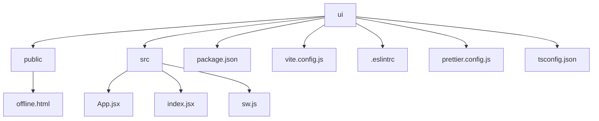
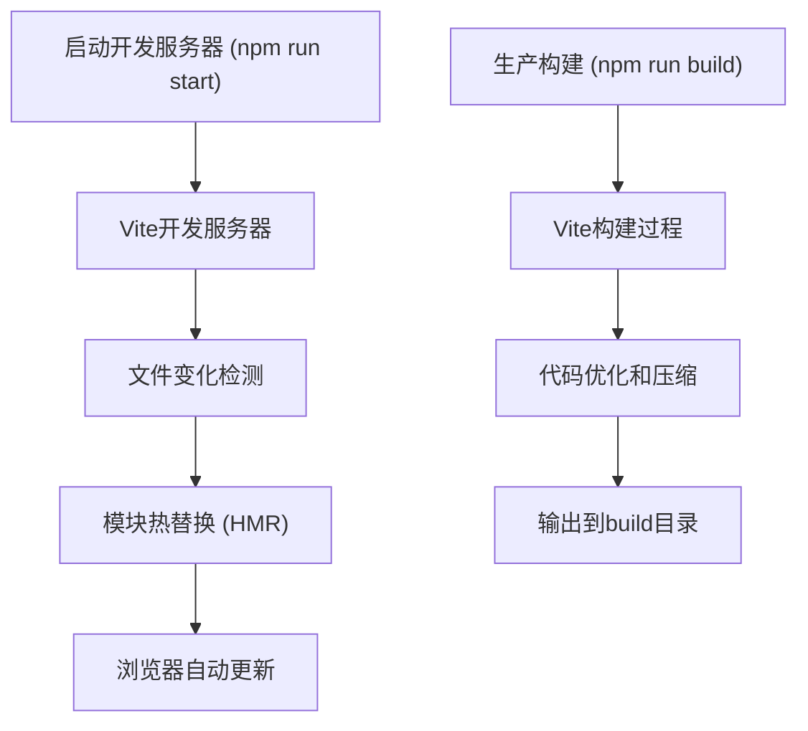
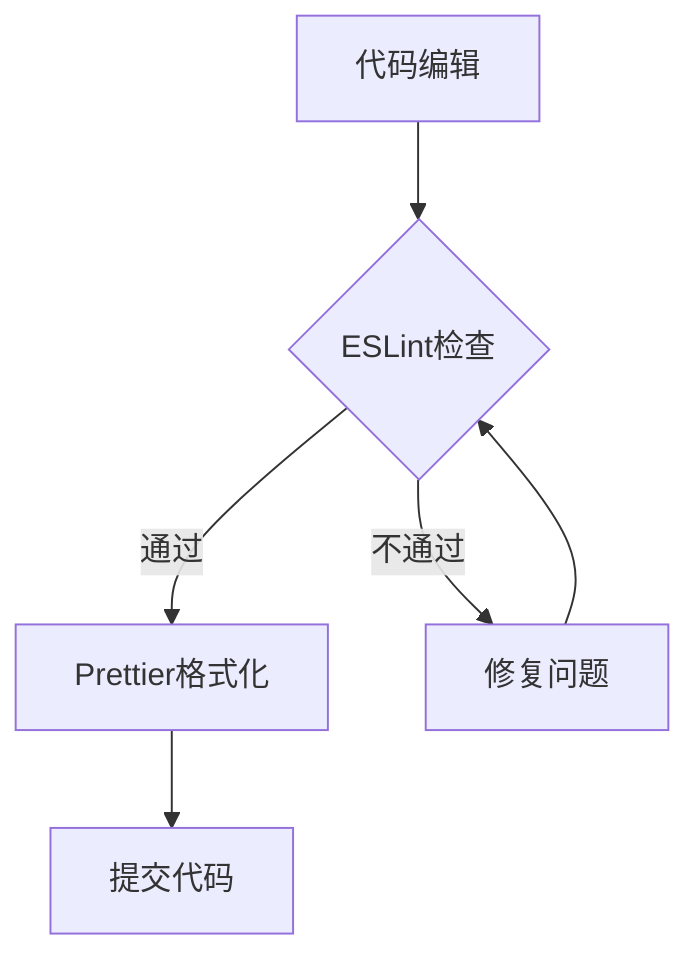
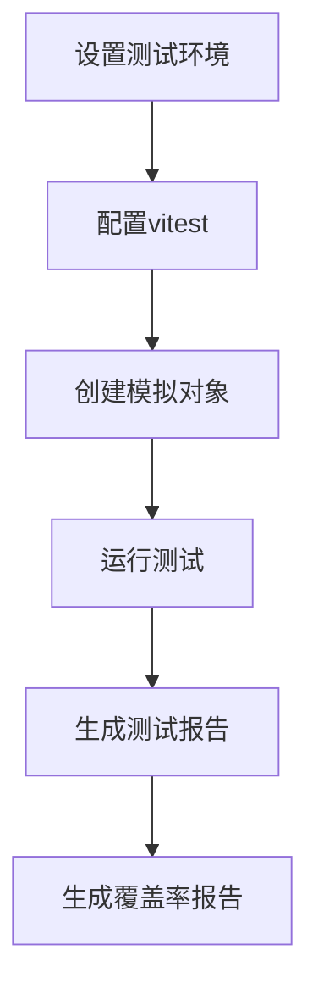
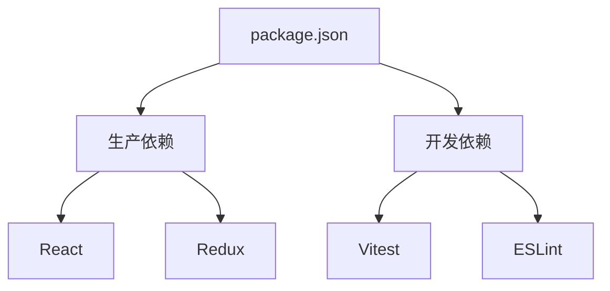
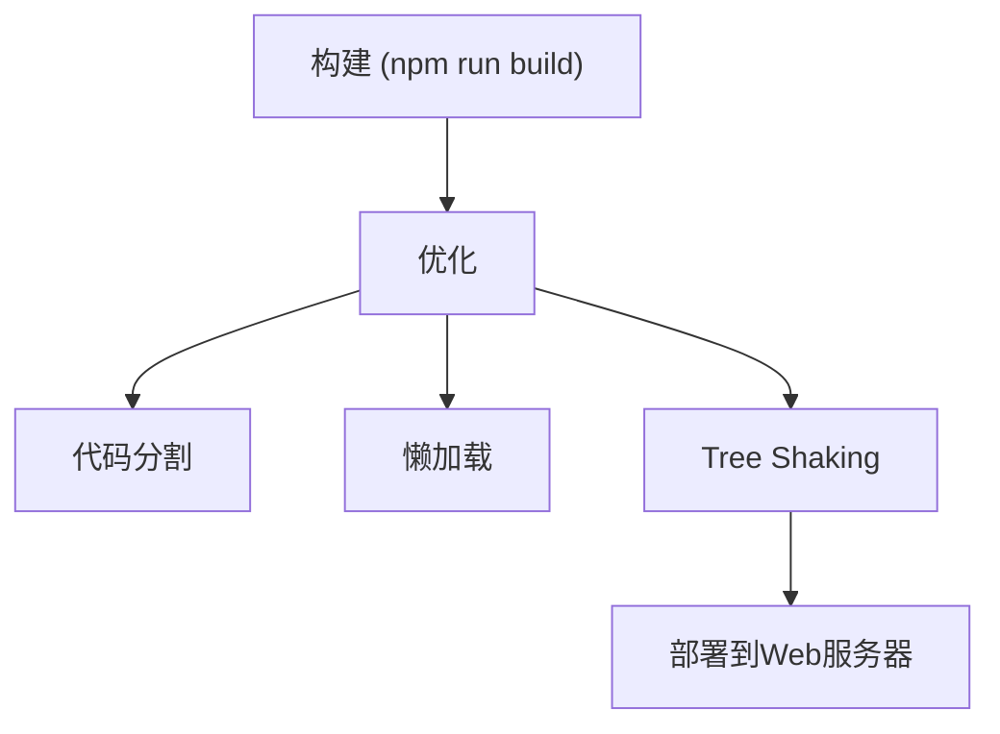
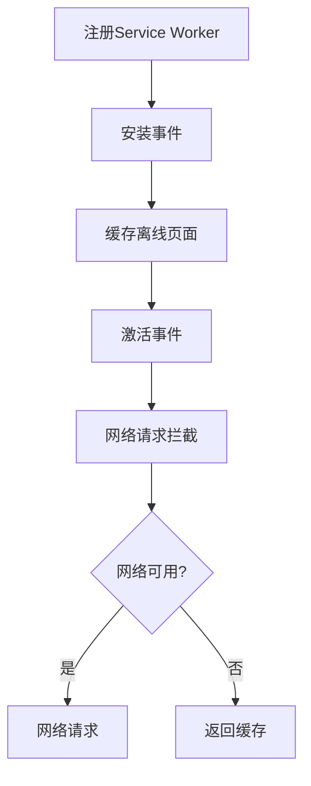

# 前端开发指南

<cite>
**本文档中引用的文件**  
- [package.json](file://ui/package.json)
- [vite.config.js](file://ui/vite.config.js)
- [.eslintrc](file://ui/.eslintrc)
- [prettier.config.js](file://ui/prettier.config.js)
- [tsconfig.json](file://ui/tsconfig.json)
- [tsconfig.app.json](file://ui/tsconfig.app.json)
- [tsconfig.node.json](file://ui/tsconfig.node.json)
- [sw.js](file://ui/src/sw.js)
- [update-workbox.sh](file://ui/bin/update-workbox.sh)
- [setupTests.js](file://ui/src/setupTests.js)
- [index.jsx](file://ui/src/index.jsx)
- [App.jsx](file://ui/src/App.jsx)
- [eventStream.test.js](file://ui/src/eventStream.test.js)
- [useRefreshOnEvents.test.js](file://ui/src/common/useRefreshOnEvents.test.js)
- [offline.html](file://ui/public/offline.html)
</cite>

## 目录
1. [简介](#简介)
2. [项目结构](#项目结构)
3. [Vite构建工具配置与使用](#vite构建工具配置与使用)
4. [代码质量工具配置](#代码质量工具配置)
5. [测试环境设置与单元测试](#测试环境设置与单元测试)
6. [依赖管理与版本更新](#依赖管理与版本更新)
7. [构建优化与部署流程](#构建优化与部署流程)
8. [缓存策略与Workbox配置](#缓存策略与workbox配置)
9. [结论](#结论)

## 简介
Navidrome是一个开源的基于Web的音乐收藏服务器和流媒体服务。本指南详细说明了Navidrome前端开发环境的搭建和开发流程，涵盖Vite构建工具、代码质量工具、测试环境、依赖管理、构建优化和部署流程等方面。

## 项目结构
Navidrome的前端代码位于`ui`目录下，采用现代JavaScript技术栈，包括React、TypeScript、Vite、ESLint、Prettier和Vitest等工具。

**Diagram sources**
- [ui](file://ui)
- [ui/public](file://ui/public)
- [ui/src](file://ui/src)

**Section sources**
- [ui](file://ui)
- [ui/package.json](file://ui/package.json)

## Vite构建工具配置与使用
Vite是Navidrome前端项目的主要构建工具，提供了快速的开发服务器启动、热重载和高效的生产构建功能。

### 开发服务器启动
通过`npm run start`或`yarn start`命令启动开发服务器，Vite会自动打开浏览器并监听文件变化。

### 热重载
Vite支持模块热替换（HMR），在开发过程中修改代码后，浏览器会自动更新，无需手动刷新页面。

### 生产构建
使用`npm run build`或`yarn build`命令进行生产构建，生成的文件位于`build`目录下。

**Diagram sources**
- [vite.config.js](file://ui/vite.config.js)
- [package.json](file://ui/package.json)

**Section sources**
- [vite.config.js](file://ui/vite.config.js)
- [package.json](file://ui/package.json)

## 代码质量工具配置
Navidrome使用ESLint和Prettier来保证代码质量和一致性。

### ESLint配置
ESLint配置文件`.eslintrc`定义了代码检查规则，包括推荐规则、React规则、React Hooks规则和TypeScript规则。

### Prettier配置
Prettier配置文件`prettier.config.js`定义了代码格式化规则，包括单引号、无分号和始终使用箭头函数括号。

**Diagram sources**
- [.eslintrc](file://ui/.eslintrc)
- [prettier.config.js](file://ui/prettier.config.js)

**Section sources**
- [.eslintrc](file://ui/.eslintrc)
- [prettier.config.js](file://ui/prettier.config.js)

## 测试环境设置与单元测试
Navidrome使用Vitest进行单元测试，提供了完整的测试环境和工具。

### 测试环境设置
测试环境通过`vitest`命令启动，支持Jest兼容模式和覆盖率报告。

### 单元测试执行
使用`npm run test`或`yarn test`命令执行单元测试，`npm run test:coverage`生成覆盖率报告。

**Diagram sources**
- [setupTests.js](file://ui/src/setupTests.js)
- [eventStream.test.js](file://ui/src/eventStream.test.js)
- [useRefreshOnEvents.test.js](file://ui/src/common/useRefreshOnEvents.test.js)

**Section sources**
- [setupTests.js](file://ui/src/setupTests.js)
- [eventStream.test.js](file://ui/src/eventStream.test.js)
- [useRefreshOnEvents.test.js](file://ui/src/common/useRefreshOnEvents.test.js)

## 依赖管理与版本更新
Navidrome使用npm进行依赖管理，通过`package.json`文件定义项目依赖。

### 依赖管理
所有依赖项在`package.json`文件中定义，包括生产依赖和开发依赖。

### 版本更新
定期更新依赖版本以获取最新功能和安全修复，使用`npm outdated`检查过时的包。

**Diagram sources**
- [package.json](file://ui/package.json)

**Section sources**
- [package.json](file://ui/package.json)

## 构建优化与部署流程
Navidrome的构建过程经过优化，确保生产环境的性能和效率。

### 构建优化
使用Vite的构建优化功能，包括代码分割、懒加载和Tree Shaking。

### 部署流程
构建完成后，将`build`目录中的文件部署到Web服务器。

**Diagram sources**
- [vite.config.js](file://ui/vite.config.js)
- [package.json](file://ui/package.json)

**Section sources**
- [vite.config.js](file://ui/vite.config.js)
- [package.json](file://ui/package.json)

## 缓存策略与Workbox配置
Navidrome使用Workbox实现PWA功能和离线缓存策略。

### Workbox配置
通过`vite-plugin-pwa`插件配置Workbox，在`vite.config.js`中定义PWA清单和策略。

### 离线缓存
使用Service Worker缓存关键资源，确保在网络不稳定时仍能访问应用。

**Diagram sources**
- [sw.js](file://ui/src/sw.js)
- [vite.config.js](file://ui/vite.config.js)
- [update-workbox.sh](file://ui/bin/update-workbox.sh)
- [offline.html](file://ui/public/offline.html)

**Section sources**
- [sw.js](file://ui/src/sw.js)
- [vite.config.js](file://ui/vite.config.js)
- [update-workbox.sh](file://ui/bin/update-workbox.sh)
- [offline.html](file://ui/public/offline.html)

## 结论
本指南详细介绍了Navidrome前端开发环境的各个方面，包括Vite构建工具、代码质量工具、测试环境、依赖管理、构建优化和部署流程。通过遵循这些最佳实践，开发者可以高效地进行Navidrome前端开发和维护。