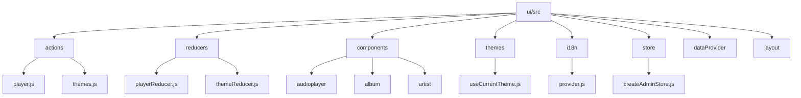
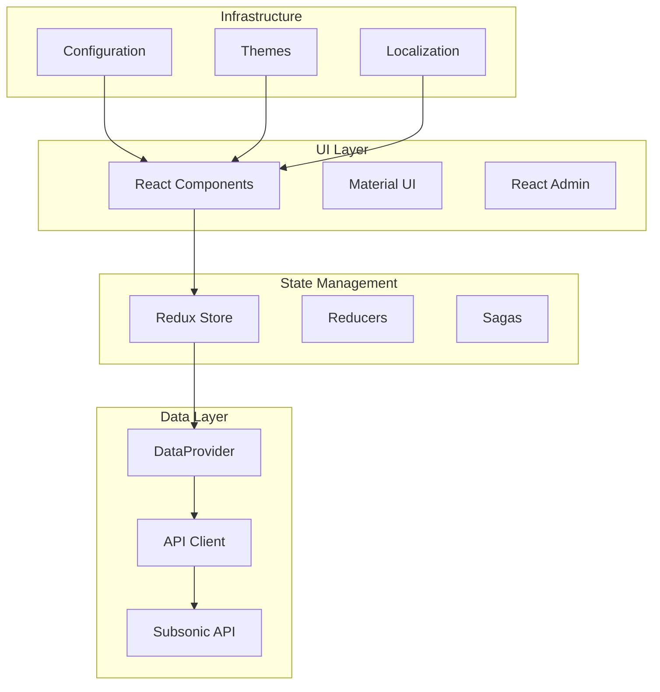
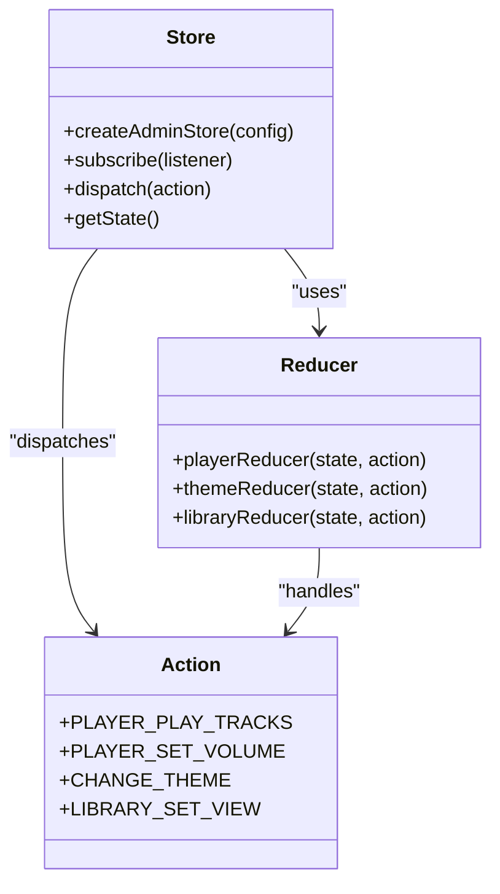
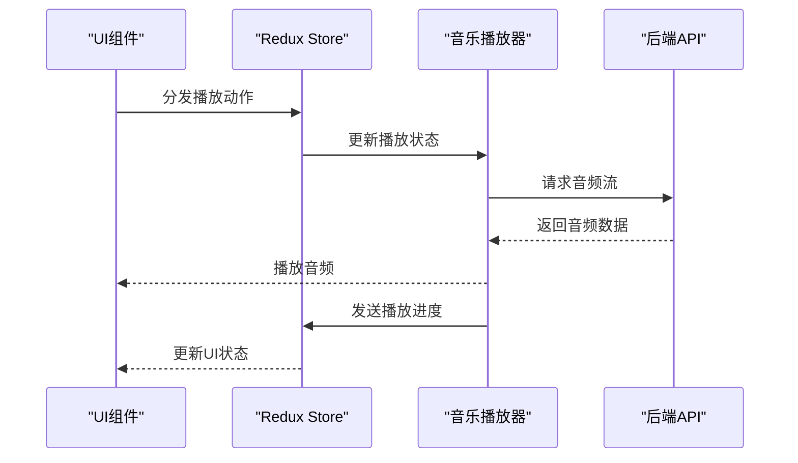
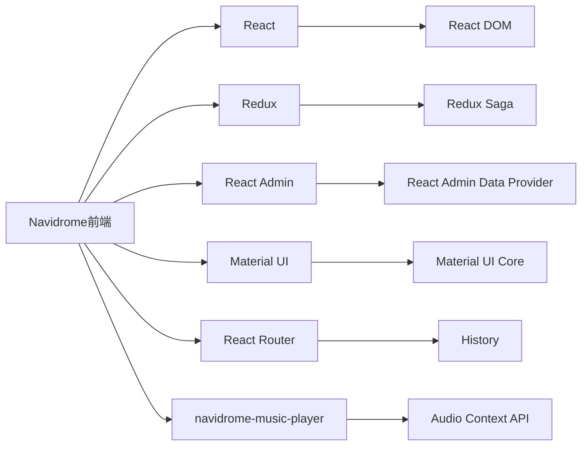

# 前端架构

<cite>
**本文档中引用的文件**  
- [index.jsx](file://ui/src/index.jsx)
- [App.jsx](file://ui/src/App.jsx)
- [config.js](file://ui/src/config.js)
- [createAdminStore.js](file://ui/src/store/createAdminStore.js)
- [playerReducer.js](file://ui/src/reducers/playerReducer.js)
- [themeReducer.js](file://ui/src/reducers/themeReducer.js)
- [useCurrentTheme.js](file://ui/src/themes/useCurrentTheme.js)
- [i18n/index.js](file://ui/src/i18n/index.js)
- [Player.jsx](file://ui/src/audioplayer/Player.jsx)
- [routes.jsx](file://ui/src/routes.jsx)
</cite>

## 目录
1. [项目结构](#项目结构)
2. [核心组件](#核心组件)
3. [架构概述](#架构概述)
4. [详细组件分析](#详细组件分析)
5. [依赖分析](#依赖分析)
6. [性能考虑](#性能考虑)
7. [故障排除指南](#故障排除指南)
8. [结论](#结论)

## 项目结构

Navidrome前端应用位于`ui/src`目录下，采用基于React的现代前端架构。项目使用Vite作为构建工具，React Admin作为管理界面框架，并集成Redux进行状态管理。主要目录包括actions（动作定义）、reducers（状态还原器）、components（UI组件）、themes（主题系统）和i18n（国际化支持）。

**Diagram sources**
- [App.jsx](file://ui/src/App.jsx)
- [config.js](file://ui/src/config.js)

**Section sources**
- [App.jsx](file://ui/src/App.jsx#L1-L173)
- [package.json](file://ui/package.json#L1-L86)

## 核心组件

前端应用的核心组件包括基于React Admin的管理界面、Redux状态管理系统、音频播放器组件、主题系统和国际化支持。应用通过dataProvider与后端API通信，使用React Redux进行全局状态管理，并通过自定义reducers处理特定功能的状态变化。

**Section sources**
- [App.jsx](file://ui/src/App.jsx#L1-L173)
- [createAdminStore.js](file://ui/src/store/createAdminStore.js#L1-L78)

## 架构概述

Navidrome前端采用分层架构，以React为基础，结合React Admin框架构建管理界面。状态管理使用Redux，通过createAdminStore创建全局store，并集成react-saga处理副作用。应用支持PWA特性，使用Hash路由，并通过环境配置实现功能开关。

**Diagram sources**
- [App.jsx](file://ui/src/App.jsx#L1-L173)
- [createAdminStore.js](file://ui/src/store/createAdminStore.js#L1-L78)

## 详细组件分析

### 状态管理机制

#### Redux-like状态存储实现
Navidrome前端使用Redux作为状态管理解决方案，通过createAdminStore函数创建全局store。store整合了React Admin的adminReducer和自定义reducers，包括playerReducer、themeReducer等。状态持久化通过localStorage实现，关键状态如播放队列、音量设置等在页面刷新后得以保留。

**Diagram sources**
- [createAdminStore.js](file://ui/src/store/createAdminStore.js#L1-L78)
- [playerReducer.js](file://ui/src/reducers/playerReducer.js#L1-L214)
- [themeReducer.js](file://ui/src/reducers/themeReducer.js#L1-L22)

### 主要UI组件分析

#### 播放器组件设计
播放器组件是Navidrome的核心功能之一，基于navidrome-music-player库构建，集成在React应用中。组件通过Redux连接全局状态，监听播放队列变化，并提供丰富的播放控制功能。

**Diagram sources**
- [Player.jsx](file://ui/src/audioplayer/Player.jsx#L1-L319)
- [playerReducer.js](file://ui/src/reducers/playerReducer.js#L1-L214)

#### 专辑视图组件
专辑视图组件提供专辑的网格和列表两种显示模式，通过albumViewReducer管理视图状态。组件支持专辑信息展示、歌曲列表、外部链接等功能，通过React Admin的Resource机制集成到主应用中。

**Section sources**
- [album/](file://ui/src/album/)
- [reducers/albumView.js](file://ui/src/reducers/albumView.js)

#### 艺术家列表组件
艺术家列表组件展示所有艺术家，支持分页和搜索。组件通过artist资源与后端通信，使用Material UI的列表组件进行渲染，并集成到React Admin的菜单系统中。

**Section sources**
- [artist/](file://ui/src/artist/)
- [App.jsx](file://ui/src/App.jsx#L14-L15)

## 依赖分析

前端应用依赖多个关键库和框架，形成完整的依赖关系网络。核心依赖包括React生态系统、Redux状态管理、Material UI组件库和React Admin框架。

**Diagram sources**
- [package.json](file://ui/package.json#L1-L86)
- [App.jsx](file://ui/src/App.jsx#L1-L173)

## 性能考虑

前端应用在性能方面进行了多项优化，包括状态更新的节流处理、音频预加载、主题样式动态注入等。store的持久化使用throttle函数限制保存频率，避免频繁的localStorage写入操作。

**Section sources**
- [createAdminStore.js](file://ui/src/store/createAdminStore.js#L55-L70)
- [Player.jsx](file://ui/src/audioplayer/Player.jsx#L178-L185)

## 故障排除指南

常见问题包括播放器不显示、主题切换失效、国际化语言不正确等。调试时应检查Redux DevTools中的状态变化，验证配置加载是否正确，并确认API端点可达性。

**Section sources**
- [config.js](file://ui/src/config.js#L1-L64)
- [App.jsx](file://ui/src/App.jsx#L48-L54)
- [useCurrentTheme.js](file://ui/src/themes/useCurrentTheme.js#L1-L57)

## 结论

Navidrome前端架构采用现代化的React技术栈，结合Redux进行状态管理，React Admin构建管理界面。架构设计合理，组件职责清晰，支持主题定制和多语言，为用户提供良好的音乐管理体验。