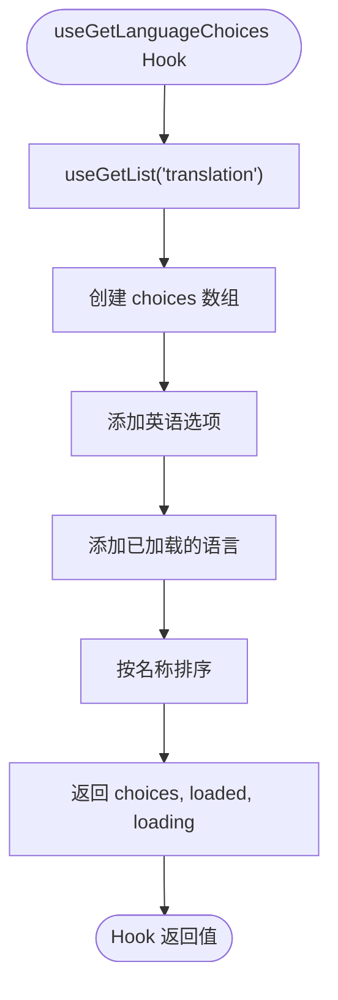

# 多语言支持

<cite>
**本文档中引用的文件**
- [provider.js](file://ui/src/i18n/provider.js)
- [index.js](file://ui/src/i18n/index.js)
- [useGetLanguageChoices.jsx](file://ui/src/i18n/useGetLanguageChoices.jsx)
- [App.jsx](file://ui/src/App.jsx)
- [translations.go](file://server/nativeapi/translations.go)
- [zh-Hans.json](file://resources/i18n/zh-Hans.json)
- [de.json](file://resources/i18n/de.json)
</cite>

## 目录
1. [简介](#简介)
2. [语言包结构与翻译键组织](#语言包结构与翻译键组织)
3. [国际化实现机制](#国际化实现机制)
4. [语言切换流程与用户偏好存储](#语言切换流程与用户偏好存储)
5. [前端i18n上下文提供者与相关hooks](#前端i18n上下文提供者与相关hooks)
6. [新语言添加指南](#新语言添加指南)
7. [翻译文件维护最佳实践](#翻译文件维护最佳实践)
8. [实际示例](#实际示例)

## 简介
Navidrome 是一个现代化的音乐服务器和流媒体解决方案，支持多语言界面。本文档详细说明其基于JSON文件的国际化（i18n）实现机制，包括语言包结构、翻译键的组织方式、动态加载机制、语言切换流程以及前端i18n上下文提供者和相关hooks的实现。同时提供新语言添加指南和翻译文件维护的最佳实践。

**Section sources**
- [zh-Hans.json](file://resources/i18n/zh-Hans.json)
- [de.json](file://resources/i18n/de.json)

## 语言包结构与翻译键组织
Navidrome的多语言支持通过JSON文件实现，这些文件位于`resources/i18n`目录下，每个语言对应一个JSON文件，文件名采用标准的语言代码命名（如`zh-Hans.json`表示简体中文，`de.json`表示德语）。

语言包的结构遵循分层组织原则，主要包含以下几个顶级键：

- `languageName`: 当前语言的名称（以该语言自身表示）
- `resources`: 包含所有UI资源的翻译，按功能模块组织
- `ra`: React Admin框架的翻译键
- `message`: 全局消息和通知的翻译
- `menu`: 菜单项的翻译
- `player`: 播放器相关文本的翻译
- `about`: 关于页面的翻译
- `activity`: 活动日志的翻译
- `help`: 帮助和快捷键的翻译
- `nowPlaying`: 正在播放信息的翻译

在`resources`对象中，翻译键按资源类型组织，如`song`、`album`、`artist`、`user`等，每个资源类型下又分为：
- `name`: 资源的单数和复数名称
- `fields`: 资源字段的标签
- `actions`: 资源相关的操作按钮文本
- `lists`: 列表视图的分类名称

这种分层结构使得翻译键的组织清晰有序，便于维护和扩展。

**Section sources**
- [zh-Hans.json](file://resources/i18n/zh-Hans.json)
- [de.json](file://resources/i18n/de.json)

## 国际化实现机制
Navidrome的国际化实现基于React Admin框架的i18n系统，使用`ra-i18n-polyglot`作为多语言提供者。系统通过以下机制实现翻译的动态加载和管理：

1. **服务端翻译资源管理**：在`server/nativeapi/translations.go`中，`translationRepository`实现了对翻译文件的读取和管理。系统启动时会扫描`resources/i18n`目录下的所有JSON文件，将它们加载到内存中。

2. **翻译文件加载**：`loadTranslations`函数使用`sync.OnceValues`确保翻译文件只被加载一次。对于每个语言文件，系统会：
   - 读取JSON文件内容
   - 解析出`languageName`作为语言显示名称
   - 将翻译内容压缩存储
   - 构建包含`id`、`name`和`data`的`translation`对象

3. **API接口**：翻译资源通过REST API暴露，客户端可以通过`/api/translation`端点获取特定语言的翻译数据。

4. **客户端动态加载**：前端通过`dataProvider.getOne('translation', { id: locale })`从服务器获取翻译数据，并缓存到`localStorage`中，避免重复请求。

5. **翻译合并**：系统使用`deepmerge`库将加载的语言包与默认的英语翻译合并，确保即使某些翻译键缺失，也能回退到英语显示。

6. **空值清理**：`removeEmpty`函数会清理翻译对象中的空值，避免不必要的内存占用。

**Section sources**
- [translations.go](file://server/nativeapi/translations.go)
- [provider.js](file://ui/src/i18n/provider.js)

## 语言切换流程与用户偏好存储
Navidrome的语言切换流程设计为用户友好且高效，具体流程如下：

1. **初始语言检测**：系统首先检查`localStorage`中的`locale`项，如果存在且对应的翻译数据也存在于`localStorage`中，则使用该语言作为默认语言。

2. **用户偏好存储**：用户选择的语言偏好通过`localStorage.setItem('locale', locale)`存储在浏览器的本地存储中，确保用户下次访问时能保持相同的语言设置。

3. **异步翻译加载**：当检测到用户选择的语言时，系统会异步从服务器获取该语言的翻译数据，并在加载完成后通过`i18nProvider.changeLocale(locale)`切换到新语言。

4. **HTML语言属性更新**：在`App.jsx`中，系统会根据当前语言设置`document.documentElement.lang`属性，符合Web可访问性标准。

5. **回退机制**：如果请求的语言翻译无法加载，系统会自动回退到英语（`en`）作为默认语言。

6. **实时切换**：语言切换是实时的，一旦新语言的翻译数据加载完成，整个UI界面会立即更新为新语言，无需刷新页面。

这种设计确保了语言切换的流畅性和用户体验的一致性，同时通过本地存储实现了用户偏好的持久化。

**Section sources**
- [provider.js](file://ui/src/i18n/provider.js)
- [App.jsx](file://ui/src/App.jsx)

## 前端i18n上下文提供者与相关hooks
Navidrome的前端i18n系统通过React的上下文（Context）机制实现，主要组件包括：

### i18n上下文提供者
在`ui/src/i18n/provider.js`中，系统创建了一个基于`polyglotI18nProvider`的i18n提供者。该提供者：
- 接收语言代码作为参数
- 管理翻译数据的加载和缓存
- 提供`changeLocale`方法用于切换语言
- 处理翻译数据的预处理（如空值清理和资源映射）

在`App.jsx`中，i18n提供者通过`<RAAdmin i18nProvider={i18nProvider}>`注入到React Admin应用中，使整个应用都能访问翻译服务。

### 核心hooks
系统提供了几个关键的React hooks来简化多语言功能的使用：

#### useGetLanguageChoices
位于`ui/src/i18n/useGetLanguageChoices.jsx`的`useGetLanguageChoices` hook用于获取所有可用语言的列表。该hook：
- 使用`useGetList`从`translation`资源获取所有语言
- 包含硬编码的英语选项
- 对语言列表按名称进行排序
- 返回包含`choices`、`loaded`和`loading`状态的对象



**Diagram sources**
- [useGetLanguageChoices.jsx](file://ui/src/i18n/useGetLanguageChoices.jsx)

#### retrieveTranslation
`retrieveTranslation`函数负责从服务器获取特定语言的翻译数据。它：
- 调用`dataProvider.getOne`获取翻译资源
- 将翻译数据存储到`localStorage`
- 返回预处理后的语言对象

### 系统集成
在`App.jsx`中，i18n系统与其他功能集成：
- 通过`i18nProvider`注入到React Admin
- 在应用启动时设置HTML的`lang`属性
- 与分享功能兼容，确保分享页面的语言一致性

**Section sources**
- [provider.js](file://ui/src/i18n/provider.js)
- [useGetLanguageChoices.jsx](file://ui/src/i18n/useGetLanguageChoices.jsx)
- [App.jsx](file://ui/src/App.jsx)

## 新语言添加指南
要为Navidrome添加新语言支持，请遵循以下步骤：

1. **创建语言文件**：在`resources/i18n`目录下创建新的JSON文件，文件名应使用标准的语言代码（如`fr.json`表示法语，`es.json`表示西班牙语）。

2. **复制模板**：可以以现有的语言文件（如`en.json`或`zh-Hans.json`）为模板，复制其结构。

3. **翻译内容**：将所有键值对翻译为目标语言，特别注意：
   - `languageName`应使用目标语言表示该语言的名称
   - 保持JSON结构的完整性
   - 注意复数形式的处理（使用`||||`分隔单数和复数形式）

4. **处理占位符**：保留所有占位符（如`%{name}`、`%{smart_count}`），这些在运行时会被实际值替换。

5. **测试验证**：启动Navidrome服务器，检查新语言是否出现在语言选择列表中，并验证所有界面文本是否正确显示。

6. **提交贡献**：如果希望将新语言贡献给社区，可以通过GitHub提交Pull Request。

**Section sources**
- [zh-Hans.json](file://resources/i18n/zh-Hans.json)
- [de.json](file://resources/i18n/de.json)

## 翻译文件维护最佳实践
为了确保Navidrome多语言支持的质量和可维护性，请遵循以下最佳实践：

1. **保持结构一致性**：所有语言文件应保持相同的JSON结构，新增的翻译键应在所有语言文件中同步添加。

2. **使用标准语言代码**：遵循ISO 639标准的语言代码命名规范，如`zh-Hans`（简体中文）、`zh-Hant`（繁体中文）、`pt-BR`（巴西葡萄牙语）。

3. **注意复数形式**：正确处理复数形式，使用`||||`分隔单数和复数翻译，如`"name": "歌曲 |||| 歌曲"`。

4. **保留占位符**：不要修改或删除`%{variable}`格式的占位符，这些在运行时会被动态替换。

5. **避免硬编码**：所有用户界面文本都应通过翻译键引用，避免在代码中直接使用文本。

6. **定期同步**：当核心语言（通常是英语）的翻译键更新时，应及时同步到其他语言文件。

7. **测试验证**：在提交翻译前，应在实际环境中测试，确保所有文本显示正常，没有截断或布局问题。

8. **文化适应性**：翻译时考虑文化差异，避免直译导致的误解或不恰当表达。

9. **版本控制**：使用Git等版本控制系统管理翻译文件，便于追踪变更和协作。

10. **文档记录**：为复杂的翻译或特定术语创建文档，确保翻译的一致性。

**Section sources**
- [zh-Hans.json](file://resources/i18n/zh-Hans.json)
- [de.json](file://resources/i18n/de.json)

## 实际示例
以下是Navidrome多语言支持的实际示例：

### 简体中文语言文件示例
`resources/i18n/zh-Hans.json`中的部分翻译：

```json
{
  "languageName": "简体中文",
  "resources": {
    "song": {
      "name": "歌曲",
      "fields": {
        "title": "曲名",
        "artist": "歌手",
        "album": "专辑"
      },
      "actions": {
        "playNow": "立即播放",
        "addToQueue": "加入播放列表"
      }
    }
  }
}
```

### 德语语言文件示例
`resources/i18n/de.json`中的部分翻译：

```json
{
  "languageName": "Deutsch",
  "resources": {
    "song": {
      "name": "Titel |||| Titel",
      "fields": {
        "title": "Titel",
        "artist": "Interpret",
        "album": "Album"
      },
      "actions": {
        "playNow": "Jetzt abspielen",
        "addToQueue": "Später abspielen"
      }
    }
  }
}
```

### 前端调用示例
在React组件中使用翻译：

```jsx
import { useGetLanguageChoices } from './i18n';

function LanguageSelector() {
  const { choices, loaded } = useGetLanguageChoices();
  
  if (!loaded) return <div>加载语言列表...</div>;
  
  return (
    <select>
      {choices.map(choice => (
        <option key={choice.id} value={choice.id}>
          {choice.name}
        </option>
      ))}
    </select>
  );
}
```

这些示例展示了Navidrome多语言支持的实际应用，从语言文件的结构到前端的调用方式。

**Section sources**
- [zh-Hans.json](file://resources/i18n/zh-Hans.json)
- [de.json](file://resources/i18n/de.json)
- [useGetLanguageChoices.jsx](file://ui/src/i18n/useGetLanguageChoices.jsx)