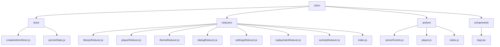
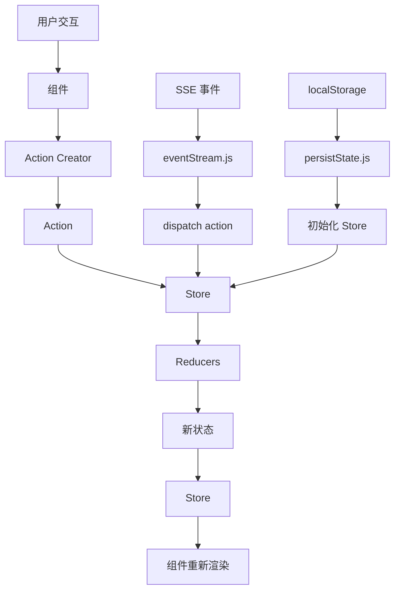
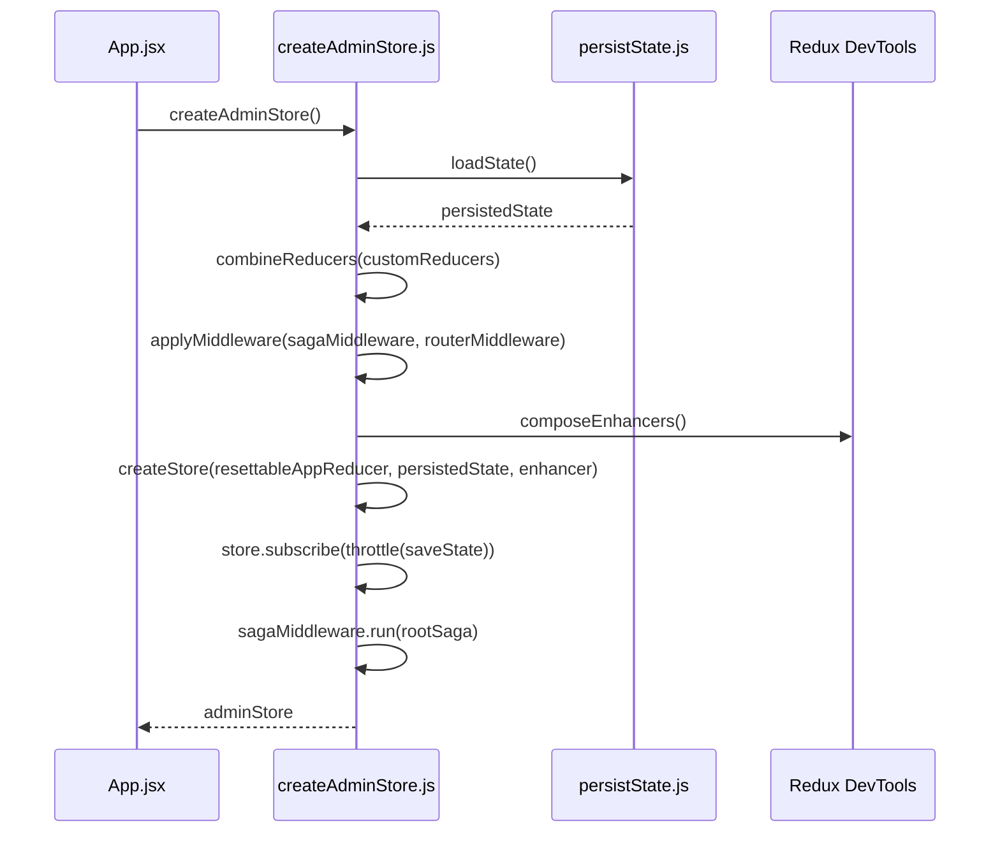
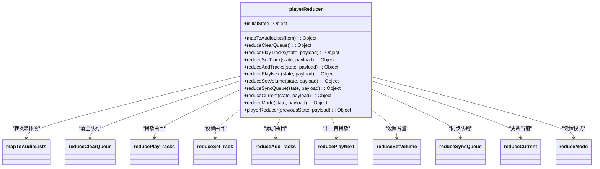
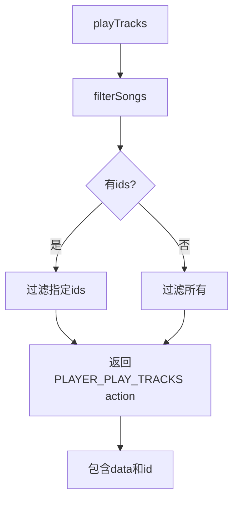
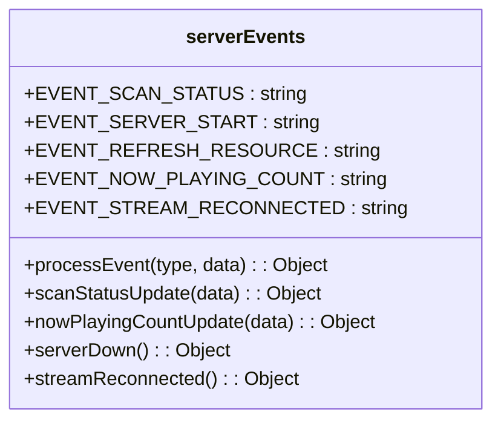
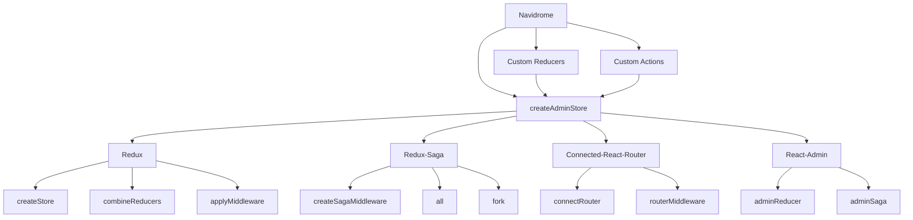

# 状态管理

<cite>
**本文档中引用的文件**  
- [createAdminStore.js](file://ui/src/store/createAdminStore.js)
- [persistState.js](file://ui/src/store/persistState.js)
- [libraryReducer.js](file://ui/src/reducers/libraryReducer.js)
- [playerReducer.js](file://ui/src/reducers/playerReducer.js)
- [themeReducer.js](file://ui/src/reducers/themeReducer.js)
- [dialogReducer.js](file://ui/src/reducers/dialogReducer.js)
- [settingsReducer.js](file://ui/src/reducers/settingsReducer.js)
- [replayGainReducer.js](file://ui/src/reducers/replayGainReducer.js)
- [activityReducer.js](file://ui/src/reducers/activityReducer.js)
- [index.js](file://ui/src/reducers/index.js)
- [serverEvents.js](file://ui/src/actions/serverEvents.js)
- [player.js](file://ui/src/actions/player.js)
- [eventStream.js](file://ui/src/eventStream.js)
- [App.jsx](file://ui/src/App.jsx)
</cite>

## 目录
1. [简介](#简介)
2. [项目结构](#项目结构)
3. [核心组件](#核心组件)
4. [架构概述](#架构概述)
5. [详细组件分析](#详细组件分析)
6. [依赖分析](#依赖分析)
7. [性能考虑](#性能考虑)
8. [故障排除指南](#故障排除指南)
9. [结论](#结论)

## 简介
Navidrome 是一个开源的音乐服务器和流媒体解决方案，其前端采用基于 Redux 的状态管理模式来管理应用状态。本文档详细说明了 Navidrome 前端的状态管理机制，包括 store 的创建、reducer 函数的设计、action creators 的实现、状态更新流程、组件如何通过 hooks 订阅状态变化，以及服务端与客户端状态的同步机制（特别是通过 SSE 事件的实时更新）。此外，还提供了状态管理的最佳实践、性能优化技巧和常见问题解决方案。

## 项目结构
Navidrome 的前端代码位于 `ui/src` 目录下，状态管理相关的文件主要分布在 `store`、`reducers` 和 `actions` 子目录中。这种组织方式遵循了 Redux 的标准实践，将状态逻辑与 UI 组件分离，提高了代码的可维护性和可测试性。



**Diagram sources**
- [createAdminStore.js](file://ui/src/store/createAdminStore.js)
- [libraryReducer.js](file://ui/src/reducers/libraryReducer.js)
- [player.js](file://ui/src/actions/player.js)
- [App.jsx](file://ui/src/App.jsx)

**Section sources**
- [createAdminStore.js](file://ui/src/store/createAdminStore.js)
- [libraryReducer.js](file://ui/src/reducers/libraryReducer.js)
- [player.js](file://ui/src/actions/player.js)
- [App.jsx](file://ui/src/App.jsx)

## 核心组件
Navidrome 的状态管理由以下几个核心组件构成：
- **Store**: 通过 `createAdminStore.js` 创建，是应用状态的单一数据源。
- **Reducers**: 定义在 `reducers` 目录下，负责根据 action 更新状态。
- **Actions**: 定义在 `actions` 目录下，是触发状态变更的纯对象。
- **Action Creators**: 生成 action 对象的函数。
- **Middleware**: 使用 `redux-saga` 处理副作用，如异步 API 调用。
- **State Persistence**: 通过 `persistState.js` 将部分状态持久化到 `localStorage`。

这些组件共同构成了一个可预测的状态管理容器，确保了状态变更的可追踪性和可调试性。

**Section sources**
- [createAdminStore.js](file://ui/src/store/createAdminStore.js)
- [persistState.js](file://ui/src/store/persistState.js)
- [index.js](file://ui/src/reducers/index.js)
- [index.js](file://ui/src/actions/index.js)

## 架构概述
Navidrome 的状态管理架构基于 Redux 模式，结合了 `react-admin` 的管理框架。整体架构如下图所示：



**Diagram sources**
- [createAdminStore.js](file://ui/src/store/createAdminStore.js)
- [persistState.js](file://ui/src/store/persistState.js)
- [eventStream.js](file://ui/src/eventStream.js)
- [App.jsx](file://ui/src/App.jsx)

## 详细组件分析

### Store 创建机制
`createAdminStore.js` 是整个状态管理的入口点。它使用 `redux` 的 `createStore` 函数创建 store，并整合了多个中间件和增强器。



**Diagram sources**
- [createAdminStore.js](file://ui/src/store/createAdminStore.js)
- [persistState.js](file://ui/src/store/persistState.js)
- [App.jsx](file://ui/src/App.jsx)

**Section sources**
- [createAdminStore.js](file://ui/src/store/createAdminStore.js#L1-L78)
- [persistState.js](file://ui/src/store/persistState.js#L1-L21)
- [App.jsx](file://ui/src/App.jsx#L56-L76)

### Reducer 函数设计
Reducers 是纯函数，接收旧状态和 action，返回新状态。Navidrome 定义了多个 reducer 来管理不同的状态域。

#### 库状态管理 (libraryReducer)
`libraryReducer.js` 管理用户库和选中库的状态。它在设置用户库时会进行智能验证，确保选中的库 ID 在用户可访问的库中存在。

```mermaid
flowchart TD
Start([初始化]) --> CheckFirstTime{首次设置?}
CheckFirstTime --> |是| SelectAll[选择所有库]
CheckFirstTime --> |否| CheckSingle{只有一个库?}
CheckSingle --> |是| ResetSelection[重置选择 (空)]
CheckSingle --> |否| ValidateSelection[验证选中库ID]
ValidateSelection --> FinalSelection[确定最终选择]
FinalSelection --> UpdateState[更新状态]
UpdateState --> End([完成])
```

**Diagram sources**
- [libraryReducer.js](file://ui/src/reducers/libraryReducer.js#L1-L53)

**Section sources**
- [libraryReducer.js](file://ui/src/reducers/libraryReducer.js#L1-L53)

#### 播放器状态管理 (playerReducer)
`playerReducer.js` 管理播放队列、当前播放曲目、音量等播放器相关状态。它包含多个辅助函数来处理复杂的队列操作。



**Diagram sources**
- [playerReducer.js](file://ui/src/reducers/playerReducer.js#L1-L214)

**Section sources**
- [playerReducer.js](file://ui/src/reducers/playerReducer.js#L1-L214)

### Action Creators 实现
Action creators 是返回 action 对象的函数，它们封装了创建 action 的逻辑。

#### 播放器 Action (player.js)
`player.js` 定义了与播放器相关的 action creators，如 `playTracks`、`addTracks`、`setVolume` 等。



**Diagram sources**
- [player.js](file://ui/src/actions/player.js#L1-L105)

**Section sources**
- [player.js](file://ui/src/actions/player.js#L1-L105)

#### 服务器事件 Action (serverEvents.js)
`serverEvents.js` 定义了处理服务器推送事件的 action creators，如 `processEvent`、`scanStatusUpdate` 等。



**Diagram sources**
- [serverEvents.js](file://ui/src/actions/serverEvents.js#L1-L30)

**Section sources**
- [serverEvents.js](file://ui/src/actions/serverEvents.js#L1-L30)

## 依赖分析
Navidrome 的状态管理依赖于多个外部库和内部模块。



**Diagram sources**
- [createAdminStore.js](file://ui/src/store/createAdminStore.js)
- [go.mod](file://go.mod)

**Section sources**
- [createAdminStore.js](file://ui/src/store/createAdminStore.js#L1-L78)
- [go.mod](file://go.mod#L1-L10)

## 性能考虑
Navidrome 在状态管理方面采取了多项性能优化措施：

1. **状态持久化节流**: 使用 `lodash.throttle` 将状态保存操作限制在每秒最多一次，避免频繁的 `localStorage` 写入。
2. **选择性持久化**: 只持久化必要的状态（主题、库、播放器、专辑视图、设置），减少存储开销。
3. **事件流节流**: 对扫描状态等高频事件使用 `throttle` 进行节流，防止 UI 过度更新。
4. **智能状态重置**: 在用户登出时重置状态，确保状态的一致性。
5. **模块化 Reducer**: 将状态拆分为多个独立的 reducer，便于代码分割和按需加载。

这些优化确保了应用在处理大量音乐数据时仍能保持流畅的用户体验。

## 故障排除指南
以下是状态管理相关的常见问题及解决方案：

1. **状态未持久化**: 检查浏览器是否禁用了 `localStorage`，或查看控制台是否有写入错误。
2. **SSE 连接失败**: 确保服务器正在运行且网络连接正常，检查 JWT token 是否有效。
3. **状态更新不及时**: 检查 action type 是否正确，reducer 是否处理了该 action。
4. **组件未重新渲染**: 确保组件正确使用了 `useSelector` 或 `connect` 来订阅状态。
5. **内存泄漏**: 确保在组件卸载时正确清理事件监听器和订阅。

**Section sources**
- [persistState.js](file://ui/src/store/persistState.js#L1-L21)
- [eventStream.js](file://ui/src/eventStream.js#L1-L115)
- [createAdminStore.js](file://ui/src/store/createAdminStore.js#L1-L78)

## 结论
Navidrome 的前端状态管理机制是一个典型的 Redux 实现，结合了 `react-admin` 的管理框架和 `redux-saga` 的副作用处理。通过 `createAdminStore.js` 统一创建 store，使用模块化的 reducer 管理不同领域的状态，并通过 action creators 触发状态变更。状态持久化和 SSE 事件集成确保了用户体验的连续性和实时性。该设计模式清晰、可预测，为大型单页应用的状态管理提供了可靠的解决方案。