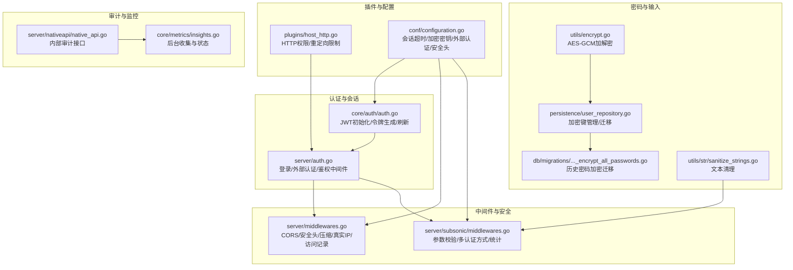
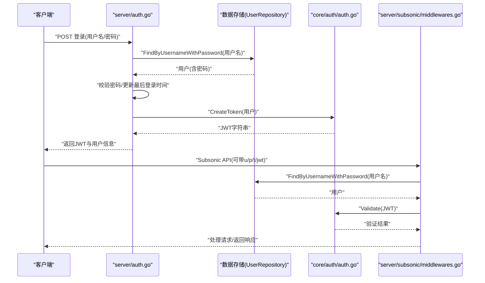
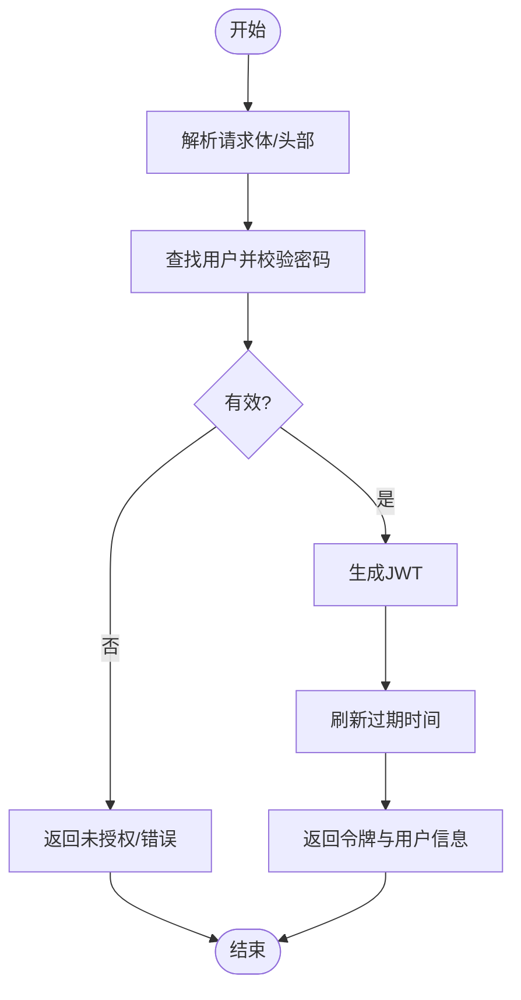
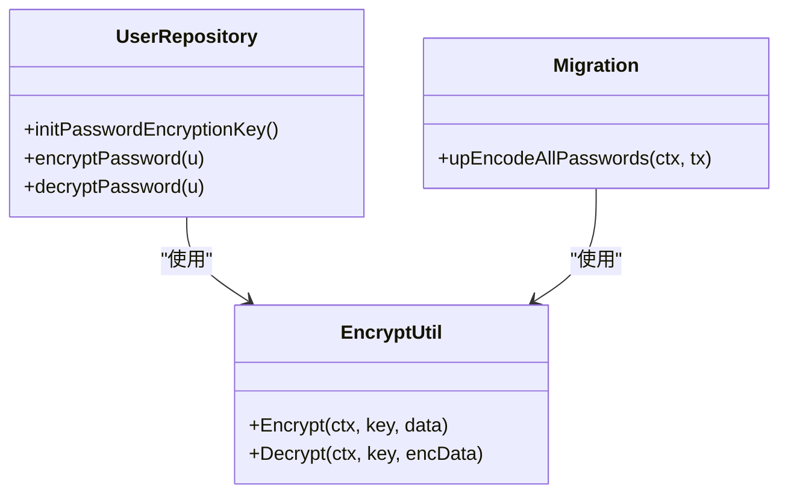
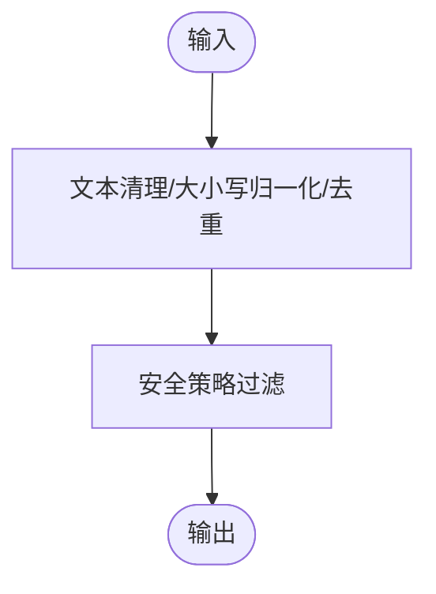
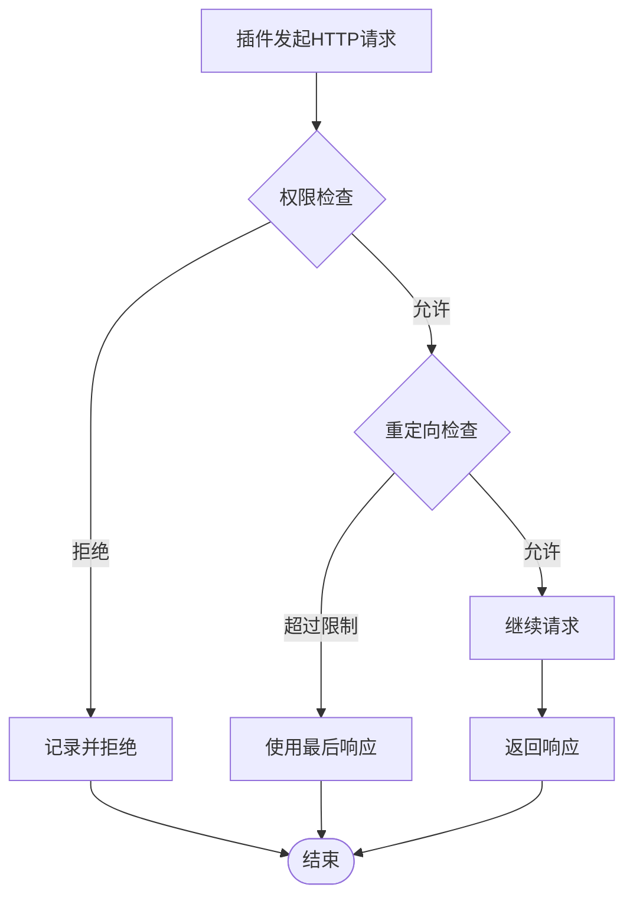
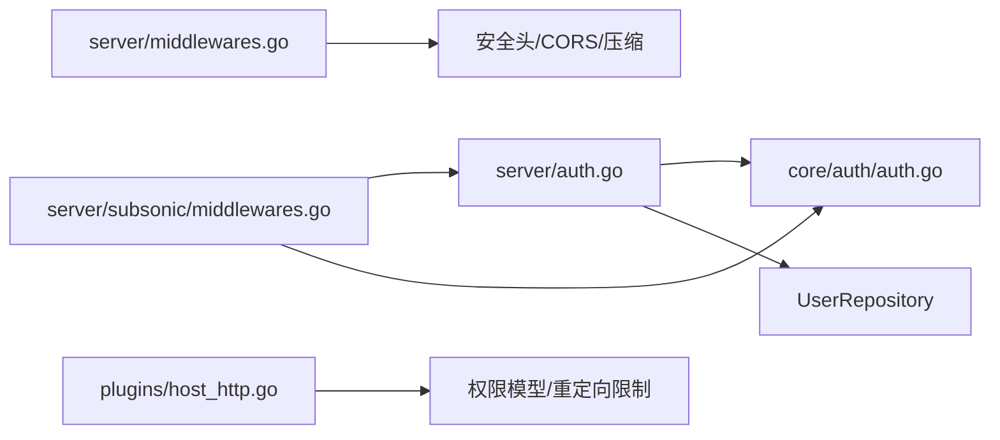

# 安全考虑

<cite>
**本文引用的文件**
- [core/auth/auth.go](file://core/auth/auth.go)
- [server/auth.go](file://server/auth.go)
- [server/middlewares.go](file://server/middlewares.go)
- [server/subsonic/middlewares.go](file://server/subsonic/middlewares.go)
- [utils/encrypt.go](file://utils/encrypt.go)
- [persistence/user_repository.go](file://persistence/user_repository.go)
- [db/migrations/20210616150710_encrypt_all_passwords.go](file://db/migrations/20210616150710_encrypt_all_passwords.go)
- [utils/str/sanitize_strings.go](file://utils/str/sanitize_strings.go)
- [plugins/host_http.go](file://plugins/host_http.go)
- [conf/configuration.go](file://conf/configuration.go)
- [server/subsonic/middlewares_test.go](file://server/subsonic/middlewares_test.go)
- [server/auth_test.go](file://server/auth_test.go)
- [utils/limiter.go](file://utils/limiter.go)
- [server/nativeapi/native_api.go](file://server/nativeapi/native_api.go)
- [core/metrics/insights.go](file://core/metrics/insights.go)
</cite>

## 目录
1. [简介](#简介)
2. [项目结构](#项目结构)
3. [核心组件](#核心组件)
4. [架构总览](#架构总览)
5. [详细组件分析](#详细组件分析)
6. [依赖关系分析](#依赖关系分析)
7. [性能考量](#性能考量)
8. [故障排查指南](#故障排查指南)
9. [结论](#结论)
10. [附录](#附录)

## 简介
本文件聚焦于Navidrome在认证授权、会话管理、权限控制、密码存储与传输安全、输入验证与常见Web攻击防护、安全配置（HTTPS与安全头）、插件安全沙箱以及安全审计与监控等方面的实现与最佳实践。内容严格基于仓库中auth包与server/auth.go等核心文件的实际实现进行梳理，并辅以相关中间件、配置与插件宿主实现，帮助系统管理员与开发者理解并正确部署与维护Navidrome的安全性。

## 项目结构
围绕安全主题的关键模块分布如下：
- 认证授权与会话：core/auth（JWT初始化与令牌生成）、server/auth（登录流程、外部认证、令牌刷新）
- 中间件与安全头：server/middlewares（CORS、安全头、压缩、客户端唯一ID Cookie、真实IP、访问统计）
- Subsonic兼容层认证：server/subsonic/middlewares（参数校验、多种认证方式、统计）
- 密码存储与迁移：utils/encrypt（AES-GCM加解密）、persistence/user_repository（密码加密键管理与迁移）
- 输入验证与清理：utils/str/sanitize_strings（文本与字段清理）
- 插件安全沙箱：plugins/host_http（HTTP请求权限控制、重定向限制）
- 配置与默认值：conf/configuration（会话超时、加密密钥、外部认证、安全头等）
- 审计与监控：server/nativeapi（内部路由与审计接口）、core/metrics/insights（后台收集与状态）

图表来源
- [core/auth/auth.go](file://core/auth/auth.go#L1-L148)
- [server/auth.go](file://server/auth.go#L1-L372)
- [server/middlewares.go](file://server/middlewares.go#L1-L330)
- [server/subsonic/middlewares.go](file://server/subsonic/middlewares.go#L1-L273)
- [utils/encrypt.go](file://utils/encrypt.go#L1-L73)
- [persistence/user_repository.go](file://persistence/user_repository.go#L326-L415)
- [db/migrations/20210616150710_encrypt_all_passwords.go](file://db/migrations/20210616150710_encrypt_all_passwords.go#L1-L56)
- [utils/str/sanitize_strings.go](file://utils/str/sanitize_strings.go#L1-L66)
- [plugins/host_http.go](file://plugins/host_http.go#L1-L115)
- [conf/configuration.go](file://conf/configuration.go#L1-L720)
- [server/nativeapi/native_api.go](file://server/nativeapi/native_api.go#L205-L247)
- [core/metrics/insights.go](file://core/metrics/insights.go#L52-L96)

章节来源
- [core/auth/auth.go](file://core/auth/auth.go#L1-L148)
- [server/auth.go](file://server/auth.go#L1-L372)
- [server/middlewares.go](file://server/middlewares.go#L1-L330)
- [server/subsonic/middlewares.go](file://server/subsonic/middlewares.go#L1-L273)
- [utils/encrypt.go](file://utils/encrypt.go#L1-L73)
- [persistence/user_repository.go](file://persistence/user_repository.go#L326-L415)
- [db/migrations/20210616150710_encrypt_all_passwords.go](file://db/migrations/20210616150710_encrypt_all_passwords.go#L1-L56)
- [utils/str/sanitize_strings.go](file://utils/str/sanitize_strings.go#L1-L66)
- [plugins/host_http.go](file://plugins/host_http.go#L1-L115)
- [conf/configuration.go](file://conf/configuration.go#L1-L720)
- [server/nativeapi/native_api.go](file://server/nativeapi/native_api.go#L205-L247)
- [core/metrics/insights.go](file://core/metrics/insights.go#L52-L96)

## 核心组件
- JWT认证与会话管理
  - 初始化：从数据库属性读取或生成JWT密钥，使用对称算法创建令牌对象；会话超时由配置决定。
  - 令牌生成：包含发行者、签发时间、主体（用户名）、用户ID、是否管理员等声明；随后刷新过期时间。
  - 令牌验证：对外部传入的JWT进行验证并解析声明。
  - 令牌刷新：在响应头中更新新令牌，延长会话有效期。
- 登录与外部认证
  - 内部登录：解析请求体中的用户名与密码，校验后生成JWT并返回用户信息与子sonic盐与令牌。
  - 外部认证：支持反向代理注入的可信源白名单校验，仅当来源IP在白名单内且携带指定头部时才信任。
  - 开发自动登录：在开发模式下可直接从上下文注入用户名。
- 中间件与安全头
  - CORS：允许跨域方法与头部，暴露特定响应头。
  - 安全头：禁用MIME嗅探、禁止帧嵌套、同源引用策略、可自定义帧选项。
  - 压缩：对常见文本类型启用压缩。
  - 客户端唯一ID Cookie：在请求头提供时写入HttpOnly Secure SameSite Strict Cookie，提升CSRF与XSS防护。
  - 真实IP：在启用外部认证时，将反向代理IP写入上下文，用于白名单校验。
- Subsonic兼容认证
  - 参数校验：强制要求版本与客户端参数，内部/代理认证时仅需版本与客户端。
  - 多种认证方式：支持JWT、明文/十六进制密码、旧版token+salt三种方式；均与数据库用户密码比对。
- 密码存储与迁移
  - AES-GCM对称加密：使用固定或配置的加密密钥对密码进行加解密。
  - 加密键管理：若更换加密密钥，将阻止用户登录；迁移逻辑会尝试重新加密现有密码。
  - 历史迁移：数据库迁移脚本对所有用户密码进行一次性加密。
- 输入验证与清理
  - 文本清理：使用策略化清理器与正则表达式去除特殊字符、大小写归一化、去重词序等。
  - 字段排序清理：移除冠词、标准化大小写与重音符号，便于稳定排序。
- 插件安全沙箱
  - HTTP权限：仅允许插件访问被许可的URL与方法；拒绝越权请求。
  - 重定向限制：限制最大重定向次数，并对每次重定向目标进行许可检查。
- 审计与监控
  - 内部审计接口：提供检查点与洞察状态查询。
  - 后台收集：周期性以管理员身份运行，记录运行状态与成功与否。

章节来源
- [core/auth/auth.go](file://core/auth/auth.go#L1-L148)
- [server/auth.go](file://server/auth.go#L1-L372)
- [server/middlewares.go](file://server/middlewares.go#L1-L330)
- [server/subsonic/middlewares.go](file://server/subsonic/middlewares.go#L1-L273)
- [utils/encrypt.go](file://utils/encrypt.go#L1-L73)
- [persistence/user_repository.go](file://persistence/user_repository.go#L326-L415)
- [db/migrations/20210616150710_encrypt_all_passwords.go](file://db/migrations/20210616150710_encrypt_all_passwords.go#L1-L56)
- [utils/str/sanitize_strings.go](file://utils/str/sanitize_strings.go#L1-L66)
- [plugins/host_http.go](file://plugins/host_http.go#L1-L115)
- [server/nativeapi/native_api.go](file://server/nativeapi/native_api.go#L205-L247)
- [core/metrics/insights.go](file://core/metrics/insights.go#L52-L96)

## 架构总览
以下序列图展示了典型登录与鉴权流程，映射到实际代码路径。

图表来源
- [server/auth.go](file://server/auth.go#L36-L95)
- [server/auth.go](file://server/auth.go#L156-L172)
- [core/auth/auth.go](file://core/auth/auth.go#L77-L101)
- [server/subsonic/middlewares.go](file://server/subsonic/middlewares.go#L98-L154)
- [server/subsonic/middlewares.go](file://server/subsonic/middlewares.go#L156-L179)

章节来源
- [server/auth.go](file://server/auth.go#L36-L95)
- [server/auth.go](file://server/auth.go#L156-L172)
- [core/auth/auth.go](file://core/auth/auth.go#L77-L101)
- [server/subsonic/middlewares.go](file://server/subsonic/middlewares.go#L98-L154)
- [server/subsonic/middlewares.go](file://server/subsonic/middlewares.go#L156-L179)

## 详细组件分析

### 认证与会话管理（core/auth 与 server/auth）
- JWT初始化与密钥管理
  - 从属性表读取JWT密钥，若不存在或无法解密则生成新密钥并加密保存；密钥派生来自配置的密码加密密钥或默认密钥。
  - 使用对称算法创建令牌对象，后续用于编码/解码与验证。
- 令牌生成与刷新
  - 生成基础声明（发行者），附加用户ID与管理员标识；随后根据会话超时刷新过期时间并重新编码。
  - 刷新中间件会在响应头中设置新的令牌，避免频繁重新登录。
- 登录与外部认证
  - 内部登录：解析请求体，校验用户存在与密码匹配，生成JWT并返回payload。
  - 外部认证：仅当反向代理IP在可信列表内且携带指定用户头时才信任；否则拒绝。
  - 开发自动登录：在开发模式下直接注入用户名。
- 权限控制
  - Subsonic中间件支持内部/代理/密码/JWT等多种认证方式；未通过认证时返回错误。
  - 管理员专用路由示例：仅管理员可访问。

图表来源
- [server/auth.go](file://server/auth.go#L36-L95)
- [server/auth.go](file://server/auth.go#L156-L172)
- [core/auth/auth.go](file://core/auth/auth.go#L77-L101)

章节来源
- [core/auth/auth.go](file://core/auth/auth.go#L1-L148)
- [server/auth.go](file://server/auth.go#L1-L372)
- [server/subsonic/middlewares.go](file://server/subsonic/middlewares.go#L98-L154)

### 密码存储与传输安全
- 存储安全
  - 使用AES-GCM对称加密保护用户密码；密钥长度派生自配置的密码加密密钥或默认密钥。
  - 若更换加密密钥，系统会检测并阻止登录，同时迁移脚本会尝试重新加密现有密码。
- 迁移与兼容
  - 数据库迁移脚本对所有历史密码进行一次性加密，确保后续统一采用加密存储。
- 传输安全
  - 建议通过HTTPS/TLS传输，避免明文密码在网络中泄露。
  - 在反向代理场景下，确保TLS终止于代理并正确传递必要的头部。

图表来源
- [persistence/user_repository.go](file://persistence/user_repository.go#L326-L415)
- [utils/encrypt.go](file://utils/encrypt.go#L1-L73)
- [db/migrations/20210616150710_encrypt_all_passwords.go](file://db/migrations/20210616150710_encrypt_all_passwords.go#L1-L56)

章节来源
- [persistence/user_repository.go](file://persistence/user_repository.go#L326-L415)
- [utils/encrypt.go](file://utils/encrypt.go#L1-L73)
- [db/migrations/20210616150710_encrypt_all_passwords.go](file://db/migrations/20210616150710_encrypt_all_passwords.go#L1-L56)

### 输入验证与常见Web攻击防护
- XSS防护
  - 文本清理策略：使用安全策略清理器与正则表达式去除特殊字符、大小写归一化、去重词序，降低XSS风险。
  - 字段排序清理：移除冠词与重音符号，避免排序歧义与潜在注入。
- CSRF防护
  - 客户端唯一ID Cookie：以HttpOnly、Secure、SameSite Strict方式下发，降低跨站请求伪造风险。
  - CORS策略：限制允许的方法与头部，减少跨域滥用。
- 其他防护
  - 安全头：禁用MIME嗅探、禁止帧嵌套、同源引用策略，降低点击劫持与嗅探风险。
  - 压缩：对文本类响应启用压缩，减少带宽占用。

图表来源
- [utils/str/sanitize_strings.go](file://utils/str/sanitize_strings.go#L1-L66)
- [server/middlewares.go](file://server/middlewares.go#L87-L114)
- [server/middlewares.go](file://server/middlewares.go#L130-L166)

章节来源
- [utils/str/sanitize_strings.go](file://utils/str/sanitize_strings.go#L1-L66)
- [server/middlewares.go](file://server/middlewares.go#L87-L114)
- [server/middlewares.go](file://server/middlewares.go#L130-L166)

### 插件系统的安全沙箱机制
- HTTP权限控制
  - 插件仅能访问被许可的URL与方法；任何越权请求会被记录并拒绝。
- 重定向限制
  - 最大重定向次数限制；每次重定向目标均需再次许可，防止跳转至不受控地址。
- 超时与日志
  - 默认HTTP客户端超时；错误与响应状态会记录以便审计。

图表来源
- [plugins/host_http.go](file://plugins/host_http.go#L1-L115)

章节来源
- [plugins/host_http.go](file://plugins/host_http.go#L1-L115)

### 安全配置建议（HTTPS与安全头）
- HTTPS/TLS
  - 建议在反向代理层启用TLS终止，并正确配置证书与私钥路径。
  - 配置文件中提供证书与密钥字段，确保服务端口与协议符合预期。
- 安全头
  - 框架已内置安全头中间件，包含MIME嗅探禁用、帧嵌套禁止、同源引用策略等。
  - 可通过配置项自定义帧选项值，满足不同部署环境需求。
- CORS
  - 允许常用方法与头部，注意在生产环境中限制来源与暴露的响应头，避免过度放行。

章节来源
- [conf/configuration.go](file://conf/configuration.go#L1-L720)
- [server/middlewares.go](file://server/middlewares.go#L87-L114)
- [server/middlewares.go](file://server/middlewares.go#L116-L128)

### 审计与监控指南
- 内部审计接口
  - 提供检查点与洞察状态查询，便于运维人员快速定位问题。
- 后台收集
  - 周期性以管理员身份运行，记录最近一次运行时间与成功状态，便于长期监控。
- 访问与统计
  - Subsonic中间件记录请求耗时、状态码、客户端名称等指标，可用于异常追踪与容量规划。

章节来源
- [server/nativeapi/native_api.go](file://server/nativeapi/native_api.go#L205-L247)
- [core/metrics/insights.go](file://core/metrics/insights.go#L52-L96)
- [server/subsonic/middlewares.go](file://server/subsonic/middlewares.go#L240-L273)

## 依赖关系分析
- 组件耦合
  - server/auth依赖core/auth进行JWT初始化与令牌操作；依赖数据存储进行用户查询与更新。
  - Subsonic中间件依赖server层提供的外部认证与内部认证入口，同时依赖core/auth进行JWT验证。
  - 中间件层提供统一的安全头、CORS、压缩与真实IP处理，贯穿所有请求。
- 外部依赖
  - JWT库用于令牌编码/解码与验证。
  - 安全库用于设置安全响应头。
  - 插件HTTP宿主依赖权限模型与重定向策略，确保插件行为受控。

图表来源
- [server/auth.go](file://server/auth.go#L1-L372)
- [core/auth/auth.go](file://core/auth/auth.go#L1-L148)
- [server/subsonic/middlewares.go](file://server/subsonic/middlewares.go#L1-L273)
- [server/middlewares.go](file://server/middlewares.go#L1-L330)
- [plugins/host_http.go](file://plugins/host_http.go#L1-L115)

章节来源
- [server/auth.go](file://server/auth.go#L1-L372)
- [core/auth/auth.go](file://core/auth/auth.go#L1-L148)
- [server/subsonic/middlewares.go](file://server/subsonic/middlewares.go#L1-L273)
- [server/middlewares.go](file://server/middlewares.go#L1-L330)
- [plugins/host_http.go](file://plugins/host_http.go#L1-L115)

## 性能考量
- 令牌刷新与会话超时
  - 通过配置控制会话超时，避免过长会话带来的安全风险；刷新令牌减少频繁登录开销。
- 请求频率限制
  - 用户访问时间戳更新采用限流器，避免高并发下的数据库压力。
- 压缩与缓存
  - 对文本类响应启用压缩，减少网络传输；插件编译缓存与清理机制优化启动性能。

章节来源
- [core/auth/auth.go](file://core/auth/auth.go#L91-L101)
- [conf/configuration.go](file://conf/configuration.go#L1-L720)
- [utils/limiter.go](file://utils/limiter.go#L1-L26)
- [server/middlewares.go](file://server/middlewares.go#L116-L128)

## 故障排查指南
- 登录失败
  - 检查用户名是否存在、密码是否匹配；确认是否启用了外部认证且来源IP在白名单内。
  - 查看日志中关于认证失败的警告与错误信息。
- JWT无效
  - 确认令牌未过期；检查刷新中间件是否正确设置响应头。
  - 核对发行者与主体声明是否与用户一致。
- 外部认证不生效
  - 确认反向代理IP已注入上下文，且可信源列表包含该IP。
  - 检查用户头名称与值是否正确。
- 插件HTTP被拒绝
  - 检查插件权限配置，确认目标URL与方法是否在许可范围内。
  - 关注重定向次数与目标URL的许可情况。

章节来源
- [server/auth_test.go](file://server/auth_test.go#L289-L328)
- [server/subsonic/middlewares_test.go](file://server/subsonic/middlewares_test.go#L119-L285)
- [plugins/host_http.go](file://plugins/host_http.go#L1-L115)
- [server/auth.go](file://server/auth.go#L174-L216)

## 结论
Navidrome在认证授权、会话管理、权限控制、密码存储与传输安全、输入验证与常见Web攻击防护、安全配置与插件沙箱等方面形成了较为完整的安全体系。通过JWT令牌、外部认证白名单、安全头与CORS、AES-GCM加密与迁移、文本清理与Cookie策略、插件HTTP权限与重定向限制，以及审计与监控能力，能够满足大多数生产环境的安全要求。建议在部署时结合HTTPS/TLS、最小权限原则与定期审计，持续提升整体安全性。

## 附录
- 关键配置项参考
  - 会话超时：用于控制JWT过期时间与刷新策略。
  - 密码加密密钥：用于派生加密密钥，影响密码存储与迁移。
  - 外部认证：可信源与用户头配置，决定外部认证是否生效。
  - 安全头：自定义帧选项值，适配不同部署环境。

章节来源
- [conf/configuration.go](file://conf/configuration.go#L1-L720)