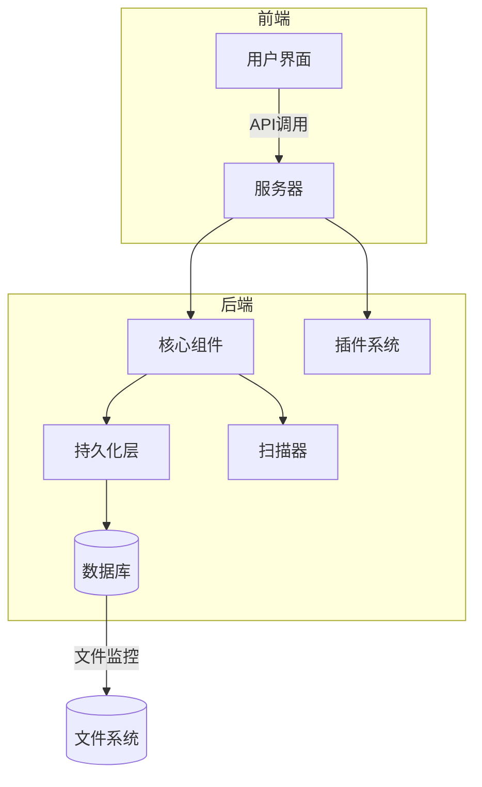
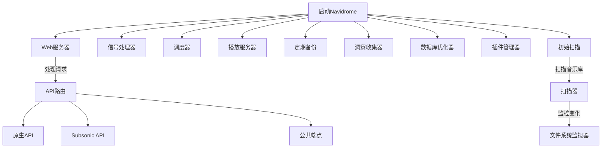
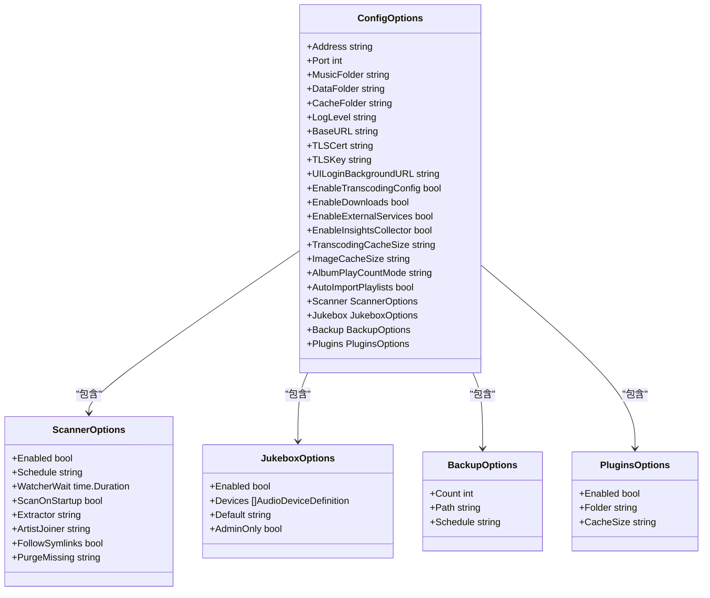
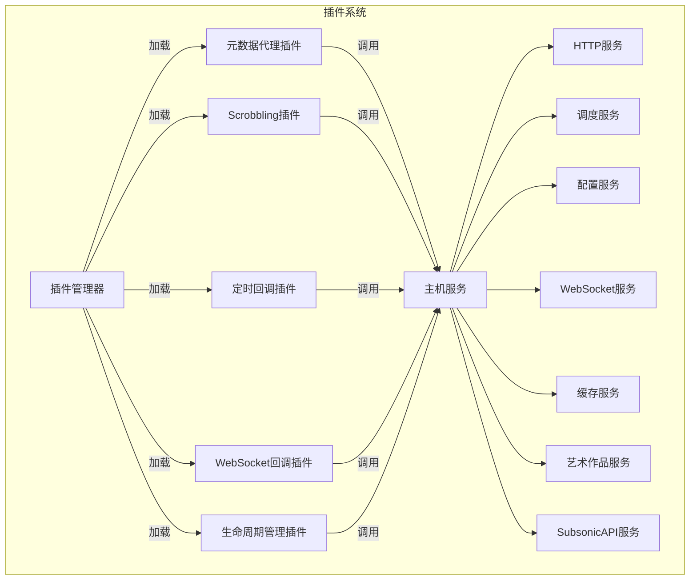
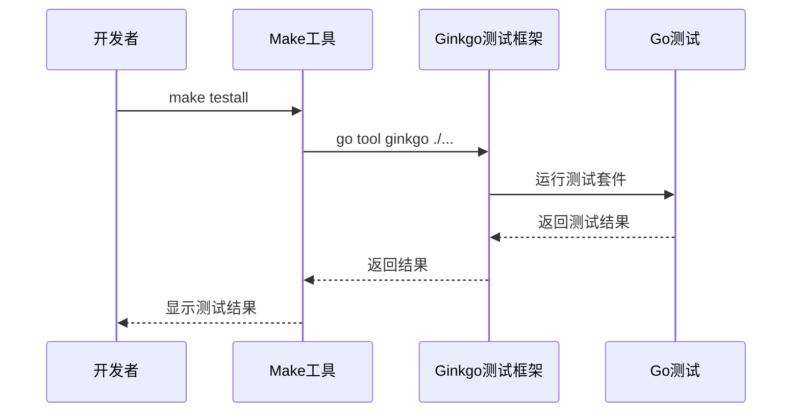
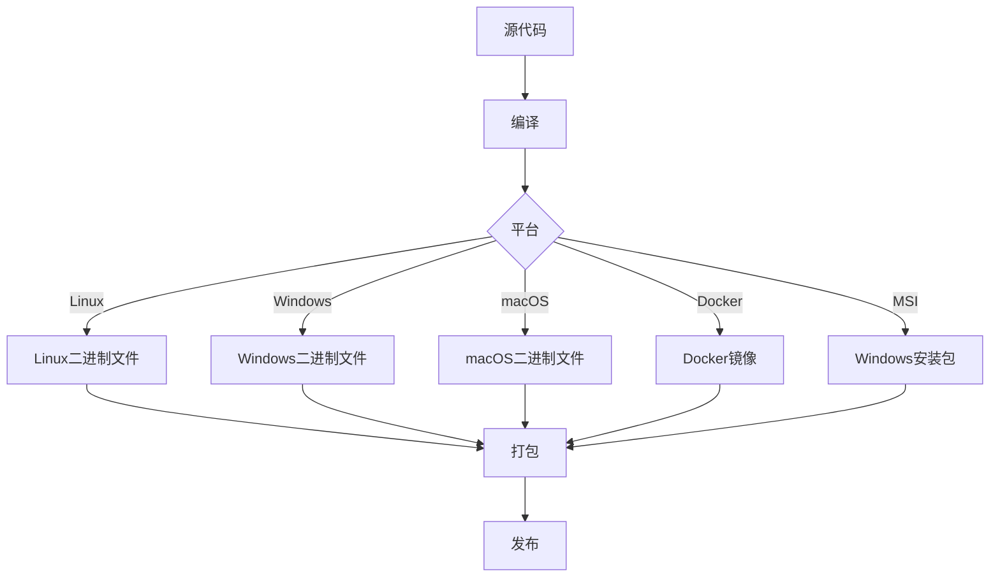
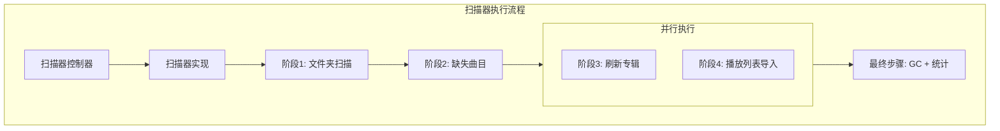

# 开发者指南

<cite>
**本文档中引用的文件**   
- [CONTRIBUTING.md](file://CONTRIBUTING.md)
- [README.md](file://README.md)
- [go.mod](file://go.mod)
- [Makefile](file://Makefile)
- [main.go](file://main.go)
- [cmd/root.go](file://cmd/root.go)
- [conf/configuration.go](file://conf/configuration.go)
- [ui/package.json](file://ui/package.json)
- [ui/vite.config.js](file://ui/vite.config.js)
- [Dockerfile](file://Dockerfile)
- [Procfile.dev](file://Procfile.dev)
- [plugins/README.md](file://plugins/README.md)
- [scanner/README.md](file://scanner/README.md)
- [ui/tsconfig.json](file://ui/tsconfig.json)
</cite>

## 目录
1. [简介](#简介)
2. [开发环境搭建](#开发环境搭建)
3. [代码库结构](#代码库结构)
4. [主要组件职责](#主要组件职责)
5. [调试技巧和测试策略](#调试技巧和测试策略)
6. [贡献流程](#贡献流程)
7. [构建和打包指南](#构建和打包指南)
8. [入门指导](#入门指导)
9. [高级开发技巧](#高级开发技巧)

## 简介

Navidrome是一个开源的基于Web的音乐收藏服务器和流媒体服务，允许用户从任何浏览器或移动设备享受他们的音乐收藏。本开发者指南旨在为新贡献者和经验丰富的开发者提供全面的开发指导，涵盖从环境搭建到高级开发技巧的各个方面。

**Section sources**
- [README.md](file://README.md#L1-L89)

## 开发环境搭建

### Go和Node.js依赖安装

Navidrome的开发环境需要Go和Node.js两种语言环境。根据项目根目录的`go.mod`文件，项目使用Go 1.25版本。Node.js版本由`.nvmrc`文件指定。

```bash
# 安装Go (版本1.25)
# 请从 https://golang.org/dl/ 下载并安装Go 1.25

# 安装Node.js (版本由.nvmrc指定)
# 推荐使用nvm来管理Node.js版本
nvm install
nvm use

# 安装项目依赖
make setup
```

`Makefile`中的`setup`目标会自动下载Go和Node.js依赖，并设置Git钩子。

### 开发服务器启动

Navidrome提供了多种开发模式来启动服务器：

```bash
# 启动完整的开发环境（前端和后端热重载）
make dev

# 只启动后端开发服务器
make server

# 停止开发服务器
make stop
```

开发环境使用`Procfile.dev`文件来定义前端和后端的服务，通过`foreman`工具同时启动。

**Section sources**
- [go.mod](file://go.mod#L1-L147)
- [Makefile](file://Makefile#L1-L298)
- [Procfile.dev](file://Procfile.dev#L1-L3)

## 代码库结构

Navidrome的代码库采用分层架构，主要目录结构如下：

```
.
├── adapters\taglib\          # 标签库适配器
├── cmd\                     # 命令行命令
├── conf\                    # 配置管理
├── core\                    # 核心业务逻辑
├── db\                      # 数据库管理
├── model\                   # 数据模型
├── persistence\             # 持久化层
├── plugins\                 # 插件系统
├── scanner\                 # 扫描器
├── server\                  # 服务器实现
├── ui\                      # 前端用户界面
└── utils\                   # 工具函数
```

### 主要目录说明

- **adapters/taglib**: 包含与taglib库交互的适配器代码，用于读取音频文件的元数据。
- **cmd**: 包含所有命令行命令的实现，如`scan`、`backup`等。
- **conf**: 负责配置管理，支持多种配置格式（TOML、INI、JSON等）。
- **core**: 核心业务逻辑，包括身份验证、播放、扫描等功能。
- **db**: 数据库相关代码，包括迁移脚本和备份功能。
- **model**: 定义所有数据模型和实体。
- **persistence**: 数据持久化层，实现数据访问对象（DAO）模式。
- **plugins**: WebAssembly插件系统，允许扩展Navidrome的功能。
- **scanner**: 音乐库扫描器，负责监控文件系统变化并更新数据库。
- **server**: HTTP服务器实现，处理所有API请求。
- **ui**: 前端代码，使用React和Material UI构建。
- **utils**: 各种工具函数和辅助类。



**Diagram sources **
- [project_structure](file://#L1-L1000)

**Section sources**
- [project_structure](file://#L1-L1000)

## 主要组件职责

### 核心组件分析

#### 服务器组件

服务器组件是Navidrome的核心，负责启动所有服务。`cmd/root.go`文件中的`runNavidrome`函数启动了多个goroutine来并行运行不同的服务：



**Diagram sources **
- [cmd/root.go](file://cmd/root.go#L71-L97)

**Section sources**
- [cmd/root.go](file://cmd/root.go#L71-L97)

#### 配置管理

配置管理组件负责加载和解析Navidrome的配置。`conf/configuration.go`文件定义了所有配置选项，并支持通过环境变量、配置文件等多种方式设置。



**Diagram sources **
- [conf/configuration.go](file://conf/configuration.go#L22-L237)

**Section sources**
- [conf/configuration.go](file://conf/configuration.go#L22-L237)

#### 插件系统

Navidrome的插件系统基于WebAssembly（WASM），允许开发者扩展功能而无需修改核心代码库。插件系统支持多种能力：



**Diagram sources **
- [plugins/README.md](file://plugins/README.md#L1-L800)

**Section sources**
- [plugins/README.md](file://plugins/README.md#L1-L800)

## 调试技巧和测试策略

### 调试技巧

Navidrome提供了多种调试工具和选项：

```bash
# 运行开发服务器（带热重载）
make server

# 运行完整的开发环境
make dev

# 构建带调试信息的二进制文件
make debug-build

# 启用性能分析器
ND_DEV_ENABLE_PROFILER=true make dev
```

在代码中，可以使用`log`包进行不同级别的日志记录：

```go
log.Debug(ctx, "调试信息")
log.Info(ctx, "普通信息")
log.Warn(ctx, "警告信息")
log.Error(ctx, "错误信息", err)
```

### 测试策略

Navidrome使用Ginkgo和Gomega进行测试，提供了全面的测试套件：

```bash
# 运行所有Go测试
make testall

# 运行Go测试（带竞态检测）
make test-race

# 运行JavaScript测试
make test-js

# 运行测试并监视代码变化
make watch

# 更新快照测试
make snapshots
```

测试代码分布在各个组件目录中，通常以`_test.go`结尾。例如，`core/`目录下的测试文件验证核心业务逻辑，`server/`目录下的测试文件验证API端点。



**Diagram sources **
- [Makefile](file://Makefile#L48-L67)

**Section sources**
- [Makefile](file://Makefile#L48-L67)

## 贡献流程

### 代码风格和提交规范

Navidrome遵循严格的代码风格和提交规范，确保代码质量和一致性。贡献者必须遵守以下规则：

#### 提交信息约定

每个提交信息必须遵循以下格式：

```
<类型>(<范围>): <描述> - <问题编号>

[可选的正文]
```

其中：
- **类型**: 必须是以下之一：`feat`（新功能）、`fix`（修复bug）、`sec`（安全修复）、`docs`（文档变更）、`style`（样式变更）、`refactor`（重构）、`perf`（性能优化）、`test`（测试更新）、`build`（构建变更）、`revert`（回滚）、`chore`（杂项）
- **范围**: 变更的文件或目录
- **描述**: 简短的变更描述
- **问题编号**: 修复的问题编号

示例：
```bash
git commit --signoff -m "feat(themes): 新主题 - #834"
```

#### 代码风格

- 使用`golangci-lint`进行代码检查
- 使用`goimports`格式化代码
- 遵循Go语言的命名约定
- 添加适当的注释和文档

```bash
# 检查代码风格
make lintall

# 格式化代码
make format
```

### Pull Request审查流程

提交Pull Request前，请确保：

1. 创建一个与问题相关的分支：`git checkout -b adding-docs/834 master`
2. 确保没有重复的Pull Request
3. 设置开发环境
4. 使用`--signoff`选项提交
5. 在Pull Request中提供要关闭的问题链接

Pull Request的标题可以与提交信息相同。Pull Request的正文应包含：

```
关闭 <问题编号及链接>

描述（Pull Request做了什么）

变更（做了哪些变更）

截图或视频

相关的问题和Pull Request（如果有）
```

**Section sources**
- [CONTRIBUTING.md](file://CONTRIBUTING.md#L1-L94)

## 构建和打包指南

### 构建过程

Navidrome提供了多种构建选项：

```bash
# 构建项目
make build

# 构建前端
make buildjs

# 构建带调试信息的二进制文件
make debug-build

# 跨平台构建
make docker-build

# 构建Docker镜像
make docker-image

# 构建MSI安装包
make docker-msi
```

构建过程使用`go build`命令，并通过`-ldflags`传递版本信息：

```bash
go build -ldflags="-X github.com/navidrome/navidrome/consts.gitSha=$(GIT_SHA) -X github.com/navidrome/navidrome/consts.gitTag=$(GIT_TAG)" -tags=netgo
```

### 打包和发布

Navidrome使用`goreleaser`进行打包和发布：

```bash
# 创建所有平台的二进制文件和包
make package
```

`release/goreleaser.yml`文件定义了打包配置，包括不同平台的构建选项和发布目标。



**Diagram sources **
- [Makefile](file://Makefile#L129-L204)

**Section sources**
- [Makefile](file://Makefile#L129-L204)

## 入门指导

### 新贡献者入门

对于新贡献者，建议按照以下步骤开始：

1. **设置开发环境**
   ```bash
   make setup
   ```

2. **运行开发服务器**
   ```bash
   make dev
   ```

3. **了解代码库结构**
   - 阅读`README.md`和`CONTRIBUTING.md`
   - 浏览主要目录和文件
   - 了解核心组件的职责

4. **选择一个简单的问题**
   - 查看GitHub上的"good first issue"标签
   - 从文档改进或小bug修复开始

5. **创建Pull Request**
   - 遵循提交规范
   - 提供清晰的描述和变更说明

### 获取示例音乐

为了测试Navidrome，可以下载一些免费音乐：

```bash
make get-music
```

这将从Navidrome的演示实例下载一些音乐文件到`music`目录。

## 高级开发技巧

### 插件开发

Navidrome的插件系统基于WebAssembly，允许开发者创建安全的扩展。插件使用Protocol Buffers定义接口，并通过`plugins/api/api.proto`文件进行通信。

要创建一个插件，需要：
1. 实现插件能力接口（如`MetadataAgent`、`Scrobbler`等）
2. 在`manifest.json`中声明权限
3. 编译为WASM模块

```json
{
  "name": "my-plugin",
  "author": "Plugin Developer",
  "version": "1.0.0",
  "description": "A plugin that fetches data and caches results",
  "website": "https://github.com/plugindeveloper/my-plugin",
  "capabilities": ["MetadataAgent"],
  "permissions": {
    "http": {
      "reason": "To fetch metadata from external APIs",
      "allowedUrls": {
        "https://api.musicbrainz.org": ["GET"],
        "https://coverartarchive.org": ["GET"]
      },
      "allowLocalNetwork": false
    },
    "cache": {
      "reason": "To cache API responses and reduce rate limiting"
    }
  }
}
```

### 扫描器开发

Navidrome的扫描器是一个多阶段的管道架构，设计用于高效处理音乐文件。扫描器分为四个阶段：

1. **文件夹扫描**: 遍历文件系统，读取文件元数据
2. **缺失曲目处理**: 识别已移动或删除的曲目
3. **专辑刷新**: 更新专辑信息
4. **播放列表导入**: 导入和更新播放列表



**Diagram sources **
- [scanner/README.md](file://scanner/README.md#L1-L466)

**Section sources**
- [scanner/README.md](file://scanner/README.md#L1-L466)

### 性能优化

Navidrome采用了多种性能优化策略：

1. **外部扫描器**: 将扫描过程移到单独的子进程中，避免内存泄漏
2. **缓存**: 使用内存缓存和文件缓存来减少重复计算
3. **并行处理**: 在多个阶段使用并行处理来提高性能
4. **数据库优化**: 定期优化数据库以提高查询性能

通过`DevExternalScanner`配置选项可以启用外部扫描器，这对于处理大型音乐库特别有用。