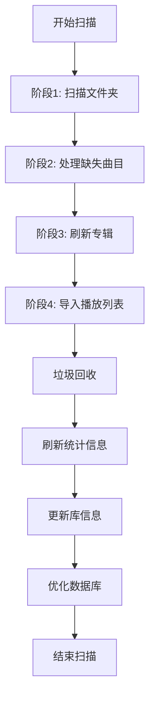
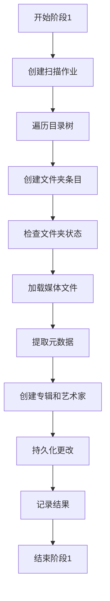
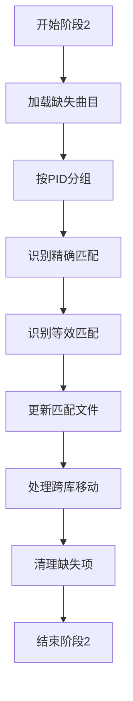
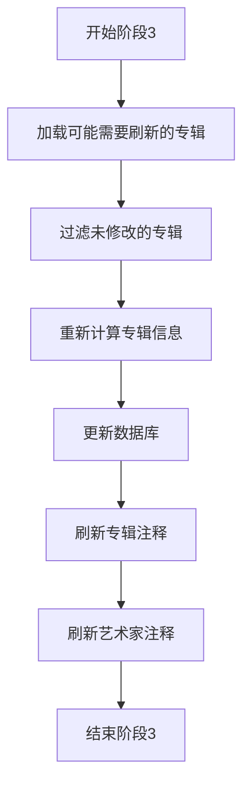
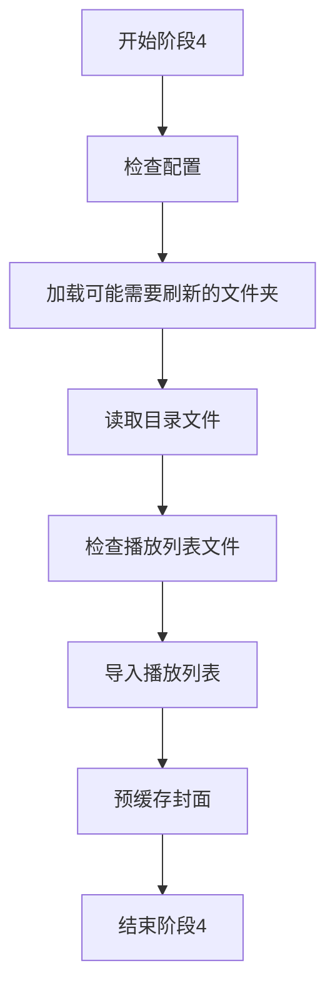
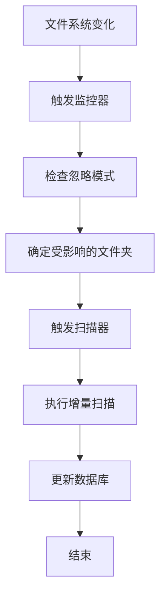
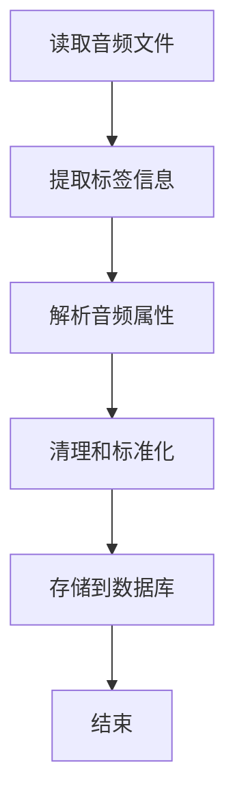
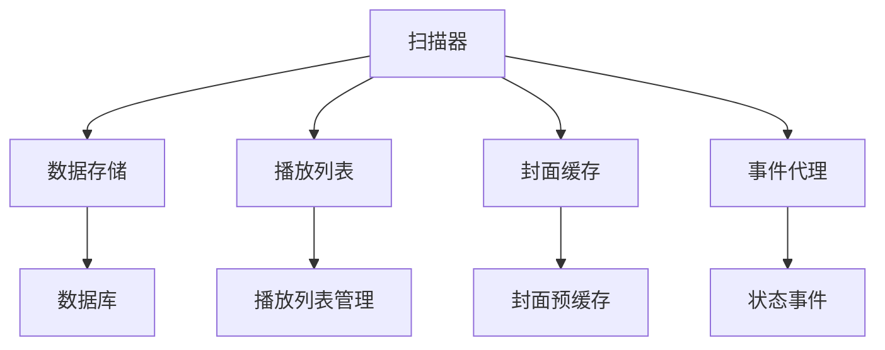

# 扫描器架构

<cite>
**本文档中引用的文件**   
- [scanner.go](file://scanner/scanner.go)
- [controller.go](file://scanner/controller.go)
- [phase_1_folders.go](file://scanner/phase_1_folders.go)
- [phase_2_missing_tracks.go](file://scanner/phase_2_missing_tracks.go)
- [phase_3_refresh_albums.go](file://scanner/phase_3_refresh_albums.go)
- [phase_4_playlists.go](file://scanner/phase_4_playlists.go)
- [folder_entry.go](file://scanner/folder_entry.go)
- [walk_dir_tree.go](file://scanner/walk_dir_tree.go)
- [external.go](file://scanner/external.go)
- [ignore_checker.go](file://scanner/ignore_checker.go)
- [taglib.go](file://adapters/taglib/taglib.go)
- [metadata.go](file://model/metadata/metadata.go)
- [watcher.go](file://scanner/watcher.go)
- [cmd/scan.go](file://cmd/scan.go)
</cite>

## 目录
1. [引言](#引言)
2. [扫描器工作流程](#扫描器工作流程)
3. [扫描阶段详解](#扫描阶段详解)
4. [增量更新与文件系统监控](#增量更新与文件系统监控)
5. [元数据提取过程](#元数据提取过程)
6. [扫描性能优化建议](#扫描性能优化建议)
7. [常见问题解决方案](#常见问题解决方案)
8. [核心服务交互](#核心服务交互)
9. [扫描配置与监控指南](#扫描配置与监控指南)
10. [结论](#结论)

## 引言
Navidrome扫描器是系统的核心组件，负责定期扫描音乐库以检测新增、修改或删除的音频文件。扫描器通过四个主要阶段处理音乐库：文件夹扫描、缺失曲目处理、专辑刷新和播放列表导入。扫描器设计为高效处理大型音乐库，支持增量更新和文件系统监控，确保音乐库的实时性和准确性。扫描器还与核心服务紧密交互，提供元数据提取、文件系统监控和性能优化等功能。

## 扫描器工作流程
Navidrome扫描器的工作流程由四个主要阶段组成，这些阶段按顺序执行以确保音乐库的完整性和一致性。扫描器首先扫描所有库和文件夹，导入新或更新的文件。然后，它处理缺失的文件，检查文件是否被移动或重命名。接下来，扫描器刷新所有新或更改的专辑，并更新艺术家信息。最后，扫描器导入或更新播放列表。整个过程由`scannerImpl`结构体管理，该结构体实现了`scanner`接口，允许在内部和外部扫描器实现之间切换。

**Diagram sources**
- [scanner.go](file://scanner/scanner.go#L56-L184)

**Section sources**
- [scanner.go](file://scanner/scanner.go#L23-L184)

## 扫描阶段详解

### 阶段1: 文件夹扫描
阶段1负责扫描所有库和文件夹，导入新或更新的文件。此阶段通过`phaseFolders`结构体实现，该结构体包含`producer`、`stages`和`finalize`方法。`producer`方法生成文件夹条目，`stages`方法定义处理阶段，`finalize`方法在阶段结束时执行清理操作。扫描器使用`walkDirTree`函数递归遍历目录树，为每个文件夹创建`folderEntry`对象。`folderEntry`对象包含文件夹的路径、修改时间、音频文件、图像文件等信息。

**Diagram sources**
- [phase_1_folders.go](file://scanner/phase_1_folders.go#L29-L507)

**Section sources**
- [phase_1_folders.go](file://scanner/phase_1_folders.go#L29-L507)

### 阶段2: 处理缺失曲目
阶段2负责处理缺失的媒体文件，检查文件是否被移动或重命名。此阶段通过`phaseMissingTracks`结构体实现，该结构体包含`producer`、`stages`和`finalize`方法。`producer`方法从数据库加载缺失的曲目，`stages`方法定义处理阶段，`finalize`方法在阶段结束时执行清理操作。扫描器首先加载所有库和缺失的媒体文件，然后按PID对缺失和匹配的文件进行分组。对于每个组，扫描器尝试找到精确或等效的匹配，如果找到匹配，则更新数据库中的文件位置。

**Diagram sources**
- [phase_2_missing_tracks.go](file://scanner/phase_2_missing_tracks.go#L43-L344)

**Section sources**
- [phase_2_missing_tracks.go](file://scanner/phase_2_missing_tracks.go#L43-L344)

### 阶段3: 刷新专辑
阶段3负责刷新所有新或更改的专辑，并更新艺术家信息。此阶段通过`phaseRefreshAlbums`结构体实现，该结构体包含`producer`、`stages`和`finalize`方法。`producer`方法从数据库加载可能需要刷新的专辑，`stages`方法定义处理阶段，`finalize`方法在阶段结束时执行清理操作。扫描器首先加载所有库和可能需要刷新的专辑，然后过滤掉未修改的专辑。对于每个需要刷新的专辑，扫描器从数据库加载所有媒体文件，重新计算专辑信息，并更新数据库。

**Diagram sources**
- [phase_3_refresh_albums.go](file://scanner/phase_3_refresh_albums.go#L35-L148)

**Section sources**
- [phase_3_refresh_albums.go](file://scanner/phase_3_refresh_albums.go#L35-L148)

### 阶段4: 播放列表
阶段4负责导入或更新播放列表。此阶段通过`phasePlaylists`结构体实现，该结构体包含`producer`、`stages`和`finalize`方法。`producer`方法从数据库加载可能需要刷新的文件夹，`stages`方法定义处理阶段，`finalize`方法在阶段结束时执行清理操作。扫描器首先检查`AutoImportPlaylists`配置是否启用，然后加载所有可能需要刷新的文件夹。对于每个文件夹，扫描器读取目录中的文件，检查是否为有效的播放列表文件，如果是，则导入播放列表。

**Diagram sources**
- [phase_4_playlists.go](file://scanner/phase_4_playlists.go#L29-L130)

**Section sources**
- [phase_4_playlists.go](file://scanner/phase_4_playlists.go#L29-L130)

## 增量更新与文件系统监控
Navidrome扫描器支持增量更新和文件系统监控，以提高扫描效率和实时性。增量更新通过比较文件夹的修改时间和哈希值来确定是否需要重新扫描。文件系统监控通过`watcher`结构体实现，该结构体使用`fsnotify`库监听文件系统事件。当检测到文件系统变化时，`watcher`会触发扫描器重新扫描受影响的文件夹。`ignore_checker`结构体用于管理`.ndignore`文件中的忽略模式，确保被忽略的文件和文件夹不会被扫描。

**Diagram sources**
- [watcher.go](file://scanner/watcher.go#L1-L100)
- [ignore_checker.go](file://scanner/ignore_checker.go#L1-L164)

**Section sources**
- [watcher.go](file://scanner/watcher.go#L1-L100)
- [ignore_checker.go](file://scanner/ignore_checker.go#L1-L164)

## 元数据提取过程
Navidrome扫描器使用`taglib`库从音频文件中提取元数据。`taglib`适配器通过`Read`函数读取音频文件的标签信息，包括标题、艺术家、专辑、评论、流派、年份、音轨号等。提取的元数据经过清理和标准化处理，然后存储在数据库中。`metadata`包提供了`Metadata`结构体，用于表示音频文件的元数据，包括文件信息、标签、音频属性和是否有图片等。

**Diagram sources**
- [taglib.go](file://adapters/taglib/taglib.go#L1-L179)
- [metadata.go](file://model/metadata/metadata.go#L1-L388)

**Section sources**
- [taglib.go](file://adapters/taglib/taglib.go#L1-L179)
- [metadata.go](file://model/metadata/metadata.go#L1-L388)

## 扫描性能优化建议
为了优化Navidrome扫描器的性能，建议采取以下措施：
1. **使用外部扫描器**：通过设置`DevExternalScanner`配置为`true`，可以使用外部进程执行扫描，避免内存泄漏。
2. **调整扫描线程数**：通过`DevScannerThreads`配置调整扫描线程数，以平衡CPU和I/O负载。
3. **启用文件系统监控**：通过`AutoImportPlaylists`配置启用文件系统监控，实时检测文件变化。
4. **合理设置忽略模式**：在`.ndignore`文件中合理设置忽略模式，避免扫描不必要的文件和文件夹。
5. **定期优化数据库**：通过`runOptimize`函数定期优化数据库，提高查询性能。

## 常见问题解决方案
1. **扫描器无法启动**：检查是否有其他扫描器正在运行，确保`running`原子变量为`false`。
2. **文件系统监控不工作**：检查`fsnotify`库是否正确安装，确保文件系统事件能够被正确捕获。
3. **元数据提取失败**：检查音频文件是否损坏，确保`taglib`库能够正确读取文件。
4. **扫描速度慢**：检查网络和磁盘I/O性能，调整扫描线程数和文件系统监控设置。
5. **数据库优化失败**：检查数据库连接是否正常，确保`db.Optimize`函数能够正确执行。

## 核心服务交互
Navidrome扫描器与核心服务紧密交互，提供元数据提取、文件系统监控和性能优化等功能。扫描器通过`model.DataStore`接口与数据库交互，通过`core.Playlists`接口管理播放列表，通过`artwork.CacheWarmer`接口预缓存封面。`controller`结构体作为扫描器的控制器，负责协调各个阶段的执行，并通过`events.Broker`发送扫描状态事件。

**Diagram sources**
- [controller.go](file://scanner/controller.go#L29-L38)
- [scanner.go](file://scanner/scanner.go#L23-L27)

**Section sources**
- [controller.go](file://scanner/controller.go#L29-L38)
- [scanner.go](file://scanner/scanner.go#L23-L27)

## 扫描配置与监控指南
系统管理员可以通过配置文件和命令行参数控制扫描器的行为。主要配置选项包括：
- `DevExternalScanner`：是否使用外部进程执行扫描。
- `DevScannerThreads`：扫描线程数。
- `AutoImportPlaylists`：是否自动导入播放列表。
- `Scanner.PurgeMissing`：是否清除缺失的项目。

管理员可以通过`ScanAll`和`ScanFolders`方法手动触发扫描，通过`Status`方法获取扫描状态。扫描器还支持通过`cmd/scan.go`命令行工具执行扫描，支持全量扫描和选择性扫描。

**Section sources**
- [controller.go](file://scanner/controller.go#L198-L249)
- [cmd/scan.go](file://cmd/scan.go#L21-L137)

## 结论
Navidrome扫描器是一个高效、可靠的音乐库管理工具，通过四个主要阶段处理音乐库的扫描和更新。扫描器支持增量更新和文件系统监控，确保音乐库的实时性和准确性。通过合理的配置和优化，扫描器可以高效处理大型音乐库，提供优质的用户体验。