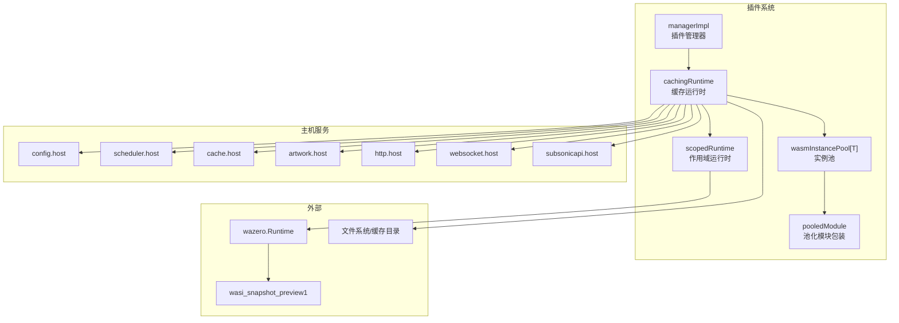
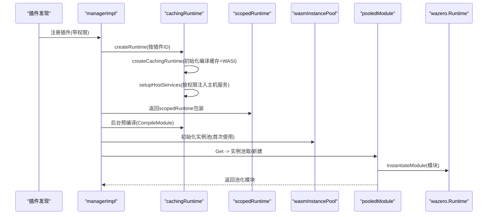
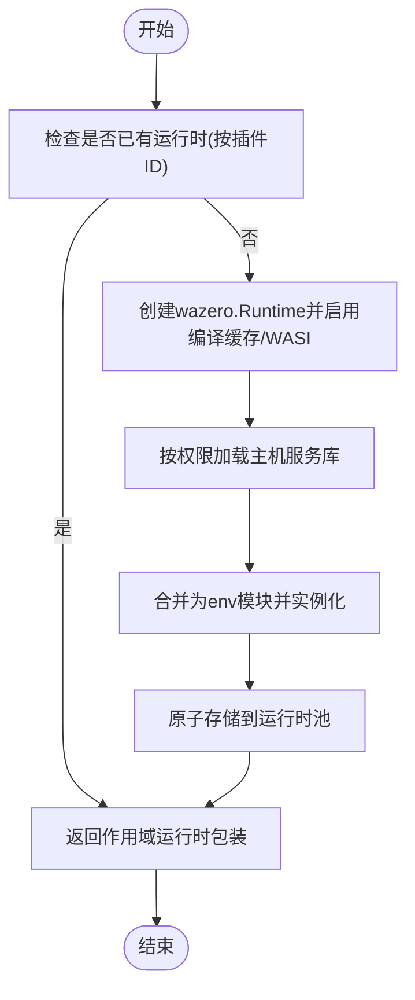
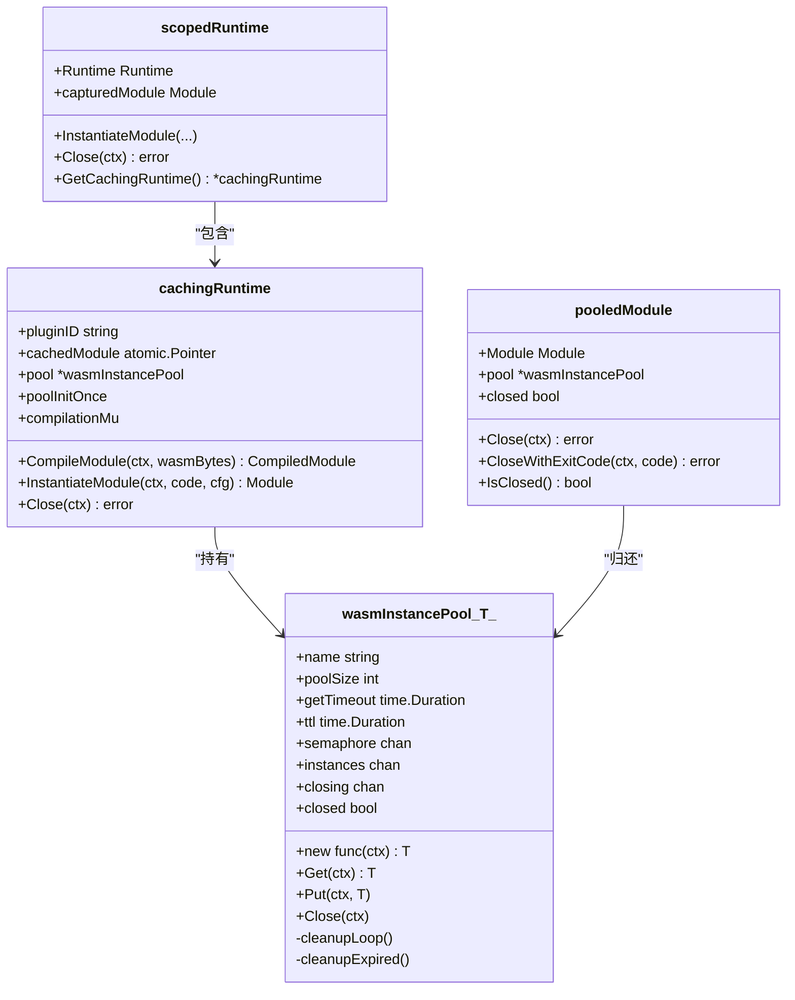
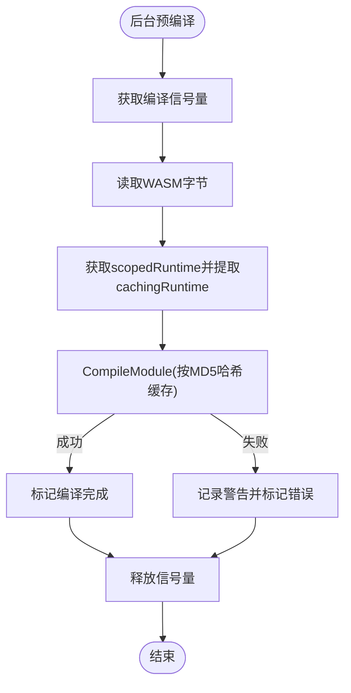
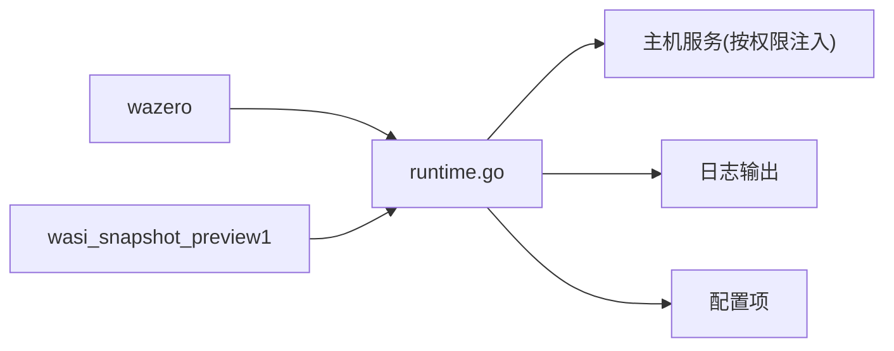

# WASM运行时

<cite>
**本文引用的文件**
- [runtime.go](file://plugins/runtime.go)
- [wasm_instance_pool.go](file://plugins/wasm_instance_pool.go)
- [manager.go](file://plugins/manager.go)
- [configuration.go](file://conf/configuration.go)
- [api_host.pb.go](file://plugins/api/api_host.pb.go)
- [base_capability.go](file://plugins/base_capability.go)
- [README.md](file://plugins/README.md)
- [plugin.go](file://plugins/examples/crypto-ticker/plugin.go)
- [wasm_instance_pool_test.go](file://plugins/wasm_instance_pool_test.go)
- [runtime_test.go](file://plugins/runtime_test.go)
</cite>

## 目录
1. [简介](#简介)
2. [项目结构](#项目结构)
3. [核心组件](#核心组件)
4. [架构总览](#架构总览)
5. [详细组件分析](#详细组件分析)
6. [依赖关系分析](#依赖关系分析)
7. [性能考量](#性能考量)
8. [故障排查指南](#故障排查指南)
9. [结论](#结论)
10. [附录](#附录)

## 简介
本文件面向Navidrome的WASM运行时实现，系统化阐述其设计动机与工程实践。选择WASM作为插件运行时的核心价值在于：
- 安全性：通过沙箱与权限模型（主机服务按需注入）限制插件能力边界，避免越权访问。
- 隔离性：每个插件拥有独立的wazero Runtime与模块实例，实例池化复用降低资源开销。
- 跨平台兼容性：WASI标准与wazero在多平台提供一致的运行环境，便于打包与部署。

本文将从架构、组件、数据流、处理逻辑、集成点、错误处理与性能优化等维度进行深入解析，并给出调试与排障建议。

## 项目结构
围绕WASM运行时的关键文件组织如下：
- 运行时与实例池：plugins/runtime.go、plugins/wasm_instance_pool.go
- 插件管理器：plugins/manager.go
- 配置项：conf/configuration.go
- 主机服务与API封装：plugins/api/api_host.pb.go
- 基础调用与指标：plugins/base_capability.go
- 示例插件：plugins/examples/crypto-ticker/plugin.go
- 测试与验证：plugins/wasm_instance_pool_test.go、plugins/runtime_test.go

图表来源
- [runtime.go](file://plugins/runtime.go#L72-L163)
- [runtime.go](file://plugins/runtime.go#L470-L579)
- [wasm_instance_pool.go](file://plugins/wasm_instance_pool.go#L1-L120)
- [api_host.pb.go](file://plugins/api/api_host.pb.go#L692-L720)

章节来源
- [runtime.go](file://plugins/runtime.go#L1-L120)
- [manager.go](file://plugins/manager.go#L120-L210)

## 核心组件
- 运行时工厂与权限注入：根据插件权限动态加载所需主机服务，组合为单一“env”模块注入到WASM中。
- 缓存运行时：对同一插件ID共享wazero.Runtime，内置编译模块缓存与实例池，支持并发安全与TTL清理。
- 实例池：基于通道与信号量的通用池化实现，支持最大并发、获取超时、TTL过期回收。
- 作用域运行时：捕获并仅关闭特定模块，避免误关全局运行时。
- 预编译与并发编译控制：后台预编译，使用信号量限制并发编译数量。
- 模块配置与超时：统一模块配置（含启动函数与stderr重定向），编译超时可由配置覆盖。

章节来源
- [runtime.go](file://plugins/runtime.go#L42-L163)
- [runtime.go](file://plugins/runtime.go#L242-L303)
- [wasm_instance_pool.go](file://plugins/wasm_instance_pool.go#L1-L120)
- [runtime.go](file://plugins/runtime.go#L470-L579)

## 架构总览
下图展示从插件发现到实例获取与调用的端到端流程，以及关键对象之间的交互。

图表来源
- [manager.go](file://plugins/manager.go#L142-L195)
- [runtime.go](file://plugins/runtime.go#L72-L163)
- [runtime.go](file://plugins/runtime.go#L544-L562)
- [wasm_instance_pool.go](file://plugins/wasm_instance_pool.go#L58-L96)

## 详细组件分析

### 组件A：运行时工厂与权限注入
- createRuntime：按插件ID缓存运行时，返回作用域运行时包装，确保每次调用获得独立模块捕获。
- createCachingRuntime：创建wazero.Runtime，启用编译缓存与WASI，再按权限注入主机服务。
- setupHostServices：按权限列表加载对应主机库，合并为“env”模块并实例化。
- 权限支持：config、scheduler、cache、artwork、http、websocket、subsonicapi，未授权的服务不注入。
- 组合策略：将多个主机库导出函数合并到一个“env”模块，减少模块数量，提升加载效率。

图表来源
- [runtime.go](file://plugins/runtime.go#L42-L118)
- [runtime.go](file://plugins/runtime.go#L118-L163)

章节来源
- [runtime.go](file://plugins/runtime.go#L42-L163)

### 组件B：缓存运行时与实例池
- cachingRuntime：封装wazero.Runtime，提供编译模块缓存（MD5哈希+TTL）、实例池初始化与生命周期管理。
- scopedRuntime：捕获模块句柄，Close仅关闭该模块，避免影响全局运行时。
- wasmInstancePool：通用池化实现，支持：
  - 最大池容量
  - 并发上限（信号量）
  - 获取超时
  - TTL定期清理
  - 关闭时清空所有实例
- pooledModule：包装wazero.Module，Close自动归还池并标记closed。

图表来源
- [runtime.go](file://plugins/runtime.go#L515-L579)
- [runtime.go](file://plugins/runtime.go#L470-L514)
- [wasm_instance_pool.go](file://plugins/wasm_instance_pool.go#L1-L120)
- [wasm_instance_pool.go](file://plugins/wasm_instance_pool.go#L140-L224)

章节来源
- [runtime.go](file://plugins/runtime.go#L470-L579)
- [wasm_instance_pool.go](file://plugins/wasm_instance_pool.go#L1-L120)

### 组件C：预编译与并发编译控制
- 预编译：后台goroutine读取插件WASM字节，调用cachingRuntime.CompileModule，命中缓存则直接返回，否则编译并写入缓存。
- 并发编译：全局信号量限制同时编译数，避免资源争用。
- 编译超时：优先使用配置项DevPluginCompilationTimeout，否则默认1分钟；加载阶段等待编译完成或超时。

图表来源
- [runtime.go](file://plugins/runtime.go#L266-L303)
- [manager.go](file://plugins/manager.go#L288-L299)

章节来源
- [runtime.go](file://plugins/runtime.go#L266-L303)
- [manager.go](file://plugins/manager.go#L288-L299)

### 组件D：模块配置与超时控制
- 模块配置：统一设置启动函数为“_initialize”，并将stderr重定向至日志输出，便于插件侧打印。
- 编译超时：优先使用配置项DevPluginCompilationTimeout，否则默认1分钟；加载前等待编译完成或超时。

章节来源
- [runtime.go](file://plugins/runtime.go#L253-L265)
- [runtime_test.go](file://plugins/runtime_test.go#L1-L34)

### 组件E：主机服务与API封装
- 主机服务：按权限注入，形成“env”模块，供插件调用。
- API封装：各能力（如LifecycleManagement、WebSocketCallback、SchedulerCallback）通过wazero.Runtime加载模块后，调用导出函数，支持内存分配/释放与参数序列化。

章节来源
- [runtime.go](file://plugins/runtime.go#L96-L163)
- [api_host.pb.go](file://plugins/api/api_host.pb.go#L692-L720)
- [api_host.pb.go](file://plugins/api/api_host.pb.go#L1150-L1244)

### 组件F：调用链与指标
- 调用链：统一通过基类方法封装，为每次调用生成唯一callID，记录耗时与结果，非未实现错误才上报指标。
- 指标：记录插件请求的成功/失败与耗时，便于监控与分析。

章节来源
- [base_capability.go](file://plugins/base_capability.go#L81-L112)

## 依赖关系分析
- 外部依赖
  - wazero：WASM运行时与编译缓存、模块实例化。
  - wasi_snapshot_preview1：WASI子集，提供文件系统、进程等基础能力。
- 内部依赖
  - 主机服务：config、scheduler、cache、artwork、http、websocket、subsonicapi。
  - 日志：统一使用log.Writer()重定向stderr，便于调试。
  - 配置：Plugins.CacheSize、DevPluginCompilationTimeout等。

图表来源
- [runtime.go](file://plugins/runtime.go#L242-L265)
- [runtime.go](file://plugins/runtime.go#L72-L94)

章节来源
- [runtime.go](file://plugins/runtime.go#L242-L265)

## 性能考量
- 预编译与编译缓存
  - 使用编译缓存目录[CacheFolder]/plugins，按大小清理旧模块，减少重复编译开销。
  - 预编译在后台执行，缩短首次加载时间。
- 实例池化
  - 默认池大小、最大并发、获取超时、TTL均设为合理值，避免过度占用内存与CPU。
  - 池满时自动关闭多余实例，防止资源泄漏。
- 并发编译控制
  - 限制同时编译数量，避免磁盘与CPU争用。
- 模块配置
  - 启动函数统一为“_initialize”，减少不必要的初始化成本。
- 配置项
  - Plugins.CacheSize：控制缓存目录上限。
  - DevPluginCompilationTimeout：编译超时阈值，避免长时间阻塞。

章节来源
- [runtime.go](file://plugins/runtime.go#L242-L303)
- [wasm_instance_pool.go](file://plugins/wasm_instance_pool.go#L1-L120)
- [configuration.go](file://conf/configuration.go#L634-L665)
- [README.md](file://plugins/README.md#L1680-L1690)

## 故障排查指南
- 编译失败/超时
  - 现象：加载插件时报错或超时。
  - 排查：检查DevPluginCompilationTimeout配置；查看日志中“Plugin compilation failed”或“Timed out waiting for plugin compilation”。
  - 处理：增大超时或修复插件构建；确认缓存目录可用且有足够空间。
- 权限不足
  - 现象：插件调用被拒绝或未生效。
  - 排查：核对manifest.json中的权限声明；确认主机服务已按权限注入。
- 实例池问题
  - 现象：获取实例超时或频繁创建新实例。
  - 排查：检查并发上限、获取超时、TTL设置；观察池满时自动关闭实例的日志。
- 资源泄漏
  - 现象：内存增长或句柄泄露。
  - 排查：确认模块Close路径正确（pooledModule.Close会归还池）；检查池关闭逻辑。
- 调试技巧
  - 开启更详细的日志级别，关注“Trace”与“Debug”信息。
  - 在插件侧使用标准库log输出，stderr会被重定向到日志。
  - 使用示例插件作为对照，逐步替换以定位问题。

章节来源
- [runtime.go](file://plugins/runtime.go#L253-L303)
- [wasm_instance_pool_test.go](file://plugins/wasm_instance_pool_test.go#L1-L194)
- [plugin.go](file://plugins/examples/crypto-ticker/plugin.go#L1-L60)

## 结论
Navidrome的WASM运行时通过“缓存运行时+实例池+权限注入”的组合，实现了高性能、可扩展且安全的插件执行环境。配合预编译、并发编译控制与TTL清理，有效平衡了启动延迟与资源占用。建议在生产环境中合理配置缓存大小与编译超时，并结合指标监控持续优化实例池参数。

## 附录

### A. 配置项一览
- Plugins.Enabled：启用插件系统
- Plugins.Folder：插件目录
- Plugins.CacheSize：插件编译缓存目录上限
- DevPluginCompilationTimeout：编译超时（秒）

章节来源
- [configuration.go](file://conf/configuration.go#L228-L232)
- [configuration.go](file://conf/configuration.go#L634-L665)

### B. 示例插件参考
- 示例插件展示了生命周期、WebSocket回调与调度器回调的典型用法，可作为开发模板。

章节来源
- [plugin.go](file://plugins/examples/crypto-ticker/plugin.go#L1-L60)