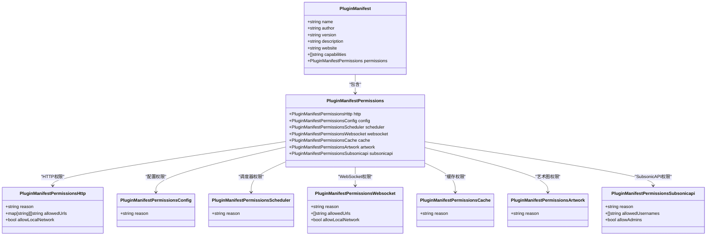
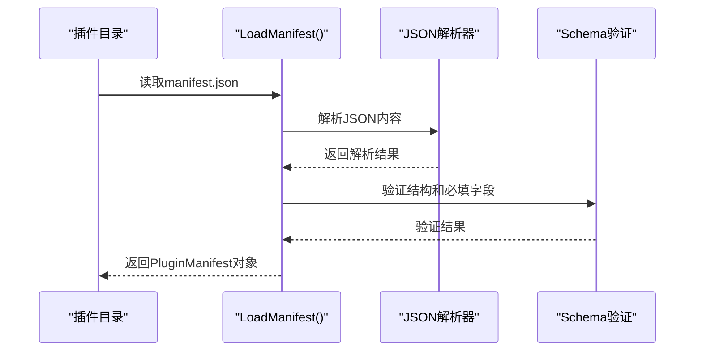
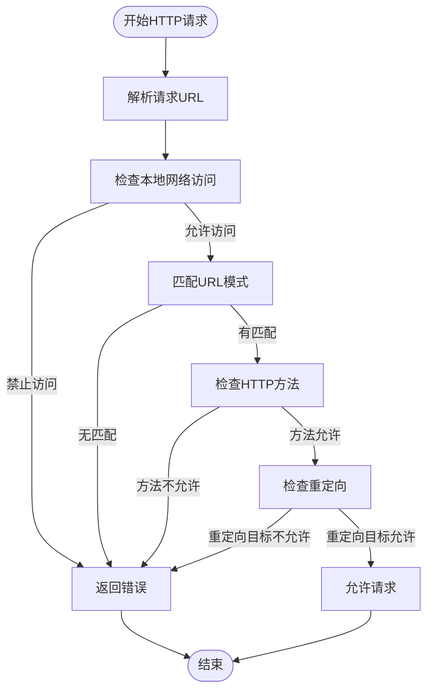
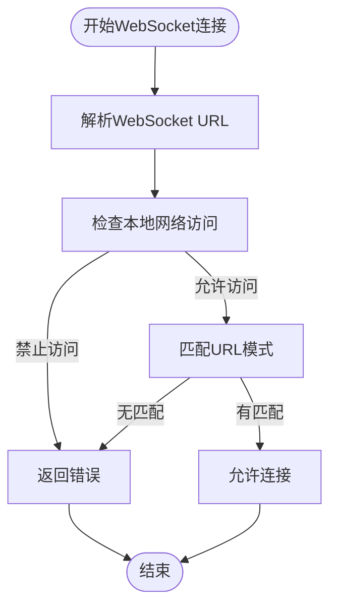
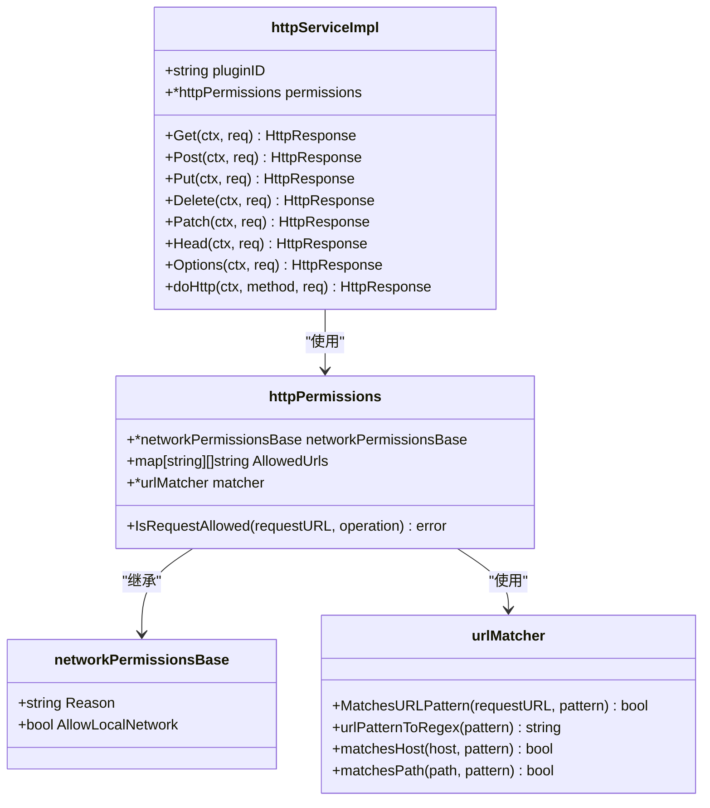
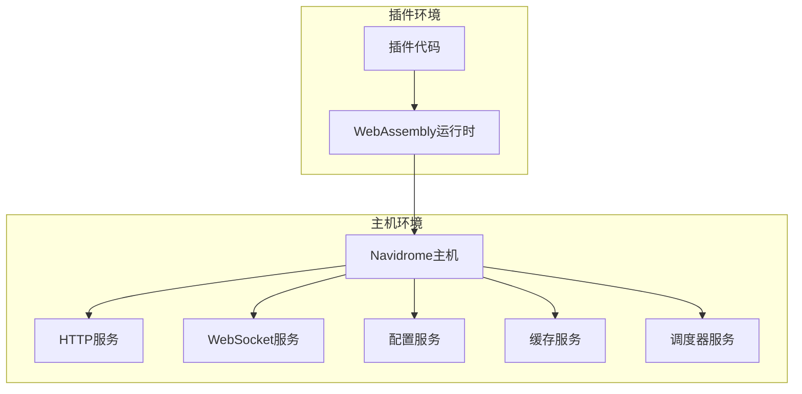
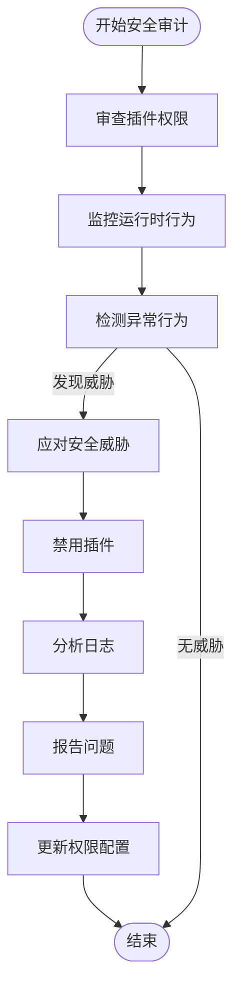

# 插件安全

<cite>
**本文档引用的文件**  
- [manifest.go](file://plugins/manifest.go)
- [host_http_permissions.go](file://plugins/host_http_permissions.go)
- [host_network_permissions_base.go](file://plugins/host_network_permissions_base.go)
- [host_websocket_permissions.go](file://plugins/host_websocket_permissions.go)
- [manifest.schema.json](file://plugins/schema/manifest.schema.json)
- [manager.go](file://plugins/manager.go)
- [runtime.go](file://plugins/runtime.go)
- [discovery.go](file://plugins/discovery.go)
- [host_http.go](file://plugins/host_http.go)
- [host_websocket.go](file://plugins/host_websocket.go)
- [crypto-ticker\manifest.json](file://plugins/examples/crypto-ticker/manifest.json)
- [discord-rich-presence\manifest.json](file://plugins/examples/discord-rich-presence/manifest.json)
- [unauthorized_plugin\manifest.json](file://plugins/testdata/unauthorized_plugin/manifest.json)
- [manifest_permissions_test.go](file://plugins/manifest_permissions_test.go)
- [host_http_permissions_test.go](file://plugins/host_http_permissions_test.go)
- [host_network_permissions_base_test.go](file://plugins/host_network_permissions_base_test.go)
- [host_websocket_permissions_test.go](file://plugins/host_websocket_permissions_test.go)
</cite>

## 目录
1. [引言](#引言)
2. [基于声明的权限控制系统](#基于声明的权限控制系统)
3. [权限验证流程](#权限验证流程)
4. [安全沙箱实现](#安全沙箱实现)
5. [最小权限原则应用示例](#最小权限原则应用示例)
6. [安全审计指南](#安全审计指南)

## 引言

Navidrome插件系统采用基于声明的权限控制机制，为插件提供安全的运行环境。该系统通过manifest.json文件中的权限声明，精确控制插件对网络、文件系统和其他敏感操作的访问权限。本文档详细阐述了权限控制系统的架构、实现方式和最佳实践，为开发者和系统管理员提供全面的安全指导。

**本文档引用的文件**
- [manifest.go](file://plugins/manifest.go#L1-L31)
- [manifest.schema.json](file://plugins/schema/manifest.schema.json#L1-L200)

## 基于声明的权限控制系统

Navidrome插件的权限控制系统基于声明式安全模型，通过manifest.json文件中的`permissions`字段定义插件所需的权限。该系统实现了细粒度的访问控制，确保插件只能访问其正常运行所必需的资源。

权限系统的核心组件包括：
- **权限声明**：在manifest.json中定义插件所需的权限
- **权限解析**：在插件加载时解析和验证权限声明
- **权限执行**：在运行时强制执行权限检查

权限声明必须包含`reason`字段，解释为何需要该权限，这有助于安全审计和用户理解。系统支持多种权限类型，包括HTTP访问、WebSocket连接、配置访问、缓存访问等。



**图源**
- [manifest.schema.json](file://plugins/schema/manifest.schema.json#L53-L182)

**本文档引用的文件**
- [manifest.schema.json](file://plugins/schema/manifest.schema.json#L1-L200)
- [manifest.go](file://plugins/manifest.go#L1-L31)

## 权限验证流程

权限验证流程从manifest.json文件的解析开始，贯穿插件的整个生命周期，确保权限控制在各个阶段都得到有效执行。

### manifest.json解析

权限验证的第一步是解析manifest.json文件。`LoadManifest`函数负责读取和解析manifest文件，将其转换为结构化的`PluginManifest`对象。该过程包括JSON反序列化和基本验证。



**图源**
- [manifest.go](file://plugins/manifest.go#L15-L30)

### 运行时权限检查

运行时权限检查是权限验证流程的核心，确保插件在执行敏感操作时遵守其声明的权限。

#### HTTP请求权限检查

当插件发起HTTP请求时，系统会执行严格的权限检查。`httpPermissions.IsRequestAllowed`方法负责验证请求是否符合权限声明。



**图源**
- [host_http_permissions.go](file://plugins/host_http_permissions.go#L47-L90)
- [host_http.go](file://plugins/host_http.go#L50-L78)

#### WebSocket连接权限检查

WebSocket连接的权限检查流程与HTTP类似，但针对WebSocket协议的特点进行了优化。`webSocketPermissions.IsConnectionAllowed`方法负责验证WebSocket连接请求。



**图源**
- [host_websocket_permissions.go](file://plugins/host_websocket_permissions.go#L31-L59)
- [host_websocket.go](file://plugins/host_websocket.go#L118-L129)

**本文档引用的文件**
- [manifest.go](file://plugins/manifest.go#L15-L30)
- [host_http_permissions.go](file://plugins/host_http_permissions.go#L47-L90)
- [host_websocket_permissions.go](file://plugins/host_websocket_permissions.go#L31-L59)
- [host_http.go](file://plugins/host_http.go#L50-L78)
- [host_websocket.go](file://plugins/host_websocket.go#L118-L129)

## 安全沙箱实现

Navidrome插件系统通过安全沙箱机制，为插件提供隔离的运行环境，防止恶意插件对系统造成损害。

### 网络请求拦截

网络请求拦截是安全沙箱的核心功能之一。系统通过`httpServiceImpl.doHttp`方法拦截所有插件发起的HTTP请求，并在执行前进行权限检查。



**图源**
- [host_http.go](file://plugins/host_http.go#L15-L18)
- [host_http_permissions.go](file://plugins/host_http_permissions.go#L14-L18)

### 文件系统隔离

文件系统隔离通过限制插件对文件系统的访问来实现。系统不直接提供文件系统访问权限，而是通过特定的主机服务（如缓存服务）间接提供有限的文件操作能力。

### 系统调用限制

系统调用限制通过WebAssembly（WASM）运行时环境实现。WASM提供了一个沙箱化的执行环境，天然限制了插件对底层系统调用的直接访问。



**图源**
- [runtime.go](file://plugins/runtime.go#L42-L163)
- [manager.go](file://plugins/manager.go#L97-L144)

**本文档引用的文件**
- [host_http.go](file://plugins/host_http.go#L15-L18)
- [host_http_permissions.go](file://plugins/host_http_permissions.go#L14-L18)
- [runtime.go](file://plugins/runtime.go#L42-L163)
- [manager.go](file://plugins/manager.go#L97-L144)

## 最小权限原则应用示例

最小权限原则要求插件只被授予完成其功能所必需的最小权限集。以下是几个应用示例：

### 加密货币行情插件

加密货币行情插件只需要连接到特定的WebSocket API，因此其权限声明非常有限：

```json
{
  "name": "crypto-ticker",
  "author": "Navidrome Plugin",
  "version": "1.0.0",
  "description": "A plugin that tracks crypto currency prices using Coinbase WebSocket API",
  "website": "https://github.com/navidrome/navidrome/tree/master/plugins/examples/crypto-ticker",
  "capabilities": [
    "WebSocketCallback",
    "LifecycleManagement",
    "SchedulerCallback"
  ],
  "permissions": {
    "config": {
      "reason": "To read API configuration and WebSocket endpoint settings"
    },
    "scheduler": {
      "reason": "To schedule periodic reconnection attempts and status updates"
    },
    "websocket": {
      "reason": "To connect to Coinbase WebSocket API for real-time cryptocurrency prices",
      "allowedUrls": ["wss://ws-feed.exchange.coinbase.com"],
      "allowLocalNetwork": false
    }
  }
}
```

该插件的权限配置体现了最小权限原则：
- 只允许连接到Coinbase的WebSocket API
- 禁止访问本地网络
- 只请求必要的主机服务（配置、调度器、WebSocket）

### Discord富状态插件

Discord富状态插件需要与Discord API通信，其权限声明如下：

```json
{
  "$schema": "https://raw.githubusercontent.com/navidrome/navidrome/refs/heads/master/plugins/schema/manifest.schema.json",
  "name": "discord-rich-presence",
  "author": "Navidrome Team",
  "version": "1.0.0",
  "description": "Discord Rich Presence integration for Navidrome",
  "website": "https://github.com/navidrome/navidrome/tree/master/plugins/examples/discord-rich-presence",
  "capabilities": ["Scrobbler", "SchedulerCallback", "WebSocketCallback"],
  "permissions": {
    "http": {
      "reason": "To communicate with Discord API for gateway discovery and image uploads",
      "allowedUrls": {
        "https://discord.com/api/*": ["GET", "POST"]
      },
      "allowLocalNetwork": false
    },
    "websocket": {
      "reason": "To maintain real-time connection with Discord gateway",
      "allowedUrls": ["wss://gateway.discord.gg"],
      "allowLocalNetwork": false
    },
    "config": {
      "reason": "To access plugin configuration (client ID and user tokens)"
    },
    "cache": {
      "reason": "To store connection state and sequence numbers"
    },
    "scheduler": {
      "reason": "To schedule heartbeat messages and activity clearing"
    },
    "artwork": {
      "reason": "To get track artwork URLs for rich presence display"
    }
  }
}
```

该插件的权限配置同样遵循最小权限原则：
- HTTP请求仅限于Discord API域名
- WebSocket连接仅限于Discord网关
- 明确指定了允许的HTTP方法（GET和POST）
- 禁止访问本地网络

**本文档引用的文件**
- [crypto-ticker\manifest.json](file://plugins/examples/crypto-ticker/manifest.json#L1-L26)
- [discord-rich-presence\manifest.json](file://plugins/examples/discord-rich-presence/manifest.json#L1-L36)

## 安全审计指南

### 审查插件权限

系统管理员在安装插件前应仔细审查其权限声明，重点关注以下方面：

1. **权限范围**：检查插件请求的权限是否与其功能相符
2. **URL模式**：验证`allowedUrls`中的URL模式是否合理且不过于宽泛
3. **本地网络访问**：除非必要，否则应禁止插件访问本地网络
4. **权限理由**：审查`reason`字段是否提供了充分的解释

### 监控异常行为

系统应监控插件的运行时行为，检测潜在的安全威胁：

1. **网络活动监控**：记录插件的网络请求，检测未经授权的访问尝试
2. **资源使用监控**：监控插件的CPU和内存使用情况，防止资源耗尽攻击
3. **错误日志分析**：分析权限拒绝日志，识别潜在的恶意行为

### 应对潜在安全威胁

当发现潜在安全威胁时，应采取以下措施：

1. **立即禁用插件**：通过配置禁用可疑插件
2. **审查日志**：分析相关日志，确定威胁的范围和影响
3. **报告问题**：向插件开发者或社区报告安全问题
4. **更新权限**：根据需要调整插件的权限配置



**图源**
- [host_http.go](file://plugins/host_http.go#L50-L78)
- [host_websocket.go](file://plugins/host_websocket.go#L118-L129)
- [manager.go](file://plugins/manager.go#L332-L368)

**本文档引用的文件**
- [host_http.go](file://plugins/host_http.go#L50-L78)
- [host_websocket.go](file://plugins/host_websocket.go#L118-L129)
- [manager.go](file://plugins/manager.go#L332-L368)