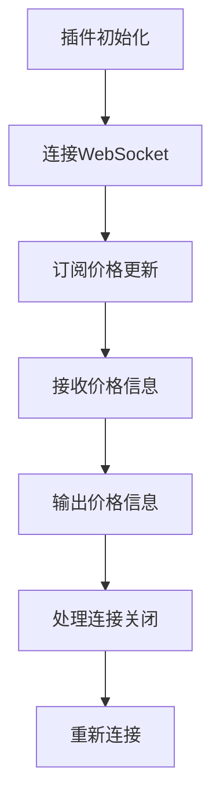

# 插件开发

<cite>
**本文档中引用的文件**
- [plugins/README.md](file://plugins/README.md)
- [plugins/manifest.go](file://plugins/manifest.go)
- [plugins/discovery.go](file://plugins/discovery.go)
- [plugins/manager.go](file://plugins/manager.go)
- [plugins/examples/README.md](file://plugins/examples/README.md)
- [plugins/examples/crypto-ticker/plugin.go](file://plugins/examples/crypto-ticker/plugin.go)
- [plugins/examples/discord-rich-presence/plugin.go](file://plugins/examples/discord-rich-presence/plugin.go)
- [plugins/examples/subsonicapi-demo/plugin.go](file://plugins/examples/subsonicapi-demo/plugin.go)
- [plugins/host_http.go](file://plugins/host_http.go)
- [plugins/host_scheduler.go](file://plugins/host_scheduler.go)
- [plugins/host_http_permissions.go](file://plugins/host_http_permissions.go)
- [plugins/host_websocket.go](file://plugins/host_websocket.go)
- [plugins/host_config.go](file://plugins/host_config.go)
- [plugins/host_cache.go](file://plugins/host_cache.go)
- [plugins/host_artwork.go](file://plugins/host_artwork.go)
- [plugins/schema/manifest.schema.json](file://plugins/schema/manifest.schema.json)
</cite>

## 目录
1. [简介](#简介)
2. [插件架构概述](#插件架构概述)
3. [manifest.json文件详解](#manifestjson文件详解)
4. [插件主文件实现](#插件主文件实现)
5. [WASM插件开发实例](#wasm插件开发实例)
6. [Host API接口使用](#host-api接口使用)
7. [插件开发完整流程](#插件开发完整流程)
8. [最佳实践与故障排除](#最佳实践与故障排除)

## 简介

Navidrome的插件系统是一个基于WebAssembly（WASM）的扩展机制，允许开发者在不修改核心代码库的情况下扩展Navidrome的功能。插件系统支持多种能力，包括元数据代理、播放记录、定时任务、WebSocket通信和生命周期管理等。

**Section sources**
- [plugins/README.md](file://plugins/README.md#L1-L800)

## 插件架构概述

Navidrome插件系统由几个关键组件构成：插件管理器、插件协议、插件适配器和主机服务。插件管理器负责扫描、加载和编译插件，并通过能力特定的接口提供对已加载插件的访问。插件通过Protocol Buffers（protobuf）与Navidrome进行通信，这种协议定义了插件可以实现的能力和消息。

插件适配器在插件API和Navidrome的内部接口之间起到桥梁作用，例如`wasmMediaAgent`将`MetadataAgent`适配到内部的`agents.Interface`。主机服务为插件提供了访问HTTP请求、调度、配置等功能的途径，这些服务在`plugins/host/`目录下定义并实现。

**Section sources**
- [plugins/README.md](file://plugins/README.md#L13-L52)

## manifest.json文件详解

`manifest.json`文件是每个Navidrome插件的核心配置文件，它定义了插件的基本信息和权限。该文件必须包含`name`、`version`、`description`、`main`和`permissions`等字段。

- `name`：插件的名称，用于标识插件。
- `version`：插件的版本号，遵循语义化版本控制。
- `description`：插件的描述，简要说明插件的功能。
- `main`：主文件的路径，通常是`plugin.go`。
- `permissions`：插件所需的权限，包括`http`、`websocket`、`cache`、`config`、`scheduler`、`artwork`和`subsonicapi`等。

权限系统遵循安全默认原则，插件默认没有访问任何主机服务的权限，除非在`permissions`中明确声明。例如，`http`权限需要指定`allowedUrls`来限制插件可以访问的URL模式。

**Section sources**
- [plugins/README.md](file://plugins/README.md#L405-L687)
- [plugins/schema/manifest.schema.json](file://plugins/schema/manifest.schema.json)

## 插件主文件实现

插件主文件（如`plugin.go`）是插件的入口点，负责初始化插件、处理事件和注册API端点。插件主文件通常包含一个或多个接口的实现，如`LifecycleManagement`、`WebSocketCallback`和`SchedulerCallback`。

初始化函数`OnInit`在插件加载时被调用，用于执行必要的设置和配置。事件处理器如`OnTextMessage`和`OnError`用于处理来自WebSocket的事件。API端点注册通过调用`api.RegisterWebSocketCallback`、`api.RegisterLifecycleManagement`和`api.RegisterSchedulerCallback`等函数完成。

**Section sources**
- [plugins/examples/crypto-ticker/plugin.go](file://plugins/examples/crypto-ticker/plugin.go#L1-L305)
- [plugins/examples/discord-rich-presence/plugin.go](file://plugins/examples/discord-rich-presence/plugin.go#L1-L187)

## WASM插件开发实例

WASM插件开发实例展示了如何实现HTTP服务、WebSocket通信和定时任务。以`crypto-ticker`插件为例，该插件连接到Coinbase的WebSocket API，订阅加密货币价格更新，并通过日志输出价格信息。

**Diagram sources**
- [plugins/examples/crypto-ticker/plugin.go](file://plugins/examples/crypto-ticker/plugin.go#L1-L305)

## Host API接口使用

插件与核心系统的交互通过Host API实现，包括Artwork、Cache、Config、HTTP、Scheduler和SubsonicAPI等服务。这些服务为插件提供了访问Navidrome功能的途径。

- **ArtworkService**：生成艺术品的公共URL。
- **CacheService**：提供基于TTL的缓存，每个插件有独立的缓存实例。
- **ConfigService**：访问插件特定的配置值。
- **HttpService**：执行HTTP请求（GET、POST、PUT、DELETE等）。
- **SchedulerService**：调度一次性或重复性任务。
- **SubsonicAPIService**：访问Navidrome的Subsonic API端点。

**Section sources**
- [plugins/README.md](file://plugins/README.md#L53-L404)

## 插件开发完整流程

从零开始创建插件的完整流程包括项目结构搭建、依赖管理、构建和测试。首先，创建插件目录并编写`manifest.json`文件。然后，编写插件主文件，实现所需的接口。接下来，使用Go工具链构建插件，并将其部署到Navidrome的插件目录中。最后，通过Navidrome的管理界面或命令行工具测试插件。

**Section sources**
- [plugins/examples/README.md](file://plugins/examples/README.md#L1-L32)

## 最佳实践与故障排除

插件开发的最佳实践包括请求最小权限、编写清晰的权限理由和优雅地处理缺失权限。例如，避免请求不必要的权限，如`"https://*": ["*"]`，这会降低插件的安全性。

常见的故障排除问题包括“function not exported in module env”错误，这通常是因为插件尝试调用没有适当权限的服务。解决方法是检查`manifest.json`文件中的权限声明，并确保所有必需的字段都已正确配置。

**Section sources**
- [plugins/README.md](file://plugins/README.md#L749-L777)