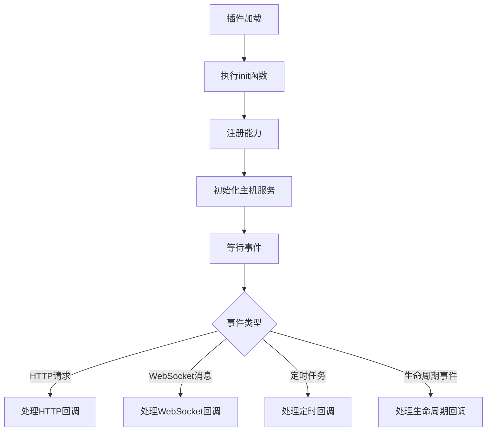
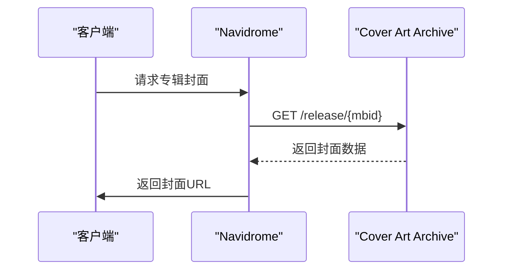
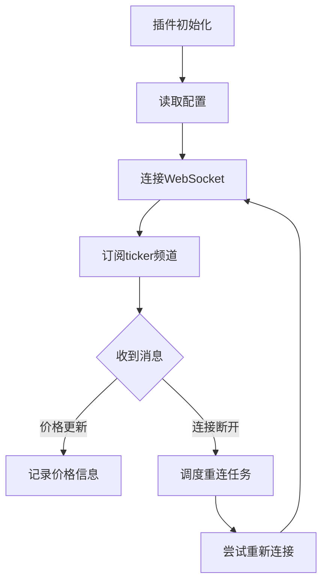
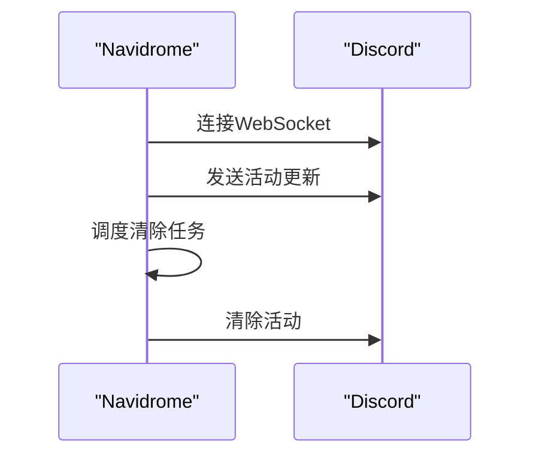
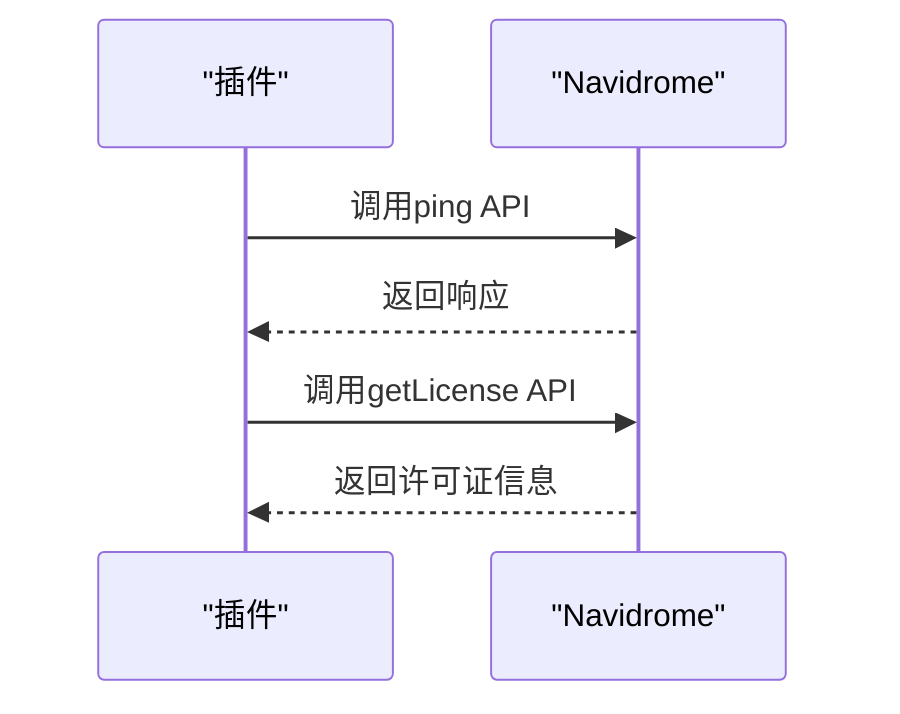
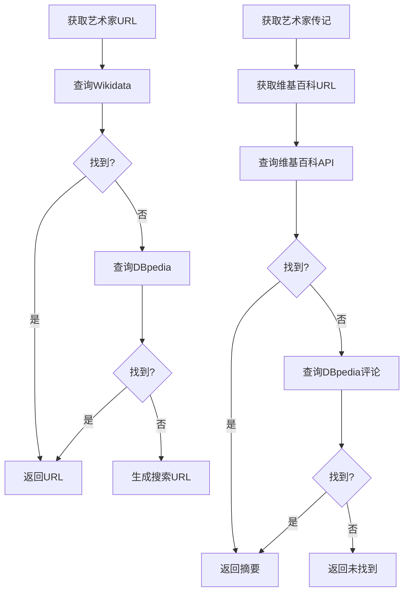

# 插件示例

<cite>
**本文档中引用的文件**  
- [coverartarchive/plugin.go](file://plugins/examples/coverartarchive/plugin.go)
- [coverartarchive/manifest.json](file://plugins/examples/coverartarchive/manifest.json)
- [crypto-ticker/plugin.go](file://plugins/examples/crypto-ticker/plugin.go)
- [crypto-ticker/manifest.json](file://plugins/examples/crypto-ticker/manifest.json)
- [discord-rich-presence/plugin.go](file://plugins/examples/discord-rich-presence/plugin.go)
- [discord-rich-presence/manifest.json](file://plugins/examples/discord-rich-presence/manifest.json)
- [subsonicapi-demo/plugin.go](file://plugins/examples/subsonicapi-demo/plugin.go)
- [subsonicapi-demo/manifest.json](file://plugins/examples/subsonicapi-demo/manifest.json)
- [wikimedia/plugin.go](file://plugins/examples/wikimedia/plugin.go)
- [wikimedia/manifest.json](file://plugins/examples/wikimedia/manifest.json)
- [plugins/examples/README.md](file://plugins/examples/README.md)
- [plugins/api/api.pb.go](file://plugins/api/api.pb.go)
- [plugins/host/http/http.pb.go](file://plugins/host/http/http.pb.go)
- [plugins/host/websocket/websocket.pb.go](file://plugins/host/websocket/websocket.pb.go)
- [core/agents/agents.go](file://core/agents/agents.go)
</cite>

## 目录
1. [引言](#引言)
2. [插件架构概述](#插件架构概述)
3. [示例插件详细分析](#示例插件详细分析)
   1. [coverartarchive插件](#coverartarchive插件)
   2. [crypto-ticker插件](#crypto-ticker插件)
   3. [discord-rich-presence插件](#discord-rich-presence插件)
   4. [subsonicapi-demo插件](#subsonicapi-demo插件)
   5. [wikimedia插件](#wikimedia插件)
4. [部署和使用步骤](#部署和使用步骤)
5. [开发者最佳实践](#开发者最佳实践)
6. [结论](#结论)

## 引言

Navidrome是一个开源的音乐服务器，支持通过插件系统扩展其功能。本文档详细分析了Navidrome官方提供的五个插件示例，包括coverartarchive、crypto-ticker、discord-rich-presence、subsonicapi-demo和wikimedia插件。这些示例展示了如何通过不同的插件能力（capabilities）和主机服务（host services）来扩展Navidrome的功能，包括扩展艺术图来源、创建动态数据源、集成外部服务、扩展API功能以及集成维基媒体内容。

每个插件都实现了特定的功能，并通过WASM（WebAssembly）技术在Navidrome中运行。插件通过定义在`manifest.json`文件中的能力声明其功能，并通过`plugin.go`文件中的Go代码实现具体逻辑。本文档将逐个解析每个示例插件的实现细节，解释其架构设计、关键代码片段和集成模式，并为开发者提供从这些示例中学习和借鉴的最佳实践。

**本节不分析具体源文件，因此不提供来源**

## 插件架构概述

Navidrome的插件系统基于WASM技术，允许开发者使用Go语言编写插件，并将其编译为WASM模块在Navidrome中运行。插件系统的核心是能力（capabilities）和主机服务（host services）的交互模式。

### 能力（Capabilities）

插件通过在`manifest.json`文件中声明`capabilities`来定义其功能。每个能力对应一个特定的接口，插件需要实现该接口来提供功能。主要的能力包括：

- **MetadataAgent**: 用于扩展元数据代理，可以获取艺术家信息、专辑信息、艺术图等。
- **WebSocketCallback**: 用于处理WebSocket连接的回调，包括文本消息、二进制消息、错误和关闭事件。
- **LifecycleManagement**: 用于管理插件生命周期，在插件初始化时执行特定逻辑。
- **SchedulerCallback**: 用于处理定时任务的回调。
- **Scrobbler**: 用于实现播放记录功能，可以报告当前播放的曲目和播放记录。
- **SubsonicAPI**: 用于与Navidrome的Subsonic API进行交互。

### 主机服务（Host Services）

主机服务是Navidrome提供给插件的API，允许插件与外部系统进行交互。主要的主机服务包括：

- **http**: 提供HTTP客户端功能，允许插件向外部API发送HTTP请求。
- **websocket**: 提供WebSocket客户端功能，允许插件建立WebSocket连接并收发消息。
- **config**: 提供配置管理功能，允许插件读取和写入配置。
- **scheduler**: 提供定时任务功能，允许插件调度一次性或周期性任务。
- **cache**: 提供缓存功能，允许插件存储和检索数据。
- **artwork**: 提供艺术图管理功能，允许插件获取艺术图URL。
- **subsonicapi**: 提供Subsonic API访问功能，允许插件调用Navidrome的Subsonic API。

### 插件生命周期

插件的生命周期由`init()`函数和`main()`函数控制。`init()`函数在插件加载时执行，用于注册插件能力并初始化日志等。`main()`函数是程序入口，但在WASM插件中通常为空。

**本节不直接可视化具体源文件，因此不提供来源**

## 示例插件详细分析

### coverartarchive插件

coverartarchive插件扩展了艺术图来源，从Cover Art Archive获取专辑封面。该插件实现了`MetadataAgent`能力，通过HTTP服务从Cover Art Archive API获取专辑封面。

插件的核心是`CoverArtArchiveAgent`结构体，实现了`GetAlbumImages`方法。当请求专辑封面时，插件会根据专辑的MusicBrainz ID（MBID）构造API URL，发送HTTP GET请求，并解析响应中的封面图片信息。

**插件来源**
- [coverartarchive/plugin.go](file://plugins/examples/coverartarchive/plugin.go#L15-L151)
- [coverartarchive/manifest.json](file://plugins/examples/coverartarchive/manifest.json#L1-L20)

### crypto-ticker插件

crypto-ticker插件创建了一个动态数据源，通过WebSocket连接到Coinbase API获取实时加密货币价格。该插件实现了`WebSocketCallback`、`LifecycleManagement`和`SchedulerCallback`三种能力。

插件在初始化时（`OnInit`方法）读取配置中的加密货币符号，连接到Coinbase WebSocket API并订阅ticker频道。当收到价格更新时，`OnTextMessage`方法会解析消息并记录价格信息。如果连接断开，`OnClose`方法会调度一个定时任务，每2秒尝试重新连接。

**插件来源**
- [crypto-ticker/plugin.go](file://plugins/examples/crypto-ticker/plugin.go#L44-L304)
- [crypto-ticker/manifest.json](file://plugins/examples/crypto-ticker/manifest.json#L1-L26)

### discord-rich-presence插件

discord-rich-presence插件集成了外部服务Discord，通过Discord Rich Presence显示当前播放的曲目。该插件实现了`Scrobbler`和`SchedulerCallback`能力，并使用了`websocket`、`http`、`config`、`cache`和`artwork`等多种主机服务。

插件的核心是`DiscordRPPlugin`结构体，实现了`NowPlaying`方法。当用户开始播放曲目时，该方法会连接到Discord WebSocket网关，发送活动更新消息，并调度一个定时任务在曲目播放结束后清除活动。插件还使用`artwork`服务获取曲目的艺术图URL。

**插件来源**
- [discord-rich-presence/plugin.go](file://plugins/examples/discord-rich-presence/plugin.go#L19-L186)
- [discord-rich-presence/manifest.json](file://plugins/examples/discord-rich-presence/manifest.json#L1-L36)

### subsonicapi-demo插件

subsonicapi-demo插件演示了如何扩展API功能，通过Subsonic API主机服务与Navidrome自身进行交互。该插件实现了`LifecycleManagement`能力，在插件初始化时调用Subsonic API的ping和getLicense端点。

插件使用`subsonicapi.NewSubsonicAPIService()`创建API服务实例，并通过`Call`方法发送请求。这展示了插件如何作为客户端与Navidrome的Subsonic API进行交互，为开发更复杂的API扩展功能提供了基础。

**插件来源**
- [subsonicapi-demo/plugin.go](file://plugins/examples/subsonicapi-demo/plugin.go#L17-L68)
- [subsonicapi-demo/manifest.json](file://plugins/examples/subsonicapi-demo/manifest.json#L1-L17)

### wikimedia插件

wikimedia插件集成了维基媒体内容，从Wikidata、DBpedia和Wikipedia获取艺术家信息。该插件实现了`MetadataAgent`能力，通过HTTP服务与多个维基媒体API进行交互。

插件采用分层查询策略：首先尝试通过MusicBrainz ID从Wikidata获取维基百科URL，如果失败则通过艺术家名称从DBpedia获取，最后作为备选方案生成维基百科搜索URL。对于艺术家传记，插件会尝试从维基百科API获取摘要，如果失败则从DBpedia获取评论。

**插件来源**
- [wikimedia/plugin.go](file://plugins/examples/wikimedia/plugin.go#L234-L391)
- [wikimedia/manifest.json](file://plugins/examples/wikimedia/manifest.json#L1-L21)

## 部署和使用步骤

要部署和使用这些示例插件，需要遵循以下步骤：

1. **构建插件**：在`plugins/examples`目录下运行`make`命令，或针对特定插件运行`make <plugin-name>`。这将使用Go WASM构建模式编译插件为`.wasm`文件。

2. **配置Navidrome**：在Navidrome的配置文件中，将插件添加到`Agents`配置项中。例如，要启用coverartarchive插件，需要在配置中添加`coverartarchive`到`Agents`列表。

3. **放置插件文件**：将生成的`.wasm`文件放置在Navidrome的插件目录中（通常是`plugins/`目录）。

4. **启动Navidrome**：启动Navidrome服务，插件将在启动时自动加载和初始化。

5. **验证插件功能**：通过Navidrome的Web界面或API验证插件功能是否正常工作。例如，对于coverartarchive插件，检查专辑封面是否从Cover Art Archive加载。

对于需要配置的插件（如crypto-ticker和discord-rich-presence），还需要在Navidrome的配置界面中提供必要的配置信息，如加密货币符号或Discord客户端ID和用户令牌。

**本节不分析具体源文件，因此不提供来源**

## 开发者最佳实践

从这些示例插件中，开发者可以学习和借鉴以下最佳实践：

### 代码组织

- **单一职责**：每个插件专注于一个特定功能，如coverartarchive插件只负责艺术图获取，crypto-ticker插件只负责加密货币价格跟踪。
- **清晰的结构**：使用结构体组织相关服务和状态，如discord-rich-presence插件中的`DiscordRPPlugin`结构体。
- **模块化设计**：将复杂逻辑分解为小的、可重用的函数，如wikimedia插件中的`sparqlQuery`和`mediawikiQuery`辅助函数。

### 错误处理

- **优雅降级**：当主要数据源不可用时，提供备选方案，如wikimedia插件在Wikidata查询失败后尝试DBpedia。
- **详细日志**：使用有意义的日志信息帮助调试，如crypto-ticker插件在连接失败时记录详细的错误信息。
- **错误传播**：正确处理和传播错误，使用`fmt.Errorf`包装错误以提供上下文。

### 用户体验设计

- **配置灵活性**：通过配置文件提供可配置的选项，如crypto-ticker插件允许用户配置要跟踪的加密货币。
- **性能考虑**：设置合理的超时和重试机制，如所有插件都设置了HTTP请求超时。
- **资源管理**：正确管理连接和定时任务，如crypto-ticker插件在成功重新连接后取消重连调度。

### 安全性

- **最小权限原则**：在`manifest.json`中只声明必要的权限，如coverartarchive插件只允许访问特定的API端点。
- **输入验证**：验证配置和输入参数，如crypto-ticker插件在初始化时检查配置是否存在。
- **安全通信**：使用HTTPS和WSS等安全协议与外部服务通信。

**本节不分析具体源文件，因此不提供来源**

## 结论

Navidrome的插件系统提供了一个强大而灵活的框架，允许开发者通过WASM插件扩展其功能。通过分析官方提供的五个示例插件，我们可以看到插件系统如何支持各种功能扩展，从简单的艺术图获取到复杂的外部服务集成。

coverartarchive插件展示了如何通过HTTP服务扩展艺术图来源；crypto-ticker插件演示了如何创建动态数据源并处理WebSocket连接；discord-rich-presence插件展示了如何集成外部服务并管理复杂的连接状态；subsonicapi-demo插件说明了如何扩展API功能并与Navidrome自身进行交互；wikimedia插件则提供了如何集成多个数据源并实现优雅降级的优秀范例。

这些示例不仅为开发者提供了实用的功能扩展，还展示了良好的代码组织、错误处理和用户体验设计的最佳实践。通过遵循这些最佳实践，开发者可以创建高质量、可靠且用户友好的Navidrome插件，进一步丰富Navidrome的生态系统。

**本节不分析具体源文件，因此不提供来源**